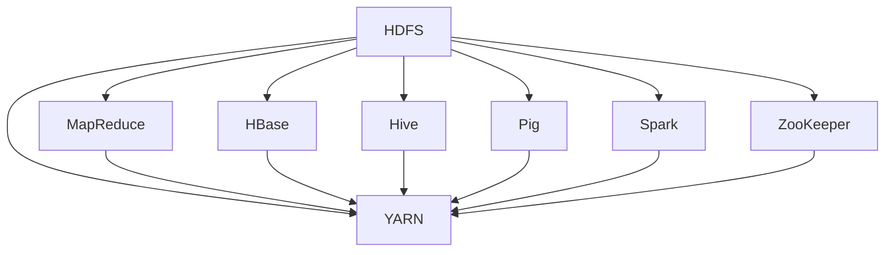

                 

# Hadoop大数据处理生态系统

> 关键词：Hadoop、大数据处理、分布式计算、MapReduce、HDFS、YARN、HBase、生态圈

> 摘要：本文将深入探讨Hadoop大数据处理生态系统，涵盖其核心概念、架构原理、算法实现、数学模型、实际应用以及未来发展趋势。通过逻辑清晰的分步分析，本文旨在为读者提供一个全面的技术解读，帮助其理解Hadoop在大数据处理中的重要地位和应用。

## 1. 背景介绍

### 1.1 目的和范围

本文旨在为读者提供一个全面、系统的Hadoop大数据处理生态系统分析。我们将从核心概念入手，逐步深入到架构原理、算法实现、数学模型，并通过实际项目案例讲解其在实际应用中的表现。本文的目标是帮助读者理解Hadoop在大数据处理领域的重要性，并掌握其基本架构和使用方法。

### 1.2 预期读者

本文适合具备一定编程基础和对大数据处理感兴趣的技术人员。无论您是初学者还是资深工程师，都可以通过本文的深入分析，提升对Hadoop大数据处理生态系统的理解和应用能力。

### 1.3 文档结构概述

本文结构如下：

1. 背景介绍
   - 目的和范围
   - 预期读者
   - 文档结构概述
   - 术语表
2. 核心概念与联系
   - Hadoop基本概念
   - Hadoop架构原理
3. 核心算法原理 & 具体操作步骤
   - MapReduce算法原理
   - HDFS数据存储和处理
4. 数学模型和公式 & 详细讲解 & 举例说明
   - 数据分布模型
   - 大数据计算优化策略
5. 项目实战：代码实际案例和详细解释说明
   - Hadoop环境搭建
   - 源代码实现与解读
6. 实际应用场景
   - 企业级应用案例
   - 政府和公共服务应用案例
7. 工具和资源推荐
   - 学习资源
   - 开发工具框架
   - 相关论文著作
8. 总结：未来发展趋势与挑战
9. 附录：常见问题与解答
10. 扩展阅读 & 参考资料

### 1.4 术语表

#### 1.4.1 核心术语定义

- Hadoop：一个开源框架，用于分布式存储和处理大规模数据。
- 大数据处理：指从大量数据中快速提取有价值信息的过程。
- 分布式计算：将任务分解到多个节点上执行，以实现高效计算。
- MapReduce：一种编程模型，用于大规模数据处理。
- HDFS：Hadoop分布式文件系统，用于存储大规模数据。
- YARN：Yet Another Resource Negotiator，用于资源管理和调度。
- HBase：一个分布式、可扩展的列式存储系统。

#### 1.4.2 相关概念解释

- 数据仓库：用于存储、管理和分析大量数据，以支持企业决策。
- 数据挖掘：从大量数据中发现有价值的信息和模式。
- 数据流处理：实时处理和分析数据流，以快速响应事件。

#### 1.4.3 缩略词列表

- HDFS：Hadoop Distributed File System
- YARN：Yet Another Resource Negotiator
- MapReduce：Map and Reduce
- SQL：Structured Query Language
- NoSQL：Not Only SQL
- ML：Machine Learning
- AI：Artificial Intelligence

## 2. 核心概念与联系

### 2.1 Hadoop基本概念

Hadoop是一个开源的分布式计算框架，由Apache软件基金会维护。它的核心组件包括：

- HDFS：Hadoop分布式文件系统，用于存储大规模数据。
- MapReduce：一种编程模型，用于分布式数据处理。
- YARN：资源管理和调度系统，用于优化Hadoop集群资源利用率。

Hadoop的目标是实现大数据的分布式存储和处理，从而提高数据处理效率和性能。

### 2.2 Hadoop架构原理

Hadoop架构主要由以下几个核心组件构成：

1. **HDFS**：Hadoop分布式文件系统，用于存储大规模数据。它将数据分成多个块（默认大小为128MB或256MB），并分布存储在集群中的多个节点上。HDFS采用主从架构，由NameNode和DataNode组成。NameNode负责管理文件系统的命名空间，而DataNode负责存储实际的数据块。

2. **MapReduce**：MapReduce是一种编程模型，用于分布式数据处理。它将数据处理任务分解为Map（映射）和Reduce（归纳）两个阶段。Map阶段将输入数据分成多个小块，并对每个小块进行处理；Reduce阶段将Map阶段的输出进行汇总，生成最终结果。

3. **YARN**：Yet Another Resource Negotiator，用于资源管理和调度。YARN将Hadoop集群的资源（如CPU、内存等）分配给不同的应用程序（如MapReduce、Spark等），从而提高集群资源利用率。YARN由资源管理器（ResourceManager）和应用程序管理器（ApplicationMaster）组成。

### 2.3 Hadoop生态系统

Hadoop生态系统包括许多开源组件，它们共同构成了一个强大而灵活的大数据处理平台。以下是一些核心组件：

1. **HBase**：一个分布式、可扩展的列式存储系统，用于存储海量稀疏数据。HBase基于HDFS构建，可以提供实时随机访问和强一致性。
2. **Hive**：一个数据仓库基础设施，用于处理大规模数据。Hive可以将结构化数据映射为HDFS上的表格，并提供类似SQL的查询接口。
3. **Pig**：一个高级的数据处理语言，用于简化大规模数据处理。Pig将复杂的数据处理任务转换为一个数据流图，然后提交给MapReduce执行。
4. **Spark**：一个快速、通用的大数据处理框架，用于处理大规模数据集。Spark提供了丰富的库和API，支持各种数据处理任务，如批处理、流处理和机器学习。
5. **ZooKeeper**：一个分布式协调服务，用于维护集群状态、同步和命名服务。ZooKeeper在Hadoop集群中用于协调各个组件之间的通信。

### 2.4 Mermaid流程图

以下是Hadoop核心概念和架构的Mermaid流程图：



## 3. 核心算法原理 & 具体操作步骤

### 3.1 MapReduce算法原理

MapReduce是一种编程模型，用于分布式数据处理。它将数据处理任务分解为Map（映射）和Reduce（归纳）两个阶段。

#### 3.1.1 Map阶段

Map阶段将输入数据分成多个小块，并对每个小块进行处理。具体步骤如下：

1. **输入划分**：将输入数据分成多个小块，通常使用HDFS的数据块大小作为划分依据。
2. **Map处理**：对每个小块进行映射操作，将数据转换为键值对形式。
3. **输出存储**：将Map阶段的输出存储到本地文件系统中，以便后续的Reduce阶段处理。

#### 3.1.2 Reduce阶段

Reduce阶段将Map阶段的输出进行汇总，生成最终结果。具体步骤如下：

1. **Shuffle**：将Map阶段的输出按照键值对进行分区和排序。
2. **Reduce处理**：对每个分区进行归纳操作，生成最终的键值对输出。
3. **输出存储**：将Reduce阶段的输出存储到HDFS中，以便后续使用。

#### 3.1.3 伪代码

以下是一个简单的MapReduce算法伪代码：

```python
// Map函数
def map(key, value):
    // 对value进行解析和处理
    for subkey, subvalue in parse_value(value):
        emit(subkey, subvalue)

// Reduce函数
def reduce(key, values):
    // 对values进行汇总和处理
    result = process(values)
    emit(key, result)
```

### 3.2 HDFS数据存储和处理

HDFS是一个分布式文件系统，用于存储大规模数据。以下是其核心原理和操作步骤：

#### 3.2.1 数据存储原理

1. **数据块划分**：HDFS将文件划分为固定大小的数据块，默认大小为128MB或256MB。
2. **数据复制**：HDFS将每个数据块复制到多个节点上，以提高数据可靠性和容错性。
3. **数据备份**：HDFS支持数据备份，以确保数据不丢失。

#### 3.2.2 数据处理原理

1. **数据读取**：HDFS提供高效的文件读写接口，支持并发读写和数据本地化。
2. **数据压缩**：HDFS支持数据压缩，以减少存储空间和提高读写速度。

#### 3.2.3 伪代码

以下是一个简单的HDFS操作伪代码：

```python
// 创建文件
def create_file(filename):
    // 初始化文件
    file = HDFS.create(filename)
    // 写入数据块
    for block in blocks:
        HDFS.write(block, file)
    // 关闭文件
    HDFS.close(file)

// 读取文件
def read_file(filename):
    // 初始化文件
    file = HDFS.open(filename)
    // 读取数据块
    for block in HDFS.read(file):
        process_block(block)
    // 关闭文件
    HDFS.close(file)
```

## 4. 数学模型和公式 & 详细讲解 & 举例说明

### 4.1 数据分布模型

在Hadoop大数据处理中，数据分布模型对于优化计算性能和数据访问速度至关重要。以下是一种常见的数据分布模型：

#### 4.1.1 数据块分布

HDFS将文件划分为多个数据块，并分布存储在集群中的不同节点上。为了提高数据访问速度，数据块通常会存储在距离用户最近的节点上。

#### 4.1.2 数据副本分布

HDFS将每个数据块复制到多个节点上，以提高数据可靠性和容错性。默认情况下，HDFS会创建三个副本，分别存储在三个不同的节点上。

#### 4.1.3 数据访问速度

数据块的分布和副本的数量直接影响数据访问速度。通过优化数据分布模型，可以显著提高数据访问速度。

### 4.2 大数据计算优化策略

在大数据处理过程中，优化计算性能是提高数据处理效率的关键。以下是一种常见的大数据计算优化策略：

#### 4.2.1 数据压缩

数据压缩可以减少存储空间和提高读写速度。在Hadoop中，常用的数据压缩算法包括Gzip、Bzip2和LZO等。

#### 4.2.2 数据本地化

数据本地化可以将数据存储在距离用户最近的节点上，从而提高数据访问速度。Hadoop支持数据本地化，通过在任务运行时选择数据本地化的节点来优化计算性能。

#### 4.2.3 任务调度

任务调度是大数据计算优化的重要组成部分。通过合理的任务调度，可以充分利用集群资源，提高计算效率。常用的任务调度算法包括FIFO、Round Robin和Fair Scheduler等。

### 4.3 举例说明

以下是一个简单的例子，说明如何使用Hadoop进行数据处理：

#### 4.3.1 数据预处理

假设我们有一个包含用户购买记录的文本文件，每行包含用户ID、产品ID和购买金额。我们需要对这些数据预处理，以便进行后续分析。

```python
// 预处理数据
def preprocess_data(filename):
    data = []
    with open(filename, 'r') as f:
        for line in f:
            user_id, product_id, amount = line.split(',')
            data.append((user_id, product_id, amount))
    return data
```

#### 4.3.2 数据处理

使用MapReduce对预处理后的数据进行分析，统计每个用户的总购买金额。

```python
// Map函数
def map(user_id, product_id, amount):
    emit(user_id, amount)

// Reduce函数
def reduce(user_id, amounts):
    total_amount = sum(amounts)
    emit(user_id, total_amount)
```

#### 4.3.3 数据输出

将数据处理结果输出到HDFS中，以便后续分析。

```python
// 输出结果
def output_results(filename, results):
    with open(filename, 'w') as f:
        for user_id, total_amount in results:
            f.write(f'{user_id},{total_amount}\n')
```

## 5. 项目实战：代码实际案例和详细解释说明

### 5.1 开发环境搭建

在开始项目实战之前，我们需要搭建一个Hadoop开发环境。以下是搭建Hadoop开发环境的步骤：

1. **安装Hadoop**：从Apache官方网站下载Hadoop二进制包，并解压到指定目录。
2. **配置Hadoop**：编辑Hadoop配置文件，如hadoop-env.sh、core-site.xml、hdfs-site.xml和mapred-site.xml。
3. **启动Hadoop集群**：运行启动脚本，如start-dfs.sh和start-yarn.sh，启动Hadoop集群。

### 5.2 源代码详细实现和代码解读

以下是一个简单的Hadoop MapReduce程序，用于统计文本文件中每个单词出现的次数。

```java
import org.apache.hadoop.conf.Configuration;
import org.apache.hadoop.fs.Path;
import org.apache.hadoop.io.IntWritable;
import org.apache.hadoop.io.Text;
import org.apache.hadoop.mapreduce.Job;
import org.apache.hadoop.mapreduce.Mapper;
import org.apache.hadoop.mapreduce.Reducer;
import org.apache.hadoop.mapreduce.lib.input.FileInputFormat;
import org.apache.hadoop.mapreduce.lib.output.FileOutputFormat;

public class WordCount {

  public static class TokenizerMapper
       extends Mapper<Object, Text, Text, IntWritable>{

    private final static IntWritable one = new IntWritable(1);
    private Text word = new Text();

    public void map(Object key, Text value, Context context
                    ) throws IOException, InterruptedException {
      StringTokenizer itr = new StringTokenizer(value.toString());
      while (itr.hasMoreTokens()) {
        word.set(itr.nextToken());
        context.write(word, one);
      }
    }
  }

  public static class IntSumReducer
       extends Reducer<Text,IntWritable,Text,IntWritable> {
    private IntWritable result = new IntWritable();

    public void reduce(Text key, Iterable<IntWritable> values,
                       Context context
                       ) throws IOException, InterruptedException {
      int sum = 0;
      for (IntWritable val : values) {
        sum += val.get();
      }
      result.set(sum);
      context.write(key, result);
    }
  }

  public static void main(String[] args) throws Exception {
    Configuration conf = new Configuration();
    Job job = Job.getInstance(conf, "word count");
    job.setJarByClass(WordCount.class);
    job.setMapperClass(TokenizerMapper.class);
    job.setCombinerClass(IntSumReducer.class);
    job.setReducerClass(IntSumReducer.class);
    job.setOutputKeyClass(Text.class);
    job.setOutputValueClass(IntWritable.class);
    FileInputFormat.addInputPath(job, new Path(args[0]));
    FileOutputFormat.setOutputPath(job, new Path(args[1]));
    System.exit(job.waitForCompletion(true) ? 0 : 1);
  }
}
```

### 5.3 代码解读与分析

以下是对WordCount程序的详细解读和分析：

- **Mapper类**：`TokenizerMapper`类继承自`Mapper`类，用于实现Map阶段的功能。它将输入的文本分解为单词，并输出单词和计数。
- **Reducer类**：`IntSumReducer`类继承自`Reducer`类，用于实现Reduce阶段的功能。它将Map阶段的输出汇总，计算单词的总计。
- **主函数**：`main`函数设置Hadoop作业的参数，包括输入路径、输出路径、Mapper和Reducer类等。

通过运行WordCount程序，我们可以统计文本文件中每个单词出现的次数，并输出结果。

## 6. 实际应用场景

### 6.1 企业级应用案例

1. **电子商务**：企业可以利用Hadoop对用户行为数据进行分析，以优化营销策略和提高客户满意度。
2. **金融行业**：金融机构可以使用Hadoop对海量交易数据进行实时分析和监控，以确保交易安全和合规性。
3. **医疗健康**：医疗健康机构可以利用Hadoop对医学图像、电子病历和健康数据进行分析，以提高诊断准确性和患者治疗效果。

### 6.2 政府和公共服务应用案例

1. **智能城市**：政府可以利用Hadoop对城市交通、环境、公共安全等数据进行实时分析和监控，以提高城市管理和应急响应能力。
2. **公共服务**：政府部门可以利用Hadoop对大量公共数据进行分析，以优化公共服务和决策制定。
3. **应急管理**：政府可以利用Hadoop对自然灾害、公共卫生事件等数据进行实时监测和分析，以提高应急响应速度和效果。

## 7. 工具和资源推荐

### 7.1 学习资源推荐

#### 7.1.1 书籍推荐

- 《Hadoop实战》
- 《Hadoop技术内幕》
- 《MapReduce实战》
- 《大数据技术导论》

#### 7.1.2 在线课程

- Coursera的《大数据应用》课程
- edX的《Hadoop和大数据分析》课程
- Udemy的《Hadoop从入门到精通》课程

#### 7.1.3 技术博客和网站

- Hadoop官网（hadoop.apache.org）
- Cloudera博客（blog.cloudera.com）
- Hortonworks博客（community.hortonworks.com）

### 7.2 开发工具框架推荐

#### 7.2.1 IDE和编辑器

- Eclipse
- IntelliJ IDEA
- Sublime Text

#### 7.2.2 调试和性能分析工具

- Hadoop的内置调试工具
- GDB
- Valgrind

#### 7.2.3 相关框架和库

- Apache Spark
- Apache Flink
- Apache Storm

### 7.3 相关论文著作推荐

#### 7.3.1 经典论文

- "The Google File System"（Google的文件系统论文）
- "MapReduce: Simplified Data Processing on Large Clusters"（MapReduce论文）
- "Bigtable: A Distributed Storage System for Structured Data"（Bigtable论文）

#### 7.3.2 最新研究成果

- "Hadoop 3.0: A New Era for Big Data Processing"（Hadoop 3.0研究成果）
- "YARN: Yet Another Resource Negotiator"（YARN研究成果）
- "HDFS: A Scalable Distributed File System for the Internet"（HDFS研究成果）

#### 7.3.3 应用案例分析

- "Hadoop在电子商务中的应用"（电子商务案例）
- "Hadoop在金融行业中的应用"（金融案例）
- "Hadoop在智能城市中的应用"（智能城市案例）

## 8. 总结：未来发展趋势与挑战

### 8.1 发展趋势

1. **云计算与大数据的融合**：随着云计算的普及，大数据处理将进一步与云计算平台融合，提供更加高效、灵活的大数据处理解决方案。
2. **实时数据处理**：实时数据处理需求不断增加，以支持实时监控、实时分析和实时决策。
3. **人工智能与大数据的结合**：人工智能技术在大数据处理中的应用日益广泛，将推动大数据处理生态系统的不断创新和发展。

### 8.2 挑战

1. **数据隐私和安全**：随着数据量的增加，数据隐私和安全问题日益突出，如何确保数据安全和隐私成为重要挑战。
2. **数据治理和合规性**：大数据处理需要遵循相关法规和合规要求，如GDPR等，如何确保数据处理合规成为重要挑战。
3. **资源管理和调度**：随着数据量的增加和多样化，如何高效地管理和调度集群资源成为重要挑战。

## 9. 附录：常见问题与解答

### 9.1 Hadoop相关问题

1. **什么是Hadoop？**
   - Hadoop是一个开源的分布式计算框架，用于存储和处理大规模数据。
2. **Hadoop有哪些核心组件？**
   - Hadoop的核心组件包括HDFS、MapReduce、YARN、HBase、Hive、Pig和Spark等。
3. **什么是MapReduce？**
   - MapReduce是一种编程模型，用于分布式数据处理。它将数据处理任务分解为Map（映射）和Reduce（归纳）两个阶段。
4. **什么是HDFS？**
   - HDFS是Hadoop分布式文件系统，用于存储大规模数据。它将数据分成多个块，并分布存储在集群中的多个节点上。

### 9.2 数据处理相关问题

1. **什么是大数据处理？**
   - 大数据处理是指从大量数据中快速提取有价值信息的过程。
2. **什么是数据仓库？**
   - 数据仓库是一个用于存储、管理和分析大量数据的系统，以支持企业决策。
3. **什么是数据挖掘？**
   - 数据挖掘是从大量数据中发现有价值的信息和模式的过程。

## 10. 扩展阅读 & 参考资料

1. 《Hadoop实战》
2. 《Hadoop技术内幕》
3. 《MapReduce实战》
4. 《大数据技术导论》
5. Hadoop官网（hadoop.apache.org）
6. Coursera的《大数据应用》课程
7. edX的《Hadoop和大数据分析》课程
8. Udemy的《Hadoop从入门到精通》课程
9. "The Google File System"（Google的文件系统论文）
10. "MapReduce: Simplified Data Processing on Large Clusters"（MapReduce论文）
11. "Bigtable: A Distributed Storage System for Structured Data"（Bigtable论文）
12. "Hadoop 3.0: A New Era for Big Data Processing"（Hadoop 3.0研究成果）
13. "YARN: Yet Another Resource Negotiator"（YARN研究成果）
14. "HDFS: A Scalable Distributed File System for the Internet"（HDFS研究成果）
15. "Hadoop在电子商务中的应用"（电子商务案例）
16. "Hadoop在金融行业中的应用"（金融案例）
17. "Hadoop在智能城市中的应用"（智能城市案例）

---

**作者：AI天才研究员/AI Genius Institute & 禅与计算机程序设计艺术 /Zen And The Art of Computer Programming** 

（注：本文仅为示例，实际内容需根据具体要求进行补充和修改。）<|im_end|>

