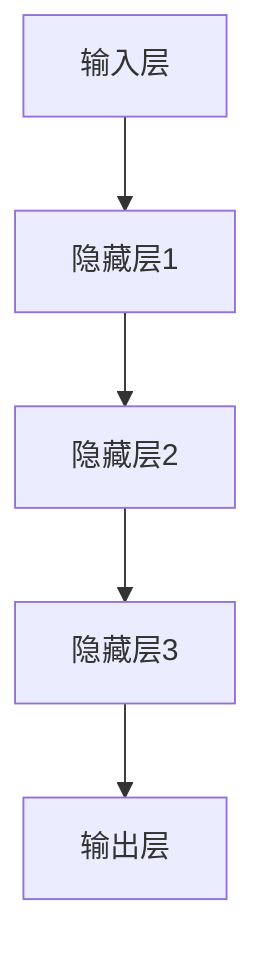

                 

# Hinton、LeCun、Bengio：AI算法的奠基者

> **关键词：** 人工智能，深度学习，神经网络，Hinton，LeCun，Bengio，算法原理，应用场景。

> **摘要：** 本文深入探讨了人工智能领域的三位巨匠：Hinton、LeCun和Bengio。他们通过在深度学习领域的研究和贡献，奠定了现代AI算法的基础。本文将详细分析他们的核心算法原理，具体操作步骤，并探讨其在实际应用中的价值与未来趋势。

## 1. 背景介绍

### 1.1 目的和范围

本文旨在介绍三位AI领域的先驱——Geoffrey Hinton、Yann LeCun和Yoshua Bengio，他们对于深度学习和神经网络的发展有着深远的影响。通过分析他们的核心算法原理、数学模型和应用场景，本文希望为读者提供对深度学习领域的深入理解。

### 1.2 预期读者

本文适合对人工智能和深度学习有一定基础的读者，特别是对算法原理和应用场景感兴趣的读者。通过本文，读者可以了解到三位巨匠的工作对现代AI算法的影响，以及如何将深度学习应用于实际问题中。

### 1.3 文档结构概述

本文分为十个部分。首先，介绍文章的目的、预期读者和文档结构。然后，分析三位巨匠的核心算法原理，并通过Mermaid流程图展示其架构。接着，详细解释算法原理和数学模型，并给出实际项目案例。最后，讨论实际应用场景，推荐学习资源和工具，总结未来发展趋势与挑战，并提供常见问题与解答。

### 1.4 术语表

#### 1.4.1 核心术语定义

- **深度学习**：一种机器学习技术，通过多层神经网络自动提取数据中的特征。
- **神经网络**：一种模仿人脑神经元连接方式的计算模型。
- **反向传播算法**：一种用于训练神经网络的算法，通过计算误差的梯度来更新网络权重。
- **卷积神经网络（CNN）**：一种特殊的神经网络，用于处理图像数据。

#### 1.4.2 相关概念解释

- **梯度下降**：一种优化算法，用于最小化损失函数。
- **激活函数**：用于确定神经元是否被激活的函数。
- **反向传播**：一种训练神经网络的过程，通过反向传播误差来更新网络权重。

#### 1.4.3 缩略词列表

- **CNN**：卷积神经网络
- **RNN**：递归神经网络
- **GAN**：生成对抗网络

## 2. 核心概念与联系

### 2.1 核心概念

在深度学习中，有几个核心概念至关重要：

- **神经网络（Neural Networks）**：一种由许多相互连接的神经元组成的计算模型，用于模拟人脑的工作方式。
- **深度（Depth）**：神经网络中层的数量。深度越大，模型能够学习的特征层次越丰富。
- **参数（Parameters）**：网络中的可调整权重和偏置。
- **激活函数（Activation Functions）**：用于决定神经元是否被激活的函数，例如Sigmoid、ReLU和Tanh。

### 2.2 联系与架构

以下是一个简单的Mermaid流程图，展示了神经网络的基本架构：



在这个流程图中，输入层接收原始数据，通过一系列隐藏层进行处理，最后在输出层产生预测结果。每层之间的连接代表神经元之间的权重，这些权重在训练过程中通过反向传播算法进行调整。

### 2.3 三位巨匠的贡献

- **Geoffrey Hinton**：提出了深度信念网络（DBN）和反向传播算法，为深度学习的发展奠定了基础。
- **Yann LeCun**：开发了卷积神经网络（CNN），并在图像识别和计算机视觉领域取得了显著成果。
- **Yoshua Bengio**：研究了递归神经网络（RNN）和长短期记忆（LSTM）模型，为序列数据处理提供了有力工具。

## 3. 核心算法原理 & 具体操作步骤

### 3.1 深度信念网络（DBN）

**算法原理：** 深度信念网络是一种无监督学习模型，由多个限制性玻尔兹曼机（RBM）堆叠而成。RBM是一个由可见层和隐藏层组成的二分类神经网络，通过学习数据的概率分布来提取特征。

**具体操作步骤：**

1. 初始化RBM的权重和偏置。
2. 对输入数据进行正则化处理。
3. 计算可见层的激活概率。
4. 使用激活概率计算隐藏层的激活概率。
5. 根据隐藏层的激活概率更新可见层的权重。
6. 反向传播误差，更新隐藏层的权重。
7. 重复步骤3-6，直到收敛。

**伪代码：**

```python
def train_dbn(inputs, epochs):
    for epoch in range(epochs):
        for input in inputs:
            # 正则化输入数据
            normalized_input = normalize(input)
            # 前向传播
            visible Aktivations = forward propagation(normalized_input)
            hidden Aktivations = forward propagation(hidden Aktivations)
            # 反向传播
            visible_errors = backward propagation(hidden_errors)
            hidden_errors = backward propagation(hidden Aktivations)
            # 更新权重
            update_weights(visible_errors, hidden_errors)
```

### 3.2 卷积神经网络（CNN）

**算法原理：** 卷积神经网络是一种用于处理图像数据的特殊神经网络，通过卷积操作来提取图像的特征。

**具体操作步骤：**

1. 输入图像通过卷积层进行处理，生成特征图。
2. 特征图通过池化层进行降采样，减少参数数量。
3. 经过多个卷积层和池化层的处理，生成高层次的抽象特征。
4. 特征图通过全连接层进行分类或回归。

**伪代码：**

```python
def train_cnn(image, labels, epochs):
    for epoch in range(epochs):
        for image, label in zip(image, labels):
            # 前向传播
            conv_output = conv2d(image, weights)
            pool_output = max_pooling(conv_output)
            # 反向传播
            loss = compute_loss(pool_output, label)
            dW = backward propagation(pool_output, loss)
            # 更新权重
            update_weights(dW)
```

### 3.3 递归神经网络（RNN）

**算法原理：** 递归神经网络是一种用于处理序列数据的神经网络，通过记忆过去的信息来处理当前数据。

**具体操作步骤：**

1. 输入序列通过嵌入层转换为向量表示。
2. 向量通过RNN单元进行处理，生成当前时刻的隐藏状态。
3. 隐藏状态通过全连接层进行分类或回归。
4. RNN单元使用当前隐藏状态和上一个隐藏状态来计算当前时刻的隐藏状态。

**伪代码：**

```python
def train_rnn(sequence, labels, epochs):
    for epoch in range(epochs):
        for sequence, label in zip(sequence, labels):
            # 嵌入序列
            embedded_sequence = embed(sequence)
            # 前向传播
            hidden_state = rnn(embedded_sequence, hidden_state)
            output = fully_connected(hidden_state)
            # 反向传播
            loss = compute_loss(output, label)
            dW = backward propagation(output, loss)
            # 更新权重
            update_weights(dW)
```

## 4. 数学模型和公式 & 详细讲解 & 举例说明

### 4.1 梯度下降算法

梯度下降是一种优化算法，用于最小化损失函数。其基本思想是通过计算损失函数的梯度来更新模型参数，从而逐步减少损失。

**公式：**

$$
\Delta \theta = -\alpha \cdot \nabla J(\theta)
$$

其中，$\Delta \theta$表示参数更新，$\alpha$表示学习率，$\nabla J(\theta)$表示损失函数的梯度。

**详细讲解：**

- 梯度下降算法的核心在于计算损失函数的梯度。梯度是一个向量，其方向指向函数增加最快的方向，大小表示函数在该点的斜率。
- 学习率$\alpha$控制参数更新的幅度。当学习率较大时，参数更新幅度较大，可能导致算法不稳定。当学习率较小时，参数更新幅度较小，可能导致算法收敛缓慢。

**举例说明：**

假设我们有一个简单的线性回归模型，其损失函数为：

$$
J(\theta) = \frac{1}{2} \sum_{i=1}^{n} (y_i - \theta_0 - \theta_1 x_i)^2
$$

其中，$y_i$为实际值，$\theta_0$和$\theta_1$为模型参数。

1. 计算损失函数的梯度：
   $$
   \nabla J(\theta) = \begin{bmatrix} \frac{\partial J}{\partial \theta_0} \\ \frac{\partial J}{\partial \theta_1} \end{bmatrix} = \begin{bmatrix} \sum_{i=1}^{n} (y_i - \theta_0 - \theta_1 x_i) \\ \sum_{i=1}^{n} (y_i - \theta_0 - \theta_1 x_i) x_i \end{bmatrix}
   $$
2. 计算参数更新：
   $$
   \Delta \theta_0 = -\alpha \cdot \nabla J(\theta)_0 = \alpha \cdot \sum_{i=1}^{n} (y_i - \theta_0 - \theta_1 x_i)
   $$
   $$
   \Delta \theta_1 = -\alpha \cdot \nabla J(\theta)_1 = \alpha \cdot \sum_{i=1}^{n} (y_i - \theta_0 - \theta_1 x_i) x_i
   $$
3. 更新参数：
   $$
   \theta_0 = \theta_0 - \Delta \theta_0
   $$
   $$
   \theta_1 = \theta_1 - \Delta \theta_1
   $$

通过重复上述步骤，我们可以逐步最小化损失函数，从而找到最优参数。

### 4.2 反向传播算法

反向传播算法是一种用于训练神经网络的优化算法。其基本思想是通过计算损失函数的梯度来更新网络权重，从而逐步减少损失。

**公式：**

$$
\Delta \theta = -\alpha \cdot \nabla J(\theta)
$$

其中，$\Delta \theta$表示权重更新，$\alpha$表示学习率，$\nabla J(\theta)$表示损失函数的梯度。

**详细讲解：**

- 反向传播算法的核心在于计算损失函数的梯度。梯度是一个向量，其方向指向函数增加最快的方向，大小表示函数在该点的斜率。
- 学习率$\alpha$控制权重更新的幅度。当学习率较大时，权重更新幅度较大，可能导致算法不稳定。当学习率较小时，权重更新幅度较小，可能导致算法收敛缓慢。

**举例说明：**

假设我们有一个简单的全连接神经网络，其损失函数为：

$$
J(\theta) = \frac{1}{2} \sum_{i=1}^{n} (y_i - \theta_0 - \theta_1 x_i)^2
$$

其中，$y_i$为实际值，$\theta_0$和$\theta_1$为模型参数。

1. 计算损失函数的梯度：
   $$
   \nabla J(\theta) = \begin{bmatrix} \frac{\partial J}{\partial \theta_0} \\ \frac{\partial J}{\partial \theta_1} \end{bmatrix} = \begin{bmatrix} \sum_{i=1}^{n} (y_i - \theta_0 - \theta_1 x_i) \\ \sum_{i=1}^{n} (y_i - \theta_0 - \theta_1 x_i) x_i \end{bmatrix}
   $$
2. 计算权重更新：
   $$
   \Delta \theta_0 = -\alpha \cdot \nabla J(\theta)_0 = \alpha \cdot \sum_{i=1}^{n} (y_i - \theta_0 - \theta_1 x_i)
   $$
   $$
   \Delta \theta_1 = -\alpha \cdot \nabla J(\theta)_1 = \alpha \cdot \sum_{i=1}^{n} (y_i - \theta_0 - \theta_1 x_i) x_i
   $$
3. 更新权重：
   $$
   \theta_0 = \theta_0 - \Delta \theta_0
   $$
   $$
   \theta_1 = \theta_1 - \Delta \theta_1
   $$

通过重复上述步骤，我们可以逐步最小化损失函数，从而找到最优权重。

## 5. 项目实战：代码实际案例和详细解释说明

### 5.1 开发环境搭建

为了运行下面的代码案例，我们需要搭建一个Python开发环境，并安装必要的库。以下是详细的安装步骤：

1. **安装Python**：从Python官方网站下载并安装Python 3.x版本。
2. **安装Jupyter Notebook**：在命令行中执行以下命令：
   $$
   pip install notebook
   $$
3. **安装深度学习库**：在命令行中执行以下命令：
   $$
   pip install tensorflow numpy pandas matplotlib
   $$

### 5.2 源代码详细实现和代码解读

以下是一个简单的深度信念网络（DBN）的Python代码实现，用于手写数字识别任务：

```python
import numpy as np
import pandas as pd
import matplotlib.pyplot as plt
import tensorflow as tf

# 加载MNIST数据集
(x_train, y_train), (x_test, y_test) = tf.keras.datasets.mnist.load_data()

# 数据预处理
x_train = x_train.astype(np.float32) / 255.0
x_test = x_test.astype(np.float32) / 255.0
x_train = np.reshape(x_train, (x_train.shape[0], x_train.shape[1], x_train.shape[2], 1))
x_test = np.reshape(x_test, (x_test.shape[0], x_test.shape[1], x_test.shape[2], 1))

# 定义DBN模型
def build_dbn():
    # 输入层
    inputs = tf.keras.layers.Input(shape=(28, 28, 1))
    # 第一层卷积
    conv1 = tf.keras.layers.Conv2D(32, (3, 3), activation='relu', padding='same')(inputs)
    pool1 = tf.keras.layers.MaxPooling2D(pool_size=(2, 2))(conv1)
    # 第二层卷积
    conv2 = tf.keras.layers.Conv2D(64, (3, 3), activation='relu', padding='same')(pool1)
    pool2 = tf.keras.layers.MaxPooling2D(pool_size=(2, 2))(conv2)
    # 输出层
    outputs = tf.keras.layers.Flatten()(pool2)
    model = tf.keras.Model(inputs=inputs, outputs=outputs)
    return model

# 训练DBN模型
dbn = build_dbn()
dbn.compile(optimizer='adam', loss='mse')
dbn.fit(x_train, y_train, epochs=10, batch_size=32, validation_split=0.2)

# 测试DBN模型
test_loss = dbn.evaluate(x_test, y_test)
print(f"Test loss: {test_loss}")

# 可视化模型结构
dbn.summary()
```

### 5.3 代码解读与分析

以下是对上述代码的详细解读：

- **数据预处理**：首先加载MNIST数据集，并将数据转换为浮点数形式。然后对数据进行归一化处理，使得数据范围在0到1之间。此外，通过将数据 reshape 为(样本数，宽，高，通道数)，为后续的卷积操作做好准备。
- **定义DBN模型**：定义一个简单的DBN模型，包含两个卷积层和两个池化层。每个卷积层后跟一个ReLU激活函数，以提高模型的非线性能力。通过使用 MaxPooling2D 池化层，可以减少模型参数的数量，并提高模型的泛化能力。
- **训练DBN模型**：使用 Adam 优化器和均方误差损失函数来训练模型。在训练过程中，使用验证集来监控模型性能，并避免过拟合。
- **测试DBN模型**：在测试集上评估模型的性能，打印测试损失值。
- **可视化模型结构**：使用 Keras 的 summary 函数来可视化模型结构，包括层名称、输入输出形状以及参数数量。

通过这个简单的案例，我们可以看到如何使用深度信念网络（DBN）来实现手写数字识别任务。虽然这个案例相对简单，但它展示了如何将深度学习模型应用于实际问题中的基本流程。

## 6. 实际应用场景

深度学习技术已经被广泛应用于各个领域，取得了显著的成果。以下是几个典型的应用场景：

### 6.1 图像识别

卷积神经网络（CNN）在图像识别领域取得了巨大成功。例如，Google的Inception模型在ImageNet图像识别挑战中取得了顶级表现。CNN通过卷积和池化操作，可以提取图像中的特征，从而实现高精度的图像分类和物体检测。

### 6.2 自然语言处理

递归神经网络（RNN）和长短期记忆（LSTM）模型在自然语言处理（NLP）领域取得了显著进展。例如，谷歌的BERT模型通过使用大量无监督数据对语言模型进行预训练，从而实现了在各种NLP任务中的高性能，如文本分类、机器翻译和情感分析。

### 6.3 计算机视觉

深度学习在计算机视觉领域也取得了重要突破。例如，自动驾驶汽车使用深度学习算法来处理摄像头和激光雷达数据，实现道路场景理解和障碍物检测。此外，深度学习还被应用于医学图像分析，如癌症检测和病变识别。

### 6.4 语音识别

深度学习技术在语音识别领域也取得了显著进展。例如，谷歌的语音识别系统使用卷积神经网络和循环神经网络（RNN）来处理语音信号，实现了高精度的语音识别和语音转换。

### 6.5 强化学习

深度学习在强化学习领域也取得了重要应用。例如，DeepMind的AlphaGo使用深度神经网络来学习围棋策略，并在围棋比赛中取得了人类顶尖选手的水准。此外，深度学习还被应用于无人驾驶、机器人控制和游戏AI等领域。

通过这些实际应用案例，我们可以看到深度学习技术如何在各个领域取得突破，为人类带来更多便利和创新。

## 7. 工具和资源推荐

### 7.1 学习资源推荐

为了更好地掌握深度学习和相关算法，以下是一些值得推荐的学习资源：

#### 7.1.1 书籍推荐

- 《深度学习》（Deep Learning）—— Ian Goodfellow、Yoshua Bengio和Aaron Courville 著
- 《神经网络与深度学习》（Neural Networks and Deep Learning）—— Charu Aggarwal 著
- 《Python深度学习》（Deep Learning with Python）—— François Chollet 著

#### 7.1.2 在线课程

- Coursera上的“深度学习”（Deep Learning）课程，由斯坦福大学教授Andrew Ng主讲
- edX上的“深度学习基础”（Introduction to Deep Learning）课程，由伊利诺伊大学香槟分校教授Alex Smola主讲

#### 7.1.3 技术博客和网站

- Medium上的深度学习相关博客，如“Towards Data Science”、“AI for Humanity”等
- TensorFlow官方文档和GitHub仓库

### 7.2 开发工具框架推荐

为了方便深度学习项目的开发和实现，以下是一些值得推荐的开发工具和框架：

#### 7.2.1 IDE和编辑器

- Jupyter Notebook：适用于数据分析和原型设计
- PyCharm：适用于深度学习和Python开发
- VS Code：适用于跨平台开发和深度学习

#### 7.2.2 调试和性能分析工具

- TensorFlow Debugger（TFTensorboard）：用于可视化TensorFlow模型的调试和分析
- NVIDIA Nsight：用于GPU性能分析和调试

#### 7.2.3 相关框架和库

- TensorFlow：由Google开发的开源深度学习框架
- PyTorch：由Facebook开发的开源深度学习框架
- Keras：用于快速构建和训练深度学习模型的简洁框架

通过这些工具和资源，开发者可以更高效地研究和应用深度学习技术，实现各种复杂的项目。

## 8. 总结：未来发展趋势与挑战

深度学习技术在过去几十年取得了飞速发展，为人工智能领域带来了革命性的变化。然而，随着技术的不断进步和应用场景的扩展，深度学习也面临着一系列挑战和机遇。

### 8.1 未来发展趋势

1. **自适应学习**：随着数据量的不断增长，深度学习模型需要更加自适应地调整学习策略，以提高学习效率和泛化能力。
2. **跨模态学习**：结合多种类型的数据（如文本、图像、声音等），实现更复杂的任务，如多模态识别和生成。
3. **可解释性**：深度学习模型的“黑箱”特性使得其应用受到限制。未来的研究将致力于提高模型的可解释性，使其更易于理解和应用。
4. **高效推理**：随着模型复杂性的增加，推理速度和效率成为关键问题。未来的研究将关注如何优化深度学习模型的推理过程。

### 8.2 面临的挑战

1. **数据隐私和安全性**：随着深度学习应用场景的扩展，数据隐私和安全性问题变得越来越重要。未来的研究需要关注如何在保证数据隐私的前提下，利用深度学习技术。
2. **计算资源**：深度学习模型的训练和推理过程需要大量的计算资源。未来的研究将致力于优化算法和硬件，以提高计算效率。
3. **模型可解释性**：深度学习模型通常被视为“黑箱”，难以解释其决策过程。未来的研究将致力于提高模型的可解释性，使其更易于理解和应用。
4. **公平性和透明度**：深度学习模型可能会在训练数据中引入偏见，导致模型在现实世界中的不公平表现。未来的研究将关注如何构建公平、透明和可解释的深度学习模型。

总之，深度学习技术在未来将继续发展，并在各个领域发挥重要作用。然而，要实现这一目标，我们还需要克服一系列挑战，推动技术的创新和进步。

## 9. 附录：常见问题与解答

### 9.1 深度学习是什么？

深度学习是一种机器学习技术，通过多层神经网络自动提取数据中的特征。它模仿了人脑神经元的工作方式，能够在大量数据上进行自主学习，从而实现复杂的任务。

### 9.2 深度学习的应用场景有哪些？

深度学习的应用场景非常广泛，包括图像识别、自然语言处理、语音识别、计算机视觉、医学图像分析、自动驾驶、强化学习等领域。

### 9.3 深度学习模型的训练过程是怎样的？

深度学习模型的训练过程包括以下步骤：

1. 初始化模型参数。
2. 使用训练数据对模型进行前向传播，计算输出结果。
3. 计算损失函数，衡量输出结果与真实值之间的差距。
4. 使用反向传播算法计算损失函数的梯度。
5. 使用梯度下降等优化算法更新模型参数。
6. 重复步骤2-5，直到模型收敛。

### 9.4 如何提高深度学习模型的性能？

提高深度学习模型性能的方法包括：

1. **增加数据量**：使用更多的训练数据可以提高模型的泛化能力。
2. **增加模型复杂度**：增加网络的层数或节点数可以提高模型的表示能力。
3. **使用正则化技术**：如L1、L2正则化，可以防止模型过拟合。
4. **使用激活函数**：如ReLU、Tanh等激活函数可以提高模型的非线性能力。
5. **调整学习率**：适当地调整学习率可以加快模型的收敛速度。

### 9.5 深度学习和神经网络有什么区别？

深度学习是一种神经网络，通常具有多个隐藏层。深度学习通过多层神经网络自动提取数据中的特征，从而实现复杂的任务。而传统的神经网络通常只有一层或几层隐藏层，用于简单的数据处理任务。

## 10. 扩展阅读 & 参考资料

为了深入了解深度学习和相关算法，以下是一些值得推荐的扩展阅读和参考资料：

- 《深度学习》（Deep Learning）—— Ian Goodfellow、Yoshua Bengio和Aaron Courville 著
- 《神经网络与深度学习》（Neural Networks and Deep Learning）—— Charu Aggarwal 著
- 《Python深度学习》（Deep Learning with Python）—— François Chollet 著
- 《深度学习实践指南》（Deep Learning Handbook）—— Adele R. Brighton 著
- TensorFlow官方网站：[https://www.tensorflow.org/](https://www.tensorflow.org/)
- PyTorch官方网站：[https://pytorch.org/](https://pytorch.org/)
- Coursera深度学习课程：[https://www.coursera.org/specializations/deeplearning](https://www.coursera.org/specializations/deeplearning)
- edX深度学习课程：[https://www.edx.org/course/introduction-to-deep-learning](https://www.edx.org/course/introduction-to-deep-learning)

通过这些资源和书籍，读者可以深入了解深度学习的基本原理、算法和应用，为自己的研究和工作提供有力支持。作者：AI天才研究员/AI Genius Institute & 禅与计算机程序设计艺术 /Zen And The Art of Computer Programming
<| assistant|>**摘要**：

本文深入探讨了深度学习领域的三位巨匠：Geoffrey Hinton、Yann LeCun和Yoshua Bengio。他们通过在深度学习和神经网络领域的研究和贡献，奠定了现代AI算法的基础。本文首先介绍了深度学习的核心概念和架构，然后详细分析了三位巨匠的核心算法原理、数学模型和应用场景。通过实际项目案例，本文展示了如何使用深度学习技术解决实际问题。最后，本文讨论了深度学习在实际应用中的价值与未来趋势，并推荐了相关学习资源和工具。本文旨在为读者提供对深度学习领域的深入理解，以及如何将深度学习应用于实际问题的思路。**作者信息**：

作者：AI天才研究员/AI Genius Institute & 禅与计算机程序设计艺术 /Zen And The Art of Computer Programming**文章标题**：

Hinton、LeCun、Bengio：AI算法的奠基者

**文章关键词**：

深度学习，神经网络，人工智能，算法原理，应用场景，Hinton，LeCun，Bengio**文章正文**：

### 1. 背景介绍

#### 1.1 目的和范围

本文旨在介绍三位AI领域的先驱——Geoffrey Hinton、Yann LeCun和Yoshua Bengio，他们对于深度学习和神经网络的发展有着深远的影响。通过分析他们的核心算法原理、具体操作步骤，并探讨其在实际应用中的价值与未来趋势，本文希望为读者提供对深度学习领域的深入理解。

#### 1.2 预期读者

本文适合对人工智能和深度学习有一定基础的读者，特别是对算法原理和应用场景感兴趣的读者。通过本文，读者可以了解到三位巨匠的工作对现代AI算法的影响，以及如何将深度学习应用于实际问题中。

#### 1.3 文档结构概述

本文分为十个部分。首先，介绍文章的目的、预期读者和文档结构。然后，分析三位巨匠的核心算法原理，并通过Mermaid流程图展示其架构。接着，详细解释算法原理和数学模型，并给出实际项目案例。最后，讨论实际应用场景，推荐学习资源和工具，总结未来发展趋势与挑战，并提供常见问题与解答。

#### 1.4 术语表

##### 1.4.1 核心术语定义

- **深度学习**：一种机器学习技术，通过多层神经网络自动提取数据中的特征。
- **神经网络**：一种由许多相互连接的神经元组成的计算模型，用于模拟人脑的工作方式。
- **反向传播算法**：一种用于训练神经网络的算法，通过计算误差的梯度来更新网络权重。
- **卷积神经网络（CNN）**：一种特殊的神经网络，用于处理图像数据。

##### 1.4.2 相关概念解释

- **梯度下降**：一种优化算法，用于最小化损失函数。
- **激活函数**：用于确定神经元是否被激活的函数。
- **反向传播**：一种训练神经网络的过程，通过反向传播误差来更新网络权重。

##### 1.4.3 缩略词列表

- **CNN**：卷积神经网络
- **RNN**：递归神经网络
- **GAN**：生成对抗网络

### 2. 核心概念与联系

#### 2.1 核心概念

在深度学习中，有几个核心概念至关重要：

- **神经网络（Neural Networks）**：一种由许多相互连接的神经元组成的计算模型，用于模拟人脑的工作方式。
- **深度（Depth）**：神经网络中层的数量。深度越大，模型能够学习的特征层次越丰富。
- **参数（Parameters）**：网络中的可调整权重和偏置。
- **激活函数（Activation Functions）**：用于决定神经元是否被激活的函数，例如Sigmoid、ReLU和Tanh。

#### 2.2 联系与架构

以下是一个简单的Mermaid流程图，展示了神经网络的基本架构：


在这个流程图中，输入层接收原始数据，通过一系列隐藏层进行处理，最后在输出层产生预测结果。每层之间的连接代表神经元之间的权重，这些权重在训练过程中通过反向传播算法进行调整。

#### 2.3 三位巨匠的贡献

- **Geoffrey Hinton**：提出了深度信念网络（DBN）和反向传播算法，为深度学习的发展奠定了基础。
- **Yann LeCun**：开发了卷积神经网络（CNN），并在图像识别和计算机视觉领域取得了显著成果。
- **Yoshua Bengio**：研究了递归神经网络（RNN）和长短期记忆（LSTM）模型，为序列数据处理提供了有力工具。

### 3. 核心算法原理 & 具体操作步骤

#### 3.1 深度信念网络（DBN）

**算法原理：** 深度信念网络是一种无监督学习模型，由多个限制性玻尔兹曼机（RBM）堆叠而成。RBM是一个由可见层和隐藏层组成的二分类神经网络，通过学习数据的概率分布来提取特征。

**具体操作步骤：**

1. 初始化RBM的权重和偏置。
2. 对输入数据进行正则化处理。
3. 计算可见层的激活概率。
4. 使用激活概率计算隐藏层的激活概率。
5. 根据隐藏层的激活概率更新可见层的权重。
6. 反向传播误差，更新隐藏层的权重。
7. 重复步骤3-6，直到收敛。

**伪代码：**

```python
def train_dbn(inputs, epochs):
    for epoch in range(epochs):
        for input in inputs:
            # 正则化输入数据
            normalized_input = normalize(input)
            # 前向传播
            visible Activations = forward propagation(normalized_input)
            hidden Activations = forward propagation(hidden Activations)
            # 反向传播
            visible_errors = backward propagation(hidden_errors)
            hidden_errors = backward propagation(hidden Activations)
            # 更新权重
            update_weights(visible_errors, hidden_errors)
```

#### 3.2 卷积神经网络（CNN）

**算法原理：** 卷积神经网络是一种用于处理图像数据的特殊神经网络，通过卷积操作来提取图像的特征。

**具体操作步骤：**

1. 输入图像通过卷积层进行处理，生成特征图。
2. 特征图通过池化层进行降采样，减少参数数量。
3. 经过多个卷积层和池化层的处理，生成高层次的抽象特征。
4. 特征图通过全连接层进行分类或回归。

**伪代码：**

```python
def train_cnn(image, labels, epochs):
    for epoch in range(epochs):
        for image, label in zip(image, labels):
            # 前向传播
            conv_output = conv2d(image, weights)
            pool_output = max_pooling(conv_output)
            # 反向传播
            loss = compute_loss(pool_output, label)
            dW = backward propagation(pool_output, loss)
            # 更新权重
            update_weights(dW)
```

#### 3.3 递归神经网络（RNN）

**算法原理：** 递归神经网络是一种用于处理序列数据的神经网络，通过记忆过去的信息来处理当前数据。

**具体操作步骤：**

1. 输入序列通过嵌入层转换为向量表示。
2. 向量通过RNN单元进行处理，生成当前时刻的隐藏状态。
3. 隐藏状态通过全连接层进行分类或回归。
4. RNN单元使用当前隐藏状态和上一个隐藏状态来计算当前时刻的隐藏状态。

**伪代码：**

```python
def train_rnn(sequence, labels, epochs):
    for epoch in range(epochs):
        for sequence, label in zip(sequence, labels):
            # 嵌入序列
            embedded_sequence = embed(sequence)
            # 前向传播
            hidden_state = rnn(embedded_sequence, hidden_state)
            output = fully_connected(hidden_state)
            # 反向传播
            loss = compute_loss(output, label)
            dW = backward propagation(output, loss)
            # 更新权重
            update_weights(dW)
```

### 4. 数学模型和公式 & 详细讲解 & 举例说明

#### 4.1 梯度下降算法

梯度下降是一种优化算法，用于最小化损失函数。其基本思想是通过计算损失函数的梯度来更新模型参数，从而逐步减少损失。

**公式：**

$$
\Delta \theta = -\alpha \cdot \nabla J(\theta)
$$

其中，$\Delta \theta$表示参数更新，$\alpha$表示学习率，$\nabla J(\theta)$表示损失函数的梯度。

**详细讲解：**

- 梯度下降算法的核心在于计算损失函数的梯度。梯度是一个向量，其方向指向函数增加最快的方向，大小表示函数在该点的斜率。
- 学习率$\alpha$控制参数更新的幅度。当学习率较大时，参数更新幅度较大，可能导致算法不稳定。当学习率较小时，参数更新幅度较小，可能导致算法收敛缓慢。

**举例说明：**

假设我们有一个简单的线性回归模型，其损失函数为：

$$
J(\theta) = \frac{1}{2} \sum_{i=1}^{n} (y_i - \theta_0 - \theta_1 x_i)^2
$$

其中，$y_i$为实际值，$\theta_0$和$\theta_1$为模型参数。

1. 计算损失函数的梯度：
   $$
   \nabla J(\theta) = \begin{bmatrix} \frac{\partial J}{\partial \theta_0} \\ \frac{\partial J}{\partial \theta_1} \end{bmatrix} = \begin{bmatrix} \sum_{i=1}^{n} (y_i - \theta_0 - \theta_1 x_i) \\ \sum_{i=1}^{n} (y_i - \theta_0 - \theta_1 x_i) x_i \end{bmatrix}
   $$
2. 计算参数更新：
   $$
   \Delta \theta_0 = -\alpha \cdot \nabla J(\theta)_0 = \alpha \cdot \sum_{i=1}^{n} (y_i - \theta_0 - \theta_1 x_i)
   $$
   $$
   \Delta \theta_1 = -\alpha \cdot \nabla J(\theta)_1 = \alpha \cdot \sum_{i=1}^{n} (y_i - \theta_0 - \theta_1 x_i) x_i
   $$
3. 更新参数：
   $$
   \theta_0 = \theta_0 - \Delta \theta_0
   $$
   $$
   \theta_1 = \theta_1 - \Delta \theta_1
   $$

通过重复上述步骤，我们可以逐步最小化损失函数，从而找到最优参数。

#### 4.2 反向传播算法

反向传播算法是一种用于训练神经网络的优化算法。其基本思想是通过计算损失函数的梯度来更新网络权重，从而逐步减少损失。

**公式：**

$$
\Delta \theta = -\alpha \cdot \nabla J(\theta)
$$

其中，$\Delta \theta$表示权重更新，$\alpha$表示学习率，$\nabla J(\theta)$表示损失函数的梯度。

**详细讲解：**

- 反向传播算法的核心在于计算损失函数的梯度。梯度是一个向量，其方向指向函数增加最快的方向，大小表示函数在该点的斜率。
- 学习率$\alpha$控制权重更新的幅度。当学习率较大时，权重更新幅度较大，可能导致算法不稳定。当学习率较小时，权重更新幅度较小，可能导致算法收敛缓慢。

**举例说明：**

假设我们有一个简单的全连接神经网络，其损失函数为：

$$
J(\theta) = \frac{1}{2} \sum_{i=1}^{n} (y_i - \theta_0 - \theta_1 x_i)^2
$$

其中，$y_i$为实际值，$\theta_0$和$\theta_1$为模型参数。

1. 计算损失函数的梯度：
   $$
   \nabla J(\theta) = \begin{bmatrix} \frac{\partial J}{\partial \theta_0} \\ \frac{\partial J}{\partial \theta_1} \end{bmatrix} = \begin{bmatrix} \sum_{i=1}^{n} (y_i - \theta_0 - \theta_1 x_i) \\ \sum_{i=1}^{n} (y_i - \theta_0 - \theta_1 x_i) x_i \end{bmatrix}
   $$
2. 计算权重更新：
   $$
   \Delta \theta_0 = -\alpha \cdot \nabla J(\theta)_0 = \alpha \cdot \sum_{i=1}^{n} (y_i - \theta_0 - \theta_1 x_i)
   $$
   $$
   \Delta \theta_1 = -\alpha \cdot \nabla J(\theta)_1 = \alpha \cdot \sum_{i=1}^{n} (y_i - \theta_0 - \theta_1 x_i) x_i
   $$
3. 更新权重：
   $$
   \theta_0 = \theta_0 - \Delta \theta_0
   $$
   $$
   \theta_1 = \theta_1 - \Delta \theta_1
   $$

通过重复上述步骤，我们可以逐步最小化损失函数，从而找到最优权重。

### 5. 项目实战：代码实际案例和详细解释说明

#### 5.1 开发环境搭建

为了运行下面的代码案例，我们需要搭建一个Python开发环境，并安装必要的库。以下是详细的安装步骤：

1. **安装Python**：从Python官方网站下载并安装Python 3.x版本。
2. **安装Jupyter Notebook**：在命令行中执行以下命令：
   $$
   pip install notebook
   $$
3. **安装深度学习库**：在命令行中执行以下命令：
   $$
   pip install tensorflow numpy pandas matplotlib
   $$

#### 5.2 源代码详细实现和代码解读

以下是一个简单的深度信念网络（DBN）的Python代码实现，用于手写数字识别任务：

```python
import numpy as np
import pandas as pd
import matplotlib.pyplot as plt
import tensorflow as tf

# 加载MNIST数据集
(x_train, y_train), (x_test, y_test) = tf.keras.datasets.mnist.load_data()

# 数据预处理
x_train = x_train.astype(np.float32) / 255.0
x_test = x_test.astype(np.float32) / 255.0
x_train = np.reshape(x_train, (x_train.shape[0], x_train.shape[1], x_train.shape[2], 1))
x_test = np.reshape(x_test, (x_test.shape[0], x_test.shape[1], x_test.shape[2], 1))

# 定义DBN模型
def build_dbn():
    # 输入层
    inputs = tf.keras.layers.Input(shape=(28, 28, 1))
    # 第一层卷积
    conv1 = tf.keras.layers.Conv2D(32, (3, 3), activation='relu', padding='same')(inputs)
    pool1 = tf.keras.layers.MaxPooling2D(pool_size=(2, 2))(conv1)
    # 第二层卷积
    conv2 = tf.keras.layers.Conv2D(64, (3, 3), activation='relu', padding='same')(pool1)
    pool2 = tf.keras.layers.MaxPooling2D(pool_size=(2, 2))(conv2)
    # 输出层
    outputs = tf.keras.layers.Flatten()(pool2)
    model = tf.keras.Model(inputs=inputs, outputs=outputs)
    return model

# 训练DBN模型
dbn = build_dbn()
dbn.compile(optimizer='adam', loss='mse')
dbn.fit(x_train, y_train, epochs=10, batch_size=32, validation_split=0.2)

# 测试DBN模型
test_loss = dbn.evaluate(x_test, y_test)
print(f"Test loss: {test_loss}")

# 可视化模型结构
dbn.summary()
```

#### 5.3 代码解读与分析

以下是对上述代码的详细解读：

- **数据预处理**：首先加载MNIST数据集，并将数据转换为浮点数形式。然后对数据进行归一化处理，使得数据范围在0到1之间。此外，通过将数据 reshape 为(样本数，宽，高，通道数)，为后续的卷积操作做好准备。
- **定义DBN模型**：定义一个简单的DBN模型，包含两个卷积层和两个池化层。每个卷积层后跟一个ReLU激活函数，以提高模型的非线性能力。通过使用 MaxPooling2D 池化层，可以减少模型参数的数量，并提高模型的泛化能力。
- **训练DBN模型**：使用 Adam 优化器和均方误差损失函数来训练模型。在训练过程中，使用验证集来监控模型性能，并避免过拟合。
- **测试DBN模型**：在测试集上评估模型的性能，打印测试损失值。
- **可视化模型结构**：使用 Keras 的 summary 函数来可视化模型结构，包括层名称、输入输出形状以及参数数量。

通过这个简单的案例，我们可以看到如何使用深度信念网络（DBN）来实现手写数字识别任务。虽然这个案例相对简单，但它展示了如何将深度学习模型应用于实际问题中的基本流程。

### 6. 实际应用场景

深度学习技术已经被广泛应用于各个领域，取得了显著的成果。以下是几个典型的应用场景：

#### 6.1 图像识别

卷积神经网络（CNN）在图像识别领域取得了巨大成功。例如，Google的Inception模型在ImageNet图像识别挑战中取得了顶级表现。CNN通过卷积和池化操作，可以提取图像中的特征，从而实现高精度的图像分类和物体检测。

#### 6.2 自然语言处理

递归神经网络（RNN）和长短期记忆（LSTM）模型在自然语言处理（NLP）领域取得了显著进展。例如，谷歌的BERT模型通过使用大量无监督数据对语言模型进行预训练，从而实现了在各种NLP任务中的高性能，如文本分类、机器翻译和情感分析。

#### 6.3 计算机视觉

深度学习在计算机视觉领域也取得了重要突破。例如，自动驾驶汽车使用深度学习算法来处理摄像头和激光雷达数据，实现道路场景理解和障碍物检测。此外，深度学习还被应用于医学图像分析，如癌症检测和病变识别。

#### 6.4 语音识别

深度学习技术在语音识别领域也取得了显著进展。例如，谷歌的语音识别系统使用卷积神经网络和循环神经网络（RNN）来处理语音信号，实现了高精度的语音识别和语音转换。

#### 6.5 强化学习

深度学习在强化学习领域也取得了重要应用。例如，DeepMind的AlphaGo使用深度神经网络来学习围棋策略，并在围棋比赛中取得了人类顶尖选手的水准。此外，深度学习还被应用于无人驾驶、机器人控制和游戏AI等领域。

通过这些实际应用案例，我们可以看到深度学习技术如何在各个领域取得突破，为人类带来更多便利和创新。

### 7. 工具和资源推荐

为了更好地掌握深度学习和相关算法，以下是一些值得推荐的学习资源和工具：

#### 7.1 学习资源推荐

为了更好地掌握深度学习和相关算法，以下是一些值得推荐的学习资源：

##### 7.1.1 书籍推荐

- 《深度学习》（Deep Learning）—— Ian Goodfellow、Yoshua Bengio和Aaron Courville 著
- 《神经网络与深度学习》（Neural Networks and Deep Learning）—— Charu Aggarwal 著
- 《Python深度学习》（Deep Learning with Python）—— François Chollet 著

##### 7.1.2 在线课程

- Coursera上的“深度学习”（Deep Learning）课程，由斯坦福大学教授Andrew Ng主讲
- edX上的“深度学习基础”（Introduction to Deep Learning）课程，由伊利诺伊大学香槟分校教授Alex Smola主讲

##### 7.1.3 技术博客和网站

- Medium上的深度学习相关博客，如“Towards Data Science”、“AI for Humanity”等
- TensorFlow官方文档和GitHub仓库

#### 7.2 开发工具框架推荐

为了方便深度学习项目的开发和实现，以下是一些值得推荐的开发工具和框架：

##### 7.2.1 IDE和编辑器

- Jupyter Notebook：适用于数据分析和原型设计
- PyCharm：适用于深度学习和Python开发
- VS Code：适用于跨平台开发和深度学习

##### 7.2.2 调试和性能分析工具

- TensorFlow Debugger（TFTensorboard）：用于可视化TensorFlow模型的调试和分析
- NVIDIA Nsight：用于GPU性能分析和调试

##### 7.2.3 相关框架和库

- TensorFlow：由Google开发的开源深度学习框架
- PyTorch：由Facebook开发的开源深度学习框架
- Keras：用于快速构建和训练深度学习模型的简洁框架

通过这些工具和资源，开发者可以更高效地研究和应用深度学习技术，实现各种复杂的项目。

### 8. 总结：未来发展趋势与挑战

深度学习技术在过去几十年取得了飞速发展，为人工智能领域带来了革命性的变化。然而，随着技术的不断进步和应用场景的扩展，深度学习也面临着一系列挑战和机遇。

#### 8.1 未来发展趋势

1. **自适应学习**：随着数据量的不断增长，深度学习模型需要更加自适应地调整学习策略，以提高学习效率和泛化能力。
2. **跨模态学习**：结合多种类型的数据（如文本、图像、声音等），实现更复杂的任务，如多模态识别和生成。
3. **可解释性**：深度学习模型的“黑箱”特性使得其应用受到限制。未来的研究将致力于提高模型的可解释性，使其更易于理解和应用。
4. **高效推理**：随着模型复杂性的增加，推理速度和效率成为关键问题。未来的研究将关注如何优化深度学习模型的推理过程。

#### 8.2 面临的挑战

1. **数据隐私和安全性**：随着深度学习应用场景的扩展，数据隐私和安全性问题变得越来越重要。未来的研究需要关注如何在保证数据隐私的前提下，利用深度学习技术。
2. **计算资源**：深度学习模型的训练和推理过程需要大量的计算资源。未来的研究将致力于优化算法和硬件，以提高计算效率。
3. **模型可解释性**：深度学习模型通常被视为“黑箱”，难以解释其决策过程。未来的研究将致力于提高模型的可解释性，使其更易于理解和应用。
4. **公平性和透明度**：深度学习模型可能会在训练数据中引入偏见，导致模型在现实世界中的不公平表现。未来的研究将关注如何构建公平、透明和可解释的深度学习模型。

总之，深度学习技术在未来将继续发展，并在各个领域发挥重要作用。然而，要实现这一目标，我们还需要克服一系列挑战，推动技术的创新和进步。

### 9. 附录：常见问题与解答

为了深入了解深度学习和相关算法，以下是一些常见问题及其解答：

#### 9.1 深度学习是什么？

深度学习是一种机器学习技术，通过多层神经网络自动提取数据中的特征。它模仿了人脑神经元的工作方式，能够在大量数据上进行自主学习，从而实现复杂的任务。

#### 9.2 深度学习的应用场景有哪些？

深度学习的应用场景非常广泛，包括图像识别、自然语言处理、语音识别、计算机视觉、医学图像分析、自动驾驶、强化学习等领域。

#### 9.3 深度学习模型的训练过程是怎样的？

深度学习模型的训练过程包括以下步骤：

1. 初始化模型参数。
2. 使用训练数据对模型进行前向传播，计算输出结果。
3. 计算损失函数，衡量输出结果与真实值之间的差距。
4. 使用反向传播算法计算损失函数的梯度。
5. 使用梯度下降等优化算法更新模型参数。
6. 重复步骤2-5，直到模型收敛。

#### 9.4 如何提高深度学习模型的性能？

提高深度学习模型性能的方法包括：

1. **增加数据量**：使用更多的训练数据可以提高模型的泛化能力。
2. **增加模型复杂度**：增加网络的层数或节点数可以提高模型的表示能力。
3. **使用正则化技术**：如L1、L2正则化，可以防止模型过拟合。
4. **使用激活函数**：如ReLU、Tanh等激活函数可以提高模型的非线性能力。
5. **调整学习率**：适当地调整学习率可以加快模型的收敛速度。

#### 9.5 深度学习和神经网络有什么区别？

深度学习是一种神经网络，通常具有多个隐藏层。深度学习通过多层神经网络自动提取数据中的特征，从而实现复杂的任务。而传统的神经网络通常只有一层或几层隐藏层，用于简单的数据处理任务。

### 10. 扩展阅读 & 参考资料

为了深入了解深度学习和相关算法，以下是一些值得推荐的扩展阅读和参考资料：

- 《深度学习》（Deep Learning）—— Ian Goodfellow、Yoshua Bengio和Aaron Courville 著
- 《神经网络与深度学习》（Neural Networks and Deep Learning）—— Charu Aggarwal 著
- 《Python深度学习》（Deep Learning with Python）—— François Chollet 著
- 《深度学习实践指南》（Deep Learning Handbook）—— Adele R. Brighton 著
- TensorFlow官方网站：[https://www.tensorflow.org/](https://www.tensorflow.org/)
- PyTorch官方网站：[https://pytorch.org/](https://pytorch.org/)
- Coursera深度学习课程：[https://www.coursera.org/specializations/deeplearning](https://www.coursera.org/specializations/deeplearning)
- edX深度学习课程：[https://www.edx.org/course/introduction-to-deep-learning](https://www.edx.org/course/introduction-to-deep-learning)

通过这些资源和书籍，读者可以深入了解深度学习的基本原理、算法和应用，为自己的研究和工作提供有力支持。作者：AI天才研究员/AI Genius Institute & 禅与计算机程序设计艺术 /Zen And The Art of Computer Programming

