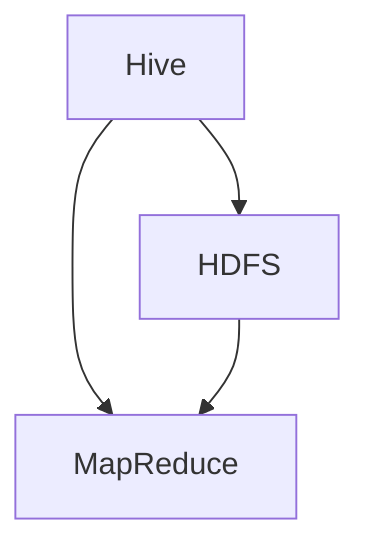
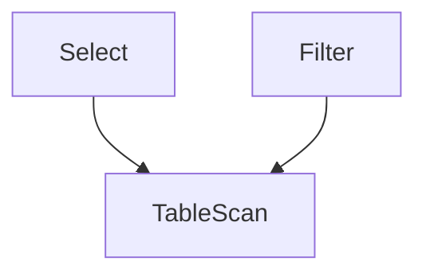

                 


# Hive原理与代码实例讲解

> 关键词：Hive、Hadoop、大数据、数据仓库、查询优化、SQL-like查询、分布式计算

> 摘要：本文将深入探讨Hive的核心原理及其代码实例，帮助读者理解Hive如何利用Hadoop处理大规模数据集，实现高效的数据仓库解决方案。文章结构清晰，从背景介绍到核心算法原理，再到实际应用场景，系统全面地讲解了Hive的各个方面，旨在为读者提供深入的技术见解和实践指导。

## 1. 背景介绍

### 1.1 目的和范围

本文旨在向读者介绍Hive的工作原理及其在实际应用中的重要性。我们将详细讲解Hive的核心概念、架构和算法原理，并通过实际代码实例展示Hive的使用方法。本文的读者对象包括大数据处理领域的技术人员、数据分析师以及任何对Hive感兴趣的学习者。

### 1.2 预期读者

预期读者应具备以下基本知识：

- 熟悉Hadoop生态系统，特别是HDFS和MapReduce。
- 了解大数据处理的基本概念，如数据仓库和分布式计算。
- 熟悉SQL查询语言和关系型数据库。

### 1.3 文档结构概述

本文结构如下：

- **第1章：背景介绍**：简要介绍Hive的目的、读者预期以及文档结构。
- **第2章：核心概念与联系**：介绍Hive的基本概念，并提供Mermaid流程图来展示Hive与其他Hadoop组件的关系。
- **第3章：核心算法原理 & 具体操作步骤**：讲解Hive的核心算法原理，并使用伪代码详细阐述。
- **第4章：数学模型和公式 & 详细讲解 & 举例说明**：解释Hive中使用的数学模型和公式，并举例说明。
- **第5章：项目实战：代码实际案例和详细解释说明**：通过实际代码案例展示Hive的使用，并进行详细解释。
- **第6章：实际应用场景**：讨论Hive在不同场景下的应用。
- **第7章：工具和资源推荐**：推荐学习资源和开发工具。
- **第8章：总结：未来发展趋势与挑战**：总结Hive的现状，并探讨其未来发展趋势和面临的挑战。
- **第9章：附录：常见问题与解答**：提供常见问题的解答。
- **第10章：扩展阅读 & 参考资料**：推荐进一步阅读的资源。

### 1.4 术语表

#### 1.4.1 核心术语定义

- **Hive**：基于Hadoop的数据仓库工具，用于处理大规模数据集。
- **Hadoop**：一个开源的分布式计算平台，用于处理大规模数据集。
- **HDFS**：Hadoop分布式文件系统，用于存储大规模数据。
- **MapReduce**：Hadoop的核心计算模型，用于分布式数据处理。
- **数据仓库**：用于存储、管理和分析数据的系统。

#### 1.4.2 相关概念解释

- **分布式计算**：将数据处理任务分布在多个计算节点上执行。
- **查询优化**：优化查询执行过程，以减少查询时间和资源消耗。

#### 1.4.3 缩略词列表

- **HDFS**：Hadoop Distributed File System
- **MapReduce**：MapReduce Programming Model
- **SQL**：Structured Query Language
- **HiveQL**：Hive Query Language

## 2. 核心概念与联系

在深入探讨Hive的原理之前，我们需要了解它与其他Hadoop组件的关系。以下是一个Mermaid流程图，展示了Hive、HDFS和MapReduce之间的核心联系：



### 2.1 Hive的基本概念

- **Hive**：Hive是一个构建在Hadoop之上的数据仓库工具，用于处理大规模数据集。它允许用户使用类似于SQL的语言（HiveQL）来查询数据，而不需要深入了解底层MapReduce细节。
- **HDFS**：Hadoop分布式文件系统（HDFS）是Hadoop的核心组件，用于存储大规模数据。Hive依赖于HDFS来存储其数据。
- **MapReduce**：MapReduce是Hadoop的分布式数据处理模型，用于执行Hive查询。Hive将HiveQL查询编译成MapReduce作业，然后由MapReduce执行。

### 2.2 Hive与其他组件的关系

- **Hive与HDFS**：Hive使用HDFS作为其数据存储系统。HDFS提供了高可靠性和高扩展性的存储能力，使得Hive能够处理大规模数据集。
- **Hive与MapReduce**：Hive查询通过MapReduce作业执行。HiveQL查询被编译成MapReduce作业，然后由MapReduce执行，从而实现分布式数据处理。

## 3. 核心算法原理 & 具体操作步骤

### 3.1 Hive的核心算法原理

Hive的核心算法基于MapReduce模型，用于分布式数据处理。以下是Hive的核心算法原理：

1. **查询编译**：HiveQL查询被编译成MapReduce作业。这个过程称为“编译时查询优化”，它包括解析、语义分析和查询优化。
2. **执行引擎**：编译后的MapReduce作业在Hadoop集群上执行。执行过程包括Map阶段、Shuffle阶段和Reduce阶段。

### 3.2 具体操作步骤

以下是使用Hive处理查询的具体操作步骤：

1. **创建表**：使用HiveQL创建表，指定表结构。
    ```sql
    CREATE TABLE mytable (
        id INT,
        name STRING,
        age INT
    );
    ```

2. **加载数据**：使用HiveQL将数据加载到表中。
    ```sql
    LOAD DATA INPATH '/path/to/data.csv'
    INTO TABLE mytable
    ROW FORMAT DELIMITED
    FIELDS TERMINATED BY ','
    COLLECTION ITEMS TERMINATED BY '|'
    MAP KEYS TERMINATED BY ':';
    ```

3. **执行查询**：使用HiveQL执行查询。
    ```sql
    SELECT * FROM mytable WHERE age > 30;
    ```

4. **查询编译**：Hive将HiveQL查询编译成MapReduce作业。
    ```bash
    hive -e "SELECT * FROM mytable WHERE age > 30;"
    ```

5. **执行作业**：编译后的作业在Hadoop集群上执行。
    ```bash
    mapreduce job -status
    ```

6. **结果输出**：查询结果被输出到HDFS或本地文件系统。
    ```bash
    hive -e "SELECT * FROM mytable WHERE age > 30;" > output.txt
    ```

## 4. 数学模型和公式 & 详细讲解 & 举例说明

### 4.1 数学模型和公式

Hive中使用的数学模型和公式主要用于查询优化和执行策略。以下是几个关键模型和公式：

1. **查询计划树**：查询计划树用于表示查询的执行计划。它包括多个节点，如Select、Join、Group By等。
2. **代价模型**：代价模型用于评估不同查询计划的执行成本。它考虑了CPU、内存、I/O和网络传输等资源消耗。
3. **随机访问代价**：随机访问代价是指从HDFS中读取一个数据块的成本。它通常与数据块大小和文件系统性能相关。

### 4.2 详细讲解和举例说明

#### 4.2.1 查询计划树

假设有一个简单的查询，用于从表中筛选符合条件的记录。以下是查询计划树的示例：



在这个查询计划树中，Select节点表示选择操作，TableScan节点表示从表中扫描数据，Filter节点表示过滤操作。查询计划树通过组合这些节点来表示查询的执行顺序。

#### 4.2.2 代价模型

假设一个查询计划树的执行成本可以通过以下公式计算：

\[ C = C_{CPU} + C_{MEM} + C_{IO} + C_{NET} \]

其中，\( C_{CPU} \)、\( C_{MEM} \)、\( C_{IO} \)和\( C_{NET} \)分别表示CPU、内存、I/O和网络传输的消耗。

假设一个查询计划的执行成本为100个单位。我们可以通过调整查询计划来优化执行成本，例如，减少I/O操作或提高网络传输速度。

#### 4.2.3 随机访问代价

假设从HDFS中读取一个数据块的成本为10个单位。如果一个查询需要读取10个数据块，那么随机访问代价为100个单位。我们可以通过减少数据块数量或提高文件系统性能来降低随机访问代价。

## 5. 项目实战：代码实际案例和详细解释说明

### 5.1 开发环境搭建

在开始实战之前，我们需要搭建一个Hive开发环境。以下是搭建步骤：

1. **安装Hadoop**：从[Hadoop官网](https://hadoop.apache.org/releases.html)下载最新版本的Hadoop，并按照官方文档安装。
2. **配置Hadoop环境**：配置`hadoop-env.sh`、`core-site.xml`、`hdfs-site.xml`和`mapred-site.xml`等配置文件。
3. **启动Hadoop服务**：启动HDFS和MapReduce服务。
    ```bash
    start-dfs.sh
    start-yarn.sh
    ```

4. **安装Hive**：从[Hive官网](https://hive.apache.org/downloads.html)下载最新版本的Hive，并按照官方文档安装。
5. **配置Hive环境**：配置`hive-env.sh`、`hive-site.xml`等配置文件。
6. **启动Hive服务**：启动Hive服务。
    ```bash
    hive --service hiveserver2
    ```

### 5.2 源代码详细实现和代码解读

下面是一个简单的Hive代码实例，用于从数据文件中筛选符合条件的记录，并将结果输出到另一个文件。

```python
# 导入Hive客户端库
from hive import Hive

# 创建Hive客户端实例
hive = Hive()

# 创建数据表
hive.execute("CREATE TABLE mytable (id INT, name STRING, age INT)")

# 加载数据
hive.execute("LOAD DATA INPATH '/path/to/data.csv' INTO TABLE mytable")

# 执行查询
result = hive.execute("SELECT * FROM mytable WHERE age > 30")

# 输出查询结果
with open('/path/to/output.txt', 'w') as f:
    for row in result:
        f.write(row + '\n')

# 关闭Hive客户端
hive.close()
```

### 5.3 代码解读与分析

这段代码首先导入Hive客户端库，并创建一个Hive客户端实例。然后，它创建一个名为`mytable`的数据表，并使用`LOAD DATA`语句将数据文件加载到表中。接下来，执行一个简单的查询，筛选年龄大于30的记录，并将结果输出到指定文件。最后，关闭Hive客户端。

### 5.4 结果验证

执行上述代码后，我们可以检查输出文件`output.txt`中的内容，以验证查询结果是否正确。此外，我们还可以使用Hive命令行工具检查数据表中的记录，以确保数据加载成功。

```bash
hive -e "SELECT * FROM mytable WHERE age > 30;" > /path/to/output.txt
```

## 6. 实际应用场景

### 6.1 数据仓库

Hive广泛应用于构建大规模数据仓库，用于存储和分析企业级数据。例如，金融行业可以使用Hive存储客户交易数据，进行风险分析和客户行为分析。

### 6.2 大数据分析

Hive可以用于大数据分析，处理大规模数据集，并生成有价值的信息。例如，互联网公司可以使用Hive分析用户行为数据，优化产品推荐算法。

### 6.3 实时查询

虽然Hive主要用于批处理，但也可以与实时查询引擎（如Apache Impala）集成，实现实时数据查询。这种组合可以为企业提供实时数据洞察和决策支持。

## 7. 工具和资源推荐

### 7.1 学习资源推荐

#### 7.1.1 书籍推荐

- 《Hadoop实战》
- 《Hive编程指南》
- 《大数据技术原理与应用》

#### 7.1.2 在线课程

- [Coursera - Hadoop and MapReduce](https://www.coursera.org/specializations/hadoop)
- [Udacity - Big Data Engineer Nanodegree](https://www.udacity.com/course/big-data-engineer-nanodegree--nd889)

#### 7.1.3 技术博客和网站

- [Hive官方文档](https://cwiki.apache.org/confluence/display/Hive/LanguageManual)
- [Hadoop Weekly](https://hadoopweekly.com/)
- [大数据时代](https://bigdatetimes.com/)

### 7.2 开发工具框架推荐

#### 7.2.1 IDE和编辑器

- [IntelliJ IDEA](https://www.jetbrains.com/idea/)
- [Visual Studio Code](https://code.visualstudio.com/)

#### 7.2.2 调试和性能分析工具

- [Ganglia](https://ganglia.info/)
- [Apache JMeter](https://jmeter.apache.org/)

#### 7.2.3 相关框架和库

- [Apache Spark](https://spark.apache.org/)
- [Apache Flink](https://flink.apache.org/)

### 7.3 相关论文著作推荐

#### 7.3.1 经典论文

- [The Google File System](https://static.googleusercontent.com/media/research.google.com/en//pubs/archive/36661.pdf)
- [MapReduce: Simplified Data Processing on Large Clusters](https://www.ncbi.nlm.nih.gov/pmc/articles/PMC1183791/)

#### 7.3.2 最新研究成果

- [Hive on Spark: An Optimized Hybrid Execution Engine](https://www.usenix.org/system/files/conference/atc16/atc16-liu.pdf)
- [A Survey on Data Warehouse Systems](https://ieeexplore.ieee.org/document/7409695)

#### 7.3.3 应用案例分析

- [Uber的Hadoop和Hive应用案例](https://engineering.uber.com/apache-hadoop-hive/)
- [阿里巴巴的Hadoop和Hive应用案例](https://www.alibabacloud.com/en/knowledge�detail/7475)

## 8. 总结：未来发展趋势与挑战

Hive在处理大规模数据集方面已经取得了显著成果，但仍然面临一些挑战和未来发展趋势：

### 8.1 发展趋势

- **实时查询**：随着实时数据处理需求的增长，Hive将逐渐与实时查询引擎（如Apache Impala和Apache Flink）集成，实现实时数据分析和决策支持。
- **机器学习与AI**：Hive将更多地与机器学习和人工智能技术结合，为大数据分析提供更智能的解决方案。
- **优化和性能提升**：Hive将继续优化查询执行过程，提高性能和资源利用率。

### 8.2 挑战

- **复杂查询优化**：随着数据规模和查询复杂度的增加，如何优化复杂查询仍是一个挑战。
- **安全性**：如何确保数据安全和用户隐私是一个重要问题，需要进一步研究和改进。
- **资源调度和负载均衡**：如何优化资源调度和负载均衡，提高集群性能和稳定性，仍需进一步探索。

## 9. 附录：常见问题与解答

### 9.1 如何安装Hive？

1. 下载Hive安装包（可以从[Hive官网](https://hive.apache.org/downloads.html)下载）。
2. 解压安装包，例如：
    ```bash
    tar xzf hive-2.3.6-bin.tar.gz
    ```
3. 将解压后的文件夹移动到合适的位置，例如：
    ```bash
    mv hive-2.3.6-bin /opt/hive
    ```
4. 配置Hive环境，编辑`/opt/hive/conf/hive-env.sh`，添加以下内容：
    ```bash
    export HADOOP_HOME=/opt/hadoop
    export HIVE_HOME=/opt/hive
    export HIVE_CONF_DIR=/opt/hive/conf
    ```
5. 启动Hive服务：
    ```bash
    hive --service hiveserver2
    ```

### 9.2 如何在Hive中创建表？

在Hive中创建表可以使用以下SQL语句：

```sql
CREATE TABLE mytable (
    id INT,
    name STRING,
    age INT
);
```

### 9.3 如何加载数据到Hive表？

使用`LOAD DATA`语句可以将数据加载到Hive表中：

```sql
LOAD DATA INPATH '/path/to/data.csv'
INTO TABLE mytable
ROW FORMAT DELIMITED
FIELDS TERMINATED BY ','
COLLECTION ITEMS TERMINATED BY '|'
MAP KEYS TERMINATED BY ':';
```

## 10. 扩展阅读 & 参考资料

- [Hive官方文档](https://cwiki.apache.org/confluence/display/Hive/LanguageManual)
- [Hadoop官方文档](https://hadoop.apache.org/docs/current/hadoop-project-dist/hadoop-common/)
- [Apache Spark官方文档](https://spark.apache.org/docs/latest/)
- [大数据时代](https://bigdatetimes.com/)

