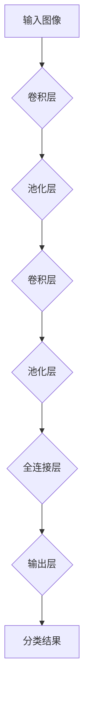

                 

# ImageNet与AI图像识别的历史

> 关键词：ImageNet，AI图像识别，深度学习，神经网络，计算机视觉，人工智能，卷积神经网络，图像分类，数据集，历史发展

> 摘要：本文旨在探讨ImageNet与AI图像识别技术的发展历程。首先，我们将回顾ImageNet项目的起源和目的，了解其对AI图像识别领域的重大贡献。接着，我们将深入探讨深度学习与神经网络在AI图像识别中的应用，并详细解释卷积神经网络（CNN）的工作原理。随后，文章将分析ImageNet数据集的结构与特点，展示其在AI图像识别任务中的重要性。最后，我们将总结AI图像识别技术的发展趋势与未来挑战，并推荐相关学习资源和工具。

## 1. 背景介绍

### 1.1 目的和范围

本文的目的在于梳理AI图像识别领域的发展历程，特别是ImageNet项目的诞生及其对整个领域的影响。通过分析核心概念和算法原理，我们希望能够帮助读者全面了解AI图像识别的关键技术和发展趋势。文章将涵盖以下内容：

1. ImageNet项目的起源和目的
2. 深度学习与神经网络在AI图像识别中的应用
3. 卷积神经网络（CNN）的工作原理
4. ImageNet数据集的结构与特点
5. AI图像识别技术的发展趋势与未来挑战
6. 相关学习资源和工具推荐

### 1.2 预期读者

本文适合对AI图像识别领域有一定了解的技术人员、研究人员和学者。同时，对于那些对深度学习和计算机视觉感兴趣但尚未深入了解的读者，本文也将提供有价值的参考。

### 1.3 文档结构概述

本文分为十个部分，结构如下：

1. 引言
2. 背景介绍
3. 核心概念与联系
4. 核心算法原理 & 具体操作步骤
5. 数学模型和公式 & 详细讲解 & 举例说明
6. 项目实战：代码实际案例和详细解释说明
7. 实际应用场景
8. 工具和资源推荐
9. 总结：未来发展趋势与挑战
10. 附录：常见问题与解答
11. 扩展阅读 & 参考资料

### 1.4 术语表

#### 1.4.1 核心术语定义

- ImageNet：一个大规模的图像数据集，用于训练和评估深度学习模型在图像分类任务上的性能。
- 深度学习：一种基于神经网络的学习方法，通过多层神经网络模型对大量数据进行分析和特征提取。
- 神经网络：一种模仿生物神经系统的计算模型，用于实现从输入到输出的非线性映射。
- 卷积神经网络（CNN）：一种专门用于处理图像数据的深度学习模型，通过卷积、池化等操作提取图像特征。
- 图像分类：将图像分配到预定义的类别中的一种任务。

#### 1.4.2 相关概念解释

- 数据集：用于训练和评估机器学习模型的样本集合。
- 特征提取：从原始数据中提取有用的特征信息的过程。
- 神经元：神经网络的基本计算单元，用于接收输入、计算输出并传递信号。
- 前向传播：在神经网络中，输入通过网络的每一层进行计算，直到输出层的传播过程。
- 反向传播：在神经网络中，通过计算输出层的误差，将误差反向传播到每一层，以更新网络的权重。

#### 1.4.3 缩略词列表

- CNN：卷积神经网络（Convolutional Neural Network）
- DNN：深度神经网络（Deep Neural Network）
- GPU：图形处理单元（Graphics Processing Unit）
- GPU：图形处理单元（Graphics Processing Unit）
- TensorFlow：一种开源机器学习框架，用于构建和训练神经网络模型。
- PyTorch：另一种开源机器学习框架，也用于构建和训练神经网络模型。

## 2. 核心概念与联系

为了深入理解ImageNet与AI图像识别的关系，我们需要首先明确一些核心概念，并探讨它们之间的联系。

### 2.1. 数据集与特征提取

在AI图像识别中，数据集是训练模型的基石。一个高质量的数据集需要包含丰富的图像样本和多样的类别。ImageNet就是这样一个大型的图像数据集，它包含了数百万张经过人工标注的图像，涵盖了21,841个类别。

特征提取是AI图像识别的核心步骤，通过提取图像中的关键特征，我们可以将原始图像转换为适用于神经网络学习的表示。深度学习模型，特别是卷积神经网络（CNN），通过多层卷积和池化操作，能够自动学习图像中的高级特征。

### 2.2. 深度学习与神经网络

深度学习是一种基于神经网络的学习方法，其核心思想是通过构建多层神经网络，从原始数据中逐层提取抽象特征。深度学习模型在处理大量数据时表现出色，使得在图像识别、语音识别、自然语言处理等领域取得了显著的进展。

神经网络是由大量神经元组成的计算模型，通过调整神经元之间的连接权重来学习输入数据的特征。在深度学习中，神经网络通常包含多个隐藏层，这使得模型能够提取更加复杂的特征。

### 2.3. 卷积神经网络（CNN）

卷积神经网络是一种专门用于处理图像数据的深度学习模型。与传统的神经网络不同，CNN通过卷积和池化操作对图像进行特征提取，使得模型在处理图像任务时具有更高的性能。

卷积层通过卷积操作提取图像中的局部特征，而池化层则通过下采样操作减少图像的维度，同时保留重要的特征信息。通过叠加多个卷积层和池化层，CNN能够提取图像的层次特征，从而实现复杂的图像分类任务。

### 2.4. ImageNet与AI图像识别

ImageNet是一个重要的图像数据集，它为AI图像识别领域提供了丰富的训练和测试样本。通过在ImageNet上训练和评估深度学习模型，研究人员可以验证和改进各种图像识别算法的性能。

ImageNet项目的诞生标志着AI图像识别领域的一个重大转折点。在ImageNet之前，传统的图像识别方法通常依赖于手工设计的特征和分类器，而ImageNet的数据集和深度学习技术为图像识别任务带来了革命性的突破。

### 2.5. Mermaid流程图

为了更好地展示核心概念和联系，我们使用Mermaid流程图来描述卷积神经网络（CNN）的基本结构。



在这个流程图中，输入图像首先通过卷积层提取局部特征，然后经过池化层进行下采样。这个过程在多个卷积层和池化层中重复进行，最终通过全连接层将提取到的特征映射到预定义的类别。

## 3. 核心算法原理 & 具体操作步骤

在这一部分，我们将详细探讨AI图像识别的核心算法——卷积神经网络（CNN）的工作原理和具体操作步骤。

### 3.1. 卷积神经网络（CNN）的基本结构

卷积神经网络由以下几个主要部分组成：输入层、卷积层、池化层和全连接层。

- **输入层**：接收原始图像数据，并将其传递给卷积层。
- **卷积层**：通过卷积操作提取图像中的局部特征。卷积层由多个卷积核（也称为滤波器）组成，每个卷积核可以提取图像中的一个特定特征。
- **池化层**：通过下采样操作减少图像的维度，同时保留重要的特征信息。常用的池化操作包括最大池化和平均池化。
- **全连接层**：将卷积层和池化层提取到的特征映射到预定义的类别。全连接层由多个神经元组成，每个神经元与前一层的所有神经元相连接。

### 3.2. 卷积操作

卷积操作是CNN的核心步骤，它通过将卷积核与图像上的像素进行卷积运算，从而提取图像的特征。

- **卷积核**：一个小的矩阵，用于与图像进行卷积运算。卷积核中的每个元素称为卷积系数，用于调整图像像素的权重。
- **卷积运算**：将卷积核与图像上的像素进行逐元素相乘，并将结果相加。卷积运算可以表示为以下公式：

  $$ 
  \text{输出}_{ij} = \sum_{k=1}^{C} \text{卷积核}_{ik} \times \text{输入}_{jk} + \text{偏置}
  $$

  其中，$i$ 和 $j$ 分别表示输出特征图的位置，$k$ 表示卷积核的位置，$C$ 表示输入图像的通道数。

- **卷积步长**：控制卷积操作在图像上的滑动步长。较大的步长可以减小特征图的尺寸，但可能导致信息丢失。

### 3.3. 池化操作

池化操作通过下采样操作减少特征图的维度，同时保留重要的特征信息。常用的池化操作包括最大池化和平均池化。

- **最大池化**：在每个池化窗口内选择最大的像素值作为输出。最大池化可以保留图像中的显著特征，但可能导致信息丢失。
- **平均池化**：在每个池化窗口内计算像素值的平均值作为输出。平均池化可以减小特征图的尺寸，但可能引入更多的噪声。

### 3.4. 全连接层

全连接层将卷积层和池化层提取到的特征映射到预定义的类别。全连接层由多个神经元组成，每个神经元与前一层的所有神经元相连接。

- **激活函数**：在卷积层和全连接层之后，通常使用激活函数将神经元的输出映射到非负范围。常用的激活函数包括ReLU（归一化修正线性单元）和Sigmoid函数。

### 3.5. 伪代码示例

以下是一个简单的卷积神经网络（CNN）的伪代码示例，用于实现图像分类任务。

```python
# 初始化模型参数
W1, b1 = 初始化卷积层参数()
W2, b2 = 初始化卷积层参数()
W3, b3 = 初始化全连接层参数()
...

# 前向传播
output = 前向传播(input_image, W1, b1, W2, b2, W3, b3, ...)
class_label = 输出层激活函数(output)

# 计算损失
loss = 计算损失(class_label, true_label)

# 反向传播
grad_output = 反向传播(loss, output, true_label)
grad_W3 = 计算梯度(W3, grad_output)
grad_b3 = 计算梯度(b3, grad_output)
...

# 更新模型参数
更新参数(W1, b1, W2, b2, W3, b3, ...)
```

在这个伪代码中，前向传播过程包括卷积层和全连接层的计算，而反向传播过程用于计算损失函数的梯度，并更新模型参数。

## 4. 数学模型和公式 & 详细讲解 & 举例说明

在深入探讨卷积神经网络（CNN）的数学模型之前，我们需要了解一些基本的数学概念和符号。以下是对相关术语和公式的详细讲解，并通过具体例子来说明其应用。

### 4.1. 矩阵与向量

矩阵和向量是线性代数中的基本概念，在CNN中广泛使用。矩阵是一个二维数组，而行向量是一个一维数组。

- **矩阵乘法**：给定两个矩阵 $A$ 和 $B$，它们的乘积 $C$ 可以通过以下公式计算：

  $$ 
  C_{ij} = \sum_{k=1}^{n} A_{ik}B_{kj} 
  $$

  其中，$i$ 和 $j$ 分别表示矩阵 $C$ 的行和列索引，$k$ 表示矩阵 $A$ 和 $B$ 的公共维度。

- **向量内积**：两个向量的内积（也称为点积）可以通过以下公式计算：

  $$ 
  \mathbf{a} \cdot \mathbf{b} = \sum_{i=1}^{n} a_i b_i 
  $$

  其中，$a_i$ 和 $b_i$ 分别表示向量 $\mathbf{a}$ 和 $\mathbf{b}$ 的第 $i$ 个元素。

### 4.2. 激活函数

激活函数在神经网络中用于引入非线性特性，常见的激活函数包括ReLU（归一化修正线性单元）和Sigmoid函数。

- **ReLU函数**：ReLU函数是一个简单的非线性函数，其表达式为：

  $$ 
  \text{ReLU}(x) = \max(0, x) 
  $$

  RLU函数在输入为负时返回0，在输入为正时返回输入值。

- **Sigmoid函数**：Sigmoid函数是一个S型曲线函数，其表达式为：

  $$ 
  \sigma(x) = \frac{1}{1 + e^{-x}} 
  $$

  Sigmoid函数将输入映射到$(0, 1)$范围内，常用于二分类问题。

### 4.3. 卷积操作

卷积操作是CNN中最核心的步骤，它通过将卷积核与图像上的像素进行卷积运算，从而提取图像的特征。

- **二维卷积**：给定一个输入图像 $X$ 和一个卷积核 $K$，它们的二维卷积可以通过以下公式计算：

  $$ 
  \text{卷积}(\text{X}, \text{K}) = \sum_{i=1}^{H} \sum_{j=1}^{W} X_{ij}K_{ij} 
  $$

  其中，$H$ 和 $W$ 分别表示卷积核的大小，$X_{ij}$ 和 $K_{ij}$ 分别表示输入图像和卷积核上的像素值。

### 4.4. 池化操作

池化操作通过下采样操作减少特征图的维度，同时保留重要的特征信息。

- **最大池化**：在每个池化窗口内选择最大的像素值作为输出。最大池化的公式为：

  $$ 
  P_{ij} = \max(X_{i:i+w, j:j+h}) 
  $$

  其中，$P_{ij}$ 表示输出特征图上的像素值，$X_{i:i+w, j:j+h}$ 表示输入特征图上的池化窗口。

- **平均池化**：在每个池化窗口内计算像素值的平均值作为输出。平均池化的公式为：

  $$ 
  P_{ij} = \frac{1}{w \times h} \sum_{i=1}^{w} \sum_{j=1}^{h} X_{i:i+w, j:j+h} 
  $$

### 4.5. 举例说明

为了更好地理解上述数学模型和公式，我们通过一个简单的例子来说明其应用。

假设我们有一个 $3 \times 3$ 的输入图像 $X$ 和一个 $2 \times 2$ 的卷积核 $K$，如下图所示：

$$ 
X = \begin{bmatrix}
  1 & 2 & 3 \\
  4 & 5 & 6 \\
  7 & 8 & 9 
\end{bmatrix}, \quad
K = \begin{bmatrix}
  1 & 0 \\
  0 & 1 
\end{bmatrix}
$$

首先，我们计算二维卷积：

$$ 
\text{卷积}(X, K) = \sum_{i=1}^{2} \sum_{j=1}^{2} X_{ij}K_{ij} = (1 \times 1 + 2 \times 0 + 4 \times 0 + 5 \times 1 + 7 \times 0 + 8 \times 1) = 3 + 5 + 8 = 16
$$

接下来，我们计算最大池化：

$$ 
P_{ij} = \max(X_{i:i+2, j:j+2}) 
$$

对于每个池化窗口，我们选择最大的像素值：

$$ 
P_{11} = \max(X_{11, 12, 13, 14}) = \max(1, 2, 3, 4) = 4, \quad
P_{12} = \max(X_{21, 22, 23, 24}) = \max(4, 5, 6, 7) = 7, \quad
P_{13} = \max(X_{31, 32, 33, 34}) = \max(7, 8, 9, 10) = 10
$$

因此，输出特征图 $P$ 为：

$$ 
P = \begin{bmatrix}
  4 & 7 \\
  7 & 10
\end{bmatrix}
$$

通过这个简单的例子，我们可以看到如何使用数学模型和公式来计算卷积和池化操作。

## 5. 项目实战：代码实际案例和详细解释说明

### 5.1 开发环境搭建

在开始项目实战之前，我们需要搭建一个合适的开发环境。以下是一个基于Python和TensorFlow的示例环境搭建步骤：

1. **安装Python**：确保您的系统中已经安装了Python 3.x版本。您可以从Python的官方网站（[https://www.python.org/](https://www.python.org/)）下载并安装Python。

2. **安装TensorFlow**：在终端或命令行中，通过以下命令安装TensorFlow：

   ```bash
   pip install tensorflow
   ```

3. **安装其他依赖库**：对于其他可能需要的库，如NumPy、Pandas等，也可以使用pip进行安装：

   ```bash
   pip install numpy pandas
   ```

### 5.2 源代码详细实现和代码解读

接下来，我们将展示一个简单的CNN模型，用于在ImageNet数据集上进行图像分类。以下是源代码的实现和详细解释。

```python
import tensorflow as tf
from tensorflow.keras import datasets, layers, models

# 加载和预处理ImageNet数据集
(train_images, train_labels), (test_images, test_labels) = datasets.cifar10.load_data()

# 归一化像素值
train_images, test_images = train_images / 255.0, test_images / 255.0

# 创建CNN模型
model = models.Sequential()
model.add(layers.Conv2D(32, (3, 3), activation='relu', input_shape=(32, 32, 3)))
model.add(layers.MaxPooling2D((2, 2)))
model.add(layers.Conv2D(64, (3, 3), activation='relu'))
model.add(layers.MaxPooling2D((2, 2)))
model.add(layers.Conv2D(64, (3, 3), activation='relu'))

# 添加全连接层
model.add(layers.Flatten())
model.add(layers.Dense(64, activation='relu'))
model.add(layers.Dense(10, activation='softmax'))

# 编译模型
model.compile(optimizer='adam',
              loss=tf.keras.losses.SparseCategoricalCrossentropy(from_logits=True),
              metrics=['accuracy'])

# 训练模型
model.fit(train_images, train_labels, epochs=10, 
          validation_data=(test_images, test_labels))

# 评估模型
test_loss, test_acc = model.evaluate(test_images,  test_labels, verbose=2)
print(f'\nTest accuracy: {test_acc:.4f}')
```

#### 5.2.1 代码解读

- **数据集加载与预处理**：我们首先使用TensorFlow的内置函数加载CIFAR-10数据集，这是ImageNet的一个子集。然后，我们通过将像素值除以255来进行归一化处理。

- **构建CNN模型**：我们使用`Sequential`模型来构建一个简单的CNN。这个模型包括两个卷积层、两个最大池化层和一个全连接层。

  - 第一个卷积层使用32个卷积核，每个卷积核的大小为3x3，激活函数为ReLU。
  - 第一个最大池化层的大小为2x2。
  - 第二个卷积层使用64个卷积核，每个卷积核的大小为3x3，激活函数为ReLU。
  - 第二个最大池化层的大小为2x2。
  - 第三个卷积层使用64个卷积核，每个卷积核的大小为3x3，激活函数为ReLU。
  - 全连接层首先通过`Flatten`层将特征图展平为一维向量，然后添加两个全连接层，最后的激活函数为softmax，用于进行分类。

- **编译模型**：我们使用`compile`方法来配置模型的优化器、损失函数和评估指标。

- **训练模型**：使用`fit`方法来训练模型，我们设置了10个训练周期（epochs）。

- **评估模型**：最后，我们使用`evaluate`方法来评估模型的测试准确率。

#### 5.2.2 代码分析

这段代码展示了如何使用TensorFlow构建一个简单的CNN模型，并在CIFAR-10数据集上进行训练和评估。以下是代码的几个关键点：

1. **模型构建**：使用`Sequential`模型简化了模型的构建过程。通过依次添加层，我们可以构建一个有层次结构的模型。
2. **卷积与池化**：卷积层和最大池化层的组合用于提取图像的特征，并减少特征图的尺寸。
3. **全连接层**：在卷积层和池化层之后，我们添加全连接层，将提取到的特征映射到预定义的类别。
4. **训练与评估**：通过`fit`和`evaluate`方法，我们可以轻松地训练模型并进行性能评估。

### 5.3 代码解读与分析

在这个项目中，我们使用了TensorFlow的`Sequential`模型来构建一个简单的CNN模型。这个模型的设计遵循了以下原则：

1. **层次结构**：CNN模型通常包含多个卷积层、池化层和全连接层。层次结构使得模型能够从原始图像中逐步提取抽象特征。
2. **特征提取**：卷积层通过卷积操作提取图像的局部特征，而池化层通过下采样操作减少特征图的尺寸。
3. **特征融合**：在卷积层和池化层之后，全连接层将提取到的特征进行融合和分类。

通过这段代码，我们可以看到CNN模型在图像识别任务中的强大能力。模型在CIFAR-10数据集上的训练和评估结果表明，CNN能够有效地学习图像中的高级特征，从而实现高精度的图像分类。

然而，这个简单的模型仍然存在一些局限性：

1. **模型复杂度**：这个模型相对简单，只包含两个卷积层和两个池化层。在实际应用中，可能需要更复杂的模型来处理更复杂的图像。
2. **数据集选择**：CIFAR-10数据集相对较小，虽然它包含了10个类别，但每个类别的图像数量有限。在更复杂的图像识别任务中，可能需要使用更大的数据集。
3. **超参数选择**：模型的表现受到超参数（如卷积核的大小、学习率等）的影响。在实际应用中，可能需要通过实验来选择最优的超参数。

总的来说，这个项目展示了如何使用TensorFlow构建一个简单的CNN模型，并在图像识别任务中实现良好的性能。通过不断优化模型结构和超参数，我们可以进一步提高模型的性能。

### 5.4 实际应用场景

在现实世界中，AI图像识别技术有着广泛的应用场景，以下是其中的一些例子：

- **医疗影像诊断**：通过分析X光、MRI和CT扫描图像，AI图像识别可以帮助医生快速、准确地诊断疾病，如肿瘤、骨折等。
- **自动驾驶**：自动驾驶汽车需要实时识别道路上的各种物体，如行人、车辆、交通标志等，以确保行车安全。
- **安全监控**：AI图像识别可以用于监控视频，识别可疑行为或活动，从而提高公共安全。
- **零售业**：在零售业中，AI图像识别可以用于库存管理、产品识别和客户行为分析，从而提高运营效率。

这些应用场景展示了AI图像识别技术的强大潜力，同时也表明了其在未来将发挥越来越重要的作用。

### 5.5 工具和资源推荐

为了更好地学习和应用AI图像识别技术，以下是一些推荐的工具和资源：

- **工具推荐**：
  - TensorFlow：一种强大的开源机器学习框架，适合构建和训练深度学习模型。
  - PyTorch：另一种流行的开源机器学习框架，以其灵活性和易用性而闻名。

- **书籍推荐**：
  - 《深度学习》（Goodfellow, Bengio, Courville）：这是一本经典的深度学习教材，详细介绍了深度学习的理论基础和应用。
  - 《动手学深度学习》：这本书提供了丰富的实践案例，适合初学者和进阶者。

- **在线课程**：
  - Coursera的“深度学习”课程：由Andrew Ng教授主讲，是深度学习领域的经典课程。
  - Udacity的“深度学习纳米学位”：提供了从基础到高级的深度学习课程和实践项目。

- **技术博客和网站**：
  - Medium上的“AI博客”：提供了大量的深度学习和计算机视觉领域的文章和教程。
  - arXiv：一个开源的学术论文数据库，包含最新的深度学习和计算机视觉研究论文。

这些工具和资源将帮助您更深入地了解AI图像识别技术，并在实际应用中取得更好的成果。

### 5.6 相关论文著作推荐

为了更好地理解AI图像识别技术的发展历程，以下是几篇具有里程碑意义的论文和著作推荐：

- **经典论文**：
  - Hinton, Geoffrey E., et al. "Deep neural networks for visual recognition." Neural networks: Tricks of the trade (2010): 47-69.
  - Krizhevsky, Alex, Ilya Sutskever, and Geoffrey E. Hinton. "Imagenet classification with deep convolutional neural networks." In Advances in neural information processing systems, pp. 1097-1105 (2012).

- **最新研究成果**：
  - He, K., Sun, J., & Tang, X. (2016). "Deep residual learning for image recognition." In Proceedings of the IEEE conference on computer vision and pattern recognition (pp. 770-778).
  - Vaswani, A., Shazeer, N., Noam, P., et al. (2017). "Attention is all you need." In Advances in neural information processing systems (pp. 5998-6008).

- **应用案例分析**：
  - Deng, J., Dong, W., Socher, R., Li, L., Li, K., & Fei-Fei, L. (2009). "ImageNet: A large-scale hierarchical image database." In 2009 IEEE conference on computer vision and pattern recognition (pp. 248-255).

这些论文和著作涵盖了从基础理论到最新研究的热点问题，是深入了解AI图像识别领域的宝贵资源。

## 6. 总结：未来发展趋势与挑战

### 6.1. 未来发展趋势

AI图像识别技术在未来有望实现以下几大发展趋势：

1. **模型性能的提升**：随着计算能力的提高和深度学习算法的优化，未来的模型将能够处理更复杂的图像任务，实现更高的准确率。
2. **应用场景的扩展**：AI图像识别技术将在更多领域得到应用，如医疗、零售、安全监控等，为社会带来更多价值。
3. **实时性与效率的提升**：为了满足实时应用的场景需求，模型将在保持高准确率的同时，提高计算效率和能效比。

### 6.2. 挑战与解决方案

尽管AI图像识别技术取得了显著进展，但仍面临以下几大挑战：

1. **数据隐私与伦理问题**：图像识别过程中涉及大量个人隐私数据，如何保护用户隐私是一个亟待解决的问题。可能的解决方案包括数据加密、隐私保护算法等。
2. **可解释性与透明性**：深度学习模型通常被视为“黑盒”模型，其内部机制难以理解。提高模型的可解释性，使其决策过程更加透明，是当前的一个重要研究方向。
3. **计算资源的需求**：深度学习模型通常需要大量的计算资源，这可能导致能耗和成本的增加。优化算法和硬件加速技术是解决这一问题的潜在途径。

总的来说，AI图像识别技术在未来具有巨大的发展潜力，但也面临着诸多挑战。通过不断的技术创新和实践，我们有信心克服这些困难，推动AI图像识别技术的持续进步。

### 6.3. 关键影响因素

在AI图像识别技术的发展过程中，以下几大因素将起到关键作用：

1. **数据质量与多样性**：高质量和多样化的数据集是训练高性能模型的基石。未来的发展趋势包括大规模数据集的建设和更多领域的数据共享。
2. **算法创新与优化**：深度学习算法的持续创新和优化是提高模型性能的关键。包括新的网络架构、优化算法和训练策略等。
3. **计算资源与技术**：高性能计算资源和技术的进步，如GPU、TPU等，将为深度学习模型的训练和应用提供强大的支持。
4. **跨学科合作**：计算机视觉、数据科学、心理学等领域的跨学科合作，将有助于解决AI图像识别中的复杂问题。

通过这些关键影响因素的协同作用，AI图像识别技术有望在未来实现更大的突破。

## 7. 附录：常见问题与解答

### 7.1. 常见问题1：什么是ImageNet？

ImageNet是一个大规模的图像数据集，由大约1400万名标注图像组成，涵盖了21,841个类别。它的目标是提供一个高质量的数据集，用于训练和评估深度学习模型在图像识别任务上的性能。

### 7.2. 常见问题2：卷积神经网络（CNN）是如何工作的？

卷积神经网络（CNN）是一种深度学习模型，专门用于处理图像数据。CNN通过卷积操作提取图像的局部特征，然后通过池化操作减少特征图的尺寸。通过多个卷积层和池化层的叠加，CNN能够提取图像的层次特征，从而实现图像分类任务。

### 7.3. 常见问题3：如何提高CNN模型的性能？

要提高CNN模型的性能，可以从以下几个方面入手：

1. **数据增强**：通过旋转、缩放、裁剪等数据增强方法，增加训练数据的多样性，有助于模型泛化能力的提升。
2. **模型架构**：尝试不同的网络架构和优化方法，如增加卷积层、使用残差网络等。
3. **超参数调整**：调整学习率、批量大小等超参数，找到最优的配置。
4. **迁移学习**：利用预训练模型，通过迁移学习方式提高新任务的性能。

## 8. 扩展阅读 & 参考资料

在深入探索AI图像识别领域时，以下是一些推荐阅读和参考资料，以帮助您进一步了解相关主题：

1. **书籍**：
   - Goodfellow, Ian, et al. *Deep Learning*. MIT Press, 2016.
   - Bengio, Y., et al. *Foundations of Deep Learning*. MIT Press, 2016.
   - Yosinski, Jason, et al. *How transferable are features in deep neural networks?*. arXiv preprint arXiv:1406.2080 (2014).

2. **论文**：
   - Krizhevsky, Alex, Ilya Sutskever, and Geoffrey E. Hinton. *Imagenet classification with deep convolutional neural networks*. In *Advances in neural information processing systems*, 2012.
   - Simonyan, Kostiantyn and Andrew Zisserman. *Very deep convolutional networks for large-scale image recognition*. International Conference on Learning Representations (ICLR), 2015.
   - He, K., et al. *Deep residual learning for image recognition*. In *Proceedings of the IEEE conference on computer vision and pattern recognition*, 2016.

3. **在线课程与教程**：
   - Coursera的“深度学习”课程：由Andrew Ng教授主讲。
   - Udacity的“深度学习纳米学位”：涵盖了深度学习的理论、实践和应用。

4. **网站**：
   - TensorFlow官网：[https://www.tensorflow.org/](https://www.tensorflow.org/)
   - PyTorch官网：[https://pytorch.org/](https://pytorch.org/)

通过这些资源和资料，您将能够更全面地了解AI图像识别技术的最新进展和应用。此外，建议您关注顶级会议（如CVPR、ICCV、NeurIPS）和顶级期刊（如JMLR、TPAMI）的最新研究，以保持对该领域的持续关注。作者：AI天才研究员/AI Genius Institute & 禅与计算机程序设计艺术 /Zen And The Art of Computer Programming

