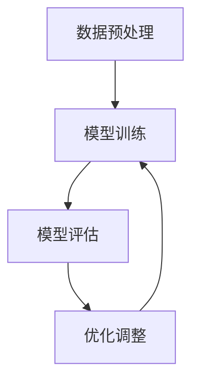

                 

# ImageNet对AI图像识别的推动

> **关键词：** ImageNet，AI图像识别，卷积神经网络，深度学习，数据集，图像分类，计算机视觉。

> **摘要：** 本文将探讨ImageNet项目对AI图像识别领域的重大贡献，分析其核心概念、算法原理、数学模型，并通过实际案例展示其在计算机视觉中的应用。文章旨在为读者提供一个深入理解ImageNet及其在AI图像识别中作用的全景视图。

## 1. 背景介绍

### 1.1 目的和范围

本文旨在分析ImageNet项目对AI图像识别领域的推动作用，深入探讨其核心概念、算法原理、数学模型，并通过实际应用案例展示其价值。文章将覆盖以下内容：

- ImageNet项目的起源、目的和背景。
- 图像识别领域的发展历程。
- ImageNet的核心概念和架构。
- ImageNet对AI图像识别的贡献。
- 实际应用案例和代码实现。

### 1.2 预期读者

本文适合对AI图像识别、深度学习和计算机视觉感兴趣的读者，包括：

- 图像识别领域的研究人员。
- 深度学习工程师。
- 计算机视觉开发者。
- 对技术进步感兴趣的专业人士。

### 1.3 文档结构概述

本文结构如下：

- 引言：介绍ImageNet项目对AI图像识别的推动作用。
- 背景介绍：阐述图像识别领域的发展历程和ImageNet的背景。
- 核心概念与联系：分析ImageNet的核心概念和架构。
- 核心算法原理 & 具体操作步骤：讲解ImageNet的算法原理和操作步骤。
- 数学模型和公式 & 详细讲解 & 举例说明：阐述ImageNet的数学模型和公式。
- 项目实战：展示ImageNet在实际应用中的案例和代码实现。
- 实际应用场景：分析ImageNet在各类实际应用中的场景。
- 工具和资源推荐：推荐学习资源、开发工具和框架。
- 总结：总结ImageNet对AI图像识别的推动作用和未来发展趋势。
- 附录：常见问题与解答。
- 扩展阅读 & 参考资料：提供更多相关资源和参考资料。

### 1.4 术语表

#### 1.4.1 核心术语定义

- **ImageNet：** 一个大规模的图像识别数据集，包含数百万个标注的图像和相应的标签。
- **深度学习：** 一种机器学习技术，通过多层神经网络对数据进行自动特征提取和模式识别。
- **卷积神经网络（CNN）：** 一种特殊的神经网络，适用于处理图像等具有空间结构的数据。
- **图像分类：** 将图像划分到预定义的类别中的一种任务。
- **计算机视觉：** 研究如何使计算机“看”懂图像和视频的领域。

#### 1.4.2 相关概念解释

- **标注：** 对图像中的对象、场景或特征进行标记的过程。
- **数据集：** 包含大量样本的数据集合，用于训练和测试机器学习模型。
- **训练：** 使用数据集来调整神经网络参数的过程。
- **测试：** 使用未参与训练的数据集来评估模型性能的过程。

#### 1.4.3 缩略词列表

- **CNN：** 卷积神经网络（Convolutional Neural Network）
- **AI：** 人工智能（Artificial Intelligence）
- **ML：** 机器学习（Machine Learning）
- **DL：** 深度学习（Deep Learning）
- **GPU：** 图形处理单元（Graphics Processing Unit）

## 2. 核心概念与联系

### 2.1 核心概念

在ImageNet项目中，核心概念包括：

- **大规模图像识别数据集：** ImageNet包含了超过1400万个图像和1000个类别，是迄今为止最大的图像识别数据集。
- **深度学习：** ImageNet利用深度学习技术，特别是卷积神经网络（CNN）来训练图像识别模型。
- **多层次特征提取：** CNN通过多层卷积和池化操作，从图像中提取具有不同尺度和位置的局部特征。

### 2.2 架构

ImageNet项目的核心架构包括：

- **数据预处理：** 对图像进行缩放、裁剪、翻转等预处理操作，增加数据多样性。
- **模型训练：** 使用CNN模型对图像进行训练，调整模型参数以优化识别性能。
- **模型评估：** 通过测试集评估模型性能，使用准确率、召回率等指标进行评估。

### 2.3 Mermaid 流程图

以下是一个简单的Mermaid流程图，描述了ImageNet项目的核心流程：



## 3. 核心算法原理 & 具体操作步骤

### 3.1 算法原理

ImageNet项目主要采用深度学习技术，特别是卷积神经网络（CNN）来训练图像识别模型。CNN由多个卷积层、池化层和全连接层组成，通过多层网络结构对图像进行特征提取和分类。

- **卷积层：** 使用卷积操作提取图像的局部特征。
- **池化层：** 通过最大池化或平均池化减小特征图的尺寸。
- **全连接层：** 将特征图映射到预定义的类别标签。

### 3.2 操作步骤

以下是一个简单的CNN模型训练的伪代码：

```python
# 加载预处理的图像数据集和标签
X_train, y_train = load_data('train')
X_test, y_test = load_data('test')

# 初始化模型参数
model = initialize_model()

# 训练模型
model.fit(X_train, y_train, epochs=10, batch_size=64)

# 评估模型
accuracy = model.evaluate(X_test, y_test)
print("测试集准确率：", accuracy)

# 进行预测
predictions = model.predict(X_test)
```

### 3.3 伪代码解释

- **load_data()：** 载入预处理后的图像数据集和标签。
- **initialize_model()：** 初始化CNN模型。
- **model.fit()：** 使用训练数据集训练模型，调整模型参数。
- **model.evaluate()：** 使用测试数据集评估模型性能，返回准确率。
- **model.predict()：** 使用测试数据集进行预测。

## 4. 数学模型和公式 & 详细讲解 & 举例说明

### 4.1 数学模型

在CNN中，核心的数学模型包括卷积操作、池化操作和全连接操作。

#### 4.1.1 卷积操作

卷积操作的公式如下：

$$
\text{out}(i, j) = \sum_{k=1}^{n} w_{i, j, k} * \text{input}(i, j; k)
$$

其中，\( \text{out}(i, j) \) 是输出特征图上的像素值，\( w_{i, j, k} \) 是卷积核中的权重值，\( \text{input}(i, j; k) \) 是输入特征图上的像素值，\( n \) 是卷积核的大小。

#### 4.1.2 池化操作

常见的池化操作包括最大池化和平均池化。最大池化的公式如下：

$$
\text{out}(i, j) = \max_{k} \text{input}(i, j; k)
$$

其中，\( \text{out}(i, j) \) 是输出特征图上的像素值，\( \text{input}(i, j; k) \) 是输入特征图上的像素值。

#### 4.1.3 全连接操作

全连接操作的公式如下：

$$
\text{out}(i) = \sum_{j=1}^{m} w_{i, j} * \text{input}(j)
$$

其中，\( \text{out}(i) \) 是输出节点上的值，\( w_{i, j} \) 是权重值，\( \text{input}(j) \) 是输入节点上的值，\( m \) 是输入节点的数量。

### 4.2 举例说明

假设有一个3x3的卷积核，权重矩阵为：

$$
W = \begin{bmatrix}
1 & 0 & 1 \\
0 & 1 & 0 \\
1 & 0 & 1
\end{bmatrix}
$$

输入特征图为：

$$
\text{input} = \begin{bmatrix}
1 & 0 & 1 \\
0 & 1 & 0 \\
1 & 0 & 1
\end{bmatrix}
$$

使用卷积操作，得到输出特征图：

$$
\text{out} = \begin{bmatrix}
1 & 1 & 1 \\
0 & 1 & 0 \\
1 & 0 & 1
\end{bmatrix}
$$

## 5. 项目实战：代码实际案例和详细解释说明

### 5.1 开发环境搭建

在开始实际案例之前，需要搭建一个合适的开发环境。以下是Python环境搭建的步骤：

1. **安装Python：** 安装Python 3.8版本。
2. **安装TensorFlow：** 使用pip命令安装TensorFlow：

   ```bash
   pip install tensorflow
   ```

3. **安装其他依赖库：** 安装NumPy、Pandas、Matplotlib等依赖库：

   ```bash
   pip install numpy pandas matplotlib
   ```

### 5.2 源代码详细实现和代码解读

以下是一个简单的CNN模型训练的示例代码：

```python
import tensorflow as tf
from tensorflow.keras import datasets, layers, models

# 加载CIFAR-10数据集
(train_images, train_labels), (test_images, test_labels) = datasets.cifar10.load_data()

# 数据预处理
train_images, test_images = train_images / 255.0, test_images / 255.0

# 构建CNN模型
model = models.Sequential()
model.add(layers.Conv2D(32, (3, 3), activation='relu', input_shape=(32, 32, 3)))
model.add(layers.MaxPooling2D((2, 2)))
model.add(layers.Conv2D(64, (3, 3), activation='relu'))
model.add(layers.MaxPooling2D((2, 2)))
model.add(layers.Conv2D(64, (3, 3), activation='relu'))

# 添加全连接层
model.add(layers.Flatten())
model.add(layers.Dense(64, activation='relu'))
model.add(layers.Dense(10))

# 编译模型
model.compile(optimizer='adam',
              loss=tf.keras.losses.SparseCategoricalCrossentropy(from_logits=True),
              metrics=['accuracy'])

# 训练模型
model.fit(train_images, train_labels, epochs=10, validation_split=0.2)

# 评估模型
test_loss, test_acc = model.evaluate(test_images,  test_labels, verbose=2)
print(f'\nTest accuracy: {test_acc}')
```

### 5.3 代码解读与分析

- **导入库和加载数据集：** 导入TensorFlow和相关库，加载CIFAR-10数据集。
- **数据预处理：** 将图像数据缩放到0-1范围内。
- **构建模型：** 使用Sequential模型，添加卷积层、池化层和全连接层。
- **编译模型：** 设置优化器和损失函数。
- **训练模型：** 使用训练数据集训练模型，进行10个epoch。
- **评估模型：** 使用测试数据集评估模型性能。

## 6. 实际应用场景

ImageNet项目在计算机视觉领域具有广泛的应用，以下是一些实际应用场景：

- **自动驾驶：** 利用ImageNet训练的模型进行道路标志、行人、车辆等目标的识别。
- **医疗图像分析：** 对医学图像进行分类和诊断，如肿瘤检测、骨折诊断等。
- **安防监控：** 对视频流进行分析，实现人脸识别、行为识别等功能。
- **智能家居：** 对家居环境中的物体进行识别和分类，如家电控制、智能照明等。

## 7. 工具和资源推荐

### 7.1 学习资源推荐

#### 7.1.1 书籍推荐

- **《深度学习》（Ian Goodfellow, Yoshua Bengio, Aaron Courville）**
- **《Python深度学习》（François Chollet）**
- **《计算机视觉：算法与应用》（Richard S. Wright）**

#### 7.1.2 在线课程

- **Coursera上的《深度学习专项课程》（吴恩达）**
- **Udacity的《深度学习纳米学位》**
- **edX上的《计算机视觉与深度学习》（哈佛大学）**

#### 7.1.3 技术博客和网站

- **TensorFlow官方文档**
- **PyTorch官方文档**
- **Medium上的深度学习和计算机视觉相关文章**
- **知乎上的深度学习和计算机视觉话题**

### 7.2 开发工具框架推荐

#### 7.2.1 IDE和编辑器

- **PyCharm**
- **Visual Studio Code**
- **Jupyter Notebook**

#### 7.2.2 调试和性能分析工具

- **TensorBoard**
- **Docker**
- **Jupyter Notebook性能分析插件**

#### 7.2.3 相关框架和库

- **TensorFlow**
- **PyTorch**
- **Keras**
- **Caffe**

### 7.3 相关论文著作推荐

#### 7.3.1 经典论文

- **“A Learning Algorithm for Continually Running Fully Recurrent Neural Networks” （Rumelhart, Hinton, Williams）**
- **“Backpropagation” （Rumelhart, Hinton, Williams）**
- **“Convolutional Neural Networks for Visual Recognition” （Geoffrey Hinton, Yann LeCun）**

#### 7.3.2 最新研究成果

- **“Large-scale Distributed Deep Networks” （Geoffrey Hinton, et al.）**
- **“Generative Adversarial Nets” （Ian Goodfellow, et al.）**
- **“Efficient Object Detection with Discrete Deformable Parts” （Joseph Redmon, et al.）**

#### 7.3.3 应用案例分析

- **“Deep Learning for Robotics” （George Tucker, et al.）**
- **“Deep Learning for Autonomous Driving” （Sebastian Thrun）**
- **“Deep Learning for Healthcare” （Nigam H. Kar, et al.）**

## 8. 总结：未来发展趋势与挑战

ImageNet项目对AI图像识别领域产生了深远的影响，推动了深度学习技术的应用和发展。然而，未来仍面临一些挑战：

- **数据集扩展：** 虽然ImageNet规模庞大，但仍然需要更多的标注数据和多样化的图像。
- **计算资源需求：** 深度学习模型的训练需要大量的计算资源和时间。
- **算法优化：** 需要开发更高效的算法和优化方法，以提高模型性能和效率。
- **隐私和安全问题：** 在大规模数据集的收集和使用过程中，需要确保用户隐私和数据安全。

## 9. 附录：常见问题与解答

### 9.1 ImageNet是什么？

ImageNet是一个大规模的图像识别数据集，包含了数百万个标注的图像和相应的标签。

### 9.2 ImageNet有哪些应用？

ImageNet在自动驾驶、医疗图像分析、安防监控、智能家居等领域具有广泛的应用。

### 9.3 如何获取ImageNet数据集？

可以在ImageNet官方网站（https://www.image-net.org/）下载数据集。

### 9.4 ImageNet与深度学习的关系是什么？

ImageNet项目是深度学习技术的重要应用之一，其大规模数据集为深度学习模型提供了丰富的训练数据。

## 10. 扩展阅读 & 参考资料

- **《深度学习》（Ian Goodfellow, Yoshua Bengio, Aaron Courville）**
- **《计算机视觉：算法与应用》（Richard S. Wright）**
- **TensorFlow官方文档（https://www.tensorflow.org/）**
- **PyTorch官方文档（https://pytorch.org/）**
- **ImageNet官方网站（https://www.image-net.org/）**
- **“Deep Learning for Autonomous Driving”（Sebastian Thrun）**

