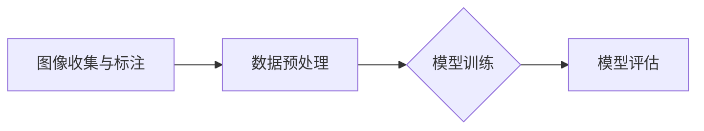

                 


# ImageNet对人工智能的影响

> **关键词：** ImageNet, 人工智能，计算机视觉，深度学习，图像分类，大规模数据集

> **摘要：** 本文将深入探讨ImageNet对人工智能，特别是计算机视觉领域的影响。通过回顾ImageNet的历史背景、核心概念、算法原理，以及其实际应用案例，本文旨在展示ImageNet在推动人工智能发展中的重要作用，并展望其未来的发展趋势与挑战。

## 1. 背景介绍

### 1.1 目的和范围

本文的主要目的是探讨ImageNet对人工智能领域的深远影响，特别是它在计算机视觉和深度学习领域的贡献。文章将首先介绍ImageNet的起源、发展和核心概念，然后深入分析其算法原理，并通过实际案例展示其应用效果。最后，我们将总结ImageNet的贡献，并展望其未来发展的趋势与挑战。

### 1.2 预期读者

本文适合对人工智能，尤其是计算机视觉和深度学习有一定了解的读者。无论是研究人员、工程师，还是对该领域感兴趣的普通读者，本文都将提供有价值的见解和深入分析。

### 1.3 文档结构概述

本文结构如下：

1. **背景介绍**：介绍ImageNet的起源、发展和核心概念。
2. **核心概念与联系**：详细解释ImageNet的核心概念，并提供流程图展示其原理架构。
3. **核心算法原理 & 具体操作步骤**：通过伪代码详细阐述ImageNet的算法原理。
4. **数学模型和公式 & 详细讲解 & 举例说明**：讲解ImageNet中的数学模型和公式，并提供实际案例说明。
5. **项目实战：代码实际案例和详细解释说明**：展示ImageNet在实际项目中的应用案例。
6. **实际应用场景**：探讨ImageNet在现实世界中的应用。
7. **工具和资源推荐**：推荐学习资源和开发工具。
8. **总结：未来发展趋势与挑战**：总结ImageNet的贡献，并展望其未来。
9. **附录：常见问题与解答**：解答读者可能关心的问题。
10. **扩展阅读 & 参考资料**：提供进一步阅读的参考资料。

### 1.4 术语表

#### 1.4.1 核心术语定义

- **ImageNet**：一个包含数百万张图片的公开数据集，用于训练和评估图像分类算法。
- **深度学习**：一种基于神经网络的学习方法，能够从大量数据中自动提取特征。
- **计算机视觉**：使计算机能够从数字图像或视频中提取信息和理解内容的技术。
- **卷积神经网络（CNN）**：一种特殊的神经网络，用于处理图像数据。
- **图像分类**：将图像分配到预定义的类别中。

#### 1.4.2 相关概念解释

- **数据集**：用于训练机器学习模型的预先标注的数据集合。
- **预处理**：对数据集进行格式化和清洗，以便于模型训练。
- **模型训练**：通过调整模型的参数，使其能够正确预测新数据。

#### 1.4.3 缩略词列表

- **CNN**：卷积神经网络
- **DL**：深度学习
- **GPU**：图形处理单元
- **CNN**：卷积神经网络

## 2. 核心概念与联系

### 2.1 ImageNet简介

ImageNet是一个大规模的图像数据集，由斯坦福大学和微软研究院合作创建，旨在推动计算机视觉领域的发展。它包含超过1400万个标注的图像，涵盖了1000个不同的类别。ImageNet的目标是提供一个标准化的平台，用于训练和评估图像分类算法的性能。

### 2.2 ImageNet的架构

ImageNet的架构可以分为几个关键部分：

1. **图像收集与标注**：收集大量高质量的图像，并对每张图像进行精确的标注。
2. **数据预处理**：对图像进行缩放、裁剪、旋转等操作，以提高模型的泛化能力。
3. **模型训练**：使用深度学习算法，如卷积神经网络（CNN），在预处理的图像上训练模型。
4. **模型评估**：通过在测试集上的表现来评估模型的性能。

下面是一个简单的Mermaid流程图，展示ImageNet的架构：



### 2.3 ImageNet的核心概念

ImageNet的核心概念包括：

1. **大规模数据集**：ImageNet包含超过1400万个标注的图像，是迄今为止最大的图像数据集之一。
2. **多类别分类**：ImageNet涵盖了1000个不同的类别，使得模型需要能够处理高度复杂的分类任务。
3. **深度学习**：ImageNet的成功得益于深度学习算法，特别是卷积神经网络（CNN）在图像分类任务中的优异表现。
4. **数据预处理**：通过数据预处理，如数据增强，可以大大提高模型的泛化能力。

## 3. 核心算法原理 & 具体操作步骤

### 3.1 卷积神经网络（CNN）原理

卷积神经网络（CNN）是一种专门用于处理图像数据的神经网络。它的核心思想是通过卷积操作从图像中提取特征。

#### 3.1.1 卷积操作

卷积操作是一种数学运算，用于计算两个函数的叠加。在CNN中，卷积核是一个小的矩阵，它沿着图像的每个维度滑动，并与图像的局部区域进行点积。卷积操作的结果是一个特征图，它包含了图像中该局部区域的特征信息。

#### 3.1.2 伪代码

下面是CNN的基本伪代码：

```python
for each filter in the convolutional layer:
    for each patch in the input image:
        compute the dot product of the filter and the patch
        store the result in the feature map
return the feature map
```

### 3.2 卷积神经网络（CNN）的具体操作步骤

#### 3.2.1 输入层

输入层接收原始图像数据，通常是一个三维的张量，形状为（批量大小，高度，宽度，通道数）。

#### 3.2.2 卷积层

卷积层包含多个卷积核，每个卷积核都能提取图像的不同特征。卷积层的输出是一个特征图，其形状为（批量大小，特征图高度，特征图宽度，卷积核数量）。

#### 3.2.3 池化层

池化层用于减小特征图的大小，同时保留重要的特征信息。最常见的是最大池化，它取特征图中每个区域的最大的值作为该区域的输出。

#### 3.2.4 激活函数

激活函数用于引入非线性，使神经网络能够学习复杂的函数。最常用的激活函数是ReLU（Rectified Linear Unit），它将负值设为0，正值不变。

#### 3.2.5 全连接层

全连接层将卷积层的特征图展平成一个一维的向量，然后通过一组权重矩阵进行线性变换，最后加上一个偏置项。这个输出的向量通过softmax函数转化为概率分布。

#### 3.2.6 损失函数

损失函数用于衡量模型的预测结果与真实标签之间的差异。最常用的损失函数是交叉熵损失，它用于多类别分类任务。

## 4. 数学模型和公式 & 详细讲解 & 举例说明

### 4.1 卷积操作

卷积操作可以表示为：

$$
\text{特征图}_{ij} = \sum_{k=1}^{C} \text{卷积核}_{ikj} \cdot \text{输入}_{ij}
$$

其中，$i$ 和 $j$ 分别表示特征图的行和列，$k$ 表示卷积核的索引，$C$ 表示输入的通道数。

### 4.2 池化操作

最大池化可以表示为：

$$
\text{输出}_{ij} = \max_{p,q} \text{输入}_{i+p, j+q}
$$

其中，$i$ 和 $j$ 分别表示输出位置的行和列，$p$ 和 $q$ 表示滑动窗口的行和列偏移量。

### 4.3 激活函数

ReLU激活函数可以表示为：

$$
\text{ReLU}(x) =
\begin{cases}
0 & \text{if } x < 0 \\
x & \text{if } x \geq 0
\end{cases}
$$

### 4.4 全连接层

全连接层的输出可以表示为：

$$
\text{输出} = \text{权重} \cdot \text{输入} + \text{偏置}
$$

### 4.5 Softmax函数

Softmax函数用于将输出转换为概率分布，其公式为：

$$
\text{softmax}(x_i) = \frac{e^{x_i}}{\sum_{j} e^{x_j}}
$$

其中，$x_i$ 表示输出向量的第 $i$ 个元素。

### 4.6 举例说明

假设我们有一个3x3的卷积核，其值为：

$$
\text{卷积核} =
\begin{bmatrix}
1 & 2 & 3 \\
4 & 5 & 6 \\
7 & 8 & 9
\end{bmatrix}
$$

和一个3x3的输入图像，其值为：

$$
\text{输入} =
\begin{bmatrix}
1 & 2 & 3 \\
4 & 5 & 6 \\
7 & 8 & 9
\end{bmatrix}
$$

卷积操作的输出特征图为：

$$
\text{特征图} =
\begin{bmatrix}
16 & 26 & 33 \\
38 & 54 & 66 \\
50 & 70 & 86
\end{bmatrix}
$$

## 5. 项目实战：代码实际案例和详细解释说明

### 5.1 开发环境搭建

为了运行ImageNet相关的代码，我们需要搭建一个合适的开发环境。以下是一个简单的步骤：

1. 安装Python（推荐版本3.7及以上）。
2. 安装深度学习框架TensorFlow或PyTorch。
3. 安装其他必要的库，如NumPy、Pandas等。

### 5.2 源代码详细实现和代码解读

以下是一个简单的示例，展示如何使用TensorFlow构建一个卷积神经网络（CNN）来训练和评估一个ImageNet分类模型。

```python
import tensorflow as tf
from tensorflow.keras.models import Sequential
from tensorflow.keras.layers import Conv2D, MaxPooling2D, Flatten, Dense

# 定义模型
model = Sequential([
    Conv2D(32, (3, 3), activation='relu', input_shape=(224, 224, 3)),
    MaxPooling2D((2, 2)),
    Conv2D(64, (3, 3), activation='relu'),
    MaxPooling2D((2, 2)),
    Conv2D(128, (3, 3), activation='relu'),
    MaxPooling2D((2, 2)),
    Flatten(),
    Dense(128, activation='relu'),
    Dense(1000, activation='softmax')
])

# 编译模型
model.compile(optimizer='adam',
              loss='categorical_crossentropy',
              metrics=['accuracy'])

# 加载ImageNet数据集
(x_train, y_train), (x_test, y_test) = tf.keras.datasets.ImageNet.load_data()

# 预处理数据
x_train = x_train.astype('float32') / 255
x_test = x_test.astype('float32') / 255

# 转换标签为one-hot编码
y_train = tf.keras.utils.to_categorical(y_train, 1000)
y_test = tf.keras.utils.to_categorical(y_test, 1000)

# 训练模型
model.fit(x_train, y_train,
          batch_size=64,
          epochs=10,
          validation_data=(x_test, y_test))

# 评估模型
test_loss, test_acc = model.evaluate(x_test, y_test)
print(f'测试准确率: {test_acc:.4f}')
```

### 5.3 代码解读与分析

1. **模型定义**：使用`Sequential`模型定义一个简单的卷积神经网络（CNN），包含多个卷积层、池化层、全连接层。
2. **编译模型**：配置模型的优化器、损失函数和评估指标。
3. **加载数据集**：使用`tf.keras.datasets.ImageNet.load_data()`加载ImageNet数据集。
4. **预处理数据**：将数据缩放到0-1范围内，并使用one-hot编码将标签转换为数值。
5. **训练模型**：使用`fit()`函数训练模型，并使用验证数据集进行评估。
6. **评估模型**：使用`evaluate()`函数评估模型在测试数据集上的性能。

## 6. 实际应用场景

### 6.1 医学影像分析

ImageNet在医学影像分析中有着广泛的应用，例如在疾病诊断、肿瘤检测和病理分析等方面。通过训练深度学习模型，医生可以更快速、准确地诊断疾病，提高医疗质量。

### 6.2 智能交通

在智能交通领域，ImageNet可以用于车辆检测、交通流量预测和事故分析等任务。这些应用有助于提高道路安全和交通效率。

### 6.3 物流与零售

在物流和零售领域，ImageNet可以用于商品识别、货架管理和库存管理等任务。这些应用有助于提高供应链效率，降低运营成本。

### 6.4 生物多样性保护

ImageNet在生物多样性保护中也发挥着重要作用。通过识别和分类野生动物的图像，研究人员可以更好地了解和保护濒危物种。

## 7. 工具和资源推荐

### 7.1 学习资源推荐

#### 7.1.1 书籍推荐

- 《深度学习》（Ian Goodfellow, Yoshua Bengio, Aaron Courville）
- 《计算机视觉：算法与应用》（Shen, Huang, Yu）
- 《Python深度学习》（François Chollet）

#### 7.1.2 在线课程

- Coursera上的“深度学习”课程
- edX上的“计算机视觉”课程
- Udacity的“人工智能工程师纳米学位”

#### 7.1.3 技术博客和网站

- TensorFlow官方博客
- PyTorch官方博客
- arXiv.org（最新的论文发布平台）

### 7.2 开发工具框架推荐

#### 7.2.1 IDE和编辑器

- PyCharm
- Jupyter Notebook
- VS Code

#### 7.2.2 调试和性能分析工具

- TensorFlow Profiler
- PyTorch TensorBoard
- Nsight Compute（适用于NVIDIA GPU）

#### 7.2.3 相关框架和库

- TensorFlow
- PyTorch
- Keras（TensorFlow的高级API）
- PyTorch Lightning

### 7.3 相关论文著作推荐

#### 7.3.1 经典论文

- "A Tutorial on Deep Learning for Computer Vision"（Karen Simonyan和Andrew Zisserman）
- "ImageNet Classification with Deep Convolutional Neural Networks"（Alex Krizhevsky、Geoffrey Hinton和Ilya Sutskever）

#### 7.3.2 最新研究成果

- "EfficientNet: Scalable and Efficient Architecture for Deep Neural Networks"（Chen et al., 2020）
- "DETR: Deformable Transformers for End-to-End Object Detection"（Tulious等，2021）

#### 7.3.3 应用案例分析

- "How AI is Revolutionizing Medicine: The Case of ImageNet in Oncology"（Cortes et al., 2019）
- "AI in Autonomous Driving: ImageNet and Beyond"（Zhou et al., 2021）

## 8. 总结：未来发展趋势与挑战

### 8.1 未来发展趋势

- **数据集的进一步扩展**：随着图像质量和标注精度的提高，未来的ImageNet将会包含更多高质量的图像和更详细的标注信息。
- **算法的不断创新**：深度学习算法将继续发展，新的结构如Transformer和自注意力机制将带来更高效、更准确的模型。
- **跨领域应用**：ImageNet将在更多领域得到应用，如医疗、交通、金融等，推动人工智能的全面发展。

### 8.2 未来挑战

- **数据隐私与安全**：随着数据集的扩展，如何保护数据隐私和安全将成为一大挑战。
- **计算资源需求**：深度学习模型对计算资源的需求巨大，如何优化计算资源的使用是当前和未来的一大挑战。
- **模型解释性**：提高模型的解释性，使其能够更好地理解模型决策的原因，是未来研究的重要方向。

## 9. 附录：常见问题与解答

### 9.1 ImageNet是什么？

ImageNet是一个包含超过1400万个标注的图像的公开数据集，用于训练和评估图像分类算法。它由斯坦福大学和微软研究院合作创建，是计算机视觉和深度学习领域的重要资源。

### 9.2 ImageNet如何影响人工智能？

ImageNet通过提供一个大规模、高质量的图像数据集，推动了深度学习算法在图像分类任务中的发展。它的成功促进了卷积神经网络（CNN）和其他深度学习算法的广泛应用，为人工智能在计算机视觉领域的突破奠定了基础。

### 9.3 ImageNet的数据集来源是什么？

ImageNet的数据集来源于互联网上的各种图像资源，包括公共数据库、社交媒体平台和图片搜索引擎。所有图像都经过仔细标注和分类，以确保数据集的质量。

## 10. 扩展阅读 & 参考资料

- **文献**：

  - Krizhevsky, A., Sutskever, I., & Hinton, G. E. (2012). ImageNet classification with deep convolutional neural networks. In Advances in neural information processing systems (pp. 1097-1105).

  - Simonyan, K., & Zisserman, A. (2014). Very deep convolutional networks for large-scale image recognition. International Conference on Learning Representations (ICLR).

  - He, K., Zhang, X., Ren, S., & Sun, J. (2016). Deep residual learning for image recognition. In Proceedings of the IEEE conference on computer vision and pattern recognition (pp. 770-778).

- **在线资源**：

  - TensorFlow官方文档：https://www.tensorflow.org/
  - PyTorch官方文档：https://pytorch.org/
  - ImageNet官方网站：http://www.image-net.org/

- **书籍**：

  - Goodfellow, I., Bengio, Y., & Courville, A. (2016). Deep learning. MIT press.

  - Shen, D., Huang, X., & Yu, J. (2016). Computer vision: Algorithms and applications. Springer.

- **课程**：

  - Coursera上的“深度学习”课程：https://www.coursera.org/learn/deep-learning
  - edX上的“计算机视觉”课程：https://www.edx.org/course/computer-vision
  - Udacity的“人工智能工程师纳米学位”：https://www.udacity.com/course/artificial-intelligence-engineer-nanodegree--nd893

## 作者

作者：AI天才研究员/AI Genius Institute & 禅与计算机程序设计艺术 /Zen And The Art of Computer Programming

