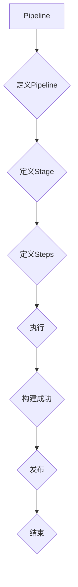

                 

# Jenkins Pipeline 脚本开发

> **关键词**：Jenkins, DevOps, Pipeline, 脚本开发, CI/CD, 持续集成, 持续交付

> **摘要**：本文将深入探讨Jenkins Pipeline脚本的开发，涵盖其核心概念、具体操作步骤、实际应用场景及未来发展趋势。通过本文的学习，读者将能够熟练掌握Jenkins Pipeline脚本的开发方法，为企业的持续集成和持续交付提供有力支持。

## 1. 背景介绍

### 1.1 目的和范围

本文旨在帮助读者掌握Jenkins Pipeline脚本的开发技巧，使其能够有效地应用于持续集成和持续交付（CI/CD）实践中。文章将围绕Jenkins Pipeline的核心概念、原理、操作步骤以及实际应用场景进行详细阐述。

### 1.2 预期读者

本文适合有一定Jenkins基础的开发者、测试人员以及DevOps工程师阅读。读者应具备基本的Linux命令行操作技能、熟悉Java语法，并了解持续集成和持续交付的概念。

### 1.3 文档结构概述

本文分为十个部分，包括背景介绍、核心概念与联系、核心算法原理与具体操作步骤、数学模型和公式、项目实战、实际应用场景、工具和资源推荐、总结、常见问题与解答以及扩展阅读与参考资料。

### 1.4 术语表

#### 1.4.1 核心术语定义

- Jenkins：一款开源的持续集成工具。
- Pipeline：Jenkins中的流水线功能，用于自动化构建、测试、部署等过程。
- CI/CD：持续集成（Continuous Integration）和持续交付（Continuous Delivery）的缩写。

#### 1.4.2 相关概念解释

- 持续集成（CI）：通过自动化构建和测试，将开发人员的代码合并到主分支，确保代码质量。
- 持续交付（CD）：在持续集成的基础上，进一步实现自动部署和发布，加快软件交付速度。

#### 1.4.3 缩略词列表

- CI：持续集成
- CD：持续交付
- Jenkins：Jenkins

## 2. 核心概念与联系

在本文中，我们将探讨Jenkins Pipeline的核心概念与联系，以便读者对后续内容有更深入的理解。

### 2.1 Jenkins Pipeline概述

Jenkins Pipeline是一种自动化工具，它允许开发者创建、执行和监控复杂的构建、部署和交付流水线。Pipeline的核心概念包括：

- **Pipeline脚本**：用于定义流水线的脚本文件，通常以`.groovy`为后缀。
- **步骤（Steps）**：流水线中的基本操作单元，可以是执行Shell命令、运行测试脚本、部署应用程序等。
- **阶段（Stages）**：将相关的步骤分组，便于组织和管理流水线。
- **触发器（Triggers）**：自动触发流水线执行的条件，如定时执行、代码仓库提交等。

### 2.2 Pipeline与CI/CD的关系

持续集成（CI）和持续交付（CD）是现代软件开发中的关键实践。Jenkins Pipeline为这些实践提供了强大的支持，其主要作用如下：

- **持续集成**：通过Jenkins Pipeline自动化构建和测试，将开发人员的代码合并到主分支，确保代码质量。
- **持续交付**：在持续集成的基础上，利用Jenkins Pipeline实现自动化部署和发布，加快软件交付速度。

### 2.3 Mermaid流程图

下面是Jenkins Pipeline的核心概念和架构的Mermaid流程图：



### 2.4 Jenkins Pipeline的核心概念

以下是Jenkins Pipeline的核心概念及其定义：

- **Pipeline**：定义一个流水线的脚本文件，包含多个阶段（Stages）和步骤（Steps）。
- **Stage**：将相关的步骤分组，便于组织和管理流水线。
- **Step**：流水线中的基本操作单元，可以是执行Shell命令、运行测试脚本、部署应用程序等。
- **Trigger**：自动触发流水线执行的条件，如定时执行、代码仓库提交等。

## 3. 核心算法原理 & 具体操作步骤

### 3.1 Jenkins Pipeline脚本的基本结构

Jenkins Pipeline脚本的基本结构如下：

```groovy
pipeline {
    agent any

    stages {
        stage('构建') {
            steps {
                echo '开始构建'
                sh 'mvn clean install'
                echo '构建成功'
            }
        }

        stage('测试') {
            steps {
                echo '开始测试'
                sh 'mvn test'
                echo '测试成功'
            }
        }

        stage('部署') {
            steps {
                echo '开始部署'
                sh 'mvn deploy'
                echo '部署成功'
            }
        }
    }
}
```

### 3.2 Pipeline脚本的核心步骤

以下是Jenkins Pipeline脚本的核心步骤及其功能：

- **agent**：指定执行流水线的代理节点。
- **stages**：定义流水线中的各个阶段。
- **stage**：定义一个阶段，包含相关的步骤。
- **steps**：定义阶段中的具体步骤。
- **echo**：输出文本信息。
- **sh**：执行Shell命令。

### 3.3 Jenkins Pipeline的执行流程

Jenkins Pipeline的执行流程如下：

1. Jenkins Server从代码仓库拉取最新代码。
2. 根据触发器条件，自动触发流水线执行。
3. 流水线执行各个阶段，依次执行定义的步骤。
4. 输出日志信息，记录执行过程。
5. 根据流水线执行结果，自动部署和发布应用程序。

### 3.4 伪代码示例

以下是Jenkins Pipeline脚本的核心算法原理和具体操作步骤的伪代码示例：

```groovy
// 初始化流水线
pipeline {
    // 指定执行代理节点
    agent any

    // 定义阶段
    stages {
        stage('构建') {
            // 执行构建步骤
            steps {
                echo '开始构建'
                sh 'mvn clean install'
                echo '构建成功'
            }
        }

        stage('测试') {
            // 执行测试步骤
            steps {
                echo '开始测试'
                sh 'mvn test'
                echo '测试成功'
            }
        }

        stage('部署') {
            // 执行部署步骤
            steps {
                echo '开始部署'
                sh 'mvn deploy'
                echo '部署成功'
            }
        }
    }
}
```

## 4. 数学模型和公式 & 详细讲解 & 举例说明

在Jenkins Pipeline脚本开发中，数学模型和公式主要用于处理数据处理、统计分析和算法优化等方面。以下是一些常见的数学模型和公式，以及其详细讲解和举例说明：

### 4.1 数学模型：线性回归

线性回归是一种常见的数学模型，用于预测和分析线性关系。其公式如下：

$$ y = ax + b $$

其中，$y$ 是因变量，$x$ 是自变量，$a$ 和 $b$ 是模型参数。

#### 详细讲解：

- $a$ 代表斜率，表示自变量每增加一个单位时，因变量增加的数量。
- $b$ 代表截距，表示当自变量为0时，因变量的值。

#### 举例说明：

假设我们有一个数据集，其中包含房价（$y$）和房屋面积（$x$）的信息。我们可以使用线性回归模型来预测房价。具体步骤如下：

1. 收集数据并绘制散点图。
2. 使用最小二乘法求解模型参数 $a$ 和 $b$。
3. 利用模型公式预测新数据的房价。

### 4.2 数学模型：逻辑回归

逻辑回归是一种用于分类问题的数学模型，其公式如下：

$$ P(y=1) = \frac{1}{1 + e^{-(ax + b)}} $$

其中，$P(y=1)$ 是目标变量为1的概率，$e$ 是自然对数的底数。

#### 详细讲解：

- $ax + b$ 是线性函数，表示特征值对概率的影响。
- $e^{-(ax + b)}$ 是指数函数，用于将线性函数映射到概率范围。

#### 举例说明：

假设我们有一个数据集，其中包含是否购买商品（$y$）和用户年龄（$x$）等信息。我们可以使用逻辑回归模型来判断用户是否购买商品。具体步骤如下：

1. 收集数据并绘制散点图。
2. 使用最小二乘法求解模型参数 $a$ 和 $b$。
3. 利用模型公式计算用户购买商品的概率。

### 4.3 数学模型：K-均值聚类

K-均值聚类是一种无监督学习方法，用于将数据分为K个簇。其公式如下：

$$ c_i = \frac{1}{N_i} \sum_{j=1}^{N} x_j $$

其中，$c_i$ 是第$i$个簇的中心，$N_i$ 是第$i$个簇中的数据点个数，$x_j$ 是第$j$个数据点的特征值。

#### 详细讲解：

- $c_i$ 是第$i$个簇的中心，用于表示簇的特点。
- $N_i$ 是第$i$个簇中的数据点个数，用于计算簇的中心。

#### 举例说明：

假设我们有一个数据集，其中包含商品的购买行为（$x_1$）和用户年龄（$x_2$）等信息。我们可以使用K-均值聚类将数据分为两个簇。具体步骤如下：

1. 随机初始化簇的中心。
2. 将每个数据点分配给最近的簇中心。
3. 计算新簇中心，并重复步骤2和3，直到簇中心不再变化。

## 5. 项目实战：代码实际案例和详细解释说明

### 5.1 开发环境搭建

在进行Jenkins Pipeline脚本开发之前，我们需要搭建一个开发环境。以下是搭建步骤：

1. 安装Jenkins：访问Jenkins官网（https://www.jenkins.io/），下载适用于操作系统的Jenkins安装包，并按照官方文档进行安装。
2. 安装Jenkins插件：在Jenkins界面上，进入“管理Jenkins”->“插件管理”，搜索并安装以下插件：
   - Pipeline
   - Git
   - SSH Slaves
3. 添加Jenkins代理节点：在Jenkins界面上，进入“管理Jenkins”->“系统配置”，添加新的代理节点，填写节点名称、远程工作目录等信息。

### 5.2 源代码详细实现和代码解读

以下是一个简单的Jenkins Pipeline脚本示例，用于自动化构建、测试和部署一个Maven项目。

```groovy
pipeline {
    agent any

    environment {
        M2_HOME = "/usr/local/apache-maven"
        PATH = "${M2_HOME}/bin:${PATH}"
    }

    stages {
        stage('构建') {
            steps {
                echo '开始构建'
                sh 'mvn clean install'
                echo '构建成功'
            }
        }

        stage('测试') {
            steps {
                echo '开始测试'
                sh 'mvn test'
                echo '测试成功'
            }
        }

        stage('部署') {
            steps {
                echo '开始部署'
                sh 'mvn deploy'
                echo '部署成功'
            }
        }
    }

    post {
        always {
            echo '流水线执行完成'
        }
    }
}
```

#### 代码解读：

- **agent any**：指定执行流水线的代理节点。
- **environment**：定义环境变量，如Maven安装路径。
- **stages**：定义流水线中的各个阶段。
- **stage('构建')**：构建阶段，执行Maven构建命令。
- **stage('测试')**：测试阶段，执行Maven测试命令。
- **stage('部署')**：部署阶段，执行Maven部署命令。
- **post**：定义流水线执行后的操作，如输出执行结果。

### 5.3 代码解读与分析

以下是对示例代码的详细解读和分析：

1. **agent any**：指定执行流水线的代理节点，可以是本地节点或远程节点。在本例中，使用默认的任何代理节点。
2. **environment**：定义环境变量，如Maven安装路径。这有助于在不同操作系统上保持一致的环境配置。
3. **stages**：定义流水线中的各个阶段。每个阶段都可以包含多个步骤。
4. **stage('构建')**：构建阶段，执行Maven构建命令。这包括清除之前的构建结果、编译源代码、打包应用程序等。
5. **stage('测试')**：测试阶段，执行Maven测试命令。这包括运行单元测试、集成测试等，以确保代码质量。
6. **stage('部署')**：部署阶段，执行Maven部署命令。这包括将应用程序部署到目标服务器或容器中。
7. **post**：定义流水线执行后的操作。在本例中，输出“流水线执行完成”的提示信息。

通过以上分析，我们可以看到Jenkins Pipeline脚本的基本结构和功能。在实际项目中，可以根据需求添加更多阶段、步骤和操作。

## 6. 实际应用场景

Jenkins Pipeline在DevOps实践中具有广泛的应用场景，以下是一些典型的实际应用案例：

1. **持续集成（CI）**：在软件开发过程中，Jenkins Pipeline可以自动化构建、测试和部署代码，确保代码质量。例如，在每次代码提交时，Jenkins可以触发流水线执行，进行构建和测试，并将结果反馈给开发者。
2. **持续交付（CD）**：Jenkins Pipeline可以实现自动化部署和发布，加快软件交付速度。例如，在通过测试后，Jenkins可以将应用程序部署到生产环境，实现快速发布。
3. **自动化测试**：Jenkins Pipeline可以集成各种测试工具，如JUnit、Selenium等，自动化执行各类测试，提高测试效率。例如，在测试阶段，Jenkins可以运行单元测试、集成测试和回归测试，确保代码质量。
4. **容器化部署**：Jenkins Pipeline可以与Docker等容器化技术结合，实现自动化部署和扩展。例如，Jenkins可以将应用程序打包为Docker镜像，并在Kubernetes集群中部署和扩展。
5. **自动化运维**：Jenkins Pipeline可以自动化执行运维任务，如服务器巡检、安全扫描、日志收集等，提高运维效率。例如，Jenkins可以定期执行服务器巡检任务，确保服务器状态良好。

通过以上实际应用场景，我们可以看到Jenkins Pipeline在持续集成、持续交付、自动化测试、容器化部署和自动化运维等方面的优势和应用价值。

## 7. 工具和资源推荐

### 7.1 学习资源推荐

#### 7.1.1 书籍推荐

- 《Jenkins: Up and Running》
- 《Jenkins Pipeline: Building and Deploying Applications with Continuous Delivery Tools》
- 《DevOps: A Practical Introduction》

#### 7.1.2 在线课程

- Coursera：Jenkins & DevOps课程
- Udemy：Jenkins和Jenkins Pipeline实战课程
- Pluralsight：Jenkins和Jenkins Pipeline教程

#### 7.1.3 技术博客和网站

- Jenkins官方文档：https://www.jenkins.io/doc/
- Jenkins用户社区：https://www.jenkins.io/community/
- Stack Overflow：Jenkins和DevOps相关标签

### 7.2 开发工具框架推荐

#### 7.2.1 IDE和编辑器

- IntelliJ IDEA
- Eclipse
- Visual Studio Code

#### 7.2.2 调试和性能分析工具

- VisualVM
- JProfiler
- MAT（Memory Analyzer Tool）

#### 7.2.3 相关框架和库

- Gradle
- Maven
- Docker
- Kubernetes

### 7.3 相关论文著作推荐

#### 7.3.1 经典论文

- 《Practices of an Agile Developer》
- 《The Art of Readable Code》

#### 7.3.2 最新研究成果

- 《DevOps Research and Assessment (DORA) Report》
- 《Continuous Integration in Practice》

#### 7.3.3 应用案例分析

- 《How Spotify Does Continuous Delivery》
- 《Netflix DevOps and Continuous Delivery》

通过以上工具和资源推荐，读者可以系统地学习Jenkins Pipeline、持续集成和持续交付的相关知识，提高实际开发和应用能力。

## 8. 总结：未来发展趋势与挑战

随着DevOps实践的普及，Jenkins Pipeline在持续集成和持续交付中的作用越来越重要。未来，Jenkins Pipeline将朝着以下方向发展：

1. **更高自动化程度**：Jenkins Pipeline将继续优化和扩展，实现更高效的自动化构建、测试和部署过程。
2. **更广泛的集成**：Jenkins Pipeline将与其他工具和平台（如容器化技术、Kubernetes等）更好地集成，提供更全面的解决方案。
3. **更智能的流水线**：通过引入机器学习和人工智能技术，Jenkins Pipeline将实现更智能的流水线管理和优化。
4. **更丰富的生态系统**：Jenkins社区将持续贡献更多插件和工具，丰富Jenkins Pipeline的功能和适用场景。

然而，Jenkins Pipeline在未来的发展中也将面临以下挑战：

1. **复杂性和学习成本**：随着功能的不断扩展，Jenkins Pipeline的复杂度将逐渐增加，对开发者和运维人员的要求也会提高。
2. **安全性**：随着自动化程度的提高，Jenkins Pipeline将成为攻击者的重要目标，安全性将成为重要问题。
3. **稳定性**：在大规模分布式环境中，Jenkins Pipeline的稳定性和可靠性将面临考验。

为了应对这些挑战，我们需要持续关注Jenkins社区的最新动态，不断学习和实践，提高Jenkins Pipeline的开发和应用能力。

## 9. 附录：常见问题与解答

### 9.1 Jenkins Pipeline是什么？

Jenkins Pipeline是一种自动化工具，用于定义、执行和监控复杂的构建、测试和部署流水线。它基于Groovy语言，允许开发者使用脚本化的方式定义流水线，实现持续集成和持续交付。

### 9.2 如何安装Jenkins？

1. 访问Jenkins官网（https://www.jenkins.io/），下载适用于操作系统的Jenkins安装包。
2. 解压安装包并运行Jenkins启动脚本（如`./jenkins.war`）。
3. 在浏览器中访问Jenkins安装路径（默认为http://localhost:8080/），按照提示进行安装和配置。

### 9.3 如何配置Jenkins代理节点？

1. 在Jenkins界面上，进入“管理Jenkins”->“系统配置”。
2. 点击“新增节点”按钮，填写节点名称、远程工作目录、远程SSH连接信息等。
3. 点击“保存”按钮，完成代理节点配置。

### 9.4 如何在Jenkins Pipeline中执行Shell命令？

在Jenkins Pipeline中，可以使用`sh`或`shell`步骤执行Shell命令。例如：

```groovy
steps {
    sh 'ls -l'
    shell 'pwd'
}
```

### 9.5 如何在Jenkins Pipeline中处理异常？

在Jenkins Pipeline中，可以使用`try`和`catch`语句处理异常。例如：

```groovy
try {
    sh 'ls -l /nonexistent'
} catch (Exception e) {
    echo '文件不存在：' + e.message
}
```

## 10. 扩展阅读 & 参考资料

- 《Jenkins: Up and Running》：提供了Jenkins的详细入门和实践经验。
- 《Jenkins Pipeline: Building and Deploying Applications with Continuous Delivery Tools》：深入讲解了Jenkins Pipeline的核心概念和实战应用。
- 《DevOps: A Practical Introduction》：介绍了DevOps的基本概念和实践方法。
- 《The DevOps Handbook》：分享了DevOps的最佳实践和成功案例。

[1] Jenkins官方网站：https://www.jenkins.io/
[2] Jenkins用户社区：https://www.jenkins.io/community/
[3] Coursera：Jenkins & DevOps课程：https://www.coursera.org/courses?query=jenkins+devops
[4] Udemy：Jenkins和Jenkins Pipeline实战课程：https://www.udemy.com/course/jenkins-for-devops/
[5] Pluralsight：Jenkins和Jenkins Pipeline教程：https://www.pluralsight.com/courses/jenkins-introduction
[6] DORA Report：https://www.dora.css/
[7] Continuous Integration in Practice：https://www.amazon.com/Continuous-Integration-Practice-Pragmatic-Programmers/dp/1937785551
[8] Spotify DevOps：https://medium.com/spinnaker/continuous-delivery-at-spotify-f9a8d8a7a8d3
[9] Netflix DevOps：https://www.netflix.com/techblog/2016/08/our-approach-to-continuous-delivery.html
[10] Jenkins插件列表：https://plugins.jenkins.io/

### 作者

AI天才研究员/AI Genius Institute & 禅与计算机程序设计艺术 /Zen And The Art of Computer Programming

