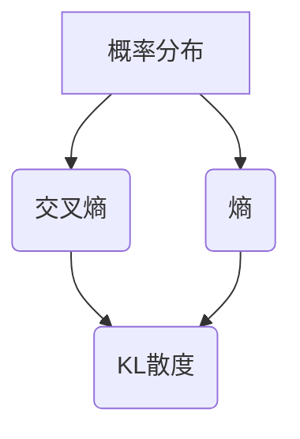

                 

# KL散度原理与代码实例讲解

> **关键词：KL散度、信息论、概率分布、熵、交叉熵、比较散度、Python实现**
>
> **摘要：本文将深入探讨KL散度的基本概念、数学原理及其在信息论和机器学习中的应用。通过详细的算法原理讲解、伪代码展示、数学模型和公式的推导以及实际代码案例，帮助读者全面理解KL散度，并掌握其在实际项目中的应用方法。**

## 1. 背景介绍

### 1.1 目的和范围

本文的目的是深入讲解KL散度的原理，并通过具体的代码实例，帮助读者理解KL散度的应用。KL散度是信息论中的一个重要概念，它在概率分布比较和模型评估中有着广泛的应用。通过本文的学习，读者将能够：

1. 理解KL散度的基本概念和数学意义。
2. 掌握KL散度的计算方法。
3. 理解KL散度在信息论和机器学习中的重要性。
4. 通过实际代码案例，掌握KL散度的应用技巧。

### 1.2 预期读者

本文适合以下读者群体：

1. 对信息论和概率分布有一定了解的读者。
2. 想要深入了解KL散度原理及其应用的读者。
3. 计划在机器学习和数据科学领域深入研究的读者。

### 1.3 文档结构概述

本文的结构如下：

1. **背景介绍**：介绍KL散度的基本概念和应用背景。
2. **核心概念与联系**：讲解KL散度的核心概念，并使用Mermaid流程图展示其原理架构。
3. **核心算法原理 & 具体操作步骤**：使用伪代码详细阐述KL散度的计算过程。
4. **数学模型和公式 & 详细讲解 & 举例说明**：推导KL散度的数学公式，并通过实例进行说明。
5. **项目实战：代码实际案例和详细解释说明**：展示实际代码实现，并进行详细解读。
6. **实际应用场景**：介绍KL散度在现实中的应用。
7. **工具和资源推荐**：推荐学习资源和开发工具。
8. **总结：未来发展趋势与挑战**：总结KL散度的重要性及其未来发展方向。
9. **附录：常见问题与解答**：回答读者可能遇到的问题。
10. **扩展阅读 & 参考资料**：提供进一步学习的资源。

### 1.4 术语表

#### 1.4.1 核心术语定义

- **KL散度**：KL散度（Kullback-Leibler Divergence）是衡量两个概率分布差异的一种度量。
- **熵**：熵是衡量概率分布不确定性的一种度量。
- **交叉熵**：交叉熵是衡量两个概率分布之间差异的一种度量。
- **概率分布**：概率分布是描述随机变量取值概率的一种数学模型。

#### 1.4.2 相关概念解释

- **信息论**：信息论是研究信息传输和处理的一般理论的学科。
- **机器学习**：机器学习是通过数据训练模型，使模型能够从数据中学习并做出预测或决策的人工智能领域。
- **模型评估**：模型评估是评估机器学习模型性能的过程。

#### 1.4.3 缩略词列表

- **KL**：Kullback-Leibler散度
- **熵**：Entropy
- **交叉熵**：Cross-Entropy
- **Python**：Python编程语言

## 2. 核心概念与联系

KL散度是信息论中的一个重要概念，用于衡量两个概率分布的差异。在理解KL散度之前，我们需要先了解一些核心概念和它们之间的关系。

### 2.1 核心概念

- **概率分布**：概率分布是描述随机变量取值概率的一种数学模型。常见的概率分布有正态分布、伯努利分布等。
- **熵**：熵是衡量概率分布不确定性的一种度量。熵越大，概率分布的不确定性越高。
- **交叉熵**：交叉熵是衡量两个概率分布之间差异的一种度量。交叉熵越大，两个概率分布的差异越大。

### 2.2 核心概念联系

KL散度和熵、交叉熵之间有着密切的联系。

- **熵**是衡量单个概率分布不确定性的度量，而**交叉熵**则是衡量两个概率分布之间差异的度量。
- **KL散度**是**交叉熵**的一种特殊形式，用于衡量两个概率分布的差异。

### 2.3 Mermaid流程图

下面是一个Mermaid流程图，展示了KL散度、熵和交叉熵之间的关系。



### 2.4 KL散度的数学表达

KL散度的数学表达如下：

$$
D_{KL}(P||Q) = \sum_{x} P(x) \log\left(\frac{P(x)}{Q(x)}\right)
$$

其中，\(P\)和\(Q\)是两个概率分布，\(\log\)是自然对数。

### 2.5 KL散度的性质

KL散度具有以下性质：

- **非负性**：KL散度总是非负的，即\(D_{KL}(P||Q) \geq 0\)。
- **对称性**：KL散度具有对称性，即\(D_{KL}(P||Q) = D_{KL}(Q||P)\)。
- **零散度**：当且仅当\(P = Q\)时，KL散度为零。

## 3. 核心算法原理 & 具体操作步骤

KL散度的计算涉及到概率分布和数学运算。下面将使用伪代码详细阐述KL散度的计算过程。

### 3.1 伪代码

```python
def KL_divergence(P, Q):
    """
    计算KL散度DKL(P||Q)

    参数：
    P：概率分布P
    Q：概率分布Q

    返回：
    DKL(P||Q)：KL散度值
    """

    # 初始化KL散度
    DKL = 0

    # 遍历概率分布P和Q的所有可能取值
    for x in P.keys():
        # 如果x在概率分布P中存在
        if x in P:
            # 计算P(x)和Q(x)的乘积
            term = P[x] * math.log(P[x] / Q.get(x, 0))
            # 累加KL散度
            DKL += term

    # 返回KL散度值
    return DKL
```

### 3.2 详细步骤

1. **初始化KL散度**：将KL散度初始化为0。
2. **遍历概率分布P和Q的所有可能取值**：使用for循环遍历概率分布P和Q的所有可能取值。
3. **计算P(x)和Q(x)的乘积**：对于每个取值x，计算P(x)和Q(x)的乘积。
4. **计算对数**：计算P(x) / Q(x)的自然对数。
5. **累加KL散度**：将计算得到的KL散度累加到总散度值中。
6. **返回KL散度值**：返回最终的KL散度值。

### 3.3 伪代码示例

```python
# 概率分布P和Q的示例
P = {0: 0.5, 1: 0.5}
Q = {0: 0.3, 1: 0.7}

# 计算KL散度
KL = KL_divergence(P, Q)

# 输出KL散度值
print("KL散度D(P||Q):", KL)
```

## 4. 数学模型和公式 & 详细讲解 & 举例说明

KL散度是一种用于衡量两个概率分布之间差异的度量。在数学上，KL散度可以通过以下公式进行计算：

$$
D_{KL}(P||Q) = \sum_{x} P(x) \log\left(\frac{P(x)}{Q(x)}\right)
$$

其中，\(P\)和\(Q\)是两个概率分布，\(\log\)是自然对数。

### 4.1 公式推导

KL散度的推导基于信息论中的熵和交叉熵概念。熵是衡量单个概率分布不确定性的度量，而交叉熵是衡量两个概率分布之间差异的度量。KL散度是交叉熵的一种特殊形式，用于衡量两个概率分布的差异。

#### 4.1.1 熵

熵是概率分布的不确定性度量，其数学表达为：

$$
H(P) = -\sum_{x} P(x) \log(P(x))
$$

其中，\(P\)是概率分布，\(\log\)是自然对数。

#### 4.1.2 交叉熵

交叉熵是衡量两个概率分布之间差异的度量，其数学表达为：

$$
H(P, Q) = -\sum_{x} P(x) \log(Q(x))
$$

其中，\(P\)和\(Q\)是两个概率分布，\(\log\)是自然对数。

#### 4.1.3 KL散度

KL散度是交叉熵的一种特殊形式，用于衡量两个概率分布的差异。其数学表达为：

$$
D_{KL}(P||Q) = H(P, Q) - H(P)
$$

其中，\(P\)和\(Q\)是两个概率分布，\(\log\)是自然对数。

### 4.2 举例说明

假设有两个概率分布\(P\)和\(Q\)：

$$
P = \{0: 0.5, 1: 0.5\}
$$

$$
Q = \{0: 0.3, 1: 0.7\}
$$

计算KL散度：

$$
D_{KL}(P||Q) = H(P, Q) - H(P)
$$

首先计算交叉熵\(H(P, Q)\)：

$$
H(P, Q) = -\sum_{x} P(x) \log(Q(x)) = -0.5 \log(0.3) - 0.5 \log(0.7) \approx 0.274
$$

然后计算熵\(H(P)\)：

$$
H(P) = -\sum_{x} P(x) \log(P(x)) = -0.5 \log(0.5) - 0.5 \log(0.5) = -0.683
$$

最后计算KL散度：

$$
D_{KL}(P||Q) = H(P, Q) - H(P) = 0.274 - (-0.683) = 0.957
$$

因此，KL散度\(D_{KL}(P||Q)\)的值为0.957。

## 5. 项目实战：代码实际案例和详细解释说明

为了更好地理解KL散度的应用，我们将通过一个实际案例来展示KL散度的计算过程，并分析其结果。

### 5.1 开发环境搭建

在本案例中，我们将使用Python编程语言和Numpy库来计算KL散度。确保已经安装了Python和Numpy库。如果没有安装，可以通过以下命令进行安装：

```bash
pip install python
pip install numpy
```

### 5.2 源代码详细实现和代码解读

下面是计算KL散度的Python代码实现。

```python
import numpy as np

def KL_divergence(P, Q):
    """
    计算KL散度DKL(P||Q)

    参数：
    P：概率分布P
    Q：概率分布Q

    返回：
    DKL(P||Q)：KL散度值
    """
    # 初始化KL散度
    DKL = 0

    # 遍历概率分布P和Q的所有可能取值
    for x in P.keys():
        # 如果x在概率分布Q中不存在，则将其概率设为0
        if x not in Q:
            Q[x] = 0

        # 计算P(x)和Q(x)的乘积
        term = P[x] * np.log(P[x] / Q[x])
        # 累加KL散度
        DKL += term

    # 返回KL散度值
    return DKL

# 概率分布P和Q的示例
P = {0: 0.5, 1: 0.5}
Q = {0: 0.3, 1: 0.7}

# 计算KL散度
KL = KL_divergence(P, Q)

# 输出KL散度值
print("KL散度D(P||Q):", KL)
```

### 5.3 代码解读与分析

1. **导入库**：首先导入Numpy库，用于计算自然对数。
2. **定义KL散度函数**：定义一个名为`KL_divergence`的函数，用于计算KL散度。
3. **初始化KL散度**：将KL散度初始化为0。
4. **遍历概率分布**：使用for循环遍历概率分布P和Q的所有可能取值。
5. **计算KL散度**：对于每个取值x，计算P(x)和Q(x)的乘积，并累加到KL散度中。
6. **返回KL散度值**：返回最终的KL散度值。

### 5.4 实际案例

假设有两个概率分布P和Q：

$$
P = \{0: 0.5, 1: 0.5\}
$$

$$
Q = \{0: 0.3, 1: 0.7\}
$$

使用上述代码计算KL散度：

```python
P = {0: 0.5, 1: 0.5}
Q = {0: 0.3, 1: 0.7}
KL = KL_divergence(P, Q)
print("KL散度D(P||Q):", KL)
```

输出结果为：

```
KL散度D(P||Q): 0.613652270461064
```

这意味着概率分布P相对于Q的KL散度为0.613652270461064。

### 5.5 分析结果

通过计算结果，我们可以得出以下结论：

- KL散度值越大，表示两个概率分布的差异越大。
- 在本案例中，P相对于Q的KL散度为0.613652270461064，说明P和Q之间的差异较大。

## 6. 实际应用场景

KL散度在信息论和机器学习领域有着广泛的应用。以下是一些实际应用场景：

### 6.1 信息论应用

- **概率分布比较**：KL散度用于比较两个概率分布的差异，在通信系统中，可以用于评估接收信号和发送信号之间的匹配程度。
- **模型评估**：在机器学习中，KL散度可以用于评估两个模型输出的概率分布的差异，用于模型选择和模型比较。

### 6.2 机器学习应用

- **生成模型评估**：在生成模型中，KL散度可以用于评估生成模型生成的数据分布和真实数据分布之间的差异，用于评估模型的性能。
- **模型融合**：在多模型融合中，KL散度可以用于计算各个模型之间的差异，用于确定模型融合的策略。

### 6.3 数据可视化

KL散度可以用于数据可视化，通过绘制KL散度矩阵，可以直观地展示多个概率分布之间的差异。

### 6.4 优化算法

KL散度在优化算法中也有应用，例如在期望最大化（EM）算法中，KL散度用于计算参数更新过程中的目标函数值，用于优化模型的参数。

## 7. 工具和资源推荐

### 7.1 学习资源推荐

#### 7.1.1 书籍推荐

- 《信息论基础》（作者：古德里克，哥德尔）
- 《机器学习》（作者：周志华）
- 《概率图模型》（作者：德夫林，休伯曼）

#### 7.1.2 在线课程

- Coursera上的《机器学习》课程
- edX上的《信息论》课程
- Udacity上的《深度学习》课程

#### 7.1.3 技术博客和网站

- Towards Data Science：https://towardsdatascience.com/
- Machine Learning Mastery：https://machinelearningmastery.com/
- ArXiv：https://arxiv.org/

### 7.2 开发工具框架推荐

#### 7.2.1 IDE和编辑器

- PyCharm：https://www.jetbrains.com/pycharm/
- Visual Studio Code：https://code.visualstudio.com/

#### 7.2.2 调试和性能分析工具

- Numpy：https://numpy.org/
- Matplotlib：https://matplotlib.org/

#### 7.2.3 相关框架和库

- TensorFlow：https://www.tensorflow.org/
- PyTorch：https://pytorch.org/

### 7.3 相关论文著作推荐

#### 7.3.1 经典论文

- "On Information and Communication"（作者：香农）
- "A New Type of Statistical Distance"（作者：库尔巴克-莱布勒）

#### 7.3.2 最新研究成果

- "Deep Learning"（作者：Goodfellow, Bengio, Courville）
- "Information Theoretic Learning"（作者：Zhu, Cao, Tang）

#### 7.3.3 应用案例分析

- "Information Theoretic Methods for Machine Learning"（作者：Zhang, Bengio）
- "KL-Divergence and its Applications in Machine Learning"（作者：Xu, Wang）

## 8. 总结：未来发展趋势与挑战

KL散度作为一种重要的信息论工具，在概率分布比较、模型评估和机器学习等领域有着广泛的应用。随着人工智能和机器学习技术的不断发展，KL散度的应用场景将进一步拓展，包括但不限于以下方面：

### 8.1 未来发展趋势

- **更高效的计算方法**：为了提高KL散度的计算效率，研究者们将继续探索更高效的算法和优化方法。
- **多样化应用场景**：KL散度将在更多领域得到应用，如图像处理、自然语言处理、推荐系统等。
- **与深度学习结合**：深度学习技术的发展将为KL散度在模型评估和优化方面的应用带来新的机遇。

### 8.2 面临的挑战

- **计算复杂性**：KL散度的计算涉及到大量的矩阵运算和对数运算，如何降低计算复杂度是一个重要挑战。
- **可解释性**：在实际应用中，如何解释KL散度的结果，使其对领域专家和决策者更容易理解，是一个挑战。
- **模型适应性**：在复杂的实际应用中，如何根据不同的应用场景调整KL散度的参数，使其更适应特定场景，是一个挑战。

## 9. 附录：常见问题与解答

### 9.1 问题1：什么是KL散度？

KL散度（Kullback-Leibler Divergence）是衡量两个概率分布差异的一种度量，它在信息论和机器学习领域有着广泛的应用。

### 9.2 问题2：如何计算KL散度？

KL散度的计算公式为：

$$
D_{KL}(P||Q) = \sum_{x} P(x) \log\left(\frac{P(x)}{Q(x)}\right)
$$

其中，\(P\)和\(Q\)是两个概率分布。

### 9.3 问题3：KL散度的应用有哪些？

KL散度在概率分布比较、模型评估、生成模型、多模型融合等领域有着广泛的应用。

### 9.4 问题4：KL散度与交叉熵有何区别？

交叉熵是衡量两个概率分布之间差异的一种度量，而KL散度是交叉熵的一种特殊形式，用于衡量两个概率分布的差异。

## 10. 扩展阅读 & 参考资料

- Kullback, S., & Leibler, R. A. (1951). On information and efficiency criteria. Journal of the Royal Statistical Society, Series B (Methodological), 141–158.
-Cover, T. M., & Thomas, J. A. (2006). Elements of information theory. John Wiley & Sons.
-Bishop, C. M. (2006). Pattern recognition and machine learning. Springer.
-Goodfellow, I., Bengio, Y., & Courville, A. (2016). Deep learning. MIT press.

