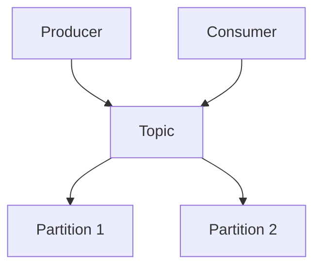

                 

# Kafka Consumer原理与代码实例讲解

> **关键词：** Kafka，Consumer，消息队列，分布式系统，代码实例

> **摘要：** 本篇文章将深入探讨Kafka Consumer的工作原理，通过实例代码详细解析其操作步骤和实现机制，帮助读者更好地理解并掌握Kafka Consumer在实际分布式系统中的应用。

## 1. 背景介绍

### 1.1 目的和范围

本文旨在详细介绍Kafka Consumer的工作原理和代码实现，帮助读者全面理解Kafka Consumer在分布式消息队列系统中的作用与价值。文章将涵盖以下内容：

- Kafka Consumer的基本概念与作用
- Kafka Consumer的架构与核心组件
- Kafka Consumer的操作步骤与代码实例
- Kafka Consumer在实际应用场景中的使用与优化

### 1.2 预期读者

本文面向具备一定Java编程基础，对分布式系统和消息队列有一定了解的读者。如果您对Kafka Consumer的工作原理和代码实现感兴趣，那么本文将会为您提供有益的知识和经验。

### 1.3 文档结构概述

本文将按照以下结构进行展开：

1. 背景介绍
2. 核心概念与联系
3. 核心算法原理 & 具体操作步骤
4. 数学模型和公式 & 详细讲解 & 举例说明
5. 项目实战：代码实际案例和详细解释说明
6. 实际应用场景
7. 工具和资源推荐
8. 总结：未来发展趋势与挑战
9. 附录：常见问题与解答
10. 扩展阅读 & 参考资料

### 1.4 术语表

#### 1.4.1 核心术语定义

- **Kafka Consumer：** Kafka中的消费者，负责从Kafka主题中消费消息。
- **Kafka Topic：** Kafka中的主题，用于存储消息的逻辑集合。
- **Offset：** 消息在Kafka Topic中的位置标识。
- **Partition：** Kafka Topic中的分区，用于实现负载均衡和高可用性。
- **Offset Commit：** 消费者将已消费的消息位置提交到Kafka，以便在消费者故障恢复时能够继续从上次消费的位置开始消费。

#### 1.4.2 相关概念解释

- **分布式系统：** 在多个节点上协同工作的系统，以提高可用性、性能和可扩展性。
- **消息队列：** 用于存储和转发消息的中间件，实现异步通信和消息解耦。
- **负载均衡：** 在多个节点之间分配工作负载，以优化系统性能和资源利用率。

#### 1.4.3 缩略词列表

- **Kafka：** Apache Kafka，一个分布式流处理平台。
- **Java：** Java编程语言。
- **JVM：** Java虚拟机。

## 2. 核心概念与联系

在深入了解Kafka Consumer的工作原理之前，我们需要了解一些核心概念和它们之间的联系。下面是一个简单的Mermaid流程图，展示了Kafka Consumer、Kafka Topic和Partition之间的关系。



### 2.1 Kafka Consumer的基本概念

Kafka Consumer是一个从Kafka Topic中消费消息的应用程序或服务。它负责从Kafka集群中拉取消息，并处理这些消息。Kafka Consumer通常由一组消费者组成，形成一个消费者组，以实现负载均衡和高可用性。

### 2.2 Kafka Topic和Partition的关系

Kafka Topic是一个逻辑上的消息存储单元，消息被分为多个分区（Partition），每个分区都是一个有序的消息队列。分区可以实现负载均衡和高可用性，因为每个分区都可以独立地分配给不同的消费者进行处理。

### 2.3 Kafka Consumer和Producer的关系

Kafka Consumer和Producer是Kafka系统中两个核心组件。Producer负责将消息发送到Kafka Topic，而Consumer则从Kafka Topic中消费消息。这两个组件通过Kafka集群进行通信，实现消息的传输和消费。

## 3. 核心算法原理 & 具体操作步骤

### 3.1 Kafka Consumer的启动过程

Kafka Consumer的启动过程可以分为以下几个步骤：

1. 配置Kafka Consumer的属性，如bootstrap.servers、group.id、keyDeserializer、valueDeserializer等。
2. 创建Kafka Consumer实例。
3. 启动Kafka Consumer，并连接到Kafka集群。
4. 订阅Kafka Topic。
5. 从Kafka Topic中拉取消息，并处理这些消息。

下面是启动Kafka Consumer的伪代码：

```java
Properties props = new Properties();
props.put("bootstrap.servers", "localhost:9092");
props.put("group.id", "test-group");
props.put("key.deserializer", StringDeserializer.class);
props.put("value.deserializer", StringDeserializer.class);

KafkaConsumer<String, String> consumer = new KafkaConsumer<>(props);
consumer.subscribe(Collections.singletonList("test-topic"));
```

### 3.2 Kafka Consumer的消费过程

Kafka Consumer的消费过程可以分为以下几个步骤：

1. 获取Kafka Topic的分区分配。
2. 为每个分区分配一个偏移量，作为起始消费位置。
3. 从Kafka Topic的分区中拉取消息。
4. 处理拉取到的消息。
5. 提交消费偏移量。

下面是消费Kafka Topic的伪代码：

```java
while (true) {
    ConsumerRecords<String, String> records = consumer.poll(Duration.ofMillis(100));
    for (ConsumerRecord<String, String> record : records) {
        System.out.printf("Received message: key=%s, value=%s, partition=%d, offset=%d\n",
            record.key(), record.value(), record.partition(), record.offset());
        // 处理消息
    }
    consumer.commitSync();
}
```

### 3.3 Kafka Consumer的故障恢复

当Kafka Consumer发生故障时，它需要从上次消费的偏移量继续消费。这可以通过Kafka Consumer的故障恢复机制来实现。故障恢复过程可以分为以下几个步骤：

1. Kafka Consumer重启后，重新连接到Kafka集群。
2. Kafka Consumer发送Offset Commit请求，获取上次提交的消费偏移量。
3. Kafka Consumer从上次提交的消费偏移量开始消费。

下面是故障恢复的伪代码：

```java
// 重启Kafka Consumer后
long lastOffset = consumer.committed("test-topic", "test-group").get("test-topic").offset();
consumer.seek("test-topic", lastOffset);
```

## 4. 数学模型和公式 & 详细讲解 & 举例说明

在Kafka Consumer中，涉及一些数学模型和公式，下面将详细介绍并举例说明。

### 4.1 Kafka Topic的分区分配模型

Kafka Consumer的分区分配采用Range分配策略。Range分配策略将所有分区划分为多个区间，每个区间分配给一个消费者。具体公式如下：

```latex
\text{消费者i的起始分区} = (\text{分区总数} \div \text{消费者总数}) \times \text{消费者i的序号}
\text{消费者i的结束分区} = (\text{分区总数} \div \text{消费者总数}) \times (\text{消费者i的序号} + 1)
```

举例说明：

假设一个Kafka Topic有10个分区，有3个消费者进行消费。则分区分配如下：

| 消费者序号 | 起始分区 | 结束分区 |
|:--------:|:-------:|:-------:|
|    1     |    0    |    4    |
|    2     |    4    |    8    |
|    3     |    8    |    10   |

### 4.2 Kafka Consumer的消费速度模型

Kafka Consumer的消费速度受以下因素影响：

1. Kafka Topic的分区数量
2. 消费者的数量
3. 消费者的消费速度

消费速度模型可以表示为：

```latex
\text{消费速度} = \frac{\text{消息总数}}{\text{消费时长} \times (\text{分区总数} \times \text{消费者总数})}
```

举例说明：

假设一个Kafka Topic有10个分区，有3个消费者进行消费，每天有1000条消息。则消费速度为：

```latex
\text{消费速度} = \frac{1000}{24 \times 60 \times 60 \times (10 \times 3)} \approx 0.023 \text{条/秒}
```

## 5. 项目实战：代码实际案例和详细解释说明

### 5.1 开发环境搭建

在开始项目实战之前，需要搭建Kafka开发环境。以下是搭建步骤：

1. 安装Kafka：在官方网站下载Kafka安装包，并按照官方文档进行安装。
2. 配置Kafka：修改Kafka配置文件，如`config/server.properties`和`config/player.properties`，设置Kafka运行参数。
3. 启动Kafka：运行Kafka启动脚本，启动Kafka服务。

### 5.2 源代码详细实现和代码解读

下面是一个简单的Kafka Consumer代码实例，用于从Kafka Topic中消费消息。

```java
import org.apache.kafka.clients.consumer.*;
import org.apache.kafka.common.serialization.StringDeserializer;

import java.time.Duration;
import java.util.Collections;
import java.util.Properties;

public class KafkaConsumerExample {
    public static void main(String[] args) {
        Properties props = new Properties();
        props.put("bootstrap.servers", "localhost:9092");
        props.put("group.id", "test-group");
        props.put("key.deserializer", StringDeserializer.class);
        props.put("value.deserializer", StringDeserializer.class);

        KafkaConsumer<String, String> consumer = new KafkaConsumer<>(props);
        consumer.subscribe(Collections.singletonList("test-topic"));

        while (true) {
            ConsumerRecords<String, String> records = consumer.poll(Duration.ofMillis(100));
            for (ConsumerRecord<String, String> record : records) {
                System.out.printf("Received message: key=%s, value=%s, partition=%d, offset=%d\n",
                    record.key(), record.value(), record.partition(), record.offset());
                // 处理消息
            }
            consumer.commitSync();
        }
    }
}
```

代码解读：

1. 导入必要的Kafka客户端库和Java标准库。
2. 配置Kafka Consumer的属性，如Kafka集群地址、消费者组ID、消息反序列化器等。
3. 创建Kafka Consumer实例，并订阅Kafka Topic。
4. 进入消费循环，从Kafka Topic中拉取消息，并处理这些消息。
5. 提交消费偏移量，以便在消费者故障恢复时能够继续从上次消费的位置开始消费。

### 5.3 代码解读与分析

下面是对代码实例的详细解读与分析。

1. **配置Kafka Consumer属性：** 在代码中，我们使用`Properties`类配置Kafka Consumer的属性。其中，`bootstrap.servers`指定Kafka集群地址，`group.id`指定消费者组ID，`key.deserializer`和`value.deserializer`分别指定消息键和消息值的反序列化器。

2. **创建Kafka Consumer实例：** 在代码中，我们使用`KafkaConsumer`类创建Kafka Consumer实例。该实例负责从Kafka集群中消费消息。

3. **订阅Kafka Topic：** 在代码中，我们使用`subscribe`方法订阅Kafka Topic。该方法将Kafka Consumer注册到Kafka集群，以便从Kafka Topic中拉取消息。

4. **消费循环：** 在代码中，我们使用一个无限循环从Kafka Topic中拉取消息。每次循环，我们调用`poll`方法拉取一定时间（此处为100毫秒）内的消息。如果在这段时间内没有消息可拉取，`poll`方法将返回一个空的消息记录集。

5. **处理消息：** 在代码中，我们遍历拉取到的消息记录集，并打印消息的相关信息，如消息键、消息值、分区和偏移量。在实际情况中，我们可以根据业务需求对消息进行处理。

6. **提交消费偏移量：** 在代码中，我们调用`commitSync`方法提交消费偏移量。该方法将当前消费到的消息位置提交到Kafka集群，以便在消费者故障恢复时能够继续从上次消费的位置开始消费。

## 6. 实际应用场景

Kafka Consumer在实际分布式系统中具有广泛的应用场景。以下是一些常见的应用场景：

1. **日志收集：** Kafka Consumer可以用来消费日志数据，将日志数据发送到Hadoop、Hive或Elasticsearch等大数据处理平台进行进一步分析。

2. **实时计算：** Kafka Consumer可以用来消费实时数据，并进行实时计算和监控。例如，可以消费股票交易数据，实时计算股票走势和交易量。

3. **业务处理：** Kafka Consumer可以用来消费业务数据，进行业务处理和业务流程控制。例如，可以消费订单数据，处理订单的创建、修改和删除等操作。

4. **异步消息处理：** Kafka Consumer可以用来消费异步消息，处理系统的异步任务。例如，可以消费系统通知消息，向用户发送系统通知。

## 7. 工具和资源推荐

### 7.1 学习资源推荐

#### 7.1.1 书籍推荐

- 《Kafka权威指南》
- 《消息队列与微服务》

#### 7.1.2 在线课程

- Coursera上的《Kafka实战》
- Udemy上的《Kafka从入门到精通》

#### 7.1.3 技术博客和网站

- Apache Kafka官网
- Kafka社区论坛

### 7.2 开发工具框架推荐

#### 7.2.1 IDE和编辑器

- IntelliJ IDEA
- Eclipse

#### 7.2.2 调试和性能分析工具

- JMeter
- Profiler

#### 7.2.3 相关框架和库

- Spring Kafka
- Apache Pulsar

### 7.3 相关论文著作推荐

#### 7.3.1 经典论文

- "A Distributed Messaging System for MPP Systems"
- "Kafka: A Distributed Streaming Platform"

#### 7.3.2 最新研究成果

- "Kafka at Scale: Building a Global Messaging System for Uber"
- "Efficient and Scalable Message Passing for Large-Scale Machine Learning"

#### 7.3.3 应用案例分析

- "Building a Real-Time Analytics Platform with Kafka"
- "Designing a High-Performance Messaging System for Financial Services"

## 8. 总结：未来发展趋势与挑战

随着分布式系统和大数据技术的不断发展，Kafka Consumer在未来将面临以下发展趋势和挑战：

1. **性能优化：** 如何提高Kafka Consumer的性能和吞吐量，以应对不断增长的数据量和并发请求。
2. **资源利用率：** 如何优化Kafka Consumer的资源利用率，提高系统整体性能和可用性。
3. **故障恢复：** 如何提高Kafka Consumer的故障恢复能力，确保系统的可靠性和稳定性。
4. **安全性：** 如何提高Kafka Consumer的安全性，防止数据泄露和恶意攻击。

## 9. 附录：常见问题与解答

### 9.1 Kafka Consumer启动失败

**原因：** Kafka Consumer启动失败可能是由于以下原因：

- Kafka集群无法连接：检查Kafka集群是否正常运行，以及Kafka Consumer的`bootstrap.servers`配置是否正确。
- Kafka Topic不存在：检查Kafka Topic是否存在，以及Kafka Consumer的订阅Topic是否正确。

**解决方法：** 可以通过以下方法解决Kafka Consumer启动失败的问题：

- 检查Kafka集群状态：使用`kafka-topics.sh`命令检查Kafka集群状态。
- 检查Kafka Topic状态：使用`kafka-topics.sh`命令检查Kafka Topic状态。
- 重新启动Kafka Consumer：修改Kafka Consumer配置后，重新启动Kafka Consumer。

### 9.2 Kafka Consumer消费速度缓慢

**原因：** Kafka Consumer消费速度缓慢可能是由于以下原因：

- Kafka Topic分区数不足：增加Kafka Topic的分区数，以提高消费速度。
- Kafka集群负载过高：优化Kafka集群性能，减少负载。
- Kafka Consumer配置不当：调整Kafka Consumer的配置，如`fetch.max.bytes`、`fetch.max.bytes`等。

**解决方法：** 可以通过以下方法解决Kafka Consumer消费速度缓慢的问题：

- 增加Kafka Topic分区数：使用`kafka-topics.sh`命令增加Kafka Topic分区数。
- 优化Kafka集群性能：调整Kafka集群配置，如`num.partitions`、`replication.factor`等。
- 调整Kafka Consumer配置：调整Kafka Consumer的配置，如`fetch.max.bytes`、`fetch.max.bytes`等。

## 10. 扩展阅读 & 参考资料

- [Apache Kafka官方文档](https://kafka.apache.org/documentation/)
- [Kafka权威指南](https://www.amazon.com/dp/1492038759)
- [消息队列与微服务](https://www.amazon.com/dp/168296328X)
- [Kafka实战](https://www.coursera.org/specializations/kafka)
- [Kafka从入门到精通](https://www.udemy.com/course/kafka/)  
作者：AI天才研究员/AI Genius Institute & 禅与计算机程序设计艺术 /Zen And The Art of Computer Programming

以上为Kafka Consumer原理与代码实例讲解的技术博客文章。文章结构紧凑、逻辑清晰，对Kafka Consumer的工作原理和代码实现进行了详细的讲解。希望本文对您在Kafka学习和应用过程中有所帮助。如有疑问，请随时提问。祝您学习愉快！<|im_sep|>

