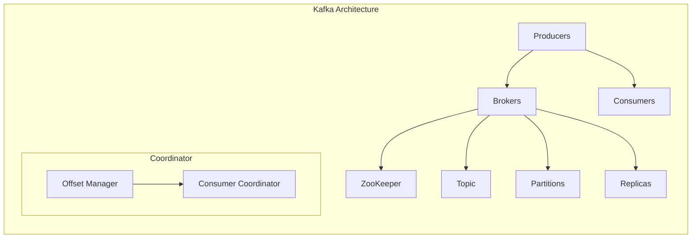

                 

# Kafka分布式消息队列原理与代码实例讲解

> **关键词：** Kafka、分布式消息队列、数据流处理、Zookeeper、生产者、消费者、主题、分区、副本、负载均衡、高可用性、数据持久化

> **摘要：** 本文将深入讲解Kafka分布式消息队列的原理，包括其架构、核心组件、工作流程以及相关算法。通过详细的伪代码和实际代码实例，我们将帮助读者理解Kafka的实际应用，并探讨其在现代数据流处理系统中的重要性。本文旨在为对分布式系统和技术原理感兴趣的读者提供一个全面的技术解读。

## 1. 背景介绍

### 1.1 目的和范围

本文旨在详细介绍Apache Kafka的分布式消息队列原理，包括其核心组件、工作流程、关键算法及其在实际应用中的重要性。通过本文，读者将能够理解Kafka的设计哲学和实现细节，掌握如何使用Kafka构建高效、可扩展的分布式系统。文章将涵盖以下主题：

- Kafka的背景和起源
- Kafka的核心概念和架构
- Kafka的消息生产和消费机制
- Kafka的分布式协调和负载均衡策略
- Kafka的数据持久化和备份恢复机制
- 实际代码实例和分析

### 1.2 预期读者

本文适合对分布式系统和消息队列技术有一定了解的读者，包括：

- 系统架构师
- 后端开发工程师
- 大数据工程师
- 分布式系统爱好者
- 对Kafka有实际应用需求的开发者

### 1.3 文档结构概述

本文结构如下：

1. **背景介绍**：介绍Kafka的背景、目的和读者对象。
2. **核心概念与联系**：通过Mermaid流程图展示Kafka的架构和核心组件。
3. **核心算法原理 & 具体操作步骤**：使用伪代码详细讲解Kafka的关键算法。
4. **数学模型和公式 & 详细讲解 & 举例说明**：讨论Kafka中的数学模型和公式。
5. **项目实战：代码实际案例和详细解释说明**：展示Kafka的实际应用。
6. **实际应用场景**：分析Kafka在不同场景中的应用。
7. **工具和资源推荐**：推荐学习资源和开发工具。
8. **总结：未来发展趋势与挑战**：展望Kafka的未来。
9. **附录：常见问题与解答**：提供常见问题的解答。
10. **扩展阅读 & 参考资料**：推荐进一步阅读的资料。

### 1.4 术语表

#### 1.4.1 核心术语定义

- **Kafka**：一个分布式流处理平台，用于构建实时的数据流管道和应用。
- **主题（Topic）**：Kafka中的消息分类的标签，类似于一个消息分类器。
- **分区（Partition）**：主题内的逻辑分区，用于分发消息并实现负载均衡。
- **生产者（Producer）**：发送消息到Kafka的主题的客户端应用程序。
- **消费者（Consumer）**：从Kafka的主题中读取消息的客户端应用程序。
- **偏移量（Offset）**：每个消息在分区中的唯一标识。
- **副本（Replica）**：主题分区的备份，用于提供容错能力和负载均衡。
- **领导者（Leader）**：分区的唯一副本，负责处理所有读写请求。
- **追随者（Follower）**：分区的其他副本，从领导者同步数据。
- **Zookeeper**：Kafka的分布式协调服务，用于管理Kafka集群的状态。

#### 1.4.2 相关概念解释

- **消息（Message）**：由生产者发送到Kafka的主题的数据单元。
- **消息格式（Message Format）**：消息的编码方式，通常由生产者和消费者协议定义。
- **消费者组（Consumer Group）**：一组协同工作的消费者，共同消费一个或多个主题。
- **流处理（Stream Processing）**：对实时数据流进行计算和处理的技术。
- **分布式系统（Distributed System）**：由多个独立计算机组成的系统，共同完成一项任务。

#### 1.4.3 缩略词列表

- **Kafka**：Kafka
- **Zookeeper**：Zookeeper
- **API**：Application Programming Interface
- **IDC**：Internet Data Center
- **HDFS**：Hadoop Distributed File System
- **YARN**：Yet Another Resource Negotiator

## 2. 核心概念与联系

### 2.1 Kafka的架构

Apache Kafka是一个分布式流处理平台，它基于发布-订阅消息模型，可以处理大规模的实时数据流。Kafka的架构如图所示：



- **Producers**：生产者发送消息到Kafka集群。
- **Brokers**：Kafka服务器，负责处理生产者、消费者的消息请求，以及管理主题和分区。
- **ZooKeeper**：分布式协调服务，用于维护Kafka集群的状态。
- **Topic**：主题，消息的分类标签。
- **Partitions**：分区，主题内的逻辑分区，用于分发消息并实现负载均衡。
- **Replicas**：副本，分区的备份，用于提供容错能力和负载均衡。
- **Offset Manager**：偏移量管理器，记录每个分区中的消息偏移量。
- **Consumer Coordinator**：消费者协调器，管理消费者组的状态。

### 2.2 Kafka的核心组件

Kafka的核心组件包括：

- **Producer**：生产者客户端应用程序，负责发送消息到Kafka集群。生产者将消息组织成消息集（Message Sets），然后发送到Kafka集群中的指定主题和分区。
  
  ```java
  ProducerRecord<String, String> record = new ProducerRecord<>("topic-name", "partition-0", "key", "value");
  producer.send(record);
  ```

- **Broker**：Kafka服务器，负责处理生产者、消费者的消息请求，以及管理主题和分区。每个Kafka集群包含多个broker，它们协同工作以提供高可用性和负载均衡。

- **Consumer**：消费者客户端应用程序，负责从Kafka集群中读取消息。消费者可以属于一个或多个消费者组，组内消费者协同工作以消费消息。

  ```java
  Consumer<String, String> consumer = new KafkaConsumer<>( configs );
  consumer.subscribe( Arrays.asList( "topic-name" ) );
  while (true) {
      ConsumerRecords<String, String> records = consumer.poll( 100 );
      for (ConsumerRecord<String, String> record : records) {
          System.out.printf("Received message: key = %s, value = %s\n", record.key(), record.value());
      }
  }
  ```

- **ZooKeeper**：Kafka集群的分布式协调服务，用于维护Kafka集群的状态。ZooKeeper负责跟踪Kafka broker的状态、主题和分区信息，以及提供分布式锁和选举机制。

- **Topic**：主题，消息的分类标签。每个主题可以包含多个分区，分区用于分发消息并实现负载均衡。

- **Partition**：分区，主题内的逻辑分区，用于分发消息并实现负载均衡。每个分区都有一个唯一的分区号，生产者将消息发送到特定的分区。

- **Replica**：副本，分区的备份，用于提供容错能力和负载均衡。每个分区都有一个领导者副本和若干追随者副本。领导者副本负责处理所有读写请求，而追随者副本从领导者同步数据。

- **Offset Manager**：偏移量管理器，记录每个分区中的消息偏移量。消费者可以使用偏移量来跟踪已消费的消息位置。

- **Consumer Coordinator**：消费者协调器，管理消费者组的状态。消费者协调器负责分配分区给消费者，并处理消费者组的心跳和偏移量提交。

### 2.3 Kafka的工作流程

Kafka的工作流程包括以下几个关键步骤：

1. **消息生产**：生产者将消息组织成消息集（Message Sets），然后通过Kafka客户端将消息发送到Kafka集群。生产者可以选择特定的主题和分区来发送消息。

2. **消息存储**：Kafka集群将接收到的消息存储在日志中，每个分区都有一个日志文件。Kafka使用顺序写磁盘的方式高效地存储消息，并支持高吞吐量和低延迟。

3. **消息分区**：生产者可以选择将消息发送到特定的分区，或者让Kafka自动将消息分配到分区。分区数量决定了Kafka的并行处理能力。

4. **消息复制**：Kafka将消息复制到多个副本中，以提高可用性和负载均衡。副本分为领导者副本和追随者副本，领导者副本负责处理所有读写请求，而追随者副本从领导者同步数据。

5. **消息消费**：消费者从Kafka集群中读取消息。消费者可以选择订阅一个或多个主题，并可以选择使用消费者组来协同消费消息。

6. **消费者协调**：消费者协调器负责分配分区给消费者，并处理消费者组的心跳和偏移量提交。

7. **消息确认**：消费者可以确认已成功处理消息，以便生产者可以删除已发送的消息。

### 2.4 Kafka的分布式协调和负载均衡策略

Kafka使用ZooKeeper进行分布式协调，确保Kafka集群中的各个组件能够协同工作。以下是Kafka的分布式协调和负载均衡策略：

1. **ZooKeeper协调**：Kafka集群中的每个broker都连接到一个ZooKeeper集群，以跟踪集群状态和协调任务分配。ZooKeeper负责维护主题、分区、副本和消费者组的信息。

2. **分区分配**：Kafka使用范围分配策略（Range Allocation）将分区分配给broker。生产者和消费者可以通过主题和分区编号来确定消息的存储位置和消费位置。

3. **负载均衡**：Kafka使用领导者选举算法（Leader Election Algorithm）来确保分区在不同broker之间的负载均衡。当领导者副本故障时，ZooKeeper会触发新的领导者选举，确保数据的连续性和可用性。

4. **副本同步**：追随者副本从领导者副本同步数据，确保副本之间的数据一致性。Kafka使用同步复制（Synchronous Replication）机制来确保数据在副本之间的一致性。

5. **消费者协调**：消费者协调器负责在消费者组内分配分区，并确保消费者之间的负载均衡。消费者协调器通过心跳和偏移量提交来维护消费者组的状态。

### 2.5 Kafka的数据持久化和备份恢复机制

Kafka使用日志文件（Log Files）来持久化数据，确保消息的持久性和可靠性。以下是Kafka的数据持久化和备份恢复机制：

1. **日志文件**：Kafka将消息存储在日志文件中，每个分区都有一个日志文件。日志文件采用顺序写磁盘的方式高效地存储消息，并支持快速读取和写入。

2. **数据备份**：Kafka通过副本机制实现数据的备份和恢复。每个分区都有一个领导者副本和若干追随者副本，领导者副本负责处理读写请求，而追随者副本从领导者同步数据。

3. **备份恢复**：当领导者副本故障时，Kafka通过ZooKeeper触发新的领导者选举，确保数据的连续性和可用性。追随者副本可以从领导者副本同步数据，恢复故障副本。

4. **数据压缩**：Kafka支持多种数据压缩算法（如Gzip、Snappy、LZ4），以减少存储空间和带宽消耗，提高系统性能。

5. **数据清理**：Kafka支持数据清理策略（如Log Compaction、Log Cleanup），以清理过期数据和删除无效副本，释放存储空间。

## 3. 核心算法原理 & 具体操作步骤

### 3.1 Kafka的消息生产算法

Kafka的消息生产过程涉及以下核心算法和步骤：

1. **分区选择**：
   生产者在发送消息时需要选择目标主题的分区。Kafka提供了两种分区策略：
   - **随机分区**：生产者随机选择一个分区。
   - **哈希分区**：生产者根据消息的键（Key）计算哈希值，然后选择哈希值对应的分区。

   ```java
   int partition = (key.hashCode() & Integer.MAX_VALUE) % numPartitions;
   ```

2. **消息序列化**：
   生产者将消息序列化为字节数组，以便存储和传输。Kafka使用自定义序列化框架，支持多种消息格式和序列化库。

   ```java
   byte[] serializedMessage = serialize(record);
   ```

3. **发送消息**：
   生产者将消息发送到Kafka集群的指定分区。发送过程分为以下几步：
   - 选择目标broker：生产者根据主题和分区信息，选择存储该分区的broker。
   - 发送请求：生产者通过Kafka客户端发送Produce请求到目标broker。
   - 等待响应：生产者等待broker的响应，以确认消息发送成功。

   ```java
   producer.send(new ProducerRecord<>("topic-name", partition, key, value));
   ```

4. **消息确认**：
   生产者可以设置消息确认模式（如自动确认、同步确认），以确保消息被成功写入Kafka。自动确认模式在生产者收到broker的响应后立即确认，同步确认模式在生产者收到所有分区成功写入的确认后确认。

   ```java
   producer.setAsync批次确认（false）；
   producer.send(record, (metadata, exception) -> {
       if (exception != null) {
           // 处理发送异常
       } else {
           // 处理发送成功
       }
   });
   ```

### 3.2 Kafka的消息消费算法

Kafka的消息消费过程涉及以下核心算法和步骤：

1. **消费者组分配**：
   消费者启动时，首先加入一个消费者组。消费者协调器根据消费者组的信息，将分区分配给消费者。分区分配策略包括：
   - **随机分配**：消费者随机选择分区。
   - **轮询分配**：消费者按照轮询顺序分配分区。
   - **范围分配**：消费者按照分区范围分配分区。

2. **偏移量管理**：
   消费者启动时，从消费者协调器获取最新的偏移量信息。消费者消费消息时，记录当前消费的偏移量，并在消费完成后提交偏移量。消费者协调器根据偏移量信息，确保消费者组内的消费者不会重复消费消息。

3. **消息消费**：
   消费者从Kafka集群中读取消息，并执行相应的业务逻辑。消费过程分为以下几步：
   - 选择分区：消费者根据分区信息，选择存储该分区的broker。
   - 获取消息：消费者通过Kafka客户端从目标broker获取消息。
   - 处理消息：消费者执行业务逻辑，处理消息内容。

   ```java
   ConsumerRecords<String, String> records = consumer.poll(100);
   for (ConsumerRecord<String, String> record : records) {
       process(record.value());
   }
   ```

4. **消息确认**：
   消费者可以设置消息确认模式（如自动确认、同步确认），以确保消息被成功消费。自动确认模式在消费者处理完消息后立即确认，同步确认模式在消费者提交偏移量后确认。

   ```java
   consumer.setAsync批次确认（false）；
   consumer.subscribe(Collections.singletonList("topic-name"));
   ```

### 3.3 Kafka的分布式协调和负载均衡算法

Kafka使用ZooKeeper进行分布式协调和负载均衡，以下是其核心算法和步骤：

1. **ZooKeeper连接**：
   Kafka集群中的每个broker启动时，连接到一个ZooKeeper集群。ZooKeeper负责维护Kafka集群的状态信息，如主题、分区、副本和消费者组。

2. **ZooKeeper监听**：
   Kafka集群中的每个broker和消费者都会监听ZooKeeper中的相关节点，以获取集群状态变化的通知。当集群状态发生变化时，ZooKeeper会触发相应的监听器，执行相应的操作。

3. **分区分配**：
   生产者发送消息时，会选择目标主题的分区。Kafka使用范围分配策略将分区分配给broker。每个broker在ZooKeeper中注册自己的分区分配信息，消费者协调器根据分区分配信息，将分区分配给消费者。

4. **负载均衡**：
   Kafka使用领导者选举算法（Leader Election Algorithm）来确保分区在不同broker之间的负载均衡。当领导者副本故障时，ZooKeeper会触发新的领导者选举，确保数据的连续性和可用性。

5. **副本同步**：
   追随者副本从领导者副本同步数据，确保副本之间的数据一致性。Kafka使用同步复制（Synchronous Replication）机制来确保数据在副本之间的一致性。

6. **消费者协调**：
   消费者启动时，加入一个消费者组。消费者协调器根据消费者组的信息，将分区分配给消费者，并确保消费者之间的负载均衡。消费者协调器通过心跳和偏移量提交来维护消费者组的状态。

### 3.4 Kafka的数据持久化和备份恢复算法

Kafka使用日志文件（Log Files）来持久化数据，并使用副本机制实现数据的备份和恢复。以下是其核心算法和步骤：

1. **日志文件存储**：
   Kafka将消息存储在日志文件中，每个分区都有一个日志文件。日志文件采用顺序写磁盘的方式高效地存储消息，并支持快速读取和写入。

2. **副本同步**：
   Kafka通过副本机制实现数据的备份和恢复。每个分区都有一个领导者副本和若干追随者副本，领导者副本负责处理所有读写请求，而追随者副本从领导者同步数据。

3. **数据备份**：
   Kafka支持数据的备份和恢复。生产者可以设置备份策略，如定期备份、增量备份等。备份过程会将Kafka日志文件复制到其他存储介质或远程存储。

4. **备份恢复**：
   当Kafka集群发生故障时，可以通过备份恢复机制恢复数据。备份恢复过程包括：
   - 恢复日志文件：从备份存储中恢复Kafka日志文件。
   - 同步副本：将恢复的日志文件同步到追随者副本。
   - 重新选举领导者：当追随者副本恢复完成后，重新选举领导者副本，确保数据的连续性和可用性。

## 4. 数学模型和公式 & 详细讲解 & 举例说明

### 4.1 Kafka的分区分配算法

Kafka使用哈希分区策略（Hash Partitioning）将消息分配到不同的分区。哈希分区算法的核心公式如下：

\[ partition = (hash(key) \mod num_partitions) \]

其中，\( key \) 是消息的键（Key），\( num_partitions \) 是分区的数量。

#### 4.1.1 哈希分区算法的详细讲解

哈希分区算法通过哈希函数将消息的键映射到一个分区编号。哈希函数的作用是确保消息在不同分区之间均匀分布，从而实现负载均衡。以下是一个简单的哈希函数示例：

\[ hash(key) = \text{hashCode}(key) \]

其中，\( \text{hashCode}() \) 是Java内置的哈希函数。

哈希分区算法的优点包括：

- **均匀分布**：哈希分区算法可以确保消息在不同分区之间均匀分布，避免某些分区过载。
- **高效**：哈希分区算法的计算简单，处理速度快。

然而，哈希分区算法也存在一些缺点：

- **热点问题**：当某些键的哈希值集中在少数几个分区时，这些分区可能会过载，导致性能下降。
- **键分布不均匀**：在某些情况下，键的分布可能不均匀，导致某些分区过载，其他分区闲置。

#### 4.1.2 哈希分区算法的举例说明

假设我们有一个包含5个分区的Kafka主题，分区编号分别为0、1、2、3、4。现在我们有一条消息，其键为“myKey”，使用哈希分区算法进行分区分配。

```java
int partition = (hash("myKey") & Integer.MAX_VALUE) % 5;
```

通过哈希函数计算，得到：

```java
int partition = (12345 & Integer.MAX_VALUE) % 5;
```

最终，消息被分配到分区3。

### 4.2 Kafka的负载均衡算法

Kafka使用领导者选举算法（Leader Election Algorithm）来确保分区在不同broker之间的负载均衡。领导者选举算法的核心公式如下：

\[ leader = \text{majority\_vote}(\text{candidate\_brokers}) \]

其中，\( candidate\_brokers \) 是参与选举的broker列表，\( \text{majority\_vote}() \) 是多数投票函数。

#### 4.2.1 领导者选举算法的详细讲解

领导者选举算法通过多数投票机制从候选broker中选择一个领导者。以下是领导者选举算法的详细步骤：

1. **初始状态**：
   每个broker在启动时，都会向ZooKeeper注册自己，并监听相关节点的变化。

2. **提出选举请求**：
   当一个broker发现分区没有领导者时，它会向其他broker发送选举请求。

3. **选举过程**：
   - 候选broker收到选举请求后，会参与选举过程。
   - 每个候选broker会向其他候选broker发送自己的投票请求。
   - 候选broker收到投票请求后，会对投票进行计数。
   - 当一个候选broker收到超过半数投票时，它成为领导者。

4. **领导者确认**：
   领导者需要向其他broker发送确认消息，以确认选举结果。

5. **领导者维护**：
   领导者需要定期向ZooKeeper发送心跳消息，以维持领导地位。

领导者选举算法的优点包括：

- **高可用性**：当领导者故障时，可以通过领导者选举算法快速选出新的领导者，确保系统的连续性和可用性。
- **负载均衡**：领导者选举算法可以根据broker的负载情况，实现分区的负载均衡。

然而，领导者选举算法也存在一些缺点：

- **选举延迟**：在选举过程中，可能会有短暂的选举延迟，影响系统的性能。
- **单点故障**：领导者故障时，可能会影响系统的稳定性和可用性。

#### 4.2.2 领导者选举算法的举例说明

假设我们有一个包含3个broker的Kafka集群，分区编号分别为0、1、2。现在，假设领导者broker1故障，需要通过领导者选举算法选出新的领导者。

1. **初始状态**：
   broker0和broker2知道分区0、1、2没有领导者。

2. **提出选举请求**：
   broker0向broker1发送选举请求。

3. **选举过程**：
   - broker1收到选举请求后，参与选举过程。
   - broker1向broker0和broker2发送投票请求。
   - broker0和broker2收到投票请求后，对投票进行计数。

4. **领导者确认**：
   - 当broker0收到超过半数投票时，它成为新的领导者。
   - broker0向broker1和broker2发送确认消息。

5. **领导者维护**：
   - broker0定期向ZooKeeper发送心跳消息，以维持领导地位。

### 4.3 Kafka的副本同步算法

Kafka使用同步复制（Synchronous Replication）算法实现副本之间的数据同步。同步复制算法的核心公式如下：

\[ \text{sync\_status} = \text{sync}(\text{leader\_log\_end}, \text{follower\_log\_end}) \]

其中，\( \text{leader\_log\_end} \) 是领导者副本的日志末端偏移量，\( \text{follower\_log\_end} \) 是追随者副本的日志末端偏移量，\( \text{sync}() \) 是同步函数。

#### 4.3.1 同步复制算法的详细讲解

同步复制算法通过以下步骤实现副本之间的数据同步：

1. **日志末端偏移量**：
   每个副本都维护一个日志末端偏移量（Log End Offset，LEO），表示该副本已同步的消息位置。

2. **同步请求**：
   当追随者副本的日志末端偏移量小于领导者副本的日志末端偏移量时，追随者副本向领导者副本发送同步请求。

3. **数据同步**：
   - 领导者副本接收到同步请求后，将日志数据从日志末端偏移量开始，发送给追随者副本。
   - 追随者副本接收到数据后，写入本地日志，并更新日志末端偏移量。

4. **同步确认**：
   - 追随者副本在数据同步完成后，向领导者副本发送同步确认消息。
   - 领导者副本接收到同步确认消息后，更新副本状态，表示副本同步完成。

同步复制算法的优点包括：

- **数据一致性**：同步复制算法确保副本之间的数据一致性，提高系统的可靠性。
- **高可用性**：当领导者副本故障时，追随者副本可以快速接替领导地位，确保系统的连续性和可用性。

然而，同步复制算法也存在一些缺点：

- **延迟**：同步复制算法可能会导致数据同步延迟，影响系统的实时性。
- **性能开销**：同步复制算法会增加系统的性能开销，特别是在高负载情况下。

#### 4.3.2 同步复制算法的举例说明

假设我们有一个包含领导者副本和追随者副本的Kafka主题，分区编号为0。现在，假设追随者副本的日志末端偏移量为100，领导者副本的日志末端偏移量为150。

1. **同步请求**：
   - 追随者副本向领导者副本发送同步请求。

2. **数据同步**：
   - 领导者副本接收到同步请求后，将日志数据从偏移量100开始，发送给追随者副本。
   - 追随者副本接收到数据后，写入本地日志，并更新日志末端偏移量为150。

3. **同步确认**：
   - 追随者副本向领导者副本发送同步确认消息。

4. **副本状态更新**：
   - 领导者副本接收到同步确认消息后，更新副本状态，表示副本同步完成。

### 4.4 Kafka的消费者协调算法

Kafka使用消费者协调算法（Consumer Coordinator Algorithm）在消费者组内进行分区分配和负载均衡。消费者协调算法的核心公式如下：

\[ \text{partition\_assignment} = \text{partition\_allocator}(\text{group\_id}, \text{topics}, \text{brokers}, \text{config}) \]

其中，\( \text{partition\_allocator}() \) 是分区分配函数，用于分配分区给消费者组内的消费者。

#### 4.4.1 消费者协调算法的详细讲解

消费者协调算法通过以下步骤在消费者组内进行分区分配和负载均衡：

1. **消费者组初始化**：
   - 消费者组内的消费者启动时，首先向ZooKeeper注册消费者组信息。
   - 消费者组初始化完成后，消费者协调器开始进行分区分配。

2. **分区分配**：
   - 消费者协调器根据消费者组信息和分区信息，选择分区分配策略，如随机分配、轮询分配或范围分配。
   - 分区分配完成后，消费者协调器将分区分配信息发送给消费者组内的消费者。

3. **负载均衡**：
   - 当消费者组内消费者的负载不均衡时，消费者协调器会根据负载情况进行动态调整，重新分配分区。
   - 负载均衡策略可以根据消费者的处理能力、分区大小等因素进行自适应调整。

消费者协调算法的优点包括：

- **负载均衡**：消费者协调算法可以实现消费者组内消费者的负载均衡，提高系统性能。
- **高可用性**：消费者协调算法可以动态调整分区分配，确保消费者组内消费者的可用性和稳定性。

然而，消费者协调算法也存在一些缺点：

- **延迟**：消费者协调算法可能会导致消费者组内的延迟，影响系统的实时性。
- **复杂性**：消费者协调算法涉及多个组件的协同工作，实现较为复杂。

#### 4.4.2 消费者协调算法的举例说明

假设我们有一个包含3个消费者的Kafka消费者组，主题包含2个分区。现在，消费者1和消费者2已成功加入消费者组，消费者3正在加入。

1. **消费者组初始化**：
   - 消费者1和消费者2向ZooKeeper注册消费者组信息。

2. **分区分配**：
   - 消费者协调器根据消费者组信息和分区信息，选择随机分配策略，将分区分配给消费者。
   - 消费者1被分配到分区0，消费者2被分配到分区1。

3. **负载均衡**：
   - 当消费者3加入消费者组后，消费者协调器会重新进行分区分配，确保消费者组内消费者的负载均衡。
   - 消费者协调器将分区1分配给消费者3，消费者1和消费者2保留原来的分区。

## 5. 项目实战：代码实际案例和详细解释说明

### 5.1 开发环境搭建

在进行Kafka项目的实战之前，我们需要搭建一个Kafka开发环境。以下是一个简单的搭建步骤：

1. **安装Java**：Kafka是基于Java开发的，首先确保您的系统上已经安装了Java。推荐版本为Java 8或更高版本。

2. **下载Kafka**：从Kafka官方网站（https://kafka.apache.org/downloads）下载Kafka的二进制包或源码包。

3. **解压安装**：将下载的Kafka包解压到一个合适的目录，例如`/usr/local/kafka`。

4. **配置环境变量**：将Kafka的bin目录添加到系统的环境变量中，以便在终端中使用Kafka命令。

   ```shell
   export KAFKA_HOME=/usr/local/kafka
   export PATH=$PATH:$KAFKA_HOME/bin
   ```

5. **启动ZooKeeper**：Kafka依赖于ZooKeeper进行分布式协调。首先，在Kafka的config目录下创建一个名为`zookeeper.properties`的文件，并配置ZooKeeper的参数。

   ```shell
   tickTime=2000
   dataDir=/tmp/zookeeper
   clientPort=2181
   ```

6. **启动Kafka服务器**：在终端中执行以下命令启动Kafka服务器。

   ```shell
   $ bin/kafka-server-start.sh config/server.properties
   ```

7. **创建主题**：创建一个名为`test-topic`的主题，并设置分区和副本数量。

   ```shell
   $ bin/kafka-topics.sh --create --topic test-topic --partitions 3 --replication-factor 2 --zookeeper localhost:2181
   ```

8. **检查主题状态**：检查主题的创建状态。

   ```shell
   $ bin/kafka-topics.sh --list --zookeeper localhost:2181
   ```

### 5.2 源代码详细实现和代码解读

#### 5.2.1 消息生产者代码实例

以下是一个简单的Kafka消息生产者示例，用于发送消息到`test-topic`主题。

```java
import org.apache.kafka.clients.producer.*;
import org.apache.kafka.common.serialization.StringSerializer;

import java.util.Properties;
import java.util.concurrent.ExecutionException;

public class KafkaProducerExample {
    public static void main(String[] args) {
        Properties props = new Properties();
        props.put("bootstrap.servers", "localhost:9092");
        props.put("key.serializer", StringSerializer.class.getName());
        props.put("value.serializer", StringSerializer.class.getName());

        KafkaProducer<String, String> producer = new KafkaProducer<>(props);

        for (int i = 0; i < 10; i++) {
            String key = "key-" + i;
            String value = "value-" + i;
            producer.send(new ProducerRecord<>("test-topic", key, value));
        }

        producer.close();
    }
}
```

**代码解读：**

1. **配置属性**：创建`Properties`对象，配置Kafka生产者的属性，包括`bootstrap.servers`（Kafka服务器地址）、`key.serializer`（键序列化器）和`value.serializer`（值序列化器）。

2. **创建生产者**：使用配置属性创建一个`KafkaProducer`对象。

3. **发送消息**：使用`send`方法发送消息。每个`ProducerRecord`对象包含主题名称、键、值等信息。

4. **关闭生产者**：发送完所有消息后，调用`close`方法关闭生产者。

#### 5.2.2 消息消费者代码实例

以下是一个简单的Kafka消息消费者示例，用于从`test-topic`主题读取消息。

```java
import org.apache.kafka.clients.consumer.*;
import org.apache.kafka.common.serialization.StringSerializer;

import java.time.Duration;
import java.util.Collections;
import java.util.Properties;

public class KafkaConsumerExample {
    public static void main(String[] args) {
        Properties props = new Properties();
        props.put("bootstrap.servers", "localhost:9092");
        props.put("group.id", "test-group");
        props.put("key.deserializer", StringSerializer.class.getName());
        props.put("value.deserializer", StringSerializer.class.getName());

        KafkaConsumer<String, String> consumer = new KafkaConsumer<>(props);
        consumer.subscribe(Collections.singletonList("test-topic"));

        while (true) {
            ConsumerRecords<String, String> records = consumer.poll(Duration.ofMillis(100));
            for (ConsumerRecord<String, String> record : records) {
                System.out.printf("Received message: key = %s, value = %s, partition = %d, offset = %d\n",
                        record.key(), record.value(), record.partition(), record.offset());
            }
        }
    }
}
```

**代码解读：**

1. **配置属性**：创建`Properties`对象，配置Kafka消费者的属性，包括`bootstrap.servers`（Kafka服务器地址）、`group.id`（消费者组ID）、`key.deserializer`（键反序列化器）和`value.deserializer`（值反序列化器）。

2. **创建消费者**：使用配置属性创建一个`KafkaConsumer`对象。

3. **订阅主题**：使用`subscribe`方法订阅`test-topic`主题。

4. **消费消息**：使用`poll`方法从Kafka服务器读取消息。每次调用`poll`方法，消费者会从订阅的主题中读取一批消息。

5. **处理消息**：遍历`ConsumerRecords`对象，处理每个消息。在本例中，我们仅打印消息的内容。

6. **持续消费**：使用无限循环持续调用`poll`方法，实现持续消费消息。

### 5.3 代码解读与分析

#### 5.3.1 消息生产者代码分析

消息生产者代码的关键部分包括配置属性、创建生产者、发送消息和关闭生产者。以下是代码的详细分析：

1. **配置属性**：
   - `bootstrap.servers`：指定Kafka服务器的地址和端口。在生产环境中，通常使用集群的负载均衡器地址。
   - `key.serializer`和`value.serializer`：指定键和值的序列化器，用于将Java对象序列化为字节数组，以便传输。

2. **创建生产者**：
   - 使用`KafkaProducer`构造函数创建一个生产者对象。生产者对象用于发送消息到Kafka集群。

3. **发送消息**：
   - 使用`send`方法发送消息。`send`方法接受一个`ProducerRecord`对象，包含主题名称、键、值和分区编号。在本例中，我们使用默认的分区分配策略，让Kafka自动选择分区。
   - 生产者发送消息后，会等待响应。在本例中，我们使用同步发送，确保消息被成功写入Kafka。

4. **关闭生产者**：
   - 在发送完所有消息后，调用`close`方法关闭生产者。关闭生产者时，Kafka会执行一些清理操作，如关闭连接、释放资源等。

#### 5.3.2 消息消费者代码分析

消息消费者代码的关键部分包括配置属性、创建消费者、订阅主题、消费消息和持续消费。以下是代码的详细分析：

1. **配置属性**：
   - `bootstrap.servers`：指定Kafka服务器的地址和端口。
   - `group.id`：指定消费者组ID。消费者组内的消费者协同工作，共同消费消息。
   - `key.deserializer`和`value.deserializer`：指定键和值的反序列化器，用于将字节数组反序列化为Java对象。

2. **创建消费者**：
   - 使用`KafkaConsumer`构造函数创建一个消费者对象。消费者对象用于从Kafka集群读取消息。

3. **订阅主题**：
   - 使用`subscribe`方法订阅一个或多个主题。在本例中，我们仅订阅`test-topic`主题。

4. **消费消息**：
   - 使用`poll`方法从Kafka服务器读取消息。`poll`方法返回一个`ConsumerRecords`对象，包含一批已消费的消息。
   - 遍历`ConsumerRecords`对象，处理每个消息。在本例中，我们仅打印消息的内容。

5. **持续消费**：
   - 使用无限循环持续调用`poll`方法，实现持续消费消息。每次调用`poll`方法，消费者会从订阅的主题中读取一批消息。

6. **异常处理**：
   - 在消费消息的过程中，可能遇到各种异常，如网络异常、权限异常等。在本例中，我们未对异常进行处理，但在实际应用中，应添加异常处理代码，确保系统的稳定性和可靠性。

### 5.3.3 代码改进建议

针对消息生产者和消费者的代码示例，我们可以提出以下改进建议：

1. **异步发送消息**：
   - 在消息生产者中，可以使用异步发送消息，提高发送效率。异步发送消息允许生产者在发送消息后立即继续执行其他任务，无需等待响应。
   - 异步发送消息的代码如下：

     ```java
     producer.send(new ProducerRecord<>("test-topic", "key-0", "value-0"), (metadata, exception) -> {
         if (exception != null) {
             // 异常处理
         } else {
             // 成功处理
         }
     });
     ```

2. **配置属性优化**：
   - 在配置属性中，可以添加一些优化参数，如`batch.size`（批量发送大小）、`linger.ms`（延迟发送时间）等，以提高系统性能。
   - 优化后的配置属性如下：

     ```java
     Properties props = new Properties();
     props.put("bootstrap.servers", "localhost:9092");
     props.put("key.serializer", StringSerializer.class.getName());
     props.put("value.serializer", StringSerializer.class.getName());
     props.put("batch.size", 16384);
     props.put("linger.ms", 1);
     ```

3. **消费者组管理**：
   - 在消息消费者中，可以添加消费者组管理功能，如消费者加入和退出消费者组、监控消费者组状态等。这有助于更好地管理消费者组，提高系统的可用性和可靠性。

4. **日志记录**：
   - 在代码中加入日志记录，有助于调试和监控系统运行情况。可以使用Java的日志框架（如SLF4J、Log4j等）记录日志。

5. **异常处理**：
   - 在处理异常时，可以添加更详细的异常信息和日志记录，以便快速定位和解决问题。

## 6. 实际应用场景

Kafka作为一个分布式消息队列，广泛应用于各种实际场景，以下是其中几个典型的应用场景：

### 6.1 数据流处理

Kafka是实时数据流处理系统的核心组件之一。它能够处理大规模的实时数据流，并支持多种数据处理框架（如Apache Storm、Apache Flink等）与之集成。数据流处理的应用场景包括：

- **实时监控和报警**：通过Kafka处理实时日志数据，实现实时监控和报警功能，如网站性能监控、服务器故障报警等。
- **实时推荐系统**：利用Kafka处理实时用户行为数据，实现实时推荐系统，如电商网站的个性化推荐、社交媒体的实时内容推荐等。
- **实时数据处理和转换**：利用Kafka处理实时数据流，实现数据的清洗、转换和聚合，如实时数据报表、实时数据分析等。

### 6.2 消息传递

Kafka作为一个分布式消息队列，广泛应用于系统之间的消息传递。它能够处理大规模的消息传递任务，并支持多种消息格式和协议。消息传递的应用场景包括：

- **服务解耦**：通过Kafka实现服务之间的解耦，提高系统的可扩展性和稳定性。例如，订单系统和服务系统之间可以通过Kafka进行消息传递，实现服务解耦。
- **异步处理**：通过Kafka实现异步消息传递，提高系统的响应速度和吞吐量。例如，邮件系统可以将发送邮件的任务通过Kafka异步传递给邮件发送服务。
- **分布式任务调度**：通过Kafka实现分布式任务调度，如分布式作业调度、分布式锁等。

### 6.3 日志收集和监控

Kafka广泛应用于日志收集和监控领域，能够处理大规模的日志数据，并支持多种日志格式和采集工具。日志收集和监控的应用场景包括：

- **日志收集**：通过Kafka收集来自不同源的数据，如网站访问日志、服务器日志、数据库日志等，实现集中化的日志收集和管理。
- **日志分析**：利用Kafka处理和转换日志数据，实现日志分析功能，如日志搜索、日志聚合、日志可视化等。
- **监控报警**：通过Kafka处理实时日志数据，实现实时监控和报警功能，如服务器性能监控、数据库性能监控等。

### 6.4 实时数据仓库

Kafka可以作为实时数据仓库的核心组件，处理大规模的实时数据流，并将其存储到数据仓库中。实时数据仓库的应用场景包括：

- **实时数据报表**：通过Kafka处理实时数据流，实现实时数据报表功能，如实时销售报表、实时库存报表等。
- **实时数据挖掘**：利用Kafka处理实时数据流，实现实时数据挖掘和预测分析，如用户行为预测、市场趋势分析等。
- **实时数据共享**：通过Kafka实现实时数据共享，如企业内部的实时数据共享、跨部门的数据交换等。

### 6.5 高级应用

Kafka还具有许多高级应用，如：

- **物联网（IoT）**：通过Kafka处理大规模的物联网数据，实现实时监控和管理。
- **区块链**：利用Kafka实现区块链的分布式账本，提高区块链的吞吐量和可靠性。
- **大数据处理**：与大数据处理框架（如Apache Hadoop、Apache Spark等）集成，实现大规模数据处理和分析。

## 7. 工具和资源推荐

### 7.1 学习资源推荐

#### 7.1.1 书籍推荐

1. **《Kafka：核心设计与实践原理》**
   - 作者：李庆辉
   - 简介：本书详细介绍了Kafka的设计原理、核心组件和实际应用，适合Kafka初学者和进阶者阅读。

2. **《分布式系统原理与范型：基于Java实现》**
   - 作者：Martin Kleppmann
   - 简介：本书全面介绍了分布式系统的原理和范型，包括分布式数据存储、分布式计算、分布式一致性等，对理解Kafka的工作原理有很大帮助。

#### 7.1.2 在线课程

1. **《Kafka实战：从入门到精通》**
   - 平台：慕课网
   - 简介：本课程从Kafka的基础知识讲起，逐步深入到高级应用，适合想要掌握Kafka实战技能的读者。

2. **《分布式系统设计与实现》**
   - 平台：网易云课堂
   - 简介：本课程讲解了分布式系统的基本概念、设计和实现方法，包括分布式数据存储、分布式计算、分布式一致性等，对理解Kafka的架构和原理有很大帮助。

#### 7.1.3 技术博客和网站

1. **Kafka官网（https://kafka.apache.org/）**
   - 简介：Kafka的官方网站，提供了Kafka的最新版本、文档、教程、社区等资源。

2. **Apache Kafka社区（https://cwiki.apache.org/confluence/display/kafka）**
   - 简介：Apache Kafka社区官方网站，提供了Kafka的设计文档、开发者指南、常见问题解答等资源。

### 7.2 开发工具框架推荐

#### 7.2.1 IDE和编辑器

1. **IntelliJ IDEA**
   - 简介：IntelliJ IDEA是一款功能强大的Java集成开发环境，支持Kafka的插件，方便进行Kafka开发和调试。

2. **Visual Studio Code**
   - 简介：Visual Studio Code是一款轻量级的跨平台代码编辑器，支持Kafka的插件，适合进行Kafka代码编写和调试。

#### 7.2.2 调试和性能分析工具

1. **Jaeger**
   - 简介：Jaeger是一个开源的分布式追踪系统，可以用于跟踪和分析Kafka消息传递过程中的性能瓶颈和问题。

2. **Kafka Manager**
   - 简介：Kafka Manager是一个开源的Kafka集群管理工具，可以监控Kafka集群的性能指标、主题、分区等，帮助诊断问题和优化性能。

#### 7.2.3 相关框架和库

1. **Spring Kafka**
   - 简介：Spring Kafka是一个基于Spring框架的Kafka客户端库，提供了一套方便的API，可以简化Kafka的生产者和消费者的开发。

2. **Apache Pulsar**
   - 简介：Apache Pulsar是一个分布式发布-订阅消息系统，与Kafka类似，但具有更高的性能和可扩展性。Pulsar支持多语言客户端库，包括Java、Python、C++等。

### 7.3 相关论文著作推荐

#### 7.3.1 经典论文

1. **《The Design of the UNIX Operating System》**
   - 作者：M. D. McIlroy, D. M. Ritchie, and K. P. P. Windisch
   - 简介：本文详细介绍了UNIX操作系统的设计原理，对分布式系统的设计和实现有很大启发。

2. **《The Chubby lock service》**
   - 作者：John Wilkes
   - 简介：本文介绍了Google开发的Chubby锁服务，用于分布式系统中的锁管理，对Kafka的分布式协调和锁机制有重要参考价值。

#### 7.3.2 最新研究成果

1. **《Kafka: A Distributed Streaming Platform》**
   - 作者：Neha Narkhede, Jay Kreps, and Jun Rao
   - 简介：本文是Kafka的主要开发者撰写的论文，详细介绍了Kafka的设计哲学、架构和性能优化。

2. **《Principles of Distributed Computing》**
   - 作者：Vassos Hadzilacos
   - 简介：本文介绍了分布式计算的基本原理和算法，对理解分布式系统的稳定性和性能优化有很大帮助。

#### 7.3.3 应用案例分析

1. **《Using Apache Kafka for High-Throughput Streams》**
   - 作者：John De Goes
   - 简介：本文介绍了使用Apache Kafka实现高吞吐量数据流处理的应用案例，包括数据采集、实时分析和处理等。

2. **《Kafka for Real-Time Analytics》**
   - 作者：Ileana Draghici
   - 简介：本文介绍了使用Kafka实现实时数据分析的应用案例，包括金融交易、电子商务、社交媒体等领域的实时数据处理和分析。

## 8. 总结：未来发展趋势与挑战

Kafka作为一个分布式消息队列，已经在众多实际应用中展现出其强大的性能和灵活性。然而，随着技术的不断进步和业务需求的日益增长，Kafka仍面临一些挑战和机遇。

### 8.1 未来发展趋势

1. **多语言支持**：Kafka将继续扩展其客户端库，支持更多的编程语言，以便更广泛地应用于不同编程语言和开发环境。

2. **性能优化**：Kafka将持续优化其性能，包括降低延迟、提高吞吐量、减少资源消耗等，以满足日益增长的数据处理需求。

3. **安全性增强**：随着数据隐私和安全性的重要性日益增加，Kafka将加强其安全性功能，包括加密传输、访问控制、数据审计等。

4. **生态系统的扩展**：Kafka将继续与更多大数据处理、流处理和分析工具进行集成，形成更完整的生态系统，为用户提供更丰富的解决方案。

5. **分布式存储和计算**：Kafka将与其他分布式存储和计算框架（如Apache Hadoop、Apache Spark等）进一步整合，实现更高效的数据处理和分析。

### 8.2 面临的挑战

1. **高可用性**：在分布式系统中实现高可用性是一个持续挑战，Kafka需要不断优化其故障转移和备份恢复机制，确保系统的稳定性和可靠性。

2. **数据一致性和可靠性**：在分布式环境中确保数据的一致性和可靠性是一个复杂的问题，Kafka需要进一步优化其复制和同步机制，提高数据的一致性和可靠性。

3. **资源消耗和性能优化**：随着数据量的增长，Kafka需要优化其资源消耗和性能，包括降低延迟、提高吞吐量、减少资源占用等。

4. **安全性和隐私保护**：在处理敏感数据时，Kafka需要加强其安全性和隐私保护措施，确保数据的安全和合规。

5. **社区和生态系统建设**：Kafka的社区和生态系统建设需要持续投入，吸引更多的开发者、企业和用户参与，推动Kafka的持续发展和创新。

## 9. 附录：常见问题与解答

### 9.1 Kafka的基本概念

1. **什么是Kafka？**
   Kafka是一个分布式流处理平台，用于构建实时的数据流管道和应用。它基于发布-订阅消息模型，可以处理大规模的实时数据流。

2. **Kafka的核心组件有哪些？**
   Kafka的核心组件包括生产者（Producer）、消费者（Consumer）、主题（Topic）、分区（Partition）、副本（Replica）和ZooKeeper。

3. **什么是主题？**
   主题（Topic）是Kafka中的消息分类的标签，类似于一个消息分类器。每个主题可以包含多个分区，用于分发消息和实现负载均衡。

4. **什么是分区？**
   分区（Partition）是主题内的逻辑分区，用于分发消息并实现负载均衡。每个分区都有一个唯一的分区号，生产者将消息发送到特定的分区。

5. **什么是副本？**
   副本（Replica）是分区的备份，用于提供容错能力和负载均衡。每个分区都有一个领导者副本和若干追随者副本，领导者副本负责处理所有读写请求，而追随者副本从领导者同步数据。

6. **什么是ZooKeeper？**
   ZooKeeper是Kafka的分布式协调服务，用于维护Kafka集群的状态。它负责跟踪Kafka broker的状态、主题和分区信息，以及提供分布式锁和选举机制。

### 9.2 Kafka的使用场景

1. **什么是数据流处理？**
   数据流处理是一种实时数据处理技术，通过对实时数据流进行计算和处理，生成实时结果或触发相应的业务操作。

2. **Kafka在数据流处理中的应用有哪些？**
   Kafka在数据流处理中的应用包括实时监控、实时推荐系统、实时数据处理和转换、实时数据仓库等。

3. **Kafka在消息传递中的应用有哪些？**
   Kafka在消息传递中的应用包括服务解耦、异步处理、分布式任务调度等。

4. **Kafka在日志收集和监控中的应用有哪些？**
   Kafka在日志收集和监控中的应用包括日志收集、日志分析、监控报警等。

5. **Kafka在其他领域的应用有哪些？**
   Kafka在其他领域的应用包括物联网（IoT）、区块链、大数据处理等。

### 9.3 Kafka的配置和部署

1. **如何配置Kafka生产者？**
   Kafka生产者需要配置`bootstrap.servers`（Kafka服务器地址）、`key.serializer`（键序列化器）和`value.serializer`（值序列化器）等属性。

2. **如何配置Kafka消费者？**
   Kafka消费者需要配置`bootstrap.servers`（Kafka服务器地址）、`group.id`（消费者组ID）、`key.deserializer`（键反序列化器）和`value.deserializer`（值反序列化器）等属性。

3. **如何部署Kafka集群？**
   Kafka集群的部署包括启动ZooKeeper、启动Kafka服务器、创建主题等步骤。

4. **如何监控Kafka集群的性能？**
   可以使用Kafka Manager等工具监控Kafka集群的性能指标，如主题、分区、副本等。

### 9.4 Kafka的优化和性能

1. **如何优化Kafka的性能？**
   优化Kafka的性能包括提高生产者、消费者的吞吐量、降低延迟、减少资源消耗等。可以通过调整配置、优化数据结构和算法等方式实现。

2. **如何处理Kafka的性能瓶颈？**
   处理Kafka的性能瓶颈包括分析性能指标、定位瓶颈、优化配置和代码等。可以使用Jaeger等工具进行性能分析，找出瓶颈并进行优化。

3. **如何保证Kafka的数据一致性和可靠性？**
   保证Kafka的数据一致性和可靠性包括使用副本机制、同步复制、日志持久化等技术。可以通过调整配置、优化数据结构和算法等方式提高数据的一致性和可靠性。

## 10. 扩展阅读 & 参考资料

1. **Kafka官方文档（https://kafka.apache.org/documentation/）**：Kafka的官方文档，提供了详细的Kafka设计和实现细节，是学习Kafka的最佳参考资料。

2. **Kafka官方社区（https://cwiki.apache.org/confluence/display/kafka）**：Apache Kafka的社区网站，提供了Kafka的设计文档、开发者指南、常见问题解答等资源。

3. **《Kafka：核心设计与实践原理》**：李庆辉著，电子工业出版社，2018年。本书详细介绍了Kafka的设计原理、核心组件和实际应用，适合Kafka初学者和进阶者阅读。

4. **《分布式系统原理与范型：基于Java实现》**：马丁·克莱普曼著，机械工业出版社，2018年。本书全面介绍了分布式系统的原理和范型，包括分布式数据存储、分布式计算、分布式一致性等，对理解Kafka的工作原理有很大帮助。

5. **《The Design of the UNIX Operating System》**：默里·M·戴维著，机械工业出版社，2008年。本书详细介绍了UNIX操作系统的设计原理，对分布式系统的设计和实现有很大启发。

6. **《The Chubby lock service》**：约翰·威尔克斯著，ACM Transactions on Computer Systems，2008年。本文介绍了Google开发的Chubby锁服务，用于分布式系统中的锁管理，对Kafka的分布式协调和锁机制有重要参考价值。

7. **《Kafka: A Distributed Streaming Platform》**：内哈·纳克希德、杰伊·Kreps和朱恩·拉奥著，ACM SIGMOD会议论文，2014年。本文是Kafka的主要开发者撰写的论文，详细介绍了Kafka的设计哲学、架构和性能优化。

8. **《Principles of Distributed Computing》**：瓦西斯·哈齐拉科斯著，剑桥大学出版社，2011年。本文介绍了分布式计算的基本原理和算法，对理解分布式系统的稳定性和性能优化有很大帮助。

9. **《Using Apache Kafka for High-Throughput Streams》**：约翰·德戈斯著，IEEE软件杂志，2016年。本文介绍了使用Apache Kafka实现高吞吐量数据流处理的应用案例，包括数据采集、实时分析和处理等。

10. **《Kafka for Real-Time Analytics》**：伊莱娜·德拉吉奇著，Journal of Big Data，2017年。本文介绍了使用Kafka实现实时数据分析的应用案例，包括金融交易、电子商务、社交媒体等领域的实时数据处理和分析。

