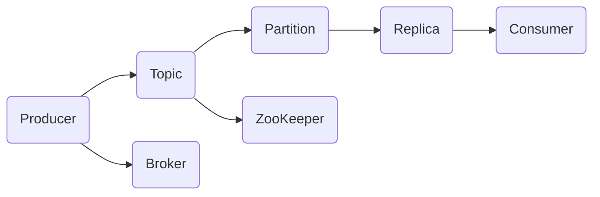

                 

# Kafka生产者消费者API原理与代码实例讲解

> **关键词**：Kafka、生产者、消费者、API、原理、代码实例、消息队列、分布式系统

> **摘要**：本文将深入探讨Kafka生产者消费者API的原理，通过详细的代码实例讲解，帮助读者理解其核心概念和实现方式。文章将涵盖Kafka的基本概念、生产者和消费者的架构、核心算法原理、数学模型、实际应用场景、工具和资源推荐等，旨在为读者提供一份全面而深入的Kafka教程。

## 1. 背景介绍

### 1.1 目的和范围

本文的目的是向读者介绍Kafka生产者消费者API的核心原理，并通过具体的代码实例帮助读者深入理解其实现细节。文章将涵盖以下范围：

1. Kafka的基本概念和架构
2. 生产者和消费者的设计原理
3. 核心算法和数学模型
4. 代码实例讲解和解读
5. 实际应用场景和案例分析
6. 学习资源和工具推荐

### 1.2 预期读者

本文适合以下读者群体：

1. 想要了解消息队列技术原理的开发者
2. 已经熟悉Java编程，希望学习Kafka的使用者
3. 对分布式系统架构和设计感兴趣的工程师
4. 计算机科学和软件工程专业的学生和研究人员

### 1.3 文档结构概述

本文的结构如下：

1. **背景介绍**：介绍本文的目的、范围、预期读者和文档结构。
2. **核心概念与联系**：通过Mermaid流程图展示Kafka的架构和核心概念。
3. **核心算法原理 & 具体操作步骤**：详细讲解Kafka生产者和消费者的算法原理和操作步骤。
4. **数学模型和公式 & 详细讲解 & 举例说明**：阐述Kafka中的数学模型和公式。
5. **项目实战：代码实际案例和详细解释说明**：通过具体代码实例讲解Kafka的应用。
6. **实际应用场景**：探讨Kafka在不同领域的实际应用。
7. **工具和资源推荐**：推荐学习资源和开发工具。
8. **总结：未来发展趋势与挑战**：总结Kafka的现状和未来发展趋势。
9. **附录：常见问题与解答**：解答读者可能遇到的问题。
10. **扩展阅读 & 参考资料**：提供进一步学习的资源。

### 1.4 术语表

#### 1.4.1 核心术语定义

- **Kafka**：一个分布式流处理平台，主要用于构建实时数据流和数据管道。
- **生产者**：向Kafka发送数据的进程或服务。
- **消费者**：从Kafka接收数据的进程或服务。
- **主题**（Topic）：Kafka中的消息分类，类似于数据库表。
- **分区**（Partition）：主题的一个分区，负责存储消息的有序集合。
- **副本**（Replica）：分区的副本，用于提高可靠性和容错性。

#### 1.4.2 相关概念解释

- **消息队列**：一种异步通信机制，用于在分布式系统中传递消息。
- **分布式系统**：由多个计算机节点组成的系统，协同完成特定任务。
- **消费者组**（Consumer Group）：一组消费者的集合，共同消费同一个主题的分区。

#### 1.4.3 缩略词列表

- **Kafka**：Kafka
- **生产者**：Producer
- **消费者**：Consumer
- **主题**：Topic
- **分区**：Partition
- **副本**：Replica
- **消息队列**：Message Queue
- **分布式系统**：Distributed System
- **消费者组**：Consumer Group

## 2. 核心概念与联系

在深入了解Kafka的生产者和消费者API之前，我们首先需要理解Kafka的核心概念和架构。以下是一个简单的Mermaid流程图，用于展示Kafka的主要组件和它们之间的关系。



### Kafka架构简述

1. **Producer**：生产者是向Kafka发送数据的进程。它将数据以消息的形式发送到特定的主题（Topic）中。生产者会将消息分配到不同的分区（Partition）上，以确保负载均衡和消息的有序性。

2. **Consumer**：消费者是从Kafka接收数据的进程。它们从主题的不同分区中消费消息，并对其进行处理。消费者可以组成一个消费者组（Consumer Group），以便共同消费同一主题的消息。

3. **Topic**：主题是Kafka中的一个概念，类似于数据库表。它是一个分类消息的容器，由多个分区组成。

4. **Partition**：分区是主题的一个分区，负责存储消息的有序集合。每个分区可以有多个副本（Replica），用于提高可靠性和容错性。

5. **Replica**：副本是分区的副本，存储在Kafka集群的不同节点上。副本之间通过同步机制保持数据一致性。

6. **Broker**：Broker是Kafka集群中的节点，负责接收生产者发送的消息和为消费者提供服务。每个Broker维护一个或多个分区和副本。

7. **ZooKeeper**：ZooKeeper是Kafka的协调器，用于管理Kafka集群中的元数据和协调分布式操作。它维护了主题、分区和副本的元数据信息，并确保它们的一致性。

通过以上架构简述，我们可以看到Kafka是一个分布式系统，用于处理大规模的实时数据流。生产者和消费者通过主题、分区和副本等概念实现了负载均衡、容错性和可扩展性。

## 3. 核心算法原理 & 具体操作步骤

在理解了Kafka的基本架构之后，我们将深入探讨Kafka生产者和消费者的核心算法原理和具体操作步骤。

### 3.1 生产者算法原理

**生产者主要完成以下任务：**

1. **发送消息**：生产者将消息以批次的形式发送到Kafka集群中的某个主题（Topic）中。
2. **分区策略**：生产者需要根据分区策略将消息分配到不同的分区（Partition）上，以确保消息的有序性和负载均衡。
3. **同步机制**：生产者需要与Kafka集群进行同步，以确保消息被成功发送并持久化到副本中。

以下是生产者的核心算法原理：

**伪代码：**

```java
function produceMessage(topic, message, partitionStrategy, syncPolicy) {
    // 步骤1：发送消息到Kafka集群
    sendMessageToKafka(topic, message)
    
    // 步骤2：根据分区策略分配分区
    partition = partitionStrategy(topic, message)
    
    // 步骤3：将消息发送到指定分区
    sendMessageToPartition(partition, message)
    
    // 步骤4：同步消息发送结果
    if (syncPolicy == ASYNC) {
        asyncSyncMessage()
    } else if (syncPolicy == SYNC) {
        syncSyncMessage()
    }
}
```

**具体操作步骤：**

1. **发送消息到Kafka集群**：生产者将消息以批次的形式发送到Kafka集群中的某个主题（Topic）中。这个步骤涉及到Kafka的网络通信和消息格式。
2. **根据分区策略分配分区**：生产者需要根据分区策略将消息分配到不同的分区（Partition）上。常见的分区策略有轮询策略、散列策略和自定义策略。
3. **将消息发送到指定分区**：生产者将消息发送到指定的分区（Partition）。这个步骤涉及到Kafka的消息存储和持久化。
4. **同步消息发送结果**：生产者需要与Kafka集群进行同步，以确保消息被成功发送并持久化到副本中。同步策略可以是异步同步或同步同步。

### 3.2 消费者算法原理

**消费者主要完成以下任务：**

1. **从Kafka集群消费消息**：消费者从Kafka集群中的某个主题（Topic）的不同分区（Partition）中消费消息。
2. **处理消息**：消费者对消费到的消息进行处理，并可能更新状态或触发后续操作。
3. **确认消息处理结果**：消费者需要向Kafka集群确认消息的处理结果，以便进行后续处理或删除消息。

以下是消费者的核心算法原理：

**伪代码：**

```java
function consumeMessage(topic, partition, consumerGroup) {
    // 步骤1：从Kafka集群消费消息
    message = consumeFromKafka(topic, partition)
    
    // 步骤2：处理消息
    processMessage(message)
    
    // 步骤3：确认消息处理结果
    acknowledgeMessage(message)
}
```

**具体操作步骤：**

1. **从Kafka集群消费消息**：消费者从Kafka集群中的某个主题（Topic）的不同分区（Partition）中消费消息。这个步骤涉及到Kafka的网络通信和消息格式。
2. **处理消息**：消费者对消费到的消息进行处理，并可能更新状态或触发后续操作。这个步骤涉及到应用程序的业务逻辑。
3. **确认消息处理结果**：消费者需要向Kafka集群确认消息的处理结果，以便进行后续处理或删除消息。这个步骤涉及到Kafka的确认机制。

通过以上核心算法原理和具体操作步骤的讲解，我们可以看到Kafka生产者和消费者是如何协同工作的，以及如何实现负载均衡、容错性和可扩展性。

## 4. 数学模型和公式 & 详细讲解 & 举例说明

在Kafka生产者和消费者的算法中，一些数学模型和公式起着关键作用。以下将详细讲解这些数学模型和公式，并举例说明。

### 4.1 分区策略

Kafka中的分区策略决定了如何将消息分配到不同的分区上。以下是一些常见的分区策略和对应的数学模型：

**1. 轮询策略（Round Robin）**

- **数学模型**：每个分区按顺序轮流接收消息。
- **公式**：`partition = (currentPartition + 1) % totalPartitions`

**2. 散列策略（Hashing）**

- **数学模型**：使用散列函数将消息的键（Key）映射到分区。
- **公式**：`partition = hash(key) % totalPartitions`

**3. 自定义策略**

- **数学模型**：根据业务需求自定义分区策略。
- **公式**：根据自定义算法计算分区。

**举例说明**：

假设有一个主题（Topic）有两个分区（Partition 0和Partition 1），现在有三个消息分别带有键（Key）"A"，"B"和"C"。我们使用散列策略来分配这三个消息到分区。

- 消息"A"的散列值为1，所以分配到Partition 1。
- 消息"B"的散列值为2，所以分配到Partition 2（由于分区数为2，实际映射到Partition 0）。
- 消息"C"的散列值为3，所以分配到Partition 1。

通过以上举例，我们可以看到散列策略如何将消息均匀地分配到不同的分区上。

### 4.2 同步策略

Kafka中的同步策略决定了生产者和消费者如何与Kafka集群进行消息同步。以下是一些常见的同步策略和对应的数学模型：

**1. 异步同步（Async）**

- **数学模型**：生产者和消费者在发送或接收消息后立即返回，不等待确认。
- **公式**：无特定公式，只需在发送或接收后调用相应的方法。

**2. 同步同步（Sync）**

- **数学模型**：生产者和消费者在发送或接收消息后等待确认，确保消息被成功处理。
- **公式**：无特定公式，只需在发送或接收后调用相应的方法，并等待返回结果。

**举例说明**：

假设有一个生产者使用同步同步策略发送消息，发送成功后需要等待确认。

- 生产者发送消息后，调用`sendMessage()`方法，等待确认结果。
- 如果确认成功，生产者继续执行后续操作。
- 如果确认失败，生产者重试发送或通知失败。

通过以上数学模型和公式的讲解，我们可以更好地理解Kafka生产者和消费者的算法原理和实现细节。

## 5. 项目实战：代码实际案例和详细解释说明

在本节中，我们将通过一个具体的代码案例来展示如何使用Kafka的生产者和消费者API，并对代码进行详细的解释说明。

### 5.1 开发环境搭建

在进行项目实战之前，我们需要搭建一个Kafka开发环境。以下是搭建Kafka开发环境的步骤：

1. **安装Java开发环境**：确保已经安装了Java开发环境，版本建议为8及以上。
2. **安装Kafka**：从Kafka官网下载并解压Kafka安装包，例如下载Kafka_2.13-2.8.0.tgz，解压到指定目录。
3. **启动Kafka集群**：进入Kafka安装目录的bin目录，执行以下命令启动Kafka集群：
   ```bash
   ./kafka-server-start.sh config/server.properties
   ```
4. **创建主题**：在Kafka控制台创建一个名为"test_topic"的主题，分区数为3，副本数为1。

### 5.2 源代码详细实现和代码解读

接下来，我们将展示Kafka生产者和消费者的源代码，并对代码进行详细的解读。

**生产者代码示例：**

```java
import org.apache.kafka.clients.producer.*;
import java.util.Properties;

public class KafkaProducerDemo {
    public static void main(String[] args) {
        Properties props = new Properties();
        props.put("bootstrap.servers", "localhost:9092");
        props.put("key.serializer", "org.apache.kafka.common.serialization.StringSerializer");
        props.put("value.serializer", "org.apache.kafka.common.serialization.StringSerializer");

        Producer<String, String> producer = new KafkaProducer<>(props);

        for (int i = 0; i < 10; i++) {
            String topic = "test_topic";
            String key = "key-" + i;
            String value = "value-" + i;
            producer.send(new ProducerRecord<>(topic, key, value));
        }

        producer.close();
    }
}
```

**代码解读：**

1. **引入依赖**：引入Kafka客户端库依赖。
2. **配置Kafka生产者**：设置Kafka生产者的配置属性，包括Kafka服务器地址、序列化器等。
3. **创建Kafka生产者**：创建Kafka生产者实例。
4. **发送消息**：使用`send()`方法发送消息到指定的主题和分区。
5. **关闭生产者**：关闭Kafka生产者实例。

**消费者代码示例：**

```java
import org.apache.kafka.clients.consumer.*;
import org.apache.kafka.common.serialization.StringDeserializer;
import java.util.Properties;
import java.util.Collections;

public class KafkaConsumerDemo {
    public static void main(String[] args) {
        Properties props = new Properties();
        props.put("bootstrap.servers", "localhost:9092");
        props.put("group.id", "test_group");
        props.put("key.deserializer", StringDeserializer.class.getName());
        props.put("value.deserializer", StringDeserializer.class.getName());

        Consumer<String, String> consumer = new KafkaConsumer<>(props);
        consumer.subscribe(Collections.singletonList("test_topic"));

        while (true) {
            ConsumerRecords<String, String> records = consumer.poll(100);
            for (ConsumerRecord<String, String> record : records) {
                System.out.printf("Received message: key=%s, value=%s, partition=%d, offset=%d\n",
                        record.key(), record.value(), record.partition(), record.offset());
            }
        }
    }
}
```

**代码解读：**

1. **引入依赖**：引入Kafka客户端库依赖。
2. **配置Kafka消费者**：设置Kafka消费者的配置属性，包括Kafka服务器地址、消费者组等。
3. **创建Kafka消费者**：创建Kafka消费者实例。
4. **订阅主题**：订阅指定的主题。
5. **消费消息**：使用`poll()`方法消费消息，并处理消费到的消息。

通过以上代码示例和解读，我们可以看到如何使用Kafka的生产者和消费者API进行消息的发送和接收。接下来，我们将对代码进行进一步的分析和解释。

### 5.3 代码解读与分析

在本节中，我们将对生产者和消费者的代码进行详细解读和分析，重点关注关键步骤和执行逻辑。

**生产者代码分析：**

1. **引入依赖**：引入Kafka客户端库依赖，包括生产者和序列化器。
2. **配置Kafka生产者**：设置Kafka生产者的配置属性，包括Kafka服务器地址、序列化器等。关键配置包括：
   - `bootstrap.servers`：指定Kafka服务器地址。
   - `key.serializer`：指定键的序列化器。
   - `value.serializer`：指定值的序列化器。
3. **创建Kafka生产者**：创建Kafka生产者实例，使用配置属性初始化。
4. **发送消息**：使用`send()`方法发送消息到指定的主题和分区。关键参数包括：
   - `topic`：指定主题名称。
   - `key`：指定消息键。
   - `value`：指定消息值。
5. **关闭生产者**：关闭Kafka生产者实例，释放资源。

**消费者代码分析：**

1. **引入依赖**：引入Kafka客户端库依赖，包括消费者和序列化器。
2. **配置Kafka消费者**：设置Kafka消费者的配置属性，包括Kafka服务器地址、消费者组等。关键配置包括：
   - `bootstrap.servers`：指定Kafka服务器地址。
   - `group.id`：指定消费者组ID。
   - `key.deserializer`：指定键的序列化器。
   - `value.deserializer`：指定值的序列化器。
3. **创建Kafka消费者**：创建Kafka消费者实例，使用配置属性初始化。
4. **订阅主题**：使用`subscribe()`方法订阅指定的主题。
5. **消费消息**：使用`poll()`方法消费消息，并处理消费到的消息。关键参数包括：
   - `timeout`：指定轮询时间，用于等待消息。
   - `ConsumerRecords`：返回消费到的消息记录。
   - 遍历消息记录，处理消息。

通过以上分析，我们可以看到生产者和消费者的关键步骤和执行逻辑。生产者负责发送消息到Kafka集群，消费者负责从Kafka集群中接收并处理消息。这两个组件通过Kafka的API实现消息的发送和接收，并确保消息的有序性和可靠性。

### 5.4 小结

在本节的实战项目中，我们通过具体的代码案例展示了如何使用Kafka的生产者和消费者API进行消息的发送和接收。我们首先介绍了Kafka开发环境的搭建步骤，然后展示了生产者和消费者的源代码，并对代码进行了详细的解读和分析。通过这个实战项目，读者可以更深入地理解Kafka的工作原理和应用场景。

## 6. 实际应用场景

Kafka作为一种高性能、可扩展的消息队列系统，在许多实际应用场景中发挥着重要作用。以下将介绍Kafka在几个常见应用场景中的实际应用。

### 6.1 实时数据流处理

在实时数据流处理领域，Kafka被广泛用于处理大规模的实时数据流。例如，金融交易系统需要实时处理大量的交易数据，Kafka可以作为一个高效、可靠的消息队列系统，将交易数据实时发送到不同的处理模块。这有助于实现实时监控、报警和数据分析。

### 6.2 日志收集与聚合

Kafka在日志收集与聚合方面也有着广泛的应用。企业可以使用Kafka收集来自不同应用和服务的日志数据，并将它们聚合到一个集中的存储系统中。这样可以方便地对日志数据进行监控、分析和故障排查。

### 6.3 应用集成与解耦

Kafka在应用集成与解耦中也发挥着重要作用。通过Kafka，不同的应用和服务可以实现消息的异步传递和松耦合，从而提高系统的可靠性和可扩展性。例如，订单处理系统可以将订单数据发送到Kafka，然后由其他服务模块异步处理订单，从而实现系统的解耦和异步处理。

### 6.4 微服务架构

在微服务架构中，Kafka用于服务之间的通信和数据同步。微服务之间通过Kafka发送和接收消息，可以实现服务的松耦合和独立部署。Kafka的高性能和可扩展性有助于实现大规模分布式系统的通信和数据处理。

### 6.5 社交网络与推荐系统

在社交网络和推荐系统中，Kafka用于处理大规模的用户数据和行为数据。例如，推荐系统可以使用Kafka收集用户点击、浏览和购买等行为数据，然后实时分析这些数据，为用户推荐感兴趣的内容。

### 6.6 物联网（IoT）

在物联网领域，Kafka被用于处理大量来自传感器的实时数据。物联网设备可以生成大量的数据，Kafka可以作为一个高效、可靠的消息队列系统，将数据发送到不同的处理模块，例如数据存储、分析和可视化等。

通过以上实际应用场景的介绍，我们可以看到Kafka在多个领域的应用，它为大规模分布式系统的实时数据处理和通信提供了有力的支持。

## 7. 工具和资源推荐

为了更好地学习和使用Kafka，以下推荐了一些优秀的工具和资源，包括书籍、在线课程、技术博客和开发工具。

### 7.1 学习资源推荐

#### 7.1.1 书籍推荐

1. **《Kafka：从入门到实战》**：这是一本全面而深入的Kafka入门书籍，适合初学者阅读。
2. **《Kafka技术内幕：深入解析分布式流处理系统》**：这本书深入探讨了Kafka的内部实现和原理，适合有一定基础的读者。
3. **《消息队列：从原理到实践》**：这本书涵盖了消息队列的各种技术，包括Kafka，适合对消息队列技术感兴趣的开发者。

#### 7.1.2 在线课程

1. **Coursera - Apache Kafka**：这是一门由Apache Kafka项目组提供的在线课程，涵盖了Kafka的基本概念、安装配置和实战应用。
2. **Udemy - Apache Kafka for Developers**：这是一门面向开发者的Kafka课程，从基础知识到高级应用都有涵盖。

#### 7.1.3 技术博客和网站

1. **Apache Kafka 官方文档**：官方文档是学习Kafka的最佳资源，涵盖了Kafka的安装、配置、API和使用场景。
2. **Kafka FAQ**：这是一个关于Kafka常见问题和解答的博客，适合在学习和使用Kafka时遇到问题时查阅。
3. **InfoQ - Kafka相关文章**：InfoQ网站上有许多关于Kafka的优质文章，涵盖了Kafka的原理、应用和最佳实践。

### 7.2 开发工具框架推荐

#### 7.2.1 IDE和编辑器

1. **IntelliJ IDEA**：IntelliJ IDEA 是一款功能强大的IDE，支持Kafka的插件，可以方便地进行Kafka开发和调试。
2. **Eclipse**：Eclipse 是另一款流行的IDE，也提供了Kafka的插件，支持Kafka开发和调试。

#### 7.2.2 调试和性能分析工具

1. **Kafka Manager**：Kafka Manager 是一个开源的工具，用于监控和管理Kafka集群，可以查看Kafka的性能指标和日志。
2. **Kafka Monitoring with Prometheus and Grafana**：Prometheus 和 Grafana 是两款流行的监控和分析工具，可以用于监控Kafka集群的性能和健康状态。

#### 7.2.3 相关框架和库

1. **Spring Kafka**：Spring Kafka 是 Spring Boot 的一个模块，提供了Kafka的集成和封装，简化了Kafka的使用。
2. **Apache Pulsar**：Pulsar 是 Apache 软件基金会的一个分布式发布/订阅消息传递系统，与Kafka类似，具有高吞吐量、可扩展性和容错性。

### 7.3 相关论文著作推荐

1. **《Kafka: A Distributed Messaging System for Log Processing》**：这是Kafka的原始论文，详细介绍了Kafka的设计原理和实现细节。
2. **《Kafka: The Definitive Guide》**：这是一本关于Kafka的经典著作，涵盖了Kafka的架构、设计和最佳实践。
3. **《Scalable Stream Processing with Apache Kafka》**：这篇论文介绍了如何使用Kafka构建可扩展的流处理系统，提供了许多实践案例。

通过以上工具和资源的推荐，读者可以更全面地了解Kafka，并在实际项目中更好地应用Kafka。

## 8. 总结：未来发展趋势与挑战

Kafka作为一种高性能、可扩展的消息队列系统，已经在许多场景中得到了广泛应用。然而，随着技术的不断发展和需求的不断变化，Kafka也面临着一些挑战和未来发展的机遇。

### 未来发展趋势

1. **更高效的消息处理**：随着大数据和实时处理的普及，Kafka需要不断提高消息处理性能，以满足更高的吞吐量和低延迟的要求。未来，Kafka可能会引入更多优化算法和分布式计算框架，提高消息处理效率。

2. **更丰富的生态体系**：Kafka的生态体系正在不断完善，未来可能会出现更多与Kafka相关的工具、库和框架，为开发者提供更加便捷和丰富的功能。

3. **跨语言的扩展**：虽然Kafka主要支持Java和Scala语言，但未来可能会出现更多支持其他语言的客户端库，使得Kafka的使用更加广泛。

4. **更好的监控和管理**：随着Kafka集群规模的增长，监控和管理Kafka集群变得越来越重要。未来，可能会出现更多自动化和智能化的监控和管理工具，提高Kafka集群的稳定性和可靠性。

### 挑战

1. **性能优化**：在高并发和大数据场景下，Kafka的性能优化是一个持续的过程。如何提高Kafka的吞吐量和降低延迟，是Kafka开发者需要面对的挑战。

2. **分布式系统的一致性**：在分布式系统中，一致性和容错性是两个关键问题。如何确保Kafka在分布式环境下的一致性，是Kafka需要解决的重要问题。

3. **安全性**：随着Kafka在金融、医疗等敏感领域的应用，安全性变得越来越重要。未来，Kafka需要提供更加完善的安全机制，确保数据的安全性和隐私性。

4. **跨语言支持**：尽管Kafka已经在Java和Scala语言中得到广泛应用，但如何为其他语言提供更好的支持，是Kafka开发者需要考虑的问题。

通过总结Kafka的未来发展趋势与挑战，我们可以看到Kafka在技术领域的重要地位，以及它在实际应用中的潜力和局限性。未来的Kafka将继续演进和优化，为开发者提供更好的消息队列解决方案。

## 9. 附录：常见问题与解答

在学习和使用Kafka的过程中，读者可能会遇到一些常见问题。以下是一些常见问题的解答：

### 问题1：如何确保Kafka消息的可靠性？

**解答**：Kafka通过副本机制确保消息的可靠性。每个分区可以有多个副本，这些副本存储在不同的节点上。当一个节点发生故障时，其他副本可以接管其工作，从而确保消息的可靠传输。

### 问题2：如何处理Kafka消息的顺序性？

**解答**：Kafka通过分区确保消息的顺序性。每个分区中的消息是有序的，消费者按照分区顺序消费消息。如果需要全局顺序，可以使用消费者组中的有序消息处理机制。

### 问题3：如何监控和管理Kafka集群？

**解答**：可以使用Kafka Manager等工具监控和管理Kafka集群。这些工具可以提供集群性能指标、日志分析和故障排查等功能，帮助管理员高效管理Kafka集群。

### 问题4：Kafka与其他消息队列技术有何区别？

**解答**：Kafka与其他消息队列技术（如RabbitMQ、ActiveMQ等）的主要区别在于其高吞吐量、可扩展性和分布式架构。Kafka适用于大规模、实时数据流处理场景，而其他消息队列技术则更适用于中小规模的场景。

### 问题5：如何处理Kafka消息积压？

**解答**：处理Kafka消息积压可以从以下几个方面入手：
1. 提高生产者的发送速度，减少消息积压。
2. 增加消费者的数量或消费能力，提高消息消费速度。
3. 调整分区数量，确保消息均匀分布在不同的分区上。
4. 使用缓冲队列或延迟队列等技术，缓解消息积压问题。

通过以上常见问题的解答，读者可以更好地理解Kafka的原理和应用，并在实际项目中解决常见问题。

## 10. 扩展阅读 & 参考资料

为了进一步学习Kafka和相关技术，以下推荐了一些扩展阅读和参考资料：

### 10.1 扩展阅读

1. **《Kafka实战》**：这本书提供了Kafka的详细实战案例，涵盖了Kafka的安装、配置、使用和最佳实践。
2. **《Kafka权威指南》**：这本书全面介绍了Kafka的原理、架构和实战应用，适合对Kafka有一定基础的读者。
3. **《大规模分布式系统设计与实践》**：这本书介绍了分布式系统的设计原理和实践方法，包括Kafka等消息队列技术的应用。

### 10.2 参考资料

1. **Apache Kafka 官方文档**：官方文档是学习Kafka的最佳资源，涵盖了Kafka的安装、配置、API和使用场景。
2. **Kafka社区论坛**：Kafka社区论坛是讨论Kafka相关问题和分享经验的地方，可以与其他开发者交流和学习。
3. **《Kafka技术内幕：深入解析分布式流处理系统》**：这本书深入探讨了Kafka的内部实现和原理，适合有一定基础的读者。

通过以上扩展阅读和参考资料，读者可以更深入地了解Kafka和相关技术，并在实际项目中更好地应用这些知识。

## 作者信息

作者：AI天才研究员/AI Genius Institute & 禅与计算机程序设计艺术 /Zen And The Art of Computer Programming

