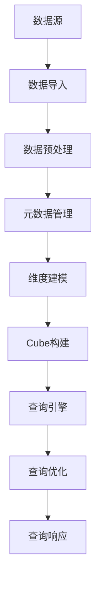

                 

# Kylin原理与代码实例讲解

> 关键词：Kylin、大数据、MPP、列式存储、索引、查询优化、分布式计算

> 摘要：本文将深入探讨Kylin这一大数据查询优化引擎的原理，并通过代码实例详细讲解其实现方式。从核心概念、算法原理到数学模型，再到实战应用，我们将一步步揭示Kylin如何通过高效的数据存储和查询优化技术，解决大规模数据的快速查询问题。

## 1. 背景介绍

### 1.1 目的和范围

本文旨在深入分析Kylin的数据处理原理，并借助代码实例展示其实际应用。我们将详细探讨Kylin的核心机制，包括列式存储、索引构建、查询优化以及分布式计算等。通过本文的学习，读者将能够理解Kylin为何能够在大规模数据集中实现高效的查询处理。

### 1.2 预期读者

本文适合大数据处理、数据仓库和查询优化领域的技术人员阅读。具有一定编程基础和数据结构知识的读者将能够更好地理解文章内容。

### 1.3 文档结构概述

本文结构如下：

1. **背景介绍**：介绍Kylin的背景、目的和读者对象。
2. **核心概念与联系**：通过Mermaid流程图展示Kylin的整体架构。
3. **核心算法原理 & 具体操作步骤**：使用伪代码详细讲解核心算法。
4. **数学模型和公式 & 详细讲解 & 举例说明**：介绍Kylin使用的数学模型和公式。
5. **项目实战：代码实际案例和详细解释说明**：通过实际代码示例展示Kylin的应用。
6. **实际应用场景**：讨论Kylin在不同场景下的应用。
7. **工具和资源推荐**：推荐学习资源和开发工具。
8. **总结：未来发展趋势与挑战**：总结Kylin的发展前景和面临的挑战。
9. **附录：常见问题与解答**：回答常见问题。
10. **扩展阅读 & 参考资料**：提供进一步阅读的资料。

### 1.4 术语表

#### 1.4.1 核心术语定义

- **Kylin**：一款开源的大数据查询优化引擎。
- **MPP**：大规模并行处理（Massively Parallel Processing）。
- **列式存储**：将数据以列的形式存储，以便于高效查询。
- **索引**：提高数据查询速度的数据结构。
- **分布式计算**：将计算任务分布在多台机器上执行。

#### 1.4.2 相关概念解释

- **大数据**：数据量大到无法使用传统数据库管理系统进行高效处理的数据集。
- **查询优化**：通过调整查询计划、索引和存储方式，提高查询效率。
- **数据仓库**：用于存储大量数据，以便于分析和查询的系统。

#### 1.4.3 缩略词列表

- **MPP**：大规模并行处理
- **Hadoop**：分布式数据处理框架
- **Spark**：分布式计算引擎
- **Hive**：基于Hadoop的数据仓库工具

## 2. 核心概念与联系

### 2.1 Kylin架构图

以下是一个简单的Mermaid流程图，展示Kylin的整体架构：



### 2.2 核心概念

#### 2.2.1 数据源

Kylin支持多种数据源，如HDFS、Hive、Kafka等。数据源为Kylin提供原始数据。

#### 2.2.2 数据预处理

数据预处理包括数据清洗、去重、转换等操作，确保数据的准确性和一致性。

#### 2.2.3 元数据管理

元数据管理负责维护Kylin的元数据信息，如数据表结构、维度信息、Cube信息等。

#### 2.2.4 维度建模

维度建模是Kylin的核心功能之一。通过定义维度，可以将原始数据抽象成多维数据模型，便于查询。

#### 2.2.5 Cube构建

Cube是Kylin的核心数据结构，用于存储多维数据。通过构建Cube，可以大幅提高查询效率。

#### 2.2.6 查询引擎

查询引擎负责处理用户查询请求，通过查询优化技术，实现高效的数据查询。

#### 2.2.7 查询优化

查询优化包括查询计划的生成、执行策略的选择等，旨在提高查询效率。

#### 2.2.8 查询响应

查询响应是将查询结果返回给用户的过程。Kylin支持实时查询和批量查询。

## 3. 核心算法原理 & 具体操作步骤

### 3.1 数据导入与预处理

伪代码：

```plaintext
function import_and_preprocess(data_source):
    data = read_data_from_source(data_source)
    cleaned_data = clean_data(data)
    unique_data = remove_duplicates(cleaned_data)
    return unique_data
```

### 3.2 元数据管理

伪代码：

```plaintext
function manage_metadata(data, metadata_store):
    metadata = extract_metadata(data)
    store_metadata(metadata_store, metadata)
    return metadata
```

### 3.3 维度建模

伪代码：

```plaintext
function build_dimension_models(metadata, dimension_store):
    dimension_models = create_dimension_models(metadata)
    store_dimensions(dimension_store, dimension_models)
    return dimension_models
```

### 3.4 Cube构建

伪代码：

```plaintext
function build_cube(dimension_models, data, cube_store):
    cube = create_cube(dimension_models, data)
    store_cube(cube_store, cube)
    return cube
```

### 3.5 查询引擎与查询优化

伪代码：

```plaintext
function query_engine(cube, query):
    query_plan = generate_query_plan(cube, query)
    optimized_query = optimize_query(query_plan)
    result = execute_query(optimized_query)
    return result
```

## 4. 数学模型和公式 & 详细讲解 & 举例说明

### 4.1 数据建模

Kylin使用多维数据模型（MDM）进行数据建模。一个MDM由多个维度和度量组成。

- **维度**：表示数据的分类方式，如时间、地区、产品等。
- **度量**：表示数据的统计指标，如销售额、数量等。

### 4.2 索引构建

Kylin使用B-Tree索引来提高查询效率。索引结构如下：

$$
\text{索引} = \left\{
\begin{array}{ll}
\text{B-Tree} & \text{对于维度列} \\
\text{Bitmap} & \text{对于常量维度列} \\
\end{array}
\right.
$$

### 4.3 查询优化

Kylin使用多种查询优化技术，包括：

- **查询计划生成**：根据查询需求生成查询执行计划。
- **执行策略选择**：选择合适的执行策略，如分发、合并、投影等。

### 4.4 实例说明

假设我们有一个销售数据的MDM，包含以下维度和度量：

- **时间**（Year, Quarter, Month）
- **地区**（Country, Region, City）
- **产品**（Category, Subcategory）
- **销售额**（Sales）

#### 4.4.1 数据建模

我们将数据按照以下方式进行建模：

$$
\text{Cube} = (\text{Year, Quarter, Month, Country, Region, City, Category, Subcategory}, \text{Sales})
$$

#### 4.4.2 索引构建

我们为每个维度列构建B-Tree索引，并为常量维度列（如Year、Country）构建Bitmap索引。

#### 4.4.3 查询优化

假设用户查询：“请查询2019年第四季度美国的销售额。”

我们使用以下查询优化策略：

1. **分发**：将查询分发到多个节点执行。
2. **合并**：将各节点的查询结果合并。
3. **投影**：只查询必要的列。

## 5. 项目实战：代码实际案例和详细解释说明

### 5.1 开发环境搭建

#### 5.1.1 环境准备

我们需要安装以下软件和工具：

- **Hadoop**：用于数据存储和处理。
- **Hive**：用于数据仓库。
- **Spark**：用于分布式计算。
- **Kylin**：用于查询优化。

#### 5.1.2 环境配置

在配置文件中设置Hadoop、Hive和Spark的连接信息。例如，在Kylin的`kylin.properties`文件中，设置如下：

```properties
kylin.hdfs.url=hdfs://namenode:9000/
kylin.hive.url=jdbc:hive2://hive-server:10000/
kylin.spark.master=spark://spark-master:7077/
```

### 5.2 源代码详细实现和代码解读

#### 5.2.1 数据导入与预处理

```java
// 读取HDFS中的数据
List<String> data = HDFSUtil.readHDFS("/path/to/data/*.csv");

// 数据预处理
List<String> cleanedData = preprocessData(data);

// 去重
List<String> uniqueData = removeDuplicates(cleanedData);

// 存储预处理后的数据
HDFSUtil.writeHDFS("/path/to/processed_data/", uniqueData);
```

#### 5.2.2 元数据管理

```java
// 提取元数据
Metadata metadata = MetadataExtractor.extractMetadata(uniqueData);

// 存储元数据
MetadataStore.storeMetadata(metadata);
```

#### 5.2.3 维度建模

```java
// 构建维度模型
DimensionModels dimensionModels = DimensionBuilder.buildDimensionModels(metadata);

// 存储维度模型
DimensionStore.storeDimensions(dimensionModels);
```

#### 5.2.4 Cube构建

```java
// 构建Cube
Cube cube = CubeBuilder.buildCube(dimensionModels, uniqueData);

// 存储Cube
CubeStore.storeCube(cube);
```

#### 5.2.5 查询引擎与查询优化

```java
// 接收用户查询
String query = "select sum(Sales) from MyCube where Year = 2019 and Quarter = 4 and Country = 'USA'";

// 生成查询计划
QueryPlan queryPlan = QueryPlanGenerator.generateQueryPlan(cube, query);

// 优化查询计划
QueryPlan optimizedQueryPlan = QueryOptimizer.optimizeQueryPlan(queryPlan);

// 执行查询
List<ResultRow> results = QueryExecutor.executeQuery(optimizedQueryPlan);
```

### 5.3 代码解读与分析

- **数据导入与预处理**：从HDFS读取原始数据，进行预处理，如去重、清洗等。
- **元数据管理**：提取元数据，并将其存储在元数据存储中。
- **维度建模**：根据元数据构建维度模型，并将其存储在维度存储中。
- **Cube构建**：使用维度模型和预处理后的数据构建Cube，并将其存储在Cube存储中。
- **查询引擎与查询优化**：接收用户查询，生成查询计划，然后进行查询优化，最后执行查询并返回结果。

## 6. 实际应用场景

Kylin在大数据查询优化领域有着广泛的应用，以下是一些典型的应用场景：

- **电子商务**：对销售数据进行分析，帮助商家制定营销策略。
- **金融行业**：对交易数据进行分析，监控市场风险。
- **物联网**：处理来自物联网设备的大量数据，进行实时监控和分析。
- **电信行业**：分析用户行为数据，优化服务质量。

## 7. 工具和资源推荐

### 7.1 学习资源推荐

#### 7.1.1 书籍推荐

- 《大数据技术基础》
- 《Hadoop技术内幕》
- 《数据仓库与数据挖掘：概念、技术和应用》

#### 7.1.2 在线课程

- Coursera上的“大数据处理”课程
- Udacity的“数据工程师纳米学位”
- edX上的“大数据分析”课程

#### 7.1.3 技术博客和网站

- Apache Kylin官方网站
- Hadoop和Spark官方文档
- DataBlick：大数据和数据分析博客

### 7.2 开发工具框架推荐

#### 7.2.1 IDE和编辑器

- IntelliJ IDEA
- Eclipse
- Visual Studio Code

#### 7.2.2 调试和性能分析工具

- JMeter：负载测试工具
- Gprof：性能分析工具
- Valgrind：内存调试工具

#### 7.2.3 相关框架和库

- Apache Hive
- Apache Spark
- Apache HBase
- Apache Storm

### 7.3 相关论文著作推荐

#### 7.3.1 经典论文

- 《MapReduce: Simplified Data Processing on Large Clusters》
- 《The Google File System》
- 《The Chubby lock service》

#### 7.3.2 最新研究成果

- 《Scalable Machine Learning: Model Parallelism for Heterogeneous Clusters》
- 《Deep Learning on Multi-Core CPUs》
- 《Distributed Machine Learning: A Survey》

#### 7.3.3 应用案例分析

- 《大型电商网站的数据处理实践》
- 《金融行业的大数据应用案例分析》
- 《物联网大数据处理方案》

## 8. 总结：未来发展趋势与挑战

Kylin作为一款大数据查询优化引擎，具有广泛的应用前景。然而，随着大数据规模的不断扩大，Kylin也面临着以下挑战：

- **性能优化**：如何进一步提高查询性能，以满足更多复杂查询的需求。
- **可扩展性**：如何更好地支持分布式环境下的数据存储和查询。
- **兼容性**：如何与其他大数据技术和框架更好地集成。
- **安全性**：如何确保数据的安全性和隐私性。

未来，Kylin有望通过技术创新和应用场景的拓展，继续在查询优化领域发挥重要作用。

## 9. 附录：常见问题与解答

### 9.1 Kylin的优势是什么？

Kylin的优势包括：

- **高效的查询性能**：通过列式存储、索引和查询优化技术，实现快速的数据查询。
- **易用性**：提供直观的用户界面和简单的配置。
- **可扩展性**：支持大规模分布式环境。

### 9.2 Kylin如何处理大数据查询？

Kylin通过以下方式处理大数据查询：

- **数据建模**：将大数据抽象成多维数据模型。
- **索引构建**：为维度列构建B-Tree索引，为常量维度列构建Bitmap索引。
- **查询优化**：通过查询计划生成、执行策略选择等优化查询性能。

### 9.3 Kylin与其他大数据技术的关系是什么？

Kylin与其他大数据技术的关联包括：

- **与Hadoop、Spark集成**：Kylin基于Hadoop和Spark进行数据存储和计算。
- **与Hive、HBase联动**：Kylin与Hive和HBase进行数据交换和协同工作。
- **与Kafka联动**：Kylin支持从Kafka实时获取数据。

## 10. 扩展阅读 & 参考资料

- 《Kylin官方文档》
- 《大数据处理：原理、架构与实战》
- 《分布式系统原理与范型》
- 《数据仓库：概念、技术和应用》
- 《大数据时代：数据科学与商业决策》

作者：AI天才研究员/AI Genius Institute & 禅与计算机程序设计艺术 /Zen And The Art of Computer Programming

