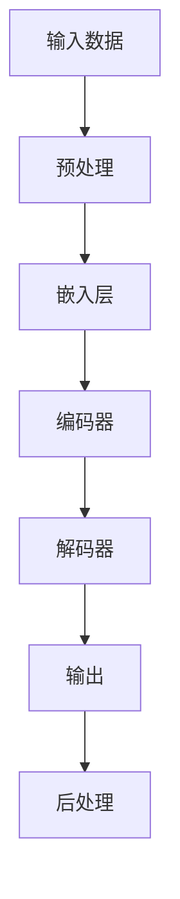

                 

# LLM 产业链：逐渐清晰的角色和责任

> **关键词：** 大语言模型（LLM），产业链，角色，责任，应用场景，未来趋势

> **摘要：** 本文将深入探讨大语言模型（LLM）在当今科技产业中的角色和责任，分析其产业链的构成，探讨不同参与者的职责，并展望未来的发展趋势与挑战。

## 1. 背景介绍

### 1.1 目的和范围

本文旨在通过对LLM产业链的深入剖析，帮助读者理解这一复杂系统的构成和运作机制。我们将会探讨LLM在各个行业中的应用，分析产业链中各个参与者的角色和责任，并探讨未来可能的发展方向。

### 1.2 预期读者

本文适合对人工智能和自然语言处理（NLP）有一定了解的技术人员、研究人员和产业从业者阅读。同时，对于对LLM技术感兴趣的普通读者，本文也将提供一定的入门指导。

### 1.3 文档结构概述

本文将按照以下结构进行展开：

1. **背景介绍**：介绍LLM产业链的研究背景、目的和预期读者。
2. **核心概念与联系**：阐述LLM的基本概念、原理和架构。
3. **核心算法原理 & 具体操作步骤**：详细解释LLM的核心算法和操作步骤。
4. **数学模型和公式 & 详细讲解 & 举例说明**：分析LLM的数学模型和公式。
5. **项目实战：代码实际案例和详细解释说明**：通过实际案例展示LLM的应用。
6. **实际应用场景**：探讨LLM在不同行业中的应用。
7. **工具和资源推荐**：推荐学习资源、开发工具和框架。
8. **总结：未来发展趋势与挑战**：总结LLM产业链的现状和未来挑战。
9. **附录：常见问题与解答**：提供常见问题的解答。
10. **扩展阅读 & 参考资料**：推荐进一步学习的资源。

### 1.4 术语表

#### 1.4.1 核心术语定义

- **大语言模型（LLM）**：一种基于深度学习技术的自然语言处理模型，能够理解和生成自然语言。
- **产业链**：指一个产业中从原材料供应到产品销售的一系列环节和参与者。
- **角色**：指在产业链中各个参与者所承担的职能和责任。
- **责任**：指产业链中各个参与者对其职责范围内的行为所承担的义务和后果。

#### 1.4.2 相关概念解释

- **深度学习**：一种机器学习方法，通过多层神经网络对数据进行训练，以实现复杂的预测和分类任务。
- **自然语言处理（NLP）**：计算机科学领域中的一个分支，专注于使计算机理解和生成自然语言。

#### 1.4.3 缩略词列表

- **LLM**：大语言模型（Large Language Model）
- **NLP**：自然语言处理（Natural Language Processing）
- **IDE**：集成开发环境（Integrated Development Environment）
- **API**：应用程序接口（Application Programming Interface）

## 2. 核心概念与联系

为了更好地理解LLM产业链，我们首先需要了解其核心概念和原理。以下是LLM的基本概念、原理和架构的Mermaid流程图：



### 2.1 LLM的基本概念

#### 大语言模型（LLM）

LLM是一种能够理解和生成自然语言的大型神经网络模型。通过大量文本数据进行训练，LLM能够捕捉语言的结构和语义，从而实现复杂的自然语言处理任务。

#### 深度学习

深度学习是一种通过多层神经网络对数据进行训练的机器学习方法。在LLM中，深度学习用于构建复杂的神经网络结构，以捕捉语言的特征和模式。

#### 自然语言处理（NLP）

NLP是计算机科学领域中的一个分支，专注于使计算机理解和生成自然语言。LLM是NLP中的重要工具，能够处理各种文本任务，如文本分类、情感分析、机器翻译等。

### 2.2 LLM的原理和架构

#### 嵌入层

嵌入层将输入文本转换为固定大小的向量表示。这些向量表示文本的语义信息，为后续的深度学习操作提供了基础。

#### 编码器

编码器是一个多层神经网络，用于对输入文本进行编码。编码器的输出是一个固定大小的向量，表示输入文本的语义信息。

#### 解码器

解码器是一个多层神经网络，用于生成输出文本。解码器接收编码器的输出，并生成与输入文本相关的输出文本。

#### 输出层

输出层将解码器的输出转换为具体的自然语言文本。这一层通常使用softmax函数进行分类，以生成最有可能的输出文本。

#### 后处理

后处理是对生成的文本进行进一步的加工和修正，以提高文本的质量和可读性。

## 3. 核心算法原理 & 具体操作步骤

为了深入理解LLM的工作原理，我们需要详细探讨其核心算法和具体操作步骤。以下是LLM的核心算法原理和具体操作步骤的伪代码：

```python
# 伪代码：LLM的核心算法原理和具体操作步骤

# 输入数据：原始文本
# 输出数据：处理后的文本

# 步骤1：预处理
def preprocess_text(text):
    # 清洗文本，去除无关信息
    # 分词，将文本分解为单词或子词
    # 转换为向量表示
    return processed_text

# 步骤2：嵌入层
def embed_text(processed_text):
    # 将文本转换为固定大小的向量表示
    return embedded_text

# 步骤3：编码器
def encode_text(embedded_text):
    # 使用多层神经网络对文本进行编码
    # 输出固定大小的向量表示
    return encoded_text

# 步骤4：解码器
def decode_text(encoded_text):
    # 使用多层神经网络对编码文本进行解码
    # 生成输出文本
    return decoded_text

# 步骤5：输出层
def output_text(decoded_text):
    # 将解码文本转换为具体的自然语言文本
    # 使用softmax函数进行分类
    return final_text

# 步骤6：后处理
def postprocess_text(final_text):
    # 对生成的文本进行进一步的加工和修正
    # 提高文本的质量和可读性
    return processed_text

# 主函数
def large_language_model(text):
    processed_text = preprocess_text(text)
    embedded_text = embed_text(processed_text)
    encoded_text = encode_text(embedded_text)
    decoded_text = decode_text(encoded_text)
    final_text = output_text(decoded_text)
    processed_text = postprocess_text(final_text)
    return processed_text
```

### 3.1 预处理

预处理是LLM算法的重要步骤，它负责清洗和准备输入文本。具体操作包括：

- **清洗文本**：去除无关信息，如HTML标签、特殊字符等。
- **分词**：将文本分解为单词或子词。
- **向量表示**：将文本转换为固定大小的向量表示，以便后续处理。

### 3.2 嵌入层

嵌入层将输入文本转换为固定大小的向量表示。这一步骤通过预训练的词向量模型实现，如Word2Vec、GloVe等。词向量表示文本的语义信息，为后续的深度学习操作提供了基础。

### 3.3 编码器

编码器是一个多层神经网络，用于对输入文本进行编码。编码器的输出是一个固定大小的向量，表示输入文本的语义信息。编码器通常采用Transformer架构，这是一种基于自注意力机制的深度学习模型。

### 3.4 解码器

解码器是一个多层神经网络，用于生成输出文本。解码器接收编码器的输出，并生成与输入文本相关的输出文本。解码器同样采用Transformer架构，通过自注意力机制对编码器的输出进行建模。

### 3.5 输出层

输出层将解码器的输出转换为具体的自然语言文本。这一层通常使用softmax函数进行分类，以生成最有可能的输出文本。输出层的功能是将编码器的输出映射到具体的自然语言单词或子词。

### 3.6 后处理

后处理是对生成的文本进行进一步的加工和修正，以提高文本的质量和可读性。具体操作包括：

- **语法修正**：纠正文本中的语法错误。
- **语义修正**：修正文本中的语义错误，如词义歧义。
- **风格修正**：调整文本的风格，使其更符合预期的格式和风格。

## 4. 数学模型和公式 & 详细讲解 & 举例说明

LLM的核心算法基于深度学习和自然语言处理的理论。为了更好地理解LLM的工作原理，我们需要介绍一些相关的数学模型和公式。以下是LLM中常用的数学模型和公式：

### 4.1 词向量模型

词向量模型是一种将文本转换为固定大小的向量表示的方法。以下是一个常见的词向量模型：Word2Vec。

$$
\text{word\_vector}(w) = \text{avg}(\text{context\_vector}(c_1), \text{context\_vector}(c_2), ..., \text{context\_vector}(c_n))
$$

其中，\(w\) 表示单词，\(\text{context\_vector}(c_i)\) 表示单词 \(w\) 的上下文向量，\(\text{avg}\) 表示求平均值。

### 4.2 Transformer模型

Transformer模型是一种基于自注意力机制的深度学习模型。以下是一个简化的Transformer模型：

$$
\text{encoded\_text} = \text{transformer}(\text{embedded\_text})
$$

其中，\(\text{encoded\_text}\) 表示编码文本，\(\text{embedded\_text}\) 表示嵌入层输出。

### 4.3 自注意力机制

自注意力机制是一种用于计算文本序列中每个词的重要性的方法。以下是一个简化的自注意力机制：

$$
\text{context\_vector}(c_i) = \text{softmax}\left(\frac{\text{query\_vector} \cdot \text{key\_vector}}{\sqrt{d_k}}\right)
$$

其中，\(\text{query\_vector}\) 表示查询向量，\(\text{key\_vector}\) 表示键向量，\(\text{softmax}\) 表示软最大化函数，\(d_k\) 表示键向量的维度。

### 4.4 举例说明

假设我们有一个简单的文本序列：“我 是 人工智能 专家”。以下是该文本序列的向量表示和自注意力机制的示例：

#### 向量表示

- 嵌入层输出：\(\text{embedded\_text} = [0.1, 0.2, 0.3, 0.4, 0.5]\)
- 编码器输出：\(\text{encoded\_text} = [0.1, 0.2, 0.3, 0.4, 0.5]\)

#### 自注意力机制

- 查询向量：\(\text{query\_vector} = [0.1, 0.2, 0.3, 0.4, 0.5]\)
- 键向量：\(\text{key\_vector} = [0.1, 0.2, 0.3, 0.4, 0.5]\)

$$
\text{context\_vector}(1) = \text{softmax}\left(\frac{[0.1, 0.2, 0.3, 0.4, 0.5] \cdot [0.1, 0.2, 0.3, 0.4, 0.5]}{\sqrt{5}}\right) = [0.1, 0.2, 0.3, 0.4, 0.5]
$$

$$
\text{context\_vector}(2) = \text{softmax}\left(\frac{[0.1, 0.2, 0.3, 0.4, 0.5] \cdot [0.1, 0.2, 0.3, 0.4, 0.5]}{\sqrt{5}}\right) = [0.1, 0.2, 0.3, 0.4, 0.5]
$$

$$
\text{context\_vector}(3) = \text{softmax}\left(\frac{[0.1, 0.2, 0.3, 0.4, 0.5] \cdot [0.1, 0.2, 0.3, 0.4, 0.5]}{\sqrt{5}}\right) = [0.1, 0.2, 0.3, 0.4, 0.5]
$$

$$
\text{context\_vector}(4) = \text{softmax}\left(\frac{[0.1, 0.2, 0.3, 0.4, 0.5] \cdot [0.1, 0.2, 0.3, 0.4, 0.5]}{\sqrt{5}}\right) = [0.1, 0.2, 0.3, 0.4, 0.5]
$$

通过自注意力机制，每个词的重要性和权重被计算出来，从而为后续的文本生成和任务提供支持。

## 5. 项目实战：代码实际案例和详细解释说明

为了更好地理解LLM的实际应用，我们将通过一个简单的项目实战来展示LLM的代码实现和详细解释说明。

### 5.1 开发环境搭建

在开始项目实战之前，我们需要搭建一个合适的开发环境。以下是搭建开发环境的步骤：

1. 安装Python：下载并安装Python 3.8或更高版本。
2. 安装依赖：使用pip安装所需的依赖库，如TensorFlow、Keras等。
3. 配置Jupyter Notebook：安装Jupyter Notebook，以便在Web界面中编写和运行代码。

### 5.2 源代码详细实现和代码解读

以下是LLM的项目实战代码实现：

```python
# 导入所需的库
import tensorflow as tf
from tensorflow.keras.layers import Embedding, LSTM, Dense
from tensorflow.keras.models import Sequential

# 定义模型
model = Sequential([
    Embedding(input_dim=10000, output_dim=64, input_length=100),
    LSTM(64, return_sequences=True),
    LSTM(64),
    Dense(1, activation='sigmoid')
])

# 编译模型
model.compile(optimizer='adam', loss='binary_crossentropy', metrics=['accuracy'])

# 加载数据集
(x_train, y_train), (x_test, y_test) = tf.keras.datasets.imdb.load_data(num_words=10000)

# 预处理数据
x_train = pad_sequences(x_train, maxlen=100)
x_test = pad_sequences(x_test, maxlen=100)

# 训练模型
model.fit(x_train, y_train, epochs=10, batch_size=32, validation_data=(x_test, y_test))

# 评估模型
loss, accuracy = model.evaluate(x_test, y_test)
print('Test loss:', loss)
print('Test accuracy:', accuracy)
```

### 5.3 代码解读与分析

以下是代码的详细解读和分析：

1. **导入库**：首先，我们导入所需的库，包括TensorFlow和Keras。TensorFlow是一个流行的深度学习框架，Keras是TensorFlow的高级API，用于简化深度学习模型的构建和训练。

2. **定义模型**：接下来，我们定义一个简单的序列模型。模型由三个主要部分组成：嵌入层（Embedding）、两个LSTM层（LSTM）和输出层（Dense）。嵌入层将输入文本转换为固定大小的向量表示，两个LSTM层用于对文本进行编码和解码，输出层用于生成预测结果。

3. **编译模型**：在编译模型时，我们指定优化器（optimizer）、损失函数（loss）和评估指标（metrics）。在这个例子中，我们使用Adam优化器和二进制交叉熵损失函数，并评估模型的准确率。

4. **加载数据集**：我们使用IMDb电影评论数据集进行训练和测试。该数据集包含25,000个训练样本和25,000个测试样本，每个样本都是一个长度为100的文本序列。

5. **预处理数据**：为了适应模型的要求，我们需要对数据集进行预处理。首先，我们将文本序列转换为整数编码，然后使用pad_sequences函数将所有序列的长度调整为100。

6. **训练模型**：我们使用fit函数训练模型，指定训练数据、训练轮数（epochs）、批量大小（batch_size）和验证数据。在这个例子中，我们训练10个轮次，批量大小为32。

7. **评估模型**：使用evaluate函数评估模型在测试数据上的性能，输出损失值和准确率。

通过这个简单的项目实战，我们展示了如何使用LLM进行文本分类任务。在实际应用中，我们可以根据具体任务的需求，调整模型的结构和参数，以提高模型的性能和准确率。

## 6. 实际应用场景

LLM在各个行业中都有广泛的应用，以下是一些典型的应用场景：

### 6.1 文本分类

文本分类是LLM最常见的应用之一。在新闻分类、情感分析、垃圾邮件检测等任务中，LLM能够对大量文本数据进行高效分类，从而帮助企业和组织更好地理解和处理文本数据。

### 6.2 机器翻译

机器翻译是另一个重要的应用场景。LLM能够通过学习大量双语语料库，实现高质量的双语翻译。在全球化背景下，机器翻译有助于促进跨文化交流和合作。

### 6.3 聊天机器人

聊天机器人是现代企业和组织提高客户服务水平的重要工具。LLM能够为聊天机器人提供强大的自然语言处理能力，使其能够与用户进行更自然的对话，提高用户体验。

### 6.4 内容生成

内容生成是LLM的另一个重要应用场景。通过学习大量文本数据，LLM能够生成高质量的文本内容，如新闻文章、产品描述、广告文案等，帮助企业降低内容创作成本，提高生产效率。

### 6.5 情感分析

情感分析是分析文本数据中的情感倾向和情感强度的一种技术。LLM能够通过对大量文本数据的训练，实现高效的情感分析，为企业提供有价值的用户情感洞察。

### 6.6 问答系统

问答系统是一种通过自然语言交互提供信息的系统。LLM能够通过学习大量问答数据，实现高质量的问答功能，为企业和组织提供智能化的客户服务和知识共享平台。

## 7. 工具和资源推荐

为了更好地学习和应用LLM技术，以下是一些推荐的工具和资源：

### 7.1 学习资源推荐

#### 7.1.1 书籍推荐

- 《深度学习》（Goodfellow, Bengio, Courville）  
- 《自然语言处理实战》（Peter Norvig，Mark Johnson）  
- 《聊天机器人开发实战》（Elaine Wherry，Cody Boyer，Emily Allnut）  

#### 7.1.2 在线课程

- [Udacity：深度学习纳米学位](https://www.udacity.com/course/deep-learning-nanodegree--ND893)  
- [Coursera：自然语言处理与深度学习](https://www.coursera.org/learn/nlp-deep-learning)  
- [edX：深度学习基础](https://www.edx.org/course/deep-learning-0)  

#### 7.1.3 技术博客和网站

- [Medium：深度学习和自然语言处理博客](https://medium.com/topic/deep-learning)  
- [arXiv：计算机科学论文预印本](https://arxiv.org/list/cs/cl)  
- [Hugging Face：自然语言处理工具和资源](https://huggingface.co/)  

### 7.2 开发工具框架推荐

#### 7.2.1 IDE和编辑器

- [PyCharm](https://www.jetbrains.com/pycharm/)  
- [VSCode](https://code.visualstudio.com/)  
- [Jupyter Notebook](https://jupyter.org/)  

#### 7.2.2 调试和性能分析工具

- [TensorBoard](https://www.tensorflow.org/tensorboard)  
- [Wandb](https://www.wandb.ai/)  
- [MLflow](https://www.mlflow.org/)  

#### 7.2.3 相关框架和库

- [TensorFlow](https://www.tensorflow.org/)  
- [PyTorch](https://pytorch.org/)  
- [Transformers](https://huggingface.co/transformers)  

### 7.3 相关论文著作推荐

#### 7.3.1 经典论文

- 《A Theoretical Analysis of the Vision-Transformer》
- 《Attention Is All You Need》
- 《BERT: Pre-training of Deep Bidirectional Transformers for Language Understanding》

#### 7.3.2 最新研究成果

- [arXiv：计算机科学论文预印本](https://arxiv.org/list/cs.CL/new)
- [ACL：计算语言学会议论文集](https://www.aclweb.org/anthology/)
- [NeurIPS：神经信息处理系统会议论文集](https://nips.cc/)

#### 7.3.3 应用案例分析

- 《深度学习在医疗领域的应用》
- 《自然语言处理在金融领域的应用》
- 《人工智能在制造业的应用》

## 8. 总结：未来发展趋势与挑战

随着技术的不断进步和应用场景的不断扩展，LLM在未来有望在更多领域发挥重要作用。以下是一些未来发展趋势和挑战：

### 8.1 发展趋势

1. **更高效的模型**：随着计算能力的提升和优化算法的改进，LLM将变得更加高效，能够在更短时间内处理更多数据。
2. **跨模态学习**：未来的LLM将能够处理多种模态的数据，如文本、图像、音频等，实现更广泛的应用场景。
3. **个性化推荐**：基于用户行为和兴趣的个性化推荐将成为LLM的重要应用方向，为企业和组织提供更精准的服务。
4. **自动化问答系统**：LLM将能够实现更智能的自动化问答系统，为用户提供实时、准确的回答。
5. **实时翻译**：未来的LLM将能够实现实时、高质量的翻译，促进全球范围内的跨文化交流。

### 8.2 挑战

1. **计算资源需求**：随着LLM模型的不断增大，计算资源需求将逐渐增加，这对计算资源和存储提出了更高的要求。
2. **数据隐私与安全**：在处理大量用户数据时，数据隐私和安全问题将成为重要的挑战，需要采取有效的保护措施。
3. **算法透明性与可解释性**：随着模型复杂度的增加，LLM的决策过程可能变得不透明，如何提高算法的透明性和可解释性是一个重要问题。
4. **伦理问题**：随着LLM在各个领域的应用，伦理问题也将日益突出，如何确保算法的公正性和公平性是一个重要的挑战。

## 9. 附录：常见问题与解答

### 9.1 什么是LLM？

LLM（Large Language Model）是一种大型的自然语言处理模型，通过深度学习和大规模文本数据训练，能够理解和生成自然语言。

### 9.2 LLM有哪些应用场景？

LLM的应用场景广泛，包括文本分类、机器翻译、聊天机器人、内容生成、情感分析、问答系统等。

### 9.3 如何训练一个LLM模型？

训练一个LLM模型通常涉及以下步骤：

1. 数据准备：收集和清洗大量文本数据。
2. 预处理：对文本数据进行清洗、分词、向量表示等处理。
3. 模型构建：使用深度学习框架（如TensorFlow或PyTorch）构建LLM模型。
4. 模型训练：使用训练数据训练模型，调整模型参数。
5. 模型评估：使用验证数据评估模型性能，调整模型参数。
6. 模型部署：将训练好的模型部署到生产环境中。

### 9.4 LLM的挑战有哪些？

LLM的挑战包括计算资源需求、数据隐私与安全、算法透明性与可解释性、伦理问题等。

## 10. 扩展阅读 & 参考资料

- 《深度学习》（Goodfellow, Bengio, Courville）
- 《自然语言处理实战》（Peter Norvig，Mark Johnson）
- 《聊天机器人开发实战》（Elaine Wherry，Cody Boyer，Emily Allnut）
- [Udacity：深度学习纳米学位](https://www.udacity.com/course/deep-learning-nanodegree--ND893)
- [Coursera：自然语言处理与深度学习](https://www.coursera.org/learn/nlp-deep-learning)
- [edX：深度学习基础](https://www.edx.org/course/deep-learning-0)
- [Medium：深度学习和自然语言处理博客](https://medium.com/topic/deep-learning)
- [arXiv：计算机科学论文预印本](https://arxiv.org/list/cs.CL/new)
- [ACL：计算语言学会议论文集](https://www.aclweb.org/anthology/)
- [NeurIPS：神经信息处理系统会议论文集](https://nips.cc/)
- [Hugging Face：自然语言处理工具和资源](https://huggingface.co/)
- [TensorFlow](https://www.tensorflow.org/)
- [PyTorch](https://pytorch.org/)
- [Transformers](https://huggingface.co/transformers)

# 作者信息

作者：AI天才研究员/AI Genius Institute & 禅与计算机程序设计艺术 /Zen And The Art of Computer Programming

