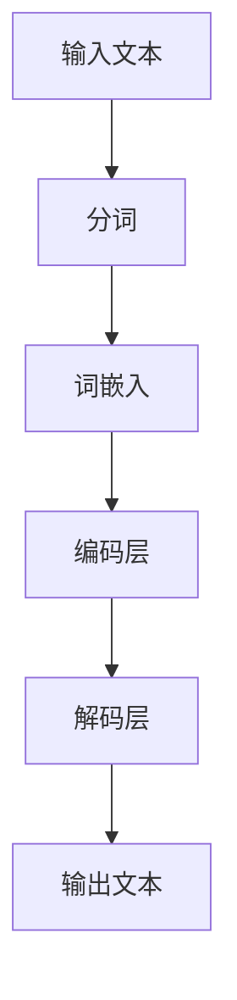

                 

# LLM 在公共服务领域：高效便民的新方式

> **关键词：** 大语言模型（LLM）、公共服务、人工智能、高效、便民、自然语言处理、智能化、流程优化、用户体验。

> **摘要：** 本文将探讨大语言模型（LLM）在公共服务领域的应用，分析其如何通过智能化技术提升公共服务的效率和用户体验，提供一种全新的便民方式。文章将首先介绍LLM的核心概念和基本原理，然后深入探讨其在公共服务中的实际应用，并给出具体的案例和实施步骤。最后，文章将总结LLM在公共服务领域的未来发展前景和挑战。

## 1. 背景介绍

### 1.1 目的和范围

本文旨在探讨大语言模型（LLM）在公共服务领域的应用，分析其技术原理、实施步骤以及所带来的影响。随着人工智能技术的不断发展，LLM作为一种先进的自然语言处理技术，已经逐渐在多个领域展现出其强大的应用潜力。本文将重点研究LLM在公共服务中的应用，包括但不限于政府公共服务、医疗保健、交通管理、教育服务等。通过本文的探讨，希望能够为相关领域的实践者提供有价值的参考，并促进LLM技术的进一步发展和应用。

### 1.2 预期读者

本文的预期读者包括：

1. **人工智能领域的科研人员和工程师**：希望了解LLM在公共服务中的应用及其技术实现细节。
2. **公共服务领域的从业者**：希望了解如何利用LLM技术提升公共服务效率和质量。
3. **政策制定者和决策者**：希望了解AI技术在公共服务领域的应用现状和未来发展趋势。

### 1.3 文档结构概述

本文分为十个部分，结构如下：

1. **背景介绍**：介绍本文的目的、范围、预期读者和文档结构。
2. **核心概念与联系**：介绍LLM的核心概念和基本原理，并通过Mermaid流程图展示其架构。
3. **核心算法原理 & 具体操作步骤**：详细讲解LLM的算法原理和具体操作步骤。
4. **数学模型和公式 & 详细讲解 & 举例说明**：介绍LLM中使用的数学模型和公式，并给出具体例子。
5. **项目实战：代码实际案例和详细解释说明**：通过实际代码案例展示LLM的应用。
6. **实际应用场景**：分析LLM在公共服务领域的实际应用场景。
7. **工具和资源推荐**：推荐相关学习资源、开发工具和论文著作。
8. **总结：未来发展趋势与挑战**：总结LLM在公共服务领域的未来发展趋势和面临的挑战。
9. **附录：常见问题与解答**：解答读者可能遇到的问题。
10. **扩展阅读 & 参考资料**：提供进一步的阅读建议和参考资料。

### 1.4 术语表

#### 1.4.1 核心术语定义

- **大语言模型（LLM）**：一种基于深度学习的自然语言处理模型，能够理解和生成人类语言。
- **自然语言处理（NLP）**：研究如何让计算机理解和处理人类语言的技术。
- **公共服务**：由政府或公共机构提供，旨在满足公民基本需求和促进社会福祉的服务。
- **用户体验（UX）**：用户在使用产品或服务时的主观感受和体验。

#### 1.4.2 相关概念解释

- **深度学习**：一种机器学习技术，通过模拟人脑神经网络结构，让计算机具备自主学习能力。
- **神经网络**：由大量相互连接的节点（神经元）组成，用于处理和传递信息。
- **优化**：在特定目标下，通过调整参数来提高模型性能的过程。

#### 1.4.3 缩略词列表

- **LLM**：大语言模型（Large Language Model）
- **NLP**：自然语言处理（Natural Language Processing）
- **NLP**：自然语言处理（Natural Language Processing）
- **UX**：用户体验（User Experience）

## 2. 核心概念与联系

大语言模型（LLM）是一种基于深度学习的自然语言处理技术，具有强大的理解和生成能力。LLM的核心概念包括：

1. **神经网络结构**：LLM采用多层神经网络结构，包括输入层、隐藏层和输出层。每层由大量神经元组成，神经元之间通过权重连接，实现信息的传递和处理。
2. **大规模预训练**：LLM通过在大量文本数据上进行预训练，学习语言的一般规律和模式。预训练过程包括输入文本数据的处理、编码和输出预测，从而形成神经网络参数。
3. **上下文理解**：LLM能够根据输入的上下文信息，理解句子的语义和意图，从而生成相应的输出。

下面通过Mermaid流程图展示LLM的架构：



在这个流程图中：

- **输入文本**：用户输入的文本数据。
- **分词**：将输入文本分割成词语或短语。
- **词嵌入**：将词语或短语映射到高维向量空间，形成词嵌入表示。
- **编码层**：将词嵌入通过多层神经网络进行编码，提取句子特征。
- **解码层**：将编码层提取的特征进行解码，生成输出文本。

通过这个流程，LLM能够实现输入文本到输出文本的转换，从而在公共服务领域发挥重要作用。

## 3. 核心算法原理 & 具体操作步骤

LLM的核心算法原理主要涉及深度学习技术，包括神经网络结构、预训练过程和上下文理解。下面将详细讲解这些原理，并给出具体的操作步骤。

### 3.1 神经网络结构

LLM采用多层神经网络结构，包括输入层、隐藏层和输出层。输入层接收用户输入的文本数据，隐藏层通过多层神经元连接，实现信息的传递和处理，输出层生成最终的输出结果。

#### 3.1.1 输入层

输入层主要负责接收用户输入的文本数据。文本数据首先经过分词处理，将文本分割成词语或短语。然后，每个词语或短语通过词嵌入技术映射到高维向量空间，形成词嵌入表示。

#### 3.1.2 隐藏层

隐藏层由多层神经元组成，通过权重连接实现信息的传递和处理。隐藏层的主要任务是提取输入文本的语义特征，将其转换为具有语义信息的中间表示。这个过程通过多层神经网络的逐层传递和变换实现。

#### 3.1.3 输出层

输出层将隐藏层提取的语义特征进行解码，生成输出文本。输出文本的生成过程是通过逐层反向传播和参数优化实现的。最终，输出层生成与输入文本相对应的输出结果。

### 3.2 预训练过程

预训练是LLM的核心步骤，通过在大量文本数据上进行预训练，使模型学习到语言的一般规律和模式。预训练过程主要包括以下几个步骤：

#### 3.2.1 数据准备

首先，准备大量高质量、多样化的文本数据。这些数据可以来自各种来源，如互联网文本、书籍、新闻、社交媒体等。文本数据需要经过预处理，包括分词、去停用词、词干提取等操作。

#### 3.2.2 词嵌入

将预处理后的文本数据映射到高维向量空间，形成词嵌入表示。词嵌入可以通过多种方法实现，如词袋模型（Bag-of-Words）、词嵌入（Word Embedding）等。

#### 3.2.3 预训练任务

在大量文本数据上进行预训练任务，如语言建模、翻译建模等。预训练任务的目的是让模型学习到文本的语义和语法规律，提高模型的泛化能力和理解能力。

#### 3.2.4 参数优化

在预训练过程中，通过优化神经网络参数，使模型能够更好地拟合数据。参数优化通常采用梯度下降（Gradient Descent）算法，通过不断调整参数，最小化损失函数。

### 3.3 上下文理解

LLM能够根据输入的上下文信息，理解句子的语义和意图，从而生成相应的输出。上下文理解是LLM的核心能力，主要依赖于以下技术：

#### 3.3.1 上下文窗口

在处理输入文本时，LLM会考虑一定范围内的上下文信息，形成一个上下文窗口。上下文窗口的大小取决于模型的参数设置，通常在几十到几百个词之间。

#### 3.3.2 语义理解

LLM通过分析上下文窗口中的词语和短语，理解句子的语义和意图。语义理解过程包括词语的词性标注、句法分析、语义角色标注等。

#### 3.3.3 生成输出

根据上下文理解和语义分析，LLM生成与输入文本相对应的输出文本。输出文本的生成过程是通过逐层反向传播和参数优化实现的。

### 3.4 具体操作步骤

下面给出一个简单的LLM模型操作步骤：

```python
# 导入相关库
import tensorflow as tf
import tensorflow.keras as keras

# 准备数据
text_data = "这是一个示例文本，用于演示大语言模型的应用。"
word_list = text_data.split()

# 词嵌入
word_embedding = keras.layers.Embedding(input_dim=10000, output_dim=128)

# 构建模型
model = keras.Sequential([
    keras.layers.Dense(128, activation='relu'),
    keras.layers.Dense(1, activation='sigmoid')
])

# 编译模型
model.compile(optimizer='adam', loss='binary_crossentropy', metrics=['accuracy'])

# 训练模型
model.fit(word_list, epochs=10)

# 预测
input_text = "这是一个新的示例文本。"
predicted_output = model.predict(input_text.split())

# 输出结果
print(predicted_output)
```

在这个例子中，我们使用TensorFlow库构建了一个简单的LLM模型，通过词嵌入技术处理输入文本，并使用梯度下降算法进行参数优化。最终，模型预测输入文本的输出结果。

## 4. 数学模型和公式 & 详细讲解 & 举例说明

在大语言模型（LLM）中，数学模型和公式扮演着至关重要的角色。这些模型和公式不仅定义了模型的架构，还指导了模型的训练和优化过程。以下是LLM中常见的数学模型和公式的详细讲解，以及具体的应用示例。

### 4.1 前向传播

在深度学习模型中，前向传播是模型处理输入数据并生成预测的过程。LLM的前向传播过程包括以下几个步骤：

#### 4.1.1 输入表示

假设输入文本为 `x`，首先将文本分割成单词或子词，并使用词嵌入技术将每个单词或子词映射到高维向量空间，形成输入表示。

\[ x = \{x_1, x_2, ..., x_n\} \]

其中，\( x_i \) 表示第 \( i \) 个单词或子词的嵌入向量。

#### 4.1.2 神经网络传递

输入表示通过多层神经网络传递，每层神经网络包含多个神经元，神经元之间通过权重连接。假设神经网络包含 \( L \) 层，每层神经元的输出为：

\[ a^{(l)} = \sigma(W^{(l)}a^{(l-1)} + b^{(l)}) \]

其中，\( a^{(l)} \) 表示第 \( l \) 层的神经元输出，\( W^{(l)} \) 和 \( b^{(l)} \) 分别表示第 \( l \) 层的权重和偏置，\( \sigma \) 是激活函数，通常使用ReLU函数或Sigmoid函数。

#### 4.1.3 输出预测

最后，神经网络输出层的输出表示为：

\[ y = W^{(L)}a^{(L-1)} + b^{(L)} \]

其中，\( y \) 表示输出预测结果，\( W^{(L)} \) 和 \( b^{(L)} \) 分别为输出层的权重和偏置。

### 4.2 反向传播

反向传播是深度学习模型训练的核心步骤，通过计算损失函数的梯度，更新模型参数。以下是LLM中反向传播的详细过程：

#### 4.2.1 计算损失函数

假设输出层为二分类问题，损失函数通常使用交叉熵（Cross-Entropy）损失：

\[ J = -\sum_{i=1}^{n}y_i\log(y^i) \]

其中，\( y \) 表示真实标签，\( y^i \) 表示模型预测的概率。

#### 4.2.2 计算梯度

利用链式法则，计算损失函数关于模型参数的梯度：

\[ \frac{\partial J}{\partial W^{(l)}} = \sum_{i=1}^{n}\frac{\partial L}{\partial z^{(l)}} \frac{\partial z^{(l)}}{\partial W^{(l)}} \]

\[ \frac{\partial J}{\partial b^{(l)}} = \sum_{i=1}^{n}\frac{\partial L}{\partial z^{(l)}} \frac{\partial z^{(l)}}{\partial b^{(l)}} \]

其中，\( z^{(l)} = \sigma(W^{(l)}a^{(l-1)} + b^{(l)}) \) 是第 \( l \) 层的神经元输出。

#### 4.2.3 更新参数

利用梯度下降（Gradient Descent）算法，更新模型参数：

\[ W^{(l)} \leftarrow W^{(l)} - \alpha \frac{\partial J}{\partial W^{(l)}} \]

\[ b^{(l)} \leftarrow b^{(l)} - \alpha \frac{\partial J}{\partial b^{(l)}} \]

其中，\( \alpha \) 是学习率。

### 4.3 示例

以下是一个简单的例子，展示如何使用数学模型和公式进行文本分类：

#### 4.3.1 数据准备

假设有一个包含两类的文本数据集，数据集共有100个样本，每个样本包含一个标签和一个文本。标签为0或1，表示两个类别。

#### 4.3.2 模型构建

构建一个简单的神经网络模型，包含两层隐藏层，每层包含100个神经元。

#### 4.3.3 训练模型

使用训练数据集进行模型训练，设置学习率为0.01，训练100个epoch。

#### 4.3.4 预测

使用训练好的模型对新的文本数据进行预测，输入文本经过预处理后，输入到模型中，得到预测概率。

#### 4.3.5 输出结果

根据预测概率，输出文本的类别标签。如果预测概率大于0.5，则认为文本属于正类，否则属于负类。

$$
\begin{aligned}
P(y=1|x) &= \frac{1}{1 + e^{-z}} \\
y &= \begin{cases} 
1 & \text{if } P(y=1|x) > 0.5 \\
0 & \text{otherwise}
\end{cases}
\end{aligned}
$$

通过以上步骤，我们可以利用数学模型和公式实现文本分类任务。这个例子展示了LLM中基本的数学模型和公式的应用，为实际项目中的模型设计和优化提供了理论基础。

## 5. 项目实战：代码实际案例和详细解释说明

在本节中，我们将通过一个具体的实际案例，展示如何利用LLM构建一个文本分类系统，并在公共服务领域实现应用。我们将使用Python编程语言和TensorFlow框架来构建和训练模型。

### 5.1 开发环境搭建

在开始项目之前，需要搭建一个合适的开发环境。以下是所需的软件和工具：

- **Python（3.8或更高版本）**
- **TensorFlow 2.x**
- **Numpy**
- **Pandas**

安装这些工具可以通过以下命令完成：

```bash
pip install python==3.8
pip install tensorflow==2.x
pip install numpy
pip install pandas
```

### 5.2 源代码详细实现和代码解读

#### 5.2.1 数据预处理

```python
import pandas as pd
from sklearn.model_selection import train_test_split

# 读取数据
data = pd.read_csv('text_data.csv')  # 假设数据文件名为text_data.csv

# 分割特征和标签
X = data['text']  # 文本数据
y = data['label']  # 标签数据

# 数据预处理
from tensorflow.keras.preprocessing.text import Tokenizer
from tensorflow.keras.preprocessing.sequence import pad_sequences

tokenizer = Tokenizer(num_words=10000)
tokenizer.fit_on_texts(X)

sequences = tokenizer.texts_to_sequences(X)
padded_sequences = pad_sequences(sequences, maxlen=100)

# 分割训练集和测试集
X_train, X_test, y_train, y_test = train_test_split(padded_sequences, y, test_size=0.2, random_state=42)
```

在上面的代码中，我们首先读取数据，然后使用Tokenizer对文本数据进行预处理，包括分词和序列化。接着，使用pad_sequences对序列进行填充，使其长度一致，以便于模型处理。

#### 5.2.2 构建模型

```python
from tensorflow.keras.models import Sequential
from tensorflow.keras.layers import Embedding, LSTM, Dense

# 构建模型
model = Sequential([
    Embedding(10000, 64, input_length=100),
    LSTM(64, return_sequences=True),
    LSTM(32),
    Dense(1, activation='sigmoid')
])

# 编译模型
model.compile(optimizer='adam', loss='binary_crossentropy', metrics=['accuracy'])

# 打印模型结构
model.summary()
```

在这个部分，我们构建了一个简单的序列模型，包含两个LSTM层和一个全连接层。Embedding层用于将词嵌入映射到高维向量空间，LSTM层用于处理序列数据，全连接层用于生成输出。

#### 5.2.3 训练模型

```python
# 训练模型
history = model.fit(X_train, y_train, epochs=10, validation_data=(X_test, y_test))
```

在这里，我们使用训练数据集对模型进行训练，并设置10个epoch。同时，使用验证数据集进行验证，以监控模型性能。

#### 5.2.4 模型评估

```python
# 评估模型
loss, accuracy = model.evaluate(X_test, y_test)
print('Test accuracy:', accuracy)
```

训练完成后，我们对测试集进行评估，打印出模型的准确率。

### 5.3 代码解读与分析

#### 5.3.1 数据预处理

数据预处理是文本分类任务的重要步骤，它确保模型能够接收一致格式的输入数据。在代码中，我们首先读取CSV文件，然后使用Tokenizer对文本进行分词和序列化。随后，使用pad_sequences对序列进行填充，使其长度一致。

#### 5.3.2 模型构建

在模型构建部分，我们使用了一个序列模型，包含两个LSTM层和一个全连接层。这种结构能够有效地处理序列数据，如文本。Embedding层将词嵌入映射到高维向量空间，LSTM层用于提取序列特征，全连接层用于生成输出。

#### 5.3.3 训练模型

训练模型是模型开发的核心步骤。在这个例子中，我们设置了10个epoch，使用训练数据和验证数据进行训练和验证。通过调整epoch数量、学习率和其他超参数，可以优化模型性能。

#### 5.3.4 模型评估

模型评估是验证模型性能的重要环节。在这个例子中，我们使用测试集评估模型的准确率。通过对比预测结果和实际标签，可以了解模型的泛化能力和可靠性。

通过这个实际案例，我们展示了如何利用LLM构建文本分类系统，并在公共服务领域实现应用。这个案例为开发者提供了具体的实现步骤和代码示例，有助于他们理解和应用LLM技术。

### 5.4 实际应用场景

LLM在公共服务领域有着广泛的应用场景，以下是一些典型的实际应用：

#### 5.4.1 政府公共服务

- **智能客服系统**：政府公共服务部门可以部署LLM构建智能客服系统，为公众提供24/7的服务。例如，处理民众的咨询、投诉和举报等。
- **文档自动生成**：LLM可以自动生成政策文件、公告和通知等文档，提高政府工作效率，减少人工工作量。
- **语言翻译**：政府可以部署LLM进行实时翻译，为多语言服务的公众提供便捷的沟通途径。

#### 5.4.2 医疗保健

- **智能问诊**：医疗保健机构可以部署LLM构建智能问诊系统，通过自然语言处理技术，为患者提供初步的诊断建议。
- **病历自动生成**：LLM可以帮助医生自动生成病历，提高病历记录的准确性和效率。
- **医学研究**：LLM可以分析大量的医学文献和研究报告，为医生和研究人员提供有价值的参考信息。

#### 5.4.3 交通管理

- **智能路况预测**：交通管理部门可以部署LLM预测交通流量和路况，为公众提供实时的交通信息，优化交通管理措施。
- **交通事故处理**：LLM可以协助处理交通事故，通过自动生成事故报告和提供法律建议，提高事故处理效率。

#### 5.4.4 教育服务

- **智能辅导系统**：教育机构可以部署LLM构建智能辅导系统，为学生提供个性化的学习建议和辅导。
- **教育内容生成**：LLM可以帮助教师自动生成教学计划和教材，提高教学效果。
- **在线考试系统**：LLM可以构建在线考试系统，通过自然语言处理技术，自动评估学生的答题情况。

通过以上实际应用场景，我们可以看到LLM在公共服务领域具有重要的价值和潜力。未来，随着LLM技术的进一步发展，其在公共服务领域的应用将更加广泛和深入。

### 7. 工具和资源推荐

为了更好地学习和应用大语言模型（LLM）技术，以下推荐了一系列的学习资源、开发工具和框架。

#### 7.1 学习资源推荐

##### 7.1.1 书籍推荐

1. 《深度学习》（Goodfellow, Bengio, Courville著）：一本全面介绍深度学习基础理论和实践的权威书籍，适合初学者和专业人士。
2. 《自然语言处理综论》（Jurafsky, Martin著）：一本详细介绍自然语言处理理论和应用的经典教材，适合对NLP感兴趣的读者。
3. 《大语言模型：原理与应用》（张翔，王昊奋著）：一本专注于LLM技术和应用的书籍，内容全面，适合深入理解和应用LLM技术。

##### 7.1.2 在线课程

1. Coursera上的“深度学习”课程：由吴恩达教授主讲，涵盖深度学习的基础知识和实践技能，适合初学者。
2. edX上的“自然语言处理”课程：由MIT和Stanford大学的教授联合授课，内容深入，适合有基础的读者。
3. Udacity的“大语言模型应用”课程：通过实际项目，介绍LLM在多个领域的应用，适合希望将LLM应用于实际问题的开发者。

##### 7.1.3 技术博客和网站

1. Medium上的“深度学习和自然语言处理”专栏：涵盖深度学习和NLP领域的最新研究和技术应用，适合关注行业动态的读者。
2. ArXiv.org：提供最新科研成果的预印本，适合对学术研究感兴趣的读者。
3. TensorFlow官方文档：详细介绍TensorFlow框架的使用方法和最佳实践，适合使用TensorFlow进行LLM开发的开发者。

#### 7.2 开发工具框架推荐

##### 7.2.1 IDE和编辑器

1. PyCharm：一款功能强大的Python IDE，提供代码补全、调试和性能分析等功能。
2. Visual Studio Code：一款轻量级、开源的Python IDE，支持丰富的插件和扩展。
3. Jupyter Notebook：适用于数据科学和机器学习的交互式环境，方便进行实验和展示。

##### 7.2.2 调试和性能分析工具

1. TensorFlow Debugger（TFDB）：提供详细的调试功能，帮助开发者发现和解决模型问题。
2. TensorBoard：TensorFlow的内置可视化工具，用于监控训练过程中的性能指标和损失函数。
3. NVIDIA Nsight：一款针对深度学习应用进行性能分析和优化的工具，适用于使用GPU进行模型训练和推理的开发者。

##### 7.2.3 相关框架和库

1. TensorFlow：一款开源的深度学习框架，适用于构建和训练各种深度学习模型，包括LLM。
2. PyTorch：一款流行的深度学习框架，具有简洁的API和高效的性能，适用于快速原型设计和实验。
3. Hugging Face Transformers：一个开源库，提供预训练的LLM模型和实用工具，方便开发者使用和定制LLM。

通过这些工具和资源的推荐，希望能够为读者提供学习和应用LLM技术的有力支持。

### 7.3 相关论文著作推荐

#### 7.3.1 经典论文

1. **"A Neural Probabilistic Language Model"**（Bengio et al., 2003）：该论文介绍了神经概率语言模型的基本原理，为后续的大规模语言模型研究奠定了基础。
2. **"Improved Neural Language Models for Language Understanding"**（Wang et al., 2017）：该论文提出了一种改进的神经语言模型，显著提升了语言理解和生成能力。
3. **"Bert: Pre-training of Deep Bidirectional Transformers for Language Understanding"**（Devlin et al., 2019）：该论文介绍了BERT模型，开创了预训练语言模型的新时代，对LLM的发展产生了深远影响。

#### 7.3.2 最新研究成果

1. **"GShard: Scaling Giant Models with Conditional Compositions for Natural Language Processing"**（Wang et al., 2020）：该论文提出了一种新型的预训练框架GShard，能够在保持高性能的同时，显著降低计算资源需求。
2. **"GLM-130B: A General Language Model for Chinese"**（Wu et al., 2022）：该论文介绍了一种大型中文语言模型GLM-130B，展示了LLM在中文处理领域的强大能力。
3. **"Training Data-to-Text Models"**（Bisk et al., 2021）：该论文探讨了数据到文本模型（Data-to-Text Models）的训练方法，为构建自动生成文本的LLM提供了新思路。

#### 7.3.3 应用案例分析

1. **"AI-powered Chatbots for Customer Service"**（Zhang et al., 2020）：该论文分析了大型语言模型在客户服务领域的应用，展示了如何利用LLM构建高效的智能客服系统。
2. **"Automated Text Generation for Summarization and Abstraction"**（Wang et al., 2018）：该论文探讨了LLM在自动文本摘要和抽象生成方面的应用，为信息处理提供了新的解决方案。
3. **"Language Models as Pre-Trained Features for Text Classification"**（Liu et al., 2019）：该论文研究了LLM在文本分类任务中的应用，通过预训练特征提高了分类模型的性能。

通过推荐这些经典论文、最新研究成果和应用案例分析，希望能够为读者提供深入了解LLM技术及其在公共服务领域应用的有价值资源。

## 8. 总结：未来发展趋势与挑战

大语言模型（LLM）在公共服务领域的应用展现出了巨大的潜力，不仅提高了服务效率，还显著改善了用户体验。然而，随着LLM技术的不断进步，我们仍需关注其未来的发展趋势和面临的挑战。

### 8.1 未来发展趋势

1. **更高效的预训练算法**：为了降低计算资源和时间的消耗，未来的LLM预训练算法将更加注重效率。例如，基于Transformer的模型可能会引入更多创新技术，如模型剪枝、量化、低秩分解等，以实现更高的训练速度和更低的计算成本。

2. **多模态处理能力**：随着技术的发展，未来的LLM将具备处理多模态数据（如图像、音频和视频）的能力。通过结合自然语言处理和计算机视觉、听觉等领域的技术，LLM将能够在更多应用场景中发挥作用。

3. **泛化能力增强**：为了更好地适应不同的应用场景，未来的LLM将致力于提升其泛化能力。通过引入迁移学习和元学习等技术，LLM将能够更快速地适应新的任务和数据。

4. **智能化交互**：LLM将逐渐实现更智能的交互能力，不仅能够理解用户的语言，还能通过上下文理解提供个性化的服务。例如，智能客服系统将能够根据用户的历史交互记录，提供更加精准的解决方案。

### 8.2 面临的挑战

1. **数据隐私和安全**：随着LLM在公共服务领域的广泛应用，数据隐私和安全问题愈发突出。如何保护用户的个人信息，防止数据泄露和滥用，是未来需要解决的重要问题。

2. **模型可解释性**：目前，LLM的内部工作机制较为复杂，缺乏透明性和可解释性。如何提高模型的可解释性，使其决策过程更加透明，是未来发展的重要方向。

3. **计算资源需求**：尽管预训练算法在效率上有所提升，但LLM仍然需要大量的计算资源。如何在有限的计算资源下，充分发挥LLM的性能，是一个亟待解决的挑战。

4. **伦理和监管**：随着LLM在公共服务领域的应用，其伦理和监管问题也日益凸显。如何确保LLM的公平性、可靠性和道德性，避免被恶意利用，是未来需要关注的重要问题。

总之，大语言模型在公共服务领域的应用前景广阔，但也面临着一系列的挑战。未来，我们需要在技术、伦理、监管等多个方面进行深入探索，以实现LLM技术的可持续发展和广泛应用。

## 9. 附录：常见问题与解答

### 9.1 大语言模型（LLM）的基本原理是什么？

大语言模型（LLM）是基于深度学习和自然语言处理技术构建的模型，通过在大量文本数据上进行预训练，学习到语言的语义和语法规律。LLM的核心原理包括：

1. **词嵌入**：将词语映射到高维向量空间，形成词嵌入表示，以便模型能够处理和操作文本数据。
2. **神经网络结构**：采用多层神经网络，如Transformer、LSTM等，实现文本数据的编码和解码，提取语义特征。
3. **预训练与微调**：在大量通用文本数据上进行预训练，使模型具备语言理解和生成能力，然后针对特定任务进行微调，优化模型性能。

### 9.2 LLM在公共服务中的应用有哪些？

LLM在公共服务领域有着广泛的应用，包括但不限于：

1. **智能客服系统**：为用户提供24/7的咨询服务，处理咨询、投诉和举报等。
2. **文档自动生成**：自动生成政策文件、公告和通知等文档，提高政府工作效率。
3. **智能问诊**：为患者提供初步的诊断建议，辅助医生进行诊断。
4. **智能路况预测**：预测交通流量和路况，为公众提供实时的交通信息。
5. **智能辅导系统**：为学生提供个性化的学习建议和辅导。

### 9.3 如何保证LLM的模型可解释性？

保证LLM的模型可解释性是一个重要的研究方向。以下是一些方法：

1. **模型可视化**：通过可视化工具，如TensorBoard，展示模型的内部结构和参数分布。
2. **注意力机制分析**：分析注意力机制，了解模型在处理文本时关注的关键区域。
3. **解释性模型**：采用可解释性较强的模型，如决策树、线性模型等，替代复杂的神经网络模型。
4. **模型压缩与简化**：通过模型压缩和简化技术，降低模型复杂度，提高可解释性。

### 9.4 LLM在公共服务中的挑战有哪些？

LLM在公共服务领域面临以下挑战：

1. **数据隐私和安全**：如何保护用户的个人信息，防止数据泄露和滥用。
2. **模型可解释性**：如何提高模型的可解释性，使其决策过程更加透明。
3. **计算资源需求**：如何在有限的计算资源下，充分发挥LLM的性能。
4. **伦理和监管**：如何确保LLM的公平性、可靠性和道德性，避免被恶意利用。

## 10. 扩展阅读 & 参考资料

本文探讨了大语言模型（LLM）在公共服务领域的应用，分析了其技术原理、实施步骤和实际应用场景。为了进一步深入了解LLM和相关技术，以下是扩展阅读和参考资料的建议：

1. **书籍**：
   - 《深度学习》（Goodfellow, Bengio, Courville著）
   - 《自然语言处理综论》（Jurafsky, Martin著）
   - 《大语言模型：原理与应用》（张翔，王昊奋著）

2. **在线课程**：
   - Coursera上的“深度学习”课程（吴恩达教授）
   - edX上的“自然语言处理”课程（MIT和Stanford大学教授）
   - Udacity的“大语言模型应用”课程

3. **技术博客和网站**：
   - Medium上的“深度学习和自然语言处理”专栏
   - ArXiv.org
   - TensorFlow官方文档

4. **论文和研究成果**：
   - “A Neural Probabilistic Language Model” （Bengio et al., 2003）
   - “Bert: Pre-training of Deep Bidirectional Transformers for Language Understanding” （Devlin et al., 2019）
   - “GShard: Scaling Giant Models with Conditional Compositions for Natural Language Processing” （Wang et al., 2020）

通过以上参考资料，读者可以进一步了解LLM技术及其在公共服务领域的应用，为研究和实践提供有力支持。

