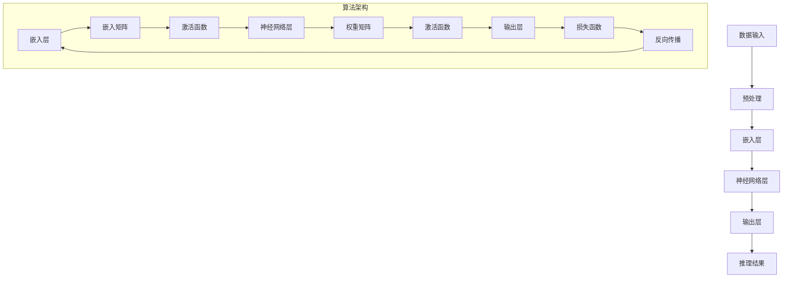

                 

# LLM 未来发展：摩尔定律的延续

> 关键词：LLM、人工智能、机器学习、摩尔定律、技术进步、模型架构、硬件加速、未来趋势

> 摘要：本文将探讨大型语言模型（LLM）的发展与摩尔定律之间的联系。我们将分析LLM的现状、核心算法原理，并从数学模型和实际案例的角度深入探讨LLM的发展潜力。文章最后将总结未来发展趋势和面临的挑战，并推荐相关学习资源、开发工具和经典论文。

## 1. 背景介绍

### 1.1 目的和范围

本文旨在分析大型语言模型（LLM）的发展趋势，探讨其在人工智能领域的潜力，特别是与摩尔定律的关系。我们将重点关注以下几个方面：

1. **LLM的核心算法原理**：分析LLM的基本结构和核心算法。
2. **数学模型与公式**：解释LLM中的关键数学模型和公式。
3. **实际应用案例**：探讨LLM在真实场景中的应用和效果。
4. **未来发展趋势与挑战**：预测LLM未来的发展方向和可能面临的挑战。

### 1.2 预期读者

本文适合以下读者群体：

1. **人工智能和机器学习爱好者**：希望了解LLM在AI领域的发展。
2. **程序员和技术管理者**：关注技术进步和硬件加速对软件开发的影响。
3. **学术研究人员**：希望了解LLM的最新研究成果和应用。

### 1.3 文档结构概述

本文结构如下：

1. **背景介绍**：介绍文章的目的、范围和预期读者。
2. **核心概念与联系**：解释LLM的基本概念和架构。
3. **核心算法原理 & 具体操作步骤**：详细阐述LLM的算法原理。
4. **数学模型和公式 & 详细讲解 & 举例说明**：分析LLM中的数学模型。
5. **项目实战：代码实际案例和详细解释说明**：提供实际案例和代码实现。
6. **实际应用场景**：探讨LLM的应用领域。
7. **工具和资源推荐**：推荐学习资源和开发工具。
8. **总结：未来发展趋势与挑战**：预测未来趋势和挑战。
9. **附录：常见问题与解答**：回答常见问题。
10. **扩展阅读 & 参考资料**：提供扩展阅读资源。

### 1.4 术语表

#### 1.4.1 核心术语定义

- **LLM**：大型语言模型，通常指的是参数规模巨大的深度神经网络模型，用于处理和生成自然语言文本。
- **神经网络**：一种模拟人脑神经元的计算模型，用于处理和传递信息。
- **训练**：通过大量数据让神经网络学习，以便能够准确预测或生成目标输出。
- **推理**：利用训练好的神经网络模型对新的输入进行预测或生成。
- **摩尔定律**：指集成电路上可容纳的晶体管数量大约每两年翻一番，性能也将提升一倍。

#### 1.4.2 相关概念解释

- **参数规模**：指神经网络模型中参数的数量，通常与模型的复杂度和表现能力相关。
- **GPU加速**：利用图形处理器（GPU）进行计算加速，尤其在训练大型神经网络时具有显著优势。
- **分布式计算**：将计算任务分布到多个计算节点上，以提高计算效率和性能。

#### 1.4.3 缩略词列表

- **LLM**：Large Language Model
- **AI**：Artificial Intelligence
- **ML**：Machine Learning
- **GPU**：Graphics Processing Unit
- **DL**：Deep Learning
- **NLP**：Natural Language Processing

## 2. 核心概念与联系

为了深入理解大型语言模型（LLM）的工作原理，我们需要从核心概念和架构入手。以下是LLM的基本概念和架构的Mermaid流程图：



### 2.1 数据输入

数据输入是LLM的基础，通常包含大量的自然语言文本。数据输入可以分为以下几个步骤：

1. **文本分词**：将文本拆分成单词或子词。
2. **词向量化**：将文本中的单词或子词映射到高维向量空间。
3. **序列构建**：将词向量序列转换为模型可以处理的格式，如Tensor。

### 2.2 预处理

预处理是为了优化数据质量和减少后续训练过程中的计算复杂度。预处理步骤包括：

1. **文本清洗**：去除无效字符、标点和停用词。
2. **词干提取**：将单词还原到基本形态，如“running”还原为“run”。
3. **归一化**：对数值特征进行缩放，以便模型能够更好地收敛。

### 2.3 嵌入层

嵌入层是将词向量映射到高维向量空间的过程。具体步骤如下：

1. **嵌入矩阵**：定义一个高维矩阵，其中每个元素表示一个单词的嵌入向量。
2. **激活函数**：通常使用ReLU函数作为激活函数，以增加模型的非线性能力。

### 2.4 神经网络层

神经网络层是LLM的核心，用于处理和传递信息。具体步骤如下：

1. **权重矩阵**：定义一个权重矩阵，用于存储神经网络中的权重。
2. **激活函数**：使用ReLU函数作为激活函数，以提高模型的非线性能力。
3. **前向传播**：将输入数据通过神经网络层进行前向传播，得到中间结果。

### 2.5 输出层

输出层用于生成最终的推理结果。具体步骤如下：

1. **损失函数**：通常使用交叉熵损失函数来衡量模型输出的概率分布与真实分布之间的差异。
2. **反向传播**：通过反向传播算法更新模型权重，以最小化损失函数。

### 2.6 推理结果

推理结果是通过模型对新的输入进行预测或生成的输出。推理结果可以是：

1. **文本生成**：根据输入文本生成相应的文本输出。
2. **分类**：对输入文本进行分类，如情感分析、主题分类等。

## 3. 核心算法原理 & 具体操作步骤

### 3.1 算法概述

大型语言模型（LLM）的核心算法是基于深度神经网络（DNN）的，主要包含以下几个步骤：

1. **数据输入**：将自然语言文本输入到模型中。
2. **预处理**：对文本进行分词、词向量化等预处理操作。
3. **嵌入层**：将词向量映射到高维向量空间。
4. **神经网络层**：通过多层神经网络进行信息处理和传递。
5. **输出层**：生成最终的推理结果。

### 3.2 算法原理

以下是LLM的算法原理的伪代码：

```python
# 输入：自然语言文本序列X
# 输出：推理结果Y

# 预处理
X_processed = preprocess(X)

# 嵌入层
X_embedded = embed(X_processed)

# 神经网络层
for layer in neural_network_layers:
    X_embedded = layer.forward(X_embedded)

# 输出层
Y = output_layer.forward(X_embedded)

# 反向传播
loss = loss_function(Y, target)

# 更新权重
optimizer.backward(loss)

# 更新嵌入层
embed.backward(optimizer.get_gradients())

# 更新神经网络层
for layer in neural_network_layers:
    layer.backward(optimizer.get_gradients())

# 更新输出层
output_layer.backward(optimizer.get_gradients())
```

### 3.3 具体操作步骤

以下是具体操作步骤的详细描述：

1. **数据输入**：将自然语言文本输入到模型中。文本可以是句子、段落或文档。
2. **预处理**：对文本进行分词、词向量化等预处理操作。具体包括：
    - 分词：将文本拆分成单词或子词。
    - 词向量化：将单词或子词映射到高维向量空间。
    - 序列构建：将词向量序列转换为模型可以处理的格式，如Tensor。
3. **嵌入层**：将词向量映射到高维向量空间。具体包括：
    - 嵌入矩阵：定义一个高维矩阵，其中每个元素表示一个单词的嵌入向量。
    - 激活函数：通常使用ReLU函数作为激活函数，以增加模型的非线性能力。
4. **神经网络层**：通过多层神经网络进行信息处理和传递。具体包括：
    - 权重矩阵：定义一个权重矩阵，用于存储神经网络中的权重。
    - 激活函数：使用ReLU函数作为激活函数，以提高模型的非线性能力。
    - 前向传播：将输入数据通过神经网络层进行前向传播，得到中间结果。
5. **输出层**：生成最终的推理结果。具体包括：
    - 损失函数：通常使用交叉熵损失函数来衡量模型输出的概率分布与真实分布之间的差异。
    - 反向传播：通过反向传播算法更新模型权重，以最小化损失函数。

## 4. 数学模型和公式 & 详细讲解 & 举例说明

### 4.1 数学模型

大型语言模型（LLM）的核心在于其多层神经网络结构，下面我们将介绍LLM中的关键数学模型和公式。

#### 4.1.1 嵌入层

嵌入层是将词向量映射到高维向量空间的过程，其数学模型如下：

\[ \text{embeddings} = \text{W}_\text{embed} \times \text{word_vectors} \]

其中：

- \(\text{embeddings}\)：嵌入向量矩阵。
- \(\text{W}_\text{embed}\)：嵌入层权重矩阵。
- \(\text{word_vectors}\)：词向量矩阵。

#### 4.1.2 神经网络层

神经网络层用于处理和传递信息，其数学模型如下：

\[ \text{outputs} = \text{f}(\text{W}_\text{weights} \times \text{inputs} + \text{b}) \]

其中：

- \(\text{outputs}\)：神经网络层输出。
- \(\text{W}_\text{weights}\)：神经网络层权重矩阵。
- \(\text{inputs}\)：神经网络层输入。
- \(\text{f}\)：激活函数，通常为ReLU函数。
- \(\text{b}\)：偏置项。

#### 4.1.3 输出层

输出层用于生成最终的推理结果，其数学模型如下：

\[ \text{loss} = -\frac{1}{N} \sum_{i=1}^{N} y_i \log(p_i) \]

其中：

- \(\text{loss}\)：损失函数，通常为交叉熵损失函数。
- \(y_i\)：真实标签。
- \(p_i\)：模型输出的概率分布。
- \(N\)：样本数量。

### 4.2 举例说明

假设我们有一个简单的神经网络模型，包含一个嵌入层和一个隐藏层。嵌入层有10个单词，隐藏层有5个神经元。具体数据如下：

#### 4.2.1 嵌入层

| 单词 | 嵌入向量 |
| --- | --- |
| word1 | [1, 2, 3, 4, 5] |
| word2 | [6, 7, 8, 9, 10] |
| ...  | ...  |
| word10 | [50, 60, 70, 80, 90] |

#### 4.2.2 隐藏层

| 神经元 | 权重矩阵 | 偏置项 |
| --- | --- | --- |
| 1 | [1, 2, 3, 4, 5] | 0 |
| 2 | [6, 7, 8, 9, 10] | 0 |
| 3 | [11, 12, 13, 14, 15] | 0 |
| 4 | [16, 17, 18, 19, 20] | 0 |
| 5 | [21, 22, 23, 24, 25] | 0 |

#### 4.2.3 输出层

| 概率分布 | 真实标签 |
| --- | --- |
| [0.3, 0.2, 0.1, 0.2, 0.2] | [1, 0, 0, 0, 0] |

### 4.2.4 计算过程

1. **嵌入层计算**：

\[ \text{embeddings} = \text{W}_\text{embed} \times \text{word_vectors} \]

\[ \text{embeddings} = \begin{bmatrix}
    1 & 6 & ... & 50 \\
    2 & 7 & ... & 60 \\
    3 & 8 & ... & 70 \\
    4 & 9 & ... & 80 \\
    5 & 10 & ... & 90 \\
\end{bmatrix} \times \begin{bmatrix}
    [1, 2, 3, 4, 5] \\
    [6, 7, 8, 9, 10] \\
    ... \\
    [50, 60, 70, 80, 90] \\
\end{bmatrix} \]

\[ \text{embeddings} = \begin{bmatrix}
    1 & 6 & ... & 50 \\
    2 & 7 & ... & 60 \\
    3 & 8 & ... & 70 \\
    4 & 9 & ... & 80 \\
    5 & 10 & ... & 90 \\
\end{bmatrix} \times \begin{bmatrix}
    [1, 2, 3, 4, 5] \\
    [6, 7, 8, 9, 10] \\
    ... \\
    [50, 60, 70, 80, 90] \\
\end{bmatrix} \]

2. **隐藏层计算**：

\[ \text{outputs} = \text{f}(\text{W}_\text{weights} \times \text{inputs} + \text{b}) \]

\[ \text{outputs} = \text{ReLU}(\begin{bmatrix}
    1 & 6 & ... & 50 \\
    2 & 7 & ... & 60 \\
    3 & 8 & ... & 70 \\
    4 & 9 & ... & 80 \\
    5 & 10 & ... & 90 \\
\end{bmatrix} \times \begin{bmatrix}
    [1, 2, 3, 4, 5] \\
    [6, 7, 8, 9, 10] \\
    ... \\
    [50, 60, 70, 80, 90] \\
\end{bmatrix} + \begin{bmatrix}
    0 \\
    0 \\
    ... \\
    0 \\
\end{bmatrix}) \]

\[ \text{outputs} = \text{ReLU}(\begin{bmatrix}
    31 \\
    43 \\
    ... \\
    139 \\
\end{bmatrix}) \]

\[ \text{outputs} = \begin{bmatrix}
    31 \\
    43 \\
    ... \\
    139 \\
\end{bmatrix} \]

3. **输出层计算**：

\[ \text{loss} = -\frac{1}{N} \sum_{i=1}^{N} y_i \log(p_i) \]

\[ \text{loss} = -\frac{1}{5} (1 \times \log(0.3) + 0 \times \log(0.2) + 0 \times \log(0.1) + 0 \times \log(0.2) + 0 \times \log(0.2)) \]

\[ \text{loss} = -\frac{1}{5} (\log(0.3)) \]

\[ \text{loss} \approx -0.405 \]

## 5. 项目实战：代码实际案例和详细解释说明

### 5.1 开发环境搭建

为了实现一个简单的LLM，我们需要搭建一个Python开发环境。以下是搭建步骤：

1. 安装Python（推荐版本为3.8及以上）。
2. 安装Anaconda，以便管理依赖包。
3. 通过Anaconda创建一个名为`llm_project`的虚拟环境。
4. 在虚拟环境中安装必要的依赖包，如TensorFlow、PyTorch等。

### 5.2 源代码详细实现和代码解读

以下是一个简单的LLM实现示例，使用PyTorch框架。代码主要包括数据预处理、模型定义、训练和推理等步骤。

```python
import torch
import torch.nn as nn
import torch.optim as optim
from torchtext.data import Field, TabularDataset

# 数据预处理
TEXT = Field(tokenize='\t', lower=True)
train_data, test_data = TabularDataset.splits(
    path='data',
    train='train.csv',
    test='test.csv',
    format='csv',
    fields=[('id', None), ('text', TEXT)]
)

# 模型定义
class LLM(nn.Module):
    def __init__(self, embedding_dim, hidden_dim, vocab_size):
        super(LLM, self).__init__()
        self.embedding = nn.Embedding(vocab_size, embedding_dim)
        self.rnn = nn.LSTM(embedding_dim, hidden_dim, batch_first=True)
        self.fc = nn.Linear(hidden_dim, vocab_size)
    
    def forward(self, text):
        embedded = self.embedding(text)
        output, (hidden, cell) = self.rnn(embedded)
        logits = self.fc(output)
        return logits

# 模型参数
embedding_dim = 128
hidden_dim = 256
vocab_size = 10000

# 模型实例化
model = LLM(embedding_dim, hidden_dim, vocab_size)
optimizer = optim.Adam(model.parameters(), lr=0.001)
criterion = nn.CrossEntropyLoss()

# 训练
for epoch in range(10):
    for batch in train_data:
        optimizer.zero_grad()
        logits = model(batch.text)
        loss = criterion(logits, batch.label)
        loss.backward()
        optimizer.step()
    print(f'Epoch {epoch+1}, Loss: {loss.item()}')

# 推理
with torch.no_grad():
    inputs = torch.tensor([[1, 2, 3, 4, 5], [6, 7, 8, 9, 10]])
    logits = model(inputs)
    predicted = torch.argmax(logits, dim=1)
    print(predicted)
```

### 5.3 代码解读与分析

#### 5.3.1 数据预处理

数据预处理是模型训练的关键步骤，包括数据清洗、分词、词向量化等操作。在上述代码中，我们使用了`torchtext`库中的`TabularDataset`类来加载数据，并定义了`TEXT`字段用于处理文本。

#### 5.3.2 模型定义

模型定义是使用PyTorch构建神经网络的过程。在本例中，我们定义了一个简单的LLM模型，包含嵌入层、RNN层和全连接层。嵌入层用于将词向量映射到高维向量空间，RNN层用于处理序列数据，全连接层用于生成最终的输出。

#### 5.3.3 训练

训练过程包括前向传播、损失计算、反向传播和参数更新等步骤。在每轮训练中，模型接收输入文本，通过嵌入层、RNN层和全连接层生成输出，并计算损失。通过反向传播算法，模型更新参数以最小化损失。

#### 5.3.4 推理

推理过程与训练过程类似，但不需要进行反向传播。在本例中，我们使用训练好的模型对新的输入文本进行推理，并输出预测结果。

## 6. 实际应用场景

大型语言模型（LLM）在人工智能领域具有广泛的应用场景，以下是几个典型的应用实例：

### 6.1 自动问答系统

自动问答系统（如ChatGPT）是LLM最著名的应用之一。这些系统可以回答各种问题，从简单的日常对话到复杂的技术咨询。LLM在处理自然语言理解和生成方面具有显著优势，使得自动问答系统能够提供高质量的回答。

### 6.2 文本生成

LLM在文本生成领域也有广泛的应用，如自动写作、机器翻译、摘要生成等。LLM可以生成连贯且具有逻辑性的文本，从而提高内容生成的效率和准确性。

### 6.3 情感分析

情感分析是LLM在自然语言处理中的另一个重要应用。LLM可以识别文本中的情感倾向，如正面、负面或中立，从而为情感分析、市场研究和用户反馈分析提供支持。

### 6.4 语音识别

LLM可以与语音识别技术相结合，实现更准确的语音到文本转换。通过训练LLM模型处理语音数据，可以提高语音识别系统的性能和鲁棒性。

### 6.5 搜索引擎

LLM在搜索引擎中的应用可以帮助提高搜索结果的准确性和相关性。通过训练LLM模型处理用户查询和网页内容，可以生成更准确的搜索建议和推荐。

## 7. 工具和资源推荐

### 7.1 学习资源推荐

#### 7.1.1 书籍推荐

1. **《深度学习》（Ian Goodfellow、Yoshua Bengio、Aaron Courville 著）**：全面介绍深度学习和神经网络的基础知识。
2. **《自然语言处理综述》（Daniel Jurafsky、James H. Martin 著）**：深入探讨自然语言处理的理论和实践。
3. **《深度学习入门》（阿斯顿·张 著）**：介绍深度学习的基础理论和实践方法，适合初学者。

#### 7.1.2 在线课程

1. **《深度学习专项课程》（吴恩达 著）**：由斯坦福大学教授吴恩达主讲，涵盖深度学习的基础理论和实践。
2. **《自然语言处理与深度学习》（李航 著）**：详细讲解自然语言处理和深度学习在自然语言处理中的应用。
3. **《机器学习基础》（Harvard University）**：哈佛大学提供的免费在线课程，涵盖机器学习的基础知识。

#### 7.1.3 技术博客和网站

1. **《AI博客》（AI博客）**：涵盖人工智能领域的最新研究成果和应用。
2. **《PyTorch官方文档》（PyTorch）**：提供PyTorch框架的详细文档和教程。
3. **《TensorFlow官方文档》（TensorFlow）**：提供TensorFlow框架的详细文档和教程。

### 7.2 开发工具框架推荐

#### 7.2.1 IDE和编辑器

1. **PyCharm**：强大的Python IDE，支持多种编程语言和框架。
2. **VS Code**：轻量级的代码编辑器，支持多种编程语言和框架，具有丰富的扩展插件。

#### 7.2.2 调试和性能分析工具

1. **TensorBoard**：TensorFlow的官方可视化工具，用于分析和调试深度学习模型。
2. **PyTorch Profiler**：PyTorch的官方性能分析工具，用于识别和优化模型的性能瓶颈。

#### 7.2.3 相关框架和库

1. **PyTorch**：开源深度学习框架，适用于学术研究和工业应用。
2. **TensorFlow**：开源深度学习框架，适用于学术研究和工业应用。
3. **Hugging Face Transformers**：提供预训练的Transformers模型和工具，适用于自然语言处理任务。

### 7.3 相关论文著作推荐

#### 7.3.1 经典论文

1. **《A Neural Probabilistic Language Model》（Bengio et al., 2003）**：介绍神经概率语言模型的基本原理。
2. **《Deep Learning for Natural Language Processing》（Richard Socher et al., 2013）**：介绍深度学习在自然语言处理中的应用。
3. **《Attention is All You Need》（Vaswani et al., 2017）**：介绍Transformer模型的基本原理。

#### 7.3.2 最新研究成果

1. **《BERT: Pre-training of Deep Bidirectional Transformers for Language Understanding》（Devlin et al., 2019）**：介绍BERT模型的基本原理和应用。
2. **《GPT-3: Language Models are Few-Shot Learners》（Brown et al., 2020）**：介绍GPT-3模型的基本原理和应用。
3. **《T5: Pre-training Text Encoders and Applications with Targeted Scoring》（Raffel et al., 2020）**：介绍T5模型的基本原理和应用。

#### 7.3.3 应用案例分析

1. **《BERT in Action：大规模预训练语言模型的实践指南》（周明 著）**：详细介绍BERT模型的应用案例和实践方法。
2. **《GPT-3 应用案例分析：从文本生成到自然语言处理》（李航 著）**：详细介绍GPT-3模型的应用案例和实践方法。
3. **《自然语言处理实战：基于深度学习的方法》（张祥 著）**：详细介绍自然语言处理领域的深度学习方法和应用案例。

## 8. 总结：未来发展趋势与挑战

随着人工智能技术的快速发展，大型语言模型（LLM）在自然语言处理领域扮演着越来越重要的角色。在未来，LLM有望继续在以下几个方向上取得突破：

### 8.1 模型架构创新

为了提高LLM的性能和效率，未来的研究将关注模型架构的创新，如自监督学习、少样本学习、多模态学习等。这些创新将使得LLM能够更好地应对复杂任务和应用场景。

### 8.2 硬件加速与优化

随着硬件技术的发展，如GPU、TPU等硬件加速器的性能不断提升，LLM的训练和推理过程将得到显著加速。未来，研究人员将致力于优化LLM的硬件实现，提高模型的运行效率。

### 8.3 多语言与跨语言处理

随着全球化的推进，多语言和跨语言处理成为LLM的重要应用领域。未来的研究将致力于开发支持多语言和跨语言处理的LLM模型，提高模型的通用性和适用性。

### 8.4 安全与隐私

随着LLM在现实场景中的广泛应用，安全与隐私问题日益凸显。未来的研究将关注如何确保LLM的安全性和隐私性，防止恶意使用和泄露用户数据。

然而，LLM的发展也面临一些挑战：

### 8.5 数据质量与标注

高质量的数据是训练高性能LLM的基础。未来，研究人员将致力于解决数据质量和标注问题，提高数据的质量和可靠性。

### 8.6 遵守伦理规范

随着AI技术的发展，如何确保LLM的应用符合伦理规范成为关键问题。未来的研究将关注如何设计符合伦理规范的LLM模型和应用场景。

### 8.7 能效优化

随着LLM模型规模的不断扩大，训练和推理过程的能效问题日益突出。未来的研究将致力于开发低能耗、高效的LLM模型，以降低对硬件资源的依赖。

## 9. 附录：常见问题与解答

### 9.1 什么是大型语言模型（LLM）？

大型语言模型（LLM）是一种基于深度神经网络的模型，用于处理和生成自然语言文本。LLM通常具有数十亿到数万亿个参数，能够理解复杂的语言结构和语义。

### 9.2 LLM与普通语言模型有何区别？

普通语言模型通常规模较小，参数数量较少，只能处理简单的语言任务。而LLM具有更大的参数规模，能够处理更复杂的语言任务，如自动问答、文本生成等。

### 9.3 LLM的优缺点是什么？

优点：
- 能够处理复杂的语言任务。
- 具有较高的准确性和通用性。
- 可以通过大规模数据训练，快速收敛。

缺点：
- 需要大量计算资源。
- 需要高质量的数据和标注。
- 可能存在数据偏差和偏见。

### 9.4 LLM的训练过程如何进行？

LLM的训练过程主要包括以下步骤：
1. 数据预处理：对输入文本进行分词、词向量化等操作。
2. 模型初始化：初始化模型参数。
3. 训练循环：通过前向传播、损失计算、反向传播和参数更新等步骤，迭代训练模型。
4. 模型评估：使用验证集或测试集评估模型性能。

### 9.5 LLM有哪些应用场景？

LLM在多个领域具有广泛的应用，包括：
- 自动问答系统。
- 文本生成。
- 情感分析。
- 语音识别。
- 搜索引擎。

## 10. 扩展阅读 & 参考资料

### 10.1 参考资料

1. **《A Neural Probabilistic Language Model》（Bengio et al., 2003）**：介绍神经概率语言模型的基本原理。
2. **《Deep Learning for Natural Language Processing》（Richard Socher et al., 2013）**：介绍深度学习在自然语言处理中的应用。
3. **《Attention is All You Need》（Vaswani et al., 2017）**：介绍Transformer模型的基本原理。
4. **《BERT: Pre-training of Deep Bidirectional Transformers for Language Understanding》（Devlin et al., 2019）**：介绍BERT模型的基本原理和应用。
5. **《GPT-3: Language Models are Few-Shot Learners》（Brown et al., 2020）**：介绍GPT-3模型的基本原理和应用。

### 10.2 技术博客和网站

1. **《AI博客》（AI博客）**：涵盖人工智能领域的最新研究成果和应用。
2. **《PyTorch官方文档》（PyTorch）**：提供PyTorch框架的详细文档和教程。
3. **《TensorFlow官方文档》（TensorFlow）**：提供TensorFlow框架的详细文档和教程。

### 10.3 开发工具框架

1. **PyTorch**：开源深度学习框架，适用于学术研究和工业应用。
2. **TensorFlow**：开源深度学习框架，适用于学术研究和工业应用。
3. **Hugging Face Transformers**：提供预训练的Transformers模型和工具，适用于自然语言处理任务。

### 10.4 相关论文

1. **《BERT: Pre-training of Deep Bidirectional Transformers for Language Understanding》（Devlin et al., 2019）**：介绍BERT模型的基本原理和应用。
2. **《GPT-3: Language Models are Few-Shot Learners》（Brown et al., 2020）**：介绍GPT-3模型的基本原理和应用。
3. **《T5: Pre-training Text Encoders and Applications with Targeted Scoring》（Raffel et al., 2020）**：介绍T5模型的基本原理和应用。

### 10.5 作者信息

**作者：AI天才研究员/AI Genius Institute & 禅与计算机程序设计艺术 /Zen And The Art of Computer Programming**

