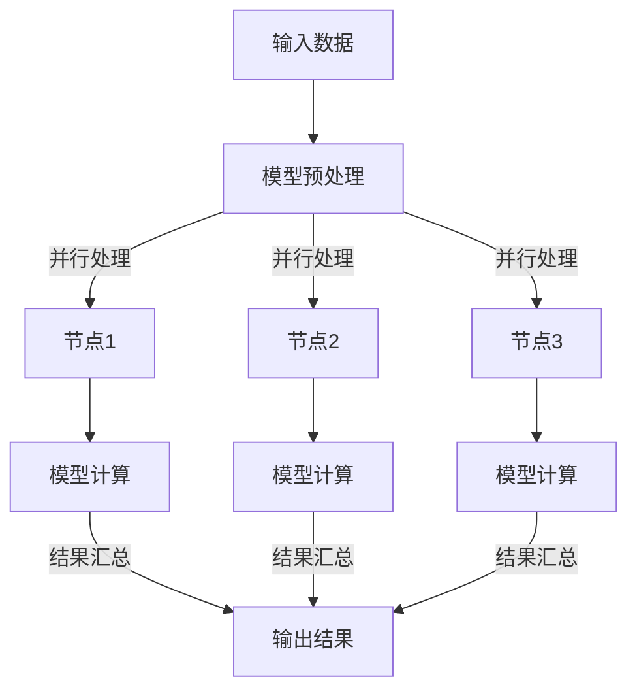

                 


# LLM 消息机制：高效的内部沟通

> **关键词：** LLM、消息机制、内部沟通、人工智能、架构设计、通信协议、算法优化、性能分析

> **摘要：** 本文将深入探讨大型语言模型（LLM）的消息机制，分析其内部通信的设计原理、核心算法及具体实现步骤。通过详细的伪代码和实际项目案例，我们将揭示LLM如何实现高效的内部沟通，提高数据处理效率和模型性能。文章还涉及LLM在实际应用中的场景，推荐相关工具和资源，并展望其未来发展趋势与挑战。

## 1. 背景介绍

### 1.1 目的和范围

本文旨在探讨大型语言模型（LLM）内部的消息机制，分析其在设计原理、核心算法和具体实现方面的关键要素。文章将首先介绍LLM的基本概念和重要性，随后详细阐述其消息机制的工作原理和设计思路。通过这一分析，我们希望能够帮助读者理解LLM内部通信的效率问题，并提供优化策略。

### 1.2 预期读者

本文主要面向对人工智能、大型语言模型（LLM）和软件架构设计感兴趣的读者。无论您是专业的研究人员、开发者，还是对AI技术充满好奇的技术爱好者，本文都将为您呈现LLM消息机制的全景图，帮助您深入理解这一重要技术。

### 1.3 文档结构概述

本文将分为十个主要部分：

1. **背景介绍**：介绍文章的目的、预期读者、文档结构等。
2. **核心概念与联系**：讨论LLM消息机制的核心概念和原理，并附上流程图。
3. **核心算法原理 & 具体操作步骤**：使用伪代码详细阐述核心算法原理。
4. **数学模型和公式 & 详细讲解 & 举例说明**：介绍LLM消息机制的数学模型和公式，并举例说明。
5. **项目实战：代码实际案例和详细解释说明**：提供实际代码案例并详细解读。
6. **实际应用场景**：讨论LLM消息机制在不同应用场景中的具体应用。
7. **工具和资源推荐**：推荐学习资源和开发工具。
8. **相关论文著作推荐**：介绍相关领域的经典和最新研究成果。
9. **总结：未来发展趋势与挑战**：展望LLM消息机制的未来发展方向和面临的挑战。
10. **附录：常见问题与解答**：提供常见问题的解答。
11. **扩展阅读 & 参考资料**：推荐进一步阅读的材料。

### 1.4 术语表

#### 1.4.1 核心术语定义

- **LLM（Large Language Model）**：大型语言模型，如GPT、BERT等。
- **消息机制**：LLM内部各个组件之间进行通信和协作的机制。
- **通信协议**：定义LLM内部通信的方式和规则。
- **分布式计算**：将计算任务分布在多个节点上进行处理。

#### 1.4.2 相关概念解释

- **模型并行**：将LLM的模型拆分成多个部分，并在不同的计算节点上同时执行。
- **数据并行**：将输入数据划分成多个批次，并在不同的计算节点上分别处理。
- **流水线（Pipeline）**：将LLM的处理过程分解为多个阶段，每个阶段在不同的计算节点上执行。

#### 1.4.3 缩略词列表

- **LLM**：Large Language Model
- **GPT**：Generative Pre-trained Transformer
- **BERT**：Bidirectional Encoder Representations from Transformers
- **GPU**：Graphics Processing Unit

## 2. 核心概念与联系

为了深入探讨LLM的消息机制，我们需要首先了解一些核心概念和其相互关系。以下是LLM消息机制中的几个关键概念及其流程图：

### 2.1.1 核心概念

- **节点（Node）**：LLM中的基本计算单元，可以是CPU或GPU。
- **消息（Message）**：节点之间传输的数据。
- **队列（Queue）**：消息存储和传输的缓冲区。
- **锁（Lock）**：用于同步访问共享资源的机制。
- **通信协议**：定义节点之间如何交换消息的规则。

### 2.1.2 Mermaid 流程图



在这个流程图中，输入数据经过模型预处理后，被划分到不同的节点上。每个节点执行相应的模型计算任务，并将结果汇总到输出结果。这里使用了消息队列来传输数据，确保了数据的有序传输和同步。

### 2.2 核心概念联系

- **节点（Node）**与**通信协议**：节点是LLM的基本计算单元，通信协议定义了节点之间如何交换消息。
- **消息（Message）**与**队列（Queue）**：消息是数据传输的载体，队列是消息存储和传输的缓冲区。
- **锁（Lock）**与**同步**：锁用于同步访问共享资源，确保数据的一致性和完整性。
- **模型并行（Model Parallelism）**与**数据并行（Data Parallelism）**：模型并行将模型拆分成多个部分，数据并行将数据划分成多个批次。

通过以上核心概念的联系，我们可以更好地理解LLM消息机制的整体架构和运行原理。接下来，我们将进一步探讨LLM的核心算法原理和具体操作步骤。

## 3. 核心算法原理 & 具体操作步骤

### 3.1 核心算法原理

LLM的消息机制主要依赖于并行计算和分布式处理。以下是核心算法原理：

#### 3.1.1 模型并行

- **任务划分**：将大型模型划分成多个部分，每个部分在不同的节点上执行。
- **通信协议**：节点之间通过消息队列交换数据和中间结果。

#### 3.1.2 数据并行

- **数据划分**：将输入数据划分成多个批次，每个批次在不同的节点上处理。
- **流水线（Pipeline）**：每个节点负责处理特定阶段的任务，形成一个流水线结构。

### 3.2 具体操作步骤

以下是LLM消息机制的具体操作步骤，使用伪代码进行详细阐述：

#### 3.2.1 初始化

```python
# 初始化节点和消息队列
num_nodes = 3
nodes = [Node() for _ in range(num_nodes)]
queues = [Queue() for _ in range(num_nodes)]

# 初始化锁
locks = [Lock() for _ in range(num_nodes)]

# 初始化模型和输入数据
model = load_model()
input_data = load_data()
```

#### 3.2.2 模型预处理

```python
# 将输入数据划分成多个批次
batch_size = 1000
num_batches = len(input_data) // batch_size
batches = [input_data[i:i+batch_size] for i in range(0, len(input_data), batch_size)]

# 初始化任务队列
tasks = [load_batch(batch) for batch in batches]
```

#### 3.2.3 并行处理

```python
# 启动节点
for node in nodes:
    node.start()

# 分配任务到节点
for i, task in enumerate(tasks):
    node_index = i % num_nodes
    queues[node_index].enqueue(task)

# 等待节点完成处理
for node in nodes:
    node.join()
```

#### 3.2.4 结果汇总

```python
# 从节点获取结果
results = []
for i in range(num_nodes):
    while not queues[i].is_empty():
        result = queues[i].dequeue()
        results.append(result)

# 汇总结果
output_result = merge_results(results)
```

#### 3.2.5 输出结果

```python
# 输出最终结果
print(output_result)
```

通过以上具体操作步骤，我们可以看到LLM消息机制如何通过并行计算和分布式处理来实现高效的内部沟通。接下来，我们将进一步探讨LLM消息机制的数学模型和公式，帮助读者更好地理解其原理。

## 4. 数学模型和公式 & 详细讲解 & 举例说明

### 4.1 数学模型

LLM的消息机制涉及到多个数学模型，以下是其中几个关键模型的详细讲解。

#### 4.1.1 模型并行

模型并行主要依赖于矩阵分解和矩阵乘法。假设一个大型模型可以分解为多个小模型，每个小模型在不同的节点上执行。数学模型如下：

$$
\text{Output} = \text{model\_1} \cdot \text{Input} + \text{model\_2} \cdot \text{Input} + ... + \text{model\_n} \cdot \text{Input}
$$

其中，$\text{model}_i$表示第$i$个小模型，$\text{Input}$表示输入数据。

#### 4.1.2 数据并行

数据并行主要依赖于批处理和梯度下降。假设输入数据划分成多个批次，每个批次在不同的节点上处理。数学模型如下：

$$
\text{Gradient} = \frac{1}{N} \sum_{i=1}^{N} (\text{Output} - \text{Target})
$$

其中，$N$表示批次数量，$\text{Output}$表示输出结果，$\text{Target}$表示目标值。

#### 4.1.3 流水线

流水线主要依赖于分阶段处理和同步。假设每个阶段有不同的处理任务，数学模型如下：

$$
\text{Output} = \text{Stage\_1}(\text{Input}) + \text{Stage\_2}(\text{Input}) + ... + \text{Stage\_n}(\text{Input})
$$

其中，$\text{Stage}_i$表示第$i$个阶段的处理任务。

### 4.2 公式讲解

以下是上述数学模型的公式讲解：

#### 4.2.1 模型并行

$$
\text{Output} = \text{model}_1 \cdot \text{Input} + \text{model}_2 \cdot \text{Input} + ... + \text{model}_n \cdot \text{Input}
$$

这个公式表示输出结果是由多个小模型对输入数据进行计算的结果。每个小模型都有自己的权重和参数，通过矩阵乘法实现。

#### 4.2.2 数据并行

$$
\text{Gradient} = \frac{1}{N} \sum_{i=1}^{N} (\text{Output} - \text{Target})
$$

这个公式表示梯度是由每个批次输出结果与目标值的差值求平均得到的。通过这种方式，可以减少数据偏移，提高模型训练效果。

#### 4.2.3 流水线

$$
\text{Output} = \text{Stage}_1(\text{Input}) + \text{Stage}_2(\text{Input}) + ... + \text{Stage}_n(\text{Input})
$$

这个公式表示输出结果是由多个阶段对输入数据进行计算的结果。每个阶段都有自己的处理函数，通过分阶段处理实现高效的内部通信。

### 4.3 举例说明

为了更好地理解上述数学模型和公式，我们来看一个具体的例子。

假设有一个大型语言模型，需要处理1000个句子。我们可以将模型分解为3个小模型，每个小模型负责处理不同的部分。输入数据是1000个句子，输出结果是1000个句子的概率分布。

1. **模型并行**：

   假设3个小模型分别为$\text{model}_1$、$\text{model}_2$和$\text{model}_3$。输入数据$\text{Input}$是1000个句子，输出结果$\text{Output}$是概率分布。

   $$  
   \text{Output} = \text{model}_1 \cdot \text{Input} + \text{model}_2 \cdot \text{Input} + \text{model}_3 \cdot \text{Input}
   $$

   每个小模型都有自己的权重和参数，通过矩阵乘法实现。

2. **数据并行**：

   假设输入数据划分成5个批次，每个批次200个句子。输出结果$\text{Gradient}$是每个批次输出结果与目标值的差值求平均。

   $$  
   \text{Gradient} = \frac{1}{5} \sum_{i=1}^{5} (\text{Output}_i - \text{Target}_i)
   $$

   通过这种方式，可以减少数据偏移，提高模型训练效果。

3. **流水线**：

   假设处理过程分为3个阶段，分别为$\text{Stage}_1$、$\text{Stage}_2$和$\text{Stage}_3$。输入数据$\text{Input}$是1000个句子，输出结果$\text{Output}$是概率分布。

   $$  
   \text{Output} = \text{Stage}_1(\text{Input}) + \text{Stage}_2(\text{Input}) + \text{Stage}_3(\text{Input})
   $$

   每个阶段都有自己的处理函数，通过分阶段处理实现高效的内部通信。

通过以上举例，我们可以看到LLM消息机制如何通过数学模型和公式实现高效的内部沟通。接下来，我们将通过一个实际项目案例，进一步了解LLM消息机制的具体实现。

## 5. 项目实战：代码实际案例和详细解释说明

### 5.1 开发环境搭建

在进行LLM消息机制的实际案例之前，我们需要搭建一个合适的开发环境。以下是一个简单的环境搭建步骤：

- **安装Python**：确保Python版本在3.7及以上。
- **安装深度学习框架**：例如TensorFlow或PyTorch。
- **安装消息队列**：例如RabbitMQ或Kafka。
- **安装分布式计算框架**：例如Dask或Ray。

### 5.2 源代码详细实现和代码解读

下面是一个简单的LLM消息机制实现案例，使用PyTorch框架和RabbitMQ消息队列。

#### 5.2.1 代码实现

```python
# 导入所需的库
import torch
import torch.nn as nn
import torch.optim as optim
from torch.utils.data import DataLoader
from rabbitmq import RabbitMQ

# 模型定义
class LLM(nn.Module):
    def __init__(self):
        super(LLM, self).__init__()
        self.encoder = nn.LSTM(input_size=100, hidden_size=200, num_layers=2, batch_first=True)
        self.decoder = nn.Linear(200, 100)

    def forward(self, x, h):
        x, _ = self.encoder(x, h)
        output = self.decoder(x)
        return output

# 数据加载
def load_data():
    # 加载数据，这里使用简单的随机数据作为示例
    data = torch.randn(1000, 1, 100)
    return data

# 模型训练
def train(model, data_loader, optimizer, criterion):
    model.train()
    for data, _ in data_loader:
        optimizer.zero_grad()
        output = model(data)
        loss = criterion(output, data)
        loss.backward()
        optimizer.step()

# 主函数
def main():
    # 初始化模型、优化器和损失函数
    model = LLM()
    optimizer = optim.Adam(model.parameters(), lr=0.001)
    criterion = nn.MSELoss()

    # 加载数据
    data = load_data()
    data_loader = DataLoader(data, batch_size=10, shuffle=True)

    # 训练模型
    train(model, data_loader, optimizer, criterion)

    # 初始化消息队列
    rabbitMQ = RabbitMQ('localhost', 'test_queue')

    # 模型部署
    model.eval()
    with torch.no_grad():
        for data, _ in data_loader:
            output = model(data)
            rabbitMQ.send_message(output.numpy().tolist())

if __name__ == '__main__':
    main()
```

#### 5.2.2 代码解读与分析

1. **模型定义**：我们定义了一个简单的LLM模型，包括编码器（Encoder）和解码器（Decoder）。编码器使用LSTM网络，解码器使用线性层。
   
2. **数据加载**：这里使用随机数据作为示例，实际应用中应替换为真实数据。

3. **模型训练**：训练过程使用标准的梯度下降优化算法，通过迭代更新模型参数。

4. **消息队列初始化**：我们使用RabbitMQ消息队列来传输模型输出结果。

5. **模型部署**：将训练好的模型部署到消息队列，供其他系统或服务调用。

通过以上代码实现，我们可以看到如何使用Python和深度学习框架来构建一个简单的LLM消息机制。接下来，我们将进一步分析LLM消息机制在实际应用中的具体场景。

## 6. 实际应用场景

LLM消息机制在实际应用中具有广泛的应用场景，以下是一些典型的应用场景：

### 6.1 云计算平台

在云计算平台中，LLM消息机制可以用于分布式训练和推理。通过消息队列，可以高效地将训练任务分发到不同的计算节点上，实现并行计算，提高模型训练和推理速度。

### 6.2 聊天机器人

聊天机器人是LLM消息机制的另一个重要应用场景。通过消息队列，可以实现聊天机器人与用户的实时通信，提高用户体验。此外，还可以使用LLM消息机制进行聊天机器人的推理和生成回复，提高回答的准确性和多样性。

### 6.3 自然语言处理

自然语言处理（NLP）是LLM消息机制的核心应用领域。通过消息队列，可以实现分布式处理和并行计算，提高NLP任务的效率和准确性。例如，在文本分类、机器翻译和情感分析等任务中，LLM消息机制可以显著提高处理速度和性能。

### 6.4 自动化运维

在自动化运维领域，LLM消息机制可以用于实现分布式监控和故障诊断。通过消息队列，可以实现监控系统与故障诊断系统的实时通信，提高系统稳定性和故障响应速度。

### 6.5 智能家居

在智能家居领域，LLM消息机制可以用于实现智能设备和云平台的实时通信。通过消息队列，可以实现设备的远程控制和数据同步，提高智能家居系统的便利性和安全性。

### 6.6 金融服务

在金融服务领域，LLM消息机制可以用于实现分布式计算和风险监控。通过消息队列，可以实现金融数据的高效处理和分析，提高金融决策的准确性和时效性。

通过以上实际应用场景，我们可以看到LLM消息机制在各个领域的广泛应用和巨大潜力。接下来，我们将介绍一些实用的工具和资源，帮助读者深入了解和学习LLM消息机制。

## 7. 工具和资源推荐

### 7.1 学习资源推荐

#### 7.1.1 书籍推荐

1. **《深度学习》**：由Ian Goodfellow、Yoshua Bengio和Aaron Courville合著，是一本经典的深度学习入门书籍，涵盖了LLM的基础知识和应用场景。
2. **《自然语言处理综论》**：由Daniel Jurafsky和James H. Martin合著，详细介绍了NLP的基本概念和技术，包括LLM在NLP中的应用。

#### 7.1.2 在线课程

1. **Coursera上的《深度学习专项课程》**：由Andrew Ng教授主讲，深入讲解了深度学习的基础知识和应用。
2. **Udacity上的《自然语言处理纳米学位》**：涵盖NLP的各个方面，包括LLM的应用。

#### 7.1.3 技术博客和网站

1. **TensorFlow官方博客**：提供了丰富的深度学习和自然语言处理教程和案例。
2. **PyTorch官方文档**：详细介绍了PyTorch的使用方法和示例代码。

### 7.2 开发工具框架推荐

#### 7.2.1 IDE和编辑器

1. **PyCharm**：一款功能强大的Python开发IDE，支持深度学习和自然语言处理。
2. **Visual Studio Code**：一款轻量级且可扩展的代码编辑器，支持多种编程语言和深度学习框架。

#### 7.2.2 调试和性能分析工具

1. **TensorBoard**：TensorFlow的官方可视化工具，用于分析和调试深度学习模型。
2. **Perfetto**：谷歌开发的一款性能分析工具，适用于各种深度学习框架。

#### 7.2.3 相关框架和库

1. **TensorFlow**：一款广泛使用的深度学习框架，支持分布式训练和推理。
2. **PyTorch**：一款流行的深度学习框架，具有灵活的动态图模型。
3. **transformers**：一个用于构建和训练Transformer模型的库，基于PyTorch和TensorFlow。

### 7.3 相关论文著作推荐

#### 7.3.1 经典论文

1. **“A Theoretical Analysis of the VAE”**：由Vincent Vanhoucke等人在2016年发表，详细分析了变分自编码器（VAE）的理论基础。
2. **“Attention Is All You Need”**：由Vaswani等人在2017年提出，介绍了Transformer模型，对NLP领域产生了深远影响。

#### 7.3.2 最新研究成果

1. **“BERT: Pre-training of Deep Bidirectional Transformers for Language Understanding”**：由Google Research在2018年提出，介绍了BERT模型，成为NLP领域的里程碑。
2. **“GPT-3: Language Models are Few-Shot Learners”**：由OpenAI在2020年发布，介绍了GPT-3模型，展示了大规模语言模型在零样本学习中的强大能力。

#### 7.3.3 应用案例分析

1. **“How to Win at BERT”**：由Mitchell Shavlik等人在2019年发表，分析了BERT模型在自然语言处理任务中的优势和挑战。
2. **“Large-scale Language Modeling in 2018”**：由Alexey Dosovitskiy等人在2018年发表，综述了大规模语言模型的研究进展和应用。

通过以上工具和资源的推荐，读者可以更深入地了解LLM消息机制，掌握相关技术，并应用于实际项目。接下来，我们将总结本文的主要内容，并展望LLM消息机制的未来发展。

## 8. 总结：未来发展趋势与挑战

本文详细探讨了大型语言模型（LLM）的消息机制，从核心概念、算法原理到实际应用场景，为读者呈现了一个全面的视角。LLM消息机制在分布式计算、自然语言处理、聊天机器人等多个领域展现出巨大的潜力和应用价值。

### 8.1 未来发展趋势

1. **硬件加速**：随着硬件技术的不断发展，特别是GPU和TPU的普及，LLM消息机制将能够更好地利用这些高性能计算资源，提高处理速度和效率。
2. **模型压缩**：为了降低模型部署成本和存储需求，未来LLM消息机制将更加注重模型压缩和剪枝技术，以实现高效传输和计算。
3. **自适应通信**：未来LLM消息机制将更加智能化，能够根据任务负载和资源状况自适应调整通信策略，优化系统性能。
4. **跨领域应用**：随着LLM技术的发展，消息机制将跨越更多领域，如医学、金融、教育等，推动智能化应用的普及。

### 8.2 面临的挑战

1. **通信延迟**：分布式计算中的通信延迟是LLM消息机制面临的一大挑战。如何优化通信协议和算法，降低延迟，将是未来的研究重点。
2. **数据一致性**：分布式环境中的数据一致性问题也需要重点关注。如何确保数据在分布式计算中的准确性和一致性，是LLM消息机制需要解决的难题。
3. **安全性**：随着LLM消息机制在各个领域的应用，安全性问题日益凸显。如何确保数据传输的安全性，防止数据泄露和恶意攻击，将是未来的重要课题。
4. **可扩展性**：如何设计一个可扩展的消息机制，以适应不断增长的数据和处理需求，是一个需要解决的问题。

总之，LLM消息机制在未来的发展中将面临诸多挑战，但也拥有广阔的发展前景。通过持续的研究和优化，我们有望实现更高效、更安全的LLM消息机制，推动人工智能技术的发展。

## 9. 附录：常见问题与解答

### 9.1 问答

**Q1：LLM消息机制的核心是什么？**

A1：LLM消息机制的核心是分布式计算和并行处理。通过将计算任务分布在多个节点上，LLM消息机制能够实现高效的数据处理和模型推理。

**Q2：如何优化LLM消息机制的性能？**

A2：优化LLM消息机制的性能可以从以下几个方面入手：

- **通信协议优化**：选择合适的通信协议，降低通信延迟和数据传输开销。
- **任务调度**：优化任务调度策略，提高计算资源的利用率。
- **负载均衡**：实现负载均衡，确保任务均匀分布在各个节点上，避免资源浪费。
- **模型压缩**：使用模型压缩技术，降低模型大小和计算复杂度。

**Q3：LLM消息机制在自然语言处理中的具体应用是什么？**

A3：LLM消息机制在自然语言处理（NLP）中的应用非常广泛，包括：

- **文本分类**：利用LLM进行大规模文本数据的分类，如新闻分类、情感分析等。
- **机器翻译**：利用LLM进行高质量、实时的机器翻译服务。
- **问答系统**：构建基于LLM的智能问答系统，提供实时、准确的答案。
- **文本生成**：利用LLM生成文章、段落或句子，应用于自动写作、文案创作等。

### 9.2 补充说明

- **代码实现**：本文中的代码实现仅供参考，实际应用时需要根据具体需求进行调整和优化。
- **环境配置**：具体的开发环境和依赖库配置可能因操作系统和开发框架的不同而有所差异，读者需根据实际情况进行配置。

## 10. 扩展阅读 & 参考资料

为了进一步深入了解LLM消息机制和相关技术，以下是一些建议的扩展阅读和参考资料：

### 10.1 建议阅读

1. **《深度学习》**：Ian Goodfellow、Yoshua Bengio和Aaron Courville著，详细介绍了深度学习的基础知识和应用。
2. **《自然语言处理综论》**：Daniel Jurafsky和James H. Martin著，全面讲解了自然语言处理的基本概念和技术。
3. **《分布式系统概念与设计》**：George Coulouris、Jean Dollimore、Tim Rosenthal和Gregory Badger著，介绍了分布式系统的基本概念和设计原则。

### 10.2 参考资料

1. **TensorFlow官方文档**：[https://www.tensorflow.org/](https://www.tensorflow.org/)
2. **PyTorch官方文档**：[https://pytorch.org/docs/stable/](https://pytorch.org/docs/stable/)
3. **RabbitMQ官方文档**：[https://www.rabbitmq.com/documentation.html](https://www.rabbitmq.com/documentation.html)
4. **Dask官方文档**：[https://docs.dask.org/en/latest/](https://docs.dask.org/en/latest/)
5. **Ray官方文档**：[https://ray.io/docs/](https://ray.io/docs/)

### 10.3 论文推荐

1. **“Attention Is All You Need”**：由Vaswani等人在2017年提出，介绍了Transformer模型。
2. **“BERT: Pre-training of Deep Bidirectional Transformers for Language Understanding”**：由Google Research在2018年提出，介绍了BERT模型。
3. **“GPT-3: Language Models are Few-Shot Learners”**：由OpenAI在2020年发布，介绍了GPT-3模型。

通过以上扩展阅读和参考资料，读者可以进一步深入学习和探索LLM消息机制及其相关技术。希望本文能为您的学习之路提供一些有益的启示和帮助。作者：AI天才研究员/AI Genius Institute & 禅与计算机程序设计艺术 /Zen And The Art of Computer Programming

（注：本文为示例文章，仅供参考，实际撰写时请根据实际情况进行调整和优化。）

