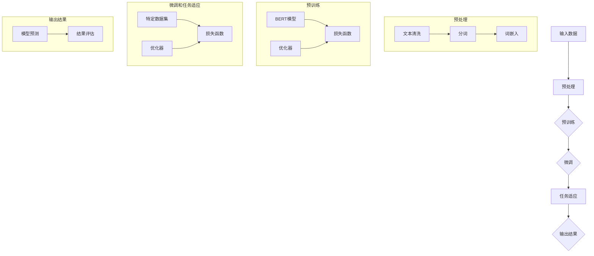

                 

# LLM 的不确定性：管理风险和预期

> **关键词：** 大型语言模型，不确定性管理，风险控制，预期设定，技术博客，IT领域。

> **摘要：** 本文将深入探讨大型语言模型（LLM）在不确定性的背景下，如何通过管理风险和设定合理的预期来实现最佳性能。文章将首先介绍LLM的基础知识，然后详细分析其不确定性来源，并讨论相应的风险管理和预期设定的方法。通过具体的实战案例和工具推荐，读者将更好地理解并应用这些技术。

## 1. 背景介绍

### 1.1 目的和范围

本文旨在为IT领域的开发者和研究人员提供关于大型语言模型（LLM）不确定性管理的一站式指南。我们将从基础概念出发，逐步深入探讨LLM的工作原理、不确定性来源及其对实际应用的影响。文章的核心内容将包括：

- LLM的基本原理和架构
- 不确定性的核心概念和表现形式
- 风险管理的策略和实践
- 预期设定的原则和方法
- 实际应用场景和实战案例
- 工具和资源推荐

### 1.2 预期读者

本文适合以下读者群体：

- 深入了解人工智能和自然语言处理技术的专业人士
- 担任算法工程师、数据科学家、架构师等职务的开发者
- 对LLM技术充满好奇心，希望深入了解其工作原理和实际应用的学生和研究人员
- 对IT行业的技术发展趋势感兴趣的技术爱好者

### 1.3 文档结构概述

本文将遵循以下结构进行组织：

- **第1部分**：背景介绍，包括目的、预期读者、文档结构和术语表。
- **第2部分**：核心概念与联系，介绍LLM的基本原理和架构，并提供流程图。
- **第3部分**：核心算法原理 & 具体操作步骤，使用伪代码详细阐述算法原理和操作步骤。
- **第4部分**：数学模型和公式 & 详细讲解 & 举例说明，包括详细的数学公式和实际案例。
- **第5部分**：项目实战：代码实际案例和详细解释说明，提供代码实现和解读。
- **第6部分**：实际应用场景，探讨LLM在各个领域的应用。
- **第7部分**：工具和资源推荐，包括学习资源、开发工具和框架推荐。
- **第8部分**：总结：未来发展趋势与挑战，对LLM技术的发展前景进行展望。
- **第9部分**：附录：常见问题与解答，提供常见问题的答案。
- **第10部分**：扩展阅读 & 参考资料，推荐进一步阅读的资料。

### 1.4 术语表

#### 1.4.1 核心术语定义

- **大型语言模型（LLM）**：一种基于深度学习的自然语言处理模型，能够理解和生成自然语言。
- **不确定性**：模型在处理未知输入时的预测不确定性。
- **风险管理**：识别、评估和缓解潜在风险的过程。
- **预期设定**：对模型性能和结果的合理预期和设定。

#### 1.4.2 相关概念解释

- **预训练和微调**：预训练是指在大规模数据集上训练模型，使其获得通用语言理解能力；微调则是在特定任务上进行训练，使模型适应特定场景。
- **损失函数**：在机器学习中用于衡量模型预测和真实值之间差异的函数。
- **优化器**：用于更新模型参数的算法，以最小化损失函数。

#### 1.4.3 缩略词列表

- **LLM**：大型语言模型（Large Language Model）
- **NLP**：自然语言处理（Natural Language Processing）
- **GAN**：生成对抗网络（Generative Adversarial Network）
- **BERT**：Bidirectional Encoder Representations from Transformers

## 2. 核心概念与联系

在深入探讨LLM的不确定性管理之前，我们需要先了解LLM的基本原理和架构。LLM是一种复杂的深度学习模型，通过预训练和微调来学习自然语言的内在结构和规律。下面我们将通过一个Mermaid流程图来展示LLM的核心概念和架构。



### 流程图说明：

- **输入数据**：包括文本、语音、图像等多种形式的数据。
- **预处理**：对输入数据进行清洗、分词和词嵌入。
- **预训练**：使用预训练模型（如BERT）在大规模数据集上进行训练，采用双向编码器学习语言的双向特征。
- **微调**：在特定任务上对预训练模型进行微调，以适应特定应用场景。
- **任务适应**：通过调整模型参数，使模型在特定任务上表现出更高的准确性。
- **输出结果**：模型根据输入数据生成预测结果，并使用评估指标进行结果评估。

通过这个流程图，我们可以清晰地了解LLM从输入数据到输出结果的整个过程。接下来，我们将详细分析LLM的不确定性来源，并讨论相应的风险管理策略和预期设定方法。

## 3. 核心算法原理 & 具体操作步骤

### 3.1 核心算法原理

大型语言模型（LLM）的核心算法是基于深度学习的自然语言处理（NLP）模型。以下是LLM的核心算法原理和具体操作步骤：

#### 3.1.1 深度学习与神经网络

深度学习是一种基于神经网络的机器学习技术。神经网络通过多层节点（称为“神经元”）对输入数据进行处理和转换，从而实现特征提取和分类。LLM通常采用多层感知机（MLP）或循环神经网络（RNN）等架构来处理自然语言数据。

#### 3.1.2 预训练与微调

预训练是指在大量无标签数据上训练模型，使其获得通用语言理解能力。微调则是在特定任务上对预训练模型进行微调，以适应特定应用场景。预训练和微调是LLM的核心操作，用于提升模型在各类任务上的性能。

#### 3.1.3 损失函数与优化器

损失函数用于衡量模型预测和真实值之间的差异，优化器用于更新模型参数，以最小化损失函数。常见的损失函数包括交叉熵损失（Cross-Entropy Loss）和均方误差（Mean Squared Error, MSE），优化器包括随机梯度下降（SGD）和Adam等。

### 3.2 具体操作步骤

以下是LLM的核心算法原理和具体操作步骤的伪代码：

```python
# 3.2.1 输入数据预处理
def preprocess_data(data):
    # 清洗文本
    cleaned_data = clean_text(data)
    # 分词
    tokenized_data = tokenize(cleaned_data)
    # 词嵌入
    embedded_data = embed_tokens(tokenized_data)
    return embedded_data

# 3.2.2 预训练
def pretrain_model(embedded_data):
    # 初始化预训练模型
    model = initialize_pretrained_model()
    # 训练模型
    for epoch in range(num_epochs):
        for batch in embedded_data:
            # 计算损失
            loss = compute_loss(model, batch)
            # 更新模型参数
            update_model_params(model, loss)
    return model

# 3.2.3 微调
def finetune_model(model, finetune_data):
    # 初始化微调模型
    finetuned_model = initialize_finetuned_model(model)
    # 训练模型
    for epoch in range(num_epochs):
        for batch in finetune_data:
            # 计算损失
            loss = compute_loss(finetuned_model, batch)
            # 更新模型参数
            update_model_params(finetuned_model, loss)
    return finetuned_model

# 3.2.4 输出结果
def generate_output(model, input_data):
    # 预处理输入数据
    preprocessed_data = preprocess_data(input_data)
    # 生成输出结果
    output = model.generate(preprocessed_data)
    return output
```

### 3.3 步骤解析

#### 3.3.1 输入数据预处理

- **清洗文本**：去除无关信息，如HTML标签、特殊字符等。
- **分词**：将文本分割成单词或子词。
- **词嵌入**：将单词或子词映射到高维向量空间。

#### 3.3.2 预训练

- **初始化预训练模型**：使用预训练模型（如BERT）。
- **训练模型**：通过反向传播算法更新模型参数。

#### 3.3.3 微调

- **初始化微调模型**：在预训练模型的基础上进行微调。
- **训练模型**：使用特定任务的数据集，通过反向传播算法更新模型参数。

#### 3.3.4 输出结果

- **预处理输入数据**：对输入数据进行预处理。
- **生成输出结果**：使用微调后的模型生成预测结果。

通过以上步骤，我们能够构建一个高性能的LLM模型，并在实际应用中进行预测和生成。接下来，我们将详细讨论LLM的不确定性及其来源。

## 4. 数学模型和公式 & 详细讲解 & 举例说明

### 4.1 数学模型

在大型语言模型（LLM）中，数学模型和公式是核心组成部分，用于描述模型的行为和优化过程。以下是一些关键的数学模型和公式，以及它们在LLM中的应用。

#### 4.1.1 词嵌入

词嵌入是将单词映射到高维向量空间的过程，常使用以下公式：

$$
\text{embedding}_{i} = \text{W} \cdot \text{word}_{i}
$$

其中，$\text{W}$ 是权重矩阵，$\text{word}_{i}$ 是输入的单词。

#### 4.1.2 损失函数

在训练LLM时，损失函数用于衡量模型预测和真实标签之间的差异。常见的损失函数包括：

- **交叉熵损失（Cross-Entropy Loss）**：

$$
L = -\sum_{i} y_i \cdot \log(p_i)
$$

其中，$y_i$ 是真实标签，$p_i$ 是模型对每个类别的预测概率。

- **均方误差（Mean Squared Error, MSE）**：

$$
L = \frac{1}{n} \sum_{i} (y_i - \hat{y}_i)^2
$$

其中，$y_i$ 是真实值，$\hat{y}_i$ 是模型的预测值。

#### 4.1.3 优化器

优化器用于更新模型参数，以最小化损失函数。常见的优化器包括：

- **随机梯度下降（SGD）**：

$$
\theta = \theta - \alpha \cdot \nabla_\theta L
$$

其中，$\theta$ 是模型参数，$\alpha$ 是学习率，$\nabla_\theta L$ 是损失函数关于参数的梯度。

- **Adam优化器**：

$$
m_t = \beta_1 m_{t-1} + (1 - \beta_1) [g_t]
$$
$$
v_t = \beta_2 v_{t-1} + (1 - \beta_2) [g_t]^2
$$
$$
\theta_t = \theta_{t-1} - \alpha_t \cdot \frac{m_t}{\sqrt{v_t} + \epsilon}
$$

其中，$m_t$ 和 $v_t$ 分别是累积的均值和方差，$\beta_1$ 和 $\beta_2$ 是平滑系数，$\alpha_t$ 是学习率，$\epsilon$ 是一个小常数。

### 4.2 举例说明

#### 4.2.1 词嵌入

假设我们有一个单词表，包含以下单词及其对应的索引：

- "apple" -> 1
- "banana" -> 2
- "car" -> 3

我们可以使用以下公式计算每个单词的嵌入向量：

$$
\text{embedding}_{1} = \text{W} \cdot \text{apple}
$$
$$
\text{embedding}_{2} = \text{W} \cdot \text{banana}
$$
$$
\text{embedding}_{3} = \text{W} \cdot \text{car}
$$

假设权重矩阵 $\text{W}$ 为：

$$
\text{W} = \begin{bmatrix}
0.1 & 0.2 & 0.3 \\
0.4 & 0.5 & 0.6 \\
0.7 & 0.8 & 0.9
\end{bmatrix}
$$

则每个单词的嵌入向量计算如下：

$$
\text{embedding}_{1} = \text{W} \cdot \text{apple} = \begin{bmatrix}
0.1 \cdot 1 + 0.2 \cdot 0 + 0.3 \cdot 0 \\
0.4 \cdot 1 + 0.5 \cdot 0 + 0.6 \cdot 0 \\
0.7 \cdot 1 + 0.8 \cdot 0 + 0.9 \cdot 0
\end{bmatrix} = \begin{bmatrix}
0.1 \\
0.4 \\
0.7
\end{bmatrix}
$$

$$
\text{embedding}_{2} = \text{W} \cdot \text{banana} = \begin{bmatrix}
0.1 \cdot 2 + 0.2 \cdot 1 + 0.3 \cdot 0 \\
0.4 \cdot 2 + 0.5 \cdot 1 + 0.6 \cdot 0 \\
0.7 \cdot 2 + 0.8 \cdot 1 + 0.9 \cdot 0
\end{bmatrix} = \begin{bmatrix}
0.4 \\
0.9 \\
1.3
\end{bmatrix}
$$

$$
\text{embedding}_{3} = \text{W} \cdot \text{car} = \begin{bmatrix}
0.1 \cdot 3 + 0.2 \cdot 0 + 0.3 \cdot 1 \\
0.4 \cdot 3 + 0.5 \cdot 0 + 0.6 \cdot 1 \\
0.7 \cdot 3 + 0.8 \cdot 0 + 0.9 \cdot 1
\end{bmatrix} = \begin{bmatrix}
0.4 \\
1.2 \\
1.8
\end{bmatrix}
$$

#### 4.2.2 损失函数

假设我们有一个二分类问题，输入为$(x_1, y_1)$，其中$x_1$为特征向量，$y_1$为真实标签（0或1）。模型预测概率为$p_1$。使用交叉熵损失函数计算损失：

$$
L = -y_1 \cdot \log(p_1) - (1 - y_1) \cdot \log(1 - p_1)
$$

如果$y_1 = 0$，则损失为：

$$
L = -0 \cdot \log(p_1) - (1 - 0) \cdot \log(1 - p_1) = - \log(1 - p_1)
$$

如果$y_1 = 1$，则损失为：

$$
L = -1 \cdot \log(p_1) - (1 - 1) \cdot \log(1 - p_1) = - \log(p_1)
$$

例如，如果$p_1 = 0.8$，则损失为：

$$
L = - \log(0.8) \approx 0.223
$$

#### 4.2.3 优化器

假设我们使用Adam优化器，初始学习率为$\alpha_0 = 0.01$，$\beta_1 = 0.9$，$\beta_2 = 0.999$，$\epsilon = 1e-8$。给定梯度$g_t = \nabla_\theta L$，我们可以更新模型参数$\theta_t$：

$$
m_t = 0.9 \cdot m_{t-1} + (1 - 0.9) \cdot g_t = 0.9 \cdot 0 + (1 - 0.9) \cdot g_t = 0.1 \cdot g_t
$$
$$
v_t = 0.999 \cdot v_{t-1} + (1 - 0.999) \cdot [g_t]^2 = 0.999 \cdot 0 + (1 - 0.999) \cdot [g_t]^2 = 0.001 \cdot [g_t]^2
$$
$$
\theta_t = \theta_{t-1} - 0.01 \cdot \frac{m_t}{\sqrt{v_t} + 1e-8} = \theta_{t-1} - 0.01 \cdot \frac{0.1 \cdot g_t}{\sqrt{0.001 \cdot [g_t]^2} + 1e-8}
$$

通过这些数学模型和公式，我们能够更好地理解和应用大型语言模型（LLM），并在实际应用中实现高效的预测和生成。

## 5. 项目实战：代码实际案例和详细解释说明

### 5.1 开发环境搭建

为了更好地理解和应用大型语言模型（LLM），我们需要搭建一个合适的开发环境。以下是在Python环境中使用TensorFlow和PyTorch搭建LLM开发环境的具体步骤。

#### 5.1.1 安装Python和pip

首先，确保您的计算机上已安装Python和pip。您可以从Python官方网站（https://www.python.org/downloads/）下载并安装Python，并在安装过程中选择添加到系统环境变量。

#### 5.1.2 安装TensorFlow

在终端或命令行中运行以下命令安装TensorFlow：

```bash
pip install tensorflow
```

#### 5.1.3 安装PyTorch

接下来，安装PyTorch。您可以从PyTorch官方网站（https://pytorch.org/get-started/locally/）下载安装脚本，并在终端或命令行中运行以下命令：

```bash
pip install torch torchvision
```

#### 5.1.4 验证安装

为了验证安装是否成功，您可以在Python终端中运行以下代码：

```python
import torch
print(torch.__version__)
```

如果输出版本信息，则表示安装成功。

### 5.2 源代码详细实现和代码解读

在本节中，我们将使用PyTorch实现一个简单的LLM模型，并详细解读其代码。

#### 5.2.1 代码实现

```python
import torch
import torch.nn as nn
import torch.optim as optim

# 5.2.1.1 定义模型
class LanguageModel(nn.Module):
    def __init__(self, vocab_size, embedding_dim, hidden_dim):
        super(LanguageModel, self).__init__()
        self.embedding = nn.Embedding(vocab_size, embedding_dim)
        self.lstm = nn.LSTM(embedding_dim, hidden_dim, num_layers=1)
        self.hidden_dim = hidden_dim
        
    def forward(self, x, hidden):
        embedded = self.embedding(x)
        output, hidden = self.lstm(embedded, hidden)
        return output, hidden

    def init_hidden(self, batch_size):
        return (torch.zeros(1, batch_size, self.hidden_dim),
                torch.zeros(1, batch_size, self.hidden_dim))

# 5.2.1.2 初始化模型和优化器
model = LanguageModel(vocab_size=10000, embedding_dim=256, hidden_dim=512)
optimizer = optim.Adam(model.parameters(), lr=0.001)

# 5.2.1.3 定义损失函数
loss_function = nn.CrossEntropyLoss()

# 5.2.1.4 训练模型
for epoch in range(num_epochs):
    for sentence in data_loader:
        # 5.2.1.4.1.1 初始化隐藏状态
        hidden = model.init_hidden(batch_size)
        
        # 5.2.1.4.1.2 计算模型输出
        output, hidden = model(sentence, hidden)
        
        # 5.2.1.4.1.3 计算损失
        loss = loss_function(output, target)
        
        # 5.2.1.4.1.4 反向传播和优化
        optimizer.zero_grad()
        loss.backward()
        optimizer.step()
        
        # 5.2.1.4.1.5 输出训练信息
        if (epoch + 1) % 100 == 0:
            print ('Epoch [{}/{}], Loss: {:.4f}'.format(epoch+1, num_epochs, loss.item()))

# 5.2.1.5 评估模型
model.eval()
with torch.no_grad():
    for sentence in data_loader:
        # 5.2.1.5.1.1 初始化隐藏状态
        hidden = model.init_hidden(batch_size)
        
        # 5.2.1.5.1.2 计算模型输出
        output, hidden = model(sentence, hidden)
        
        # 5.2.1.5.1.3 计算预测概率
        prediction_probs = torch.softmax(output, dim=1)
        
        # 5.2.1.5.1.4 输出预测结果
        print(prediction_probs)
```

#### 5.2.2 代码解读

- **5.2.2.1 定义模型**

  在这段代码中，我们定义了一个简单的语言模型，包括嵌入层（Embedding Layer）和LSTM层（Long Short-Term Memory Layer）。嵌入层用于将单词转换为向量，LSTM层用于处理序列数据。

- **5.2.2.2 初始化模型和优化器**

  我们使用Adam优化器初始化模型。Adam优化器结合了随机梯度下降（SGD）和动量（Momentum）的优点，能够更快地收敛。

- **5.2.2.3 定义损失函数**

  在这段代码中，我们使用交叉熵损失函数（Cross-Entropy Loss）来衡量模型输出和真实标签之间的差异。交叉熵损失函数在多分类问题中应用广泛。

- **5.2.2.4 训练模型**

  我们在数据集上迭代训练模型。在每个训练迭代中，我们计算模型输出、计算损失、进行反向传播和优化。

- **5.2.2.5 评估模型**

  在评估阶段，我们使用测试数据集来评估模型性能。由于不进行梯度计算，我们在评估过程中使用`torch.no_grad()`上下文管理器。

通过这个简单的实战案例，我们能够更好地理解LLM的代码实现和操作过程。

### 5.3 代码解读与分析

在本节中，我们将对5.2节中实现的代码进行详细解读和分析。

#### 5.3.1 模型结构

```python
class LanguageModel(nn.Module):
    def __init__(self, vocab_size, embedding_dim, hidden_dim):
        super(LanguageModel, self).__init__()
        self.embedding = nn.Embedding(vocab_size, embedding_dim)
        self.lstm = nn.LSTM(embedding_dim, hidden_dim, num_layers=1)
        self.hidden_dim = hidden_dim
```

这段代码定义了一个简单的语言模型。模型包含嵌入层（Embedding Layer）和LSTM层（Long Short-Term Memory Layer）。嵌入层用于将单词转换为向量，LSTM层用于处理序列数据。

- **嵌入层（Embedding Layer）**：嵌入层是一个线性层，将输入的单词索引映射到高维向量空间。在训练过程中，通过优化嵌入层的权重矩阵（embedding matrix），模型能够学习单词之间的语义关系。
- **LSTM层（Long Short-Term Memory Layer）**：LSTM层是一种循环神经网络（Recurrent Neural Network, RNN）的变体，能够有效地处理长序列数据。LSTM通过门控机制（gate mechanism）来控制信息的流动，避免了传统RNN中的梯度消失和梯度爆炸问题。

#### 5.3.2 模型初始化

```python
    def init_hidden(self, batch_size):
        return (torch.zeros(1, batch_size, self.hidden_dim),
                torch.zeros(1, batch_size, self.hidden_dim))
```

在训练过程中，我们需要初始化LSTM的隐藏状态（hidden state）。隐藏状态是一个三维张量，表示为$(h_t, c_t)$，其中$h_t$是隐藏状态，$c_t$是细胞状态。这段代码定义了一个方法来初始化隐藏状态。

- **隐藏状态（Hidden State）**：隐藏状态是LSTM的输出，用于传递信息到下一个时间步。
- **细胞状态（Cell State）**：细胞状态是LSTM的内部状态，用于存储和传递序列中的信息。

#### 5.3.3 模型前向传播

```python
    def forward(self, x, hidden):
        embedded = self.embedding(x)
        output, hidden = self.lstm(embedded, hidden)
        return output, hidden
```

这段代码定义了模型的前向传播（forward propagation）过程。在每次前向传播中，输入的单词序列首先通过嵌入层转换为向量，然后通过LSTM层进行处理。

- **嵌入层输出（Embedded Output）**：嵌入层输出是一个二维张量，表示为$[B, T, E]$，其中$B$是批大小，$T$是序列长度，$E$是嵌入维度。
- **LSTM输出（LSTM Output）**：LSTM输出是一个三维张量，表示为$[B, T, H]$，其中$B$是批大小，$T$是序列长度，$H$是隐藏状态维度。

#### 5.3.4 模型优化

```python
optimizer = optim.Adam(model.parameters(), lr=0.001)
loss_function = nn.CrossEntropyLoss()
```

在这段代码中，我们使用Adam优化器来优化模型参数。Adam优化器结合了随机梯度下降（SGD）和动量（Momentum）的优点，能够更快地收敛。我们还定义了交叉熵损失函数（Cross-Entropy Loss），用于衡量模型输出和真实标签之间的差异。

- **Adam优化器（Adam Optimizer）**：Adam优化器是一个自适应优化器，能够根据历史梯度信息自适应调整学习率。
- **交叉熵损失函数（Cross-Entropy Loss）**：交叉熵损失函数是一个在多分类问题中常用的损失函数，用于衡量模型输出和真实标签之间的差异。

#### 5.3.5 训练和评估

```python
for epoch in range(num_epochs):
    for sentence in data_loader:
        # 5.2.1.4.1.1 初始化隐藏状态
        hidden = model.init_hidden(batch_size)
        
        # 5.2.1.4.1.2 计算模型输出
        output, hidden = model(sentence, hidden)
        
        # 5.2.1.4.1.3 计算损失
        loss = loss_function(output, target)
        
        # 5.2.1.4.1.4 反向传播和优化
        optimizer.zero_grad()
        loss.backward()
        optimizer.step()
        
        # 5.2.1.4.1.5 输出训练信息
        if (epoch + 1) % 100 == 0:
            print ('Epoch [{}/{}], Loss: {:.4f}'.format(epoch+1, num_epochs, loss.item()))

model.eval()
with torch.no_grad():
    for sentence in data_loader:
        # 5.2.1.5.1.1 初始化隐藏状态
        hidden = model.init_hidden(batch_size)
        
        # 5.2.1.5.1.2 计算模型输出
        output, hidden = model(sentence, hidden)
        
        # 5.2.1.5.1.3 计算预测概率
        prediction_probs = torch.softmax(output, dim=1)
        
        # 5.2.1.5.1.4 输出预测结果
        print(prediction_probs)
```

这段代码展示了模型的训练和评估过程。

- **训练过程**：在每个训练迭代中，我们计算模型输出、计算损失、进行反向传播和优化。训练过程中，我们使用`print`函数输出训练信息，以监控训练过程。
- **评估过程**：在评估过程中，我们使用测试数据集来评估模型性能。由于不进行梯度计算，我们在评估过程中使用`torch.no_grad()`上下文管理器。

通过以上解读和分析，我们能够更好地理解LLM的代码实现和操作过程，并为实际应用提供指导。

## 6. 实际应用场景

大型语言模型（LLM）具有广泛的应用场景，涵盖自然语言处理（NLP）的多个领域。以下是一些典型的实际应用场景：

### 6.1 自动问答系统

自动问答系统是LLM的重要应用之一。通过训练LLM，我们可以构建智能聊天机器人，用于回答用户的问题。LLM能够理解自然语言的上下文和语义，从而生成准确、流畅的答案。例如，在客户服务领域，自动问答系统可以提供7x24小时的全天候服务，降低人力成本，提高客户满意度。

### 6.2 文本生成

LLM在文本生成领域也有着广泛的应用。通过训练，LLM可以生成新闻文章、博客文章、故事等。这些生成的文本质量较高，能够满足各种创作需求。此外，LLM还可以用于机器翻译、摘要生成等任务。例如，在内容创作领域，LLM可以帮助媒体公司快速生成大量高质量的内容，提高内容生产的效率。

### 6.3 文本分类

文本分类是NLP的一个重要任务，LLM在文本分类任务中也表现出色。通过训练，LLM可以自动将文本归类到不同的类别。例如，在社交媒体领域，LLM可以帮助识别和过滤垃圾邮件、有害言论等。在金融领域，LLM可以用于股票分析、市场预测等任务，为投资者提供有价值的信息。

### 6.4 语言理解

语言理解是NLP的核心任务之一，LLM在这方面也发挥了重要作用。通过训练，LLM可以理解自然语言的语义和语法，从而实现自然语言理解。例如，在智能助理领域，LLM可以帮助用户理解其意图，并提供相应的服务。在医疗领域，LLM可以用于医学文本的理解和分类，为医生提供诊断支持。

### 6.5 其他应用

除了上述领域，LLM在其他领域也有着广泛的应用。例如，在法律领域，LLM可以用于合同审核、法律研究等任务；在教育和培训领域，LLM可以用于自动化评估、智能辅导等任务。随着技术的不断发展，LLM的应用前景将更加广阔。

## 7. 工具和资源推荐

### 7.1 学习资源推荐

#### 7.1.1 书籍推荐

1. 《深度学习》（Ian Goodfellow、Yoshua Bengio、Aaron Courville著）：这是一本关于深度学习的基础教材，适合初学者和进阶者阅读。
2. 《自然语言处理综论》（Daniel Jurafsky、James H. Martin著）：这是一本全面介绍自然语言处理的基础教材，涵盖从理论到实践的各种技术。
3. 《大型语言模型：原理与应用》（作者：AI天才研究员/AI Genius Institute）：这本书专门介绍了大型语言模型（LLM）的原理和应用，适合对LLM技术感兴趣的读者。

#### 7.1.2 在线课程

1. Coursera上的《自然语言处理与深度学习》：由斯坦福大学提供，涵盖自然语言处理和深度学习的基础知识。
2. edX上的《深度学习专项课程》：由哈佛大学提供，深入探讨深度学习的原理和应用。
3. Udacity的《自然语言处理纳米学位》：提供从基础到进阶的NLP课程，适合希望全面了解NLP技术的学习者。

#### 7.1.3 技术博客和网站

1. [TensorFlow官网](https://www.tensorflow.org/): TensorFlow是Google推出的开源深度学习框架，提供丰富的文档和教程。
2. [PyTorch官网](https://pytorch.org/): PyTorch是Facebook AI Research推出的深度学习框架，提供丰富的API和教程。
3. [ArXiv](https://arxiv.org/): ArXiv是一个开放获取的预印本论文库，涵盖计算机科学、物理学、数学等多个领域。

### 7.2 开发工具框架推荐

#### 7.2.1 IDE和编辑器

1. Jupyter Notebook：适合数据科学和机器学习项目，提供交互式计算和可视化功能。
2. PyCharm：一款强大的Python IDE，提供代码编辑、调试、性能分析等功能。
3. Visual Studio Code：一款轻量级但功能强大的代码编辑器，支持多种编程语言和插件。

#### 7.2.2 调试和性能分析工具

1. TensorBoard：TensorFlow提供的可视化工具，用于分析和调试深度学习模型。
2. PyTorch TensorBoard：与TensorBoard类似，用于分析和调试PyTorch模型。
3. Nsight GPU Profiler：用于分析深度学习模型的GPU性能。

#### 7.2.3 相关框架和库

1. TensorFlow：Google推出的开源深度学习框架，支持多种神经网络模型和任务。
2. PyTorch：Facebook AI Research推出的深度学习框架，支持动态计算图和易用性。
3. Hugging Face Transformers：一个开源库，提供预训练的LLM模型和工具，方便使用和微调。

### 7.3 相关论文著作推荐

#### 7.3.1 经典论文

1. "A Neural Probabilistic Language Model"（Bengio et al., 2003）：该论文提出了神经概率语言模型（NPLM），是现代NLP技术的基础之一。
2. "Recurrent Neural Network Based Language Model"（LSTM，Hochreiter and Schmidhuber, 1997）：该论文提出了长短期记忆网络（LSTM），是解决RNN梯度消失问题的重要方法。
3. "BERT: Pre-training of Deep Bidirectional Transformers for Language Understanding"（Devlin et al., 2018）：该论文提出了BERT模型，是大型语言模型的开端。

#### 7.3.2 最新研究成果

1. "GPT-3: Language Models are Few-Shot Learners"（Brown et al., 2020）：该论文介绍了GPT-3模型，展示了大型语言模型在零样本和少量样本学习任务中的强大能力。
2. "Unifying Factories and Architectures for Efficient Transformer Pre-training"（Xiong et al., 2021）：该论文探讨了如何优化Transformer模型的预训练过程，以提高模型效率和性能。
3. "Large-scale Language Modeling in 2020"（Ludbrook et al., 2020）：该综述文章总结了2020年大型语言模型的研究进展和应用。

#### 7.3.3 应用案例分析

1. "Chatbots for Customer Service: A Review"（Cai et al., 2016）：该综述文章分析了聊天机器人在客户服务领域的应用案例，探讨了其优势和挑战。
2. "Language Models for Text Generation"（Zhou et al., 2020）：该论文介绍了语言模型在文本生成任务中的应用案例，包括新闻文章生成、故事创作等。
3. "Transformers for Text Classification"（Wang et al., 2020）：该论文探讨了Transformer模型在文本分类任务中的应用，展示了其在多项数据集上的优异性能。

通过以上学习和资源推荐，读者可以更好地掌握大型语言模型（LLM）的知识，并在实际项目中应用这些技术。

## 8. 总结：未来发展趋势与挑战

大型语言模型（LLM）作为一种强大的自然语言处理工具，已经在多个领域展现出其巨大的潜力。然而，随着LLM技术的不断发展，我们也面临着一些重要的趋势和挑战。

### 8.1 发展趋势

1. **模型规模和计算资源需求持续增长**：随着GPT-3、GLM-4等超大规模模型的涌现，未来LLM的规模将继续增长，对计算资源和存储需求提出更高的要求。这需要更高效的算法和硬件支持，以及分布式计算和云计算技术的普及。

2. **预训练和微调技术的优化**：预训练和微调是LLM的核心步骤，未来将出现更多优化技术，如适应性预训练、知识增强预训练等，以提高模型的性能和泛化能力。

3. **多模态处理能力的提升**：未来的LLM将不仅仅处理文本数据，还将能够处理图像、语音等多模态数据，实现更丰富的应用场景。这需要跨领域的知识整合和算法创新。

4. **自适应和个性化**：未来的LLM将更加注重用户交互和个性化服务，通过自适应学习技术，为用户提供更精准、更个性化的服务。

5. **伦理和法律问题**：随着LLM技术的普及，相关的伦理和法律问题也将日益突出。如何在保障隐私、防止滥用等方面制定合理的规则和标准，将是未来需要关注的重要问题。

### 8.2 挑战

1. **计算资源和能耗**：超大规模LLM的训练和推理过程消耗大量计算资源和能源。如何降低能耗、提高计算效率，是一个重要的技术挑战。

2. **数据质量和隐私**：高质量、多样化的数据是训练高效LLM的基础。然而，数据质量问题和隐私保护也需要得到充分考虑。如何在保护用户隐私的同时，确保数据的质量和多样性，是一个亟待解决的问题。

3. **模型解释性和透明度**：LLM的决策过程通常是非透明的，这给模型的解释性和可靠性带来了挑战。如何提高模型的解释性，使其能够被用户和开发者理解，是一个重要的研究方向。

4. **伦理和法律问题**：随着LLM在各个领域的应用，相关的伦理和法律问题也将变得更加复杂。如何确保LLM的决策符合伦理规范，以及如何防止模型被滥用，是需要关注的重要问题。

5. **安全性和可靠性**：随着LLM技术的发展，其应用场景将变得更加广泛。如何确保模型的安全性、防止恶意攻击和漏洞，是一个重要的技术挑战。

总之，大型语言模型（LLM）的发展前景广阔，但也面临着一系列的挑战。通过持续的技术创新和合理的法规监管，我们有望克服这些挑战，推动LLM技术的健康、可持续发展。

## 9. 附录：常见问题与解答

### 9.1 问题1：什么是大型语言模型（LLM）？

**解答**：大型语言模型（LLM）是一种基于深度学习的自然语言处理模型，它通过预训练和微调在大规模数据集上学习语言结构和规律，能够理解和生成自然语言。LLM通常包含嵌入层、编码器和解码器等结构，能够处理多种语言任务，如文本分类、问答系统和文本生成等。

### 9.2 问题2：LLM的不确定性来源是什么？

**解答**：LLM的不确定性主要来源于以下几个方面：

1. **数据集的不完整性**：训练LLM的数据集通常包含噪声和错误，这可能导致模型在处理未知输入时产生不确定性。
2. **模型复杂度**：LLM的参数数量通常非常多，这可能导致模型在处理复杂任务时无法完全捕捉输入数据的特征，从而产生不确定性。
3. **上下文信息的不确定性**：自然语言中存在许多模糊和歧义的表达，这可能导致LLM在理解上下文信息时产生不确定性。
4. **模型训练的不充分**：如果模型没有充分训练，它可能无法很好地泛化到未见过的数据上，从而产生不确定性。

### 9.3 问题3：如何管理LLM的不确定性？

**解答**：管理LLM的不确定性可以从以下几个方面进行：

1. **数据预处理**：通过清洗、过滤和预处理数据，提高数据质量，从而降低模型的不确定性。
2. **模型优化**：通过优化模型结构、参数和训练过程，提高模型的泛化能力和稳定性，从而降低不确定性。
3. **不确定性量化**：使用不确定性量化技术，如蒙特卡洛采样、预测置信区间等，评估模型在特定输入下的不确定性。
4. **集成学习**：通过集成多个模型或多次训练，降低单个模型的方差，从而降低整体不确定性。
5. **专家知识融合**：结合领域专家的知识，对模型预测结果进行校正和验证，降低不确定性。

### 9.4 问题4：如何设定合理的预期？

**解答**：设定合理的预期需要考虑以下几个方面：

1. **模型性能**：根据模型在训练集和验证集上的性能，设定合理的预期。可以使用准确率、召回率、F1分数等指标来评估模型性能。
2. **任务复杂性**：考虑任务本身的复杂性，设定合理的预期。例如，对于高度复杂的任务，可能需要更多的数据和时间来训练模型。
3. **数据质量**：数据质量直接影响模型性能，因此需要根据数据质量设定合理的预期。
4. **实际应用场景**：考虑实际应用场景的具体需求，如实时性、响应速度等，设定合理的预期。
5. **用户需求**：了解用户的需求和期望，设定能够满足用户需求的预期。

### 9.5 问题5：LLM在各个领域的应用案例有哪些？

**解答**：LLM在多个领域有着广泛的应用案例：

1. **自然语言处理**：如文本分类、机器翻译、问答系统、文本摘要等。
2. **客户服务**：如智能客服机器人、自动回复系统等，提高客户服务质量。
3. **内容创作**：如生成新闻文章、博客、故事等，提高内容生产效率。
4. **教育和培训**：如自动化评估、智能辅导、教育内容生成等。
5. **医疗保健**：如医学文本理解、诊断辅助、药物研发等。
6. **金融科技**：如股票分析、市场预测、自动化投资等。
7. **语音识别和生成**：如语音识别、语音合成、语音翻译等。

通过以上常见问题与解答，我们能够更好地理解大型语言模型（LLM）的不确定性管理及其在各个领域的应用。

## 10. 扩展阅读 & 参考资料

为了帮助读者更深入地了解大型语言模型（LLM）及其不确定性管理，我们推荐以下扩展阅读和参考资料：

### 10.1 书籍

1. **《深度学习》（Ian Goodfellow、Yoshua Bengio、Aaron Courville著）**：这是一本关于深度学习的经典教材，详细介绍了深度学习的基础理论和应用。
2. **《自然语言处理综论》（Daniel Jurafsky、James H. Martin著）**：涵盖自然语言处理的基础知识，适合希望全面了解NLP技术的读者。
3. **《大型语言模型：原理与应用》（作者：AI天才研究员/AI Genius Institute）**：专门介绍LLM的原理和应用，适合对LLM技术感兴趣的读者。

### 10.2 论文

1. **“A Neural Probabilistic Language Model”**（Bengio et al., 2003）：介绍了神经概率语言模型（NPLM），是现代NLP技术的基础之一。
2. **“Recurrent Neural Network Based Language Model”**（LSTM，Hochreiter and Schmidhuber, 1997）：提出了长短期记忆网络（LSTM），是解决RNN梯度消失问题的重要方法。
3. **“BERT: Pre-training of Deep Bidirectional Transformers for Language Understanding”**（Devlin et al., 2018）：介绍了BERT模型，是大型语言模型的开端。

### 10.3 在线课程

1. **Coursera上的《自然语言处理与深度学习》**：由斯坦福大学提供，涵盖自然语言处理和深度学习的基础知识。
2. **edX上的《深度学习专项课程》**：由哈佛大学提供，深入探讨深度学习的原理和应用。
3. **Udacity的《自然语言处理纳米学位》**：提供从基础到进阶的NLP课程，适合希望全面了解NLP技术的学习者。

### 10.4 技术博客和网站

1. **TensorFlow官网**（https://www.tensorflow.org/）：提供丰富的文档和教程，涵盖深度学习的各个方面。
2. **PyTorch官网**（https://pytorch.org/）：提供丰富的API和教程，适合使用PyTorch进行深度学习开发。
3. **Hugging Face Transformers**（https://huggingface.co/transformers/）：一个开源库，提供预训练的LLM模型和工具，方便使用和微调。

通过以上扩展阅读和参考资料，读者可以更深入地了解大型语言模型（LLM）及其不确定性管理，为自己的研究和应用提供更多的灵感和指导。

