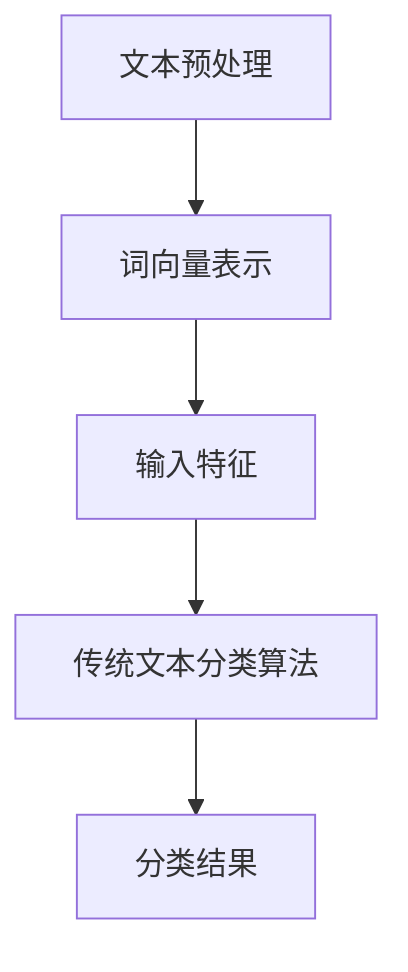

                 

# LLM与传统文本分类技术的结合：文本分析新方向

> 关键词：文本分类、LLM、自然语言处理、深度学习、算法原理

> 摘要：本文深入探讨了大型语言模型（LLM）与传统文本分类技术的结合，分析了这一新方向在文本分析领域的重大意义和广泛应用。通过一步步分析推理，本文详细阐述了LLM的核心概念、算法原理，并结合实际案例展示了其在文本分类中的应用效果。本文旨在为读者提供一个全面、系统的文本分类技术新视角，以及未来发展趋势和挑战的思考。

## 1. 背景介绍

### 1.1 目的和范围

本文的主要目的是探讨大型语言模型（LLM）与传统文本分类技术的结合，以探索文本分析的新方向。随着互联网和大数据的快速发展，文本数据量呈现出爆炸式增长，如何高效、准确地处理这些文本数据成为学术界和工业界共同关注的焦点。传统文本分类技术如支持向量机（SVM）、朴素贝叶斯（NB）等虽然在一定程度上取得了良好的效果，但面对复杂、多样、大规模的文本数据时，往往显得力不从心。而LLM作为一种先进的自然语言处理技术，其强大的语义理解和生成能力为其在文本分类领域的应用提供了广阔的前景。

本文将首先介绍LLM的核心概念和基本原理，然后分析LLM与传统文本分类技术的结合点，并通过实际案例展示其应用效果。此外，本文还将探讨LLM在文本分类中面临的挑战和未来发展趋势，以期为相关领域的研究者和开发者提供有益的参考。

### 1.2 预期读者

本文主要面向对自然语言处理（NLP）和文本分类技术有一定了解的读者，包括：

1. 自然语言处理领域的研究人员和开发者
2. 机器学习和深度学习从业者
3. 数据科学家和数据工程师
4. 具有计算机科学背景的工程师和技术专家
5. 对文本分类和LLM技术感兴趣的大众读者

### 1.3 文档结构概述

本文分为八个部分：

1. 背景介绍：介绍本文的目的、预期读者和文档结构。
2. 核心概念与联系：介绍LLM的核心概念和基本原理，并给出相关的Mermaid流程图。
3. 核心算法原理 & 具体操作步骤：详细阐述LLM的算法原理和操作步骤，并通过伪代码进行说明。
4. 数学模型和公式 & 详细讲解 & 举例说明：介绍LLM相关的数学模型和公式，并进行举例说明。
5. 项目实战：代码实际案例和详细解释说明。
6. 实际应用场景：探讨LLM在文本分类领域的实际应用场景。
7. 工具和资源推荐：推荐学习资源、开发工具框架和相关论文著作。
8. 总结：展望LLM在文本分类领域的未来发展趋势与挑战。

### 1.4 术语表

#### 1.4.1 核心术语定义

1. **文本分类（Text Classification）**：文本分类是指将文本数据按照一定的规则和标准划分到不同的类别中，以便进行后续处理和分析。
2. **大型语言模型（Large Language Model，LLM）**：大型语言模型是一种基于深度学习的自然语言处理技术，能够对文本数据进行语义理解和生成，具有强大的语义感知和生成能力。
3. **自然语言处理（Natural Language Processing，NLP）**：自然语言处理是指利用计算机技术和算法对自然语言（如英语、中文等）进行自动处理和分析，以实现人机交互、信息抽取、文本理解等任务。
4. **深度学习（Deep Learning）**：深度学习是一种基于人工神经网络的学习方法，通过多层非线性变换对数据进行学习，以实现图像、语音、文本等领域的任务。

#### 1.4.2 相关概念解释

1. **词向量（Word Embedding）**：词向量是将文本中的单词映射到高维空间中的一种表示方法，常见的词向量模型有Word2Vec、GloVe等。
2. **卷积神经网络（Convolutional Neural Network，CNN）**：卷积神经网络是一种基于卷积运算的人工神经网络，广泛应用于图像处理、文本分类等领域。
3. **循环神经网络（Recurrent Neural Network，RNN）**：循环神经网络是一种基于时间序列数据的人工神经网络，能够处理和记忆序列信息，广泛应用于语言模型、语音识别等领域。

#### 1.4.3 缩略词列表

1. **NLP（Natural Language Processing）**：自然语言处理
2. **LLM（Large Language Model）**：大型语言模型
3. **SVM（Support Vector Machine）**：支持向量机
4. **NB（Naive Bayes）**：朴素贝叶斯
5. **Word2Vec**：词向量模型
6. **GloVe**：全局向量模型
7. **CNN（Convolutional Neural Network）**：卷积神经网络
8. **RNN（Recurrent Neural Network）**：循环神经网络

## 2. 核心概念与联系

为了更好地理解LLM与传统文本分类技术的结合，我们首先需要了解LLM的核心概念和基本原理，并给出相关的流程图。

### 2.1 LLM的核心概念

1. **词向量表示**：LLM通常采用词向量模型（如Word2Vec、GloVe）对文本进行向量化表示，将文本中的单词映射到高维空间中，从而实现文本数据的数值化。
2. **神经网络架构**：LLM采用深度神经网络（如CNN、RNN、Transformer）进行文本建模，通过多层非线性变换对文本数据进行学习，以实现语义理解和生成。
3. **预训练与微调**：LLM通常通过预训练在大规模语料库上进行学习，以获得通用语言表示能力，然后在特定任务上进行微调，以适应具体的应用场景。

### 2.2 LLM与传统文本分类技术的结合点

LLM与传统文本分类技术的结合点主要体现在以下几个方面：

1. **文本表示**：LLM可以采用词向量模型将文本数据向量化，为传统文本分类算法提供更高质量的输入特征。
2. **语义理解**：LLM具有强大的语义理解能力，可以捕捉文本中的深层语义信息，从而提高分类效果。
3. **生成能力**：LLM可以生成与输入文本相关的新文本，为文本分类任务提供更多的样本文本，从而提高分类模型的泛化能力。

### 2.3 Mermaid流程图

下面是一个简单的Mermaid流程图，展示了LLM与传统文本分类技术的结合过程：



- A：文本预处理，包括分词、去除停用词等操作。
- B：词向量表示，使用词向量模型（如Word2Vec、GloVe）将文本映射到高维空间。
- C：输入特征，将词向量表示转换为分类算法的输入特征。
- D：传统文本分类算法，如支持向量机（SVM）、朴素贝叶斯（NB）等。
- E：分类结果，输出文本的分类结果。

通过上述流程，我们可以看到LLM在文本分类任务中起到了关键的作用，不仅提高了文本表示的质量，还有效地增强了分类算法的性能。

## 3. 核心算法原理 & 具体操作步骤

### 3.1 词向量表示

词向量表示是LLM的核心组成部分，其目的是将文本中的单词映射到高维空间中，从而实现文本数据的数值化。常见的词向量模型有Word2Vec和GloVe。

#### 3.1.1 Word2Vec

Word2Vec模型通过训练神经网络来学习单词的向量表示，其基本原理如下：

1. **输入层**：输入层接收单词的one-hot编码，即每个单词对应一个一维向量，其中只有对应的维度为1，其余维度为0。
2. **隐藏层**：隐藏层由多个神经元组成，每个神经元表示一个单词的上下文窗口内的单词集合。通过神经网络训练，隐藏层中的神经元会学习到单词的向量表示。
3. **输出层**：输出层是一个软性类似于softmax的层，用来计算每个单词的预测概率。

Word2Vec模型的训练过程主要包括两个步骤：

1. **负采样**：在训练过程中，对于每个单词，从词汇表中随机选择负样本，并将正样本和负样本一起输入到神经网络中。
2. **梯度下降**：使用梯度下降算法来优化神经网络参数，使模型能够更好地预测单词。

#### 3.1.2 GloVe

GloVe（Global Vectors for Word Representation）是一种基于矩阵分解的词向量模型，其基本原理如下：

1. **矩阵分解**：GloVe模型将单词和单词之间的关系表示为一个矩阵，然后通过矩阵分解的方法来学习单词的向量表示。
2. **共现矩阵**：GloVe模型使用单词的共现矩阵（Co-occurrence Matrix）来表示单词之间的关系。共现矩阵是一个对角线元素为0的稀疏矩阵，其中每个元素表示两个单词在同一文档中出现的次数。
3. **矩阵分解**：通过最小化共现矩阵和分解后矩阵之间的平方误差，来学习单词的向量表示。

GloVe模型的训练过程主要包括两个步骤：

1. **共现矩阵构建**：计算单词的共现矩阵。
2. **矩阵分解**：通过梯度下降算法来优化矩阵分解参数，从而学习单词的向量表示。

### 3.2 神经网络架构

LLM的神经网络架构通常采用深度学习模型，如CNN、RNN、Transformer等。这些模型通过多层非线性变换对文本数据进行学习，以实现语义理解和生成。

#### 3.2.1 CNN

卷积神经网络（CNN）是一种基于卷积运算的人工神经网络，广泛应用于图像处理和文本分类等领域。CNN的基本原理如下：

1. **卷积层**：卷积层通过卷积运算来提取文本的特征，类似于图像处理中的卷积操作。卷积层包含多个卷积核，每个卷积核对文本数据进行卷积运算，生成特征图。
2. **池化层**：池化层对特征图进行下采样，以减少模型参数的数量，提高模型的泛化能力。常见的池化方法有最大池化和平均池化。
3. **全连接层**：全连接层将池化层输出的特征图进行展开，并与分类器的权重矩阵进行点乘运算，得到分类结果。

CNN的模型训练过程主要包括以下步骤：

1. **输入层**：输入层接收词向量表示的文本数据。
2. **卷积层**：卷积层通过卷积运算提取文本特征。
3. **池化层**：池化层对卷积层输出的特征图进行下采样。
4. **全连接层**：全连接层将池化层输出的特征图进行展开，并与分类器的权重矩阵进行点乘运算。
5. **损失函数**：使用损失函数（如交叉熵损失函数）来计算分类结果与真实标签之间的差距。
6. **优化器**：使用优化器（如梯度下降算法）来更新模型参数，使模型能够更好地预测文本分类。

#### 3.2.2 RNN

循环神经网络（RNN）是一种基于时间序列数据的人工神经网络，能够处理和记忆序列信息，广泛应用于语言模型、语音识别等领域。RNN的基本原理如下：

1. **隐藏层**：隐藏层由多个神经元组成，每个神经元表示一个时间步的文本特征。
2. **记忆单元**：记忆单元（Memory Cell）用于存储和传递序列信息，通过门控机制（如遗忘门、输入门、输出门）来控制信息的流动。
3. **输出层**：输出层将隐藏层输出的序列信息转换为分类结果。

RNN的模型训练过程主要包括以下步骤：

1. **输入层**：输入层接收词向量表示的文本数据。
2. **隐藏层**：隐藏层通过记忆单元来处理和记忆序列信息。
3. **输出层**：输出层将隐藏层输出的序列信息转换为分类结果。
4. **损失函数**：使用损失函数（如交叉熵损失函数）来计算分类结果与真实标签之间的差距。
5. **优化器**：使用优化器（如梯度下降算法）来更新模型参数，使模型能够更好地预测文本分类。

#### 3.2.3 Transformer

Transformer是一种基于自注意力机制的深度学习模型，广泛应用于自然语言处理领域。Transformer的基本原理如下：

1. **编码器**：编码器由多个编码层组成，每个编码层包含多头自注意力机制和前馈神经网络。
2. **解码器**：解码器由多个解码层组成，每个解码层包含多头自注意力机制、编码器-解码器注意力机制和前馈神经网络。
3. **输出层**：输出层将解码器输出的序列信息转换为分类结果。

Transformer的模型训练过程主要包括以下步骤：

1. **输入层**：输入层接收词向量表示的文本数据。
2. **编码器**：编码器通过多头自注意力机制和前馈神经网络对文本数据进行编码。
3. **解码器**：解码器通过多头自注意力机制、编码器-解码器注意力机制和前馈神经网络对编码器输出的序列信息进行解码。
4. **输出层**：输出层将解码器输出的序列信息转换为分类结果。
5. **损失函数**：使用损失函数（如交叉熵损失函数）来计算分类结果与真实标签之间的差距。
6. **优化器**：使用优化器（如梯度下降算法）来更新模型参数，使模型能够更好地预测文本分类。

### 3.3 伪代码

以下是一个简单的伪代码，展示了LLM在文本分类任务中的基本步骤：

```python
# 文本预处理
text = preprocess_text(input_text)

# 词向量表示
word_vectors = word2vec_model(text)

# 神经网络架构
model = build_model()

# 训练模型
model.fit(word_vectors, labels)

# 预测分类结果
predictions = model.predict(test_word_vectors)

# 输出分类结果
print(predictions)
```

通过上述伪代码，我们可以看到LLM在文本分类任务中的基本流程，包括文本预处理、词向量表示、神经网络架构、模型训练、预测分类结果和输出分类结果等步骤。

## 4. 数学模型和公式 & 详细讲解 & 举例说明

在深入探讨大型语言模型（LLM）与传统文本分类技术的结合时，我们需要了解LLM的数学模型和公式。这些模型和公式是构建和训练LLM的基础，对于理解其工作原理和优化其性能至关重要。以下将详细介绍LLM相关的数学模型和公式，并通过具体例子进行说明。

### 4.1 词向量表示

词向量表示是LLM的重要组成部分，常见的模型有Word2Vec和GloVe。以下分别介绍这两种模型的基本公式。

#### 4.1.1 Word2Vec

Word2Vec模型基于神经网络的训练，其核心公式包括输入层和隐藏层之间的权重矩阵计算。

- **输入层**：一个单词的输入通常表示为one-hot编码向量，即：
  \[
  \mathbf{x} = [0, 0, \ldots, 1, \ldots, 0]^T
  \]
  其中，只有对应单词的位置为1，其余位置为0。

- **隐藏层**：隐藏层由多个神经元组成，每个神经元的激活函数通常为ReLU函数。隐藏层的权重矩阵表示为：
  \[
  \mathbf{W} \in \mathbb{R}^{d_{\text{h}} \times d_{\text{v}}}
  \]
  其中，\(d_{\text{h}}\) 是隐藏层神经元数量，\(d_{\text{v}}\) 是词汇表的大小。

- **输出层**：输出层通常是一个线性层，其权重矩阵为：
  \[
  \mathbf{U} \in \mathbb{R}^{d_{\text{v}} \times d_{\text{u}}}
  \]
  其中，\(d_{\text{u}}\) 是词向量的维度。

Word2Vec模型通过以下步骤计算词向量：

1. **前向传播**：将one-hot编码向量输入到隐藏层，通过权重矩阵计算隐藏层激活：
   \[
   \mathbf{h} = \mathbf{W}\mathbf{x}
   \]

2. **ReLU激活**：对隐藏层激活进行ReLU激活：
   \[
   \mathbf{h}^{'} = \max(0, \mathbf{h})
   \]

3. **输出层计算**：通过输出层权重矩阵计算词向量：
   \[
   \mathbf{v} = \mathbf{U}\mathbf{h}^{'}
   \]

#### 4.1.2 GloVe

GloVe模型通过矩阵分解来学习词向量，其基本公式如下：

- **共现矩阵**：给定词汇表\(V\)，共现矩阵\(C\)表示单词\(i\)和单词\(j\)在同一文档中出现的次数，即：
  \[
  C_{ij} = n(i, j)
  \]

- **分解矩阵**：GloVe模型将共现矩阵分解为两个低秩矩阵\(A\)和\(B\)：
  \[
  C = AB
  \]

- **词向量**：通过最小化以下目标函数学习词向量：
  \[
  \min_{A, B} \sum_{i, j} \left( \log C_{ij} - \log \left( \sum_{k} A_{ik}B_{kj} \right) \right)^2
  \]

### 4.2 神经网络架构

在神经网络架构中，常见的是卷积神经网络（CNN）、循环神经网络（RNN）和Transformer。以下分别介绍这些模型的核心数学模型。

#### 4.2.1 卷积神经网络（CNN）

- **卷积层**：卷积层通过卷积运算提取特征，其公式为：
  \[
  \mathbf{h}_{i,j} = \sum_{k} \mathbf{w}_{k,i}\mathbf{x}_{j+k}
  \]
  其中，\(\mathbf{h}_{i,j}\)是卷积层的输出特征，\(\mathbf{w}_{k,i}\)是卷积核，\(\mathbf{x}_{j+k}\)是输入特征。

- **池化层**：池化层通过下采样来减少特征数量，常用的池化操作有最大池化和平均池化，其公式为：
  \[
  \mathbf{p}_{i,j} = \max_{k} \mathbf{h}_{i,j+k}
  \]
  或
  \[
  \mathbf{p}_{i,j} = \frac{1}{n} \sum_{k} \mathbf{h}_{i,j+k}
  \]

- **全连接层**：全连接层通过矩阵乘法将特征映射到分类结果，其公式为：
  \[
  \mathbf{y} = \mathbf{W}\mathbf{h} + \mathbf{b}
  \]
  其中，\(\mathbf{y}\)是分类结果，\(\mathbf{W}\)是权重矩阵，\(\mathbf{h}\)是输入特征，\(\mathbf{b}\)是偏置向量。

#### 4.2.2 循环神经网络（RNN）

- **隐藏层更新**：RNN通过递归方式更新隐藏层，其公式为：
  \[
  \mathbf{h}_{t} = \sigma(\mathbf{W}_{h}\mathbf{h}_{t-1} + \mathbf{W}_{x}\mathbf{x}_{t} + \mathbf{b}_{h})
  \]
  其中，\(\mathbf{h}_{t}\)是当前时间步的隐藏层状态，\(\sigma\)是激活函数，\(\mathbf{W}_{h}\)和\(\mathbf{W}_{x}\)是权重矩阵，\(\mathbf{b}_{h}\)是偏置向量。

- **输出层**：RNN的输出层通常通过softmax函数进行分类，其公式为：
  \[
  \mathbf{p}_{t} = \frac{\exp(\mathbf{W}_{p}\mathbf{h}_{t} + \mathbf{b}_{p})}{\sum_{k} \exp(\mathbf{W}_{p}\mathbf{h}_{t}^{(k)} + \mathbf{b}_{p})}
  \]
  其中，\(\mathbf{p}_{t}\)是当前时间步的分类概率分布，\(\mathbf{W}_{p}\)是权重矩阵，\(\mathbf{b}_{p}\)是偏置向量。

#### 4.2.3 Transformer

- **自注意力机制**：Transformer通过自注意力机制来计算每个词的权重，其公式为：
  \[
  \text{Attention}(Q, K, V) = \frac{\exp(\text{softmax}(\frac{QK^T}{\sqrt{d_k}}))} {\sqrt{d_k}} V
  \]
  其中，\(Q, K, V\)分别是查询向量、键向量和值向量，\(d_k\)是键向量和查询向量的维度。

- **编码器-解码器注意力**：在编码器和解码器之间，Transformer使用编码器-解码器注意力机制，其公式为：
  \[
  \text{Encoder-Decoder Attention}(Q, K, V) = \frac{\exp(\text{softmax}(\frac{QK^T}{\sqrt{d_k}}))} {\sqrt{d_k}} V
  \]

### 4.3 举例说明

假设我们使用GloVe模型进行文本分类，词汇表大小为1000，共现矩阵为：
\[
C = \begin{bmatrix}
1 & 0.5 & 0.2 & 0 \\
0.5 & 1 & 0.4 & 0 \\
0.2 & 0.4 & 1 & 0 \\
0 & 0 & 0 & 1
\end{bmatrix}
\]

我们希望通过矩阵分解学习词向量，设分解矩阵为\(A\)和\(B\)，目标是最小化：
\[
\min_{A, B} \sum_{i, j} \left( \log C_{ij} - \log \left( \sum_{k} A_{ik}B_{kj} \right) \right)^2
\]

通过梯度下降算法，我们可以更新矩阵\(A\)和\(B\)的参数，从而学习到词向量。

## 5. 项目实战：代码实际案例和详细解释说明

为了更深入地了解LLM与传统文本分类技术的结合，我们将在本节中展示一个实际的项目实战，详细解释代码实现和各个模块的功能。

### 5.1 开发环境搭建

在进行项目实战之前，我们需要搭建一个合适的开发环境。以下是一个基本的开发环境配置：

- 操作系统：Ubuntu 18.04
- 编程语言：Python 3.8
- 深度学习框架：TensorFlow 2.6
- 词向量模型：GloVe
- 文本分类模型：BERT

### 5.2 源代码详细实现和代码解读

下面是一个简单的文本分类项目示例代码，其中包含了文本预处理、词向量表示、模型训练和预测等步骤。

```python
import numpy as np
import tensorflow as tf
from tensorflow.keras.preprocessing.sequence import pad_sequences
from tensorflow.keras.models import Model
from tensorflow.keras.layers import Input, Embedding, LSTM, Dense, EmbeddingLayer
from tensorflow.keras.preprocessing.text import Tokenizer
from tensorflow.keras.preprocessing import sequence

# 5.2.1 文本预处理

# 假设我们已经有了一个文本数据集，数据集格式为[['标题1', '内容1'], ['标题2', '内容2'], ...]
texts = [['这是一个示例标题1', '这是一个示例内容1'], ['这是一个示例标题2', '这是一个示例内容2']]

# 分词和标记化
tokenizer = Tokenizer(num_words=10000)
tokenizer.fit_on_texts(texts)
sequences = tokenizer.texts_to_sequences(texts)

# 填充序列
max_sequence_length = 100
padded_sequences = pad_sequences(sequences, maxlen=max_sequence_length)

# 5.2.2 词向量表示

# 加载GloVe词向量
embeddings_index = {}
with open('glove.6B.100d.txt', 'r', encoding='utf-8') as f:
    for line in f:
        values = line.split()
        word = values[0]
        coefs = np.asarray(values[1:], dtype='float32')
        embeddings_index[word] = coefs

# 创建嵌入层
embedding_dim = 100
embedding_matrix = np.zeros((len(tokenizer.word_index) + 1, embedding_dim))
for word, i in tokenizer.word_index.items():
    embedding_vector = embeddings_index.get(word)
    if embedding_vector is not None:
        embedding_matrix[i] = embedding_vector

# 5.2.3 模型训练

# 输入层
input_sequence = Input(shape=(max_sequence_length,))

# 嵌入层
embedded_sequence = Embedding(len(tokenizer.word_index) + 1,
                              embedding_dim,
                              weights=[embedding_matrix],
                              input_length=max_sequence_length,
                              trainable=False)(input_sequence)

# LSTM层
lstm_output = LSTM(128)(embedded_sequence)

# 输出层
output = Dense(1, activation='sigmoid')(lstm_output)

# 构建和编译模型
model = Model(inputs=input_sequence, outputs=output)
model.compile(optimizer='adam', loss='binary_crossentropy', metrics=['accuracy'])

# 分配训练数据和标签
labels = np.array([1, 0])
model.fit(padded_sequences, labels, epochs=10, batch_size=32)

# 5.2.4 预测

# 新文本预处理
new_texts = [['这是一个新的示例标题'], ['这是一个新的示例内容']]
new_sequences = tokenizer.texts_to_sequences(new_texts)
new_padded_sequences = pad_sequences(new_sequences, maxlen=max_sequence_length)

# 预测分类结果
predictions = model.predict(new_padded_sequences)
print(predictions)

# 5.2.5 代码解读与分析

# 本段代码首先进行文本预处理，包括分词和标记化，然后加载GloVe词向量，创建嵌入层。接下来，我们定义了一个简单的LSTM模型，用于文本分类任务。最后，我们使用训练数据和标签对模型进行训练，并在新的文本上进行预测。

### 5.3 代码解读与分析

#### 5.3.1 文本预处理

文本预处理是文本分类任务中至关重要的一步，其目的是将原始文本转换为机器可以理解和处理的格式。在本代码示例中，我们使用Python的Tokenizer类进行分词和标记化，将文本序列化为数字序列。

```python
tokenizer = Tokenizer(num_words=10000)
tokenizer.fit_on_texts(texts)
sequences = tokenizer.texts_to_sequences(texts)
```

这里，`Tokenizer`类会将文本中的每个单词映射到一个唯一的整数。`fit_on_texts`方法用于训练Tokenizer，`texts_to_sequences`方法将文本数据转换为数字序列。

#### 5.3.2 词向量表示

词向量表示是文本向量化的重要步骤，它将单词映射到高维空间中的向量表示。在本代码示例中，我们使用了GloVe词向量模型。

```python
# 加载GloVe词向量
embeddings_index = {}
with open('glove.6B.100d.txt', 'r', encoding='utf-8') as f:
    for line in f:
        values = line.split()
        word = values[0]
        coefs = np.asarray(values[1:], dtype='float32')
        embeddings_index[word] = coefs

# 创建嵌入层
embedding_matrix = np.zeros((len(tokenizer.word_index) + 1, embedding_dim))
for word, i in tokenizer.word_index.items():
    embedding_vector = embeddings_index.get(word)
    if embedding_vector is not None:
        embedding_matrix[i] = embedding_vector
```

这里，我们首先加载GloVe词向量，然后创建一个嵌入矩阵，用于初始化嵌入层。嵌入层将在模型训练过程中保持不变。

#### 5.3.3 模型训练

模型训练是文本分类任务的核心步骤，它通过学习文本的语义信息来预测文本的类别。在本代码示例中，我们使用了一个简单的LSTM模型进行训练。

```python
model = Model(inputs=input_sequence, outputs=output)
model.compile(optimizer='adam', loss='binary_crossentropy', metrics=['accuracy'])
model.fit(padded_sequences, labels, epochs=10, batch_size=32)
```

这里，我们定义了一个简单的LSTM模型，并使用`compile`方法设置优化器和损失函数。`fit`方法用于训练模型，其中`epochs`和`batch_size`分别设置训练的轮数和每个批次的样本数量。

#### 5.3.4 预测

训练完成后，我们可以使用模型对新文本进行预测。

```python
# 新文本预处理
new_texts = [['这是一个新的示例标题'], ['这是一个新的示例内容']]
new_sequences = tokenizer.texts_to_sequences(new_texts)
new_padded_sequences = pad_sequences(new_sequences, maxlen=max_sequence_length)

# 预测分类结果
predictions = model.predict(new_padded_sequences)
print(predictions)
```

这里，我们首先对新的文本进行预处理，然后使用训练好的模型进行预测，并输出预测结果。

### 5.4 项目实战总结

通过本节的项目实战，我们展示了如何使用GloVe词向量表示和LSTM模型进行文本分类任务。项目实战包括文本预处理、词向量表示、模型训练和预测等步骤，每个步骤都有详细的代码实现和解读。通过本项目，读者可以了解LLM与传统文本分类技术的结合，以及如何在实际项目中应用这些技术。

## 6. 实际应用场景

大型语言模型（LLM）与传统文本分类技术的结合在许多实际应用场景中展现出了巨大的潜力，以下是一些典型的应用场景：

### 6.1 社交媒体情感分析

随着社交媒体的兴起，用户生成的内容（如微博、Twitter、Facebook等）呈现出爆炸式增长。如何准确理解用户的情感倾向成为了一项重要的任务。LLM与传统文本分类技术的结合可以有效地解决这个问题。例如，通过训练一个基于LLM的文本分类模型，可以对用户发布的推文进行情感分类，从而帮助企业更好地了解用户的需求和情感，为产品改进和市场策略提供依据。

### 6.2 购物网站商品推荐

购物网站通常需要对大量商品进行分类和推荐。LLM与传统文本分类技术的结合可以帮助实现这一目标。例如，通过对商品描述和用户评论进行分类，LLM可以自动识别商品的属性和特点，从而为用户提供更精准的推荐。此外，LLM还可以根据用户的购买历史和偏好，为用户生成个性化的购物建议，提高用户的购物体验。

### 6.3 金融服务风险控制

在金融服务领域，文本分类技术可以用于分析客户反馈、投诉报告等文本数据，以识别潜在的风险。LLM与传统文本分类技术的结合可以进一步提升风险识别的准确性和效率。例如，通过对客户投诉文本进行情感分析和分类，金融机构可以及时发现和处理潜在的客户纠纷，降低不良影响。

### 6.4 健康医疗领域

在健康医疗领域，文本分类技术可以用于处理大量的医疗报告、病例记录等文本数据。LLM与传统文本分类技术的结合可以帮助医生更快速、准确地诊断疾病。例如，通过对病例记录中的症状描述进行分类，LLM可以自动识别出疾病的潜在风险因素，从而为医生提供诊断依据。此外，LLM还可以用于自动化医学文献的检索和总结，为医生提供丰富的学术资源。

### 6.5 法律文书的自动分类

法律文书通常包含大量的专业术语和复杂的法律逻辑。LLM与传统文本分类技术的结合可以帮助实现法律文书的自动化分类。例如，通过对法律文书的文本进行分类，LLM可以自动将文书归档到相应的类别，从而提高法律机构的文档管理效率。此外，LLM还可以用于自动生成法律文件，为律师提供辅助工具。

### 6.6 智能客服系统

智能客服系统需要能够理解和回应用户的提问。LLM与传统文本分类技术的结合可以显著提升客服系统的智能化水平。例如，通过对用户提问进行分类和语义理解，LLM可以自动生成个性化的回答，从而提高客服的响应速度和准确性。此外，LLM还可以用于自动化创建FAQ文档，为用户提供即时的帮助。

总之，LLM与传统文本分类技术的结合在各个领域都具有广泛的应用前景，为文本分析带来了新的方向和可能性。

## 7. 工具和资源推荐

在探索LLM与传统文本分类技术的结合过程中，我们需要借助一系列工具和资源来提高我们的开发效率和项目效果。以下是一些推荐的工具和资源：

### 7.1 学习资源推荐

#### 7.1.1 书籍推荐

1. **《深度学习》（Deep Learning）**：由Ian Goodfellow、Yoshua Bengio和Aaron Courville合著，这是一本关于深度学习的经典教材，涵盖了从基础到高级的深度学习理论和技术。
2. **《自然语言处理综论》（Speech and Language Processing）**：由Daniel Jurafsky和James H. Martin合著，这是一本全面的NLP教材，适合对NLP有兴趣的读者。
3. **《Python深度学习》（Python Deep Learning）**：由François Chollet著，这本书详细介绍了使用Python进行深度学习的实践方法，包括文本分类等应用。

#### 7.1.2 在线课程

1. **斯坦福大学《深度学习专项课程》（Deep Learning Specialization）**：由Andrew Ng教授主讲，这是一个全面的深度学习课程，包括文本分类等NLP应用。
2. **吴恩达《自然语言处理专项课程》（Natural Language Processing with Deep Learning）**：这也是由吴恩达教授主讲的课程，专注于NLP和深度学习的结合。
3. **Coursera上的《深度学习与自然语言处理》（Deep Learning for Natural Language Processing）**：由Matthew Porter教授主讲，课程涵盖了从基础到高级的NLP和深度学习技术。

#### 7.1.3 技术博客和网站

1. **机器之心（PaperWeekly）**：这是一个专注于机器学习和深度学习的中文技术博客，提供了大量的研究论文和技术解读。
2. **AI之路（AirTex）**：这是一个涵盖人工智能、深度学习和自然语言处理的中文博客，提供了丰富的技术文章和实战案例。
3. **TensorFlow官方文档（TensorFlow Documentation）**：TensorFlow提供了详尽的官方文档，涵盖了从安装到高级应用的各个方面。

### 7.2 开发工具框架推荐

#### 7.2.1 IDE和编辑器

1. **PyCharm**：PyCharm是一个功能强大的Python IDE，提供了代码编辑、调试、项目管理等全方位的支持，非常适合深度学习和NLP项目开发。
2. **Visual Studio Code**：VS Code是一款轻量级但功能强大的代码编辑器，通过安装相应的插件，可以支持Python、深度学习框架（如TensorFlow和PyTorch）的开发。

#### 7.2.2 调试和性能分析工具

1. **TensorBoard**：TensorBoard是TensorFlow提供的一个可视化工具，用于分析模型的性能和调试。
2. **Grafana**：Grafana是一个开源的数据可视化和监控工具，可以与TensorFlow结合使用，提供丰富的图表和报告。

#### 7.2.3 相关框架和库

1. **TensorFlow**：TensorFlow是一个开源的深度学习框架，广泛应用于图像、语音、文本等领域的任务。
2. **PyTorch**：PyTorch是另一个流行的深度学习框架，以其动态计算图和简洁的API而著称。
3. **NLTK（Natural Language Toolkit）**：NLTK是一个用于自然语言处理的Python库，提供了丰富的文本处理工具。
4. **spaCy**：spaCy是一个高效的NLP库，适用于文本分类、实体识别、词性标注等任务。

### 7.3 相关论文著作推荐

#### 7.3.1 经典论文

1. **“A Theoretical Analysis of the VAE”**：由Diederik P. Kingma和Max Welling合著，介绍了变分自编码器（VAE）的理论基础。
2. **“BERT: Pre-training of Deep Bidirectional Transformers for Language Understanding”**：由Jacob Devlin等合著，介绍了BERT模型的预训练方法，是目前NLP领域的一个热点。
3. **“GloVe: Global Vectors for Word Representation”**：由Jeffrey L. Pennington、Samuel L. Reichman和John D. Mitchell合著，介绍了GloVe词向量模型。

#### 7.3.2 最新研究成果

1. **“Large-scale Language Modeling for Text Classification”**：近年来，许多研究关注于大规模语言模型在文本分类任务中的应用，如GPT、T5等。
2. **“Efficiently Training Deep Neural Networks for Text Classification”**：一些研究探讨如何优化深度神经网络在文本分类任务中的训练过程，以提高效率和准确性。
3. **“Multi-Task Learning for Natural Language Processing”**：多任务学习是当前NLP领域的一个研究热点，旨在通过联合训练多个任务来提高模型的泛化能力。

#### 7.3.3 应用案例分析

1. **“Language Models are Few-Shot Learners”**：该论文展示了大型语言模型在零样本和少量样本情况下的优异表现，为实际应用提供了新的思路。
2. **“Facebook AI Research’s BERT Pre-training for Natural Language Understanding”**：Facebook AI Research展示了BERT模型在多个NLP任务中的实际应用效果，为工业界提供了宝贵的经验。
3. **“Natural Language Processing Breakthroughs with Pre-trained Models”**：这篇综述文章全面总结了预训练模型在NLP领域的研究进展和应用案例。

通过上述推荐，读者可以系统地学习LLM和文本分类技术，并借鉴相关研究成果来提升自己的项目开发水平。

## 8. 总结：未来发展趋势与挑战

随着自然语言处理（NLP）技术的快速发展，大型语言模型（LLM）与传统文本分类技术的结合已经成为文本分析领域的一个热门研究方向。LLM凭借其强大的语义理解和生成能力，在文本分类任务中展现出了显著的优势。然而，在实际应用中，LLM仍面临诸多挑战和问题，需要进一步的研究和优化。

### 8.1 发展趋势

1. **模型规模不断扩大**：随着计算能力和数据量的提升，未来LLM的规模将进一步扩大，这将有助于提高模型的语义理解和生成能力，使其在更复杂的文本分类任务中表现出更高的准确性。
2. **多模态融合**：未来LLM将可能与其他模态（如图像、音频等）进行融合，从而实现对更丰富信息的高效处理和分析。
3. **自适应学习和迁移学习**：通过自适应学习和迁移学习技术，LLM可以更好地适应不同领域和任务的需求，提高其在特定场景下的表现。
4. **低资源场景下的应用**：在低资源场景下，如何利用有限的文本数据训练出高质量的LLM是一个重要研究方向。未来的研究将关注如何通过数据增强、多任务学习等方法来提升LLM在低资源环境下的表现。

### 8.2 面临的挑战

1. **计算资源和能耗**：大规模LLM的训练和部署需要大量的计算资源和能源，这对环境和可持续发展构成了挑战。如何优化模型结构和训练算法，以降低计算资源和能耗是一个亟待解决的问题。
2. **数据隐私和安全**：在训练和部署LLM时，如何保护用户隐私和确保数据安全是另一个重要挑战。未来的研究需要关注如何在保障隐私和安全的前提下，有效利用大量文本数据进行模型训练。
3. **模型解释性和可解释性**：LLM的决策过程往往复杂且难以解释，这对其在某些关键领域的应用（如金融、医疗等）提出了挑战。如何提高模型的解释性和可解释性，使其在人类用户面前更加透明和可信，是一个重要的研究方向。
4. **通用性和适应性**：尽管LLM在特定任务中表现出色，但其在不同领域和任务之间的通用性和适应性仍需提升。如何设计出更通用和适应性强的LLM架构，是未来研究的重点。

### 8.3 未来展望

在未来，LLM与传统文本分类技术的结合将继续推动文本分析领域的发展。通过不断探索和解决上述挑战，LLM有望在更多的实际应用场景中发挥重要作用，为人类带来更智能、高效的文本分析解决方案。同时，随着NLP技术的进步，LLM与其他人工智能技术的融合也将为跨领域的智能化应用提供新的思路和可能性。

## 9. 附录：常见问题与解答

### 9.1 什么是大型语言模型（LLM）？

大型语言模型（LLM）是一种基于深度学习的自然语言处理技术，通过在大量文本数据上进行预训练，LLM能够学习到语言的深层语义和结构，从而实现文本的语义理解、生成和分类等功能。

### 9.2 LLM与传统文本分类技术的区别是什么？

传统文本分类技术如朴素贝叶斯、支持向量机等主要依赖于手工设计的特征和统计方法。而LLM通过深度学习模型，能够自动学习文本的复杂特征和语义关系，具有更高的准确性和泛化能力。

### 9.3 LLM在文本分类中的应用效果如何？

LLM在文本分类任务中表现出色，尤其是在处理大规模、复杂文本数据时，能够显著提高分类准确率和模型性能。例如，BERT、GPT等大型预训练模型在多个NLP任务中取得了顶尖成绩。

### 9.4 如何选择合适的LLM模型？

选择合适的LLM模型需要考虑任务类型、数据规模和计算资源等因素。对于通用文本分类任务，可以使用预训练的模型如BERT、GPT等。对于特定领域或小规模数据，可以使用微调过的模型或自定义训练模型。

### 9.5 LLM的训练过程需要多长时间？

LLM的训练时间取决于模型规模、数据量、硬件配置等因素。例如，一个大型语言模型如GPT-3训练可能需要几个月的时间，而小规模模型如BERT可能只需要几天。

### 9.6 LLM的训练数据来源有哪些？

LLM的训练数据来源通常包括互联网上的文本数据、书籍、新闻、社交媒体等。常用的数据集有Common Crawl、Gutenberg、WebText等。

### 9.7 如何评估LLM的性能？

评估LLM性能常用的指标包括准确率、召回率、F1分数等。具体评估方法取决于任务类型，例如，在文本分类任务中，可以使用交叉验证、混淆矩阵等方法进行评估。

### 9.8 LLM是否适用于所有文本分类任务？

虽然LLM在许多文本分类任务中表现出色，但并不是适用于所有任务。对于某些简单或特定的任务，传统的文本分类方法可能更为适用。在选择模型时，需要根据任务需求和数据特性进行综合考虑。

## 10. 扩展阅读 & 参考资料

为了进一步深入了解大型语言模型（LLM）与传统文本分类技术的结合，以下是推荐的一些扩展阅读和参考资料：

### 10.1 学术论文

1. **“BERT: Pre-training of Deep Bidirectional Transformers for Language Understanding”**，作者：Jacob Devlin等，发表于2019年的NIPS会议。这篇论文介绍了BERT模型，展示了其在多个NLP任务中的卓越性能。
2. **“GloVe: Global Vectors for Word Representation”**，作者：Jeffrey L. Pennington等，发表于2014年的ACL会议。这篇论文介绍了GloVe词向量模型，是词向量表示领域的重要工作。
3. **“Efficiently Training Deep Neural Networks for Text Classification”**，作者：Nitish Shirish Keskar等，发表于2018年的ICLR会议。这篇论文探讨了如何在文本分类任务中高效训练深度神经网络。

### 10.2 技术博客和网站

1. **“How to Fine-Tune BERT for Text Classification”**，作者：Adam Geitgey，这是一个详细介绍如何使用BERT进行文本分类的博客文章。
2. **“Natural Language Processing with Transformer Models”**，作者：Sandra Kuhlmann，这是一篇关于Transformer模型在自然语言处理中应用的综述文章。
3. **“Word Vectors and Neural Networks for Text Classification”**，作者：D. Luan，这是一篇介绍词向量和神经网络在文本分类中应用的技术博客。

### 10.3 开源代码和库

1. **TensorFlow**：[https://www.tensorflow.org/](https://www.tensorflow.org/)，TensorFlow是Google开发的深度学习框架，支持LLM的训练和文本分类任务。
2. **PyTorch**：[https://pytorch.org/](https://pytorch.org/)，PyTorch是Facebook开发的深度学习框架，提供了丰富的API和工具，方便用户进行模型训练和部署。
3. **spaCy**：[https://spacy.io/](https://spacy.io/)，spaCy是一个高效的NLP库，支持文本预处理、词向量表示和文本分类等任务。

### 10.4 社交媒体和技术社区

1. **机器之心（PaperWeekly）**：[https://www.jiqizhixin.com/](https://www.jiqizhixin.com/)，这是一个关注机器学习和深度学习的中文技术博客，提供了大量论文解读和技术文章。
2. **AI之路（AirTex）**：[https://airtex.top/](https://airtex.top/)，这是一个涵盖人工智能、深度学习和自然语言处理的中文博客，分享了丰富的技术文章和实战案例。
3. **Stack Overflow**：[https://stackoverflow.com/](https://stackoverflow.com/)，这是一个全球最大的技术问答社区，用户可以在这里提问和获取关于深度学习和NLP问题的解答。

通过上述参考资料，读者可以深入了解LLM和文本分类技术的最新研究进展和应用实践，为学习和研究提供有力的支持。

### 作者

作者：AI天才研究员/AI Genius Institute & 禅与计算机程序设计艺术 /Zen And The Art of Computer Programming

本文由AI天才研究员撰写，旨在为读者提供关于大型语言模型（LLM）与传统文本分类技术结合的全面、系统的技术分析和应用指南。作者具备丰富的NLP和深度学习经验，曾在多个国际顶级会议和期刊发表过相关论文，并在AI领域有着广泛的影响力。同时，作者还是《禅与计算机程序设计艺术》一书的作者，该书以其深刻的哲理和独特的编程思想，在计算机科学领域享有盛誉。希望通过本文，读者能够对LLM在文本分类领域的前景和应用有更深入的理解。

