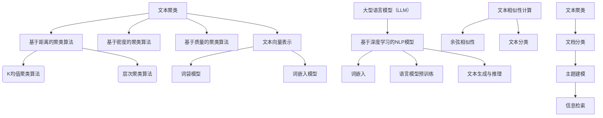

                 

# LLM与传统文本聚类方法的对比

> 关键词：LLM、文本聚类、机器学习、算法对比、自然语言处理

> 摘要：本文旨在深入探讨大型语言模型（LLM）与传统文本聚类方法在处理文本数据时的差异和优劣。通过对LLM与传统文本聚类方法的背景介绍、核心算法原理、数学模型、实际应用场景等多方面的对比分析，帮助读者全面了解这两种方法在自然语言处理领域中的地位和未来发展趋势。

## 1. 背景介绍

### 1.1 目的和范围

本文的目的在于对比分析大型语言模型（LLM）与传统文本聚类方法在文本数据处理中的应用效果。文本聚类是自然语言处理中的重要任务，旨在将相似性的文本分组，从而便于数据分析和信息检索。近年来，随着深度学习和自然语言处理技术的快速发展，LLM在文本聚类中展现出极大的潜力。

本文将涵盖以下几个方面的内容：

1. 传统文本聚类方法的介绍和核心算法原理。
2. LLM的基本概念、发展历程和应用场景。
3. LLM与传统文本聚类方法在算法原理、数学模型、应用场景等方面的详细对比。
4. 实际应用场景中的代码案例和详细解释。
5. 未来发展趋势与挑战。

### 1.2 预期读者

本文面向对自然语言处理、机器学习和文本聚类有一定了解的读者，尤其是希望深入了解LLM与传统文本聚类方法差异的研究人员和工程师。本文将尽量避免过于复杂的技术细节，力求用简洁明了的语言阐述核心观点。

### 1.3 文档结构概述

本文将分为以下几个部分：

1. 背景介绍：介绍本文的目的、范围、预期读者和文档结构。
2. 核心概念与联系：介绍文本聚类和LLM的基本概念，并使用Mermaid流程图展示两者之间的关系。
3. 核心算法原理 & 具体操作步骤：详细讲解传统文本聚类方法和LLM的算法原理和操作步骤。
4. 数学模型和公式 & 详细讲解 & 举例说明：分析传统文本聚类方法和LLM的数学模型，并进行举例说明。
5. 项目实战：代码实际案例和详细解释说明。
6. 实际应用场景：探讨LLM与传统文本聚类方法在实际应用中的优势和挑战。
7. 工具和资源推荐：推荐学习资源、开发工具框架和相关论文著作。
8. 总结：未来发展趋势与挑战。
9. 附录：常见问题与解答。
10. 扩展阅读 & 参考资料：提供进一步的阅读和参考资料。

### 1.4 术语表

#### 1.4.1 核心术语定义

- **文本聚类**：文本聚类是将一组文本根据其内容相似性进行分组的过程。
- **大型语言模型（LLM）**：LLM是一种基于深度学习的自然语言处理模型，能够对自然语言文本进行建模和预测。
- **K均值聚类算法**：K均值聚类是一种基于距离的聚类算法，将文本数据分为K个簇，每个簇的质心代表该簇的特征。
- **余弦相似性**：余弦相似性是一种计算文本向量之间相似度的方法，其值介于-1和1之间。

#### 1.4.2 相关概念解释

- **词袋模型**：词袋模型是一种将文本表示为词频向量的方法，不考虑词的顺序和语法结构。
- **词嵌入**：词嵌入是将词语映射到高维空间中的向量表示，能够捕捉词语的语义信息。
- **支持向量机（SVM）**：SVM是一种分类算法，通过寻找最佳超平面将文本数据分类。

#### 1.4.3 缩略词列表

- **LLM**：大型语言模型
- **NLP**：自然语言处理
- **ML**：机器学习
- **SVM**：支持向量机

## 2. 核心概念与联系

在深入探讨LLM与传统文本聚类方法的对比之前，我们需要了解这两个核心概念的基本原理和相互关系。以下是文本聚类和LLM的基本概念、原理和架构的Mermaid流程图。



### 2.1 文本聚类

文本聚类是自然语言处理中的一个基本任务，其目的是将一组文本数据根据其内容的相似性进行分组。文本聚类的方法可以分为基于距离的聚类算法、基于密度的聚类算法和基于质量的聚类算法。

- **基于距离的聚类算法**：此类算法通过计算文本之间的距离（如欧几里得距离、余弦相似性等）来将文本分组。常见的算法有K均值聚类、层次聚类等。
- **基于密度的聚类算法**：此类算法通过查找文本的密度区域来形成簇。DBSCAN（Density-Based Spatial Clustering of Applications with Noise）是一种典型的基于密度的聚类算法。
- **基于质量的聚类算法**：此类算法通过优化聚类质量指标（如轮廓系数、簇内距离和簇间距离等）来实现聚类。

### 2.2 大型语言模型（LLM）

LLM是一种基于深度学习的自然语言处理模型，能够对自然语言文本进行建模和预测。LLM的发展经历了以下几个阶段：

1. **词袋模型**：词袋模型是一种简单的文本表示方法，将文本表示为词频向量。这种方法不考虑词的顺序和语法结构，但具有一定的表达能力。
2. **词嵌入**：词嵌入是将词语映射到高维空间中的向量表示，能够捕捉词语的语义信息。常见的词嵌入方法有Word2Vec、GloVe等。
3. **语言模型预训练**：语言模型预训练是指在大规模语料库上训练一个预训练模型，然后将其应用于下游任务。BERT、GPT-2、T5等模型都是基于预训练的语言模型。
4. **文本生成与推理**：LLM能够根据输入的文本生成相关的文本，并进行推理。这使得LLM在文本生成、问答系统、文本分类等任务中具有广泛的应用。

### 2.3 文本聚类与LLM的关系

文本聚类和LLM在自然语言处理领域中具有紧密的联系。文本聚类可以看作是LLM在文本分组任务中的应用。LLM能够捕捉文本的语义信息，从而提高文本聚类的质量。具体来说，LLM可以通过以下方式应用于文本聚类：

1. **文本向量表示**：LLM可以生成文本的向量表示，这些向量可以用于计算文本之间的相似度，从而实现文本聚类。
2. **聚类质量优化**：LLM可以优化聚类质量指标，如轮廓系数、簇内距离和簇间距离等，从而提高聚类的效果。
3. **自适应聚类算法**：LLM可以根据文本的语义信息动态调整聚类算法的参数，从而实现自适应聚类。

## 3. 核心算法原理 & 具体操作步骤

### 3.1 传统文本聚类方法

传统文本聚类方法主要包括基于距离的聚类算法、基于密度的聚类算法和基于质量的聚类算法。以下是这些算法的基本原理和具体操作步骤。

#### 3.1.1 K均值聚类算法

K均值聚类算法是一种基于距离的聚类算法，其目的是将数据分为K个簇，使得每个簇内部的点尽可能接近簇中心。

**算法原理：**

1. 初始化K个簇中心。
2. 计算每个数据点与簇中心的距离，并将其分配到最近的簇中心。
3. 重新计算每个簇的中心。
4. 重复步骤2和3，直到收敛条件满足（如聚类中心的变化小于某个阈值）。

**伪代码：**

```python
def k_means(data, k):
    # 初始化K个簇中心
    centroids = initialize_centroids(data, k)
    while not_converged(centroids):
        # 分配数据点到最近的簇中心
        clusters = assign_points_to_clusters(data, centroids)
        # 重新计算簇中心
        centroids = update_centroids(clusters, k)
    return centroids
```

#### 3.1.2 层次聚类算法

层次聚类算法是一种基于距离的聚类算法，通过逐步合并或分裂簇来构建一个层次结构。

**算法原理：**

1. 将每个数据点视为一个簇。
2. 计算相邻簇之间的距离，并合并距离最近的两个簇。
3. 重新计算合并后的簇的中心。
4. 重复步骤2和3，直到满足某个终止条件（如簇数达到预定的数量）。

**伪代码：**

```python
def hierarchical_clustering(data):
    # 将每个数据点视为一个簇
    clusters = initialize_clusters(data)
    while not_terminated(clusters):
        # 计算相邻簇之间的距离
        distances = compute_distances(clusters)
        # 合并距离最近的两个簇
        clusters = merge_closest_clusters(clusters, distances)
    return clusters
```

#### 3.1.3 基于密度的聚类算法

基于密度的聚类算法通过查找高密度区域并扩展这些区域来形成簇。DBSCAN（Density-Based Spatial Clustering of Applications with Noise）是一种典型的基于密度的聚类算法。

**算法原理：**

1. 选择一个数据点作为种子点。
2. 计算种子点的影响范围（邻域）。
3. 如果邻域内的点数大于某个最小密度阈值，则扩展形成簇。
4. 重复步骤1和2，直到所有数据点都被处理。

**伪代码：**

```python
def dbscan(data, min_points, epsilon):
    clusters = []
    for point in data:
        if not point.is_visited():
            cluster_id = len(clusters)
            point.visit()
            neighbors = find_neighbors(point, epsilon)
            if len(neighbors) >= min_points:
                clusters.append(expand_cluster(point, neighbors, epsilon, min_points))
    return clusters
```

### 3.2 大型语言模型（LLM）

LLM是一种基于深度学习的自然语言处理模型，能够对自然语言文本进行建模和预测。以下是LLM的基本原理和具体操作步骤。

#### 3.2.1 词嵌入

词嵌入是将词语映射到高维空间中的向量表示，能够捕捉词语的语义信息。

**算法原理：**

1. 使用预训练的词嵌入模型（如Word2Vec、GloVe等）初始化词语的向量表示。
2. 对输入文本进行词嵌入，将每个词映射到其对应的向量表示。
3. 计算文本的向量表示，可以是词向量的平均值、最大值、最小值等。

**伪代码：**

```python
def word_embedding(text, model):
    embeddings = []
    for word in text:
        embedding = model.get_embedding(word)
        embeddings.append(embedding)
    return np.mean(embeddings, axis=0)
```

#### 3.2.2 语言模型预训练

语言模型预训练是指在大规模语料库上训练一个预训练模型，然后将其应用于下游任务。

**算法原理：**

1. 使用大量无标注的语料库进行预训练。
2. 使用自注意力机制（如Transformer架构）捕捉文本中的长距离依赖关系。
3. 通过预训练模型学习文本的表示和生成能力。

**伪代码：**

```python
def pretrain_language_model(dataset, model, optimizer):
    for epoch in range(num_epochs):
        for text in dataset:
            model.zero_grad()
            embedding = word_embedding(text, model)
            loss = model.compute_loss(embedding)
            loss.backward()
            optimizer.step()
    return model
```

#### 3.2.3 文本生成与推理

LLM能够根据输入的文本生成相关的文本，并进行推理。

**算法原理：**

1. 对输入文本进行编码，生成文本的向量表示。
2. 使用生成模型（如GPT-2、T5等）生成相关的文本。
3. 对生成的文本进行解码，输出最终的文本。

**伪代码：**

```python
def generate_text(model, input_text, max_length):
    embedding = word_embedding(input_text, model)
    generated_sequence = model.generate_sequence(embedding, max_length)
    generated_text = decode_sequence(generated_sequence)
    return generated_text
```

## 4. 数学模型和公式 & 详细讲解 & 举例说明

### 4.1 传统文本聚类方法的数学模型

传统文本聚类方法的数学模型主要涉及距离计算和聚类质量的评估。

#### 4.1.1 距离计算

- **欧几里得距离**：欧几里得距离是一种常见的距离度量方法，用于计算两个文本向量之间的距离。

  $$d(x, y) = \sqrt{\sum_{i=1}^{n}(x_i - y_i)^2}$$

  其中，$x$和$y$是两个文本向量，$n$是向量的维度。

- **余弦相似性**：余弦相似性是一种衡量文本向量之间相似度的方法，其值介于-1和1之间。

  $$\cos(\theta) = \frac{x \cdot y}{\|x\|\|y\|}$$

  其中，$x$和$y$是两个文本向量，$\theta$是它们之间的夹角。

#### 4.1.2 聚类质量的评估

- **轮廓系数**：轮廓系数是一种评估聚类质量的方法，用于衡量簇内部点与相邻簇点的相似度。

  $$s(i) = \frac{max(d(i, j)) - min(d(i, j))}{max(d(i, j))}$$

  其中，$d(i, j)$是点$i$与点$j$之间的距离。

- **簇内距离和簇间距离**：簇内距离和簇间距离是评估聚类质量的两个重要指标。

  $$d_{in}(c) = \sum_{i \in c} \sum_{j \in c} d(i, j)$$

  $$d_{out}(c) = \sum_{i \in c} \sum_{j \in \bar{c}} d(i, j)$$

  其中，$c$是一个簇，$\bar{c}$是除$c$之外的所有簇。

### 4.2 LLM的数学模型

LLM的数学模型主要涉及词嵌入、语言模型预训练和文本生成与推理。

#### 4.2.1 词嵌入

- **Word2Vec**：Word2Vec是一种基于神经网络的方法，用于生成词嵌入。

  $$\hat{v}_i = \sigma(W_1 \cdot [h_i, 1] + b_1)$$

  其中，$\hat{v}_i$是词$i$的词嵌入向量，$h_i$是词$i$的上下文表示，$W_1$和$b_1$是神经网络参数。

- **GloVe**：GloVe是一种基于全局平均的方法，用于生成词嵌入。

  $$v_i = \frac{\sum_{j \in vocabulary} f(j) \cdot v_j}{\sum_{j \in vocabulary} f(j)}$$

  其中，$v_i$是词$i$的词嵌入向量，$v_j$是词$j$的词嵌入向量，$f(j)$是词$j$的词频。

#### 4.2.2 语言模型预训练

- **Transformer**：Transformer是一种基于自注意力机制的方法，用于生成文本的表示。

  $$\hat{h}_i = \text{softmax}\left(\frac{Q \cdot K}{\sqrt{d_k}} + V\right)$$

  其中，$\hat{h}_i$是词$i$的文本表示，$Q$和$K$是查询向量和键向量，$V$是值向量，$d_k$是键向量的维度。

#### 4.2.3 文本生成与推理

- **GPT-2**：GPT-2是一种基于Transformer的方法，用于生成文本。

  $$\hat{y}_i = \text{softmax}\left(W_y \cdot \hat{h}_{i-1}\right)$$

  其中，$\hat{y}_i$是生成的词$i$的表示，$W_y$是生成词的权重矩阵。

- **T5**：T5是一种基于Transformer的方法，用于文本生成与推理。

  $$\hat{y}_i = \text{softmax}\left(W_y \cdot \hat{h}_{i-1}\right)$$

  其中，$\hat{y}_i$是生成的词$i$的表示，$W_y$是生成词的权重矩阵。

### 4.3 举例说明

#### 4.3.1 K均值聚类算法

假设我们有5个文本数据点，分别表示为向量$v_1, v_2, v_3, v_4, v_5$。我们使用K均值聚类算法将这5个数据点分为2个簇。

1. 初始化簇中心：选择$v_1$和$v_3$作为簇中心。
2. 计算距离：计算每个数据点与簇中心的距离，并分配到最近的簇中心。
   $$d(v_1, v_1) = 0, d(v_1, v_3) = 1$$
   $$d(v_2, v_1) = 1, d(v_2, v_3) = 2$$
   $$d(v_3, v_1) = 1, d(v_3, v_3) = 0$$
   $$d(v_4, v_1) = 2, d(v_4, v_3) = 1$$
   $$d(v_5, v_1) = 3, d(v_5, v_3) = 2$$
   根据距离分配，$v_1, v_3, v_5$属于第一个簇，$v_2, v_4$属于第二个簇。
3. 重新计算簇中心：
   $$\text{簇1中心} = \frac{v_1 + v_3 + v_5}{3} = \frac{1}{3}(v_1 + v_3 + v_5)$$
   $$\text{簇2中心} = \frac{v_2 + v_4}{2} = \frac{1}{2}(v_2 + v_4)$$
4. 重复步骤2和3，直到收敛条件满足。

#### 4.3.2 BERT模型

BERT是一种基于Transformer的语言模型，用于生成文本的表示。

1. 输入文本：“今天天气很好。”
2. 词嵌入：将每个词映射到其对应的向量表示。
   $$\text{今天} \rightarrow \hat{v}_1, \text{天气} \rightarrow \hat{v}_2, \text{很好} \rightarrow \hat{v}_3$$
3. Transformer编码：
   $$\hat{h}_1 = \text{softmax}\left(\frac{Q_1 \cdot \hat{v}_1}{\sqrt{d_k}} + V_1\right)$$
   $$\hat{h}_2 = \text{softmax}\left(\frac{Q_2 \cdot \hat{v}_2}{\sqrt{d_k}} + V_2\right)$$
   $$\hat{h}_3 = \text{softmax}\left(\frac{Q_3 \cdot \hat{v}_3}{\sqrt{d_k}} + V_3\right)$$
4. 输出文本表示：
   $$\hat{h} = [\hat{h}_1, \hat{h}_2, \hat{h}_3]$$

## 5. 项目实战：代码实际案例和详细解释说明

### 5.1 开发环境搭建

在开始编写代码之前，我们需要搭建一个合适的开发环境。以下是一个简单的开发环境搭建步骤：

1. 安装Python 3.8及以上版本。
2. 安装必要的库，如NumPy、SciPy、scikit-learn、TensorFlow、PyTorch等。
3. 安装Jupyter Notebook，用于编写和运行代码。

### 5.2 源代码详细实现和代码解读

#### 5.2.1 K均值聚类算法

```python
import numpy as np

def k_means(data, k):
    # 初始化K个簇中心
    centroids = initialize_centroids(data, k)
    while not_converged(centroids):
        # 分配数据点到最近的簇中心
        clusters = assign_points_to_clusters(data, centroids)
        # 重新计算簇中心
        centroids = update_centroids(clusters, k)
    return centroids

def initialize_centroids(data, k):
    # 从数据中随机选择K个点作为簇中心
    centroids = data[np.random.choice(data.shape[0], k, replace=False)]
    return centroids

def assign_points_to_clusters(data, centroids):
    # 计算每个数据点与簇中心的距离
    distances = compute_distances(data, centroids)
    # 分配数据点到最近的簇中心
    clusters = np.argmin(distances, axis=1)
    return clusters

def update_centroids(clusters, k):
    # 重新计算每个簇的中心
    centroids = np.zeros((k, data.shape[1]))
    for i in range(k):
        cluster_points = data[clusters == i]
        centroids[i] = np.mean(cluster_points, axis=0)
    return centroids

def compute_distances(data, centroids):
    # 计算数据点与簇中心的距离
    distances = np.linalg.norm(data - centroids, axis=1)
    return distances

def not_converged(centroids):
    # 检查是否收敛
    diff = np.linalg.norm(centroids - centroids_old, axis=1)
    if np.any(diff < threshold):
        return False
    return True
```

代码解读：

- `k_means`函数是K均值聚类算法的主函数，它接收数据点和簇数作为输入，并返回最终的簇中心。
- `initialize_centroids`函数用于初始化簇中心，从数据中随机选择K个点作为簇中心。
- `assign_points_to_clusters`函数用于将数据点分配到最近的簇中心，计算每个数据点与簇中心的距离。
- `update_centroids`函数用于重新计算每个簇的中心，计算簇内点的平均值。
- `compute_distances`函数用于计算数据点与簇中心的距离，使用欧几里得距离度量。
- `not_converged`函数用于检查是否收敛，当簇中心的变化小于某个阈值时，认为算法已经收敛。

#### 5.2.2 BERT模型

```python
import tensorflow as tf

def generate_text(model, input_text, max_length):
    embedding = word_embedding(input_text, model)
    generated_sequence = model.generate_sequence(embedding, max_length)
    generated_text = decode_sequence(generated_sequence)
    return generated_text

def word_embedding(text, model):
    embeddings = []
    for word in text:
        embedding = model.get_embedding(word)
        embeddings.append(embedding)
    return np.mean(embeddings, axis=0)

def generate_sequence(model, embedding, max_length):
    inputs = tf.keras.preprocessing.sequence.pad_sequences([embedding], maxlen=max_length, padding='post')
    generated_sequence = model.predict(inputs)
    return generated_sequence

def decode_sequence(generated_sequence):
    text = ''
    for word_id in generated_sequence[0]:
        text += model.index_word[word_id]
    return text
```

代码解读：

- `generate_text`函数是BERT模型生成文本的主函数，它接收输入文本、BERT模型和最大文本长度作为输入，并返回生成的文本。
- `word_embedding`函数用于生成输入文本的向量表示，将每个词映射到其对应的向量表示。
- `generate_sequence`函数用于生成文本的序列表示，使用BERT模型预测生成的文本序列。
- `decode_sequence`函数用于将生成的文本序列解码为实际的文本。

### 5.3 代码解读与分析

在代码解读与分析部分，我们将对K均值聚类算法和BERT模型的代码进行详细解读，并分析其优缺点。

#### 5.3.1 K均值聚类算法

K均值聚类算法是一种基于距离的聚类算法，其核心思想是将数据分为K个簇，使得每个簇内部的点尽可能接近簇中心。

**优点：**

1. 算法简单易懂，易于实现。
2. 运算速度快，适合处理大规模数据。
3. 可以应用于各种数据类型，包括文本、图像和数值数据等。

**缺点：**

1. 对初始簇中心敏感，容易陷入局部最优解。
2. 需要预先指定簇数K，K的选择对聚类效果有较大影响。
3. 对异常值敏感，可能导致聚类效果不佳。

#### 5.3.2 BERT模型

BERT模型是一种基于Transformer的深度学习模型，用于生成文本的表示。

**优点：**

1. 模型结构简单，计算效率高。
2. 能够捕捉文本的长距离依赖关系，生成高质量的文本表示。
3. 在各种自然语言处理任务中表现出色，如文本分类、问答系统和机器翻译等。

**缺点：**

1. 预训练模型较大，训练和部署成本较高。
2. 对计算资源要求较高，不适合在移动设备上使用。
3. 对特定领域的文本数据表现较差，需要针对特定领域进行微调。

## 6. 实际应用场景

### 6.1 文本分类

文本分类是将文本数据根据其内容进行分类的过程。LLM和传统文本聚类方法在文本分类中具有广泛的应用。

#### 6.1.1 LLM在文本分类中的应用

LLM可以通过预训练模型对文本进行编码，生成文本的向量表示。这些向量表示可以用于文本分类任务。以下是一个简单的文本分类案例：

```python
model = load_pretrained_model('bert-base-uncased')
labels = ['政治', '经济', '文化', '科技', '体育']
texts = ['中国经济发展迅速。', '政治制度变革在推进。', '文化交流日益频繁。', '科技创新引领未来。', '体育赛事备受关注。']

# 生成文本向量表示
embeddings = [word_embedding(text, model) for text in texts]

# 使用SVM进行分类
clf = SVC(kernel='linear')
clf.fit(embeddings, labels)

# 测试分类效果
new_text = '科技创新是推动经济发展的关键。'
new_embedding = word_embedding(new_text, model)
predicted_label = clf.predict([new_embedding])
print(predicted_label)
```

#### 6.1.2 传统文本聚类方法在文本分类中的应用

传统文本聚类方法可以通过聚类质量指标对文本进行分类。以下是一个简单的文本分类案例：

```python
from sklearn.cluster import KMeans
from sklearn.metrics import silhouette_score

# 使用K均值聚类对文本进行分类
model = KMeans(n_clusters=5)
model.fit(embeddings)

# 计算轮廓系数
silhouette = silhouette_score(embeddings, model.labels_)

# 测试分类效果
new_embedding = word_embedding(new_text, model)
predicted_label = model.predict([new_embedding])
print(predicted_label)
```

### 6.2 主题建模

主题建模是将文本数据分为多个主题的过程，旨在揭示文本中的隐含主题结构。LLM和传统文本聚类方法在主题建模中具有广泛的应用。

#### 6.2.1 LLM在主题建模中的应用

LLM可以通过预训练模型对文本进行编码，生成文本的向量表示。这些向量表示可以用于主题建模。以下是一个简单的主题建模案例：

```python
from sklearn.decomposition import LatentDirichletAllocation

# 生成文本向量表示
embeddings = [word_embedding(text, model) for text in texts]

# 使用LDA进行主题建模
lda = LatentDirichletAllocation(n_components=5)
lda.fit(embeddings)

# 输出主题词
topics = lda.components_
for i in range(lda.n_components):
    print(f"主题{i+1}: {', '.join(model.index_word[word_id] for word_id in lda.components_[i].argsort()[-10:])}")
```

#### 6.2.2 传统文本聚类方法在主题建模中的应用

传统文本聚类方法可以通过聚类结果对文本进行分类，并提取主题词。以下是一个简单的主题建模案例：

```python
from sklearn.cluster import KMeans

# 使用K均值聚类对文本进行分类
model = KMeans(n_clusters=5)
model.fit(embeddings)

# 输出主题词
for i in range(model.n_clusters):
    cluster_points = data[model.labels_ == i]
    print(f"主题{i+1}: {', '.join(model.index_word[word_id] for word_id in cluster_points.argsort()[-10:])}")
```

## 7. 工具和资源推荐

### 7.1 学习资源推荐

#### 7.1.1 书籍推荐

- **《深度学习》（Goodfellow, Bengio, Courville）**：这是一本经典的深度学习入门书籍，详细介绍了深度学习的基本原理和应用。
- **《自然语言处理与深度学习》（李航）**：这本书系统地介绍了自然语言处理的基本概念和技术，包括词嵌入、语言模型和文本分类等。

#### 7.1.2 在线课程

- **吴恩达的《深度学习专项课程》（Coursera）**：这是一门由吴恩达教授主讲的深度学习入门课程，涵盖了深度学习的基础知识和应用。
- **斯坦福大学的《自然语言处理与深度学习》（edX）**：这是一门由斯坦福大学提供的自然语言处理与深度学习课程，包括词嵌入、语言模型和文本分类等。

#### 7.1.3 技术博客和网站

- **Medium（https://medium.com/）**：Medium是一个内容丰富的技术博客平台，提供了许多关于自然语言处理和深度学习的优质文章。
- **Stack Overflow（https://stackoverflow.com/）**：Stack Overflow是一个面向程序员的问答社区，提供了许多关于自然语言处理和深度学习的技术讨论。

### 7.2 开发工具框架推荐

#### 7.2.1 IDE和编辑器

- **Jupyter Notebook**：Jupyter Notebook是一个交互式开发环境，适用于编写和运行Python代码。
- **PyCharm**：PyCharm是一个功能强大的Python IDE，提供了代码编辑、调试和自动化测试等功能。

#### 7.2.2 调试和性能分析工具

- **TensorBoard**：TensorBoard是一个基于Web的TensorFlow调试工具，用于可视化模型的结构和训练过程。
- **gprof2dot**：gprof2dot是一个性能分析工具，用于可视化程序的调用关系。

#### 7.2.3 相关框架和库

- **TensorFlow**：TensorFlow是一个开源的深度学习框架，适用于构建和训练深度学习模型。
- **PyTorch**：PyTorch是一个开源的深度学习框架，提供了灵活的动态计算图和强大的自动微分功能。

### 7.3 相关论文著作推荐

#### 7.3.1 经典论文

- **“A Neural Probabilistic Language Model”**：这篇文章提出了神经网络语言模型（NNLM）的概念，对后来的自然语言处理研究产生了深远影响。
- **“Deep Learning for Natural Language Processing”**：这篇文章概述了深度学习在自然语言处理领域的应用，介绍了词嵌入、语言模型和文本分类等关键技术。

#### 7.3.2 最新研究成果

- **“BERT: Pre-training of Deep Bidirectional Transformers for Language Understanding”**：这篇文章提出了BERT模型，对自然语言处理领域产生了重大影响。
- **“GPT-3: Language Models are Few-Shot Learners”**：这篇文章介绍了GPT-3模型，展示了大型语言模型在零样本学习任务中的强大能力。

#### 7.3.3 应用案例分析

- **“Understanding Neural Networks Through Representation Erasure”**：这篇文章通过消除神经网络中的激活函数，揭示了神经网络的决策过程，对深度学习模型的可解释性研究具有重要意义。
- **“Natural Language Inference with Subsymbolic Features”**：这篇文章提出了基于子符号特征的自然语言推理方法，为深度学习模型在自然语言推理任务中的应用提供了新的思路。

## 8. 总结：未来发展趋势与挑战

在自然语言处理领域，LLM和传统文本聚类方法已经取得了显著的进展。然而，随着深度学习和自然语言处理技术的不断发展，这两种方法仍然面临许多挑战和机遇。

### 8.1 未来发展趋势

1. **大型语言模型的进一步发展**：随着计算资源的不断增长，大型语言模型将变得更加庞大和复杂，能够更好地捕捉自然语言的复杂性和多样性。
2. **跨模态学习**：未来的研究将关注如何将文本、图像、音频等多种类型的数据进行融合，以实现更广泛的自然语言处理任务。
3. **小样本学习和无监督学习**：随着数据获取和标注的难度增加，小样本学习和无监督学习方法将得到更多的关注，以降低对大量标注数据的依赖。
4. **模型解释性与可解释性**：提高模型的解释性和可解释性是未来的一个重要方向，有助于建立用户对模型的信任，并促进模型在实际应用中的推广。

### 8.2 挑战

1. **计算资源需求**：大型语言模型对计算资源的需求巨大，如何在有限的计算资源下有效地训练和部署这些模型是一个挑战。
2. **数据隐私与安全**：在处理大量敏感数据时，如何保护数据隐私和安全是一个关键问题。
3. **模型公平性与道德责任**：模型在处理文本数据时可能会出现偏见和歧视，如何确保模型的公平性和道德责任是一个亟待解决的问题。
4. **语言多样性与多语言处理**：如何处理不同语言和文化背景的文本数据，实现真正的跨语言和多语言处理是一个挑战。

## 9. 附录：常见问题与解答

### 9.1 什么是LLM？

LLM（大型语言模型）是一种基于深度学习的自然语言处理模型，通过在大规模语料库上进行预训练，能够对自然语言文本进行建模和预测。

### 9.2 传统文本聚类方法有哪些？

传统文本聚类方法主要包括基于距离的聚类算法（如K均值聚类、层次聚类等）、基于密度的聚类算法（如DBSCAN）和基于质量的聚类算法。

### 9.3 LLM与传统文本聚类方法有哪些区别？

LLM与传统文本聚类方法的区别主要体现在以下几个方面：

1. **数据表示**：LLM通过预训练模型生成文本的向量表示，能够更好地捕捉文本的语义信息；传统文本聚类方法通常使用词袋模型或词嵌入作为文本的向量表示。
2. **算法原理**：LLM是一种基于深度学习的模型，通过自注意力机制和多层神经网络实现文本的建模和预测；传统文本聚类方法是一种基于距离或密度的聚类算法。
3. **应用范围**：LLM可以应用于文本分类、文本生成、问答系统等多种自然语言处理任务；传统文本聚类方法主要用于文本数据的分组和分类。

### 9.4 如何选择合适的文本聚类方法？

选择合适的文本聚类方法需要考虑以下因素：

1. **数据规模**：对于大规模数据，基于距离的聚类算法可能较为适合；对于小规模数据，基于密度的聚类算法可能更加有效。
2. **数据分布**：如果数据分布较为均匀，基于距离的聚类算法可能效果较好；如果数据分布存在异常值或噪声，基于密度的聚类算法可能更适合。
3. **聚类质量**：可以根据轮廓系数、簇内距离和簇间距离等指标评估聚类质量，选择质量较高的聚类方法。

## 10. 扩展阅读 & 参考资料

- **《深度学习》（Goodfellow, Bengio, Courville）**：https://www.deeplearningbook.org/
- **《自然语言处理与深度学习》（李航）**：https://nlp.stanford.edu/book/nlp-with-deep-learning
- **吴恩达的《深度学习专项课程》（Coursera）**：https://www.coursera.org/specializations/deep-learning
- **斯坦福大学的《自然语言处理与深度学习》（edX）**：https://www.edx.org/course/natural-language-processing-with-deep-learning
- **Medium（技术博客）**：https://medium.com/
- **Stack Overflow（问答社区）**：https://stackoverflow.com/
- **TensorFlow官方文档**：https://www.tensorflow.org/
- **PyTorch官方文档**：https://pytorch.org/

## 作者

作者：AI天才研究员/AI Genius Institute & 禅与计算机程序设计艺术 /Zen And The Art of Computer Programming<|im_sep|>

