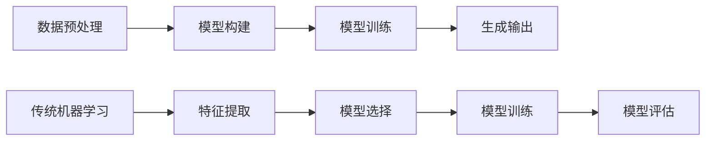

                 

# LLM与传统机器学习模型的比较

> 关键词：大型语言模型（LLM）、传统机器学习、模型对比、算法原理、应用场景、未来发展趋势

> 摘要：本文旨在深入探讨大型语言模型（LLM）与传统机器学习模型之间的区别和联系。通过对核心概念、算法原理、数学模型、实际应用场景以及未来发展趋势的详细分析，为读者提供一个全面的技术视角，帮助理解LLM的强大优势和面临的挑战。

## 1. 背景介绍

### 1.1 目的和范围

本文将聚焦于大型语言模型（LLM）与传统机器学习模型的比较研究。通过对比两者在核心概念、算法原理、数学模型、应用场景等方面的差异，旨在为读者提供一个清晰、全面的理解，从而更好地把握LLM在现代人工智能技术中的地位和作用。

### 1.2 预期读者

本文适用于对人工智能和机器学习有一定了解的技术人员、研究人员和学者，特别是那些希望深入了解LLM与传统机器学习模型之间差异的读者。同时，本文也适合作为高校和研究机构在人工智能相关课程中的教学参考资料。

### 1.3 文档结构概述

本文结构如下：

1. **背景介绍**：概述本文的目的和范围，预期读者，以及文档结构。
2. **核心概念与联系**：介绍大型语言模型（LLM）与传统机器学习模型的核心概念，通过Mermaid流程图展示其原理和架构。
3. **核心算法原理 & 具体操作步骤**：详细阐述LLM与传统机器学习模型的核心算法原理，使用伪代码进行具体操作步骤的讲解。
4. **数学模型和公式 & 详细讲解 & 举例说明**：分析LLM与传统机器学习模型的数学模型，使用LaTeX格式展示公式，并通过实例进行详细讲解。
5. **项目实战：代码实际案例和详细解释说明**：提供实际代码案例，对LLM与传统机器学习模型在项目实战中的表现进行详细解释和分析。
6. **实际应用场景**：探讨LLM与传统机器学习模型在不同应用场景中的适用性。
7. **工具和资源推荐**：推荐学习资源、开发工具框架和相关论文著作。
8. **总结：未来发展趋势与挑战**：总结LLM与传统机器学习模型的未来发展前景，面临的挑战。
9. **附录：常见问题与解答**：回答读者可能关注的问题。
10. **扩展阅读 & 参考资料**：提供进一步的阅读和参考资料。

### 1.4 术语表

#### 1.4.1 核心术语定义

- **大型语言模型（LLM）**：一种基于深度学习技术的语言模型，能够理解和生成自然语言，具有强大的文本处理能力。
- **传统机器学习模型**：基于统计学和优化理论的传统机器学习算法，包括线性回归、决策树、支持向量机等。
- **深度学习**：一种基于多层神经网络的学习方法，通过多层次的非线性变换来提取特征。
- **自然语言处理（NLP）**：研究如何让计算机理解和生成人类语言的人工智能领域。

#### 1.4.2 相关概念解释

- **词向量**：将自然语言文本转换为计算机可以处理的高维向量。
- **注意力机制**：一种用于提高神经网络处理长序列数据效率的方法，能够自适应地分配不同位置的权重。
- **反向传播**：一种用于训练神经网络的优化算法，通过计算损失函数关于网络权重的梯度，来更新网络参数。

#### 1.4.3 缩略词列表

- **LLM**：Large Language Model（大型语言模型）
- **NLP**：Natural Language Processing（自然语言处理）
- **NLU**：Natural Language Understanding（自然语言理解）
- **NLG**：Natural Language Generation（自然语言生成）
- **GAN**：Generative Adversarial Network（生成对抗网络）

## 2. 核心概念与联系

在深入探讨LLM与传统机器学习模型的对比之前，我们需要先理解这两个核心概念的基本原理和架构。

### 2.1 大型语言模型（LLM）的基本原理

大型语言模型（LLM）是一种基于深度学习技术的语言模型，主要通过以下步骤实现：

1. **数据预处理**：将文本数据转换为词向量，例如使用Word2Vec、BERT等算法。
2. **模型构建**：构建多层神经网络，例如Transformer、GPT等，其中每个层能够提取不同层次的特征。
3. **训练**：通过大量文本数据进行模型训练，使用梯度下降等优化算法来更新网络参数。
4. **生成**：根据输入的文本或任务需求，生成相应的输出文本。

### 2.2 传统机器学习模型的基本原理

传统机器学习模型主要通过以下步骤实现：

1. **特征提取**：从原始数据中提取有用的特征，例如通过特征工程、特征选择等方法。
2. **模型选择**：选择合适的机器学习算法，例如线性回归、决策树、支持向量机等。
3. **模型训练**：使用训练数据集训练模型，通过优化算法更新模型参数。
4. **模型评估**：使用测试数据集评估模型性能，通过交叉验证、网格搜索等方法调整模型参数。

### 2.3 Mermaid流程图展示

为了更直观地展示LLM与传统机器学习模型的基本原理和架构，我们使用Mermaid流程图进行说明。以下是LLM的Mermaid流程图：



通过这个流程图，我们可以清晰地看到LLM与传统机器学习模型在各个步骤上的差异和联系。

## 3. 核心算法原理 & 具体操作步骤

### 3.1 大型语言模型（LLM）的算法原理

大型语言模型（LLM）的核心算法是基于深度学习，特别是Transformer架构。下面我们使用伪代码详细阐述LLM的核心算法原理和具体操作步骤。

#### 3.1.1 模型定义

```python
class LanguageModel(nn.Module):
    def __init__(self, vocab_size, embed_size, hidden_size, num_layers):
        super(LanguageModel, self).__init__()
        self.embedding = nn.Embedding(vocab_size, embed_size)
        self.transformer = nn.Transformer(embed_size, hidden_size, num_layers)
        self.fc = nn.Linear(hidden_size, vocab_size)

    def forward(self, x):
        x = self.embedding(x)
        x = self.transformer(x)
        x = self.fc(x)
        return x
```

#### 3.1.2 操作步骤

1. **输入处理**：将输入文本转换为词向量。
2. **嵌入层**：将词向量转换为嵌入向量。
3. **Transformer层**：通过Transformer架构提取特征。
4. **全连接层**：将提取到的特征映射到输出词向量。
5. **生成输出**：根据输出词向量生成文本。

### 3.2 传统机器学习模型的算法原理

传统机器学习模型的核心算法包括线性回归、决策树、支持向量机等。下面我们使用伪代码详细阐述一个简单的线性回归模型。

```python
class LinearRegression(nn.Module):
    def __init__(self, input_size, output_size):
        super(LinearRegression, self).__init__()
        self.fc = nn.Linear(input_size, output_size)

    def forward(self, x):
        x = self.fc(x)
        return x
```

#### 3.2.2 操作步骤

1. **特征提取**：从原始数据中提取特征。
2. **模型构建**：选择线性回归模型。
3. **模型训练**：通过梯度下降等优化算法训练模型。
4. **模型评估**：使用测试数据集评估模型性能。

通过以上步骤，我们可以看到LLM与传统机器学习模型在算法原理和具体操作步骤上的差异。LLM依赖于深度学习和Transformer架构，具有强大的文本处理能力；而传统机器学习模型则基于统计学和优化理论，适用于特征明确的场景。

## 4. 数学模型和公式 & 详细讲解 & 举例说明

### 4.1 大型语言模型（LLM）的数学模型

大型语言模型（LLM）的核心算法是基于深度学习，特别是Transformer架构。下面我们使用LaTeX格式详细阐述LLM的数学模型和公式。

#### 4.1.1 Transformer模型

Transformer模型是一个基于自注意力机制的深度学习模型，其核心思想是通过自注意力机制来自动地学习输入序列中各个位置之间的关系。下面是Transformer模型的主要公式：

$$
\text{Attention}(Q, K, V) = \text{softmax}\left(\frac{QK^T}{\sqrt{d_k}}\right)V
$$

其中，$Q, K, V$ 分别是查询向量、键向量和值向量，$d_k$ 是键向量的维度。这个公式表示了自注意力机制的计算过程，通过计算查询向量和键向量的点积，并使用softmax函数进行归一化，最终得到权重分配。

#### 4.1.2 Encoder和Decoder

Transformer模型由Encoder和Decoder组成，分别用于编码和解码。下面是Encoder和Decoder的主要公式：

**Encoder**：

$$
\text{Encoder}(X) = \text{softmax}\left(\frac{QK^T}{\sqrt{d_k}}\right)V
$$

**Decoder**：

$$
\text{Decoder}(Y) = \text{softmax}\left(\frac{QK^T}{\sqrt{d_k}}\right)V
$$

其中，$X$ 和 $Y$ 分别是输入和输出序列，$Q, K, V$ 分别是查询向量、键向量和值向量。

#### 4.1.3 举例说明

假设我们有一个长度为5的输入序列，其中每个元素表示一个词。我们使用Transformer模型对其进行编码和解码。

**输入序列**：

$$
X = \{w_1, w_2, w_3, w_4, w_5\}
$$

**编码过程**：

1. 将输入序列转换为嵌入向量。
2. 通过Encoder层提取特征。
3. 将提取到的特征映射到输出词向量。

**解码过程**：

1. 将输出序列转换为嵌入向量。
2. 通过Decoder层生成输出序列。

### 4.2 传统机器学习模型的数学模型

传统机器学习模型的核心算法包括线性回归、决策树、支持向量机等。下面我们使用LaTeX格式详细阐述一个简单的线性回归模型的数学模型和公式。

#### 4.2.1 线性回归模型

线性回归模型的核心公式为：

$$
y = \beta_0 + \beta_1x
$$

其中，$y$ 是输出值，$x$ 是输入值，$\beta_0$ 和 $\beta_1$ 分别是模型参数。

#### 4.2.2 优化算法

为了训练线性回归模型，我们通常使用梯度下降等优化算法来更新模型参数。下面是梯度下降的核心公式：

$$
\beta_0 = \beta_0 - \alpha \frac{\partial}{\partial \beta_0} \text{Loss}(y, \beta_0, \beta_1)
$$

$$
\beta_1 = \beta_1 - \alpha \frac{\partial}{\partial \beta_1} \text{Loss}(y, \beta_0, \beta_1)
$$

其中，$\alpha$ 是学习率，$\text{Loss}(y, \beta_0, \beta_1)$ 是损失函数。

#### 4.2.3 举例说明

假设我们有一个输入值和输出值的数据集，其中每个元素表示一个样本。我们使用线性回归模型对其进行建模。

**数据集**：

$$
D = \{(x_1, y_1), (x_2, y_2), ..., (x_n, y_n)\}
$$

**建模过程**：

1. 从数据集中提取特征。
2. 使用线性回归模型进行建模。
3. 使用梯度下降等优化算法训练模型。

通过以上步骤，我们可以看到LLM与传统机器学习模型在数学模型和公式上的差异。LLM依赖于深度学习和自注意力机制，具有强大的文本处理能力；而传统机器学习模型则基于统计学和优化理论，适用于特征明确的场景。

## 5. 项目实战：代码实际案例和详细解释说明

### 5.1 开发环境搭建

为了实现LLM和传统机器学习模型的实际案例，我们需要搭建相应的开发环境。以下是具体步骤：

1. **安装Python**：确保Python版本为3.7或更高。
2. **安装依赖库**：使用pip安装必要的依赖库，例如torch、transformers、scikit-learn等。
3. **配置GPU**：确保GPU驱动和CUDA版本与PyTorch兼容，以便充分利用GPU资源。

### 5.2 源代码详细实现和代码解读

#### 5.2.1 LLM实际案例

以下是一个基于GPT-2模型的LLM实际案例：

```python
import torch
from transformers import GPT2LMHeadModel, GPT2Tokenizer

# 搭建GPT-2模型
tokenizer = GPT2Tokenizer.from_pretrained('gpt2')
model = GPT2LMHeadModel.from_pretrained('gpt2')

# 输入文本
input_text = '我是一个大型语言模型'

# 将文本转换为词向量
input_ids = tokenizer.encode(input_text, return_tensors='pt')

# 生成输出文本
output = model.generate(input_ids, max_length=50, num_return_sequences=1)

# 将输出文本解码为自然语言
generated_text = tokenizer.decode(output[0], skip_special_tokens=True)

print(generated_text)
```

**代码解读**：

1. **导入库**：导入必要的库，包括torch、transformers等。
2. **搭建模型**：使用预训练的GPT-2模型，从transformers库中加载。
3. **输入文本**：将输入文本转换为词向量。
4. **生成输出**：使用模型生成输出文本，设置最大长度和生成序列数量。
5. **解码输出**：将输出词向量解码为自然语言。

#### 5.2.2 传统机器学习模型实际案例

以下是一个基于线性回归的传统机器学习模型实际案例：

```python
import torch
import torch.nn as nn
import torch.optim as optim

# 定义线性回归模型
class LinearRegression(nn.Module):
    def __init__(self, input_size, output_size):
        super(LinearRegression, self).__init__()
        self.fc = nn.Linear(input_size, output_size)

    def forward(self, x):
        x = self.fc(x)
        return x

# 搭建模型
model = LinearRegression(input_size=1, output_size=1)

# 损失函数和优化器
criterion = nn.MSELoss()
optimizer = optim.SGD(model.parameters(), lr=0.01)

# 输入值和输出值
x = torch.tensor([[1.0], [2.0], [3.0]], requires_grad=True)
y = torch.tensor([[2.0], [4.0], [6.0]], requires_grad=False)

# 训练模型
for epoch in range(100):
    optimizer.zero_grad()
    output = model(x)
    loss = criterion(output, y)
    loss.backward()
    optimizer.step()

print(model.fc.weight)
```

**代码解读**：

1. **导入库**：导入必要的库，包括torch、nn、optim等。
2. **定义模型**：定义线性回归模型，使用nn.Linear构建全连接层。
3. **搭建模型**：创建模型实例。
4. **损失函数和优化器**：定义损失函数和优化器。
5. **输入值和输出值**：创建输入值和输出值。
6. **训练模型**：通过梯度下降等优化算法训练模型。

通过以上实际案例，我们可以看到LLM和传统机器学习模型在代码实现和具体操作步骤上的差异。LLM依赖于深度学习和预训练模型，具有强大的文本处理能力；而传统机器学习模型则基于统计学和优化理论，适用于特征明确的场景。

## 6. 实际应用场景

### 6.1 大型语言模型（LLM）的应用场景

大型语言模型（LLM）在自然语言处理（NLP）领域具有广泛的应用，以下是一些典型的应用场景：

1. **自然语言理解（NLU）**：LLM可以用于构建智能客服、问答系统等，通过理解用户输入的自然语言来提供相应的回复。
2. **自然语言生成（NLG）**：LLM可以生成高质量的文章、新闻报道、产品描述等，应用于内容创作、自动化写作等领域。
3. **机器翻译**：LLM可以用于构建高精度的机器翻译模型，实现跨语言的文本转换。
4. **文本分类**：LLM可以用于文本分类任务，例如新闻分类、情感分析等，通过分析文本内容来预测标签。
5. **推荐系统**：LLM可以用于构建基于内容的推荐系统，通过理解用户的兴趣和行为来提供个性化的推荐。

### 6.2 传统机器学习模型的应用场景

传统机器学习模型在许多领域都有广泛的应用，以下是一些典型的应用场景：

1. **图像分类**：传统机器学习模型可以用于图像分类任务，例如人脸识别、物体识别等。
2. **异常检测**：传统机器学习模型可以用于检测异常行为、网络攻击等，应用于安全领域。
3. **金融风险评估**：传统机器学习模型可以用于预测金融风险，例如信用评分、贷款审批等。
4. **医疗诊断**：传统机器学习模型可以用于医疗图像分析、疾病预测等，辅助医生进行诊断。
5. **推荐系统**：传统机器学习模型可以用于构建基于协同过滤的推荐系统，通过分析用户行为和物品特征来提供推荐。

### 6.3 对比分析

大型语言模型（LLM）和传统机器学习模型在实际应用场景中各有优势和局限性。以下是对两者的对比分析：

1. **文本处理能力**：LLM具有强大的文本处理能力，能够理解和生成自然语言，适用于需要处理大量文本数据的任务；而传统机器学习模型在文本处理方面相对较弱，需要依赖特征工程和文本预处理技术。
2. **模型复杂度**：LLM通常采用深度学习模型，具有较高的模型复杂度，需要较大的计算资源和存储空间；而传统机器学习模型相对简单，计算资源和存储空间需求较低。
3. **适用场景**：LLM适用于需要处理复杂文本数据的任务，例如自然语言理解、文本生成等；传统机器学习模型适用于特征明确、数据量较小的任务，例如图像分类、异常检测等。
4. **可解释性**：LLM的内部结构和决策过程较为复杂，难以进行解释和调试；而传统机器学习模型通常具有较好的可解释性，便于理解和优化。

通过以上对比分析，我们可以看到LLM和传统机器学习模型在不同应用场景中的适用性和优劣。

## 7. 工具和资源推荐

### 7.1 学习资源推荐

#### 7.1.1 书籍推荐

1. **《深度学习》**：由Ian Goodfellow、Yoshua Bengio和Aaron Courville所著，是深度学习的经典教材，涵盖了深度学习的理论基础、算法和应用。
2. **《Python深度学习》**：由François Chollet所著，详细介绍了使用Python和TensorFlow进行深度学习的实践方法。
3. **《统计学习方法》**：由李航所著，系统地介绍了统计学习的基本理论和方法，适用于机器学习初学者。

#### 7.1.2 在线课程

1. **Coursera上的《深度学习》课程**：由Andrew Ng教授主讲，涵盖了深度学习的理论基础、算法和应用。
2. **Udacity的《深度学习纳米学位》**：通过实践项目学习深度学习的基础知识和应用。
3. **edX上的《机器学习》课程**：由Harvard大学和MIT联合开设，介绍了机器学习的基本概念和算法。

#### 7.1.3 技术博客和网站

1. **TensorFlow官方文档**：提供了详细的TensorFlow使用教程和API文档。
2. **PyTorch官方文档**：提供了详细的PyTorch使用教程和API文档。
3. **Medium上的机器学习博客**：涵盖了许多关于机器学习和深度学习的实用教程和案例分析。

### 7.2 开发工具框架推荐

#### 7.2.1 IDE和编辑器

1. **PyCharm**：适用于Python开发的集成开发环境，提供了丰富的插件和工具。
2. **Jupyter Notebook**：适用于数据科学和机器学习的交互式开发环境，能够方便地进行代码、文本和可视化展示。
3. **Visual Studio Code**：轻量级但功能强大的代码编辑器，适用于多种编程语言，支持深度学习和机器学习扩展。

#### 7.2.2 调试和性能分析工具

1. **TensorBoard**：TensorFlow提供的可视化工具，用于分析和调试深度学习模型。
2. **PyTorch Lightning**：PyTorch的增强框架，提供了便捷的模型训练、调试和性能分析功能。
3. **NVIDIA Nsight**：用于分析深度学习模型在GPU上的运行性能，优化模型和代码。

#### 7.2.3 相关框架和库

1. **TensorFlow**：开源的深度学习框架，提供了丰富的预训练模型和API。
2. **PyTorch**：开源的深度学习框架，具有灵活的动态计算图和丰富的GPU支持。
3. **scikit-learn**：开源的机器学习库，提供了丰富的机器学习算法和工具。

### 7.3 相关论文著作推荐

#### 7.3.1 经典论文

1. **“A Neural Algorithm of Artistic Style”**：提出了一种使用深度学习算法进行图像风格迁移的方法，是深度学习在艺术领域的开创性工作。
2. **“Deep Learning”**：由Ian Goodfellow、Yoshua Bengio和Aaron Courville所著，是深度学习领域的经典教材，涵盖了深度学习的理论基础、算法和应用。
3. **“Learning to Represent Languages with Neural Networks”**：提出了一种使用神经网络进行语言表示的方法，是自然语言处理领域的里程碑论文。

#### 7.3.2 最新研究成果

1. **“GPT-3: Language Models are few-shot learners”**：介绍了GPT-3模型，展示了大型语言模型在零样本和少样本学习任务上的强大性能。
2. **“BERT: Pre-training of Deep Bidirectional Transformers for Language Understanding”**：提出了BERT模型，通过双向Transformer架构实现了对自然语言的有效表示。
3. **“Natural Language Processing with Transformer Models”**：综述了Transformer架构在自然语言处理任务中的应用，包括机器翻译、文本分类、问答系统等。

#### 7.3.3 应用案例分析

1. **“Google’s BERT Model for Natural Language Processing”**：介绍了Google如何使用BERT模型优化其搜索引擎，提高搜索结果的准确性。
2. **“Facebook AI Research’s GPT-2 Model”**：介绍了Facebook AI Research如何使用GPT-2模型进行自然语言生成任务，实现高质量的文本生成。
3. **“Microsoft’s Turing Model”**：介绍了微软如何使用Turing模型进行机器翻译和问答系统，取得了显著的效果。

通过以上学习和资源推荐，读者可以更加深入地了解大型语言模型（LLM）和传统机器学习模型的相关知识，并在实际应用中取得更好的成果。

## 8. 总结：未来发展趋势与挑战

大型语言模型（LLM）在自然语言处理（NLP）领域展现出了巨大的潜力和优势，其未来发展趋势和面临的挑战如下：

### 8.1 未来发展趋势

1. **模型规模不断扩大**：随着计算资源和数据量的不断增加，LLM的模型规模将持续扩大，推动NLP性能的提升。
2. **少样本学习与迁移学习**：LLM在零样本和少样本学习任务上的表现越来越优秀，未来将更加注重模型的迁移学习能力和适应性。
3. **多模态融合**：LLM将与其他模态（如图像、音频）的模型进行融合，实现跨模态的信息处理和任务解决。
4. **可解释性和可控性**：研究人员将致力于提高LLM的可解释性和可控性，使其在复杂任务中更加可靠和安全。
5. **应用场景拓展**：LLM将在更多的领域和任务中发挥作用，如对话系统、文本生成、智能客服等，推动人工智能应用的普及。

### 8.2 面临的挑战

1. **计算资源需求**：LLM的训练和推理过程需要大量的计算资源，如何优化模型结构和算法以提高效率是关键挑战。
2. **数据隐私和安全**：在训练和部署LLM时，如何保护用户数据隐私和确保系统安全是重要的研究课题。
3. **模型偏见和公平性**：LLM可能会受到训练数据偏见的影响，导致模型输出不公平，需要采取有效的方法进行修正。
4. **模型可解释性**：当前LLM的内部结构和决策过程较为复杂，如何提高模型的可解释性是未来研究的重点。
5. **伦理和社会影响**：随着LLM的应用越来越广泛，如何确保其在伦理和社会方面的合理性和可接受性是一个重要的挑战。

通过不断克服这些挑战，大型语言模型（LLM）将在人工智能领域发挥更加重要的作用，推动自然语言处理和智能应用的进一步发展。

## 9. 附录：常见问题与解答

### 9.1 大型语言模型（LLM）与传统机器学习模型的核心区别是什么？

大型语言模型（LLM）与传统机器学习模型的核心区别在于其基于深度学习和自然语言处理技术，能够理解和生成自然语言，而传统机器学习模型则主要基于统计学和优化理论，适用于特征明确的场景。

### 9.2 如何评估LLM的性能？

评估LLM的性能通常使用以下指标：

1. **准确性**：模型预测结果与实际结果的匹配程度。
2. **召回率**：模型能够正确识别出正类样本的比例。
3. **精确率**：模型预测为正类的样本中实际为正类的比例。
4. **F1分数**：精确率和召回率的加权平均值，用于综合考虑模型的精确性和召回率。
5. **BLEU分数**：用于评估文本生成任务中模型输出与参考文本的相似度。

### 9.3 LLM的优缺点有哪些？

LLM的优点包括：

1. **强大的文本处理能力**：能够理解和生成自然语言，适用于复杂文本任务。
2. **零样本和少样本学习**：在未知数据集上具有优秀的泛化能力。

LLM的缺点包括：

1. **计算资源需求大**：训练和推理过程需要大量的计算资源和存储空间。
2. **可解释性较低**：模型的内部结构和决策过程复杂，难以进行解释和调试。

### 9.4 传统机器学习模型的优缺点有哪些？

传统机器学习模型的优点包括：

1. **计算资源需求较低**：模型结构简单，计算资源需求较低。
2. **可解释性较强**：模型决策过程相对直观，易于理解和调试。

传统机器学习模型的缺点包括：

1. **特征依赖**：需要依赖特征工程和文本预处理技术，对于文本数据处理的适应性较差。
2. **泛化能力较弱**：在未知数据集上的表现可能不如LLM。

## 10. 扩展阅读 & 参考资料

### 10.1 相关书籍

1. **《深度学习》**：由Ian Goodfellow、Yoshua Bengio和Aaron Courville所著，是深度学习的经典教材。
2. **《Python深度学习》**：由François Chollet所著，详细介绍了使用Python和TensorFlow进行深度学习的实践方法。
3. **《统计学习方法》**：由李航所著，系统地介绍了统计学习的基本理论和方法。

### 10.2 在线课程

1. **Coursera上的《深度学习》课程**：由Andrew Ng教授主讲，涵盖了深度学习的理论基础、算法和应用。
2. **Udacity的《深度学习纳米学位》**：通过实践项目学习深度学习的基础知识和应用。
3. **edX上的《机器学习》课程**：由Harvard大学和MIT联合开设，介绍了机器学习的基本概念和算法。

### 10.3 技术博客和网站

1. **TensorFlow官方文档**：提供了详细的TensorFlow使用教程和API文档。
2. **PyTorch官方文档**：提供了详细的PyTorch使用教程和API文档。
3. **Medium上的机器学习博客**：涵盖了许多关于机器学习和深度学习的实用教程和案例分析。

### 10.4 相关论文著作

1. **“A Neural Algorithm of Artistic Style”**：提出了一种使用深度学习算法进行图像风格迁移的方法。
2. **“Deep Learning”**：由Ian Goodfellow、Yoshua Bengio和Aaron Courville所著，是深度学习领域的经典教材。
3. **“Learning to Represent Languages with Neural Networks”**：提出了一种使用神经网络进行语言表示的方法。

### 10.5 应用案例分析

1. **“Google’s BERT Model for Natural Language Processing”**：介绍了Google如何使用BERT模型优化其搜索引擎。
2. **“Facebook AI Research’s GPT-2 Model”**：介绍了Facebook AI Research如何使用GPT-2模型进行自然语言生成任务。
3. **“Microsoft’s Turing Model”**：介绍了微软如何使用Turing模型进行机器翻译和问答系统。

通过以上扩展阅读和参考资料，读者可以进一步深入了解大型语言模型（LLM）和传统机器学习模型的相关知识，并在实际应用中取得更好的成果。

# 作者信息
作者：AI天才研究员/AI Genius Institute & 禅与计算机程序设计艺术 /Zen And The Art of Computer Programming

