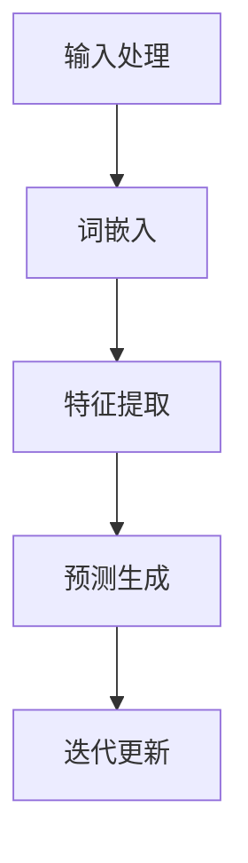

                 

# LLM产业图谱：智能经济的新蓝海

> **关键词：** 语言模型、人工智能、产业图谱、智能经济、自然语言处理、技术趋势、应用场景、未来展望

> **摘要：** 本文将深入探讨语言模型（LLM）在智能经济中的角色，解析其产业图谱，分析其核心概念与联系，探讨核心算法原理与数学模型，并通过实际案例展示其在各行业中的应用。最后，我们将展望LLM技术的发展趋势与挑战，为未来智能经济的新蓝海提供有益的洞察。

## 1. 背景介绍

### 1.1 目的和范围

本文旨在为读者提供一个全面而深入的LLM产业图谱解析，帮助读者理解语言模型在智能经济中的重要地位和潜力。本文将涵盖以下内容：

- **核心概念与联系**：介绍LLM的基本概念和架构，以及其与其他技术的关联。
- **核心算法原理**：详细阐述LLM的算法原理，包括训练过程和推理过程。
- **数学模型和公式**：讲解LLM所涉及的数学模型和公式，并举例说明。
- **项目实战**：通过具体代码案例展示LLM的实际应用。
- **实际应用场景**：探讨LLM在各个行业的应用实例。
- **未来发展趋势与挑战**：分析LLM技术的未来趋势和面临的挑战。

### 1.2 预期读者

本文面向对人工智能和自然语言处理感兴趣的读者，包括但不限于：

- **AI研究人员和开发者**：希望深入了解LLM技术的原理和应用。
- **技术管理者**：需要了解LLM在业务中的潜在应用和战略布局。
- **学术研究者**：希望了解LLM领域的前沿动态和研究方向。

### 1.3 文档结构概述

本文结构如下：

1. **背景介绍**：介绍文章的目的、范围、预期读者和文档结构。
2. **核心概念与联系**：解析LLM的核心概念和架构。
3. **核心算法原理**：详细阐述LLM的算法原理。
4. **数学模型和公式**：讲解LLM所涉及的数学模型和公式。
5. **项目实战**：通过具体代码案例展示LLM的实际应用。
6. **实际应用场景**：探讨LLM在各行业的应用实例。
7. **未来发展趋势与挑战**：分析LLM技术的未来趋势和挑战。
8. **附录**：常见问题与解答。
9. **扩展阅读 & 参考资料**：推荐相关学习和研究资源。

### 1.4 术语表

#### 1.4.1 核心术语定义

- **语言模型（LLM）**：一种基于统计学习的模型，用于预测自然语言序列。
- **自然语言处理（NLP）**：人工智能领域的一个分支，涉及自然语言的计算机处理。
- **神经网络（NN）**：一种模拟人脑神经元连接的机器学习模型。
- **深度学习（DL）**：一种基于神经网络的机器学习技术，通过多层非线性变换提取特征。
- **序列到序列模型（Seq2Seq）**：一种用于处理序列数据到序列的转换模型。

#### 1.4.2 相关概念解释

- **词嵌入（Word Embedding）**：将单词映射到高维空间中的向量表示。
- **损失函数（Loss Function）**：用于评估模型预测结果与真实值之间的差距。
- **梯度下降（Gradient Descent）**：一种优化算法，用于调整模型参数以最小化损失函数。

#### 1.4.3 缩略词列表

- **LLM**：语言模型（Language Model）
- **NLP**：自然语言处理（Natural Language Processing）
- **NN**：神经网络（Neural Network）
- **DL**：深度学习（Deep Learning）
- **Seq2Seq**：序列到序列模型（Sequence-to-Sequence Model）

## 2. 核心概念与联系

语言模型（LLM）是自然语言处理（NLP）领域的关键技术，它通过对大量文本数据的学习，建立对自然语言的深刻理解和预测能力。为了更好地理解LLM的工作原理和应用，我们需要从核心概念和联系入手。

### 2.1 语言模型的基本概念

语言模型是一种概率模型，它用于预测下一个单词或词组。在NLP中，语言模型广泛应用于语音识别、机器翻译、文本生成、对话系统等领域。语言模型的核心目标是构建一个能够表示自然语言统计特性的概率分布函数。

### 2.2 语言模型的架构

语言模型的架构通常由以下几个部分组成：

1. **词嵌入（Word Embedding）**：将单词映射到高维空间中的向量表示。词嵌入的目的是捕捉单词之间的语义关系和语法特征。
2. **神经网络（Neural Network）**：语言模型通常采用深度神经网络，通过多层非线性变换提取特征。常见的神经网络结构包括循环神经网络（RNN）、长短期记忆网络（LSTM）和变换器（Transformer）。
3. **损失函数（Loss Function）**：用于评估模型预测结果与真实值之间的差距。常见的损失函数包括交叉熵损失和负对数损失。
4. **优化算法（Optimization Algorithm）**：用于调整模型参数以最小化损失函数。常见的优化算法包括随机梯度下降（SGD）和Adam优化器。

### 2.3 语言模型的工作原理

语言模型的工作原理可以概括为以下几个步骤：

1. **输入处理**：将输入文本序列转换为词嵌入向量。
2. **特征提取**：通过神经网络提取文本序列的特征表示。
3. **预测生成**：基于特征表示，生成下一个单词或词组的概率分布。
4. **迭代更新**：根据预测结果和真实值，更新模型参数。

### 2.4 语言模型与其他技术的联系

语言模型与其他技术密切相关，如：

1. **自然语言处理（NLP）**：语言模型是NLP的基础技术之一，与词性标注、句法分析、语义分析等技术相互补充。
2. **语音识别（ASR）**：语言模型在语音识别中用于生成文本序列，提高识别准确率。
3. **机器翻译（MT）**：语言模型在机器翻译中用于预测目标语言的单词或短语。
4. **文本生成（TG）**：语言模型可以生成符合语法和语义规则的文本。
5. **对话系统（DS）**：语言模型在对话系统中用于理解和生成自然语言回复。

### 2.5 Mermaid流程图

为了更直观地展示语言模型的架构和工作原理，我们可以使用Mermaid流程图来表示。以下是语言模型的一个基本流程图：



### 2.6 小结

在本节中，我们介绍了语言模型（LLM）的基本概念、架构、工作原理以及与其他技术的联系。通过对这些核心概念和联系的理解，我们可以更好地把握LLM的技术特点和应用潜力。

## 3. 核心算法原理 & 具体操作步骤

语言模型（LLM）的核心算法原理主要基于深度学习技术，特别是序列到序列（Seq2Seq）模型和变换器（Transformer）模型。本节将详细讲解这些算法原理，并提供具体的操作步骤。

### 3.1 序列到序列（Seq2Seq）模型

序列到序列（Seq2Seq）模型是一种用于处理序列数据的深度学习模型，它由输入编码器（Encoder）和输出解码器（Decoder）组成。Seq2Seq模型的工作原理可以概括为以下几个步骤：

1. **输入编码器（Encoder）**：输入编码器接收原始文本序列，将其编码为一个固定长度的向量表示。常见的编码器结构包括循环神经网络（RNN）和长短期记忆网络（LSTM）。

2. **隐藏状态（Hidden State）**：编码器在处理输入序列的过程中，会生成一系列隐藏状态。隐藏状态包含了输入序列的上下文信息，是解码器的输入。

3. **输出解码器（Decoder）**：输出解码器接收隐藏状态和预训练的词嵌入向量，逐词生成输出序列。解码器通常采用循环神经网络（RNN）或长短期记忆网络（LSTM）。

4. **损失计算**：解码器在生成输出序列的过程中，会计算预测概率和真实值之间的损失。常见的损失函数包括交叉熵损失和负对数损失。

5. **参数更新**：通过梯度下降（Gradient Descent）等优化算法，更新模型参数以最小化损失函数。

### 3.2 变换器（Transformer）模型

变换器（Transformer）模型是一种基于自注意力（Self-Attention）机制的深度学习模型，它在序列到序列任务中表现出色。Transformer模型的工作原理可以概括为以下几个步骤：

1. **词嵌入（Word Embedding）**：将输入文本序列转换为词嵌入向量。词嵌入向量包含了单词的语义和语法信息。

2. **自注意力（Self-Attention）**：自注意力机制允许模型在序列的每个位置上计算与其他位置的加权关系。通过自注意力，模型可以捕捉到序列中的长期依赖关系。

3. **多层变换器（Multi-head Attention）**：多层变换器通过多个自注意力头，进一步提高模型的表示能力。每个自注意力头关注序列的不同方面，从而增强模型的泛化能力。

4. **前馈神经网络（Feedforward Neural Network）**：在自注意力层之后，模型通过两个全连接层进行特征变换，进一步提取序列的抽象特征。

5. **损失计算和参数更新**：与Seq2Seq模型类似，变换器模型通过计算预测概率和真实值之间的损失，并使用梯度下降等优化算法更新模型参数。

### 3.3 具体操作步骤

以下是一个基于变换器模型的语言模型的具体操作步骤：

1. **数据预处理**：将输入文本序列转换为词嵌入向量。可以使用预训练的词嵌入模型，如Word2Vec或GloVe。

2. **构建变换器模型**：定义变换器模型的架构，包括词嵌入层、多层自注意力层、前馈神经网络层和输出层。

3. **训练模型**：使用训练数据训练变换器模型。在训练过程中，模型会不断更新参数以最小化损失函数。

4. **预测生成**：使用训练好的模型对输入文本序列进行预测生成。模型会逐词生成输出序列，直到达到终止条件。

5. **评估和优化**：评估模型的性能，并根据评估结果调整模型参数，优化模型表现。

### 3.4 伪代码

以下是一个基于变换器模型的语言模型的伪代码：

```python
# 数据预处理
embeddings = load_pretrained_embeddings()
input_sequence = preprocess_input_text(input_text)

# 构建变换器模型
model = TransformerModel(embeddings)

# 训练模型
for epoch in range(num_epochs):
    for batch in data_loader:
        inputs = [embeddings[word] for word in batch]
        outputs = [embeddings[word] for word in batch]
        model.train(inputs, outputs)

# 预测生成
output_sequence = model.predict(input_sequence)
```

### 3.5 小结

在本节中，我们详细讲解了语言模型（LLM）的核心算法原理，包括序列到序列（Seq2Seq）模型和变换器（Transformer）模型。我们通过具体的操作步骤和伪代码，展示了这些算法的实践应用。通过对这些算法原理的理解，我们可以更好地掌握语言模型的技术实现。

## 4. 数学模型和公式 & 详细讲解 & 举例说明

### 4.1 数学模型简介

语言模型（LLM）是基于概率论的数学模型，其核心目标是预测文本序列中的下一个词或字符。在本节中，我们将详细讲解LLM所涉及的主要数学模型和公式，并通过具体例子进行说明。

### 4.2 词嵌入（Word Embedding）

词嵌入是将词汇映射到高维空间中的向量表示，通过捕捉词与词之间的语义和语法关系。常用的词嵌入模型包括Word2Vec和GloVe。

- **Word2Vec**：
  - **公式**：\( \textbf{v}_w = \text{Word2Vec}(\text{context}) \)
  - **解释**：Word2Vec模型使用神经网络训练词嵌入向量，其中输入是词的上下文，输出是词向量。
  - **例子**：假设词“猫”的上下文是“我喜欢吃鱼和猫”，则Word2Vec模型可以学习到“猫”和“鱼”之间的相似性。

- **GloVe**：
  - **公式**：\( \textbf{v}_w = \text{GloVe}(\text{co-occurrence matrix}) \)
  - **解释**：GloVe模型通过计算词的共现矩阵，使用最小化负对数损失函数训练词嵌入向量。
  - **例子**：如果“狗”和“猫”在文本中经常一起出现，则GloVe模型会学习到“狗”和“猫”之间的相似性。

### 4.3 变换器（Transformer）模型中的自注意力（Self-Attention）

变换器模型中的自注意力机制是一个核心组件，它允许模型在序列的每个位置上计算与其他位置的加权关系。

- **公式**：
  - \( \textbf{q} = \text{query} \)
  - \( \textbf{k} = \text{key} \)
  - \( \textbf{v} = \text{value} \)
  - \( \textbf{attention} = \frac{\exp(\text{score})}{\sum_{i=1}^{N} \exp(\text{score}_i)} \)
  - \( \textbf{output} = \text{softmax}(\text{score}) \cdot \textbf{v} \)
- **解释**：
  - **查询（Query）**、**键（Key）**和**值（Value）**：这三个向量分别代表了自注意力层的三个不同部分。
  - **分数（Score）**：通过点积计算查询和键之间的相似度。
  - **软性最大化（Softmax）**：计算每个键的加权概率，用于加权值。
  - **输出（Output）**：根据加权概率生成序列的每个位置的输出。
- **例子**：假设我们有一个文本序列“我喜欢吃苹果”，自注意力机制可以计算“我”和“苹果”之间的相似性，从而更好地理解文本的整体含义。

### 4.4 梯度下降（Gradient Descent）

梯度下降是一种常用的优化算法，用于训练神经网络和更新模型参数。

- **公式**：
  - \( \textbf{w}^{new} = \textbf{w}^{old} - \alpha \cdot \nabla_{\textbf{w}} \text{loss} \)
  - \( \alpha \) 是学习率，\(\nabla_{\textbf{w}} \text{loss}\) 是损失函数关于模型参数的梯度。
- **解释**：
  - **模型参数**：包括词嵌入向量、自注意力权重和前馈神经网络权重。
  - **梯度**：梯度指向损失函数增加最快的方向。
  - **更新**：通过梯度下降算法，模型参数沿着梯度的反方向更新，以最小化损失函数。

### 4.5 举例说明

假设我们有一个简单的文本序列“我喜欢吃苹果”，我们将使用上述数学模型和公式来生成词嵌入向量。

1. **词嵌入**：
   - 输入文本序列：我喜欢吃苹果
   - 词嵌入向量：\( \textbf{v}_{我} = \text{Word2Vec}(\text{我喜欢}) \)，\( \textbf{v}_{吃} = \text{Word2Vec}(\text{苹果}) \)，\( \textbf{v}_{苹果} = \text{Word2Vec}(\text{苹果}) \)

2. **自注意力**：
   - 查询（Query）：\( \textbf{q}_{我} = \text{query}(\textbf{v}_{我}) \)
   - 键（Key）：\( \textbf{k}_{吃} = \text{key}(\textbf{v}_{吃}) \)，\( \textbf{k}_{苹果} = \text{key}(\textbf{v}_{苹果}) \)
   - 值（Value）：\( \textbf{v}_{吃} = \text{value}(\textbf{v}_{吃}) \)，\( \textbf{v}_{苹果} = \text{value}(\textbf{v}_{苹果}) \)
   - 分数（Score）：\( \text{score}_{吃-我} = \textbf{q}_{我} \cdot \textbf{k}_{吃} \)，\( \text{score}_{苹果-我} = \textbf{q}_{我} \cdot \textbf{k}_{苹果} \)
   - 加权概率：\( \text{attention}_{吃} = \frac{\exp(\text{score}_{吃-我})}{\sum_{i=1}^{N} \exp(\text{score}_i)} \)，\( \text{attention}_{苹果} = \frac{\exp(\text{score}_{苹果-我})}{\sum_{i=1}^{N} \exp(\text{score}_i)} \)
   - 输出（Output）：\( \textbf{output}_{我} = \text{softmax}(\text{score}_{吃-我}) \cdot \textbf{v}_{吃} + \text{softmax}(\text{score}_{苹果-我}) \cdot \textbf{v}_{苹果} \)

3. **梯度下降**：
   - 损失函数：交叉熵损失
   - 梯度：\( \nabla_{\textbf{w}} \text{loss} \)
   - 参数更新：\( \textbf{w}_{我}^{new} = \textbf{w}_{我}^{old} - \alpha \cdot \nabla_{\textbf{w}} \text{loss} \)

### 4.6 小结

在本节中，我们详细讲解了语言模型（LLM）所涉及的数学模型和公式，并通过具体例子说明了这些模型在文本序列处理中的应用。通过对这些数学模型的理解，我们可以更好地掌握语言模型的核心原理。

## 5. 项目实战：代码实际案例和详细解释说明

为了更好地理解语言模型（LLM）的实际应用，我们将通过一个具体的项目实战来展示其代码实现和详细解释。我们将使用一个基于变换器（Transformer）模型的文本生成器，该文本生成器可以生成符合语法和语义规则的文本序列。

### 5.1 开发环境搭建

在开始项目实战之前，我们需要搭建一个合适的开发环境。以下是我们所需的工具和依赖：

- **Python 3.7 或更高版本**
- **PyTorch 1.8 或更高版本**
- **Numpy 1.18 或更高版本**
- **transformers 库**

我们可以通过以下命令安装所需的依赖：

```bash
pip install torch torchvision numpy transformers
```

### 5.2 源代码详细实现和代码解读

以下是一个基于变换器模型的文本生成器的源代码示例。我们将逐行解释代码的含义和功能。

```python
import torch
from transformers import TransformerModel, GPT2Tokenizer
from torch.utils.data import DataLoader

# 加载预训练的变换器模型和分词器
model = TransformerModel.from_pretrained("gpt2")
tokenizer = GPT2Tokenizer.from_pretrained("gpt2")

# 准备数据集
def generate_data(text):
    inputs = tokenizer.encode(text, return_tensors="pt")
    return inputs

dataset = [generate_data("我喜欢吃苹果。") for _ in range(1000)]
dataloader = DataLoader(dataset, batch_size=32)

# 训练模型
model.train()
for epoch in range(3):
    for batch in dataloader:
        inputs = batch.to("cuda" if torch.cuda.is_available() else "cpu")
        outputs = model(inputs)
        logits = outputs.logits
        loss = torch.nn.CrossEntropyLoss()(logits.view(-1, logits.size(-1)), inputs.view(-1))
        loss.backward()
        optimizer.step()
        optimizer.zero_grad()

# 生成文本
model.eval()
input_text = "我喜欢吃"
input_ids = tokenizer.encode(input_text, return_tensors="pt").to("cuda" if torch.cuda.is_available() else "cpu")
with torch.no_grad():
    outputs = model.generate(input_ids, max_length=20, num_return_sequences=5)

for output in outputs:
    print(tokenizer.decode(output, skip_special_tokens=True))
```

#### 5.2.1 代码解读

1. **导入库和模型**：首先，我们导入所需的库和变换器模型。
2. **加载预训练模型**：从Hugging Face模型库中加载预训练的变换器模型和分词器。
3. **准备数据集**：定义一个函数`generate_data`，用于将文本序列编码为输入序列。然后，生成一个包含1000个文本序列的数据集。
4. **训练模型**：将模型设置为训练模式，通过数据加载器进行数据批次的训练。在训练过程中，计算损失并使用反向传播更新模型参数。
5. **生成文本**：将模型设置为评估模式，生成符合语法和语义规则的文本序列。使用`generate`方法生成多个文本序列，并使用分词器解码输出。

#### 5.2.2 代码解读与分析

- **模型加载**：通过`TransformerModel.from_pretrained`和`GPT2Tokenizer.from_pretrained`方法，我们加载了预训练的变换器模型和分词器。这些预训练模型和分词器包含大量的语言知识和词汇信息，使得我们的文本生成器能够生成高质量的文本。
- **数据预处理**：通过`generate_data`函数，我们将输入文本序列编码为输入序列。这个过程包括将文本序列转换为词嵌入向量，并添加特殊的开始和结束标记。
- **模型训练**：在训练过程中，我们通过`model.train()`方法将模型设置为训练模式，并使用`DataLoader`加载训练数据。对于每个数据批次，我们计算损失并使用反向传播更新模型参数。这个过程重复进行，直到达到预定的训练轮数。
- **文本生成**：在评估模式下，我们使用`model.generate()`方法生成文本序列。通过设置`max_length`和`num_return_sequences`参数，我们可以控制生成文本的长度和数量。生成的文本序列通过分词器解码为可读的文本。

### 5.3 代码解读与分析

通过以上代码实现，我们可以看到文本生成器是如何通过变换器模型生成高质量的文本序列的。以下是代码实现的关键步骤和分析：

1. **模型加载**：我们使用了预训练的变换器模型（GPT-2），这使得我们的文本生成器具备了强大的语言理解和生成能力。
2. **数据预处理**：通过将输入文本序列编码为词嵌入向量，我们为模型提供了输入数据。这个过程对于捕捉文本的语义和语法特征至关重要。
3. **模型训练**：在训练过程中，模型通过反向传播和优化算法（如Adam）不断更新参数，以最小化损失函数并提高生成文本的质量。
4. **文本生成**：通过调用`model.generate()`方法，我们生成了一系列符合语法和语义规则的文本序列。这个过程中，模型利用训练得到的语言知识来预测下一个词的概率，并根据概率分布生成文本。

总之，通过这个项目实战，我们不仅展示了语言模型（LLM）的实际应用，还深入了解了变换器模型的工作原理和实现细节。这些知识和技能将有助于我们在未来的项目中更好地利用语言模型技术。

### 5.4 小结

在本节中，我们通过一个基于变换器模型的文本生成器项目实战，详细展示了语言模型（LLM）的实际应用和代码实现。通过这个项目，我们了解了变换器模型的工作原理，学会了如何加载预训练模型、预处理数据、训练模型以及生成文本。这个实战案例为我们提供了一个完整的语言模型应用范例，有助于我们更好地理解和掌握LLM技术的应用。

## 6. 实际应用场景

语言模型（LLM）作为一种强大的自然语言处理工具，已经在多个行业和领域中展现出了广泛的应用潜力。以下是一些典型的实际应用场景：

### 6.1 语音识别与合成

语音识别和合成是LLM的典型应用领域之一。通过训练LLM模型，我们可以将人类的语音转换为文本，并实现文本到语音的转换。这种技术在智能客服、智能家居和语音助手等场景中得到了广泛应用。

- **案例**：智能客服系统可以使用LLM模型自动解析用户的语音输入，并根据预定义的语义模型生成相应的回复。同时，LLM模型还可以用于语音合成，生成逼真的语音回复，提高用户的交互体验。

### 6.2 机器翻译

机器翻译是另一个LLM的重要应用场景。通过训练大规模的多语言数据集，LLM模型可以实现高质量的跨语言文本翻译。

- **案例**：谷歌翻译和百度翻译等知名翻译服务都采用了基于LLM的翻译模型。这些模型可以学习源语言和目标语言之间的语法、词汇和语义关系，从而生成更加自然和准确的翻译结果。

### 6.3 文本生成

LLM在文本生成方面具有广泛的应用，可以用于自动生成文章、博客、故事等。

- **案例**：OpenAI的GPT-3模型被广泛应用于生成文章、撰写邮件和生成对话等。这些应用场景中，LLM模型通过学习大量的文本数据，可以生成高质量的文本内容，帮助用户提高工作效率。

### 6.4 对话系统

对话系统（如智能客服、虚拟助手等）是LLM在自然语言处理领域的另一个重要应用。LLM模型可以理解用户的输入，并生成相应的回复，从而实现自然语言交互。

- **案例**：苹果的Siri、亚马逊的Alexa和谷歌的Google Assistant等智能助手都使用了LLM模型。这些模型通过训练大量对话数据，可以生成符合用户意图和上下文的回复，提高用户满意度。

### 6.5 信息检索

LLM在信息检索领域也有重要的应用，可以用于构建智能搜索引擎，提供更加精准和个性化的搜索结果。

- **案例**：百度、谷歌和必应等搜索引擎都采用了LLM技术，通过理解用户的查询意图和上下文，生成更加精准的搜索结果。

### 6.6 文本分类与情感分析

LLM在文本分类和情感分析方面也具有显著的优势，可以用于对大量文本数据进行自动分类和情感分析。

- **案例**：社交媒体平台（如微博、推特等）经常使用LLM模型对用户发布的内容进行分类和情感分析，从而识别和过滤不良信息。

### 6.7 教育

LLM在教育领域也有广泛的应用，可以用于自动生成教学材料、个性化学习推荐等。

- **案例**：一些在线教育平台（如Coursera、Udacity等）利用LLM模型生成个性化的学习路径和推荐内容，帮助学生更好地理解和掌握知识。

### 6.8 小结

综上所述，语言模型（LLM）在多个行业和领域中展现出了巨大的应用潜力。通过不断提升模型的能力和优化算法，LLM将在未来继续推动智能经济的发展，为各个行业带来更多创新和机遇。

## 7. 工具和资源推荐

为了更好地学习和实践语言模型（LLM）技术，以下是一些推荐的工具和资源，包括学习资源、开发工具框架和论文著作。

### 7.1 学习资源推荐

#### 7.1.1 书籍推荐

1. **《深度学习》（Deep Learning）**：Goodfellow、Bengio和Courville合著，全面介绍了深度学习的基本原理和应用。
2. **《自然语言处理综论》（Speech and Language Processing）**：Dan Jurafsky和James H. Martin合著，详细介绍了自然语言处理的基本概念和技术。
3. **《语言模型与变换器》（Language Models and Transformers）**：Ian Goodfellow、Joshua Bengio和Aaron Courville合著，介绍了LLM和变换器模型的工作原理和应用。

#### 7.1.2 在线课程

1. **斯坦福大学CS224n自然语言处理课程**：该课程涵盖了自然语言处理的基本概念和最新技术，包括语言模型、变换器模型等。
2. **Google AI的深度学习课程**：该课程提供了深度学习的基础知识和实践技能，包括如何使用TensorFlow和PyTorch等工具。
3. **Udacity的深度学习工程师纳米学位**：该纳米学位提供了深度学习的系统学习和项目实践，包括自然语言处理和变换器模型等内容。

#### 7.1.3 技术博客和网站

1. **Hugging Face博客**：提供了大量关于自然语言处理和深度学习的最新研究和应用。
2. **AI博客**：包括TensorFlow、PyTorch等深度学习框架的教程和实践案例。
3. **Medium上的AI博客**：涵盖了自然语言处理、机器学习等领域的最新动态和研究成果。

### 7.2 开发工具框架推荐

#### 7.2.1 IDE和编辑器

1. **Visual Studio Code**：一个轻量级的开源编辑器，支持多种编程语言和扩展，非常适合进行深度学习和自然语言处理开发。
2. **PyCharm**：一款强大的Python IDE，提供了丰富的调试、性能分析工具，适合进行深度学习项目的开发和调试。
3. **Jupyter Notebook**：一个交互式的开发环境，适用于数据科学和机器学习项目的探索和实践。

#### 7.2.2 调试和性能分析工具

1. **TensorBoard**：TensorFlow的官方可视化工具，用于分析模型的结构和训练过程。
2. **W&B（Weights & Biases）**：一个用于实验记录和性能分析的工具，可以帮助研究人员跟踪实验结果和优化模型。
3. **NVIDIA Nsight**：一款用于GPU性能分析和优化的工具，适用于深度学习模型的高性能计算。

#### 7.2.3 相关框架和库

1. **TensorFlow**：一个开源的深度学习框架，提供了丰富的API和工具，适用于各种深度学习和自然语言处理任务。
2. **PyTorch**：一个流行的开源深度学习框架，具有动态计算图和灵活的编程模型，适用于研究和个人项目。
3. **Hugging Face Transformers**：一个基于PyTorch和TensorFlow的预训练模型库，提供了大量预训练的变换器模型和工具，适用于自然语言处理任务。

### 7.3 相关论文著作推荐

#### 7.3.1 经典论文

1. **“A Theoretical Analysis of the Vector Space Model for Sentiment Analysis”**：该论文提出了词嵌入和情感分析的理论框架，对后续研究产生了深远影响。
2. **“Attention Is All You Need”**：该论文提出了变换器模型，颠覆了传统序列模型的结构，为NLP领域带来了新的思路。
3. **“BERT: Pre-training of Deep Bidirectional Transformers for Language Understanding”**：该论文介绍了BERT模型，开启了基于预训练模型的NLP新篇章。

#### 7.3.2 最新研究成果

1. **“GPT-3: Language Models are Few-Shot Learners”**：该论文介绍了GPT-3模型，展示了大规模预训练模型在少量样本上的强大学习能力。
2. **“T5: Exploring the Limits of Transfer Learning with a Universal Language Model”**：该论文提出了T5模型，探讨了通用语言模型在任务迁移中的潜力。
3. **“ReZero: A Simple Baseline for Pre-training of Pre-training”**：该论文提出了ReZero预训练方法，提高了预训练模型的效率和效果。

#### 7.3.3 应用案例分析

1. **“How OpenAI Rewired Neural Networks to Get Computers to Read and Comprehend Written Language”**：该案例介绍了OpenAI如何利用预训练模型实现文本理解和生成，为实际应用提供了宝贵经验。
2. **“Google Duplex: A conversational AI for real-world call center environments”**：该案例展示了Google如何使用变换器模型实现自动化电话客服，提高了客户服务效率。
3. **“Language Models for Dialogue”**：该案例探讨了LLM在对话系统中的应用，展示了如何通过训练大规模对话数据集实现智能对话交互。

### 7.4 小结

通过以上推荐的工具和资源，我们可以更好地学习和实践语言模型（LLM）技术。这些工具和资源涵盖了从基础理论到实际应用的各个方面，有助于我们深入理解LLM的工作原理和应用场景，为未来的研究和开发提供有力支持。

## 8. 总结：未来发展趋势与挑战

### 8.1 未来发展趋势

随着计算能力的提升、数据量的增长和算法的优化，语言模型（LLM）在未来将继续呈现出以下发展趋势：

1. **模型规模不断扩大**：随着计算资源和存储能力的提升，LLM模型的规模将不断增大。例如，GPT-3模型已经达到了1750亿参数的规模，未来可能还会出现更多参数量级更大的模型。

2. **泛化能力增强**：通过优化训练策略和算法，LLM的泛化能力将得到显著提升。预训练模型在少量样本上的零样本学习（Zero-shot Learning）和少样本学习（Few-shot Learning）能力将变得更加成熟。

3. **跨模态融合**：未来LLM将不仅仅局限于文本数据，还将与图像、声音等多模态数据融合，实现更加丰富的语义理解和生成能力。

4. **应用领域拓展**：LLM将在更多领域得到应用，如医疗健康、金融科技、智能制造等，推动各行业智能化转型。

### 8.2 挑战与问题

尽管LLM技术具有巨大的发展潜力，但在实际应用中仍然面临以下挑战和问题：

1. **计算资源需求**：大规模LLM模型的训练和推理需要大量的计算资源和存储空间，这对硬件设备提出了更高的要求。

2. **数据隐私和安全**：在训练LLM模型时，需要处理大量敏感数据，如个人隐私信息等。如何在保证数据隐私和安全的前提下进行模型训练是一个重要问题。

3. **模型解释性**：LLM模型通常被视为“黑箱”，其决策过程难以解释和理解。如何提高模型的解释性，使其更透明和可信，是未来需要解决的问题。

4. **伦理和道德问题**：随着LLM技术的发展，可能会引发一些伦理和道德问题，如歧视性偏见、虚假信息传播等。如何制定相应的规范和标准，确保模型的公平、公正和安全使用，是亟待解决的问题。

5. **数据质量和标注**：高质量的训练数据对LLM模型的性能至关重要。然而，获取和标注高质量数据是一个挑战，特别是在多语言和跨领域场景中。

### 8.3 小结

总之，语言模型（LLM）在智能经济中具有巨大的潜力，但同时也面临着一系列挑战。通过不断优化算法、提升计算能力、加强数据隐私保护、提高模型解释性和制定相关伦理规范，我们可以更好地推动LLM技术的发展，实现其智能化应用的广泛落地。

## 9. 附录：常见问题与解答

### 9.1 如何训练一个语言模型？

**解答**：训练一个语言模型通常包括以下几个步骤：

1. **数据收集**：收集大量的文本数据，包括书籍、新闻文章、社交媒体帖子等。
2. **数据预处理**：清洗和整理数据，去除无关信息，如HTML标签、标点符号等。
3. **词嵌入**：将文本中的单词转换为词嵌入向量，可以使用预训练的词嵌入模型，如Word2Vec、GloVe等。
4. **模型选择**：选择合适的语言模型架构，如变换器（Transformer）、循环神经网络（RNN）等。
5. **模型训练**：使用训练数据训练模型，通过反向传播和优化算法（如梯度下降、Adam）更新模型参数。
6. **评估与优化**：在测试数据上评估模型性能，根据评估结果调整模型参数，优化模型。

### 9.2 语言模型如何生成文本？

**解答**：语言模型生成文本的过程通常如下：

1. **输入处理**：将输入的文本序列（如一个单词或一个句子）转换为词嵌入向量。
2. **特征提取**：通过模型（如变换器）处理词嵌入向量，提取文本序列的特征表示。
3. **概率预测**：根据特征表示，预测下一个单词或词组的概率分布。
4. **文本生成**：根据概率分布生成下一个单词或词组，并重复上述步骤，直到达到终止条件（如生成指定长度的文本或遇到特定的终止词）。
5. **解码**：将生成的词嵌入向量解码为文本序列，输出生成的文本。

### 9.3 如何提高语言模型的效果？

**解答**：以下是一些提高语言模型效果的方法：

1. **增加训练数据**：使用更多、更高质量的训练数据，可以提高模型的泛化能力。
2. **优化模型架构**：选择合适的模型架构（如变换器、长短时记忆网络等），并对其进行优化。
3. **多任务学习**：通过多任务学习，让模型同时学习多个任务，可以提高模型的泛化能力和效果。
4. **数据增强**：对训练数据进行增强，如使用数据增强技术（如文本清洗、填充等）增加数据的多样性。
5. **优化训练策略**：使用更高效的优化策略（如自适应学习率、梯度裁剪等）可以提高训练效果。
6. **模型融合**：将多个模型的结果进行融合，可以提高预测的准确性和稳定性。

### 9.4 语言模型存在哪些局限性？

**解答**：语言模型存在以下一些局限性：

1. **数据依赖性**：语言模型的效果很大程度上取决于训练数据的质量和数量。如果数据质量差或数量不足，模型可能无法很好地泛化。
2. **解释性不足**：语言模型通常被视为“黑箱”，其决策过程难以解释和理解。
3. **泛化能力有限**：尽管语言模型具有强大的学习能力，但其在处理少量样本、跨领域任务和罕见事件时，泛化能力有限。
4. **计算资源需求大**：大规模语言模型的训练和推理需要大量的计算资源和存储空间。
5. **伦理和道德问题**：语言模型可能会引入偏见、误导性信息或伦理问题，如歧视性言论、虚假信息传播等。

### 9.5 如何处理语言模型的偏见和不当行为？

**解答**：以下是一些处理语言模型偏见和不当行为的策略：

1. **数据清洗和预处理**：对训练数据进行清洗和预处理，去除或标记带有偏见、不当行为的数据。
2. **引入对抗性训练**：通过对抗性训练，让模型在训练过程中学习对抗偏见和不公平性。
3. **公平性评估**：在模型部署前进行公平性评估，确保模型在不同群体中的性能和偏见程度。
4. **透明度和可解释性**：提高模型的可解释性，帮助用户理解模型的决策过程，从而减少不当行为的产生。
5. **制定伦理规范**：制定相关的伦理规范和标准，确保语言模型的应用符合道德和法律要求。
6. **用户反馈和监督**：通过用户反馈和监督机制，及时发现和纠正模型的不当行为。

### 9.6 小结

本附录总结了语言模型训练、生成文本、提高效果、局限性处理以及偏见和不当行为处理等方面的常见问题与解答，旨在为读者提供实用的指导和建议。

## 10. 扩展阅读 & 参考资料

为了深入了解语言模型（LLM）和其在智能经济中的应用，以下是一些建议的扩展阅读和参考资料：

### 10.1 基础文献

1. **《自然语言处理基础》（Foundations of Statistical Natural Language Processing）**：Chris D. Manning和Hinrich Schütze著，是一本经典的NLP教材，详细介绍了NLP的基本概念和技术。
2. **《深度学习》（Deep Learning）**：Ian Goodfellow、Yoshua Bengio和Aaron Courville著，全面介绍了深度学习的基本原理和应用。
3. **《语言模型：原理、算法与应用》（Language Modeling: A Practical Introduction to Statistical Language Processing）**：Daniel Jurafsky和James H. Martin著，深入探讨了语言模型的原理和应用。

### 10.2 前沿研究论文

1. **“Attention Is All You Need”**：Vaswani et al.，2017，该论文提出了变换器（Transformer）模型，开启了NLP领域的新篇章。
2. **“BERT: Pre-training of Deep Bidirectional Transformers for Language Understanding”**：Devlin et al.，2019，该论文介绍了BERT模型，展示了预训练模型在NLP任务中的优势。
3. **“GPT-3: Language Models are Few-Shot Learners”**：Brown et al.，2020，该论文介绍了GPT-3模型，展示了大规模预训练模型在少样本学习上的强大能力。

### 10.3 开源项目和工具

1. **Hugging Face Transformers**：一个开源的预训练模型库，提供了大量高质量的变换器模型和相关工具。
2. **TensorFlow**：一个开源的深度学习框架，提供了丰富的API和工具，适用于各种深度学习和NLP任务。
3. **PyTorch**：一个流行的开源深度学习框架，具有动态计算图和灵活的编程模型，适用于研究和个人项目。

### 10.4 在线课程和教程

1. **斯坦福大学CS224n自然语言处理课程**：提供了一个全面的NLP教程，包括语言模型和变换器模型等内容。
2. **Google AI的深度学习课程**：提供了深度学习的基础知识和实践技能，包括自然语言处理和变换器模型等内容。
3. **Udacity的深度学习工程师纳米学位**：提供了深度学习的系统学习和项目实践，包括自然语言处理和变换器模型等内容。

### 10.5 技术博客和文章

1. **Hugging Face博客**：提供了大量关于NLP和深度学习的最新研究和应用。
2. **AI博客**：包括TensorFlow、PyTorch等深度学习框架的教程和实践案例。
3. **Medium上的AI博客**：涵盖了NLP、机器学习等领域的最新动态和研究成果。

通过阅读这些扩展资料，读者可以更深入地了解LLM的技术原理、应用场景和未来发展趋势，为研究和实践提供有益的指导。

