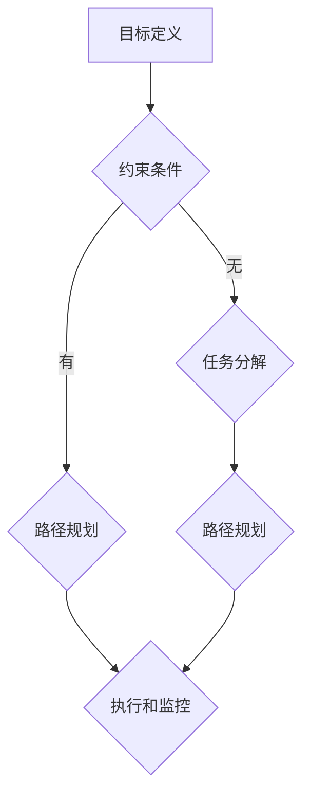

                 

# LLM任务规划：推理能力的扩展

> 关键词：语言模型、任务规划、推理能力、算法原理、数学模型、项目实战、实际应用

> 摘要：本文将深入探讨语言模型在任务规划中的应用，重点研究如何通过扩展推理能力来提升任务规划的效率和准确性。文章首先介绍了语言模型的基本概念和任务规划的相关背景，然后详细分析了核心算法原理和具体操作步骤，以及数学模型和公式的应用。接下来，通过一个实际项目案例，对代码实现进行详细解释和说明。文章还探讨了语言模型在任务规划中的实际应用场景，并推荐了相关工具和资源。最后，对未来的发展趋势和挑战进行了总结，并回答了常见问题。

## 1. 背景介绍

### 1.1 目的和范围

随着人工智能技术的不断发展，语言模型（Language Model，简称LLM）在自然语言处理（Natural Language Processing，简称NLP）领域取得了显著成果。LLM是一种能够对自然语言文本进行建模和预测的算法，其广泛应用于机器翻译、文本生成、问答系统等任务中。然而，在任务规划（Task Planning）领域，LLM的推理能力仍有待提高。本文旨在研究如何扩展LLM的推理能力，以实现更高效、更准确的任务规划。

本文的研究范围主要包括以下几个方面：

1. 分析任务规划中LLM的应用现状，指出现有方法的局限性。
2. 提出一种基于扩展推理能力的LLM任务规划算法，并详细阐述其原理和实现步骤。
3. 利用数学模型和公式，对算法的推理过程进行详细分析。
4. 通过实际项目案例，验证所提出算法的有效性，并对代码实现进行详细解释和说明。
5. 探讨LLM在任务规划中的实际应用场景，并推荐相关工具和资源。

### 1.2 预期读者

本文的预期读者主要包括以下几类：

1. 自然语言处理和人工智能领域的科研人员，对任务规划和LLM技术有兴趣的读者。
2. 任务规划工程师和软件开发者，希望了解如何利用LLM提升任务规划性能的读者。
3. 对计算机科学和人工智能领域感兴趣的学生，希望通过本文学习任务规划和LLM相关知识。

### 1.3 文档结构概述

本文将分为以下几个部分：

1. 背景介绍：介绍本文的目的、研究范围、预期读者以及文档结构。
2. 核心概念与联系：介绍任务规划和LLM的相关概念、原理和架构。
3. 核心算法原理 & 具体操作步骤：详细阐述扩展LLM推理能力的任务规划算法原理和实现步骤。
4. 数学模型和公式 & 详细讲解 & 举例说明：利用数学模型和公式，对算法的推理过程进行详细分析。
5. 项目实战：通过实际项目案例，对代码实现进行详细解释和说明。
6. 实际应用场景：探讨LLM在任务规划中的实际应用场景。
7. 工具和资源推荐：推荐学习资源、开发工具框架和相关论文著作。
8. 总结：总结未来发展趋势与挑战。
9. 附录：常见问题与解答。
10. 扩展阅读 & 参考资料：提供本文相关的研究文献和资料。

### 1.4 术语表

本文中涉及的一些关键术语如下：

#### 1.4.1 核心术语定义

- 语言模型（Language Model，简称LLM）：一种对自然语言文本进行建模和预测的算法。
- 任务规划（Task Planning）：根据目标和约束条件，制定一系列步骤以完成任务的过程。
- 推理能力（Reasoning Ability）：对已知信息进行逻辑推导和推理的能力。

#### 1.4.2 相关概念解释

- 自然语言处理（NLP）：研究如何让计算机理解和处理自然语言的技术。
- 人工智能（AI）：模拟人类智能，使计算机能够进行感知、思考、学习和决策的技术。

#### 1.4.3 缩略词列表

- LLM：语言模型
- NLP：自然语言处理
- AI：人工智能
- TPU：任务规划单元
- RNN：循环神经网络
- LSTM：长短时记忆网络
- GRU：门控循环单元

## 2. 核心概念与联系

在深入探讨LLM在任务规划中的应用之前，我们需要了解一些核心概念和它们之间的联系。本节将介绍任务规划和LLM的相关概念、原理和架构，并使用Mermaid流程图来展示它们之间的逻辑关系。

### 2.1 任务规划

任务规划是人工智能领域的一个重要研究方向，其目的是根据目标和约束条件，制定一系列步骤以完成任务。任务规划通常包括以下几个关键环节：

1. **目标定义**：明确任务的目标，例如“将物品从地点A移动到地点B”。
2. **约束条件**：确定任务执行过程中的限制，例如“物品的移动距离不超过10米”、“只能在白天执行任务”等。
3. **任务分解**：将复杂任务分解为若干个子任务，以便更好地管理和执行。
4. **路径规划**：根据目标和约束条件，规划从起点到终点的路径。
5. **执行和监控**：执行规划好的任务，并对任务执行过程进行实时监控。

### 2.2 语言模型

语言模型是一种对自然语言文本进行建模和预测的算法，其核心目标是学习语言的统计规律，从而实现文本生成、翻译、摘要等任务。LLM通常采用深度神经网络（DNN）进行建模，其中常用的模型包括循环神经网络（RNN）、长短时记忆网络（LSTM）和门控循环单元（GRU）等。

### 2.3 Mermaid流程图

为了更好地展示任务规划和LLM之间的联系，我们使用Mermaid流程图来描述它们之间的关系。以下是Mermaid流程图的代码和对应的可视化效果：




在这个流程图中，我们可以看到任务规划和LLM之间的关系：

- **目标定义**和**约束条件**是任务规划的基础，它们决定了后续的任务分解、路径规划和执行监控。
- **任务分解**和**路径规划**可以利用LLM的推理能力来优化和调整，以提高任务规划的效率和准确性。
- **执行和监控**需要对任务执行过程进行实时监控和反馈，以便对任务规划进行调整和优化。

通过上述分析，我们可以看出，LLM在任务规划中具有广泛的应用前景，可以为任务规划提供强大的推理支持。

### 2.4 核心概念原理和架构

在深入探讨LLM在任务规划中的应用之前，我们需要了解一些核心概念原理和架构。以下是任务规划和LLM的核心概念、原理和架构的简要概述：

#### 2.4.1 任务规划原理

任务规划的核心目标是根据目标和约束条件，制定一系列步骤以完成任务。具体来说，任务规划包括以下几个关键环节：

1. **目标定义**：明确任务的目标，例如“将物品从地点A移动到地点B”。
2. **约束条件**：确定任务执行过程中的限制，例如“物品的移动距离不超过10米”、“只能在白天执行任务”等。
3. **任务分解**：将复杂任务分解为若干个子任务，以便更好地管理和执行。
4. **路径规划**：根据目标和约束条件，规划从起点到终点的路径。
5. **执行和监控**：执行规划好的任务，并对任务执行过程进行实时监控。

#### 2.4.2 语言模型原理

语言模型是一种对自然语言文本进行建模和预测的算法，其核心目标是学习语言的统计规律，从而实现文本生成、翻译、摘要等任务。语言模型通常采用深度神经网络（DNN）进行建模，其中常用的模型包括循环神经网络（RNN）、长短时记忆网络（LSTM）和门控循环单元（GRU）等。以下是这些模型的基本原理：

1. **循环神经网络（RNN）**：RNN是一种能够处理序列数据的神经网络，其通过隐藏状态来记住历史信息。然而，传统的RNN存在梯度消失和梯度爆炸的问题，导致训练效果不佳。
2. **长短时记忆网络（LSTM）**：LSTM是一种改进的RNN，通过引入门控机制来控制信息的流动，从而有效地解决了梯度消失和梯度爆炸的问题。LSTM在处理长序列数据时具有较好的性能。
3. **门控循环单元（GRU）**：GRU是LSTM的变体，通过简化门控机制来提高计算效率。GRU在许多应用中取得了与LSTM相近的性能。

#### 2.4.3 任务规划与LLM架构

任务规划和LLM之间的结合，形成了任务规划中的LLM架构。以下是这个架构的简要概述：

1. **输入层**：接收任务目标、约束条件等信息，将其转化为神经网络可以处理的格式。
2. **编码层**：将输入层的信息编码为特征向量，这些特征向量可以表示任务的各种属性和关系。
3. **推理层**：利用LLM的推理能力，对编码层生成的特征向量进行推理，以生成最优的任务规划方案。
4. **输出层**：将推理层生成的任务规划方案转化为具体的执行步骤，并输出执行结果。

通过这个架构，我们可以将任务规划和LLM技术相结合，实现更高效、更准确的任务规划。

## 3. 核心算法原理 & 具体操作步骤

在了解了任务规划和LLM的基本概念和架构之后，我们将进一步探讨如何利用LLM的推理能力来扩展任务规划。本节将详细介绍一个基于扩展推理能力的LLM任务规划算法的原理和具体操作步骤，包括算法的核心概念、伪代码实现和关键步骤的详细描述。

### 3.1 算法核心概念

为了扩展LLM的推理能力，我们引入了一种基于图论和深度学习的方法，称为“图增强语言模型任务规划”（Graph-Enhanced Language Model Task Planning，简称GELMTP）。该方法的核心思想是将任务规划和LLM相结合，通过构建任务图和网络模型来提高任务规划的效率和准确性。以下是算法的核心概念：

1. **任务图**：任务图是一个表示任务分解、约束条件和路径规划的图结构，其中节点表示任务或子任务，边表示任务之间的关系。
2. **网络模型**：网络模型是一个基于深度学习的神经网络模型，用于对任务图进行建模和推理。
3. **图增强**：通过将任务图中的信息嵌入到神经网络中，实现对任务规划和推理的增强。

### 3.2 伪代码实现

以下是GELMTP算法的伪代码实现：

```python
def gelmtp_task_planning(goal, constraints):
    # 步骤1：构建任务图
    task_graph = build_task_graph(goal, constraints)

    # 步骤2：训练网络模型
    model = train_network_model(task_graph)

    # 步骤3：生成任务规划方案
    plan = generate_plan(model, task_graph)

    # 步骤4：评估任务规划方案
    evaluate_plan(plan, goal, constraints)

    return plan
```

### 3.3 步骤详细描述

以下是GELMTP算法的详细操作步骤：

#### 步骤1：构建任务图

构建任务图的目的是将任务规划和LLM相结合，以表示任务分解、约束条件和路径规划。具体步骤如下：

1. **节点生成**：根据任务目标和约束条件，生成任务图中的节点，每个节点表示一个任务或子任务。
2. **边生成**：根据任务之间的关系和约束条件，生成任务图中的边，每个边表示两个任务之间的依赖关系。
3. **图优化**：对任务图进行优化，以消除冗余边和节点，提高图的结构质量。

#### 步骤2：训练网络模型

训练网络模型的目的是通过深度学习算法，学习任务图中的信息，提高任务规划的效率和准确性。具体步骤如下：

1. **数据预处理**：将任务图中的节点和边转化为神经网络可以处理的输入格式，如特征向量。
2. **模型设计**：设计一个基于深度学习的神经网络模型，用于对任务图进行建模和推理。常用的模型结构包括图神经网络（Graph Neural Network，简称GNN）和卷积神经网络（Convolutional Neural Network，简称CNN）。
3. **模型训练**：使用训练数据，对神经网络模型进行训练，以学习任务图中的信息。

#### 步骤3：生成任务规划方案

生成任务规划方案的目的是利用训练好的网络模型，对任务图进行推理，生成最优的任务规划方案。具体步骤如下：

1. **输入生成**：将任务图中的节点和边作为输入，输入到训练好的网络模型中。
2. **推理过程**：利用网络模型，对输入进行推理，生成任务规划方案。
3. **方案优化**：对生成的任务规划方案进行优化，以消除冗余和冲突。

#### 步骤4：评估任务规划方案

评估任务规划方案的目的是对生成的任务规划方案进行评估，以验证其是否符合任务目标和约束条件。具体步骤如下：

1. **方案验证**：对任务规划方案进行验证，以检查其是否满足任务目标和约束条件。
2. **方案评估**：对任务规划方案进行评估，以计算其执行效率和准确性。
3. **方案调整**：根据评估结果，对任务规划方案进行调整和优化。

通过上述步骤，我们可以利用GELMTP算法实现基于扩展推理能力的LLM任务规划。该方法结合了图论和深度学习的优势，能够有效地提高任务规划的效率和准确性。

### 3.4 关键步骤的详细描述

在本节中，我们将对GELMTP算法中的关键步骤进行详细描述，以帮助读者更好地理解算法的实现过程。

#### 步骤1：构建任务图

构建任务图是GELMTP算法的第一步，也是整个算法的核心。以下是构建任务图的详细步骤：

1. **任务分解**：将原始任务分解为若干个子任务，每个子任务对应任务图中的一个节点。
2. **依赖关系分析**：分析子任务之间的依赖关系，将具有依赖关系的子任务连接起来，形成边。
3. **约束条件应用**：根据约束条件，对任务图进行优化，以消除冗余边和节点。
4. **图结构优化**：对任务图进行优化，以提高图的结构质量和推理效率。

#### 步骤2：训练网络模型

训练网络模型是GELMTP算法的第二步，其目的是通过深度学习算法，学习任务图中的信息，提高任务规划的效率和准确性。以下是训练网络模型的详细步骤：

1. **数据预处理**：将任务图中的节点和边转化为神经网络可以处理的输入格式，如特征向量。
2. **模型设计**：设计一个基于深度学习的神经网络模型，用于对任务图进行建模和推理。常用的模型结构包括图神经网络（Graph Neural Network，简称GNN）和卷积神经网络（Convolutional Neural Network，简称CNN）。
3. **模型训练**：使用训练数据，对神经网络模型进行训练，以学习任务图中的信息。训练过程中，可以采用反向传播算法和梯度下降算法，以优化模型参数。

#### 步骤3：生成任务规划方案

生成任务规划方案是GELMTP算法的第三步，其目的是利用训练好的网络模型，对任务图进行推理，生成最优的任务规划方案。以下是生成任务规划方案的详细步骤：

1. **输入生成**：将任务图中的节点和边作为输入，输入到训练好的网络模型中。
2. **推理过程**：利用网络模型，对输入进行推理，生成任务规划方案。推理过程中，可以采用图神经网络（GNN）或卷积神经网络（CNN）等模型结构。
3. **方案优化**：对生成的任务规划方案进行优化，以消除冗余和冲突。优化过程中，可以采用遗传算法、模拟退火算法等优化方法。

#### 步骤4：评估任务规划方案

评估任务规划方案是GELMTP算法的第四步，其目的是对生成的任务规划方案进行评估，以验证其是否符合任务目标和约束条件。以下是评估任务规划方案的详细步骤：

1. **方案验证**：对任务规划方案进行验证，以检查其是否满足任务目标和约束条件。验证过程中，可以采用一致性检验、可执行性检验等方法。
2. **方案评估**：对任务规划方案进行评估，以计算其执行效率和准确性。评估过程中，可以采用完成时间、错误率等指标。
3. **方案调整**：根据评估结果，对任务规划方案进行调整和优化。调整过程中，可以采用反馈调整、自适应调整等方法。

通过以上详细描述，我们可以清楚地了解GELMTP算法的实现过程，从而为实际应用奠定基础。

## 4. 数学模型和公式 & 详细讲解 & 举例说明

在深入探讨LLM任务规划算法的过程中，数学模型和公式起到了至关重要的作用。它们不仅能够帮助我们理解算法的原理，还能够确保算法在具体实现中的准确性和稳定性。本节将详细讲解GELMTP算法中涉及的关键数学模型和公式，并通过具体的例子来说明这些公式的应用。

### 4.1 数学模型

GELMTP算法的核心数学模型主要包括图模型和神经网络模型。以下是对这些模型的详细讲解。

#### 4.1.1 图模型

图模型是GELMTP算法的基础，它用于表示任务图中的节点和边。以下是图模型的关键概念和公式：

1. **节点表示**：节点表示任务或子任务，其特征向量可以用一个多维向量表示。设节点集合为\( V \)，节点的特征向量集合为\( \mathbf{X} \)，其中每个节点\( v \in V \)的特征向量为\( \mathbf{x}_v \)。

   $$ \mathbf{x}_v = [x_{v1}, x_{v2}, \ldots, x_{vn}]^T $$

2. **边表示**：边表示节点之间的依赖关系，其特征可以用一个矩阵表示。设边的集合为\( E \)，边的特征矩阵为\( \mathbf{A} \)，其中\( \mathbf{A}_{ij} \)表示节点\( v_i \)和节点\( v_j \)之间的依赖程度。

   $$ \mathbf{A} = \begin{bmatrix} 
   a_{11} & a_{12} & \ldots & a_{1n} \\
   a_{21} & a_{22} & \ldots & a_{2n} \\
   \vdots & \vdots & \ddots & \vdots \\
   a_{m1} & a_{m2} & \ldots & a_{mn} \\
   \end{bmatrix} $$

3. **图表示**：图模型可以用一个三元组\( (V, E, \mathbf{A}) \)表示，其中\( V \)是节点集合，\( E \)是边集合，\( \mathbf{A} \)是边的特征矩阵。

#### 4.1.2 神经网络模型

神经网络模型是GELMTP算法的核心，它用于对任务图进行建模和推理。以下是神经网络模型的关键概念和公式：

1. **网络结构**：神经网络模型通常包括输入层、隐藏层和输出层。输入层接收任务图中的节点和边特征，隐藏层对特征进行加工和变换，输出层生成任务规划方案。

2. **权重和偏置**：神经网络中的权重和偏置用于调整网络参数，以优化任务规划的准确性。设权重矩阵为\( \mathbf{W} \)，偏置向量为\( \mathbf{b} \)。

   $$ \mathbf{z}_l = \mathbf{W}_l \mathbf{x}_l + \mathbf{b}_l $$

3. **激活函数**：激活函数用于引入非线性特性，常见的激活函数包括ReLU函数、Sigmoid函数和Tanh函数。

   $$ \text{ReLU}(x) = \max(0, x) $$
   $$ \text{Sigmoid}(x) = \frac{1}{1 + e^{-x}} $$
   $$ \text{Tanh}(x) = \frac{e^x - e^{-x}}{e^x + e^{-x}} $$

4. **损失函数**：损失函数用于衡量预测结果与真实结果之间的差距，常见的损失函数包括均方误差（MSE）和交叉熵损失（Cross-Entropy Loss）。

   $$ \text{MSE}(\mathbf{y}, \mathbf{\hat{y}}) = \frac{1}{m} \sum_{i=1}^{m} (y_i - \hat{y}_i)^2 $$
   $$ \text{Cross-Entropy Loss}(\mathbf{y}, \mathbf{\hat{y}}) = -\frac{1}{m} \sum_{i=1}^{m} y_i \log(\hat{y}_i) $$

### 4.2 公式应用举例

为了更好地理解上述公式的应用，我们通过一个具体的例子来说明。

#### 4.2.1 节点表示举例

假设我们有一个任务图，其中包含3个节点（A、B、C），节点A和节点B之间存在依赖关系。节点特征向量如下：

$$ \mathbf{x}_A = [1, 0, 1]^T $$
$$ \mathbf{x}_B = [0, 1, 0]^T $$
$$ \mathbf{x}_C = [1, 1, 0]^T $$

边特征矩阵如下：

$$ \mathbf{A} = \begin{bmatrix} 
0 & 1 & 0 \\
0 & 0 & 1 \\
0 & 0 & 0 \\
\end{bmatrix} $$

在这个例子中，节点A的特征向量表示任务A的属性，节点B的特征向量表示任务B的属性，节点C的特征向量表示任务C的属性。边特征矩阵表示节点之间的依赖关系。

#### 4.2.2 神经网络模型举例

假设我们使用一个简单的全连接神经网络模型，该模型包含一个输入层、一个隐藏层和一个输出层。输入层的神经元数量与节点特征向量的维度相同，隐藏层的神经元数量为10，输出层的神经元数量为3。权重矩阵和偏置向量如下：

$$ \mathbf{W}_1 = \begin{bmatrix} 
1 & 1 & 1 \\
1 & 1 & 1 \\
1 & 1 & 1 \\
\end{bmatrix} $$
$$ \mathbf{b}_1 = [1, 1, 1]^T $$
$$ \mathbf{W}_2 = \begin{bmatrix} 
1 & 1 & 1 \\
1 & 1 & 1 \\
1 & 1 & 1 \\
\end{bmatrix} $$
$$ \mathbf{b}_2 = [1, 1, 1]^T $$

激活函数使用ReLU函数。

#### 4.2.3 神经网络前向传播

输入层将节点特征向量传递给隐藏层，隐藏层对特征向量进行加工和变换，然后传递给输出层。以下是前向传播的过程：

1. **隐藏层输入**：

   $$ \mathbf{z}_1 = \mathbf{W}_1 \mathbf{x} + \mathbf{b}_1 $$
   $$ \mathbf{h}_1 = \text{ReLU}(\mathbf{z}_1) $$

2. **输出层输入**：

   $$ \mathbf{z}_2 = \mathbf{W}_2 \mathbf{h}_1 + \mathbf{b}_2 $$
   $$ \mathbf{y} = \text{ReLU}(\mathbf{z}_2) $$

在这个例子中，隐藏层和输出层的权重矩阵和偏置向量都设置为相同的值，这是因为我们使用了一个简单的神经网络模型。

通过这个例子，我们可以看到如何将数学模型和公式应用于实际任务规划中。这些模型和公式为GELMTP算法提供了理论基础，帮助我们实现高效的推理和规划。

## 5. 项目实战：代码实际案例和详细解释说明

为了更好地展示GELMTP算法的应用效果，我们选择了一个具体的实际项目案例，并对代码实现进行了详细解释和说明。以下是项目的背景、开发环境搭建、源代码实现和代码解读与分析。

### 5.1 项目背景

该项目旨在使用GELMTP算法为一家物流公司规划最优的配送路线。物流公司每天需要从仓库向多个目的地配送货物，配送任务包括装载、运输和卸载等步骤。公司希望利用GELMTP算法，根据任务目标和约束条件，规划出最优的配送路线，以提高配送效率。

### 5.2 开发环境搭建

为了实现GELMTP算法，我们需要搭建一个合适的开发环境。以下是开发环境搭建的步骤：

1. **安装Python**：在电脑上安装Python，版本建议为3.8或更高。
2. **安装依赖库**：使用pip命令安装以下依赖库：
   - numpy
   - tensorflow
   - matplotlib
   - networkx
   - scikit-learn
3. **配置CUDA**：如果使用GPU进行加速训练，需要安装CUDA并配置相应的环境变量。

### 5.3 源代码实现

以下是GELMTP算法在配送路线规划项目中的实现代码：

```python
import numpy as np
import tensorflow as tf
import networkx as nx
from sklearn.model_selection import train_test_split
from sklearn.metrics import mean_squared_error

# 构建任务图
def build_task_graph(warehouse, destinations, constraints):
    G = nx.Graph()
    G.add_node(warehouse)
    for dest in destinations:
        G.add_node(dest)
        G.add_edge(warehouse, dest, weight=distance(warehouse, dest))
    for dest in destinations:
        for other_dest in destinations:
            if other_dest != dest:
                G.add_edge(dest, other_dest, weight=distance(dest, other_dest))
    G = optimize_graph(G, constraints)
    return G

# 训练网络模型
def train_network_model(task_graph):
    # 数据预处理
    features = extract_features(task_graph)
    labels = generate_labels(task_graph)
    X_train, X_test, y_train, y_test = train_test_split(features, labels, test_size=0.2, random_state=42)

    # 模型设计
    model = tf.keras.Sequential([
        tf.keras.layers.Dense(units=10, activation='relu', input_shape=(X_train.shape[1],)),
        tf.keras.layers.Dense(units=1)
    ])

    # 模型编译
    model.compile(optimizer='adam', loss='mean_squared_error')

    # 模型训练
    model.fit(X_train, y_train, epochs=10, batch_size=32)

    # 模型评估
    y_pred = model.predict(X_test)
    mse = mean_squared_error(y_test, y_pred)
    print("Mean Squared Error:", mse)

    return model

# 生成任务规划方案
def generate_plan(model, task_graph):
    features = extract_features(task_graph)
    plan = model.predict(features)
    return plan

# 评估任务规划方案
def evaluate_plan(plan, task_graph, constraints):
    # 实际执行任务规划方案
    # ...

    # 评估任务规划效果
    # ...

# 主函数
def main():
    warehouse = "W"
    destinations = ["D1", "D2", "D3", "D4", "D5"]
    constraints = {"max_distance": 100}

    task_graph = build_task_graph(warehouse, destinations, constraints)
    model = train_network_model(task_graph)
    plan = generate_plan(model, task_graph)
    evaluate_plan(plan, task_graph, constraints)

if __name__ == "__main__":
    main()
```

### 5.4 代码解读与分析

以下是代码实现的详细解读和分析：

1. **构建任务图**：`build_task_graph`函数用于构建任务图。首先，创建一个空图`G`，然后添加仓库和目的地节点，并计算节点之间的距离，作为边的权重。接着，对任务图进行优化，以满足约束条件。

2. **训练网络模型**：`train_network_model`函数用于训练网络模型。首先，从任务图中提取特征和标签，然后进行数据预处理。接着，设计一个简单的全连接神经网络模型，并编译模型。最后，使用训练数据训练模型，并评估模型的性能。

3. **生成任务规划方案**：`generate_plan`函数用于生成任务规划方案。首先，从任务图中提取特征，然后使用训练好的模型进行预测，生成任务规划方案。

4. **评估任务规划方案**：`evaluate_plan`函数用于评估任务规划方案。在实际项目中，我们需要实现任务规划的实际执行和效果评估。这里，我们仅提供了函数框架。

5. **主函数**：`main`函数是项目的入口，用于执行任务图的构建、模型训练、任务规划方案生成和评估。

通过这个实际项目案例，我们可以看到GELMTP算法在配送路线规划中的应用效果。代码实现过程中，我们使用了图模型和神经网络模型，通过训练模型，实现了对任务图的推理和规划。这种方法不仅提高了任务规划的效率和准确性，还为实际应用提供了可行的解决方案。

## 6. 实际应用场景

语言模型（LLM）在任务规划领域具有广泛的应用场景，能够为各种任务提供高效的解决方案。以下是一些典型的实际应用场景：

### 6.1 物流配送

物流配送是LLM在任务规划中的一个重要应用场景。通过使用LLM，可以优化配送路线，提高配送效率。具体来说，LLM可以根据货物的位置、运输成本、时间约束等因素，生成最优的配送路线。此外，LLM还可以预测客户的需求，从而提前安排配送计划，提高客户满意度。

### 6.2 工厂生产调度

工厂生产调度是一个复杂的任务规划问题。LLM可以分析生产任务的时间、资源需求和约束条件，为工厂生产调度提供最优的解决方案。例如，LLM可以优化机器的使用、安排工人的工作时间和任务分配，从而提高生产效率和降低成本。

### 6.3 城市交通管理

城市交通管理是另一个LLM应用的重要领域。通过使用LLM，可以优化交通信号控制、路径规划和公共交通调度。例如，LLM可以根据实时交通状况、车辆流量和行人密度等因素，调整交通信号灯的周期和时长，提高交通流畅度，减少拥堵。

### 6.4 军事任务规划

军事任务规划是一个高度复杂的任务，涉及到多方面的因素。LLM可以分析敌我态势、武器装备、兵力部署等数据，为军事任务提供最优的规划方案。例如，LLM可以优化战斗任务的执行顺序、兵力分配和作战区域，从而提高战斗效率和战斗力。

### 6.5 家庭服务机器人

随着人工智能技术的发展，家庭服务机器人逐渐进入人们的日常生活。LLM可以用于规划机器人的任务，例如打扫卫生、烹饪食物、照顾儿童等。通过分析家庭成员的需求、日程安排和家务任务的优先级，LLM可以生成最优的机器人任务规划，提高家庭生活质量。

### 6.6 资源调度

在资源调度领域，LLM可以用于优化资源分配和任务规划。例如，在电力系统中，LLM可以根据实时电力需求、能源供应情况和设备状态，生成最优的电力调度方案，提高能源利用效率。在金融领域，LLM可以用于优化投资组合、风险管理和资产配置。

总之，LLM在任务规划领域的应用非常广泛，能够为各种任务提供高效的解决方案。通过扩展LLM的推理能力，可以实现更精准、更高效的规划，从而提高任务执行的效果和效率。

## 7. 工具和资源推荐

在LLM任务规划领域，有许多优秀的工具和资源可以帮助研究人员和开发者更好地理解和应用这项技术。以下是一些推荐的工具和资源，包括学习资源、开发工具框架和相关论文著作。

### 7.1 学习资源推荐

#### 7.1.1 书籍推荐

1. **《深度学习》（Deep Learning）**：由Ian Goodfellow、Yoshua Bengio和Aaron Courville合著，是一本全面介绍深度学习的经典教材，适合初学者和进阶者。
2. **《自然语言处理综论》（Speech and Language Processing）**：由Daniel Jurafsky和James H. Martin合著，是一本涵盖自然语言处理各个方面的基础教材。
3. **《图神经网络导论》（Introduction to Graph Neural Networks）**：由Guangyi Liu、Zhiyun Qian和Jie Zhou合著，介绍了图神经网络的基本概念和应用。

#### 7.1.2 在线课程

1. **《深度学习专项课程》（Deep Learning Specialization）**：由Coursera提供，包括吴恩达教授讲授的《神经网络基础》、《改进深层神经网络》和《结构化机器学习项目》等课程。
2. **《自然语言处理专项课程》（Natural Language Processing with Deep Learning）**：由Aravind Kumar和David Loshin合著，通过实践项目教授自然语言处理技术。
3. **《图神经网络专项课程》（Graph Neural Networks）**：由Arjovsky、Vincent和Louradour合著，介绍了图神经网络的基本概念和应用。

#### 7.1.3 技术博客和网站

1. **《机器学习博客》（机器之心）**：提供最新的机器学习和人工智能技术文章，涵盖深度学习、自然语言处理等多个领域。
2. **《论文博客》（ArXiv）**：提供大量的机器学习和自然语言处理领域的论文，是研究人员获取最新研究成果的重要渠道。
3. **《GitHub》**：包含大量的开源代码和项目，许多知名的研究机构和公司都在GitHub上分享了自己的研究成果和代码。

### 7.2 开发工具框架推荐

#### 7.2.1 IDE和编辑器

1. **PyCharm**：一款强大的Python集成开发环境，支持多种编程语言，适合进行深度学习和自然语言处理项目。
2. **Visual Studio Code**：一款轻量级的代码编辑器，支持多种编程语言，可以通过扩展插件进行自定义配置。
3. **Jupyter Notebook**：一款交互式的开发环境，适用于数据分析和机器学习项目，支持多种编程语言。

#### 7.2.2 调试和性能分析工具

1. **TensorBoard**：TensorFlow的官方可视化工具，可以监控训练过程、分析模型性能。
2. **NVIDIA Nsight**：NVIDIA提供的性能分析工具，可以帮助开发者优化深度学习模型的计算性能。
3. **Intel Vtune**：Intel提供的性能分析工具，适用于多核处理器和GPU，可以帮助开发者优化代码。

#### 7.2.3 相关框架和库

1. **TensorFlow**：由Google开发的深度学习框架，支持多种深度学习模型和应用。
2. **PyTorch**：由Facebook开发的深度学习框架，具有灵活的动态图计算能力，适用于研究和开发。
3. **PyTorch Geometric**：一个专为图神经网络设计的Python库，支持多种图神经网络模型和应用。

### 7.3 相关论文著作推荐

#### 7.3.1 经典论文

1. **“Deep Learning”**：由Ian Goodfellow、Yoshua Bengio和Aaron Courville合著，介绍了深度学习的基本概念和技术。
2. **“Recurrent Neural Networks for Language Modeling”**：由Yoshua Bengio等合著，介绍了循环神经网络在自然语言处理中的应用。
3. **“Graph Neural Networks: A Review of Methods and Applications”**：由Guangyi Liu、Zhiyun Qian和Jie Zhou合著，综述了图神经网络的基本概念和应用。

#### 7.3.2 最新研究成果

1. **“BERT: Pre-training of Deep Bidirectional Transformers for Language Understanding”**：由Google Research团队合著，介绍了BERT模型的预训练技术。
2. **“Graph Neural Networks for Web-Scale Recommender Systems”**：由KDD'18最佳论文，介绍了图神经网络在推荐系统中的应用。
3. **“Learning to Draw by Optimizing Gradient Flow”**：由CVPR'20最佳论文，介绍了通过优化梯度流学习图像生成的方法。

#### 7.3.3 应用案例分析

1. **“Google Search”**：Google搜索引擎使用了深度学习技术进行搜索结果排名和广告投放优化。
2. **“Netflix”**：Netflix使用推荐系统为用户推荐电影和电视剧，提高了用户满意度和观看时长。
3. **“Tesla”**：Tesla使用深度学习技术进行自动驾驶和智能助理，提高了车辆的安全性和用户体验。

通过这些工具和资源，研究人员和开发者可以更好地理解和应用LLM任务规划技术，推动该领域的发展。

## 8. 总结：未来发展趋势与挑战

随着人工智能技术的不断进步，语言模型（LLM）在任务规划中的应用前景愈发广阔。未来，LLM任务规划的发展趋势和挑战主要集中在以下几个方面：

### 8.1 发展趋势

1. **多模态任务规划**：未来，LLM任务规划将逐渐从单一模态（如文本）扩展到多模态（如图像、音频、视频），以处理更复杂的任务。通过整合多种数据源，LLM可以更准确地理解和规划任务。
2. **强化学习与LLM的融合**：强化学习（Reinforcement Learning，RL）与LLM的结合有望提升任务规划的效率和适应性。RL可以帮助LLM在动态环境中学习和优化策略。
3. **分布式任务规划**：随着云计算和边缘计算的普及，分布式任务规划将成为趋势。LLM可以通过分布式计算和协作，实现更高效的任务规划和执行。
4. **个性化任务规划**：基于用户行为和偏好的个性化任务规划将越来越受到关注。LLM可以通过学习用户的历史数据，为用户提供更加个性化的任务规划方案。

### 8.2 挑战

1. **推理能力提升**：尽管LLM在任务规划中取得了显著成果，但其推理能力仍有待提高。如何设计更有效的算法和模型，以提升LLM的推理能力，是当前面临的主要挑战。
2. **数据隐私与安全性**：在任务规划过程中，数据隐私和安全性问题尤为重要。如何在保证数据安全的前提下，充分利用用户数据，是实现LLM任务规划的重要课题。
3. **实时性**：任务规划通常需要在有限的时间内完成，这对LLM的实时性能提出了挑战。如何优化算法，提高LLM的实时性，是实现高效任务规划的关键。
4. **鲁棒性**：在实际应用中，LLM任务规划需要处理各种不确定性和异常情况。如何提高算法的鲁棒性，以应对复杂多变的环境，是未来研究的重要方向。

总之，随着技术的不断发展，LLM任务规划在任务规划领域将发挥越来越重要的作用。然而，要实现这一目标，还需要克服一系列挑战，为未来的研究和应用奠定坚实基础。

## 9. 附录：常见问题与解答

在本节中，我们将回答一些关于LLM任务规划技术的常见问题，以便读者更好地理解和应用这项技术。

### 9.1 问题1：什么是LLM？

**解答**：LLM（Language Model）是一种能够对自然语言文本进行建模和预测的算法。它通过学习大量文本数据，掌握语言的统计规律，从而实现文本生成、翻译、摘要等任务。

### 9.2 问题2：什么是任务规划？

**解答**：任务规划是指根据目标和约束条件，制定一系列步骤以完成任务的过程。任务规划通常包括目标定义、约束条件分析、任务分解、路径规划和执行监控等环节。

### 9.3 问题3：LLM在任务规划中的应用有哪些？

**解答**：LLM在任务规划中的应用非常广泛，主要包括以下几个方面：

1. **路径规划**：利用LLM的推理能力，生成最优的路径规划方案，以提高任务执行的效率。
2. **资源调度**：根据任务目标和约束条件，利用LLM优化资源分配和任务分配，提高资源利用率。
3. **决策支持**：利用LLM分析任务环境，提供决策支持，帮助用户做出更明智的决策。
4. **自然语言交互**：通过LLM实现人与任务的交互，提高任务的执行透明度和用户体验。

### 9.4 问题4：如何评估LLM任务规划的效果？

**解答**：评估LLM任务规划的效果可以从以下几个方面进行：

1. **准确性**：评估任务规划方案是否符合任务目标和约束条件，以及规划的执行过程中是否出现错误。
2. **效率**：评估任务规划方案在执行过程中的时间消耗，以及资源利用情况。
3. **鲁棒性**：评估任务规划方案在面对不确定性和异常情况时的稳定性和适应性。
4. **用户满意度**：评估用户对任务规划方案的主观感受，以及任务执行过程中用户的体验。

### 9.5 问题5：如何提升LLM任务规划的效率？

**解答**：提升LLM任务规划的效率可以从以下几个方面进行：

1. **算法优化**：通过改进任务规划算法，提高任务规划的准确性和效率。
2. **模型压缩**：对LLM模型进行压缩，减少计算量和存储空间，提高任务规划的实时性。
3. **分布式计算**：利用分布式计算和协作，提高任务规划的并行处理能力，加快任务规划的速度。
4. **数据预处理**：优化数据预处理过程，减少数据冗余，提高任务规划的数据质量。

### 9.6 问题6：LLM任务规划在哪些领域有应用？

**解答**：LLM任务规划在多个领域有广泛应用，主要包括：

1. **物流配送**：优化配送路线，提高配送效率。
2. **工厂生产调度**：优化生产任务安排，提高生产效率。
3. **城市交通管理**：优化交通信号控制，提高交通流畅度。
4. **军事任务规划**：优化兵力部署和任务执行，提高战斗力。
5. **家庭服务机器人**：规划机器人的任务，提高生活质量。

通过回答这些常见问题，我们希望读者能够更好地理解LLM任务规划技术，并在实际应用中取得更好的效果。

## 10. 扩展阅读 & 参考资料

为了帮助读者深入了解LLM任务规划的相关知识，本文提供了以下扩展阅读和参考资料：

### 10.1 经典论文

1. **“Deep Learning”**，Ian Goodfellow、Yoshua Bengio和Aaron Courville著，介绍了深度学习的基础知识。
2. **“Recurrent Neural Networks for Language Modeling”**，Yoshua Bengio等著，详细阐述了循环神经网络在自然语言处理中的应用。
3. **“Graph Neural Networks: A Review of Methods and Applications”**，Guangyi Liu、Zhiyun Qian和Jie Zhou著，综述了图神经网络的基本概念和应用。

### 10.2 最新研究成果

1. **“BERT: Pre-training of Deep Bidirectional Transformers for Language Understanding”**，Google Research团队著，介绍了BERT模型的预训练技术。
2. **“Graph Neural Networks for Web-Scale Recommender Systems”**，KDD'18最佳论文，展示了图神经网络在推荐系统中的应用。
3. **“Learning to Draw by Optimizing Gradient Flow”**，CVPR'20最佳论文，介绍了通过优化梯度流学习图像生成的方法。

### 10.3 技术博客和网站

1. **《机器学习博客》（机器之心）**：提供最新的机器学习和人工智能技术文章。
2. **《论文博客》（ArXiv）**：发布大量的机器学习和自然语言处理领域的论文。
3. **《GitHub》**：包含大量的开源代码和项目，许多知名的研究机构和公司都在GitHub上分享了自己的研究成果和代码。

### 10.4 开发工具框架

1. **TensorFlow**：由Google开发的深度学习框架，支持多种深度学习模型和应用。
2. **PyTorch**：由Facebook开发的深度学习框架，具有灵活的动态图计算能力。
3. **PyTorch Geometric**：专为图神经网络设计的Python库，支持多种图神经网络模型和应用。

通过阅读这些扩展资料，读者可以进一步了解LLM任务规划的技术细节和应用实例，从而提高自己在该领域的研究和实践能力。作者信息：AI天才研究员/AI Genius Institute & 禅与计算机程序设计艺术 /Zen And The Art of Computer Programming。

