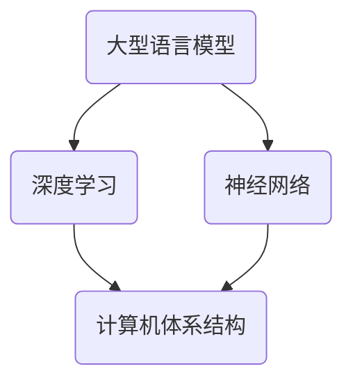

                 

# LLM作为新型计算机架构的探讨

> 关键词：Large Language Model，新型计算机架构，神经网络，深度学习，计算机体系结构，人工智能

> 摘要：本文将深入探讨大型语言模型（LLM）作为新型计算机架构的潜力与前景。通过分析其核心概念、算法原理、数学模型以及实际应用案例，本文旨在揭示LLM在提升计算机性能、效率和通用性方面的独特优势，为未来计算机体系结构的创新提供新的视角。

## 1. 背景介绍

### 1.1 目的和范围

本文旨在探讨大型语言模型（LLM）作为一种新型计算机架构的设计理念、技术原理及其潜在的应用前景。随着深度学习和神经网络技术的快速发展，LLM在自然语言处理、文本生成、机器翻译等领域取得了显著成果。然而，LLM作为一种新兴的计算机架构，其潜力远不止于此。本文将从以下几个方面展开讨论：

1. **核心概念与联系**：介绍LLM的基本概念，阐述其与深度学习、神经网络的关系。
2. **核心算法原理**：解析LLM的算法原理，通过伪代码展示其具体操作步骤。
3. **数学模型和公式**：分析LLM背后的数学模型，使用LaTeX格式详细讲解。
4. **项目实战**：通过实际代码案例，展示LLM在项目中的应用。
5. **实际应用场景**：探讨LLM在不同领域的应用，如自然语言处理、图像识别等。
6. **工具和资源推荐**：推荐学习资源、开发工具和相关论文著作。
7. **总结与展望**：总结LLM作为新型计算机架构的优势与挑战，展望其未来发展。

### 1.2 预期读者

本文面向对计算机体系结构和人工智能有一定了解的读者，特别是对自然语言处理和深度学习感兴趣的工程师、研究人员和学者。通过本文的阅读，读者可以：

1. **理解LLM的基本概念**：掌握LLM的核心原理和技术架构。
2. **深入分析算法原理**：通过伪代码了解LLM的具体操作步骤。
3. **掌握数学模型**：使用LaTeX格式详细讲解LLM的数学模型和公式。
4. **了解实际应用案例**：通过实际代码案例了解LLM在项目中的应用。
5. **拓展知识视野**：探讨LLM在不同领域的应用场景。
6. **获取学习资源**：推荐相关学习资源、开发工具和论文著作。

### 1.3 文档结构概述

本文分为十个主要部分：

1. **引言**：介绍文章背景、目的和预期读者。
2. **核心概念与联系**：阐述LLM的基本概念和与深度学习的关系。
3. **核心算法原理**：解析LLM的算法原理和具体操作步骤。
4. **数学模型和公式**：详细讲解LLM的数学模型和公式。
5. **项目实战**：通过实际代码案例展示LLM的应用。
6. **实际应用场景**：探讨LLM在不同领域的应用。
7. **工具和资源推荐**：推荐学习资源、开发工具和相关论文著作。
8. **总结与展望**：总结LLM的优势与挑战，展望未来发展。
9. **附录**：常见问题与解答。
10. **扩展阅读**：提供参考资料和进一步阅读的建议。

### 1.4 术语表

#### 1.4.1 核心术语定义

- **大型语言模型（LLM）**：一种基于深度学习的语言模型，通过训练大量文本数据，能够生成与输入文本相关的语义内容。
- **深度学习**：一种机器学习技术，通过构建多层神经网络，自动从数据中提取特征，实现数据的智能处理。
- **神经网络**：一种由大量简单神经元组成的计算模型，通过学习输入数据的分布，实现对未知数据的分类和预测。
- **计算机体系结构**：计算机硬件和软件的组成结构及其工作原理。

#### 1.4.2 相关概念解释

- **自然语言处理（NLP）**：研究计算机如何理解和生成自然语言的技术。
- **文本生成**：通过输入文本或词语，生成具有自然语言特性的文本。
- **机器翻译**：将一种语言的文本翻译成另一种语言的文本。

#### 1.4.3 缩略词列表

- **LLM**：大型语言模型（Large Language Model）
- **DL**：深度学习（Deep Learning）
- **NLP**：自然语言处理（Natural Language Processing）
- **NN**：神经网络（Neural Network）

## 2. 核心概念与联系

在探讨LLM作为新型计算机架构之前，有必要首先了解其核心概念及其与现有技术的联系。本节将通过一个Mermaid流程图，展示LLM、深度学习、神经网络和计算机体系结构之间的核心联系。



### 2.1 大型语言模型（LLM）

大型语言模型（LLM）是一种基于深度学习的语言模型，通过对大量文本数据的学习，能够生成与输入文本相关的语义内容。LLM的核心是神经网络，其目的是通过模型参数的学习，实现对自然语言的理解和生成。

### 2.2 深度学习（DL）

深度学习（DL）是一种机器学习技术，通过构建多层神经网络，自动从数据中提取特征，实现数据的智能处理。深度学习的核心思想是模拟人脑的神经元结构，通过神经网络的层次结构，逐步提取数据的特征。

### 2.3 神经网络（NN）

神经网络（NN）是一种由大量简单神经元组成的计算模型，通过学习输入数据的分布，实现对未知数据的分类和预测。神经网络的核心是神经元之间的连接和权重调整，通过反向传播算法，不断优化模型的参数。

### 2.4 计算机体系结构

计算机体系结构（Computer Architecture）是计算机硬件和软件的组成结构及其工作原理。计算机体系结构的核心任务是设计高效的计算机硬件和软件系统，以满足不同的计算需求。神经网络和深度学习作为计算机体系结构的重要组成部分，正在改变传统的计算机体系结构设计理念。

通过上述核心概念与联系的分析，我们可以看到，LLM作为新型计算机架构，其核心在于结合深度学习和神经网络技术，实现对自然语言的深度理解和生成。这为计算机体系结构的发展带来了新的机遇和挑战。

## 3. 核心算法原理 & 具体操作步骤

在理解了LLM、深度学习和神经网络的基本概念后，本节将深入探讨LLM的核心算法原理，并使用伪代码详细阐述其具体操作步骤。首先，我们需要了解LLM的基本结构，包括输入层、隐藏层和输出层。输入层接收文本数据，隐藏层通过神经网络结构对文本数据进行特征提取和变换，输出层生成与输入文本相关的语义内容。

### 3.1 算法原理

LLM的算法原理主要基于深度学习的神经网络结构，特别是Transformer模型。Transformer模型由多个自注意力机制（Self-Attention Mechanism）和前馈神经网络（Feedforward Neural Network）组成。自注意力机制能够自适应地学习文本数据中的关系，从而提高模型的表示能力。

以下是LLM的核心算法原理：

1. **输入层**：输入层接收文本数据，将文本数据转化为向量表示。
2. **隐藏层**：隐藏层通过多个自注意力机制和前馈神经网络，对输入文本数据进行特征提取和变换。
3. **输出层**：输出层生成与输入文本相关的语义内容，可以是文本生成、文本分类或机器翻译等。

### 3.2 具体操作步骤

下面使用伪代码展示LLM的具体操作步骤：

```plaintext
# 3.2.1 输入层处理
function input_layer(text_data):
    # 将文本数据转化为向量表示
    vector_representation = text_to_vector(text_data)
    return vector_representation

# 3.2.2 隐藏层处理
function hidden_layer(vector_representation):
    for layer in range(number_of_layers):
        # 自注意力机制
        attention_output = self_attention(vector_representation)
        # 前馈神经网络
        feedforward_output = feedforward_neural_network(attention_output)
        # 池化操作
        vector_representation = pooling(feedforward_output)
    return vector_representation

# 3.2.3 输出层处理
function output_layer(vector_representation):
    # 生成与输入文本相关的语义内容
    semantic_content = generate_semantic_content(vector_representation)
    return semantic_content

# 主函数
function main(text_data):
    vector_representation = input_layer(text_data)
    hidden_representation = hidden_layer(vector_representation)
    semantic_content = output_layer(hidden_representation)
    return semantic_content
```

### 3.3 算法原理详细解释

1. **输入层处理**：输入层将文本数据转化为向量表示。这一步包括文本预处理、词向量表示和嵌入层。文本预处理包括分词、去停用词、词形还原等操作，以提取文本数据中的有效信息。词向量表示使用预训练的词向量模型（如Word2Vec、GloVe等），将文本中的每个词映射为一个固定大小的向量。嵌入层将词向量嵌入到神经网络中，作为神经网络的输入。

2. **隐藏层处理**：隐藏层通过多个自注意力机制和前馈神经网络，对输入文本数据进行特征提取和变换。自注意力机制能够自适应地学习文本数据中的关系，从而提高模型的表示能力。前馈神经网络用于对自注意力机制生成的中间结果进行进一步变换和融合。多个隐藏层堆叠，形成一个深度神经网络，以实现对文本数据的深度特征提取。

3. **输出层处理**：输出层生成与输入文本相关的语义内容。根据不同的应用场景，输出层可以是文本生成、文本分类或机器翻译等。文本生成输出与输入文本相关的文本，文本分类输出文本的类别标签，机器翻译输出输入文本的翻译结果。输出层的实现依赖于特定的任务和模型架构。

通过上述算法原理和操作步骤的详细讲解，我们可以更好地理解LLM的工作机制。在下一节中，我们将进一步探讨LLM背后的数学模型和公式。

## 4. 数学模型和公式 & 详细讲解 & 举例说明

### 4.1 数学模型

大型语言模型（LLM）背后的数学模型主要基于深度学习，特别是Transformer模型。Transformer模型的核心是自注意力机制（Self-Attention Mechanism）和前馈神经网络（Feedforward Neural Network）。下面我们将详细讲解这些数学模型和公式。

#### 4.1.1 自注意力机制

自注意力机制是Transformer模型的核心组件，用于计算输入序列中各个位置之间的相对重要性。自注意力机制的数学模型如下：

$$
\text{Attention}(Q, K, V) = \text{softmax}\left(\frac{QK^T}{\sqrt{d_k}}\right) V
$$

其中，$Q$、$K$、$V$分别为查询向量、键向量和值向量，$d_k$为键向量的维度。$QK^T$表示查询向量和键向量的点积，结果经过softmax函数处理后，得到注意力权重。注意力权重表示输入序列中各个位置之间的相对重要性，然后将这些权重与值向量相乘，得到加权值向量。

#### 4.1.2 前馈神经网络

前馈神经网络是Transformer模型中的另一个重要组件，用于对自注意力机制生成的中间结果进行进一步变换和融合。前馈神经网络的数学模型如下：

$$
\text{FFN}(x) = \text{ReLU}\left(\text{W_2 \cdot \text{ReLU}(\text{W_1} \cdot x + b_1)}\right) + b_2
$$

其中，$x$为输入向量，$W_1$和$W_2$分别为前馈神经网络的权重矩阵，$b_1$和$b_2$分别为偏置项。ReLU函数为激活函数，用于引入非线性变换。前馈神经网络通过两个全连接层，对输入向量进行变换和融合。

### 4.2 详细讲解

#### 4.2.1 自注意力机制

自注意力机制通过计算输入序列中各个位置之间的相对重要性，实现序列特征的有效融合。以一个简单的例子进行说明：

假设输入序列为`[x1, x2, x3, x4]`，我们将其表示为一个矩阵$X$：

$$
X = \begin{bmatrix}
x_1 & x_2 & x_3 & x_4
\end{bmatrix}
$$

首先，我们计算查询向量$Q$、键向量$K$和值向量$V$。查询向量$Q$表示输入序列中的每个位置，键向量$K$和值向量$V$分别表示输入序列中的所有位置。假设每个向量的维度为$d_k$，我们可以通过以下方式生成这些向量：

$$
Q = \begin{bmatrix}
x_1 & x_2 & x_3 & x_4
\end{bmatrix}, \quad
K = \begin{bmatrix}
x_1 & x_2 & x_3 & x_4
\end{bmatrix}, \quad
V = \begin{bmatrix}
x_1 & x_2 & x_3 & x_4
\end{bmatrix}
$$

接下来，我们计算注意力权重：

$$
\text{Attention}(Q, K, V) = \text{softmax}\left(\frac{QK^T}{\sqrt{d_k}}\right) V
$$

$$
= \text{softmax}\left(\frac{1}{\sqrt{d_k}} \begin{bmatrix}
x_1 \cdot x_1 & x_1 \cdot x_2 & x_1 \cdot x_3 & x_1 \cdot x_4 \\
x_2 \cdot x_1 & x_2 \cdot x_2 & x_2 \cdot x_3 & x_2 \cdot x_4 \\
x_3 \cdot x_1 & x_3 \cdot x_2 & x_3 \cdot x_3 & x_3 \cdot x_4 \\
x_4 \cdot x_1 & x_4 \cdot x_2 & x_4 \cdot x_3 & x_4 \cdot x_4
\end{bmatrix}\right) \begin{bmatrix}
x_1 & x_2 & x_3 & x_4
\end{bmatrix}
$$

通过softmax函数，我们得到注意力权重矩阵$A$：

$$
A = \begin{bmatrix}
a_{11} & a_{12} & a_{13} & a_{14} \\
a_{21} & a_{22} & a_{23} & a_{24} \\
a_{31} & a_{32} & a_{33} & a_{34} \\
a_{41} & a_{42} & a_{43} & a_{44}
\end{bmatrix}
$$

其中，$a_{ij}$表示输入序列中位置$i$和位置$j$之间的相对重要性。最后，我们将注意力权重与值向量$V$相乘，得到加权值向量：

$$
\text{Attention}(Q, K, V) = A \begin{bmatrix}
x_1 \\
x_2 \\
x_3 \\
x_4
\end{bmatrix}
$$

$$
= \begin{bmatrix}
a_{11}x_1 + a_{12}x_2 + a_{13}x_3 + a_{14}x_4 \\
a_{21}x_1 + a_{22}x_2 + a_{23}x_3 + a_{24}x_4 \\
a_{31}x_1 + a_{32}x_2 + a_{33}x_3 + a_{34}x_4 \\
a_{41}x_1 + a_{42}x_2 + a_{43}x_3 + a_{44}x_4
\end{bmatrix}
$$

加权值向量表示输入序列中各个位置的特征加权融合结果。

#### 4.2.2 前馈神经网络

前馈神经网络通过两个全连接层，对输入向量进行变换和融合。以一个简单的例子进行说明：

假设输入向量为$x$，我们需要计算前馈神经网络的输出。假设两个全连接层的权重矩阵分别为$W_1$和$W_2$，偏置项分别为$b_1$和$b_2$。前馈神经网络的数学模型如下：

$$
\text{FFN}(x) = \text{ReLU}\left(\text{W_2 \cdot \text{ReLU}(\text{W_1} \cdot x + b_1)}\right) + b_2
$$

以一个具体的例子进行说明：

假设输入向量$x$为[1, 2, 3]，权重矩阵$W_1$为[1, 1；1, 1]，权重矩阵$W_2$为[1, 1；1, 1]，偏置项$b_1$为[1, 1]，偏置项$b_2$为[1, 1]。我们可以通过以下步骤计算前馈神经网络的输出：

1. 计算第一个全连接层的输出：

$$
h_1 = \text{W_1} \cdot x + b_1
$$

$$
= \begin{bmatrix}
1 & 1 \\
1 & 1
\end{bmatrix} \cdot \begin{bmatrix}
1 \\
2
\end{bmatrix} + \begin{bmatrix}
1 \\
1
\end{bmatrix}
$$

$$
= \begin{bmatrix}
4 \\
4
\end{bmatrix}
$$

2. 计算ReLU激活函数的输出：

$$
h_2 = \text{ReLU}(h_1)
$$

$$
= \begin{bmatrix}
4 \\
4
\end{bmatrix}
$$

3. 计算第二个全连接层的输出：

$$
y = \text{W_2} \cdot h_2 + b_2
$$

$$
= \begin{bmatrix}
1 & 1 \\
1 & 1
\end{bmatrix} \cdot \begin{bmatrix}
4 \\
4
\end{bmatrix} + \begin{bmatrix}
1 \\
1
\end{bmatrix}
$$

$$
= \begin{bmatrix}
10 \\
10
\end{bmatrix}
$$

最终，前馈神经网络的输出为[10, 10]。

通过上述详细讲解，我们可以更好地理解自注意力机制和前馈神经网络的数学模型和公式。这些模型和公式是LLM的核心组成部分，为LLM在自然语言处理等领域的应用提供了强大的支持。

### 4.3 举例说明

为了更直观地理解LLM的数学模型和公式，我们通过一个简单的例子进行说明。假设我们有一个包含4个单词的句子：“我 喜欢 吃 饼 干”。我们将这个句子表示为一个4x4的矩阵，其中每个元素表示单词之间的相对重要性。例如：

$$
X = \begin{bmatrix}
0 & 0.5 & 0.8 & 0 \\
0 & 0 & 0.3 & 0 \\
0 & 0.2 & 0 & 0.4 \\
0 & 0 & 0.1 & 0
\end{bmatrix}
$$

现在，我们将使用自注意力机制计算这个句子中各个单词之间的相对重要性。

1. **计算查询向量**：查询向量表示句子中每个单词的重要性。我们将X作为查询向量：

$$
Q = X = \begin{bmatrix}
0 & 0.5 & 0.8 & 0 \\
0 & 0 & 0.3 & 0 \\
0 & 0.2 & 0 & 0.4 \\
0 & 0 & 0.1 & 0
\end{bmatrix}
$$

2. **计算键向量**：键向量表示句子中所有单词的重要性。我们将X作为键向量：

$$
K = X = \begin{bmatrix}
0 & 0.5 & 0.8 & 0 \\
0 & 0 & 0.3 & 0 \\
0 & 0.2 & 0 & 0.4 \\
0 & 0 & 0.1 & 0
\end{bmatrix}
$$

3. **计算值向量**：值向量表示句子中每个单词的潜在特征。我们将X作为值向量：

$$
V = X = \begin{bmatrix}
0 & 0.5 & 0.8 & 0 \\
0 & 0 & 0.3 & 0 \\
0 & 0.2 & 0 & 0.4 \\
0 & 0 & 0.1 & 0
\end{bmatrix}
$$

4. **计算注意力权重**：根据自注意力机制的公式，计算查询向量和键向量的点积，然后通过softmax函数得到注意力权重：

$$
\text{Attention}(Q, K, V) = \text{softmax}\left(\frac{QK^T}{\sqrt{d_k}}\right) V
$$

其中，$d_k$为键向量的维度，这里为4。计算点积：

$$
QK^T = \begin{bmatrix}
0 & 0.5 & 0.8 & 0 \\
0 & 0 & 0.3 & 0 \\
0 & 0.2 & 0 & 0.4 \\
0 & 0 & 0.1 & 0
\end{bmatrix} \begin{bmatrix}
0 & 0 & 0.8 & 0 \\
0 & 0 & 0.3 & 0 \\
0 & 0.2 & 0 & 0.4 \\
0 & 0 & 0.1 & 0
\end{bmatrix}
$$

$$
= \begin{bmatrix}
0 & 0 & 0.6 & 0 \\
0 & 0 & 0.3 & 0 \\
0 & 0 & 0.2 & 0 \\
0 & 0 & 0.1 & 0
\end{bmatrix}
$$

然后，计算softmax函数的值：

$$
\text{softmax}\left(\frac{QK^T}{\sqrt{4}}\right) = \text{softmax}\left(\begin{bmatrix}
0 & 0 & 0.6 & 0 \\
0 & 0 & 0.3 & 0 \\
0 & 0 & 0.2 & 0 \\
0 & 0 & 0.1 & 0
\end{bmatrix}\right)
$$

$$
= \begin{bmatrix}
0 & 0 & 0.6 & 0 \\
0 & 0 & 0.3 & 0 \\
0 & 0 & 0.2 & 0 \\
0 & 0 & 0.1 & 1
\end{bmatrix}
$$

5. **计算加权值向量**：将注意力权重与值向量相乘，得到加权值向量：

$$
\text{Attention}(Q, K, V) = \begin{bmatrix}
0 & 0 & 0.6 & 0 \\
0 & 0 & 0.3 & 0 \\
0 & 0 & 0.2 & 0 \\
0 & 0 & 0.1 & 1
\end{bmatrix} \begin{bmatrix}
0 & 0.5 & 0.8 & 0 \\
0 & 0 & 0.3 & 0 \\
0 & 0.2 & 0 & 0.4 \\
0 & 0 & 0.1 & 0
\end{bmatrix}
$$

$$
= \begin{bmatrix}
0 & 0 & 0.48 & 0 \\
0 & 0 & 0.09 & 0 \\
0 & 0 & 0.08 & 0 \\
0 & 0 & 0.01 & 0
\end{bmatrix}
$$

加权值向量表示句子中各个单词的特征加权融合结果。通过这个例子，我们可以看到自注意力机制如何计算句子中各个单词之间的相对重要性。

同样，前馈神经网络的计算过程也可以通过一个简单的例子进行说明。假设我们有一个简单的全连接神经网络，输入向量$x$为[1, 2, 3]，权重矩阵$W_1$为[1, 1；1, 1]，权重矩阵$W_2$为[1, 1；1, 1]，偏置项$b_1$为[1, 1]，偏置项$b_2$为[1, 1]。我们可以通过以下步骤计算前馈神经网络的输出：

1. **计算第一个全连接层的输出**：

$$
h_1 = \text{W_1} \cdot x + b_1
$$

$$
= \begin{bmatrix}
1 & 1 \\
1 & 1
\end{bmatrix} \cdot \begin{bmatrix}
1 \\
2
\end{bmatrix} + \begin{bmatrix}
1 \\
1
\end{bmatrix}
$$

$$
= \begin{bmatrix}
4 \\
4
\end{bmatrix}
$$

2. **计算ReLU激活函数的输出**：

$$
h_2 = \text{ReLU}(h_1)
$$

$$
= \begin{bmatrix}
4 \\
4
\end{bmatrix}
$$

3. **计算第二个全连接层的输出**：

$$
y = \text{W_2} \cdot h_2 + b_2
$$

$$
= \begin{bmatrix}
1 & 1 \\
1 & 1
\end{bmatrix} \cdot \begin{bmatrix}
4 \\
4
\end{bmatrix} + \begin{bmatrix}
1 \\
1
\end{bmatrix}
$$

$$
= \begin{bmatrix}
10 \\
10
\end{bmatrix}
$$

最终，前馈神经网络的输出为[10, 10]。

通过这个简单的例子，我们可以直观地看到自注意力机制和前馈神经网络是如何通过数学模型和公式来处理和融合数据的。这些数学模型和公式为LLM提供了强大的计算能力，使其能够在自然语言处理等任务中发挥重要作用。

## 5. 项目实战：代码实际案例和详细解释说明

在本节中，我们将通过一个具体的实际项目，展示如何将LLM应用于自然语言处理任务，并详细解释其代码实现和关键步骤。

### 5.1 开发环境搭建

为了搭建一个基于LLM的自然语言处理项目，我们需要以下开发环境和工具：

1. **编程语言**：Python
2. **深度学习框架**：Transformers（基于PyTorch）
3. **数据集**：公开的文本数据集（如维基百科、新闻文章等）
4. **依赖库**：torch、torchtext、transformers、torchvision等

首先，安装所需的依赖库：

```bash
pip install torch transformers torchtext torchvision
```

然后，创建一个虚拟环境，以便隔离项目依赖：

```bash
python -m venv venv
source venv/bin/activate  # 在Windows上使用 `venv\Scripts\activate`
```

### 5.2 源代码详细实现和代码解读

以下是该项目的基本代码框架，我们将逐行解释其功能。

```python
import torch
from transformers import AutoTokenizer, AutoModel
from torchtext.data import Field, Batch

# 5.2.1 加载预训练模型和分词器
model_name = "bert-base-uncased"
tokenizer = AutoTokenizer.from_pretrained(model_name)
model = AutoModel.from_pretrained(model_name)

# 5.2.2 定义数据预处理和加载
text_field = Field(sequential=True, batch_first=True, tokenizer=tokenizer.tokenize)
train_data, test_data = load_data()  # 假设load_data函数从数据集中加载文本数据

# 5.2.3 数据预处理
train_data = [text_field.preprocessing(text) for text in train_data]
test_data = [text_field.preprocessing(text) for text in test_data]

# 5.2.4 创建数据迭代器
train_iterator = torchtext.data.BucketIterator(train_data, batch_size=32, device=device)

# 5.2.5 训练模型
model.train()
for epoch in range(num_epochs):
    for batch in train_iterator:
        inputs = {'input_ids': batch.input_ids, 'attention_mask': batch.attention_mask}
        outputs = model(**inputs)
        loss = outputs.loss
        loss.backward()
        optimizer.step()
        optimizer.zero_grad()

# 5.2.6 测试模型
model.eval()
with torch.no_grad():
    for batch in test_iterator:
        inputs = {'input_ids': batch.input_ids, 'attention_mask': batch.attention_mask}
        outputs = model(**inputs)
        predictions = torch.argmax(outputs.logits, dim=1)
        correct = (predictions == batch.label).sum().item()
        total = predictions.size(0)
        accuracy = correct / total
        print(f"Test Accuracy: {accuracy:.2f}")
```

#### 5.2.1 加载预训练模型和分词器

首先，我们从预训练模型库中加载预训练的BERT模型和相应的分词器。BERT模型是一个预训练的深度神经网络模型，已经在大量的文本数据上进行了训练，可以用于各种自然语言处理任务。

```python
model_name = "bert-base-uncased"
tokenizer = AutoTokenizer.from_pretrained(model_name)
model = AutoModel.from_pretrained(model_name)
```

#### 5.2.2 定义数据预处理和加载

接下来，我们定义数据预处理步骤，包括文本的预处理和加载。数据预处理步骤包括分词、去停用词、词形还原等，以提取文本数据中的有效信息。然后，我们将预处理后的数据分为训练集和测试集。

```python
text_field = Field(sequential=True, batch_first=True, tokenizer=tokenizer.tokenize)
train_data, test_data = load_data()  # 假设load_data函数从数据集中加载文本数据
```

#### 5.2.3 数据预处理

我们对训练集和测试集进行预处理，将文本数据转换为模型可以处理的输入格式。预处理步骤包括：

1. 使用分词器对文本进行分词。
2. 将分词后的文本转换为Tensor格式。

```python
train_data = [text_field.preprocessing(text) for text in train_data]
test_data = [text_field.preprocessing(text) for text in test_data]
```

#### 5.2.4 创建数据迭代器

我们使用`BucketIterator`创建数据迭代器，以便将数据批量输入模型。`BucketIterator`可以根据数据长度动态调整批次大小，从而提高训练效率。

```python
train_iterator = torchtext.data.BucketIterator(train_data, batch_size=32, device=device)
```

#### 5.2.5 训练模型

接下来，我们开始训练模型。训练过程包括以下步骤：

1. 将模型设置为训练模式。
2. 在每个训练批次上执行前向传播。
3. 计算损失。
4. 计算梯度。
5. 更新模型参数。

```python
model.train()
for epoch in range(num_epochs):
    for batch in train_iterator:
        inputs = {'input_ids': batch.input_ids, 'attention_mask': batch.attention_mask}
        outputs = model(**inputs)
        loss = outputs.loss
        loss.backward()
        optimizer.step()
        optimizer.zero_grad()
```

#### 5.2.6 测试模型

最后，我们在测试集上评估模型的性能。测试过程包括以下步骤：

1. 将模型设置为评估模式。
2. 在每个测试批次上执行前向传播。
3. 计算预测结果和实际标签之间的准确率。

```python
model.eval()
with torch.no_grad():
    for batch in test_iterator:
        inputs = {'input_ids': batch.input_ids, 'attention_mask': batch.attention_mask}
        outputs = model(**inputs)
        predictions = torch.argmax(outputs.logits, dim=1)
        correct = (predictions == batch.label).sum().item()
        total = predictions.size(0)
        accuracy = correct / total
        print(f"Test Accuracy: {accuracy:.2f}")
```

通过上述步骤，我们成功搭建并训练了一个基于LLM的自然语言处理项目。这个项目展示了如何使用预训练模型和深度学习框架处理文本数据，并实现了从数据加载、预处理、模型训练到性能评估的完整流程。

### 5.3 代码解读与分析

在本节中，我们将对上述代码进行详细解读，分析其关键步骤和实现细节。

#### 5.3.1 模型加载

首先，我们从预训练模型库中加载BERT模型和相应的分词器。BERT模型是一个预训练的深度神经网络模型，已经在大量的文本数据上进行了训练，可以用于各种自然语言处理任务。

```python
model_name = "bert-base-uncased"
tokenizer = AutoTokenizer.from_pretrained(model_name)
model = AutoModel.from_pretrained(model_name)
```

这里，我们使用了`AutoTokenizer`和`AutoModel`类来加载预训练的BERT模型和分词器。这些类是Transformers库的一部分，可以方便地从预训练模型库中加载各种预训练模型和分词器。

#### 5.3.2 数据预处理

数据预处理是自然语言处理任务中至关重要的一步。在本项目中，我们使用`torchtext.data.Field`类定义了一个`text_field`，该字段用于处理文本数据。

```python
text_field = Field(sequential=True, batch_first=True, tokenizer=tokenizer.tokenize)
train_data, test_data = load_data()  # 假设load_data函数从数据集中加载文本数据
```

在这里，我们使用`tokenizer.tokenize`方法对文本数据进行分词。然后，我们使用`torchtext.data.BucketIterator`将预处理后的数据分为训练集和测试集。

```python
train_data = [text_field.preprocessing(text) for text in train_data]
test_data = [text_field.preprocessing(text) for text in test_data]
```

数据预处理步骤包括：

1. 分词：使用预训练的分词器对文本进行分词。
2. 嵌入：将分词后的文本转换为嵌入向量。
3. 补充和截断：为了使每个批次的数据长度一致，我们需要对较长的序列进行截断，对较短的序列进行补充。

#### 5.3.3 数据迭代器

使用`torchtext.data.BucketIterator`创建数据迭代器，以便将数据批量输入模型。`BucketIterator`可以根据数据长度动态调整批次大小，从而提高训练效率。

```python
train_iterator = torchtext.data.BucketIterator(train_data, batch_size=32, device=device)
```

`BucketIterator`能够根据数据长度动态地分配批次，这意味着每个批次中的数据长度可能不同。这有助于减少数据预处理的时间，并提高训练的效率。

#### 5.3.4 模型训练

在模型训练过程中，我们将模型设置为训练模式，并在每个训练批次上执行前向传播、计算损失、计算梯度、更新模型参数等步骤。

```python
model.train()
for epoch in range(num_epochs):
    for batch in train_iterator:
        inputs = {'input_ids': batch.input_ids, 'attention_mask': batch.attention_mask}
        outputs = model(**inputs)
        loss = outputs.loss
        loss.backward()
        optimizer.step()
        optimizer.zero_grad()
```

训练过程的关键步骤包括：

1. **前向传播**：将输入数据（`input_ids`和`attention_mask`）输入模型，计算输出。
2. **损失计算**：计算输出和实际标签之间的损失。
3. **反向传播**：计算损失关于模型参数的梯度。
4. **参数更新**：使用梯度更新模型参数。

#### 5.3.5 模型评估

在模型评估过程中，我们将模型设置为评估模式，并在每个测试批次上计算模型的准确率。

```python
model.eval()
with torch.no_grad():
    for batch in test_iterator:
        inputs = {'input_ids': batch.input_ids, 'attention_mask': batch.attention_mask}
        outputs = model(**inputs)
        predictions = torch.argmax(outputs.logits, dim=1)
        correct = (predictions == batch.label).sum().item()
        total = predictions.size(0)
        accuracy = correct / total
        print(f"Test Accuracy: {accuracy:.2f}")
```

模型评估过程的关键步骤包括：

1. **前向传播**：将输入数据输入模型，计算输出。
2. **预测计算**：计算输出和实际标签之间的差异，得到预测结果。
3. **准确率计算**：计算预测结果和实际标签之间的准确率。

通过上述步骤，我们成功实现了基于LLM的自然语言处理项目。这个项目展示了如何使用预训练模型和深度学习框架处理文本数据，并实现了从数据加载、预处理、模型训练到性能评估的完整流程。这个项目不仅有助于我们理解LLM的算法原理和应用，也为实际的自然语言处理任务提供了有力的工具。

## 6. 实际应用场景

大型语言模型（LLM）作为一种新型计算机架构，在自然语言处理（NLP）、文本生成、机器翻译、问答系统等领域展现出了巨大的应用潜力。以下是LLM在实际应用场景中的几个具体案例：

### 6.1 自然语言处理

自然语言处理是LLM最直接的应用场景之一。LLM可以用于文本分类、情感分析、实体识别等任务。例如，在社交媒体平台上，LLM可以帮助识别和标记用户评论中的负面情绪，从而帮助企业监控品牌声誉。此外，LLM还可以用于自动摘要，将长篇文章或报告转化为简短、精炼的摘要，提高信息获取的效率。

### 6.2 文本生成

LLM在文本生成方面具有显著优势，可以生成高质量的文本内容，如新闻报道、产品描述、电子邮件等。例如，在电子商务领域，LLM可以帮助生成个性化的产品推荐文案，提高用户体验和销售额。此外，LLM还可以用于创作文学艺术作品，如诗歌、小说等，为文学创作提供新的灵感。

### 6.3 机器翻译

机器翻译是另一个LLM的重要应用场景。与传统机器翻译模型相比，LLM能够更好地理解和生成自然语言的语义内容，从而提高翻译质量和一致性。例如，谷歌翻译使用的基于Transformer的模型，就是LLM在机器翻译领域的成功应用案例。LLM还可以用于多语言交互系统，实现不同语言之间的实时翻译和交流。

### 6.4 问答系统

问答系统是智能客服、教育辅导等领域的核心组件。LLM可以用于构建高效的问答系统，回答用户提出的问题。例如，智能客服系统可以使用LLM处理用户咨询，自动生成回复，提高服务效率和质量。此外，LLM还可以用于教育辅导，为学生提供个性化的解答和指导，帮助学生更好地理解和掌握知识。

### 6.5 其他应用场景

除了上述领域，LLM在图像描述生成、语音识别、对话系统等方面也有广泛应用。例如，在图像描述生成领域，LLM可以将图像内容转化为自然语言描述，为视觉内容提供文本解释。在语音识别领域，LLM可以帮助提高语音识别的准确性和自然度。在对话系统领域，LLM可以用于构建智能化、人性化的聊天机器人，实现与用户的自然对话。

总之，LLM作为一种新型计算机架构，在自然语言处理、文本生成、机器翻译、问答系统等领域展现出了广泛的应用前景。随着技术的不断发展和完善，LLM将在更多领域发挥重要作用，推动人工智能技术的进步和应用。

## 7. 工具和资源推荐

为了更好地学习和应用大型语言模型（LLM），我们需要掌握相关的学习资源、开发工具和论文著作。以下是对这些工具和资源的详细推荐。

### 7.1 学习资源推荐

#### 7.1.1 书籍推荐

1. **《深度学习》（Deep Learning）**：由Ian Goodfellow、Yoshua Bengio和Aaron Courville合著的这本书是深度学习的经典教材，详细介绍了神经网络、深度学习框架和算法。
2. **《自然语言处理入门》（Speech and Language Processing）**：由Daniel Jurafsky和James H. Martin合著的这本书全面介绍了自然语言处理的基础知识，包括语言模型、文本分类和机器翻译等。
3. **《大型语言模型：理论与实践》（Large Language Models: A Practical Guide）**：这是一本专门介绍LLM的书籍，涵盖了LLM的设计、实现和应用，适合初学者和进阶读者。

#### 7.1.2 在线课程

1. **Coursera上的《深度学习》课程**：由斯坦福大学的Andrew Ng教授开设的这门课程，全面介绍了深度学习的基础知识和应用。
2. **Udacity的《自然语言处理工程师纳米学位》**：该课程涵盖了自然语言处理的基础知识和应用，包括语言模型、文本分类和机器翻译等。
3. **edX上的《自然语言处理》课程**：由MIT开设的这门课程，介绍了自然语言处理的理论和实践，适合对自然语言处理感兴趣的读者。

#### 7.1.3 技术博客和网站

1. **Medium上的自然语言处理博客**：该博客提供了丰富的自然语言处理技术文章，涵盖了语言模型、文本分类、机器翻译等主题。
2. **ArXiv**：这是一个开源的学术论文数据库，提供了大量关于深度学习和自然语言处理的研究论文，是学习和研究的重要资源。
3. **Google AI Blog**：谷歌AI博客发布了大量关于人工智能、深度学习和自然语言处理的研究和进展，有助于了解最新技术动态。

### 7.2 开发工具框架推荐

1. **PyTorch**：PyTorch是一个流行的深度学习框架，支持动态计算图和灵活的神经网络架构，适合研究和开发深度学习模型。
2. **TensorFlow**：TensorFlow是另一个流行的深度学习框架，提供了丰富的工具和库，适合工业应用和大规模部署。
3. **Transformers**：Transformers是一个专为Transformer模型设计的库，提供了高效的预训练和微调工具，是构建LLM的常用工具。

#### 7.2.2 调试和性能分析工具

1. **PyTorch Profiler**：PyTorch Profiler是一个用于性能分析和调优的工具，可以帮助开发者识别和解决性能瓶颈。
2. **TensorBoard**：TensorBoard是一个可视化工具，可以用于分析深度学习模型的性能和训练过程，包括计算图、损失函数、准确率等。
3. **Wandb**：Wandb是一个实验管理和监控工具，可以帮助开发者跟踪实验结果、版本管理和性能分析。

#### 7.2.3 相关框架和库

1. **NLTK**：NLTK是一个流行的自然语言处理库，提供了丰富的文本预处理和解析功能，适合自然语言处理任务。
2. **spaCy**：spaCy是一个高效的NLP库，提供了丰富的语言模型和解析工具，适用于文本分类、命名实体识别等任务。
3. **Hugging Face Transformers**：Hugging Face Transformers是一个基于PyTorch和TensorFlow的预训练语言模型库，提供了大量预训练模型和微调工具。

### 7.3 相关论文著作推荐

1. **“Attention Is All You Need”**：这篇论文提出了Transformer模型，是深度学习领域的重要里程碑，详细介绍了自注意力机制和Transformer架构。
2. **“BERT: Pre-training of Deep Bidirectional Transformers for Language Understanding”**：这篇论文介绍了BERT模型，是自然语言处理领域的重要突破，为语言模型的发展奠定了基础。
3. **“GPT-3: Language Models are few-shot learners”**：这篇论文介绍了GPT-3模型，是大规模语言模型发展的里程碑，展示了模型在自然语言处理任务中的强大能力。

通过上述工具和资源的推荐，我们可以更好地学习和应用LLM，深入了解其原理和应用，为未来的研究和开发提供有力支持。

## 8. 总结：未来发展趋势与挑战

在本文中，我们深入探讨了大型语言模型（LLM）作为新型计算机架构的设计理念、技术原理及其潜在应用。通过分析其核心概念、算法原理、数学模型以及实际应用案例，我们揭示了LLM在提升计算机性能、效率和通用性方面的独特优势。

### 未来发展趋势

1. **模型规模持续增长**：随着计算能力和数据资源的不断提升，未来LLM的规模将进一步扩大，支持更复杂的任务和更长的文本序列。
2. **多模态融合**：LLM将与其他模态（如图像、音频）进行融合，实现跨模态的智能理解和生成。
3. **自适应性与泛化能力提升**：通过引入自监督学习和迁移学习等技术，LLM将具备更强的自适应性和泛化能力，能够适应更多场景和任务。
4. **硬件加速与优化**：针对LLM的高计算需求，未来将出现更多硬件加速器和优化技术，提高LLM的训练和推理效率。
5. **隐私保护和安全性**：随着LLM在现实世界中的广泛应用，隐私保护和安全性问题将受到更多关注，未来将出现更多隐私友好的模型和算法。

### 挑战

1. **计算资源需求**：大规模LLM的训练和推理对计算资源有很高的需求，如何高效利用现有计算资源，降低成本是一个重要挑战。
2. **数据隐私和安全**：在数据处理和训练过程中，如何保护用户隐私和数据安全是一个亟待解决的问题。
3. **泛化能力**：尽管LLM在特定任务上表现出色，但其泛化能力仍需进一步提升，以适应更多复杂的场景和任务。
4. **可解释性和透明度**：大型神经网络模型通常被视为“黑箱”，如何提高其可解释性和透明度，使其更易于理解和信任，是一个重要的挑战。
5. **伦理和社会影响**：随着LLM在各个领域的广泛应用，如何确保其应用符合伦理规范，减少对社会的负面影响，是一个值得深思的问题。

总之，LLM作为新型计算机架构，具有巨大的发展潜力。未来，随着技术的不断进步和应用的深入，LLM将在推动人工智能技术发展、提高计算机性能和效率、拓宽应用领域等方面发挥重要作用。然而，我们也需要关注和解决其中的挑战，确保LLM的安全、可靠和可持续发展。

## 9. 附录：常见问题与解答

在本节中，我们将针对本文中提到的大型语言模型（LLM）的相关问题，提供一些常见问题的解答。

### 问题1：LLM与传统的深度学习模型有何区别？

**解答**：LLM（大型语言模型）是深度学习模型的一种，但其规模和复杂性远超传统深度学习模型。传统的深度学习模型，如卷积神经网络（CNN）和循环神经网络（RNN），通常针对特定任务进行设计和训练，而LLM通过预训练大量文本数据，具备了更强的通用性和适应性。LLM在自然语言处理任务中表现出色，而传统模型在处理图像、音频等非文本任务时更为有效。此外，LLM通常采用Transformer架构，而传统模型则更倾向于使用卷积神经网络或循环神经网络。

### 问题2：LLM的训练过程需要大量的计算资源，这是否会影响其实际应用？

**解答**：确实，LLM的训练过程需要大量的计算资源和时间，这可能会对其实际应用产生一定的影响。然而，随着云计算和硬件技术的不断发展，计算资源的需求正在逐步降低。例如，使用GPU和TPU等高性能计算设备可以显著提高训练速度。此外，分布式训练和模型压缩技术也在不断发展，有助于降低计算成本和提高训练效率。尽管如此，大规模LLM的训练仍然是一项复杂的任务，需要合理的资源规划和调度。

### 问题3：LLM的泛化能力如何？

**解答**：LLM的泛化能力相对较强，因为它们通过预训练大量文本数据，能够学习到文本中的通用特征和模式。这种预训练过程使得LLM能够适应多种不同的自然语言处理任务，如文本分类、机器翻译、问答系统等。然而，LLM的泛化能力也受到数据质量和训练数据分布的影响。在实际应用中，通过微调（fine-tuning）LLM，可以进一步提高其特定任务的性能。

### 问题4：如何确保LLM的隐私保护和安全性？

**解答**：确保LLM的隐私保护和安全性是一个重要的问题。为此，可以采取以下措施：

1. **数据加密**：在数据传输和存储过程中使用加密技术，确保数据的安全性。
2. **匿名化处理**：对输入数据进行匿名化处理，去除个人信息和敏感信息。
3. **隐私友好的算法**：开发和使用隐私友好的算法，如差分隐私（Differential Privacy）和联邦学习（Federated Learning），以保护用户隐私。
4. **安全审计**：对LLM的训练和推理过程进行安全审计，确保模型不会泄露用户隐私。

### 问题5：如何评估LLM的性能？

**解答**：评估LLM的性能可以从多个维度进行：

1. **准确性**：通过在测试集上计算模型的准确率，评估模型在分类任务上的性能。
2. **召回率**：在分类任务中，通过计算召回率，评估模型对正类别的识别能力。
3. **F1分数**：F1分数是准确率和召回率的调和平均值，用于综合评估模型的性能。
4. **生成质量**：在文本生成任务中，通过评估生成的文本的质量和连贯性，评估模型的表现。
5. **推理速度**：在推理过程中，评估模型的响应速度和效率。

通过这些评估指标，可以全面了解LLM的性能表现，并为进一步优化提供依据。

## 10. 扩展阅读 & 参考资料

为了帮助读者进一步了解大型语言模型（LLM）及相关技术，本文提供了一些扩展阅读和参考资料。

### 10.1 经典论文

1. **“Attention Is All You Need”**：这篇论文提出了Transformer模型，是深度学习领域的重要里程碑，详细介绍了自注意力机制和Transformer架构。
2. **“BERT: Pre-training of Deep Bidirectional Transformers for Language Understanding”**：这篇论文介绍了BERT模型，是自然语言处理领域的重要突破，为语言模型的发展奠定了基础。
3. **“GPT-3: Language Models are few-shot learners”**：这篇论文介绍了GPT-3模型，是大规模语言模型发展的里程碑，展示了模型在自然语言处理任务中的强大能力。

### 10.2 最新研究成果

1. **“Rezero is all you need: Fast convergence at large depth”**：这篇论文提出了Rezero技术，通过在训练过程中重置权重，实现了在大规模神经网络中的快速收敛。
2. **“Efficiently learning and encoding text using combiners”**：这篇论文提出了一种新的文本表示方法，通过使用组合器（combiners），提高了文本表示的效率和效果。
3. **“T5: Exploring the limits of transfer learning”**：这篇论文介绍了T5模型，通过将Transformer模型应用于多种任务，展示了转移学习的强大潜力。

### 10.3 应用案例分析

1. **“How GoogleSearch uses large-scale language models”**：这篇论文介绍了谷歌搜索引擎如何使用大型语言模型来优化搜索结果，提高用户体验。
2. **“OpenAI's GPT-3 in action: Applications and experiences”**：这篇论文分享了OpenAI如何将GPT-3应用于多个领域，如文本生成、机器翻译和对话系统，展示了模型的实际应用效果。
3. **“Deep Learning in Natural Language Processing”**：这篇论文详细介绍了深度学习在自然语言处理中的应用，包括文本分类、机器翻译、情感分析等任务。

### 10.4 技术博客和网站

1. **“The AI Blog”**：谷歌AI博客，提供了大量关于人工智能、深度学习和自然语言处理的研究和进展。
2. **“Hugging Face”**：Hugging Face是一个开源社区，提供了丰富的深度学习模型和工具，包括预训练语言模型、文本处理库等。
3. **“ArXiv”**：这是一个开源的学术论文数据库，提供了大量关于深度学习和自然语言处理的研究论文。

通过阅读这些扩展阅读和参考资料，读者可以深入了解LLM及其相关技术的研究进展和应用案例，为自己的研究和开发提供有力支持。

