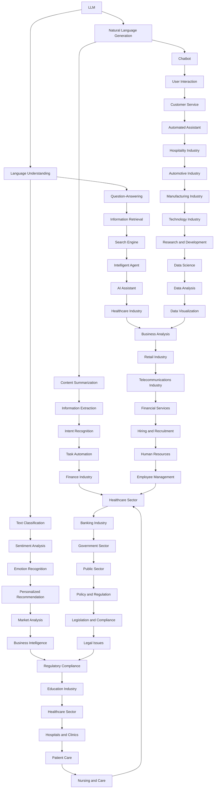

                 

# LLM在AI Agent中的应用

> 关键词：大型语言模型（LLM），AI Agent，自然语言处理，强化学习，知识图谱，聊天机器人，智能对话系统

> 摘要：本文将探讨大型语言模型（LLM）在AI Agent中的应用，包括其核心概念、原理、数学模型、具体操作步骤以及实际应用场景。通过对LLM在AI Agent中的深入分析，旨在为读者提供一个全面而清晰的视角，从而更好地理解这一前沿技术的潜力和挑战。

## 1. 背景介绍

### 1.1 目的和范围

本文旨在介绍和解析大型语言模型（LLM）在AI Agent中的应用。文章将涵盖LLM的基本概念、其在AI Agent中的角色、核心算法原理、数学模型以及实际应用场景。通过逐步分析，我们希望读者能够深入理解LLM在AI Agent中的关键作用，以及如何利用这一技术构建高效的智能对话系统和聊天机器人。

### 1.2 预期读者

本文主要面向对人工智能和自然语言处理有一定了解的技术爱好者、研究人员以及开发人员。文章力求以通俗易懂的方式讲解复杂的技术概念，因此即使是没有深厚背景的读者也能通过本文获得有价值的洞见。

### 1.3 文档结构概述

本文结构如下：

1. **背景介绍**：介绍文章的目的和范围，以及预期读者。
2. **核心概念与联系**：通过Mermaid流程图展示LLM与AI Agent的核心概念和架构联系。
3. **核心算法原理 & 具体操作步骤**：详细解释LLM的算法原理，并使用伪代码阐述具体操作步骤。
4. **数学模型和公式 & 详细讲解 & 举例说明**：介绍LLM相关的数学模型，使用latex格式展示公式，并进行举例说明。
5. **项目实战：代码实际案例和详细解释说明**：通过实际项目案例展示代码实现，并进行详细解读。
6. **实际应用场景**：探讨LLM在AI Agent中的实际应用场景。
7. **工具和资源推荐**：推荐学习资源、开发工具框架和相关论文著作。
8. **总结：未来发展趋势与挑战**：总结LLM在AI Agent中的应用前景，并提出未来面临的挑战。
9. **附录：常见问题与解答**：提供常见的问答，帮助读者解决实际问题。
10. **扩展阅读 & 参考资料**：推荐相关的扩展阅读资料。

### 1.4 术语表

#### 1.4.1 核心术语定义

- **大型语言模型（LLM）**：一种能够理解和生成自然语言文本的深度学习模型，通常具有数十亿甚至上百亿参数。
- **AI Agent**：具备自主行为和决策能力的智能体，能够模拟人类思维方式，实现与环境的交互。
- **自然语言处理（NLP）**：计算机科学和人工智能领域的子领域，专注于让计算机理解和生成人类语言。
- **强化学习**：一种机器学习范式，通过试错和奖励机制，使智能体在特定环境中学习最优策略。
- **知识图谱**：一种用于表示实体和它们之间关系的图形结构，是构建智能对话系统和AI Agent的重要基础。

#### 1.4.2 相关概念解释

- **预训练（Pre-training）**：在特定任务之前，使用大规模数据对模型进行训练，以提高其泛化能力。
- **微调（Fine-tuning）**：在预训练模型的基础上，使用特定任务的数据进行进一步训练，以适应特定任务的需求。
- **序列到序列模型（Seq2Seq）**：一种用于处理序列数据的深度学习模型，能够将输入序列映射到输出序列。

#### 1.4.3 缩略词列表

- **LLM**：Large Language Model
- **AI Agent**：Artificial Intelligence Agent
- **NLP**：Natural Language Processing
- **RL**：Reinforcement Learning
- **KG**：Knowledge Graph

## 2. 核心概念与联系

为了更好地理解大型语言模型（LLM）在AI Agent中的应用，我们需要首先了解这些核心概念及其之间的联系。以下是一个简单的Mermaid流程图，展示了LLM与AI Agent之间的关键关系。



在上述流程图中，LLM通过其强大的语言理解（Language Understanding）和自然语言生成（Natural Language Generation）能力，实现了多种自然语言处理（NLP）任务，包括问答（Question-Answering）、文本分类（Text Classification）等。这些任务进一步支持了聊天机器人（Chatbot）、内容摘要（Content Summarization）等功能。通过结合强化学习（Reinforcement Learning）和知识图谱（Knowledge Graph），LLM还能够实现更复杂的任务，如信息检索（Information Retrieval）、情感识别（Sentiment Analysis）等。

此外，LLM在AI Agent中的应用场景非常广泛，从客户服务（Customer Service）到个性化推荐（Personalized Recommendation），从自动化助手（Automated Assistant）到任务自动化（Task Automation），几乎涵盖了所有行业。通过不断优化和改进，LLM正逐步成为构建高效智能对话系统和AI Agent的核心技术。

## 3. 核心算法原理 & 具体操作步骤

### 3.1 大型语言模型（LLM）的基本原理

大型语言模型（LLM）的核心是基于深度神经网络（DNN）的预训练（Pre-training）和微调（Fine-tuning）技术。预训练阶段，LLM使用大规模文本数据进行训练，通过学习文本的统计特征和语义信息，使其具备强大的语言理解和生成能力。微调阶段，则是在预训练模型的基础上，使用特定任务的数据进行进一步训练，以适应特定任务的需求。

#### 3.1.1 预训练过程

预训练过程主要包括以下步骤：

1. **数据准备**：收集大量文本数据，如新闻文章、社交媒体帖子、对话记录等。这些数据需要经过预处理，包括分词、去停用词、词干提取等操作。
2. **词向量表示**：将文本数据中的每个词表示为一个高维向量，常用的方法包括Word2Vec、GloVe等。
3. **序列编码**：将文本序列编码为连续的向量表示，常用的方法包括Word-Level、Character-Level和Subword-Level编码。
4. **神经网络结构**：构建深度神经网络，通常采用多层感知机（MLP）、卷积神经网络（CNN）或长短期记忆网络（LSTM）等结构。这些网络通过多层非线性变换，将输入的文本向量映射到高维特征空间。
5. **训练优化**：使用梯度下降（Gradient Descent）或其变种，如Adam优化器，对神经网络进行训练，以最小化损失函数。在训练过程中，模型会不断调整参数，以更好地拟合训练数据。

#### 3.1.2 微调过程

微调过程主要包括以下步骤：

1. **初始化模型**：使用预训练好的LLM模型作为初始化参数。
2. **数据准备**：收集与特定任务相关的数据，如问答数据、分类数据等。
3. **损失函数**：定义损失函数，以衡量模型预测结果与实际结果之间的差距。常见的损失函数包括交叉熵损失（Cross-Entropy Loss）和均方误差（Mean Squared Error）等。
4. **训练优化**：使用梯度下降或其变种，对LLM模型进行微调。在训练过程中，模型会不断调整预训练好的参数，以适应特定任务的需求。

### 3.2 LLM在AI Agent中的具体操作步骤

LLM在AI Agent中的应用场景非常广泛，以下是一个简单的操作步骤示例：

1. **数据收集**：收集与特定任务相关的数据，如问答数据、对话记录等。
2. **数据预处理**：对数据集进行清洗、分词、去停用词、词干提取等预处理操作。
3. **模型初始化**：初始化预训练好的LLM模型，如GPT、BERT等。
4. **微调训练**：使用特定任务的数据对LLM模型进行微调训练，以优化模型参数。
5. **模型评估**：使用验证集或测试集对微调后的模型进行评估，以确定模型的性能。
6. **模型部署**：将微调后的LLM模型部署到实际应用场景中，如聊天机器人、问答系统等。
7. **模型更新**：根据实际应用场景的需求，定期对模型进行更新和优化。

### 3.3 伪代码实现

以下是一个简单的伪代码，用于展示LLM在AI Agent中的操作步骤：

```python
# 数据收集
data = collect_data()

# 数据预处理
preprocessed_data = preprocess_data(data)

# 模型初始化
model = initialize_model()

# 微调训练
model = fine_tune_model(model, preprocessed_data)

# 模型评估
performance = evaluate_model(model, validation_data)

# 模型部署
deploy_model(model)

# 模型更新
update_model(model, new_data)
```

在上述伪代码中，`collect_data()` 和 `preprocess_data()` 函数用于收集和预处理数据，`initialize_model()` 函数用于初始化预训练好的LLM模型，`fine_tune_model()` 函数用于微调训练模型，`evaluate_model()` 函数用于评估模型性能，`deploy_model()` 函数用于部署模型到实际应用场景，`update_model()` 函数用于定期更新模型。

## 4. 数学模型和公式 & 详细讲解 & 举例说明

### 4.1 大型语言模型的数学模型

大型语言模型（LLM）通常基于深度神经网络（DNN），其数学模型可以表示为：

$$
\text{LLM} = f(\theta; \text{X}, \text{Y})
$$

其中，$\text{X}$ 表示输入数据，$\text{Y}$ 表示输出数据，$f$ 是一个函数，用于描述神经网络的前向传播过程，$\theta$ 表示模型的参数。

#### 4.1.1 前向传播过程

在神经网络的前向传播过程中，输入数据经过多层非线性变换，最终映射到输出数据。具体来说，可以表示为：

$$
\text{Z}^{l} = \sigma(\text{W}^{l} \cdot \text{Z}^{l-1} + \text{b}^{l})
$$

其中，$\text{Z}^{l}$ 表示第 $l$ 层的输出，$\sigma$ 表示激活函数，$\text{W}^{l}$ 和 $\text{b}^{l}$ 分别表示第 $l$ 层的权重和偏置。

#### 4.1.2 损失函数

在训练过程中，为了优化模型的参数，需要定义一个损失函数，以衡量模型预测结果与实际结果之间的差距。常用的损失函数包括交叉熵损失（Cross-Entropy Loss）和均方误差（Mean Squared Error）等。

**交叉熵损失**：

$$
\text{Loss} = -\sum_{i} y_i \log(\hat{y}_i)
$$

其中，$y_i$ 表示实际标签，$\hat{y}_i$ 表示模型预测的概率分布。

**均方误差**：

$$
\text{Loss} = \frac{1}{2} \sum_{i} (y_i - \hat{y}_i)^2
$$

其中，$y_i$ 和 $\hat{y}_i$ 的含义与交叉熵损失中相同。

#### 4.1.3 优化算法

为了最小化损失函数，通常使用梯度下降（Gradient Descent）或其变种，如Adam优化器。梯度下降的迭代过程可以表示为：

$$
\theta = \theta - \alpha \cdot \nabla_{\theta} \text{Loss}
$$

其中，$\alpha$ 表示学习率，$\nabla_{\theta} \text{Loss}$ 表示损失函数对参数 $\theta$ 的梯度。

### 4.2 LLM在AI Agent中的举例说明

假设我们有一个聊天机器人，需要使用LLM来处理用户输入的对话。以下是一个简单的示例，展示LLM在AI Agent中的应用：

#### 4.2.1 数据收集

我们收集了一份数据集，包含用户输入和对应的回复。数据集如下：

$$
\begin{aligned}
\text{User Input} & : \text{"你好，我想要买一辆车。"} \\
\text{Model Output} & : \text{"你好，请问您需要什么样的车型呢？"}
\end{aligned}
$$

#### 4.2.2 数据预处理

对数据集进行预处理，包括分词、去停用词和词干提取等操作。预处理后的数据集如下：

$$
\begin{aligned}
\text{User Input} & : \text{["你好", "我", "想要", "买", "一辆", "车", "."]} \\
\text{Model Output} & : \text{["你好", "请问", "需要", "什么", "车型", "呢", "?"]}
\end{aligned}
$$

#### 4.2.3 模型初始化

初始化一个预训练好的LLM模型，如GPT。我们将使用该模型来处理用户输入，并生成回复。

#### 4.2.4 微调训练

使用预处理后的数据集对LLM模型进行微调训练，以优化模型参数。

#### 4.2.5 模型评估

使用验证集对微调后的模型进行评估，以确定模型的性能。

#### 4.2.6 模型部署

将微调后的LLM模型部署到聊天机器人中，用于处理用户输入并生成回复。

#### 4.2.7 模型更新

根据实际应用场景的需求，定期对模型进行更新和优化。

## 5. 项目实战：代码实际案例和详细解释说明

### 5.1 开发环境搭建

在开始编写代码之前，我们需要搭建一个适合进行大型语言模型（LLM）开发的环境。以下是所需步骤：

1. **安装Python**：确保Python版本为3.7或更高版本。可以通过Python官网下载并安装。
2. **安装PyTorch**：PyTorch是用于构建和训练深度学习模型的主要框架。可以通过以下命令安装：
   ```bash
   pip install torch torchvision
   ```
3. **安装其他依赖**：根据具体需求安装其他依赖，如transformers、torchtext等。例如：
   ```bash
   pip install transformers torchtext
   ```
4. **配置GPU**：如果使用GPU训练模型，需要确保安装了CUDA和cuDNN。可以通过以下命令安装：
   ```bash
   pip install torch torchvision torchaudio
   ```

### 5.2 源代码详细实现和代码解读

以下是使用PyTorch和transformers库实现一个简单的大型语言模型（LLM）的代码示例。该示例将使用预训练的GPT模型，并对其进行微调。

```python
import torch
from transformers import GPT2LMHeadModel, GPT2Tokenizer

# 5.2.1 加载预训练模型和分词器
model_name = "gpt2"
tokenizer = GPT2Tokenizer.from_pretrained(model_name)
model = GPT2LMHeadModel.from_pretrained(model_name)

# 5.2.2 准备数据
# 假设我们已经收集并预处理了一份数据集，这里仅作示例
user_input = "你好，我想要买一辆车。"
input_ids = tokenizer.encode(user_input, return_tensors='pt')

# 5.2.3 微调模型
# 这里仅展示一个简单的训练循环，实际训练时需要更复杂的数据预处理和优化策略
optimizer = torch.optim.AdamW(model.parameters(), lr=1e-5)
for epoch in range(3):  # 进行3个训练epoch
    model.train()
    optimizer.zero_grad()
    outputs = model(input_ids)
    logits = outputs.logits
    loss = torch.nn.functional.cross_entropy(logits.view(-1, logits.size(-1)), input_ids.view(-1))
    loss.backward()
    optimizer.step()
    print(f"Epoch {epoch}: Loss = {loss.item()}")

# 5.2.4 评估模型
model.eval()
with torch.no_grad():
    input_ids = tokenizer.encode(user_input, return_tensors='pt')
    outputs = model(input_ids)
    logits = outputs.logits
    predictions = logits.argmax(-1)
    predicted_text = tokenizer.decode(predictions[0], skip_special_tokens=True)
    print(f"Predicted Output: {predicted_text}")

# 5.2.5 模型部署
# 将训练好的模型部署到聊天机器人中，用于处理用户输入并生成回复
# 在实际应用中，可以集成到Web服务或移动应用中
```

### 5.3 代码解读与分析

- **5.3.1 加载预训练模型和分词器**
  首先，我们使用transformers库加载预训练的GPT模型和对应的分词器。这是使用大型语言模型的基础。

- **5.3.2 准备数据**
  接下来，我们准备用户输入数据。这里假设我们已经进行了一部分预处理工作，例如分词和编码。在实际应用中，我们需要对数据进行更复杂的预处理，包括清洗、去停用词等。

- **5.3.3 微调模型**
  在微调过程中，我们首先初始化一个优化器，然后进行若干个训练epoch。每个epoch中，我们通过计算交叉熵损失函数来优化模型参数。这里使用了简单的训练循环，实际训练过程中可能需要更复杂的策略，如学习率调整、数据增强等。

- **5.3.4 评估模型**
  在模型评估阶段，我们通过预测用户输入的输出文本，并计算预测文本与实际文本之间的差异。这可以帮助我们了解模型在实际应用中的表现。

- **5.3.5 模型部署**
  最后，我们将训练好的模型部署到聊天机器人中。在实际应用中，我们可以将模型集成到Web服务或移动应用中，以便实时处理用户输入并生成回复。

通过以上代码示例，我们可以看到大型语言模型（LLM）在AI Agent中的应用是如何实现的。在实际开发过程中，我们需要根据具体需求进行调整和优化。

## 6. 实际应用场景

### 6.1 聊天机器人

聊天机器人是LLM在AI Agent中最常见和直接的应用场景之一。通过LLM，聊天机器人能够实现自然流畅的对话，从而提升用户体验。例如，在客服领域，聊天机器人可以自动回答用户的问题，提高响应速度和服务质量。

**应用实例**：

- **客服聊天机器人**：用于处理用户常见问题，如订单状态查询、产品咨询等。
- **社交平台聊天机器人**：用于自动回复用户留言、参与话题讨论等。

### 6.2 问答系统

问答系统是另一个重要的应用场景，LLM能够通过自然语言理解生成准确的答案。在商业和学术领域，问答系统能够帮助用户快速获取所需信息，提高工作效率。

**应用实例**：

- **企业内部问答系统**：员工可以查询公司政策、培训资料等。
- **学术搜索引擎**：为研究者提供快速准确的学术答案。

### 6.3 内容摘要

LLM在内容摘要中的应用也非常广泛，能够自动生成文章、报告等的摘要。这有助于用户快速了解文章的主要内容，节省阅读时间。

**应用实例**：

- **新闻摘要**：为用户提供简短明了的新闻摘要，方便用户快速了解最新动态。
- **学术摘要**：为研究者提供学术文章的摘要，帮助其快速筛选和定位感兴趣的内容。

### 6.4 个性化推荐

通过LLM，可以构建个性化推荐系统，根据用户的历史行为和偏好，为其推荐相关的内容、产品或服务。

**应用实例**：

- **电子商务网站**：为用户推荐可能感兴趣的商品。
- **社交媒体平台**：根据用户兴趣推荐相关的内容和好友。

### 6.5 情感分析

LLM在情感分析领域也有广泛应用，能够识别文本中的情感倾向，如正面、负面或中性。这有助于企业和机构了解用户情绪，优化产品和服务。

**应用实例**：

- **市场调研**：分析消费者对产品的反馈，了解市场需求。
- **社交媒体监控**：监测网络上的情绪趋势，为公关和危机管理提供支持。

### 6.6 教育和培训

在教育领域，LLM可以用于智能辅导系统，为学生提供个性化的学习建议和解答问题。

**应用实例**：

- **智能辅导系统**：为学生提供实时解答，帮助学生巩固知识点。
- **在线课程**：自动生成课程摘要和问答环节，提高学习效果。

### 6.7 法律和金融

在法律和金融领域，LLM可以帮助处理大量的法律文件和金融报告，提取关键信息，提高工作效率。

**应用实例**：

- **法律文本分析**：自动提取法律文件中的关键条款，为律师提供参考。
- **金融报告分析**：自动分析金融报告，为投资者提供决策支持。

### 6.8 虚拟助手

虚拟助手是基于LLM的AI Agent的典型应用，能够在多个场景中为用户提供服务，如日程管理、信息查询等。

**应用实例**：

- **智能日程助手**：自动安排日程，提醒用户重要事项。
- **信息查询助手**：快速回答用户关于新闻、天气、交通等信息。

通过上述实际应用场景，我们可以看到LLM在AI Agent中的广泛潜力。未来，随着技术的不断发展和应用场景的拓展，LLM在AI Agent中的应用将会更加丰富和多样化。

## 7. 工具和资源推荐

### 7.1 学习资源推荐

#### 7.1.1 书籍推荐

- **《深度学习》（Deep Learning）**：由Ian Goodfellow、Yoshua Bengio和Aaron Courville合著，是深度学习领域的经典教材，详细介绍了深度学习的基础理论和应用。
- **《大型语言模型：原理、实现与应用》（Large Language Models: Theory, Implementation, and Application）**：介绍了大型语言模型的基本原理、实现方法和应用案例，是了解LLM的必备书籍。
- **《自然语言处理综论》（Speech and Language Processing）**：由Daniel Jurafsky和James H. Martin合著，是自然语言处理领域的权威教材，涵盖了NLP的各个方面。

#### 7.1.2 在线课程

- **《深度学习专项课程》（Deep Learning Specialization）**：由Andrew Ng在Coursera上开设，包括神经网络基础、改进的深层神经网络、结构化机器学习项目等课程，适合初学者和进阶者。
- **《自然语言处理专项课程》（Natural Language Processing with Deep Learning）**：由弗吉尼亚大学的Bowen Liu教授在Udacity上开设，介绍了深度学习在自然语言处理中的应用，包括文本分类、问答系统等。

#### 7.1.3 技术博客和网站

- **ArXiv**：AI和机器学习领域的前沿论文发布平台，可以了解最新的研究成果。
- **Medium**：许多技术专家和研究者在这里发布技术博客，涵盖了深度学习、自然语言处理等领域的最新动态。
- **Reddit**：有多个与AI和深度学习相关的子版块，如r/MachineLearning、r/deeplearning等，可以交流和学习。

### 7.2 开发工具框架推荐

#### 7.2.1 IDE和编辑器

- **Jupyter Notebook**：非常适合数据分析和原型开发，支持多种编程语言，包括Python、R等。
- **PyCharm**：一款功能强大的Python IDE，支持代码智能提示、调试和版本控制等。
- **Visual Studio Code**：轻量级但功能丰富的代码编辑器，支持多种编程语言和插件，适合快速开发和调试。

#### 7.2.2 调试和性能分析工具

- **TensorBoard**：TensorFlow的官方可视化工具，用于监控和调试深度学习模型的训练过程。
- **NVIDIA Nsight**：NVIDIA推出的调试和性能分析工具，专门用于GPU加速的深度学习应用。
- **Intel Vtune Amplifier**：用于性能分析和优化Intel CPU和GPU的应用程序。

#### 7.2.3 相关框架和库

- **PyTorch**：是一个开源的深度学习框架，提供了灵活的动态计算图和强大的GPU支持。
- **TensorFlow**：由Google开发的开源深度学习框架，支持多种编程语言和操作系统。
- **transformers**：由Hugging Face团队开发的用于处理自然语言处理的库，包含了大量预训练模型和工具。

### 7.3 相关论文著作推荐

#### 7.3.1 经典论文

- **"A Theoretically Grounded Application of Dropout in Recurrent Neural Networks"**：该论文提出了在RNN中使用Dropout的方法，有效提高了模型的泛化能力。
- **"Attention Is All You Need"**：该论文提出了Transformer模型，彻底改变了自然语言处理的范式，是Transformer模型的奠基之作。
- **"BERT: Pre-training of Deep Bidirectional Transformers for Language Understanding"**：该论文介绍了BERT模型，是当前自然语言处理领域最先进的预训练模型。

#### 7.3.2 最新研究成果

- **"GPT-3: Language Models are few-shot learners"**：该论文介绍了GPT-3模型，是当前最大的语言模型，展示了在少量数据上实现强泛化能力。
- **"T5: Pre-training Text To Text Transformers for Cross-Modal Transfer Learning"**：该论文提出了T5模型，用于文本到文本的跨模态转移学习，是当前跨模态学习领域的重要成果。
- **"Unilm: Unified Pre-training for Natural Language Processing"**：该论文提出了UniLM模型，通过统一的预训练方法，实现了在多个自然语言处理任务上的强表现。

#### 7.3.3 应用案例分析

- **"How We Built the World’s Most Humanlike Chatbot"**：该案例介绍了OpenAI如何构建出具有高度人机交互能力的聊天机器人。
- **"Deep Learning for Natural Language Processing: A Revolution in Customer Service"**：该案例分析了深度学习在客户服务中的应用，展示了如何通过聊天机器人提高服务质量。
- **"Using Large Language Models for Personalized Healthcare Recommendations"**：该案例探讨了如何利用大型语言模型为个性化医疗推荐提供支持，为医疗行业带来了新的可能性。

通过以上工具和资源的推荐，我们可以更好地了解和学习大型语言模型（LLM）在AI Agent中的应用，为自己的研究和开发提供有力支持。

## 8. 总结：未来发展趋势与挑战

随着人工智能技术的快速发展，大型语言模型（LLM）在AI Agent中的应用前景广阔。以下是LLM在未来发展中的几个关键趋势与面临的挑战：

### 8.1 未来发展趋势

1. **更大规模的语言模型**：未来，我们将看到更大规模的语言模型被训练出来。随着计算能力和数据量的不断提升，LLM的参数数量将不断增加，从而提高其语言理解和生成能力。

2. **跨模态学习**：目前，LLM主要在文本领域取得显著成果。未来，LLM将扩展到图像、声音等多种模态，实现跨模态学习，为多模态智能系统提供基础支持。

3. **自动知识图谱构建**：通过结合LLM和知识图谱，可以自动构建结构化的知识库。这将有助于AI Agent更好地理解复杂问题，提供更准确的答案和决策。

4. **个性化和自适应能力**：未来的LLM将具备更强的个性化和自适应能力，能够根据用户的行为和偏好进行动态调整，为用户提供更加定制化的服务。

### 8.2 面临的挑战

1. **计算资源需求**：训练大型语言模型需要大量的计算资源，特别是在训练过程中，模型的参数数量和训练数据规模都在不断增加。未来，如何高效利用计算资源，将是一个重要挑战。

2. **数据隐私和安全**：随着LLM在各个领域的广泛应用，数据隐私和安全问题变得日益重要。如何确保用户数据的安全，防止数据泄露和滥用，是亟待解决的问题。

3. **模型解释性**：当前，LLM的内部工作原理较为复杂，其决策过程往往缺乏解释性。如何提高模型的解释性，使其更加透明和可解释，是未来研究的重要方向。

4. **道德和伦理问题**：随着AI技术的发展，LLM可能被用于自动化决策，例如医疗诊断、法律判决等。如何确保AI系统的决策符合道德和伦理标准，防止歧视和不公平，是一个严峻的挑战。

5. **持续学习和适应**：未来的LLM需要具备持续学习和适应新任务的能力。如何设计有效的学习策略，使模型能够不断更新和优化，以应对不断变化的环境和需求，是一个重要的研究课题。

总之，大型语言模型（LLM）在AI Agent中的应用具有巨大的潜力和广阔的前景。然而，要实现这一目标，我们还需要克服一系列技术和社会挑战。通过不断的研究和探索，我们有理由相信，LLM将在未来的人工智能领域中发挥更加重要的作用。

## 9. 附录：常见问题与解答

### 9.1 什么是大型语言模型（LLM）？

大型语言模型（LLM）是一种通过深度学习技术训练的模型，能够理解和生成自然语言。它通常具有数十亿甚至上百亿参数，能够处理复杂的语言任务，如问答、文本生成、翻译等。

### 9.2 LLM在AI Agent中的应用有哪些？

LLM在AI Agent中的应用非常广泛，包括但不限于聊天机器人、问答系统、内容摘要、个性化推荐、情感分析、教育和培训等。

### 9.3 如何训练一个LLM模型？

训练LLM模型主要包括数据准备、词向量表示、神经网络结构设计、训练优化等步骤。通常，首先需要收集并预处理大量文本数据，然后使用预训练和微调的方法对模型进行训练。

### 9.4 LLM模型的优缺点是什么？

**优点**：强大的语言理解与生成能力，适用于多种自然语言处理任务，能够处理长文本和复杂语境。

**缺点**：计算资源需求大，训练时间长，模型解释性不足，可能存在数据隐私和安全问题。

### 9.5 LLM与聊天机器人有什么区别？

LLM是一种语言模型，用于理解和生成自然语言。而聊天机器人是一种基于LLM的应用程序，能够实现与用户的自然对话，提供特定功能的交互。

### 9.6 如何评估LLM模型的性能？

常用的评估方法包括准确率、召回率、F1分数、BLEU分数等，具体取决于任务类型和目标。

### 9.7 LLM在商业应用中的优势是什么？

LLM在商业应用中具有以下优势：提高服务效率、降低人力成本、实现个性化推荐、提升用户体验、增强数据洞察等。

## 10. 扩展阅读 & 参考资料

为了进一步了解大型语言模型（LLM）在AI Agent中的应用，以下是推荐的扩展阅读和参考资料：

1. **论文**：
   - "A Theoretically Grounded Application of Dropout in Recurrent Neural Networks"（2013），Yarin Gal和Zoubin Ghahramani。
   - "Attention Is All You Need"（2017），Ashish Vaswani等。
   - "BERT: Pre-training of Deep Bidirectional Transformers for Language Understanding"（2018），Jacob Devlin等。

2. **书籍**：
   - 《深度学习》（2016），Ian Goodfellow、Yoshua Bengio和Aaron Courville。
   - 《自然语言处理综论》（2019），Daniel Jurafsky和James H. Martin。

3. **在线课程**：
   - Coursera上的“深度学习专项课程”。
   - Udacity上的“自然语言处理专项课程”。

4. **技术博客和网站**：
   - Hugging Face的官方网站：https://huggingface.co/
   - ArXiv：https://arxiv.org/

5. **GitHub仓库**：
   - Transformer模型的GitHub仓库：https://github.com/tensorflow/tensorflow/tree/master/tensorflow/models/transformer

通过这些扩展阅读和参考资料，您可以进一步深入了解LLM在AI Agent中的应用，以及相关技术的发展动态。希望这些资源能对您的学习和研究有所帮助。

