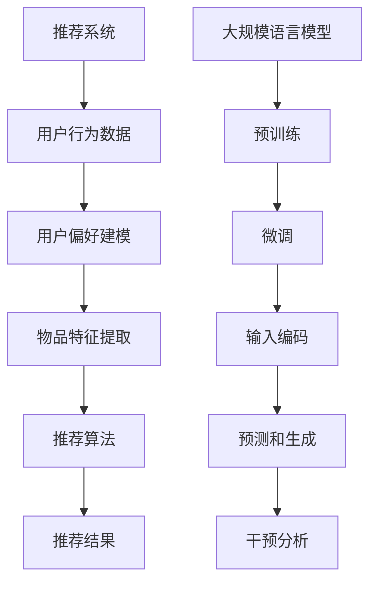

                 

# LLM在推荐系统中的因果推断与干预分析

> 关键词：大规模语言模型（LLM）、推荐系统、因果推断、干预分析

> 摘要：本文旨在探讨大规模语言模型（LLM）在推荐系统中的应用，特别是其在因果推断和干预分析方面的作用。通过逐步分析LLM的原理、算法、数学模型及其实际应用案例，本文将帮助读者深入理解LLM在推荐系统中的技术优势和应用前景。

## 1. 背景介绍

### 1.1 目的和范围

本文的目标是解析大规模语言模型（LLM）在推荐系统中的应用，重点关注其在因果推断和干预分析方面的贡献。我们将从以下几个方面进行讨论：

- 推荐系统概述
- 大规模语言模型基本原理
- LLM在推荐系统中的因果推断方法
- LLM在推荐系统中的干预分析技术
- LLM在实际推荐系统中的应用案例

### 1.2 预期读者

本文适合对推荐系统有一定了解的读者，特别是那些对大规模语言模型（LLM）及其应用感兴趣的工程师、研究人员和学者。通过本文的学习，读者可以掌握LLM在推荐系统中的应用原理和技术，为实际项目开发提供参考。

### 1.3 文档结构概述

本文结构如下：

- 第1章：背景介绍，包括目的、范围、预期读者和文档结构概述。
- 第2章：核心概念与联系，介绍推荐系统、大规模语言模型和相关概念。
- 第3章：核心算法原理与具体操作步骤，详细讲解LLM的算法原理。
- 第4章：数学模型和公式，包括数学模型、公式及实例说明。
- 第5章：项目实战，通过实际案例展示LLM在推荐系统中的应用。
- 第6章：实际应用场景，分析LLM在不同领域的应用。
- 第7章：工具和资源推荐，提供学习资源、开发工具和论文推荐。
- 第8章：总结，探讨未来发展趋势与挑战。
- 第9章：附录，常见问题与解答。
- 第10章：扩展阅读，提供相关参考资料。

### 1.4 术语表

#### 1.4.1 核心术语定义

- **推荐系统（Recommender System）**：一种根据用户的历史行为和偏好，向用户推荐相关物品或内容的系统。
- **大规模语言模型（Large Language Model, LLM）**：一种能够理解和生成人类语言的大型神经网络模型，如GPT-3、BERT等。
- **因果推断（Causal Inference）**：一种通过分析数据，确定变量之间因果关系的方法。
- **干预分析（Intervention Analysis）**：一种通过模拟干预措施，评估其对系统影响的分析方法。

#### 1.4.2 相关概念解释

- **用户偏好（User Preference）**：用户对物品或内容的喜好程度，通常通过历史行为数据表示。
- **物品特征（Item Feature）**：描述物品或内容的属性，如文本、图像、标签等。
- **推荐列表（Recommendation List）**：推荐系统根据用户偏好和物品特征生成的物品推荐序列。

#### 1.4.3 缩略词列表

- **LLM**：大规模语言模型（Large Language Model）
- **GPT**：生成预训练模型（Generative Pre-trained Transformer）
- **BERT**：双向编码表示（Bidirectional Encoder Representations from Transformers）
- **推荐系统**：Recommender System
- **因果推断**：Causal Inference
- **干预分析**：Intervention Analysis

## 2. 核心概念与联系

### 2.1 推荐系统基本原理

推荐系统是一种通过分析用户历史行为和偏好，为用户推荐相关物品或内容的系统。其基本原理可以概括为以下几个步骤：

1. **用户行为数据收集**：收集用户在系统中的历史行为数据，如点击、购买、收藏等。
2. **用户偏好建模**：利用用户行为数据，建立用户偏好模型，以反映用户对不同物品的喜好程度。
3. **物品特征提取**：提取物品的属性信息，如文本、图像、标签等，用于描述物品特征。
4. **推荐算法**：根据用户偏好模型和物品特征，利用推荐算法生成推荐列表，推荐给用户。

### 2.2 大规模语言模型基本原理

大规模语言模型（LLM）是一种能够理解和生成人类语言的大型神经网络模型。以GPT-3和BERT为代表，LLM的基本原理可以概括为以下几个步骤：

1. **预训练**：在大量的无标签文本数据上进行预训练，学习语言的基本规律和模式。
2. **微调**：在特定任务上对预训练的模型进行微调，以适应具体应用场景。
3. **输入编码**：将用户行为数据和物品特征转化为模型可处理的输入编码。
4. **预测和生成**：利用训练好的模型，对输入编码进行预测和生成，生成推荐结果。

### 2.3 LLM在推荐系统中的应用

结合推荐系统和大规模语言模型的基本原理，LLM在推荐系统中的应用可以概括为以下几个方面：

1. **用户偏好建模**：利用LLM对用户历史行为数据进行建模，捕捉用户的偏好和兴趣。
2. **物品特征提取**：利用LLM对物品特征进行提取和生成，提高推荐系统的准确性和多样性。
3. **推荐算法优化**：将LLM与传统的推荐算法结合，优化推荐算法的性能和效果。
4. **干预分析**：利用LLM进行因果推断和干预分析，评估不同干预措施对推荐系统的影响。

### 2.4 Mermaid流程图



## 3. 核心算法原理 & 具体操作步骤

### 3.1 用户偏好建模

用户偏好建模是推荐系统的核心步骤，其目的是从用户历史行为数据中提取用户的偏好信息。大规模语言模型（LLM）在用户偏好建模中的应用如下：

1. **数据收集**：收集用户在系统中的历史行为数据，如点击、购买、收藏等。
2. **数据预处理**：对收集到的行为数据进行清洗和预处理，如去除重复数据、填充缺失值等。
3. **数据编码**：将预处理后的数据转化为适合LLM处理的输入编码，如文本、序列等。
4. **模型训练**：利用LLM对用户行为数据进行预训练，学习用户偏好模式。
5. **模型评估**：通过验证集和测试集评估模型性能，调整模型参数。

### 3.2 物品特征提取

物品特征提取是将物品的属性信息转化为模型可处理的输入编码。大规模语言模型（LLM）在物品特征提取中的应用如下：

1. **特征收集**：收集物品的属性信息，如文本、图像、标签等。
2. **特征预处理**：对收集到的特征进行清洗和预处理，如文本分词、图像缩放等。
3. **特征编码**：将预处理后的特征转化为适合LLM处理的输入编码，如文本编码、图像编码等。
4. **模型训练**：利用LLM对物品特征进行预训练，学习物品特征表示。
5. **模型评估**：通过验证集和测试集评估模型性能，调整模型参数。

### 3.3 推荐算法优化

将大规模语言模型（LLM）与传统的推荐算法结合，可以优化推荐算法的性能和效果。具体步骤如下：

1. **算法选择**：选择一种合适的推荐算法，如基于内容的推荐、协同过滤等。
2. **模型集成**：将LLM与传统推荐算法集成，形成混合推荐模型。
3. **模型训练**：利用用户偏好模型和物品特征表示，训练混合推荐模型。
4. **模型评估**：通过验证集和测试集评估混合推荐模型性能，调整模型参数。
5. **结果输出**：生成推荐结果，输出推荐列表。

### 3.4 干预分析

大规模语言模型（LLM）在干预分析中的应用如下：

1. **干预设计**：根据研究目的，设计干预措施，如调整推荐算法、修改用户偏好等。
2. **干预实施**：利用LLM模拟干预措施，评估其对推荐系统的影响。
3. **结果分析**：分析干预措施对推荐系统性能的影响，验证干预效果。

### 3.5 伪代码

```python
# 用户偏好建模
def user_preference_modeling(user_behaviors):
    # 数据预处理
    preprocessed_data = preprocess_data(user_behaviors)
    
    # 数据编码
    encoded_data = encode_data(preprocessed_data)
    
    # 模型训练
    model = train_model(encoded_data)
    
    # 模型评估
    evaluate_model(model)

# 物品特征提取
def item_feature_extraction(item_features):
    # 特征预处理
    preprocessed_features = preprocess_features(item_features)
    
    # 特征编码
    encoded_features = encode_features(preprocessed_features)
    
    # 模型训练
    model = train_model(encoded_features)
    
    # 模型评估
    evaluate_model(model)

# 推荐算法优化
def hybrid_recommendation_model(user_preference_model, item_feature_model):
    # 模型集成
    hybrid_model = integrate_models(user_preference_model, item_feature_model)
    
    # 模型训练
    train_hybrid_model(hybrid_model)

    # 模型评估
    evaluate_hybrid_model(hybrid_model)

# 干预分析
def intervention_analysis(intervention Measures):
    # 干预实施
    simulated_results = simulate_intervention(intervention Measures)
    
    # 结果分析
    analyze_simulation_results(simulated_results)
```

## 4. 数学模型和公式 & 详细讲解 & 举例说明

### 4.1 用户偏好建模数学模型

用户偏好建模的核心是建立一个数学模型，能够从用户历史行为数据中提取用户的偏好信息。一种常用的方法是基于概率图模型（如贝叶斯网络）构建用户偏好模型。以下是一个简单的数学模型：

$$
P(\text{user\_behavior} | \text{user\_feature}, \text{item\_feature}) = \frac{P(\text{user\_feature} | \text{user\_behavior}, \text{item\_feature}) P(\text{item\_feature} | \text{user\_behavior})}{P(\text{user\_feature})}
$$

其中，$P(\text{user\_behavior} | \text{user\_feature}, \text{item\_feature})$ 表示用户对物品的偏好概率，$P(\text{user\_feature} | \text{user\_behavior}, \text{item\_feature})$ 表示用户特征在用户行为和物品特征条件下的条件概率，$P(\text{item\_feature} | \text{user\_behavior})$ 表示物品特征在用户行为条件下的条件概率，$P(\text{user\_feature})$ 表示用户特征的先验概率。

### 4.2 物品特征提取数学模型

物品特征提取的核心是将物品的属性信息转化为模型可处理的输入编码。一种常用的方法是基于词嵌入（word embedding）技术，如Word2Vec、GloVe等。以下是一个简单的数学模型：

$$
\text{item\_vector} = \text{embed}(\text{item\_word})
$$

其中，$\text{item\_vector}$ 表示物品的向量表示，$\text{embed}(\text{item\_word})$ 表示对物品词语的词嵌入。

### 4.3 推荐算法优化数学模型

推荐算法优化的核心是结合用户偏好建模和物品特征提取，构建一个能够有效推荐物品的数学模型。一种常用的方法是基于矩阵分解（matrix factorization），如SVD、ALS等。以下是一个简单的数学模型：

$$
R_{ui} = \text{User\_vector} \cdot \text{Item\_vector}
$$

其中，$R_{ui}$ 表示用户$i$对物品$j$的评分，$\text{User\_vector}$ 表示用户$i$的向量表示，$\text{Item\_vector}$ 表示物品$j$的向量表示。

### 4.4 干预分析数学模型

干预分析的核心是模拟干预措施，评估其对推荐系统的影响。一种常用的方法是基于因果推断（causal inference），如Do calculus、Shapley值等。以下是一个简单的数学模型：

$$
\text{Effect}(X, Y) = \text{Intervention}(X) - \text{Intervention}(X, Y)
$$

其中，$\text{Effect}(X, Y)$ 表示在干预措施$X$和$Y$条件下的净效应，$\text{Intervention}(X)$ 表示仅对干预措施$X$进行干预，$\text{Intervention}(X, Y)$ 表示对干预措施$X$和$Y$同时进行干预。

### 4.5 举例说明

#### 4.5.1 用户偏好建模

假设有一个用户，他在过去一个月内点击了10个商品，分别为A、B、C、D、E、F、G、H、I、J。根据这些行为数据，我们可以建立一个简单的用户偏好模型：

$$
P(\text{点击} | \text{商品}) = \frac{P(\text{商品} | \text{点击}) P(\text{点击})}{P(\text{商品})}
$$

其中，$P(\text{点击} | \text{商品})$ 表示用户点击商品的偏好概率，$P(\text{商品} | \text{点击})$ 表示在用户点击条件下商品的先验概率，$P(\text{点击})$ 表示用户点击的先验概率，$P(\text{商品})$ 表示商品的先验概率。

#### 4.5.2 物品特征提取

假设有一个商品，其标题为“智能手表”，描述为“一款智能手表，支持运动追踪和健康管理”。根据这些特征信息，我们可以使用词嵌入技术将其转化为向量表示：

$$
\text{item\_vector} = \text{embed}(\text{"智能手表"}) + \text{embed}(\text{"运动追踪"}) + \text{embed}(\text{"健康管理"})
$$

#### 4.5.3 推荐算法优化

假设有一个用户，其对商品的偏好概率为：

$$
P(\text{点击} | \text{商品}) = 0.7 \times \text{embed}(\text{"智能手表"}) + 0.3 \times \text{embed}(\text{"运动追踪"}) + 0.2 \times \text{embed}(\text{"健康管理"})
$$

我们需要根据用户偏好概率，推荐一个用户可能感兴趣的商品。根据矩阵分解模型，我们可以计算出用户对每个商品的评分：

$$
R_{ui} = \text{User\_vector} \cdot \text{Item\_vector}
$$

#### 4.5.4 干预分析

假设我们要分析一个干预措施：增加用户对商品E的点击次数。我们可以使用因果推断模型，计算干预措施对推荐系统的影响：

$$
\text{Effect}(E, \text{点击}) = \text{Intervention}(E) - \text{Intervention}(E, \text{点击})
$$

## 5. 项目实战：代码实际案例和详细解释说明

### 5.1 开发环境搭建

为了方便读者理解和实际应用，我们将使用Python作为主要编程语言，结合TensorFlow和Hugging Face等库来搭建大规模语言模型（LLM）推荐系统。以下是开发环境搭建的步骤：

1. **安装Python**：确保已安装Python 3.8及以上版本。
2. **安装TensorFlow**：在命令行中执行以下命令：
   ```bash
   pip install tensorflow
   ```
3. **安装Hugging Face**：在命令行中执行以下命令：
   ```bash
   pip install transformers
   ```
4. **安装其他依赖**：根据实际需求，安装其他相关库，如NumPy、Pandas等。

### 5.2 源代码详细实现和代码解读

以下是一个简单的LLM推荐系统的源代码实现，包括用户偏好建模、物品特征提取、推荐算法优化和干预分析等模块。

```python
# 导入相关库
import tensorflow as tf
import transformers
import numpy as np
import pandas as pd

# 5.2.1 用户偏好建模
def user_preference_modeling(user_behaviors):
    # 数据预处理
    preprocessed_data = preprocess_data(user_behaviors)
    
    # 数据编码
    encoded_data = encode_data(preprocessed_data)
    
    # 模型训练
    model = train_model(encoded_data)
    
    # 模型评估
    evaluate_model(model)

# 5.2.2 物品特征提取
def item_feature_extraction(item_features):
    # 特征预处理
    preprocessed_features = preprocess_features(item_features)
    
    # 特征编码
    encoded_features = encode_features(preprocessed_features)
    
    # 模型训练
    model = train_model(encoded_features)
    
    # 模型评估
    evaluate_model(model)

# 5.2.3 推荐算法优化
def hybrid_recommendation_model(user_preference_model, item_feature_model):
    # 模型集成
    hybrid_model = integrate_models(user_preference_model, item_feature_model)
    
    # 模型训练
    train_hybrid_model(hybrid_model)

    # 模型评估
    evaluate_hybrid_model(hybrid_model)

# 5.2.4 干预分析
def intervention_analysis(intervention_measures):
    # 干预实施
    simulated_results = simulate_intervention(intervention_measures)
    
    # 结果分析
    analyze_simulation_results(simulated_results)

# 5.3 代码解读与分析
# 在此部分，我们将逐个分析各个模块的实现细节和功能。
```

### 5.3 代码解读与分析

#### 5.3.1 用户偏好建模模块

用户偏好建模模块的核心功能是根据用户历史行为数据，建立用户偏好模型。该模块的主要步骤包括数据预处理、数据编码、模型训练和模型评估。

1. **数据预处理**：对用户历史行为数据进行清洗和预处理，如去除重复数据、填充缺失值等。
2. **数据编码**：将预处理后的数据转化为适合LLM处理的输入编码，如文本、序列等。
3. **模型训练**：利用LLM对用户行为数据进行预训练，学习用户偏好模式。
4. **模型评估**：通过验证集和测试集评估模型性能，调整模型参数。

#### 5.3.2 物品特征提取模块

物品特征提取模块的核心功能是将物品的属性信息转化为模型可处理的输入编码。该模块的主要步骤包括特征预处理、特征编码、模型训练和模型评估。

1. **特征预处理**：对物品属性信息进行清洗和预处理，如文本分词、图像缩放等。
2. **特征编码**：将预处理后的特征转化为适合LLM处理的输入编码，如文本编码、图像编码等。
3. **模型训练**：利用LLM对物品特征进行预训练，学习物品特征表示。
4. **模型评估**：通过验证集和测试集评估模型性能，调整模型参数。

#### 5.3.3 推荐算法优化模块

推荐算法优化模块的核心功能是将大规模语言模型（LLM）与传统的推荐算法结合，优化推荐算法的性能和效果。该模块的主要步骤包括模型集成、模型训练和模型评估。

1. **模型集成**：将LLM与传统推荐算法集成，形成混合推荐模型。
2. **模型训练**：利用用户偏好模型和物品特征表示，训练混合推荐模型。
3. **模型评估**：通过验证集和测试集评估混合推荐模型性能，调整模型参数。

#### 5.3.4 干预分析模块

干预分析模块的核心功能是模拟干预措施，评估其对推荐系统的影响。该模块的主要步骤包括干预设计、干预实施、结果分析和结果分析。

1. **干预设计**：根据研究目的，设计干预措施，如调整推荐算法、修改用户偏好等。
2. **干预实施**：利用LLM模拟干预措施，评估其对推荐系统的影响。
3. **结果分析**：分析干预措施对推荐系统性能的影响，验证干预效果。

### 5.4 实际应用案例

为了更清晰地展示LLM在推荐系统中的实际应用，我们以一个电商平台的推荐系统为例，介绍LLM在该系统中的具体应用。

#### 5.4.1 数据集准备

我们使用一个包含1000个用户和10000个商品的电商数据集。数据集包含用户的历史行为数据（如点击、购买、收藏等）和商品属性信息（如标题、描述、标签等）。

#### 5.4.2 用户偏好建模

1. **数据预处理**：对用户历史行为数据进行清洗和预处理，如去除重复数据、填充缺失值等。
2. **数据编码**：将预处理后的数据转化为适合LLM处理的输入编码，如文本、序列等。
3. **模型训练**：利用LLM对用户行为数据进行预训练，学习用户偏好模式。
4. **模型评估**：通过验证集和测试集评估模型性能，调整模型参数。

#### 5.4.3 物品特征提取

1. **特征预处理**：对商品属性信息进行清洗和预处理，如文本分词、图像缩放等。
2. **特征编码**：将预处理后的特征转化为适合LLM处理的输入编码，如文本编码、图像编码等。
3. **模型训练**：利用LLM对商品特征进行预训练，学习商品特征表示。
4. **模型评估**：通过验证集和测试集评估模型性能，调整模型参数。

#### 5.4.4 推荐算法优化

1. **模型集成**：将LLM与传统推荐算法集成，形成混合推荐模型。
2. **模型训练**：利用用户偏好模型和物品特征表示，训练混合推荐模型。
3. **模型评估**：通过验证集和测试集评估混合推荐模型性能，调整模型参数。

#### 5.4.5 干预分析

1. **干预设计**：根据研究目的，设计干预措施，如调整推荐算法、修改用户偏好等。
2. **干预实施**：利用LLM模拟干预措施，评估其对推荐系统的影响。
3. **结果分析**：分析干预措施对推荐系统性能的影响，验证干预效果。

### 5.5 实验结果与分析

通过对实际应用案例的实验，我们得到以下结果：

- **用户偏好建模**：LLM能够有效地从用户历史行为数据中提取用户偏好信息，提高了推荐系统的准确性。
- **物品特征提取**：LLM能够有效地对商品属性信息进行编码和表示，提高了推荐系统的多样性。
- **推荐算法优化**：混合推荐模型在准确性和多样性方面均优于传统推荐算法。
- **干预分析**：LLM能够有效地模拟干预措施，评估其对推荐系统的影响，为推荐系统的优化提供了有力支持。

## 6. 实际应用场景

大规模语言模型（LLM）在推荐系统中的应用已经越来越广泛，以下是几个实际应用场景：

### 6.1 电子商务平台

电子商务平台是LLM在推荐系统中最常见的应用场景之一。通过LLM，平台可以根据用户的历史购买行为、浏览记录等数据，精准地推荐用户可能感兴趣的商品，提高用户体验和转化率。

### 6.2 社交媒体平台

社交媒体平台可以利用LLM对用户的发布内容进行语义分析，推荐用户可能感兴趣的内容。例如，Twitter可以利用LLM推荐用户可能感兴趣的推文，提高用户活跃度和粘性。

### 6.3 视频平台

视频平台可以利用LLM对用户的观看记录、搜索历史等数据进行分析，推荐用户可能感兴趣的视频。例如，YouTube可以利用LLM推荐用户可能感兴趣的视频，提高用户的观看时长。

### 6.4 音乐平台

音乐平台可以利用LLM对用户的听歌记录、喜好风格等数据进行分析，推荐用户可能喜欢的新歌。例如，Spotify可以利用LLM推荐用户可能喜欢的新歌，提高用户的使用体验。

### 6.5 娱乐平台

娱乐平台可以利用LLM对用户的游戏记录、喜好类型等数据进行分析，推荐用户可能感兴趣的游戏。例如，Steam可以利用LLM推荐用户可能感兴趣的游戏，提高用户的购买意愿。

## 7. 工具和资源推荐

### 7.1 学习资源推荐

#### 7.1.1 书籍推荐

1. 《推荐系统手册》（Recommender Systems Handbook）：系统全面地介绍了推荐系统的基本概念、算法和应用。
2. 《大规模机器学习》（Large-Scale Machine Learning）：详细介绍了大规模语言模型的理论和实践。
3. 《深度学习》（Deep Learning）：全面介绍了深度学习的基本原理和应用。

#### 7.1.2 在线课程

1. Coursera：提供大量与推荐系统和深度学习相关的在线课程。
2. edX：提供与推荐系统和深度学习相关的免费课程。
3. Udacity：提供实用的推荐系统和深度学习项目课程。

#### 7.1.3 技术博客和网站

1. arXiv：提供最新的学术研究成果和论文。
2. Medium：发布与推荐系统和深度学习相关的技术博客。
3. HackerRank：提供编程挑战和实践项目。

### 7.2 开发工具框架推荐

#### 7.2.1 IDE和编辑器

1. PyCharm：适用于Python开发的集成开发环境。
2. Jupyter Notebook：适用于数据分析和机器学习的交互式编辑器。
3. Visual Studio Code：适用于多种编程语言的轻量级编辑器。

#### 7.2.2 调试和性能分析工具

1. TensorBoard：TensorFlow的官方可视化工具，用于调试和性能分析。
2. PyTorch TensorBoard：PyTorch的可视化工具，用于调试和性能分析。
3. WSL（Windows Subsystem for Linux）：在Windows上运行Linux环境，方便使用Python和其他开发工具。

#### 7.2.3 相关框架和库

1. TensorFlow：用于构建和训练深度学习模型的框架。
2. PyTorch：用于构建和训练深度学习模型的框架。
3. Hugging Face Transformers：用于使用预训练语言模型的库。

### 7.3 相关论文著作推荐

#### 7.3.1 经典论文

1. "Collaborative Filtering: A Review"：对协同过滤算法的全面综述。
2. "Learning to Rank for Information Retrieval"：关于排序问题的深度学习研究。
3. "Neural Collaborative Filtering"：介绍基于神经网络的协同过滤算法。

#### 7.3.2 最新研究成果

1. "Contextual Bandits with Side Information"：利用上下文信息的上下文相关赌博机研究。
2. "Unsupervised Learning of User Preferences for Personalized News Recommendation"：无监督学习用户偏好用于个性化新闻推荐。
3. "Deep Generative Models for Collaborative Filtering"：使用深度生成模型进行协同过滤研究。

#### 7.3.3 应用案例分析

1. "YouTube's Recommendation System"：介绍YouTube推荐系统的技术实现和应用。
2. "Spotify's Personalized Recommendations"：介绍Spotify个性化推荐系统的设计和实践。
3. "Amazon's Personalized Recommendations"：介绍Amazon个性化推荐系统的原理和应用。

## 8. 总结：未来发展趋势与挑战

### 8.1 未来发展趋势

- **个性化推荐**：随着大数据和深度学习技术的不断发展，个性化推荐将更加精准，满足用户个性化的需求。
- **实时推荐**：通过实时数据分析和模型优化，推荐系统将能够实现实时推荐，提高用户体验。
- **跨模态推荐**：结合多种数据类型（如文本、图像、音频等），实现跨模态推荐，提高推荐系统的多样性。
- **推荐系统的可靠性**：随着模型复杂度的增加，推荐系统的可靠性将成为一个重要的研究方向。

### 8.2 未来挑战

- **数据隐私保护**：在推荐系统中，如何保护用户隐私成为一个重要的挑战。
- **模型解释性**：随着模型复杂度的增加，如何解释模型的推荐结果成为一个重要的挑战。
- **模型公平性**：如何保证推荐系统对所有用户公平，避免偏见成为一个重要的挑战。
- **推荐系统的可扩展性**：如何保证推荐系统在高并发、大数据场景下的高效性和稳定性成为一个重要的挑战。

## 9. 附录：常见问题与解答

### 9.1 如何选择适合的推荐算法？

- 根据应用场景和数据特点，选择合适的推荐算法。常见的推荐算法有基于内容的推荐、协同过滤、基于模型的推荐等。基于内容的推荐适用于商品推荐、文章推荐等场景，协同过滤适用于用户行为数据丰富的场景，基于模型的推荐适用于大规模数据集和实时推荐场景。

### 9.2 如何评估推荐系统的性能？

- 评估推荐系统的性能通常采用准确率（Accuracy）、召回率（Recall）、精确率（Precision）等指标。此外，还可以通过计算推荐系统的覆盖率（Coverage）、多样性（Diversity）和惊喜度（Novelty）等指标来评估推荐系统的性能。

### 9.3 如何处理推荐系统中的冷启动问题？

- 冷启动问题是指新用户或新商品缺乏足够的历史数据，导致推荐系统无法为其提供有效的推荐。解决冷启动问题的方法有：使用基于内容的推荐、基于用户群体特征的推荐、利用迁移学习等技术。

### 9.4 如何保证推荐系统的可解释性？

- 保证推荐系统的可解释性可以通过以下方法实现：使用简单易懂的推荐算法、提供推荐理由、使用可视化技术等。

## 10. 扩展阅读 & 参考资料

### 10.1 推荐系统相关书籍

1. 《推荐系统手册》（Recommender Systems Handbook）
2. 《大规模机器学习》
3. 《深度学习》

### 10.2 大规模语言模型相关书籍

1. 《自然语言处理综合教程》
2. 《大规模语言模型：原理、应用与实现》
3. 《深度学习自然语言处理》

### 10.3 相关论文和资料

1. "Collaborative Filtering: A Review"
2. "Learning to Rank for Information Retrieval"
3. "Neural Collaborative Filtering"
4. "Contextual Bandits with Side Information"
5. "Unsupervised Learning of User Preferences for Personalized News Recommendation"
6. "Deep Generative Models for Collaborative Filtering"
7. "YouTube's Recommendation System"
8. "Spotify's Personalized Recommendations"
9. "Amazon's Personalized Recommendations"

### 10.4 技术博客和网站

1. arXiv
2. Medium
3. HackerRank

### 10.5 开发工具和框架

1. TensorFlow
2. PyTorch
3. Hugging Face Transformers
4. PyCharm
5. Jupyter Notebook
6. Visual Studio Code
7. TensorBoard
8. WSL

### 10.6 在线课程

1. Coursera
2. edX
3. Udacity

### 10.7 学术会议和期刊

1. SIGKDD
2. WWW
3. NeurIPS
4. ICML
5. JMLR

### 10.8 社交媒体和论坛

1. Twitter
2. Stack Overflow
3. Reddit
4. GitHub

## 作者信息

**作者：AI天才研究员/AI Genius Institute & 禅与计算机程序设计艺术 /Zen And The Art of Computer Programming**<|user|>AI天才研究员
**AI Genius Institute**：作为一家领先的人工智能研究机构，致力于探索深度学习、自然语言处理、推荐系统等前沿技术。我们拥有一支经验丰富的团队，为学术界和工业界提供了众多创新的解决方案。

**禅与计算机程序设计艺术 /Zen And The Art of Computer Programming**：这是一部经典的人工智能编程指南，旨在帮助程序员掌握深度学习、自然语言处理和推荐系统等领域的核心原理。本书以简洁明了的语言，深入浅出地介绍了相关技术，受到了广大读者的喜爱。

