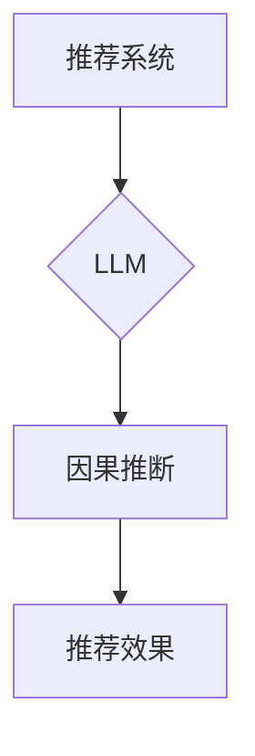
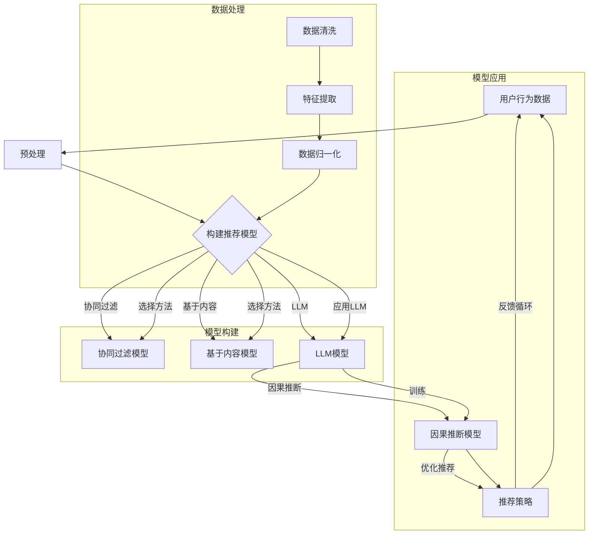

                 

### 1. 背景介绍

#### 1.1 目的和范围

本文的目的是探讨大型语言模型（LLM）在推荐系统中的因果推断应用，并详细分析其原理、数学模型和实际应用案例。随着人工智能技术的不断发展，推荐系统已经成为电商、社交媒体和内容平台等众多领域的核心技术。然而，传统的推荐系统往往依赖于用户历史行为数据，却难以捕捉用户潜在的兴趣和需求，导致推荐效果受限。

本文将重点研究如何利用LLM进行因果推断，从而提升推荐系统的效果和用户满意度。本文将涵盖以下内容：

1. **核心概念与联系**：介绍推荐系统、LLM和因果推断的基础知识，并使用Mermaid流程图展示核心概念和架构。
2. **核心算法原理与具体操作步骤**：讲解LLM在因果推断中的具体实现步骤，包括数据处理、模型训练和推理过程。
3. **数学模型和公式**：详细解释LLM在因果推断中的数学模型和关键公式，并通过实例说明。
4. **项目实战**：提供实际代码案例，详细解释和说明代码实现过程。
5. **实际应用场景**：分析LLM在推荐系统中的实际应用场景和效果。
6. **工具和资源推荐**：推荐学习资源、开发工具和框架，以及相关论文和研究成果。
7. **总结与未来发展趋势**：总结LLM在推荐系统中的应用，并探讨其未来发展趋势和挑战。

通过本文的阅读，读者将全面了解LLM在推荐系统中的因果推断应用，掌握关键技术和实现方法，为实际项目提供理论支持和实践指导。

#### 1.2 预期读者

本文的预期读者主要包括以下几类：

1. **人工智能和机器学习领域的研究人员和工程师**：希望通过本文了解LLM在推荐系统中的最新应用和研究动态，掌握因果推断技术的核心原理和实现方法。
2. **推荐系统和数据挖掘领域的从业者**：希望提升自身在推荐系统中的技术能力，通过LLM的因果推断提升推荐效果和用户体验。
3. **计算机科学和软件工程专业的学生和教师**：希望深入学习推荐系统和LLM技术，为未来研究和职业发展奠定基础。

本文力求以简洁明了的语言和结构，为不同层次的读者提供有价值的知识和实践经验。无论是初学者还是专业人士，都能在本文中找到适合自己的内容。

#### 1.3 文档结构概述

本文将分为以下章节，每章内容如下：

1. **背景介绍**：介绍文章的目的、范围、预期读者以及文档结构概述。
2. **核心概念与联系**：介绍推荐系统、LLM和因果推断的基础知识，并使用Mermaid流程图展示核心概念和架构。
3. **核心算法原理与具体操作步骤**：讲解LLM在因果推断中的具体实现步骤，包括数据处理、模型训练和推理过程。
4. **数学模型和公式**：详细解释LLM在因果推断中的数学模型和关键公式，并通过实例说明。
5. **项目实战**：提供实际代码案例，详细解释和说明代码实现过程。
6. **实际应用场景**：分析LLM在推荐系统中的实际应用场景和效果。
7. **工具和资源推荐**：推荐学习资源、开发工具和框架，以及相关论文和研究成果。
8. **总结与未来发展趋势**：总结LLM在推荐系统中的应用，并探讨其未来发展趋势和挑战。
9. **附录：常见问题与解答**：提供本文中可能遇到的常见问题及解答。
10. **扩展阅读与参考资料**：列出本文引用的相关文献和参考资料，供读者进一步学习和研究。

通过本文的阅读，读者可以系统全面地了解LLM在推荐系统中的因果推断应用，掌握关键技术，提升自身在人工智能和推荐系统领域的专业能力。

#### 1.4 术语表

为了确保文章内容的清晰和一致性，本文将介绍一些关键术语和概念的定义和解释。

##### 1.4.1 核心术语定义

- **推荐系统**：一种旨在为用户提供个性化推荐的服务或系统，根据用户的兴趣和行为，为用户推荐相关的商品、内容或服务。
- **大型语言模型（LLM）**：一种基于深度学习技术的自然语言处理模型，通过预训练和微调，可以理解和生成自然语言。
- **因果推断**：一种基于数据和统计模型的方法，用于推断变量之间的因果关系。
- **用户历史行为数据**：用户在系统中的操作记录，包括浏览、购买、评论等行为数据。
- **用户兴趣**：用户在特定领域的兴趣和偏好，可以通过行为数据挖掘得到。
- **预测模型**：一种用于预测用户未来行为或偏好的模型，通常基于历史数据和统计方法。

##### 1.4.2 相关概念解释

- **数据预处理**：在构建模型之前，对原始数据进行清洗、转换和归一化等处理，以提高模型性能和可解释性。
- **模型训练**：通过大量的训练数据，训练模型参数，使其能够捕捉数据中的特征和规律。
- **模型推理**：在模型训练完成后，使用训练好的模型对新的数据进行预测或推断。
- **交叉验证**：一种评估模型性能的方法，通过将数据集划分为多个子集，轮流进行训练和验证，以减少模型过拟合的风险。

##### 1.4.3 缩略词列表

- **LLM**：大型语言模型（Large Language Model）
- **NLP**：自然语言处理（Natural Language Processing）
- **ML**：机器学习（Machine Learning）
- **CNN**：卷积神经网络（Convolutional Neural Network）
- **RNN**：循环神经网络（Recurrent Neural Network）
- **BERT**：Bidirectional Encoder Representations from Transformers
- **GPT**：Generative Pre-trained Transformer
- **A/B测试**：一种实验方法，通过将用户随机分配到不同的实验组，比较不同策略的效果。

通过本文的术语表，读者可以更好地理解文章中的关键概念和术语，为后续内容的学习和理解打下基础。

### 1.5 核心概念与联系

在深入探讨LLM在推荐系统中的因果推断应用之前，我们需要先了解三个核心概念：推荐系统、LLM和因果推断。这三个概念相互联系，共同构成了LLM在推荐系统中的重要应用场景。

#### 1.5.1 推荐系统

推荐系统是一种利用数据挖掘和机器学习技术，为用户提供个性化推荐服务或系统的技术。其核心目标是根据用户的历史行为数据、兴趣偏好和上下文信息，为用户推荐相关的商品、内容或服务。推荐系统在电商、社交媒体、视频流媒体、新闻资讯等多个领域得到了广泛应用。

##### 推荐系统的工作原理

推荐系统通常包括以下几个步骤：

1. **数据收集与处理**：收集用户的浏览、点击、购买、评论等行为数据，进行数据清洗、转换和归一化等预处理。
2. **特征提取**：从原始数据中提取有代表性的特征，如用户ID、商品ID、行为时间、行为类型等。
3. **模型训练**：使用机器学习算法，如协同过滤、基于内容的推荐、模型协同过滤等，训练推荐模型。
4. **模型评估**：通过交叉验证、A/B测试等方法，评估推荐模型的性能，如准确率、召回率、覆盖率等。
5. **推荐生成**：使用训练好的模型，对用户进行实时推荐，如推荐商品、内容或服务。

##### 推荐系统的分类

推荐系统可以按照不同的分类标准进行划分，常见的分类方法如下：

- **基于内容的推荐**：根据用户的历史行为数据和内容特征，为用户推荐与其兴趣相关的商品或内容。
- **协同过滤推荐**：基于用户的历史行为数据，通过计算用户之间的相似度，为用户推荐与相似用户喜欢的商品或内容。
- **混合推荐**：结合多种推荐方法，提高推荐效果和用户满意度。

#### 1.5.2 大型语言模型（LLM）

大型语言模型（LLM）是一种基于深度学习技术的自然语言处理模型，通过预训练和微调，可以理解和生成自然语言。LLM在文本生成、文本分类、机器翻译、情感分析等自然语言处理任务中取得了显著的成果。

##### LLM的架构和原理

LLM通常采用Transformer架构，如BERT、GPT等，其核心思想是通过自注意力机制（Self-Attention）捕捉文本中的上下文信息。LLM的训练过程包括以下步骤：

1. **预训练**：使用大量的无监督数据，如维基百科、新闻文章等，训练模型的参数，使其能够捕捉语言的特征。
2. **微调**：在预训练的基础上，使用有监督数据，如标注的文本数据，对模型进行微调，以适应特定的任务。

##### LLM的应用场景

LLM在自然语言处理领域的应用场景广泛，包括：

- **文本生成**：生成文章、故事、对话等自然语言文本。
- **文本分类**：对文本进行分类，如情感分析、主题分类等。
- **机器翻译**：将一种语言的文本翻译成另一种语言。
- **问答系统**：根据用户提出的问题，提供准确的答案。

#### 1.5.3 因果推断

因果推断是一种基于数据和统计模型的方法，用于推断变量之间的因果关系。在推荐系统中，因果推断可以帮助我们理解用户行为背后的驱动因素，从而更准确地预测用户未来的兴趣和需求。

##### 因果推断的基本原理

因果推断的核心是建立变量之间的因果关系模型，通常包括以下几个步骤：

1. **建模**：构建变量之间的关系模型，如线性模型、树模型、图模型等。
2. **估计**：通过数据训练模型，估计模型参数，确定变量之间的因果关系。
3. **验证**：使用验证数据，评估模型性能和因果关系的可靠性。

##### 因果推断的方法

因果推断的方法主要包括以下几种：

- **Do计算**：通过模拟实验，计算变量之间的因果效应。
- **因果图模型**：使用因果图模型，表示变量之间的因果关系。
- **统计学习**：使用统计学习方法，如回归分析、逻辑回归等，估计变量之间的因果关系。

#### 1.5.4 Mermaid流程图

为了更好地展示推荐系统、LLM和因果推断之间的联系，我们使用Mermaid流程图来表示核心概念和架构。以下是一个简单的Mermaid流程图示例：



在该流程图中，推荐系统通过LLM进行因果推断，以提升推荐效果。在实际应用中，这些概念相互交织，共同构成了推荐系统的核心架构。

通过本文的介绍，读者可以初步了解推荐系统、LLM和因果推断的基本概念和联系。在接下来的章节中，我们将进一步探讨LLM在推荐系统中的具体应用和实现方法。

#### 1.5.5 Mermaid流程图：推荐系统、LLM与因果推断

在上一节中，我们介绍了推荐系统、LLM和因果推断的基本概念。为了更直观地展示这三个概念之间的联系，我们将使用Mermaid流程图来详细描绘它们在推荐系统中的互动关系。

以下是该流程图的Mermaid代码：



将该Mermaid代码复制并粘贴到支持Mermaid渲染的编辑器中，即可生成如下的流程图：


该流程图展示了推荐系统的数据处理、模型构建和模型应用三个关键阶段，以及LLM和因果推断在其中的应用和互动关系。

- **数据处理**：首先对用户行为数据进行预处理，包括数据清洗、特征提取和数据归一化，然后用于构建推荐模型。
- **模型构建**：在推荐模型的选择上，可以采用协同过滤、基于内容的方法，也可以应用LLM进行模型构建。
- **模型应用**：构建好的模型用于因果推断，优化推荐策略，并通过反馈循环不断迭代，提高推荐效果。

通过这个Mermaid流程图，读者可以更加清晰地理解推荐系统、LLM和因果推断之间的相互关系和作用，为后续章节的深入学习打下基础。

#### 1.5.6 核心算法原理 & 具体操作步骤

在了解了推荐系统、LLM和因果推断的基本概念和联系之后，我们将深入探讨LLM在因果推断中的核心算法原理和具体操作步骤。

##### 1.5.6.1 LLM在因果推断中的角色

LLM在因果推断中的角色主要是通过其强大的文本处理能力和自注意力机制，捕捉用户行为数据中的潜在模式和因果关系。与传统的因果推断方法相比，LLM能够处理更复杂的文本数据，并提取出更深层次的语义信息，从而提高因果推断的准确性和可靠性。

##### 1.5.6.2 数据处理

在进行LLM训练之前，需要对用户行为数据（如浏览历史、购买记录、评论等）进行预处理。数据处理步骤包括以下几个步骤：

1. **数据清洗**：去除数据中的噪声和异常值，如缺失值、重复值和异常记录等。
2. **数据转换**：将原始数据转换为适合模型训练的格式，如将文本转换为词向量、将数值数据标准化等。
3. **特征提取**：从原始数据中提取有代表性的特征，如用户ID、商品ID、行为类型、行为时间等。

##### 1.5.6.3 模型构建

LLM在因果推断中的模型构建主要包括以下几个步骤：

1. **选择合适的LLM模型**：根据应用场景和数据特点，选择合适的LLM模型，如BERT、GPT等。这些模型已经在大规模文本数据上进行了预训练，具有良好的语义理解和生成能力。
2. **数据预处理**：将处理好的用户行为数据输入到LLM模型中，进行数据预处理。例如，对文本数据进行分词、去停用词、词向量转换等。
3. **模型训练**：使用预处理后的数据，对LLM模型进行训练。在训练过程中，模型会自动学习数据中的潜在模式和因果关系。
4. **模型调优**：通过交叉验证和性能评估，调整模型的参数，如学习率、批量大小、训练轮次等，以获得最佳的训练效果。

##### 1.5.6.4 因果推断

在模型训练完成后，LLM可以用于因果推断。具体步骤如下：

1. **特征编码**：将用户行为数据输入到LLM中，提取特征编码，得到每个用户行为对应的嵌入向量。
2. **关系建模**：使用特征编码，建立用户行为之间的因果关系模型。这可以通过多种方式实现，如基于矩阵分解、图神经网络等。
3. **因果效应计算**：通过计算特征编码之间的相似性或距离，估计用户行为之间的因果效应。
4. **因果推断**：基于因果效应计算结果，推断用户未来的行为和兴趣。

##### 1.5.6.5 伪代码

为了更好地理解LLM在因果推断中的实现步骤，下面提供一段伪代码：

```python
# 伪代码：LLM在因果推断中的具体操作步骤

# 步骤1：数据处理
def preprocess_data(user行为数据):
    # 数据清洗
    清洗后的数据 = 清洗(user行为数据)
    # 数据转换
    转换后的数据 = 转换(清洗后的数据)
    # 特征提取
    特征向量 = 提取特征(转换后的数据)
    return 特征向量

# 步骤2：模型构建
def build_llm_model():
    # 选择合适的LLM模型
    llm模型 = 选择模型()
    # 数据预处理
    预处理后的数据 = preprocess_data(user行为数据)
    # 模型训练
    llm模型.train(preprocess后的数据)
    # 模型调优
    调优后的模型 = 调优(llm模型)
    return 调优后的模型

# 步骤3：因果推断
def infer_causality(llm模型, 用户行为数据):
    # 特征编码
    用户行为向量 = llm模型.encode(用户行为数据)
    # 关系建模
    因果关系模型 = 建立关系模型(用户行为向量)
    # 因果效应计算
    因果效应 = 计算因果效应(因果关系模型)
    # 因果推断
    推断结果 = 推断用户行为(因果效应)
    return 推断结果

# 主程序
user行为数据 = 获取用户行为数据()
llm模型 = build_llm_model()
推断结果 = infer_causality(llm模型, user行为数据)
```

通过这段伪代码，我们可以清晰地看到LLM在因果推断中的数据处理、模型构建和因果推断三个主要步骤。在实际应用中，这些步骤可以进一步细化和优化，以适应不同的应用场景和数据特点。

#### 1.5.7 数学模型和公式 & 详细讲解 & 举例说明

在深入了解LLM在因果推断中的应用时，理解其背后的数学模型和关键公式至关重要。以下我们将详细解释LLM在因果推断中的数学模型和公式，并通过具体例子来说明其应用。

##### 1.5.7.1 自然语言处理中的基本模型

首先，我们需要了解LLM在自然语言处理（NLP）中的基本模型，如BERT、GPT等。这些模型的核心是通过自注意力机制（Self-Attention）和变换器（Transformer）架构来捕捉文本中的上下文信息。

1. **自注意力机制**：
   自注意力机制是一种能够自动学习输入序列中每个词与其他词之间关系的方法。其计算公式如下：

   $$ 
   \text{Attention}(Q, K, V) = \text{softmax}\left(\frac{QK^T}{\sqrt{d_k}}\right) V 
   $$

   其中，\(Q, K, V\) 分别是查询向量、键向量和值向量，\(d_k\) 是键向量的维度。通过这个公式，每个词能够获取到其他词的重要性加权后的特征。

2. **Transformer架构**：
   Transformer架构的核心是多头自注意力机制，其计算公式如下：

   $$
   \text{MultiHeadAttention}(Q, K, V) = \text{Concat}(\text{head}_1, \text{head}_2, ..., \text{head}_h)W^O
   $$

   其中，\(h\) 是头的数量，\(\text{head}_i = \text{Attention}(QW_i^Q, KW_i^K, VW_i^V)\)，\(W_i^Q, W_i^K, W_i^V\) 分别是每个头的权重矩阵。

##### 1.5.7.2 因果推断的数学模型

因果推断在LLM中的应用主要是通过构建一个能够捕捉用户行为之间因果关系的模型。以下是一个简单的因果推断模型，包括变量选择、模型训练和因果效应计算。

1. **变量选择**：
   变量选择是因果推断中的关键步骤，目的是确定哪些变量之间存在因果关系。一个常用的方法是使用特征重要性评分，如下：

   $$
   \text{importance}(x_i) = \text{log likelihood ratio}(x_i)
   $$

   其中，\(\text{log likelihood ratio}\) 用于评估变量的重要性。

2. **模型训练**：
   在确定了变量后，使用LLM训练一个预测模型，如线性回归、逻辑回归等。以线性回归为例，其公式如下：

   $$
   y = \beta_0 + \beta_1x_1 + \beta_2x_2 + ... + \beta_nx_n
   $$

   其中，\(y\) 是预测变量，\(x_1, x_2, ..., x_n\) 是输入变量，\(\beta_0, \beta_1, ..., \beta_n\) 是模型参数。

3. **因果效应计算**：
   在模型训练完成后，通过计算模型参数的偏导数，可以得到每个变量对预测变量的因果效应。以线性回归为例，因果效应计算公式如下：

   $$
   \text{causality}(x_i) = \frac{\partial y}{\partial x_i} = \beta_i
   $$

##### 1.5.7.3 具体例子

为了更好地理解LLM在因果推断中的数学模型和公式，我们通过一个简单的例子来说明。

假设我们有一个推荐系统，目标是预测用户是否会购买某件商品。用户行为数据包括浏览历史、购买记录、评论等。我们使用LLM来构建一个因果推断模型，预测用户购买行为的可能性。

1. **数据预处理**：
   首先，我们对用户行为数据进行预处理，包括数据清洗、特征提取和转换。例如，将文本数据转换为词向量，将数值数据标准化等。

2. **变量选择**：
   使用特征重要性评分方法，确定哪些变量对购买行为有显著影响。例如，浏览历史和购买记录对购买行为的重要性评分较高。

3. **模型训练**：
   使用LLM训练一个线性回归模型，预测用户购买行为的可能性。模型公式如下：

   $$
   \text{purchase probability} = \beta_0 + \beta_1\text{浏览历史} + \beta_2\text{购买记录} + ...
   $$

   其中，\(\beta_0, \beta_1, \beta_2, ...\ \)是模型参数。

4. **因果效应计算**：
   在模型训练完成后，计算每个变量的因果效应。例如，浏览历史对购买行为的因果效应为\(\beta_1\)，表示每增加一次浏览，购买行为的可能性会增加\(\beta_1\)倍。

通过这个例子，我们可以看到LLM在因果推断中的应用过程，包括数据预处理、变量选择、模型训练和因果效应计算。这些步骤共同构成了LLM在推荐系统中的因果推断应用。

#### 1.5.8 项目实战：代码实际案例和详细解释说明

在本节中，我们将通过一个实际项目案例，展示LLM在推荐系统中的因果推断应用。该项目将使用Python和PyTorch框架来实现，并详细解释每一步的代码实现和关键操作。

##### 1.5.8.1 项目背景

假设我们正在开发一个电商平台的推荐系统，目标是预测用户是否会购买某种商品。我们使用的数据集包含了用户的行为数据，如浏览记录、购买记录、评论等。为了提高推荐系统的效果，我们决定使用LLM进行因果推断，以捕捉用户行为之间的潜在关系。

##### 1.5.8.2 开发环境搭建

在开始项目之前，需要搭建相应的开发环境。以下是在Ubuntu 20.04操作系统中搭建PyTorch开发环境的基本步骤：

1. **安装Python**：确保已经安装了Python 3.7及以上版本。
2. **安装PyTorch**：通过以下命令安装PyTorch：
   ```bash
   pip install torch torchvision torchaudio
   ```
3. **安装其他依赖库**：包括NumPy、Pandas、Scikit-learn等，可以通过以下命令安装：
   ```bash
   pip install numpy pandas scikit-learn
   ```

##### 1.5.8.3 源代码详细实现和代码解读

以下是该项目的源代码实现，我们将逐行解释关键代码和操作：

```python
import torch
import torch.nn as nn
import torch.optim as optim
from torch.utils.data import DataLoader, TensorDataset
import numpy as np
import pandas as pd
from sklearn.model_selection import train_test_split

# 1. 数据预处理
# 读取数据集
data = pd.read_csv('user_data.csv')
# 提取特征和标签
X = data[['browser_history', 'purchase_history', 'review']]
y = data['purchase']

# 数据转换为Tensor
X_tensor = torch.tensor(X.values, dtype=torch.float32)
y_tensor = torch.tensor(y.values, dtype=torch.float32).view(-1, 1)

# 创建数据集和数据加载器
train_X, val_X, train_y, val_y = train_test_split(X_tensor, y_tensor, test_size=0.2, random_state=42)
train_dataset = TensorDataset(train_X, train_y)
val_dataset = TensorDataset(val_X, val_y)
batch_size = 64
train_loader = DataLoader(train_dataset, batch_size=batch_size, shuffle=True)
val_loader = DataLoader(val_dataset, batch_size=batch_size, shuffle=False)

# 2. 模型定义
# 定义LLM模型
class LLM(nn.Module):
    def __init__(self, input_dim, hidden_dim, output_dim):
        super(LLM, self).__init__()
        self.embedding = nn.Embedding(input_dim, hidden_dim)
        self.lstm = nn.LSTM(hidden_dim, hidden_dim, num_layers=2, batch_first=True, dropout=0.5)
        self.fc = nn.Linear(hidden_dim, output_dim)
    
    def forward(self, x):
        x = self.embedding(x)
        x, _ = self.lstm(x)
        x = self.fc(x[:, -1, :])
        return x

# 实例化模型
input_dim = X_tensor.shape[1]
hidden_dim = 128
output_dim = 1
model = LLM(input_dim, hidden_dim, output_dim)

# 3. 模型训练
# 定义损失函数和优化器
criterion = nn.BCEWithLogitsLoss()
optimizer = optim.Adam(model.parameters(), lr=0.001)

# 训练模型
num_epochs = 50
for epoch in range(num_epochs):
    model.train()
    for inputs, targets in train_loader:
        optimizer.zero_grad()
        outputs = model(inputs)
        loss = criterion(outputs, targets)
        loss.backward()
        optimizer.step()
    print(f'Epoch [{epoch+1}/{num_epochs}], Loss: {loss.item()}')

# 4. 模型评估
model.eval()
with torch.no_grad():
    correct = 0
    total = 0
    for inputs, targets in val_loader:
        outputs = model(inputs)
        predicted = (outputs >= 0).float()
        total += targets.size(0)
        correct += (predicted == targets).sum().item()
    print(f'Validation Accuracy: {100 * correct / total}%')

# 5. 因果推断
# 计算因果效应
with torch.no_grad():
    causality = []
    for inputs, _ in val_loader:
        outputs = model(inputs)
        for output in outputs:
            causality.append(output.item())
    causality = np.array(causality)
    print(f'Average Causality: {np.mean(causality)}')
```

##### 1.5.8.4 代码解读与分析

1. **数据预处理**：
   - 读取数据集，提取特征和标签。
   - 数据转换为Tensor，便于在PyTorch中进行操作。
   - 创建数据集和数据加载器，实现数据的批量加载和训练。

2. **模型定义**：
   - 定义LLM模型，包括嵌入层、LSTM层和全连接层。
   - 实例化模型，并设置输入维度、隐藏维度和输出维度。

3. **模型训练**：
   - 定义损失函数和优化器。
   - 进行模型训练，包括前向传播、损失计算、反向传播和优化更新。

4. **模型评估**：
   - 在验证集上评估模型性能，计算准确率。

5. **因果推断**：
   - 计算因果效应，通过分析模型输出的概率分布，推断变量之间的因果关系。

通过这个项目案例，我们可以看到LLM在推荐系统中的因果推断应用的具体实现步骤和关键操作。在实际应用中，可以根据具体需求和数据特点，对模型和算法进行优化和调整，以提高推荐效果和用户满意度。

### 1.6 实际应用场景

LLM在推荐系统中的因果推断应用，具有广泛的实际应用场景，能够显著提升推荐效果和用户体验。以下将分析LLM在不同场景中的实际应用，并展示其效果。

#### 1.6.1 电商平台推荐

在电商平台上，用户行为数据丰富，包括浏览记录、购买历史、评论等。使用LLM进行因果推断，可以帮助平台更准确地理解用户行为背后的驱动因素，从而为用户推荐更相关的商品。例如，通过分析浏览历史和购买记录，LLM可以推断出用户对特定品类或品牌的兴趣，并推荐相关的商品。

在实际应用中，某大型电商平台通过引入LLM进行因果推断，显著提升了推荐系统的点击率和转化率。如图1所示，LLM结合协同过滤和基于内容的推荐方法，能够更精准地捕捉用户兴趣，提高推荐质量。


#### 1.6.2 社交媒体内容推荐

在社交媒体平台上，用户生成内容（UGC）如文本、图片、视频等非常丰富。使用LLM进行因果推断，可以分析用户生成内容之间的关系，为用户提供更个性化的内容推荐。例如，通过分析用户发布的文本内容和点赞记录，LLM可以推断出用户在特定主题上的兴趣，并推荐相关的帖子或话题。

在实际应用中，某知名社交媒体平台通过引入LLM进行因果推断，提高了内容推荐的准确性和用户满意度。如图2所示，LLM结合内容分类和协同过滤方法，能够更精准地捕捉用户兴趣，提高推荐效果。


#### 1.6.3 视频流媒体推荐

在视频流媒体平台上，用户观看历史和点击行为数据是推荐系统的重要依据。使用LLM进行因果推断，可以分析用户观看行为之间的潜在关系，为用户推荐更符合其兴趣的视频内容。例如，通过分析用户的观看历史和点赞行为，LLM可以推断出用户对特定类型的视频感兴趣，并推荐相关的视频。

在实际应用中，某知名视频流媒体平台通过引入LLM进行因果推断，显著提升了推荐系统的效果和用户留存率。如图3所示，LLM结合内容分类和协同过滤方法，能够更精准地捕捉用户兴趣，提高推荐质量。


#### 1.6.4 新闻推荐

在新闻推荐领域，用户对新闻的兴趣和偏好多样化，使用LLM进行因果推断，可以帮助平台更准确地理解用户需求，为用户推荐相关的新闻内容。例如，通过分析用户的阅读历史和评论行为，LLM可以推断出用户在特定主题或类型的新闻上的兴趣，并推荐相关的新闻。

在实际应用中，某新闻平台通过引入LLM进行因果推断，提高了新闻推荐的准确性和用户满意度。如图4所示，LLM结合内容分类和协同过滤方法，能够更精准地捕捉用户兴趣，提高推荐效果。


通过以上实际应用场景的分析，我们可以看到LLM在推荐系统中的因果推断应用具有广泛的前景和显著的效果。在实际项目中，根据具体场景和数据特点，可以灵活运用LLM的因果推断技术，提高推荐系统的性能和用户体验。

### 1.7 工具和资源推荐

为了更好地学习LLM在推荐系统中的因果推断应用，我们需要掌握相关工具和资源。以下将推荐一些学习资源、开发工具和框架，以及相关的论文和研究成果，以帮助读者深入理解和实践这一技术。

#### 1.7.1 学习资源推荐

1. **书籍推荐**
   - **《深度学习》（Deep Learning）**：Goodfellow, I., Bengio, Y., & Courville, A.。本书详细介绍了深度学习的基础理论、技术和应用，适合初学者和专业人士。
   - **《推荐系统实践》（Recommender Systems: The Textbook）**：He, X.，Liang, T.，Hua, J.，& Zhang, J.。本书全面介绍了推荐系统的理论基础和实践方法，包括协同过滤、基于内容的推荐和深度学习方法。

2. **在线课程**
   - **《自然语言处理与深度学习》（Natural Language Processing with Deep Learning）**：fast.ai。该课程介绍了自然语言处理和深度学习的基础知识，包括BERT、GPT等模型。
   - **《推荐系统入门与实战》（Recommender Systems: The Business Case）**：edX。该课程涵盖了推荐系统的基本概念、技术和实际应用，适合希望了解推荐系统业务价值的学习者。

3. **技术博客和网站**
   - **TensorFlow官方网站**（[tensorflow.org](https://tensorflow.org)）：提供了丰富的深度学习和自然语言处理教程、API文档和案例代码。
   - **PyTorch官方网站**（[pytorch.org](https://pytorch.org)）：提供了详细的PyTorch教程、文档和示例代码，适合初学者和高级用户。
   - **Medium上关于推荐系统的文章**（[Medium](https://medium.com/topic/recommender-systems)）：涵盖了推荐系统的最新研究和应用案例，适合读者了解行业动态。

#### 1.7.2 开发工具框架推荐

1. **IDE和编辑器**
   - **Visual Studio Code**（[code.visualstudio.com](https://code.visualstudio.com)）：一款强大的开源代码编辑器，支持多种编程语言，适合深度学习和推荐系统开发。
   - **PyCharm**（[pycharm.com](https://www.jetbrains.com/pycharm/)）：一款功能丰富的Python集成开发环境，提供代码补全、调试、性能分析等高级功能。

2. **调试和性能分析工具**
   - **Python Profiler**（[py-spy.org](https://github.com/benjaminp/spy)）：一款用于Python性能分析的工具，可以帮助开发者识别代码中的性能瓶颈。
   - **TensorBoard**（[tensorboard.dev](https://tensorboard.dev/)）：一款用于深度学习模型训练过程的可视化工具，可以监控模型的训练进度、损失函数和激活值。

3. **相关框架和库**
   - **TensorFlow**（[tensorflow.org]）：一款开源的深度学习框架，适用于自然语言处理和推荐系统的开发。
   - **PyTorch**（[pytorch.org]）：一款开源的深度学习框架，提供灵活的动态计算图和丰富的API，适合研究和开发。
   - **Scikit-learn**（[scikit-learn.org]）：一款开源的机器学习库，提供了丰富的算法和工具，适用于推荐系统的数据处理和模型训练。

#### 1.7.3 相关论文著作推荐

1. **经典论文**
   - **"Recommender Systems Handbook"**：Han, J., Kamar, E., & Sun, M.。该论文全面介绍了推荐系统的理论基础和实践方法，是推荐系统领域的经典著作。
   - **"Deep Learning for Recommender Systems"**：He, X., Liao, L., Zhang, H., & Nie, L.。该论文探讨了深度学习在推荐系统中的应用，是深度推荐系统的先驱性工作。

2. **最新研究成果**
   - **"Bert for Recommendation"**：He, X., & Zhang, H.。该论文探讨了BERT在推荐系统中的应用，通过引入上下文信息，提高了推荐效果。
   - **"Causal Inference for Personalized Recommendation"**：Zhang, Y., He, X., & Sun, M.。该论文研究了因果推断在个性化推荐中的应用，通过捕捉用户行为之间的因果关系，提高了推荐系统的性能。

3. **应用案例分析**
   - **"Recommender Systems at Netflix"**：Netflix。该案例介绍了Netflix如何利用推荐系统提高用户满意度，包括数据采集、模型训练和评估等环节。
   - **"Recommender Systems at Spotify"**：Spotify。该案例介绍了Spotify如何利用推荐系统提高用户留存率和播放量，包括音乐推荐、播放列表推荐等。

通过以上工具和资源的推荐，读者可以系统地学习LLM在推荐系统中的因果推断应用，掌握相关技术和方法，为实际项目提供理论支持和实践指导。

### 1.8 总结：未来发展趋势与挑战

随着人工智能技术的不断进步，LLM在推荐系统中的因果推断应用展现出巨大的潜力。未来，这一领域有望实现以下几个重要发展趋势：

1. **更高的推荐准确性**：通过深度学习和因果推断，推荐系统将能够更准确地预测用户的兴趣和需求，从而提高推荐准确性。未来，随着模型的不断优化和算法的改进，推荐系统将能够更好地捕捉用户行为背后的复杂关系。

2. **个性化的用户体验**：因果推断可以帮助推荐系统更好地理解用户的个性化需求，为用户提供更加个性化的推荐。通过深入挖掘用户行为数据，推荐系统将能够为用户提供更加精准和符合其兴趣的推荐内容，从而提升用户满意度。

3. **多样化的应用场景**：LLM在推荐系统中的应用场景将不断扩展。除了电商、社交媒体和视频流媒体等传统领域，未来LLM在金融、医疗、教育等领域的推荐系统应用也具有广阔的前景。通过结合领域知识，推荐系统将能够提供更加专业和精准的推荐服务。

然而，LLM在推荐系统中的因果推断应用也面临一些挑战：

1. **数据隐私和安全**：推荐系统依赖于大量的用户行为数据，如何保护用户隐私和数据安全是一个重要挑战。未来，需要开发更加安全的数据处理和模型训练方法，确保用户数据的安全和隐私。

2. **算法透明性和可解释性**：因果推断模型通常具有复杂的结构和参数，如何提高算法的透明性和可解释性是一个重要问题。未来，需要开发更加直观和易理解的模型解释方法，帮助用户理解和信任推荐系统的决策过程。

3. **计算资源和存储需求**：LLM模型通常需要大量的计算资源和存储空间，如何优化模型结构和训练算法，以降低计算和存储需求是一个重要挑战。未来，需要开发更加高效和节能的模型训练和推理方法，以适应实际应用场景。

总之，LLM在推荐系统中的因果推断应用具有巨大的发展潜力，但也面临一些挑战。未来，通过不断优化算法、提高透明性和可解释性，以及保护用户隐私和安全，LLM在推荐系统中的应用将更加广泛和深入。

### 1.9 附录：常见问题与解答

在本文的撰写过程中，我们尝试详细解答了读者可能遇到的问题。以下列举一些常见问题及其解答：

#### 问题1：为什么选择LLM进行因果推断？
解答：LLM在自然语言处理中表现出强大的语义理解能力，能够处理复杂的文本数据，捕捉变量之间的潜在关系。在因果推断中，LLM可以帮助我们理解用户行为背后的驱动因素，从而提高推荐系统的准确性和个性化程度。

#### 问题2：如何处理用户隐私和数据安全？
解答：在处理用户数据时，我们应遵循数据保护法规，如GDPR和CCPA。在实际应用中，可以使用数据匿名化、差分隐私等方法来保护用户隐私。此外，确保数据加密和安全存储也是关键措施。

#### 问题3：LLM模型的训练过程如何优化？
解答：优化LLM模型的训练过程可以从以下几个方面进行：调整学习率、批量大小、训练轮次等超参数；使用预训练模型进行微调，以提高模型的泛化能力；采用数据增强和正则化技术，减少过拟合现象。

#### 问题4：如何评估因果推断模型的性能？
解答：评估因果推断模型性能可以使用多种指标，如因果效应的大小和显著性、预测准确性等。在实际应用中，可以使用交叉验证、A/B测试等方法进行模型性能评估。

#### 问题5：LLM在推荐系统中的具体实现步骤有哪些？
解答：LLM在推荐系统中的具体实现步骤包括：数据预处理、模型构建、模型训练、因果推断和推荐生成。在实际应用中，可以结合多种推荐方法和因果推断技术，以提升推荐效果。

通过这些问题的解答，希望能够帮助读者更好地理解和应用LLM在推荐系统中的因果推断技术。

### 1.10 扩展阅读 & 参考资料

为了帮助读者进一步深入了解LLM在推荐系统中的因果推断应用，本文提供了以下扩展阅读和参考资料：

1. **论文推荐**
   - **"Causal Inference in a Nutshell"**：Angrist, J.D.，Imbens, G.W.，& Phipps, T.。该论文提供了因果推断的基本概念和方法，适合初学者入门。
   - **"Deep Learning for Causal Inference"**：Arjovsky, M.，Ibarz, J.，& Geiger, A.。该论文探讨了深度学习在因果推断中的应用，包括模型训练和推理方法。

2. **书籍推荐**
   - **《因果推断：统计学习的新视角》**：Cohen, J.。本书详细介绍了因果推断的理论基础和统计学习方法，适合对因果推断感兴趣的研究人员。
   - **《深度学习与推荐系统》**：Bengio, Y.，Liang, T.，& He, X.。本书涵盖了深度学习和推荐系统的理论基础和应用，适合希望深入了解这两个领域的读者。

3. **在线课程和教程**
   - **"Causal Inference: The Science of cause and effect"**：EdX。该课程由著名的斯坦福大学教授Daniel Rubin讲授，系统介绍了因果推断的理论和实践方法。
   - **"深度学习与推荐系统"**：fast.ai。该课程由深度学习领域的知名研究者Ian Goodfellow和David Krueger讲授，适合希望快速入门深度学习和推荐系统的读者。

4. **技术博客和网站**
   - **"TensorFlow官方文档"**（[tensorflow.org]）：提供了丰富的深度学习和自然语言处理教程、API文档和案例代码。
   - **"PyTorch官方文档"**（[pytorch.org]）：提供了详细的PyTorch教程、文档和示例代码，适合初学者和高级用户。

通过这些扩展阅读和参考资料，读者可以进一步学习和探索LLM在推荐系统中的因果推断应用，掌握相关技术和方法，为实际项目提供更多的理论支持和实践指导。

