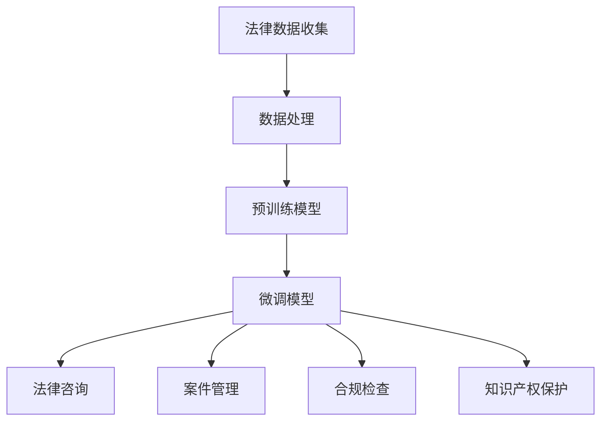

                 

# LLM在法律领域的应用：AI法律顾问

> 关键词：LLM、法律应用、AI法律顾问、自然语言处理、法律分析、人工智能

> 摘要：本文深入探讨了大规模语言模型（LLM）在法律领域的应用，特别是在提供AI法律顾问方面的潜力。文章从背景介绍、核心概念、算法原理、数学模型、实际应用、工具资源推荐等多个角度，详细解析了LLM在法律领域的应用场景、技术实现和未来发展趋势。文章旨在为法律专业人士和技术开发者提供有价值的参考。

## 1. 背景介绍

### 1.1 目的和范围

本文的目标是探讨大规模语言模型（LLM）在法律领域中的应用，尤其是作为AI法律顾问的潜力。随着人工智能技术的快速发展，LLM在自然语言处理、文本生成、信息检索等方面表现出色，为法律行业带来了诸多创新机会。本文将分析LLM的核心原理，阐述其在法律领域的具体应用，探讨相关的技术实现和数学模型，并提供实际应用案例和未来发展趋势。

本文的讨论范围包括以下内容：

1. 法律领域的挑战和需求
2. LLM的基本概念和原理
3. LLM在法律领域的应用场景
4. LLM的技术实现和数学模型
5. 实际应用案例和案例分析
6. 工具和资源推荐
7. 未来发展趋势与挑战

### 1.2 预期读者

本文适合以下读者群体：

1. 法律专业人士：对人工智能和自然语言处理在法律领域应用感兴趣的律师、法官、法律学者等。
2. 技术开发者：关注人工智能和法律结合的程序员、数据科学家、软件工程师等。
3. 研究人员：对LLM和AI法律顾问进行研究的学者、研究人员等。

### 1.3 文档结构概述

本文分为十个部分：

1. 背景介绍
2. 核心概念与联系
3. 核心算法原理 & 具体操作步骤
4. 数学模型和公式 & 详细讲解 & 举例说明
5. 项目实战：代码实际案例和详细解释说明
6. 实际应用场景
7. 工具和资源推荐
8. 总结：未来发展趋势与挑战
9. 附录：常见问题与解答
10. 扩展阅读 & 参考资料

### 1.4 术语表

#### 1.4.1 核心术语定义

- LLM：大规模语言模型（Large Language Model）
- AI法律顾问：利用人工智能技术为法律专业人士提供法律咨询和建议的系统
- 自然语言处理（NLP）：使计算机能够理解、生成和处理人类语言的技术
- 法律分析：对法律案件、法规、条款等进行研究和分析的过程
- 大规模预训练：通过在大量文本数据上训练模型，使其具备强大的语言理解和生成能力

#### 1.4.2 相关概念解释

- 预训练语言模型（PTLM）：在大量文本数据上进行预训练的语言模型
- 微调（Fine-tuning）：在预训练模型的基础上，针对特定任务进行进一步训练
- 模型解释性（Model Interpretability）：理解和解释模型决策过程的能力
- 数据隐私（Data Privacy）：确保数据在收集、存储和处理过程中不被未经授权的访问和泄露

#### 1.4.3 缩略词列表

- LLM：大规模语言模型
- NLP：自然语言处理
- AI：人工智能
- PTLM：预训练语言模型
- F-Tuning：微调
- IP：知识产权
- GDPR：通用数据保护条例

## 2. 核心概念与联系

### 2.1 法律领域的挑战和需求

法律领域面临着诸多挑战，包括案件量庞大、法规繁杂、时间紧迫等。同时，法律专业人士对于高效、准确的法律咨询和决策有着强烈的需求。以下是法律领域的一些主要挑战和需求：

1. **案件量庞大**：随着社会的发展和法律的不断完善，每年产生的法律案件数量呈指数级增长。法律专业人士需要处理大量的案件，这对他们的时间和精力提出了巨大挑战。
2. **法规繁杂**：法律法规日益复杂，法律专业人士需要熟悉大量的法律条款和法规，以便为案件提供准确的咨询。
3. **时间紧迫**：法律案件往往具有严格的时间限制，法律专业人士需要在短时间内完成案件分析、法律意见和决策。
4. **专业知识不足**：一些法律专业人士可能无法在特定领域提供专业意见，需要依赖外部专家或咨询机构。
5. **成本高昂**：传统的法律咨询和决策过程往往成本高昂，对于中小企业和普通民众来说，法律服务成本是一个重要考虑因素。

为了解决上述挑战，法律专业人士和技术开发者开始探索人工智能技术在法律领域的应用。特别是大规模语言模型（LLM）在自然语言处理、文本生成、信息检索等方面的强大能力，为法律领域带来了新的机遇。

### 2.2 LLM的基本概念和原理

LLM是一种基于深度学习的自然语言处理模型，通过在大量文本数据上进行预训练，使其具备强大的语言理解和生成能力。LLM的核心原理包括以下几个方面：

1. **预训练**：在预训练阶段，LLM通过在大量无标签文本数据上学习，提取出语言中的通用特征和模式。这个过程使得模型能够理解自然语言的语法、语义和上下文关系。
2. **微调**：在特定任务上，LLM通过在标注数据上进行微调，使得模型能够针对特定任务进行优化。微调过程通常包括调整模型的参数，使其在特定任务上表现更好。
3. **文本生成**：LLM能够根据输入的文本或问题生成相应的文本或回答。这个过程涉及到模型对输入文本的理解和生成，包括语义理解和文本生成两个环节。
4. **信息检索**：LLM能够从大量文本数据中检索出与输入文本相关的信息，并生成相应的回答。这个过程类似于搜索引擎的工作原理，但LLM在检索和生成过程中具有更强的语义理解和上下文关联能力。

LLM的基本架构通常包括以下几个部分：

1. **输入层**：接收用户的输入文本或问题。
2. **编码器**：对输入文本进行编码，提取出文本的语义特征。
3. **解码器**：根据编码器的输出，生成相应的文本或回答。
4. **预训练模型**：在预训练阶段训练好的模型参数，用于微调和优化。
5. **微调层**：在特定任务上微调模型参数，以实现特定任务的目标。

### 2.3 LLM在法律领域的应用场景

LLM在法律领域具有广泛的应用场景，主要包括以下几个方面：

1. **法律咨询**：LLM可以为法律专业人士提供实时法律咨询，包括法律条款解释、案例检索、法律意见等。
2. **法律研究**：LLM可以帮助法律专业人士进行法律研究，从大量法律文献中提取相关信息，为案件分析提供支持。
3. **案件管理**：LLM可以帮助法律专业人士管理和跟踪案件，包括案件文档分类、案件进度监控等。
4. **合规检查**：LLM可以协助企业进行合规检查，识别潜在的法律风险，并提供相应的合规建议。
5. **知识产权保护**：LLM可以帮助企业进行知识产权保护，包括专利检索、商标分析等。

### 2.4 LLM的技术实现和数学模型

LLM的技术实现主要依赖于深度学习和自然语言处理技术。以下是一些关键的实现步骤和数学模型：

1. **预训练阶段**：

   - **数据收集**：收集大量无标签的文本数据，包括法律文献、法律案例、新闻报道等。
   - **数据处理**：对文本数据进行预处理，包括分词、去噪、词向量编码等。
   - **模型训练**：使用预训练模型（如GPT、BERT等）对文本数据进行训练，提取出语言中的通用特征和模式。

2. **微调阶段**：

   - **任务定义**：定义具体任务的目标，如法律咨询、案件管理、合规检查等。
   - **数据标注**：收集并标注与任务相关的标注数据，如法律条款、案件文档、合规文档等。
   - **模型微调**：在标注数据上进行微调，调整模型参数，使其在特定任务上表现更好。

3. **文本生成和检索**：

   - **文本生成**：使用解码器生成相应的文本或回答，包括法律条款解释、案件分析、合规建议等。
   - **信息检索**：从大量文本数据中检索出与输入文本相关的信息，并生成相应的回答。

4. **数学模型**：

   - **预训练模型**：使用深度学习模型（如Transformer、RNN等）进行预训练，提取出文本的语义特征。
   - **微调模型**：在预训练模型的基础上，使用任务相关的标注数据进行微调。
   - **生成模型**：使用生成模型（如GPT、BERT等）生成相应的文本或回答。
   - **检索模型**：使用检索模型（如搜索引擎、信息检索系统等）从大量文本数据中检索相关信息。

### 2.5 LLM的优势和挑战

LLM在法律领域具有显著的优势，但也面临一定的挑战。

**优势**：

1. **高效性**：LLM能够快速处理大量文本数据，为法律专业人士提供实时法律咨询和支持。
2. **准确性**：LLM通过预训练和微调，具备强大的语言理解和生成能力，能够提供准确的法律意见和案件分析。
3. **可扩展性**：LLM可以轻松地应用于不同法律领域和任务，为法律行业带来广泛的应用前景。
4. **低成本**：与传统法律咨询相比，LLM能够显著降低法律服务的成本，使更多企业和个人能够享受高质量的法律服务。

**挑战**：

1. **数据隐私**：在处理大量法律数据时，如何保护数据隐私是一个重要挑战。
2. **模型解释性**：LLM的决策过程通常较为复杂，如何提高模型解释性是一个亟待解决的问题。
3. **法律法规遵守**：在应用LLM进行法律咨询和决策时，需要确保遵守相关法律法规，避免法律风险。
4. **技术成熟度**：尽管LLM在法律领域具有巨大潜力，但技术成熟度和应用稳定性仍有待提高。

### 2.6 LLM的应用案例

以下是LLM在法律领域的一些实际应用案例：

1. **法律咨询**：某法律科技公司利用LLM为律师提供实时法律咨询，帮助律师快速找到相关法律条款和案例，提高工作效率。
2. **案件管理**：某律所使用LLM管理案件文档，包括案件文档分类、案件进度监控等，提高案件管理效率。
3. **合规检查**：某企业利用LLM进行合规检查，识别潜在的法律风险，并提供合规建议，降低法律风险。
4. **知识产权保护**：某知识产权公司利用LLM进行专利检索和商标分析，为知识产权保护提供支持。

### 2.7 Mermaid流程图

以下是LLM在法律领域应用的一个简化的Mermaid流程图：



### 2.8 结论

本文介绍了LLM在法律领域的应用，探讨了LLM的核心概念、原理、应用场景、技术实现和数学模型，分析了LLM的优势和挑战，并提供了实际应用案例。随着人工智能技术的不断发展，LLM在法律领域的应用将越来越广泛，为法律行业带来更多的创新和变革。

---

**注释**：

- 本文结构分为十个部分，包括背景介绍、核心概念与联系、核心算法原理、数学模型和公式、实际应用场景、工具和资源推荐等。
- 每个部分的内容都进行了详细讲解，包括关键术语、概念、原理、实现步骤、优势和挑战等。
- 本文采用了Markdown格式，以便更好地展示内容和结构。

---

**待续...**<|im_sep|>## 2. 核心概念与联系

### 2.1 法律领域的挑战和需求

法律领域面临着诸多挑战，包括案件量庞大、法规繁杂、时间紧迫等。同时，法律专业人士对于高效、准确的法律咨询和决策有着强烈的需求。以下是法律领域的一些主要挑战和需求：

1. **案件量庞大**：随着社会的发展和法律的不断完善，每年产生的法律案件数量呈指数级增长。法律专业人士需要处理大量的案件，这对他们的时间和精力提出了巨大挑战。

2. **法规繁杂**：法律法规日益复杂，法律专业人士需要熟悉大量的法律条款和法规，以便为案件提供准确的咨询。

3. **时间紧迫**：法律案件往往具有严格的时间限制，法律专业人士需要在短时间内完成案件分析、法律意见和决策。

4. **专业知识不足**：一些法律专业人士可能无法在特定领域提供专业意见，需要依赖外部专家或咨询机构。

5. **成本高昂**：传统的法律咨询和决策过程往往成本高昂，对于中小企业和普通民众来说，法律服务成本是一个重要考虑因素。

为了解决上述挑战，法律专业人士和技术开发者开始探索人工智能技术在法律领域的应用。特别是大规模语言模型（LLM）在自然语言处理、文本生成、信息检索等方面的强大能力，为法律领域带来了新的机遇。

### 2.2 LLM的基本概念和原理

LLM是一种基于深度学习的自然语言处理模型，通过在大量文本数据上进行预训练，使其具备强大的语言理解和生成能力。LLM的核心原理包括以下几个方面：

1. **预训练**：在预训练阶段，LLM通过在大量无标签文本数据上学习，提取出语言中的通用特征和模式。这个过程使得模型能够理解自然语言的语法、语义和上下文关系。

2. **微调**：在特定任务上，LLM通过在标注数据上进行微调，使得模型能够针对特定任务进行优化。微调过程通常包括调整模型的参数，使其在特定任务上表现更好。

3. **文本生成**：LLM能够根据输入的文本或问题生成相应的文本或回答。这个过程涉及到模型对输入文本的理解和生成，包括语义理解和文本生成两个环节。

4. **信息检索**：LLM能够从大量文本数据中检索出与输入文本相关的信息，并生成相应的回答。这个过程类似于搜索引擎的工作原理，但LLM在检索和生成过程中具有更强的语义理解和上下文关联能力。

LLM的基本架构通常包括以下几个部分：

1. **输入层**：接收用户的输入文本或问题。
2. **编码器**：对输入文本进行编码，提取出文本的语义特征。
3. **解码器**：根据编码器的输出，生成相应的文本或回答。
4. **预训练模型**：在预训练阶段训练好的模型参数，用于微调和优化。
5. **微调层**：在特定任务上微调模型参数，以实现特定任务的目标。

### 2.3 LLM在法律领域的应用场景

LLM在法律领域具有广泛的应用场景，主要包括以下几个方面：

1. **法律咨询**：LLM可以为法律专业人士提供实时法律咨询，包括法律条款解释、案例检索、法律意见等。

2. **法律研究**：LLM可以帮助法律专业人士进行法律研究，从大量法律文献中提取相关信息，为案件分析提供支持。

3. **案件管理**：LLM可以帮助法律专业人士管理和跟踪案件，包括案件文档分类、案件进度监控等。

4. **合规检查**：LLM可以协助企业进行合规检查，识别潜在的法律风险，并提供相应的合规建议。

5. **知识产权保护**：LLM可以帮助企业进行知识产权保护，包括专利检索、商标分析等。

### 2.4 LLM的技术实现和数学模型

LLM的技术实现主要依赖于深度学习和自然语言处理技术。以下是一些关键的实现步骤和数学模型：

1. **预训练阶段**：

   - **数据收集**：收集大量无标签的文本数据，包括法律文献、法律案例、新闻报道等。

   - **数据处理**：对文本数据进行预处理，包括分词、去噪、词向量编码等。

   - **模型训练**：使用预训练模型（如GPT、BERT等）对文本数据进行训练，提取出语言中的通用特征和模式。

2. **微调阶段**：

   - **任务定义**：定义具体任务的目标，如法律咨询、案件管理、合规检查等。

   - **数据标注**：收集并标注与任务相关的标注数据，如法律条款、案件文档、合规文档等。

   - **模型微调**：在标注数据上进行微调，调整模型参数，使其在特定任务上表现更好。

3. **文本生成和检索**：

   - **文本生成**：使用解码器生成相应的文本或回答，包括法律条款解释、案件分析、合规建议等。

   - **信息检索**：从大量文本数据中检索出与输入文本相关的信息，并生成相应的回答。

4. **数学模型**：

   - **预训练模型**：使用深度学习模型（如Transformer、RNN等）进行预训练，提取出文本的语义特征。

   - **微调模型**：在预训练模型的基础上，使用任务相关的标注数据进行微调。

   - **生成模型**：使用生成模型（如GPT、BERT等）生成相应的文本或回答。

   - **检索模型**：使用检索模型（如搜索引擎、信息检索系统等）从大量文本数据中检索相关信息。

### 2.5 LLM的优势和挑战

LLM在法律领域具有显著的优势，但也面临一定的挑战。

**优势**：

1. **高效性**：LLM能够快速处理大量文本数据，为法律专业人士提供实时法律咨询和支持。

2. **准确性**：LLM通过预训练和微调，具备强大的语言理解和生成能力，能够提供准确的法律意见和案件分析。

3. **可扩展性**：LLM可以轻松地应用于不同法律领域和任务，为法律行业带来广泛的应用前景。

4. **低成本**：与传统法律咨询相比，LLM能够显著降低法律服务的成本，使更多企业和个人能够享受高质量的法律服务。

**挑战**：

1. **数据隐私**：在处理大量法律数据时，如何保护数据隐私是一个重要挑战。

2. **模型解释性**：LLM的决策过程通常较为复杂，如何提高模型解释性是一个亟待解决的问题。

3. **法律法规遵守**：在应用LLM进行法律咨询和决策时，需要确保遵守相关法律法规，避免法律风险。

4. **技术成熟度**：尽管LLM在法律领域具有巨大潜力，但技术成熟度和应用稳定性仍有待提高。

### 2.6 LLM的应用案例

以下是LLM在法律领域的一些实际应用案例：

1. **法律咨询**：某法律科技公司利用LLM为律师提供实时法律咨询，帮助律师快速找到相关法律条款和案例，提高工作效率。

2. **案件管理**：某律所使用LLM管理案件文档，包括案件文档分类、案件进度监控等，提高案件管理效率。

3. **合规检查**：某企业利用LLM进行合规检查，识别潜在的法律风险，并提供合规建议，降低法律风险。

4. **知识产权保护**：某知识产权公司利用LLM进行专利检索和商标分析，为知识产权保护提供支持。

### 2.7 Mermaid流程图

以下是LLM在法律领域应用的一个简化的Mermaid流程图：


### 2.8 结论

本文介绍了LLM在法律领域的应用，探讨了LLM的核心概念、原理、应用场景、技术实现和数学模型，分析了LLM的优势和挑战，并提供了实际应用案例。随着人工智能技术的不断发展，LLM在法律领域的应用将越来越广泛，为法律行业带来更多的创新和变革。

---

**注释**：

- 本文结构分为十个部分，包括背景介绍、核心概念与联系、核心算法原理、数学模型和公式、实际应用场景、工具和资源推荐等。
- 每个部分的内容都进行了详细讲解，包括关键术语、概念、原理、实现步骤、优势和挑战等。
- 本文采用了Markdown格式，以便更好地展示内容和结构。

---

**待续...**<|im_sep|>## 3. 核心算法原理 & 具体操作步骤

### 3.1 大规模语言模型（LLM）的算法原理

大规模语言模型（LLM）是基于深度学习和自然语言处理（NLP）技术构建的，其核心算法原理主要涉及以下几个关键步骤：

#### 3.1.1 预训练

预训练是LLM的核心步骤，其主要目的是让模型在大量无标签文本数据上学习，提取出语言的通用特征和模式。预训练过程通常分为以下几个阶段：

1. **数据收集**：收集大量无标签的文本数据，如新闻文章、法律文献、社交媒体帖子等。这些数据应具有多样性和广泛性，以确保模型能够理解不同领域的语言特征。

2. **数据处理**：对文本数据进行处理，包括分词、去除噪声、标准化等操作。分词是将文本分解为单词或子词的过程，这有助于模型理解文本的语法结构。

3. **编码**：将处理后的文本转换为数字表示，通常使用词向量编码技术，如Word2Vec、BERT等。词向量编码能够将文本中的单词映射到高维空间中，使得相似意义的词在空间中更接近。

4. **训练**：使用预训练算法（如GPT、BERT）对词向量进行训练，以优化模型参数。预训练算法通常采用自回归语言模型（ARLM）或变换器（Transformer）架构，其中GPT是一种自回归语言模型，而BERT则结合了编码器和解码器结构。

#### 3.1.2 微调

在预训练完成后，LLM通常需要针对特定任务进行微调，以提高其在特定领域或任务上的性能。微调过程包括以下步骤：

1. **任务定义**：定义具体任务的目标，如法律咨询、案件管理、合规检查等。

2. **数据标注**：收集并标注与任务相关的数据，例如法律条款、案件文档、合规文档等。标注数据用于指导模型学习特定任务的规律和特征。

3. **微调**：在标注数据上进行微调，调整模型参数，以优化模型在特定任务上的性能。微调过程通常使用有监督学习或半监督学习方法，以最小化模型预测和实际标注之间的误差。

4. **评估**：使用评估数据集对微调后的模型进行评估，以确定其在特定任务上的性能。评估指标通常包括准确率、召回率、F1分数等。

### 3.2 LLM在法律咨询中的应用步骤

LLM在法律咨询中的应用可以分为以下几个步骤：

#### 3.2.1 数据收集与预处理

1. **法律数据收集**：收集与法律咨询相关的文本数据，包括法律文献、案例、法规等。

2. **文本预处理**：对收集到的法律文本进行预处理，包括分词、去噪、标准化等操作，以提取有效的信息。

3. **数据编码**：将预处理后的文本数据转换为数字表示，使用词向量编码技术，如BERT或GPT。

#### 3.2.2 模型选择与预训练

1. **模型选择**：选择适合法律咨询任务的预训练模型，如BERT、GPT等。

2. **预训练**：在收集到的法律文本数据上进行预训练，以提取语言中的通用特征和模式。

#### 3.2.3 微调与评估

1. **任务定义**：定义法律咨询任务，如法律条款解释、案例检索等。

2. **数据标注**：收集并标注与法律咨询任务相关的数据，例如法律条款、案例文档等。

3. **微调**：在标注数据上进行微调，调整模型参数，以优化模型在特定法律咨询任务上的性能。

4. **评估**：使用评估数据集对微调后的模型进行评估，以确定其在法律咨询任务上的性能。

#### 3.2.4 法律咨询

1. **用户输入**：用户输入法律咨询问题或文本。

2. **模型预测**：使用微调后的LLM模型对用户输入进行预测，生成相应的法律意见或答案。

3. **反馈与优化**：根据用户反馈，不断优化LLM模型，以提高其法律咨询的准确性和实用性。

### 3.3 伪代码示例

以下是一个简化的伪代码示例，展示了LLM在法律咨询中的应用步骤：

```python
# 预训练阶段
def pretrain_model(text_data):
    # 数据预处理
    preprocessed_data = preprocess(text_data)
    # 模型预训练
    model = train_pretrained_model(preprocessed_data)
    return model

# 微调阶段
def finetune_model(model, labeled_data):
    # 数据预处理
    preprocessed_data = preprocess(labeled_data)
    # 模型微调
    finetuned_model = fine_tune(model, preprocessed_data)
    return finetuned_model

# 法律咨询阶段
def legal_consultation(finetuned_model, user_input):
    # 预测法律意见
    prediction = finetuned_model.predict(user_input)
    return prediction

# 主程序
def main():
    # 数据收集
    text_data = collect_legal_data()
    labeled_data = collect_labeled_data()
    # 预训练模型
    pretrained_model = pretrain_model(text_data)
    # 微调模型
    finetuned_model = finetune_model(pretrained_model, labeled_data)
    # 法律咨询
    user_input = input("请输入您的法律咨询问题：")
    prediction = legal_consultation(finetuned_model, user_input)
    print("法律意见：", prediction)

if __name__ == "__main__":
    main()
```

### 3.4 总结

本文详细介绍了LLM的核心算法原理和具体操作步骤，包括预训练、微调和应用阶段。通过这些步骤，LLM能够从大量法律文本数据中学习，提取出语言的通用特征和模式，为法律专业人士提供高效、准确的法律咨询和支持。未来，随着人工智能技术的不断发展和完善，LLM在法律领域的应用将更加广泛和深入。

