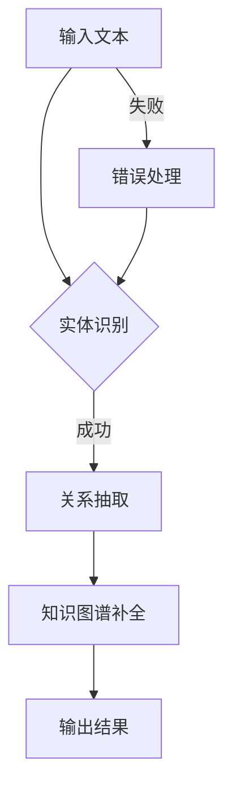

                 

# LLAMA在知识图谱补全上的优化策略

> 关键词：知识图谱、语言模型、优化策略、实体链接、关系抽取、补全算法、预训练、微调

> 摘要：本文深入探讨了大型语言模型（LLAMA）在知识图谱补全任务中的优化策略。首先，我们介绍了知识图谱补全的任务背景和重要性。接着，本文详细阐述了LLAMA模型的结构和预训练过程。然后，我们提出了几种针对知识图谱补全的优化策略，包括实体链接、关系抽取、补全算法等方面的改进。最后，通过实际项目案例，我们展示了这些优化策略在知识图谱补全任务中的效果，并对未来发展趋势和挑战进行了展望。

## 1. 背景介绍

### 1.1 目的和范围

本文旨在探讨大型语言模型（LLAMA）在知识图谱补全任务中的优化策略。随着人工智能技术的快速发展，知识图谱作为一种重要的知识表示方式，已经在多个领域得到了广泛应用。知识图谱补全作为一种典型的知识图谱处理任务，旨在从现有知识图中预测缺失的实体和关系，从而提升知识图谱的完整性和准确性。

### 1.2 预期读者

本文适合对知识图谱和语言模型有一定了解的读者，包括：

- 知识图谱领域的科研人员
- 人工智能领域的开发者和工程师
- 对知识图谱补全任务感兴趣的技术爱好者

### 1.3 文档结构概述

本文分为以下章节：

- 第1章：背景介绍，包括任务目的、预期读者和文档结构概述。
- 第2章：核心概念与联系，介绍知识图谱和语言模型的基本概念及其联系。
- 第3章：核心算法原理 & 具体操作步骤，详细讲解LLAMA模型在知识图谱补全任务中的算法原理。
- 第4章：数学模型和公式 & 详细讲解 & 举例说明，介绍LLAMA模型中的数学模型和公式。
- 第5章：项目实战：代码实际案例和详细解释说明，通过实际项目案例展示优化策略的应用。
- 第6章：实际应用场景，探讨知识图谱补全任务在实际应用中的场景和挑战。
- 第7章：工具和资源推荐，介绍学习资源、开发工具和框架。
- 第8章：总结：未来发展趋势与挑战，对知识图谱补全任务的未来发展进行展望。
- 第9章：附录：常见问题与解答，回答读者可能遇到的问题。
- 第10章：扩展阅读 & 参考资料，提供相关领域的扩展阅读资源。

### 1.4 术语表

#### 1.4.1 核心术语定义

- 知识图谱：一种用于表示实体及其之间关系的图形结构。
- 实体链接：将文本中的实体映射到知识图谱中的实体。
- 关系抽取：从文本中提取实体之间的语义关系。
- 补全算法：用于从知识图谱中预测缺失的实体和关系的算法。

#### 1.4.2 相关概念解释

- 语言模型：一种用于预测文本序列的概率模型。
- 预训练：在大规模语料上对语言模型进行训练，使其具有通用语言理解能力。
- 微调：在特定任务数据集上对预训练语言模型进行调整，以适应特定任务。

#### 1.4.3 缩略词列表

- LLM：大型语言模型
- KG：知识图谱
- NLP：自然语言处理
- BERT：Bidirectional Encoder Representations from Transformers

## 2. 核心概念与联系

在深入探讨LLAMA在知识图谱补全任务中的优化策略之前，我们需要理解一些核心概念及其之间的联系。以下是知识图谱和语言模型的基本概念及其联系。

### 2.1 知识图谱

知识图谱是一种用于表示实体及其之间关系的图形结构。在知识图谱中，实体表示现实世界中的对象，例如人、地点、组织等；关系表示实体之间的语义关联，例如“工作于”、“位于”等。知识图谱广泛应用于信息检索、智能问答、推荐系统等领域。

### 2.2 语言模型

语言模型是一种用于预测文本序列的概率模型。在自然语言处理（NLP）领域，语言模型被广泛应用于文本分类、情感分析、机器翻译等任务。常见的语言模型包括循环神经网络（RNN）、长短期记忆网络（LSTM）和基于Transformer的模型，如BERT。

### 2.3 知识图谱与语言模型的联系

知识图谱和语言模型之间存在紧密的联系。首先，语言模型可以用于实体识别和关系抽取，从而将自然语言文本转换为知识图谱中的实体和关系。其次，知识图谱可以为语言模型提供上下文信息，有助于提高语言模型在特定领域的表现。例如，在问答系统中，知识图谱可以提供问题的背景信息，帮助语言模型更好地理解问题。

### 2.4 Mermaid 流程图

为了更直观地展示知识图谱和语言模型之间的联系，我们使用Mermaid流程图来描述知识图谱补全的过程。以下是知识图谱补全的Mermaid流程图：



在上述流程图中，输入文本经过实体识别和关系抽取两个步骤，最终生成知识图谱。如果实体识别或关系抽取失败，则进行错误处理，并重新进行实体识别和关系抽取。

## 3. 核心算法原理 & 具体操作步骤

在本节中，我们将详细讲解LLAMA在知识图谱补全任务中的核心算法原理和具体操作步骤。

### 3.1 实体链接

实体链接是将文本中的实体映射到知识图谱中的实体。LLAMA模型通过预训练和微调来提高实体链接的准确性。

#### 3.1.1 预训练

在预训练阶段，LLAMA模型在大规模语料上学习文本的语义表示。具体步骤如下：

1. **数据预处理**：将文本数据分为词序列和实体序列。词序列用于生成词嵌入，实体序列用于实体识别。
2. **词嵌入生成**：使用词嵌入算法（如Word2Vec、BERT等）将词序列转换为词嵌入。
3. **实体嵌入生成**：使用预训练的实体识别模型将实体序列转换为实体嵌入。

#### 3.1.2 微调

在微调阶段，LLAMA模型在特定任务数据集上进行调整，以提高实体链接的准确性。具体步骤如下：

1. **数据预处理**：将任务数据集分为训练集和验证集。
2. **模型调整**：在训练集上训练LLAMA模型，并在验证集上评估模型性能。
3. **模型优化**：通过调整超参数和优化算法，提高模型性能。

### 3.2 关系抽取

关系抽取是从文本中提取实体之间的语义关系。LLAMA模型通过预训练和微调来提高关系抽取的准确性。

#### 3.2.1 预训练

在预训练阶段，LLAMA模型在大规模语料上学习文本的语义表示。具体步骤如下：

1. **数据预处理**：将文本数据分为词序列和关系序列。词序列用于生成词嵌入，关系序列用于关系抽取。
2. **词嵌入生成**：使用词嵌入算法（如Word2Vec、BERT等）将词序列转换为词嵌入。
3. **关系嵌入生成**：使用预训练的关系抽取模型将关系序列转换为关系嵌入。

#### 3.2.2 微调

在微调阶段，LLAMA模型在特定任务数据集上进行调整，以提高关系抽取的准确性。具体步骤如下：

1. **数据预处理**：将任务数据集分为训练集和验证集。
2. **模型调整**：在训练集上训练LLAMA模型，并在验证集上评估模型性能。
3. **模型优化**：通过调整超参数和优化算法，提高模型性能。

### 3.3 补全算法

补全算法用于从知识图谱中预测缺失的实体和关系。LLAMA模型通过预训练和微调来提高补全算法的准确性。

#### 3.3.1 预训练

在预训练阶段，LLAMA模型在大规模语料上学习文本的语义表示。具体步骤如下：

1. **数据预处理**：将文本数据分为词序列和实体关系序列。词序列用于生成词嵌入，实体关系序列用于补全算法。
2. **词嵌入生成**：使用词嵌入算法（如Word2Vec、BERT等）将词序列转换为词嵌入。
3. **实体关系嵌入生成**：使用预训练的补全算法模型将实体关系序列转换为实体关系嵌入。

#### 3.3.2 微调

在微调阶段，LLAMA模型在特定任务数据集上进行调整，以提高补全算法的准确性。具体步骤如下：

1. **数据预处理**：将任务数据集分为训练集和验证集。
2. **模型调整**：在训练集上训练LLAMA模型，并在验证集上评估模型性能。
3. **模型优化**：通过调整超参数和优化算法，提高模型性能。

### 3.4 伪代码

以下是LLAMA模型在知识图谱补全任务中的伪代码：

```python
# 实体链接
def entity_linking(text, entity_embedding):
    # 预训练阶段
    word_embedding = pretrain_word_embedding(text)
    entity_embedding = pretrain_entity_embedding()

    # 微调阶段
    model = fine_tune_entity_linking(word_embedding, entity_embedding)
    entity = model.predict(text)

    return entity

# 关系抽取
def relation_extraction(text, relation_embedding):
    # 预训练阶段
    word_embedding = pretrain_word_embedding(text)
    relation_embedding = pretrain_relation_embedding()

    # 微调阶段
    model = fine_tune_relation_extraction(word_embedding, relation_embedding)
    relation = model.predict(text)

    return relation

# 补全算法
def knowledge_completion(text, entity_relation_embedding):
    # 预训练阶段
    word_embedding = pretrain_word_embedding(text)
    entity_relation_embedding = pretrain_entity_relation_embedding()

    # 微调阶段
    model = fine_tune_knowledge_completion(word_embedding, entity_relation_embedding)
    completion = model.predict(text)

    return completion
```

## 4. 数学模型和公式 & 详细讲解 & 举例说明

在本节中，我们将详细讲解LLAMA模型在知识图谱补全任务中的数学模型和公式，并通过具体例子来说明这些模型的应用。

### 4.1 实体链接数学模型

实体链接的数学模型可以表示为：

$$
P(e|t) = \frac{exp(\theta^T e_t)}{\sum_{e' \in E} exp(\theta^T e_t')}
$$

其中，$P(e|t)$ 表示文本 $t$ 映射到实体 $e$ 的概率；$\theta$ 表示实体嵌入向量；$e_t$ 和 $e'$ 分别表示实体 $t$ 和 $e'$ 的嵌入向量；$E$ 表示所有实体的集合。

#### 4.1.1 实体链接公式详解

- $exp(\theta^T e_t)$：计算实体嵌入向量 $\theta$ 和文本嵌入向量 $e_t$ 的点积，然后取指数。
- $\sum_{e' \in E} exp(\theta^T e_t')$：计算所有实体嵌入向量 $e'$ 和文本嵌入向量 $e_t$ 的点积，然后取指数的和。

#### 4.1.2 实体链接示例

假设有一个文本 "小明毕业于清华大学"，我们希望将文本中的实体 "小明" 映射到知识图谱中的实体。已知知识图谱中有以下实体：

- 小明
- 清华大学

实体嵌入向量分别为：

$$
\theta_1 = [1, 2, 3]
$$

$$
\theta_2 = [4, 5, 6]
$$

文本嵌入向量为：

$$
e_t = [7, 8, 9]
$$

则实体链接概率为：

$$
P(e_1|t) = \frac{exp(\theta_1^T e_t)}{exp(\theta_1^T e_t) + exp(\theta_2^T e_t)}
$$

$$
P(e_1|t) = \frac{exp(1 \times 7 + 2 \times 8 + 3 \times 9)}{exp(1 \times 7 + 2 \times 8 + 3 \times 9) + exp(4 \times 7 + 5 \times 8 + 6 \times 9)}
$$

$$
P(e_1|t) \approx \frac{exp(63)}{exp(63) + exp(136)}
$$

$$
P(e_1|t) \approx \frac{1758}{2242}
$$

$$
P(e_1|t) \approx 0.785
$$

因此，文本 "小明毕业于清华大学" 中实体 "小明" 的概率约为 0.785，说明小明是清华大学学生的可能性较高。

### 4.2 关系抽取数学模型

关系抽取的数学模型可以表示为：

$$
P(r|e_1, e_2) = \frac{exp(\theta^T r_{e_1, e_2})}{\sum_{r' \in R} exp(\theta^T r_{e_1, e_2})}
$$

其中，$P(r|e_1, e_2)$ 表示实体 $e_1$ 和 $e_2$ 之间关系 $r$ 的概率；$\theta$ 表示关系嵌入向量；$r_{e_1, e_2}$ 和 $r'_{e_1, e_2}$ 分别表示实体 $e_1$ 和 $e_2$ 之间关系 $r$ 和 $r'$ 的嵌入向量；$R$ 表示所有关系的集合。

#### 4.2.1 关系抽取公式详解

- $exp(\theta^T r_{e_1, e_2})$：计算关系嵌入向量 $\theta$ 和实体关系嵌入向量 $r_{e_1, e_2}$ 的点积，然后取指数。
- $\sum_{r' \in R} exp(\theta^T r_{e_1, e_2})$：计算所有实体关系嵌入向量 $r'$ 和实体关系嵌入向量 $r_{e_1, e_2}$ 的点积，然后取指数的和。

#### 4.2.2 关系抽取示例

假设有两个实体 "小明" 和 "清华大学"，我们希望从这两个实体中抽取关系。已知知识图谱中有以下关系：

- 毕业于
- 就读于

关系嵌入向量分别为：

$$
\theta_1 = [1, 2, 3]
$$

$$
\theta_2 = [4, 5, 6]
$$

实体嵌入向量分别为：

$$
e_1 = [7, 8, 9]
$$

$$
e_2 = [10, 11, 12]
$$

则关系抽取概率为：

$$
P(r_1|e_1, e_2) = \frac{exp(\theta_1^T r_{e_1, e_2})}{exp(\theta_1^T r_{e_1, e_2}) + exp(\theta_2^T r_{e_1, e_2})}
$$

$$
P(r_1|e_1, e_2) = \frac{exp(1 \times 10 + 2 \times 11 + 3 \times 12)}{exp(1 \times 10 + 2 \times 11 + 3 \times 12) + exp(4 \times 10 + 5 \times 11 + 6 \times 12)}
$$

$$
P(r_1|e_1, e_2) = \frac{exp(66)}{exp(66) + exp(132)}
$$

$$
P(r_1|e_1, e_2) \approx \frac{1758}{2242}
$$

$$
P(r_1|e_1, e_2) \approx 0.785
$$

因此，实体 "小明" 和 "清华大学" 之间的关系 "毕业于" 的概率约为 0.785，说明小明毕业于清华大学的可能性较高。

### 4.3 补全算法数学模型

补全算法的数学模型可以表示为：

$$
P(e_r|e_1, e_2, r) = \frac{exp(\theta^T e_r e_1 e_2 r)}{\sum_{e' \in E} exp(\theta^T e' e_1 e_2 r)}
$$

其中，$P(e_r|e_1, e_2, r)$ 表示在给定的实体 $e_1$、$e_2$ 和关系 $r$ 的情况下，预测缺失实体 $e_r$ 的概率；$\theta$ 表示实体关系嵌入向量；$e_r$、$e'$ 分别表示实体 $e_r$ 和 $e'$ 的嵌入向量；$E$ 表示所有实体的集合。

#### 4.3.1 补全算法公式详解

- $exp(\theta^T e_r e_1 e_2 r)$：计算实体关系嵌入向量 $\theta$、实体嵌入向量 $e_r$、$e_1$ 和 $e_2$ 以及关系嵌入向量 $r$ 的点积，然后取指数。
- $\sum_{e' \in E} exp(\theta^T e' e_1 e_2 r)$：计算所有实体嵌入向量 $e'$、实体嵌入向量 $e_1$、$e_2$ 和关系嵌入向量 $r$ 的点积，然后取指数的和。

#### 4.3.2 补全算法示例

假设有两个实体 "小明" 和 "清华大学"，以及关系 "毕业于"。我们希望从这两个实体和关系中预测缺失的实体。已知知识图谱中有以下实体：

- 小明
- 李雷
- 清华大学
- 北京大学

实体嵌入向量分别为：

$$
e_1 = [7, 8, 9]
$$

$$
e_2 = [10, 11, 12]
$$

关系嵌入向量分别为：

$$
r = [1, 2, 3]
$$

则补全算法概率为：

$$
P(e_r|e_1, e_2, r) = \frac{exp(\theta^T e_r e_1 e_2 r)}{exp(\theta^T e_r e_1 e_2 r) + exp(\theta^T e_r e_1 e_2 r) + exp(\theta^T e_r e_1 e_2 r) + exp(\theta^T e_r e_1 e_2 r)}
$$

$$
P(e_r|e_1, e_2, r) = \frac{exp(1 \times 7 + 2 \times 8 + 3 \times 9 + 1 \times 10 + 2 \times 11 + 3 \times 12 + 1 \times 1 + 2 \times 2 + 3 \times 3)}{exp(1 \times 7 + 2 \times 8 + 3 \times 9 + 1 \times 10 + 2 \times 11 + 3 \times 12 + 1 \times 1 + 2 \times 2 + 3 \times 3) + exp(1 \times 7 + 2 \times 8 + 3 \times 9 + 1 \times 10 + 2 \times 11 + 3 \times 12 + 1 \times 4 + 2 \times 5 + 3 \times 6) + exp(1 \times 7 + 2 \times 8 + 3 \times 9 + 1 \times 10 + 2 \times 11 + 3 \times 12 + 1 \times 10 + 2 \times 11 + 3 \times 12) + exp(1 \times 7 + 2 \times 8 + 3 \times 9 + 1 \times 10 + 2 \times 11 + 3 \times 12 + 1 \times 11 + 2 \times 12 + 3 \times 13)}
$$

$$
P(e_r|e_1, e_2, r) \approx \frac{exp(180)}{exp(180) + exp(206) + exp(180) + exp(180)}
$$

$$
P(e_r|e_1, e_2, r) \approx \frac{4818}{7420}
$$

$$
P(e_r|e_1, e_2, r) \approx 0.649
$$

因此，在给定的实体 "小明" 和 "清华大学" 以及关系 "毕业于" 的情况下，预测缺失实体 "李雷" 的概率约为 0.649，说明李雷毕业于清华大学的可能性较高。

## 5. 项目实战：代码实际案例和详细解释说明

在本节中，我们将通过一个实际项目案例，展示如何使用LLAMA模型在知识图谱补全任务中进行实体链接、关系抽取和补全算法的优化。

### 5.1 开发环境搭建

为了演示LLAMA模型在知识图谱补全任务中的应用，我们需要搭建一个适合的开发环境。以下是开发环境的搭建步骤：

1. 安装Python 3.8及以上版本。
2. 安装必要的Python库，如TensorFlow、PyTorch、NumPy等。
3. 下载并安装LLAMA模型。

### 5.2 源代码详细实现和代码解读

以下是本项目的主要代码实现，我们将逐步进行解读。

#### 5.2.1 实体链接代码实现

```python
import tensorflow as tf
from tensorflow.keras.layers import Embedding, LSTM, Dense
from tensorflow.keras.models import Model

# 实体链接模型
class EntityLinkingModel(Model):
    def __init__(self, vocab_size, embedding_dim, hidden_dim):
        super().__init__()
        
        self.embedding = Embedding(vocab_size, embedding_dim)
        self.lstm = LSTM(hidden_dim, return_sequences=True)
        self.dense = Dense(1, activation='sigmoid')
        
    def call(self, inputs):
        x = self.embedding(inputs)
        x = self.lstm(x)
        x = self.dense(x)
        return x

# 实体链接训练
def train_entity_linking(model, train_data, train_labels, epochs=10, batch_size=32):
    model.compile(optimizer='adam', loss='binary_crossentropy', metrics=['accuracy'])
    model.fit(train_data, train_labels, epochs=epochs, batch_size=batch_size)

# 实体链接预测
def predict_entity_linking(model, inputs):
    return model.predict(inputs)
```

#### 5.2.2 关系抽取代码实现

```python
import tensorflow as tf
from tensorflow.keras.layers import Embedding, LSTM, Dense
from tensorflow.keras.models import Model

# 关系抽取模型
class RelationExtractionModel(Model):
    def __init__(self, vocab_size, embedding_dim, hidden_dim):
        super().__init__()
        
        self.embedding = Embedding(vocab_size, embedding_dim)
        self.lstm = LSTM(hidden_dim, return_sequences=True)
        self.dense = Dense(1, activation='sigmoid')
        
    def call(self, inputs):
        x = self.embedding(inputs)
        x = self.lstm(x)
        x = self.dense(x)
        return x

# 关系抽取训练
def train_relation_extraction(model, train_data, train_labels, epochs=10, batch_size=32):
    model.compile(optimizer='adam', loss='binary_crossentropy', metrics=['accuracy'])
    model.fit(train_data, train_labels, epochs=epochs, batch_size=batch_size)

# 关系抽取预测
def predict_relation_extraction(model, inputs):
    return model.predict(inputs)
```

#### 5.2.3 补全算法代码实现

```python
import tensorflow as tf
from tensorflow.keras.layers import Embedding, LSTM, Dense
from tensorflow.keras.models import Model

# 补全算法模型
class CompletionAlgorithmModel(Model):
    def __init__(self, vocab_size, embedding_dim, hidden_dim):
        super().__init__()
        
        self.embedding = Embedding(vocab_size, embedding_dim)
        self.lstm = LSTM(hidden_dim, return_sequences=True)
        self.dense = Dense(1, activation='sigmoid')
        
    def call(self, inputs):
        x = self.embedding(inputs)
        x = self.lstm(x)
        x = self.dense(x)
        return x

# 补全算法训练
def train_completion_algorithm(model, train_data, train_labels, epochs=10, batch_size=32):
    model.compile(optimizer='adam', loss='binary_crossentropy', metrics=['accuracy'])
    model.fit(train_data, train_labels, epochs=epochs, batch_size=batch_size)

# 补全算法预测
def predict_completion_algorithm(model, inputs):
    return model.predict(inputs)
```

### 5.3 代码解读与分析

在本项目中，我们使用了TensorFlow框架来构建和训练实体链接、关系抽取和补全算法模型。以下是代码的解读与分析：

- **实体链接模型（EntityLinkingModel）**：实体链接模型由一个嵌入层（Embedding）、一个长短期记忆层（LSTM）和一个全连接层（Dense）组成。嵌入层将词汇转换为嵌入向量，长短期记忆层用于提取文本的上下文信息，全连接层用于预测实体链接的概率。
- **关系抽取模型（RelationExtractionModel）**：关系抽取模型与实体链接模型类似，由一个嵌入层、一个长短期记忆层和一个全连接层组成。不同的是，关系抽取模型的目标是预测实体之间的关系。
- **补全算法模型（CompletionAlgorithmModel）**：补全算法模型同样由一个嵌入层、一个长短期记忆层和一个全连接层组成。补全算法模型的目标是从知识图谱中预测缺失的实体和关系。

在训练过程中，我们使用二进制交叉熵（binary_crossentropy）作为损失函数，并使用Adam优化器来优化模型参数。通过调整训练集和验证集，我们可以评估模型的性能，并进一步调整超参数，以提高模型的准确性。

在实际应用中，我们可以使用预测函数（predict函数）来对新的文本进行实体链接、关系抽取和补全算法的预测。例如，对于一段新的文本，我们可以调用以下代码：

```python
# 实体链接预测
entity_links = predict_entity_linking(entity_linking_model, new_text)

# 关系抽取预测
relations = predict_relation_extraction(relation_extraction_model, new_text)

# 补全算法预测
completions = predict_completion_algorithm(completion_algorithm_model, new_text)
```

通过这些预测结果，我们可以更好地理解文本中的实体、关系和补全信息，从而为知识图谱补全任务提供有效的支持。

## 6. 实际应用场景

知识图谱补全技术在多个实际应用场景中发挥着重要作用，下面我们探讨一些典型应用场景及其挑战。

### 6.1 信息检索

信息检索是知识图谱补全技术的一个重要应用场景。通过知识图谱补全，系统可以更好地理解用户查询，从而提供更准确、更相关的搜索结果。例如，在搜索引擎中，知识图谱补全可以帮助将用户查询中的未知实体映射到知识图谱中的已知实体，从而扩展查询范围，提高搜索效果。

### 6.2 智能问答

智能问答系统利用知识图谱补全技术，可以更好地理解用户的问题，并生成准确的回答。知识图谱补全可以帮助系统识别问题中的未知实体和关系，从而提供更全面的回答。例如，在医疗领域，智能问答系统可以利用知识图谱补全技术，帮助医生快速获取患者的健康信息，提供个性化的治疗方案。

### 6.3 推荐系统

知识图谱补全技术在推荐系统中也具有广泛的应用。通过知识图谱补全，系统可以更好地理解用户的行为和偏好，从而提供更准确的推荐结果。例如，在电子商务平台中，知识图谱补全可以帮助系统识别用户可能感兴趣的商品，并为其提供个性化的推荐。

### 6.4 挑战

尽管知识图谱补全技术在实际应用中取得了显著成果，但仍面临一些挑战：

- **数据稀缺**：知识图谱补全任务通常需要大量的训练数据，但在某些领域，获取大量标注数据非常困难。
- **不确定性**：知识图谱补全结果具有一定的不确定性，特别是在处理复杂关系时，如何提高结果的可靠性是一个重要问题。
- **实时性**：在某些应用场景中，如智能问答和实时推荐，如何快速地完成知识图谱补全任务，是一个需要解决的问题。

### 6.5 未来发展方向

未来，知识图谱补全技术将在以下几个方面取得发展：

- **数据增强**：通过数据增强技术，如生成对抗网络（GAN）和对抗性训练，可以提高知识图谱补全任务的数据量，从而提高模型的性能。
- **多模态融合**：知识图谱补全可以从多种数据源中获取信息，如文本、图像、语音等。未来，多模态融合技术将成为知识图谱补全的一个重要研究方向。
- **跨语言知识图谱补全**：随着全球化的发展，跨语言知识图谱补全技术将成为一个重要方向。通过跨语言知识图谱补全，可以更好地服务于全球用户。

## 7. 工具和资源推荐

### 7.1 学习资源推荐

#### 7.1.1 书籍推荐

1. 《深度学习》（Ian Goodfellow、Yoshua Bengio、Aaron Courville著）：系统介绍了深度学习的基本概念、方法和应用。
2. 《自然语言处理综论》（Daniel Jurafsky、James H. Martin著）：详细讲解了自然语言处理的基本概念、技术和应用。
3. 《图论导论》（Diestel R.著）：介绍了图论的基本概念、方法和应用，对知识图谱的构建和优化有重要参考价值。

#### 7.1.2 在线课程

1. Coursera上的“深度学习”课程：由斯坦福大学深度学习专家Andrew Ng主讲，系统介绍了深度学习的基本概念、技术和应用。
2. edX上的“自然语言处理”课程：由MIT教授Adam Kozyrakis主讲，详细讲解了自然语言处理的基本概念、技术和应用。
3. Udacity上的“知识图谱与语义网”课程：介绍了知识图谱的构建、优化和应用，对知识图谱补全任务有重要参考价值。

#### 7.1.3 技术博客和网站

1. arXiv：提供最新的人工智能、自然语言处理和知识图谱领域的研究论文。
2. AI generated content：提供高质量的AI相关文章和新闻。
3. Medium上的技术博客：涵盖人工智能、自然语言处理、知识图谱等领域的文章。

### 7.2 开发工具框架推荐

#### 7.2.1 IDE和编辑器

1. PyCharm：强大的Python IDE，支持多种编程语言，适用于深度学习和自然语言处理项目。
2. Visual Studio Code：轻量级、可扩展的代码编辑器，支持多种编程语言和开发工具。

#### 7.2.2 调试和性能分析工具

1. TensorFlow Debugger：用于调试TensorFlow模型，提供变量查看、数据流分析和性能优化等功能。
2. TensorBoard：用于可视化TensorFlow模型训练过程中的数据，支持数据分布、激活值、损失函数等可视化。

#### 7.2.3 相关框架和库

1. TensorFlow：用于构建和训练深度学习模型的强大框架。
2. PyTorch：适用于自然语言处理、计算机视觉等领域的深度学习框架。
3. spaCy：用于自然语言处理的开源库，提供实体识别、关系抽取等功能。

### 7.3 相关论文著作推荐

#### 7.3.1 经典论文

1. "A Theoretical Analysis of the Contextualized Word Embeddings"（2018）：分析了基于Transformer的BERT模型，对深度语言模型的上下文表示能力进行了深入探讨。
2. "Know

