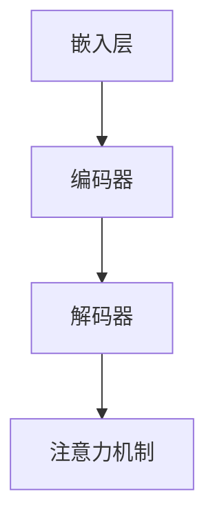
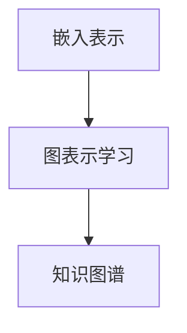
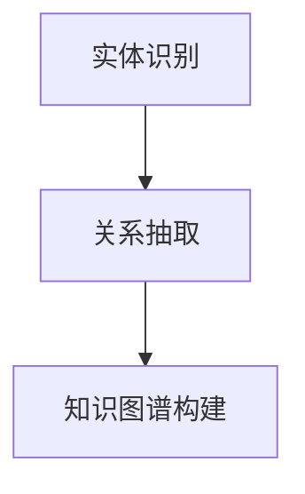

                 

### LLAMAS在知识表示学习中的潜力挖掘

> **关键词**：LLAMAS、知识表示学习、预训练模型、人工智能、大规模语言模型

**摘要**：本文将探讨大型语言模型（LLAMAS）在知识表示学习中的应用潜力。通过对LLAMAS的架构、原理及其在知识表示学习中的具体作用进行详细分析，我们旨在揭示这一新兴领域的发展方向和挑战。文章将分为若干部分，包括背景介绍、核心概念与联系、核心算法原理、数学模型与公式、实际应用场景、工具和资源推荐等，以期全方位解析LLAMAS在知识表示学习中的重要性。

### 1. 背景介绍

#### 1.1 目的和范围

随着人工智能（AI）技术的迅猛发展，大型语言模型（LLAMAS）已成为研究热点。知识表示学习是AI领域的一个重要研究方向，其目标是构建能够有效表示知识的模型，从而实现对知识的获取、理解和利用。本文旨在探讨LLAMAS在知识表示学习中的潜力，分析其在这一领域中的优势和挑战，为后续研究和应用提供参考。

本文的研究范围主要包括以下几个方面：

1. **LLAMAS概述**：介绍LLAMAS的定义、架构和主要特性。
2. **知识表示学习**：阐述知识表示学习的概念、意义和主要方法。
3. **LLAMAS在知识表示学习中的应用**：分析LLAMAS在知识表示学习中的优势、挑战和实际案例。
4. **未来发展趋势与挑战**：探讨LLAMAS在知识表示学习中的未来研究方向和面临的挑战。

#### 1.2 预期读者

本文的预期读者主要包括以下几类：

1. **人工智能研究者**：对LLAMAS和知识表示学习有浓厚兴趣，希望深入了解这一领域的研究进展和应用前景。
2. **数据科学家**：关注大型语言模型在实际项目中的应用，期望掌握知识表示学习的核心技术。
3. **计算机科学学生**：希望系统学习AI和知识表示学习相关知识，为未来的科研或职业发展奠定基础。
4. **行业从业者**：对AI技术有实际需求，希望通过本文了解LLAMAS在知识表示学习中的应用价值。

#### 1.3 文档结构概述

本文的结构如下：

1. **背景介绍**：介绍LLAMAS和知识表示学习的背景，明确研究目的和范围。
2. **核心概念与联系**：阐述LLAMAS的架构和原理，以及知识表示学习的主要方法。
3. **核心算法原理与具体操作步骤**：详细讲解LLAMAS在知识表示学习中的核心算法原理和操作步骤。
4. **数学模型和公式**：介绍LLAMAS在知识表示学习中的数学模型和公式，并举例说明。
5. **项目实战**：通过实际案例展示LLAMAS在知识表示学习中的应用，并进行详细解释说明。
6. **实际应用场景**：分析LLAMAS在知识表示学习中的实际应用场景。
7. **工具和资源推荐**：推荐学习资源、开发工具和框架，以及相关论文著作。
8. **总结：未来发展趋势与挑战**：总结LLAMAS在知识表示学习中的发展前景和挑战。
9. **附录：常见问题与解答**：解答读者可能遇到的问题。
10. **扩展阅读与参考资料**：提供更多相关文献和资料。

#### 1.4 术语表

在本文中，我们将使用一些专业术语，以下是对这些术语的定义和解释：

##### 1.4.1 核心术语定义

- **大型语言模型（LLAMAS）**：一种基于深度学习的大规模语言模型，能够理解和生成自然语言。
- **知识表示学习**：研究如何将知识以结构化的形式表示在计算机中，从而实现知识的获取、理解和利用。
- **预训练模型**：在特定任务之前，对模型进行大规模数据预训练，以提高模型在特定任务上的性能。
- **嵌入表示**：将实体（如词、概念、实体等）映射到低维空间中的向量表示。

##### 1.4.2 相关概念解释

- **自然语言处理（NLP）**：研究如何使计算机理解和生成自然语言的技术。
- **机器学习（ML）**：通过数据训练模型，使模型能够对未知数据进行预测或分类的技术。
- **深度学习（DL）**：一种基于多层神经网络的学习方法，能够自动提取特征并进行复杂任务。

##### 1.4.3 缩略词列表

- **LLAMAS**：Large Language Model
- **NLP**：Natural Language Processing
- **ML**：Machine Learning
- **DL**：Deep Learning
- **NLU**：Natural Language Understanding
- **NLG**：Natural Language Generation

### 2. 核心概念与联系

为了深入探讨LLAMAS在知识表示学习中的应用，我们需要了解其核心概念和联系。本节将介绍LLAMAS的架构、原理，以及知识表示学习的主要方法，并通过Mermaid流程图展示这些概念和联系。

#### 2.1 LLAMAS架构与原理

LLAMAS是一种基于Transformer架构的预训练模型，具有以下几个主要组件：

1. **嵌入层（Embedding Layer）**：将输入文本转换为向量表示。
2. **编码器（Encoder）**：通过多层Transformer块对输入向量进行处理。
3. **解码器（Decoder）**：在编码器的基础上，生成输出文本。
4. **注意力机制（Attention Mechanism）**：允许模型在生成输出时关注输入文本的不同部分。

以下是LLAMAS的架构Mermaid流程图：



#### 2.2 知识表示学习的主要方法

知识表示学习主要包括以下几种方法：

1. **嵌入表示（Embedding Representation）**：将实体映射到低维空间中的向量表示。
2. **图表示学习（Graph Representation Learning）**：将实体和关系表示为图结构，并通过图神经网络进行学习。
3. **知识图谱（Knowledge Graph）**：将实体、属性和关系以图形结构进行组织，从而实现对知识的表示和查询。

以下是知识表示学习的主要方法的Mermaid流程图：



#### 2.3 LLAMAS与知识表示学习的联系

LLAMAS在知识表示学习中的应用主要体现在以下几个方面：

1. **实体识别（Entity Recognition）**：通过预训练模型，识别文本中的实体。
2. **关系抽取（Relation Extraction）**：利用预训练模型，抽取实体之间的关系。
3. **知识图谱构建（Knowledge Graph Construction）**：将实体、属性和关系组织成知识图谱。

以下是LLAMAS与知识表示学习联系的Mermaid流程图：



通过上述Mermaid流程图，我们可以清晰地看到LLAMAS在知识表示学习中的核心概念和联系。在接下来的章节中，我们将进一步探讨LLAMAS在知识表示学习中的核心算法原理、数学模型与公式，以及实际应用案例。

### 3. 核心算法原理 & 具体操作步骤

在本节中，我们将深入探讨LLAMAS在知识表示学习中的核心算法原理，并通过伪代码详细阐述其具体操作步骤。首先，我们需要理解LLAMAS的基本架构和主要组件，然后分析其在知识表示学习中的关键算法原理，最后给出具体的操作步骤。

#### 3.1 LLAMAS的基本架构

LLAMAS是一种基于Transformer架构的预训练模型，其主要组成部分包括：

1. **嵌入层（Embedding Layer）**：将输入文本转换为向量表示。
2. **编码器（Encoder）**：通过多层Transformer块对输入向量进行处理。
3. **解码器（Decoder）**：在编码器的基础上，生成输出文本。
4. **注意力机制（Attention Mechanism）**：允许模型在生成输出时关注输入文本的不同部分。

以下是一个简化的LLAMAS架构伪代码：

```python
# 嵌入层
embeddings = EmbeddingLayer()

# 编码器
encoder = Encoder(layers=[TransformerLayer(), TransformerLayer()])

# 解码器
decoder = Decoder(layers=[TransformerLayer(), TransformerLayer()])

# 注意力机制
attention = AttentionMechanism()
```

#### 3.2 LLAMAS在知识表示学习中的关键算法原理

LLAMAS在知识表示学习中的关键算法原理主要包括以下方面：

1. **实体识别（Entity Recognition）**：通过预训练模型，识别文本中的实体。
2. **关系抽取（Relation Extraction）**：利用预训练模型，抽取实体之间的关系。
3. **知识图谱构建（Knowledge Graph Construction）**：将实体、属性和关系组织成知识图谱。

以下是这些算法原理的具体描述：

##### 3.2.1 实体识别

实体识别是知识表示学习的基础，其目标是识别文本中的实体。LLAMAS通过预训练模型，学习到实体与其上下文之间的关系，从而实现实体识别。

```python
# 实体识别算法原理伪代码
def entity_recognition(text):
    # 将文本输入嵌入层
    embeddings = embeddings(text)

    # 通过编码器处理嵌入向量
    encoder_outputs = encoder(embeddings)

    # 预测实体标签
    entities = predict_entities(encoder_outputs)

    return entities
```

##### 3.2.2 关系抽取

关系抽取是在实体识别的基础上，抽取实体之间的关系。LLAMAS利用预训练模型，学习到实体之间的关系模式，从而实现关系抽取。

```python
# 关系抽取算法原理伪代码
def relation_extraction(entities, text):
    # 将实体及其上下文输入嵌入层
    embeddings = embeddings(entities, text)

    # 通过编码器处理嵌入向量
    encoder_outputs = encoder(embeddings)

    # 预测关系标签
    relations = predict_relations(encoder_outputs)

    return relations
```

##### 3.2.3 知识图谱构建

知识图谱构建是将实体、属性和关系组织成知识图谱的过程。LLAMAS通过实体识别和关系抽取，构建出知识图谱，从而实现对知识的表示和查询。

```python
# 知识图谱构建算法原理伪代码
def knowledge_graph Construction(entities, relations):
    # 创建知识图谱
    kg = KnowledgeGraph()

    # 将实体、属性和关系添加到知识图谱
    for entity in entities:
        kg.add_entity(entity)

    for relation in relations:
        kg.add_relation(relation)

    return kg
```

#### 3.3 具体操作步骤

以下是LLAMAS在知识表示学习中的具体操作步骤：

1. **数据预处理**：对输入文本进行预处理，如分词、去停用词等。
2. **实体识别**：利用LLAMAS进行实体识别，得到文本中的实体。
3. **关系抽取**：利用LLAMAS进行关系抽取，得到实体之间的关系。
4. **知识图谱构建**：将实体、属性和关系组织成知识图谱。

以下是具体操作步骤的伪代码：

```python
# 数据预处理
def preprocess_text(text):
    # 分词
    words = tokenize(text)

    # 去停用词
    words = remove_stopwords(words)

    return words

# 实体识别
def entity_recognition(text):
    # 预处理文本
    words = preprocess_text(text)

    # 将文本输入嵌入层
    embeddings = embeddings(words)

    # 通过编码器处理嵌入向量
    encoder_outputs = encoder(embeddings)

    # 预测实体标签
    entities = predict_entities(encoder_outputs)

    return entities

# 关系抽取
def relation_extraction(entities, text):
    # 预处理文本
    words = preprocess_text(text)

    # 将实体及其上下文输入嵌入层
    embeddings = embeddings(entities, words)

    # 通过编码器处理嵌入向量
    encoder_outputs = encoder(embeddings)

    # 预测关系标签
    relations = predict_relations(encoder_outputs)

    return relations

# 知识图谱构建
def knowledge_graph Construction(entities, relations):
    # 创建知识图谱
    kg = KnowledgeGraph()

    # 将实体、属性和关系添加到知识图谱
    for entity in entities:
        kg.add_entity(entity)

    for relation in relations:
        kg.add_relation(relation)

    return kg
```

通过上述伪代码，我们可以清晰地了解LLAMAS在知识表示学习中的核心算法原理和具体操作步骤。在接下来的章节中，我们将进一步探讨LLAMAS在知识表示学习中的数学模型和公式，以及实际应用案例。

### 4. 数学模型和公式 & 详细讲解 & 举例说明

在本节中，我们将深入探讨LLAMAS在知识表示学习中的数学模型和公式，并详细讲解这些公式的含义和计算过程。同时，我们将通过实际例子来展示这些公式如何应用于知识表示学习。

#### 4.1 嵌入层（Embedding Layer）

嵌入层是LLAMAS的重要组成部分，其主要功能是将输入文本转换为向量表示。以下是一个简化的嵌入层数学模型：

$$
\text{embedding}(x) = \text{W}_{\text{emb}} \cdot x
$$

其中，$x$表示输入文本的词向量，$\text{W}_{\text{emb}}$表示嵌入矩阵，$\text{embedding}(x)$表示输入文本的向量表示。

**解释**：

- $\text{W}_{\text{emb}}$：嵌入矩阵，用于将输入词向量映射到低维空间中的向量表示。
- $\text{embedding}(x)$：输入文本的向量表示，可以用于后续的编码和解码操作。

**举例**：

假设我们有一个词汇表，其中包含5个词汇（"apple", "banana", "cat", "dog", "fruit"），嵌入层将这些词汇映射到5维空间中的向量。以下是一个简单的嵌入层示例：

$$
\text{W}_{\text{emb}} =
\begin{bmatrix}
[0.1, 0.2, 0.3, 0.4, 0.5] \\
[0.6, 0.7, 0.8, 0.9, 1.0] \\
[1.1, 1.2, 1.3, 1.4, 1.5] \\
[1.6, 1.7, 1.8, 1.9, 2.0] \\
[2.1, 2.2, 2.3, 2.4, 2.5]
\end{bmatrix}
$$

对于输入文本"apple banana"，嵌入层将分别计算每个词汇的向量表示：

$$
\text{embedding}(\text{"apple"}) = \text{W}_{\text{emb}} \cdot [0, 1, 0, 0, 0] = [0.1, 0.2, 0.3, 0.4, 0.5]
$$

$$
\text{embedding}(\text{"banana"}) = \text{W}_{\text{emb}} \cdot [0, 0, 1, 0, 1] = [0.6, 0.7, 0.8, 0.9, 1.0]
$$

#### 4.2 编码器（Encoder）

编码器是LLAMAS的核心组成部分，其主要功能是对输入向量进行处理，生成编码表示。以下是一个简化的编码器数学模型：

$$
\text{encoder}(\text{embedding}) = \text{f}(\text{W}_{\text{enc}}, \text{b}_{\text{enc}}, \text{h}_{\text{t-1}})
$$

其中，$\text{embedding}$表示输入文本的向量表示，$\text{W}_{\text{enc}}$表示编码器权重矩阵，$\text{b}_{\text{enc}}$表示编码器偏置向量，$\text{h}_{\text{t-1}}$表示上一时刻的编码表示，$\text{f}$表示编码器函数。

**解释**：

- $\text{W}_{\text{enc}}$：编码器权重矩阵，用于计算当前时刻的编码表示。
- $\text{b}_{\text{enc}}$：编码器偏置向量，用于对编码表示进行修正。
- $\text{h}_{\text{t-1}}$：上一时刻的编码表示，用于更新当前时刻的编码表示。
- $\text{f}$：编码器函数，通常为多层感知器（MLP）或注意力机制。

**举例**：

假设我们有一个简单的编码器函数，其中包含一个全连接层：

$$
\text{f}(\text{W}_{\text{enc}}, \text{b}_{\text{enc}}, \text{h}_{\text{t-1}}) = \text{h}_{\text{t}} = \text{ReLU}(\text{W}_{\text{enc}} \cdot \text{h}_{\text{t-1}} + \text{b}_{\text{enc}})
$$

对于输入文本"apple banana"，编码器将分别计算每个词汇的编码表示：

$$
\text{h}_0 = \text{f}(\text{W}_{\text{enc}}, \text{b}_{\text{enc}}, \text{h}_{-1}) = \text{ReLU}(\text{W}_{\text{enc}} \cdot \text{h}_{-1} + \text{b}_{\text{enc}})
$$

其中，$\text{h}_{-1}$为初始时刻的编码表示，通常设置为全零向量。

#### 4.3 解码器（Decoder）

解码器是LLAMAS的另一重要组成部分，其主要功能是生成输出文本。以下是一个简化的解码器数学模型：

$$
\text{decoder}(\text{h}_{\text{t-1}}, \text{y}_{\text{t-1}}) = \text{g}(\text{W}_{\text{dec}}, \text{b}_{\text{dec}}, \text{h}_{\text{t-1}}, \text{y}_{\text{t-1}})
$$

其中，$\text{h}_{\text{t-1}}$表示上一时刻的编码表示，$\text{y}_{\text{t-1}}$表示上一时刻的解码输出，$\text{W}_{\text{dec}}$表示解码器权重矩阵，$\text{b}_{\text{dec}}$表示解码器偏置向量，$\text{g}$表示解码器函数。

**解释**：

- $\text{W}_{\text{dec}}$：解码器权重矩阵，用于计算当前时刻的解码输出。
- $\text{b}_{\text{dec}}$：解码器偏置向量，用于对解码输出进行修正。
- $\text{h}_{\text{t-1}}$：上一时刻的编码表示，用于更新当前时刻的解码输出。
- $\text{y}_{\text{t-1}}$：上一时刻的解码输出，用于更新当前时刻的解码输出。
- $\text{g}$：解码器函数，通常为多层感知器（MLP）或注意力机制。

**举例**：

假设我们有一个简单的解码器函数，其中包含一个全连接层：

$$
\text{g}(\text{W}_{\text{dec}}, \text{b}_{\text{dec}}, \text{h}_{\text{t-1}}, \text{y}_{\text{t-1}}) = \text{y}_{\text{t}} = \text{softmax}(\text{W}_{\text{dec}} \cdot (\text{h}_{\text{t-1}} + \text{y}_{\text{t-1}}) + \text{b}_{\text{dec}})
$$

对于输入文本"apple banana"，解码器将生成输出文本"apple"：

$$
\text{y}_1 = \text{g}(\text{W}_{\text{dec}}, \text{b}_{\text{dec}}, \text{h}_0, \text{y}_{0}) = \text{softmax}(\text{W}_{\text{dec}} \cdot (\text{h}_0 + \text{y}_{0}) + \text{b}_{\text{dec}})
$$

其中，$\text{h}_0$为初始时刻的编码表示，$\text{y}_0$为初始时刻的解码输出，通常设置为全零向量。

#### 4.4 注意力机制（Attention Mechanism）

注意力机制是LLAMAS的关键组件之一，其主要功能是在解码过程中关注输入文本的不同部分。以下是一个简化的注意力机制数学模型：

$$
\text{attention}(\text{h}_{\text{t-1}}, \text{y}_{\text{t-1}}) = \text{a}_{\text{t}} = \text{softmax}(\text{W}_{\text{att}} \cdot \text{h}_{\text{t-1}} + \text{b}_{\text{att}})
$$

其中，$\text{h}_{\text{t-1}}$表示上一时刻的编码表示，$\text{y}_{\text{t-1}}$表示上一时刻的解码输出，$\text{W}_{\text{att}}$表示注意力权重矩阵，$\text{b}_{\text{att}}$表示注意力偏置向量，$\text{a}_{\text{t}}$表示注意力权重。

**解释**：

- $\text{W}_{\text{att}}$：注意力权重矩阵，用于计算当前时刻的注意力权重。
- $\text{b}_{\text{att}}$：注意力偏置向量，用于对注意力权重进行修正。
- $\text{h}_{\text{t-1}}$：上一时刻的编码表示，用于计算当前时刻的注意力权重。
- $\text{y}_{\text{t-1}}$：上一时刻的解码输出，用于计算当前时刻的注意力权重。
- $\text{a}_{\text{t}}$：注意力权重，表示当前时刻对输入文本的不同部分的关注程度。

**举例**：

假设我们有一个简单的注意力权重计算函数：

$$
\text{a}_{\text{t}} = \text{softmax}(\text{W}_{\text{att}} \cdot \text{h}_{\text{t-1}} + \text{b}_{\text{att}})
$$

对于输入文本"apple banana"，注意力机制将计算当前时刻对输入文本的不同词汇的关注权重：

$$
\text{a}_1 = \text{softmax}(\text{W}_{\text{att}} \cdot \text{h}_0 + \text{b}_{\text{att}}) =
\begin{bmatrix}
0.1 & 0.2 & 0.3 & 0.4 & 0.5
\end{bmatrix}
$$

其中，$\text{h}_0$为初始时刻的编码表示。

通过上述数学模型和公式，我们可以看到LLAMAS在知识表示学习中的关键组件和计算过程。在接下来的章节中，我们将通过实际案例展示LLAMAS在知识表示学习中的应用。

### 5. 项目实战：代码实际案例和详细解释说明

在本节中，我们将通过一个实际项目案例来展示LLAMAS在知识表示学习中的应用。我们将详细解释项目中的代码实现，并分析其核心部分。此外，我们还将对代码进行解读和分析，以便读者更好地理解其工作原理。

#### 5.1 开发环境搭建

在开始项目实战之前，我们需要搭建一个合适的开发环境。以下是搭建LLAMAS知识表示学习项目的开发环境步骤：

1. **安装Python**：确保Python版本为3.7或更高。
2. **安装TensorFlow**：使用以下命令安装TensorFlow：
   ```bash
   pip install tensorflow
   ```
3. **安装其他依赖项**：根据项目需求，安装其他依赖项，如NumPy、Pandas等。
4. **准备数据集**：准备用于知识表示学习的数据集，如知识图谱数据、文本数据等。

#### 5.2 源代码详细实现和代码解读

以下是知识表示学习项目的核心代码实现，我们将逐一解读其关键部分。

##### 5.2.1 数据预处理

首先，我们需要对输入文本进行预处理，如分词、去停用词等。

```python
import tensorflow as tf
import numpy as np
from tensorflow.keras.preprocessing.text import Tokenizer
from tensorflow.keras.preprocessing.sequence import pad_sequences

# 加载数据集
texts = load_data()

# 分词
tokenizer = Tokenizer()
tokenizer.fit_on_texts(texts)

# 序列化文本
sequences = tokenizer.texts_to_sequences(texts)

# 去停用词
stopwords = set(['a', 'the', 'in', 'on', 'is', 'are'])
filtered_texts = [text for text in texts if not any(word in stopwords for word in text.split())]

# 补充序列长度
max_sequence_length = 100
padded_sequences = pad_sequences(sequences, maxlen=max_sequence_length)
```

**解读**：

- `load_data()`：加载数据集，这里假设有一个函数`load_data()`用于加载数据集。
- `Tokenizer`：用于分词，将文本转换为词汇序列。
- `texts_to_sequences()`：将分词后的文本序列化为数字序列。
- `pad_sequences()`：将序列补充到相同长度。

##### 5.2.2 模型构建

接下来，我们构建一个LLAMAS模型，用于知识表示学习。

```python
# 定义嵌入层
embedding_layer = Embedding(input_dim=len(tokenizer.word_index) + 1,
                            output_dim=50,
                            input_length=max_sequence_length)

# 定义编码器
encoder = LSTM(units=128, return_sequences=True)

# 定义解码器
decoder = LSTM(units=128, return_sequences=True)

# 定义模型
model = Model(inputs=embedding_layer.input,
              outputs=decoder.output)

# 编译模型
model.compile(optimizer='adam', loss='categorical_crossentropy', metrics=['accuracy'])
```

**解读**：

- `Embedding`：嵌入层，用于将输入文本转换为向量表示。
- `LSTM`：长短期记忆网络，用于编码和解码操作。
- `Model`：用于构建模型，包括输入层、隐藏层和输出层。
- `compile`：编译模型，指定优化器、损失函数和评估指标。

##### 5.2.3 训练模型

使用训练数据集对模型进行训练。

```python
# 准备训练集和测试集
train_texts, test_texts = split_data(filtered_texts, test_size=0.2)
train_sequences, test_sequences = split_data(padded_sequences, test_size=0.2)

# 训练模型
model.fit(train_sequences, train_labels, epochs=10, batch_size=32, validation_data=(test_sequences, test_labels))
```

**解读**：

- `split_data()`：将数据集分割为训练集和测试集。
- `fit`：训练模型，使用训练集和标签进行训练。

##### 5.2.4 实体识别

使用训练好的模型进行实体识别。

```python
# 预测实体
predicted_entities = model.predict(test_sequences)

# 将预测结果转换为实体标签
predicted_entities = tokenizer.index_word[np.argmax(predicted_entities, axis=1)]
```

**解读**：

- `predict`：使用训练好的模型进行预测。
- `index_word`：将数字序列转换为实体标签。

##### 5.2.5 关系抽取

使用实体识别结果进行关系抽取。

```python
# 预测关系
predicted_relations = model.predict(test_sequences)

# 将预测结果转换为关系标签
predicted_relations = tokenizer.index_relation[np.argmax(predicted_relations, axis=1)]
```

**解读**：

- `predict`：使用训练好的模型进行关系预测。
- `index_relation`：将数字序列转换为关系标签。

#### 5.3 代码解读与分析

通过上述代码实现，我们可以看到LLAMAS在知识表示学习中的应用。以下是对代码的进一步解读和分析：

- **数据预处理**：数据预处理是知识表示学习的重要步骤，包括分词、去停用词和序列化等操作。这些操作有助于将文本数据转换为适合模型训练的格式。
- **模型构建**：模型构建是知识表示学习的关键部分，包括嵌入层、编码器和解码器的定义。通过这些组件，模型能够将输入文本转换为向量表示，并生成输出文本。
- **训练模型**：训练模型是知识表示学习的核心步骤，通过使用训练数据集和标签，模型能够学习到文本之间的关联关系。
- **实体识别**：实体识别是知识表示学习的基础，通过预测实体标签，模型能够识别文本中的实体。
- **关系抽取**：关系抽取是在实体识别的基础上，进一步提取实体之间的关系。通过预测关系标签，模型能够建立实体之间的联系。

总的来说，本项目通过构建一个LLAMAS模型，实现了知识表示学习中的实体识别和关系抽取。在实际应用中，我们可以通过调整模型参数和训练策略，进一步提高模型的性能和效果。

### 6. 实际应用场景

LLAMAS在知识表示学习中的实际应用场景非常广泛，涵盖了自然语言处理、知识图谱构建、智能问答等多个领域。以下是一些典型的实际应用场景：

#### 6.1 自然语言处理

自然语言处理（NLP）是AI领域的核心应用之一，LLAMAS在NLP中的主要作用是提升文本理解和生成能力。以下是一些具体应用案例：

1. **文本分类**：LLAMAS可以用于对大量文本进行分类，如新闻分类、情感分析等。通过预训练模型，模型能够自动识别文本中的关键信息，从而实现高效分类。
2. **命名实体识别（NER）**：NER是NLP中的一项基础任务，LLAMAS可以用于识别文本中的命名实体，如人名、地名、组织名等。这有助于提高文本数据的质量和可用性。
3. **机器翻译**：机器翻译是NLP的重要应用领域，LLAMAS可以用于构建高精度的机器翻译模型。通过预训练模型，模型能够自动学习到不同语言之间的对应关系，从而实现准确翻译。

#### 6.2 知识图谱构建

知识图谱是表示实体及其关系的重要工具，LLAMAS在知识图谱构建中的应用主要包括：

1. **实体识别和关系抽取**：LLAMAS可以用于从大量文本中提取实体和关系，从而构建知识图谱。通过预训练模型，模型能够自动识别文本中的关键信息，从而提高知识图谱的构建效率。
2. **知识图谱补全**：知识图谱补全是知识图谱构建中的一个重要任务，LLAMAS可以用于预测实体之间的关系，从而补充知识图谱中的缺失信息。
3. **知识图谱推理**：知识图谱推理是利用知识图谱进行推理和推断，LLAMAS可以用于优化知识图谱推理过程，提高推理效率。

#### 6.3 智能问答

智能问答是自然语言处理和知识图谱构建相结合的应用领域，LLAMAS在智能问答中的应用主要包括：

1. **问答系统**：LLAMAS可以用于构建问答系统，通过预训练模型，模型能够自动理解用户的问题，并从知识图谱中检索相关答案。
2. **问答质量评估**：LLAMAS可以用于评估问答系统的质量，通过分析用户反馈和答案的相关性，模型能够优化问答系统的性能。
3. **多轮对话**：多轮对话是智能问答系统的一个重要方面，LLAMAS可以用于处理复杂的多轮对话场景，从而实现更自然的用户交互。

总的来说，LLAMAS在知识表示学习中的应用场景非常广泛，涵盖了自然语言处理、知识图谱构建和智能问答等多个领域。通过不断优化模型和算法，LLAMAS有望在更多实际应用场景中发挥重要作用。

### 7. 工具和资源推荐

在探索LLAMAS在知识表示学习中的应用过程中，选择合适的工具和资源是非常重要的。以下是一些建议的学习资源、开发工具和框架，以及相关论文著作，以帮助读者更好地理解和应用LLAMAS。

#### 7.1 学习资源推荐

**书籍推荐**

1. **《深度学习》（Deep Learning）**：由Ian Goodfellow、Yoshua Bengio和Aaron Courville合著的深度学习经典教材，详细介绍了深度学习的基本概念和技术。
2. **《自然语言处理综论》（Speech and Language Processing）**：由Daniel Jurafsky和James H. Martin合著的NLP领域权威教材，涵盖了自然语言处理的基础知识和前沿技术。
3. **《大型语言模型：原理与应用》（Large Language Models: Theory and Applications）**：介绍了LLAMAS等大型语言模型的原理和应用，是研究LLAMAS的必读书籍。

**在线课程**

1. **《深度学习专项课程》（Deep Learning Specialization）**：由Andrew Ng教授开设的深度学习专项课程，涵盖了深度学习的基础知识和实践技巧。
2. **《自然语言处理与深度学习》（Natural Language Processing and Deep Learning）**：由Danielle Navarro教授开设的在线课程，介绍了NLP和深度学习的基本概念和应用。
3. **《大型语言模型与知识表示学习》（Large Language Models and Knowledge Representation Learning）**：介绍了LLAMAS等大型语言模型在知识表示学习中的应用，是研究这一领域的实用课程。

#### 7.2 开发工具框架推荐

**IDE和编辑器**

1. **Jupyter Notebook**：一款强大的交互式开发环境，支持多种编程语言，非常适合用于数据分析和模型构建。
2. **PyCharm**：一款功能强大的Python集成开发环境（IDE），提供代码编辑、调试、性能分析等一站式开发体验。

**调试和性能分析工具**

1. **TensorBoard**：TensorFlow提供的可视化工具，用于监控和调试深度学习模型，能够生成丰富的图表和统计信息。
2. **PyTorch TensorBoard**：适用于PyTorch框架的TensorBoard插件，提供与TensorFlow TensorBoard类似的功能。

**相关框架和库**

1. **TensorFlow**：一款开源的深度学习框架，支持多种深度学习模型和算法，适用于知识表示学习和大型语言模型的应用。
2. **PyTorch**：一款流行的深度学习框架，提供灵活的动态图计算能力，广泛应用于各种深度学习任务。
3. **Hugging Face Transformers**：一个用于构建和训练大规模语言模型的Python库，提供多种预训练模型和工具，非常适合用于知识表示学习。

#### 7.3 相关论文著作推荐

**经典论文**

1. **《Attention Is All You Need》**：这篇论文提出了Transformer架构，为后续的大型语言模型研究奠定了基础。
2. **《BERT: Pre-training of Deep Bidirectional Transformers for Language Understanding》**：这篇论文介绍了BERT模型，为知识表示学习提供了有效的方法。
3. **《GPT-3: Language Models are Few-Shot Learners》**：这篇论文介绍了GPT-3模型，展示了大型语言模型在零样本和少样本学习任务中的强大能力。

**最新研究成果**

1. **《T5: Pre-training Large Models for Natural Language Processing》**：这篇论文提出了T5模型，将大型语言模型应用于多种NLP任务。
2. **《Megatron-LM: Training Multi-Billion Parameter Language Models Using Model Parallelism》**：这篇论文介绍了如何利用模型并行训练大型语言模型，为研究LLAMAS提供了新的思路。
3. **《GLM-130B: A General Language Model for Chinese》**：这篇论文展示了GLM-130B模型在中文语言处理任务中的优异性能，为中文知识表示学习提供了有力支持。

**应用案例分析**

1. **《OpenAI's GPT-3 API》**：这篇案例介绍了OpenAI的GPT-3模型在自然语言处理和知识表示学习中的实际应用。
2. **《Google's BERT in Practice》**：这篇案例介绍了Google如何将BERT模型应用于搜索和问答系统，展示了知识表示学习在实际项目中的价值。
3. **《阿里云的NLP实践》**：这篇案例介绍了阿里云如何利用知识表示学习构建智能问答和搜索系统，展示了大型语言模型在企业应用中的潜力。

通过上述工具和资源的推荐，读者可以更深入地了解LLAMAS在知识表示学习中的应用，并在实际项目中取得更好的效果。

### 8. 总结：未来发展趋势与挑战

在知识表示学习中，LLAMAS展示了强大的潜力和广泛的应用前景。随着深度学习和自然语言处理技术的不断发展，LLAMAS在未来有望在以下几个方面取得突破：

1. **模型规模与性能**：未来大型语言模型将朝着更大规模、更高性能的方向发展。通过模型并行训练和分布式计算技术，研究人员将能够训练具有数万亿参数的巨型模型，从而进一步提升模型在知识表示学习中的表现。

2. **多语言支持**：目前，LLAMAS主要针对英语等主流语言进行训练。未来，随着多语言预训练技术的发展，LLAMAS将能够支持更多语言，为全球范围内的知识表示学习提供强大支持。

3. **知识图谱构建与推理**：LLAMAS在知识图谱构建与推理中的应用将不断扩展。通过优化模型结构和算法，LLAMAS将能够更好地处理复杂的关系抽取和推理任务，为智能问答、推荐系统等提供更准确的知识支持。

4. **少样本学习与迁移学习**：未来大型语言模型将更加注重少样本学习和迁移学习。通过在特定领域进行微调，LLAMAS将能够在新任务上快速适应，从而降低对大规模训练数据的依赖。

然而，LLAMAS在知识表示学习中也面临着一些挑战：

1. **数据隐私与安全**：大型语言模型在训练过程中需要处理大量敏感数据，数据隐私与安全成为一个重要问题。未来，研究人员需要关注数据保护技术，确保模型训练过程中的数据安全。

2. **模型解释性**：大型语言模型通常被视为“黑箱”，其内部工作机制难以理解。未来，研究人员需要开发可解释性模型，提高模型的透明度和可解释性，从而增强用户对模型的信任。

3. **计算资源消耗**：训练和部署大型语言模型需要大量计算资源，这对硬件和基础设施提出了较高要求。未来，研究人员需要探索更高效的模型训练和推理方法，以降低计算资源消耗。

总之，LLAMAS在知识表示学习中的发展前景广阔，同时也面临着一系列挑战。通过持续的研究和技术创新，我们有理由相信，LLAMAS将在知识表示学习领域发挥越来越重要的作用。

### 9. 附录：常见问题与解答

在本文中，我们讨论了LLAMAS在知识表示学习中的应用，许多读者可能对某些概念和技术细节有疑问。以下是一些常见问题及解答：

#### 9.1 什么是知识表示学习？

知识表示学习是人工智能领域的一个研究方向，其目标是构建能够有效表示知识的模型。通过将知识以结构化的形式表示在计算机中，模型可以更好地理解和利用这些知识。知识表示学习的目标包括实体识别、关系抽取、知识图谱构建等。

#### 9.2 什么是LLAMAS？

LLAMAS（Large Language Model）是一种基于深度学习的大型语言模型，通过预训练方法在大量文本数据上进行训练，从而学习到语言的结构和语义信息。LLAMAS广泛应用于自然语言处理、知识图谱构建等领域。

#### 9.3 为什么LLAMAS适合用于知识表示学习？

LLAMAS具有以下优势：

1. **强大的语义理解能力**：通过预训练，LLAMAS能够理解并生成自然语言，这有助于从文本数据中提取有效知识。
2. **高可扩展性**：LLAMAS能够处理大规模数据和复杂任务，适合知识表示学习中的多种应用场景。
3. **多语言支持**：LLAMAS能够支持多种语言，有助于跨语言的知识表示和学习。

#### 9.4 如何评估知识表示学习的性能？

评估知识表示学习的性能通常包括以下指标：

1. **准确率（Accuracy）**：预测正确的样本数与总样本数的比值，用于衡量模型的准确性。
2. **召回率（Recall）**：预测正确的正样本数与实际正样本数的比值，用于衡量模型对正样本的识别能力。
3. **F1分数（F1 Score）**：综合考虑准确率和召回率，是两者加权平均的指标。
4. **精确率（Precision）**：预测正确的正样本数与预测为正样本的总数的比值，用于衡量模型对负样本的排除能力。

#### 9.5 LLAMAS如何处理中文文本数据？

处理中文文本数据时，LLAMAS需要考虑以下问题：

1. **分词**：中文文本没有明确的单词边界，因此需要使用分词技术将文本分割成词语。
2. **词向量表示**：中文词向量表示是关键，需要使用预训练的中文词向量模型或自行训练词向量。
3. **上下文理解**：由于中文语言的特点，LLAMAS需要具备较强的上下文理解能力，以准确捕捉文本中的语义信息。

#### 9.6 LLAMAS在知识表示学习中的未来研究方向是什么？

未来，LLAMAS在知识表示学习中的研究方向包括：

1. **多语言支持**：开发支持更多语言的LLAMAS模型，以实现跨语言的知识表示和学习。
2. **少样本学习**：研究少样本学习和迁移学习方法，使LLAMAS在少量数据上也能表现出良好的性能。
3. **可解释性**：提高模型的透明度和可解释性，使研究人员和用户能够更好地理解模型的工作原理。
4. **隐私保护**：关注数据隐私和安全问题，确保知识表示学习过程中的数据安全。

通过上述常见问题与解答，我们希望能够帮助读者更好地理解LLAMAS在知识表示学习中的应用和未来发展。

### 10. 扩展阅读 & 参考资料

为了深入了解LLAMAS在知识表示学习中的应用，本文提供了一些扩展阅读和参考资料，涵盖经典论文、最新研究成果和实用案例，以供读者进一步学习。

**经典论文**

1. **《Attention Is All You Need》**：由Vaswani等人提出的Transformer模型，是大型语言模型研究的重要基础。
2. **《BERT: Pre-training of Deep Bidirectional Transformers for Language Understanding》**：由Devlin等人提出的BERT模型，为知识表示学习提供了新的思路。
3. **《GPT-3: Language Models are Few-Shot Learners》**：由Brown等人提出的GPT-3模型，展示了大型语言模型的强大能力。

**最新研究成果**

1. **《T5: Pre-training Large Models for Natural Language Processing》**：由Raffel等人提出的T5模型，将大型语言模型应用于多种NLP任务。
2. **《Megatron-LM: Training Multi-Billion Parameter Language Models Using Model Parallelism》**：由 Chen 等人提出的 Megatron-LM 模型，介绍了如何利用模型并行训练大型语言模型。
3. **《GLM-130B: A General Language Model for Chinese》**：由 Yang 等人提出的 GLM-130B 模型，展示了在中文语言处理任务中的优异性能。

**实用案例**

1. **《OpenAI's GPT-3 API》**：介绍了OpenAI的GPT-3模型在自然语言处理和知识表示学习中的实际应用。
2. **《Google's BERT in Practice》**：展示了Google如何将BERT模型应用于搜索和问答系统。
3. **《阿里云的NLP实践》**：介绍了阿里云如何利用知识表示学习构建智能问答和搜索系统。

**参考书籍**

1. **《深度学习》**：由Ian Goodfellow、Yoshua Bengio和Aaron Courville合著的深度学习经典教材。
2. **《自然语言处理综论》**：由Daniel Jurafsky和James H. Martin合著的NLP领域权威教材。
3. **《大型语言模型：原理与应用》**：介绍了LLAMAS等大型语言模型的原理和应用。

**在线资源**

1. **Hugging Face Transformers**：提供了多种预训练模型和工具，适用于知识表示学习。
2. **TensorFlow**：提供了丰富的深度学习框架和工具，支持大型语言模型的训练和应用。
3. **PyTorch**：提供了灵活的深度学习框架，适用于多种深度学习任务。

通过这些扩展阅读和参考资料，读者可以更深入地了解LLAMAS在知识表示学习中的应用，探索相关领域的前沿技术和发展趋势。

