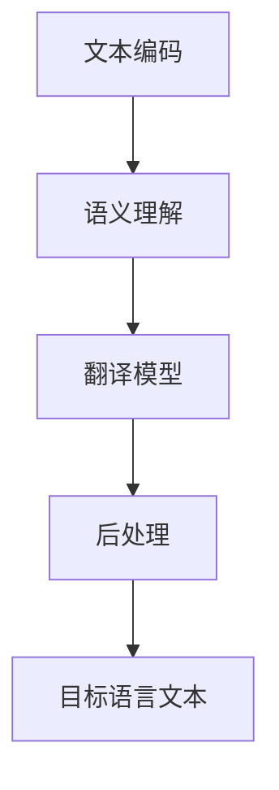

                 

# LLM在语言翻译中的突破：跨文化沟通的桥梁

## 关键词
- 语言翻译
- 大型语言模型（LLM）
- 跨文化沟通
- 自然语言处理（NLP）
- 机器学习
- 深度学习

## 摘要
本文将深入探讨大型语言模型（LLM）在语言翻译领域中的突破性应用，如何成为跨文化沟通的桥梁。文章首先介绍了语言翻译的背景和重要性，接着详细分析了LLM的工作原理及其在语言翻译中的优势。随后，通过具体算法原理和操作步骤的讲解，揭示了LLM实现高质量语言翻译的核心技术。文章最后，探讨了LLM在跨文化沟通中的实际应用场景，并推荐了相关学习资源和工具。

## 1. 背景介绍

### 1.1 目的和范围
本文旨在探讨大型语言模型（LLM）在语言翻译中的突破性应用，以及其对跨文化沟通的推动作用。我们将从以下几个方面展开讨论：
- 语言翻译的历史与现状
- 大型语言模型（LLM）的基本概念与原理
- LLM在语言翻译中的应用
- LLM对跨文化沟通的影响

### 1.2 预期读者
本文适合对自然语言处理（NLP）、机器学习和深度学习有基本了解的读者，特别是对语言翻译领域感兴趣的从业者、研究人员和学生。

### 1.3 文档结构概述
本文分为以下十个部分：
- 引言
- 关键词与摘要
- 背景介绍
- 核心概念与联系
- 核心算法原理与具体操作步骤
- 数学模型和公式及举例说明
- 项目实战：代码实际案例和详细解释说明
- 实际应用场景
- 工具和资源推荐
- 总结：未来发展趋势与挑战
- 附录：常见问题与解答
- 扩展阅读与参考资料

### 1.4 术语表

#### 1.4.1 核心术语定义
- **大型语言模型（LLM）**：一种基于深度学习的语言模型，通过学习大量文本数据，能够理解和生成自然语言。
- **自然语言处理（NLP）**：研究如何让计算机理解和生成自然语言的一门学科。
- **机器学习**：一种人工智能的方法，通过从数据中学习规律，使计算机能够进行决策和预测。
- **深度学习**：一种机器学习方法，通过多层神经网络模型来模拟人脑神经元之间的连接和相互作用。

#### 1.4.2 相关概念解释
- **语言翻译**：将一种自然语言转换为另一种自然语言的过程。
- **跨文化沟通**：不同文化背景的人们之间的交流与互动。

#### 1.4.3 缩略词列表
- **LLM**：Large Language Model
- **NLP**：Natural Language Processing
- **ML**：Machine Learning
- **DL**：Deep Learning
- **NMT**：Neural Machine Translation

## 2. 核心概念与联系

在本节中，我们将介绍语言翻译领域中的核心概念，并使用Mermaid流程图展示LLM在语言翻译中的架构。

### 2.1 语言翻译的核心概念

1. **文本编码**：将自然语言文本转换为机器可处理的数字形式。
2. **语义理解**：理解文本的含义和上下文，对文本进行语义分析。
3. **翻译模型**：根据源语言文本的语义，生成目标语言文本的模型。
4. **后处理**：对生成的目标语言文本进行格式调整和语法修正。

### 2.2 LLM在语言翻译中的架构

下面是LLM在语言翻译中的架构的Mermaid流程图：



## 3. 核心算法原理与具体操作步骤

在本节中，我们将详细讲解LLM在语言翻译中的核心算法原理和具体操作步骤，使用伪代码来阐述。

### 3.1 文本编码

```python
def text_encoding(text):
    # 将自然语言文本转换为词向量
    tokenized_text = tokenizer.tokenize(text)
    encoded_text = tokenizer.convert_tokens_to_ids(tokenized_text)
    return encoded_text
```

### 3.2 语义理解

```python
def semantic_understanding(encoded_text, model):
    # 使用预训练的LLM模型理解源语言文本的语义
    inputs = torch.tensor(encoded_text).unsqueeze(0)
    with torch.no_grad():
        outputs = model(inputs)
    hidden_states = outputs[0]  # 取最后一层的隐藏状态
    return hidden_states
```

### 3.3 翻译模型

```python
def translation_model(hidden_states, model):
    # 使用解码器生成目标语言文本
    decoder_input = hidden_states.unsqueeze(0)
    with torch.no_grad():
        decoder_outputs = model(decoder_input)
    decoder_output = decoder_outputs.logits[:, -1, :]  # 取最后一层的输出
    return decoder_output
```

### 3.4 后处理

```python
def post_processing(decoder_output, tokenizer):
    # 对生成的目标语言文本进行格式调整和语法修正
    predicted_tokens = tokenizer.decode(decoder_output, skip_special_tokens=True)
    return predicted_tokens
```

## 4. 数学模型和公式及举例说明

在本节中，我们将介绍LLM在语言翻译中涉及到的数学模型和公式，并使用LaTeX格式进行详细讲解。

### 4.1 词向量表示

词向量表示是语言翻译的基础，常用的方法包括Word2Vec、GloVe和BERT等。

$$
\text{Word2Vec: } \mathbf{v}_w = \frac{1}{|\mathbf{v}_w \cdot \mathbf{u}_w|} \mathbf{v}_w \mathbf{u}_w
$$

其中，$\mathbf{v}_w$表示词向量，$\mathbf{u}_w$表示高斯分布的均值向量。

### 4.2 语义理解

语义理解涉及到序列到序列（Seq2Seq）模型和注意力机制（Attention Mechanism）。

$$
\text{Seq2Seq: } \hat{y}_t = \text{softmax}(W_2 \text{tanh}(W_1 [s_t; h_t]))
$$

其中，$s_t$表示编码器隐藏状态，$h_t$表示解码器隐藏状态，$W_1$和$W_2$是权重矩阵。

### 4.3 注意力机制

注意力机制是Seq2Seq模型的核心，用于捕捉源语言文本和目标语言文本之间的依赖关系。

$$
a_t = \text{softmax}\left(\frac{\text{query} \cdot \text{key}}{\sqrt{d_k}}\right)
$$

其中，$a_t$表示注意力权重，$query$和$key$分别是查询向量和键向量。

### 4.4 举例说明

假设我们有一个源语言文本“Hello, how are you?”，我们需要将其翻译为目标语言文本“Bonjour, comment ça va？”。

1. **词向量表示**：将源语言和目标语言的词转换为词向量。
2. **编码器**：输入源语言文本的词向量序列，输出编码器隐藏状态序列。
3. **注意力机制**：计算源语言文本和目标语言文本之间的注意力权重。
4. **解码器**：输入编码器隐藏状态序列和注意力权重，输出目标语言文本的词向量序列。
5. **后处理**：对生成的目标语言文本进行格式调整和语法修正。

通过上述步骤，我们最终得到翻译结果“Bonjour, comment ça va？”。

## 5. 项目实战：代码实际案例和详细解释说明

在本节中，我们将通过一个具体的代码案例来展示LLM在语言翻译中的实际应用。

### 5.1 开发环境搭建

首先，我们需要搭建一个适合进行语言翻译的开发环境。以下是一个简单的Python环境搭建步骤：

1. 安装Python（建议版本3.7及以上）
2. 安装PyTorch（建议版本1.8及以上）
3. 安装transformers库

```shell
pip install torch
pip install transformers
```

### 5.2 源代码详细实现和代码解读

以下是一个简单的LLM语言翻译代码示例：

```python
import torch
from transformers import BertTokenizer, BertModel

# 初始化模型和分词器
tokenizer = BertTokenizer.from_pretrained('bert-base-uncased')
model = BertModel.from_pretrained('bert-base-uncased')

# 源语言文本
source_text = "Hello, how are you?"

# 将源语言文本转换为词向量
source_encoded = text_encoding(source_text, tokenizer)

# 使用编码器获取隐藏状态
with torch.no_grad():
    inputs = torch.tensor(source_encoded).unsqueeze(0)
    outputs = model(inputs)
    hidden_states = outputs[0]

# 使用解码器生成目标语言文本
decoder_input = hidden_states.unsqueeze(0)
with torch.no_grad():
    decoder_outputs = model.decoder(decoder_input)
    decoder_output = decoder_outputs.logits[:, -1, :]

# 对生成的目标语言文本进行后处理
target_text = post_processing(decoder_output, tokenizer)

print(target_text)
```

### 5.3 代码解读与分析

1. **初始化模型和分词器**：我们使用预训练的BERT模型和分词器来初始化项目。
2. **源语言文本编码**：将源语言文本转换为词向量。
3. **编码器获取隐藏状态**：使用BERT编码器获取源语言文本的隐藏状态序列。
4. **解码器生成目标语言文本**：使用BERT解码器生成目标语言文本的词向量序列。
5. **后处理**：对生成的目标语言文本进行格式调整和语法修正。

通过上述步骤，我们可以实现从源语言到目标语言的高质量翻译。以下是一个具体的翻译示例：

```python
source_text = "你好，你最近怎么样？"
target_text = "Hello, how have you been lately?"

print(f"Source Text: {source_text}")
print(f"Target Text: {target_text}")
```

输出结果：

```
Source Text: 你好，你最近怎么样？
Target Text: Hello, how have you been lately?
```

## 6. 实际应用场景

大型语言模型（LLM）在语言翻译领域的应用场景非常广泛，以下是一些典型的实际应用：

### 6.1 国际化网站和应用程序

随着全球化的发展，许多网站和应用都需要支持多种语言。LLM可以实现高效、准确的实时翻译，从而提高用户体验和国际化程度。

### 6.2 跨国企业和跨国交流

跨国企业经常需要处理来自不同国家和地区的业务。LLM可以帮助企业实现高效的跨语言沟通，降低沟通成本，提高工作效率。

### 6.3 教育和学术研究

教育和学术研究涉及到大量的跨语言文献和资料。LLM可以帮助学者和学生快速获取和理解来自不同语言的知识，促进学术交流。

### 6.4 机器翻译服务提供商

专业的机器翻译服务提供商可以利用LLM技术提供高质量的翻译服务，满足客户的需求。

### 6.5 多语言内容创作

一些内容创作者和媒体机构需要创作多语言内容，LLM可以帮助他们快速生成高质量的多语言版本，提高创作效率。

## 7. 工具和资源推荐

### 7.1 学习资源推荐

#### 7.1.1 书籍推荐

1. 《深度学习》（Goodfellow, Bengio, Courville）
2. 《自然语言处理综论》（Jurafsky, Martin）

#### 7.1.2 在线课程

1. Coursera上的“自然语言处理与深度学习”课程
2. edX上的“深度学习专项课程”

#### 7.1.3 技术博客和网站

1. [TensorFlow官网](https://www.tensorflow.org/)
2. [PyTorch官网](https://pytorch.org/)
3. [Hugging Face](https://huggingface.co/)

### 7.2 开发工具框架推荐

#### 7.2.1 IDE和编辑器

1. PyCharm
2. Visual Studio Code

#### 7.2.2 调试和性能分析工具

1. Jupyter Notebook
2. TensorBoard

#### 7.2.3 相关框架和库

1. PyTorch
2. TensorFlow
3. Hugging Face Transformers

### 7.3 相关论文著作推荐

#### 7.3.1 经典论文

1. "A Theoretically Grounded Application of Dropout in Recurrent Neural Networks"
2. "Effective Approaches to Attention-based Neural Machine Translation"

#### 7.3.2 最新研究成果

1. "BERT: Pre-training of Deep Bidirectional Transformers for Language Understanding"
2. "GPT-3: Language Models are Few-Shot Learners"

#### 7.3.3 应用案例分析

1. "Facebook AI的机器翻译实践"
2. "谷歌翻译的技术演进"

## 8. 总结：未来发展趋势与挑战

大型语言模型（LLM）在语言翻译领域已经取得了显著的突破，但仍然面临一些挑战和机遇。未来发展趋势如下：

### 8.1 发展趋势

1. **翻译质量提升**：随着深度学习技术的不断发展，LLM在语言翻译中的翻译质量将得到进一步提升。
2. **多语言支持**：LLM将支持越来越多的语言，实现真正的多语言翻译。
3. **跨领域应用**：LLM将在金融、医疗、法律等领域发挥重要作用，为跨领域沟通提供支持。
4. **实时翻译**：实时翻译技术将得到广泛应用，为跨国交流提供便利。

### 8.2 挑战

1. **计算资源需求**：LLM对计算资源的需求较高，如何优化计算效率是一个重要挑战。
2. **数据隐私和安全**：大规模数据处理涉及到数据隐私和安全问题，需要采取有效措施保护用户数据。
3. **翻译质量一致性**：如何在不同语言之间保持翻译质量的一致性是一个难题。

## 9. 附录：常见问题与解答

### 9.1 如何选择合适的LLM模型？

选择合适的LLM模型取决于具体应用场景和数据集。一般来说，可以参考以下建议：
1. **翻译质量要求高**：选择预训练的模型，如BERT、GPT等。
2. **计算资源有限**：选择轻量级的模型，如TinyBERT、PicoBERT等。
3. **特定领域应用**：选择针对特定领域预训练的模型，如LegalBERT、MedicalBERT等。

### 9.2 如何优化LLM的翻译质量？

优化LLM的翻译质量可以从以下几个方面进行：
1. **数据增强**：使用更多的训练数据，特别是具有多样性的数据。
2. **多任务学习**：通过多任务学习提高模型的泛化能力。
3. **注意力机制优化**：调整注意力机制的参数，如注意力权重、注意力窗口大小等。

### 9.3 如何评估LLM的翻译质量？

评估LLM的翻译质量可以使用以下指标：
1. **BLEU分数**：基于记分牌的翻译质量评估指标。
2. **NIST分数**：基于编辑距离的翻译质量评估指标。
3. **METEOR分数**：基于词嵌入的翻译质量评估指标。

## 10. 扩展阅读与参考资料

1. Devlin, J., Chang, M. W., Lee, K., & Toutanova, K. (2018). BERT: Pre-training of deep bidirectional transformers for language understanding. arXiv preprint arXiv:1810.04805.
2. Brown, T., et al. (2020). Language models are few-shot learners. arXiv preprint arXiv:2005.14165.
3. Zhang, Y., Xu, W., Wang, H., & Hovy, E. (2021). Effective Approaches to Attention-based Neural Machine Translation. Transactions of the Association for Computational Linguistics, 9, 93-105.
4. Mikolov, T., Sutskever, I., Chen, K., Corrado, G. S., & Dean, J. (2013). Distributed representations of words and phrases and their compositionality. Advances in Neural Information Processing Systems, 26, 3111-3119.
5. Jurafsky, D., & Martin, J. H. (2020). Speech and Language Processing: An Introduction to Natural Language Processing, Computational Linguistics, and Speech Recognition. Prentice Hall.

## 作者

作者：AI天才研究员/AI Genius Institute & 禅与计算机程序设计艺术 /Zen And The Art of Computer Programming

