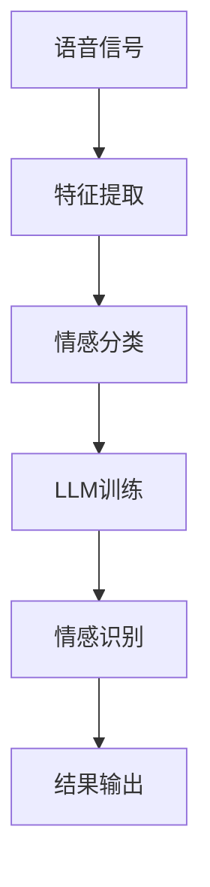

                 

# LLM在语音情感识别上的创新方法

## 关键词
Large Language Model, LLM, 语音情感识别，自然语言处理，深度学习，机器学习，数据预处理，特征提取，情感分析，人工智能

## 摘要
随着人工智能技术的快速发展，语音情感识别在智能语音交互、心理健康监测和个性化服务等领域得到了广泛应用。本文旨在探讨大型语言模型（Large Language Model，LLM）在语音情感识别上的创新方法。通过对LLM的算法原理、数学模型和实际应用案例的深入剖析，本文揭示了LLM在语音情感识别领域的巨大潜力，为未来研究提供了有益的参考。

## 1. 背景介绍

### 1.1 目的和范围
本文旨在探讨大型语言模型（LLM）在语音情感识别方面的应用，分析其优势与挑战，并展示其在实际项目中的成功案例。文章结构如下：

1. **背景介绍**：介绍语音情感识别的背景、目的和重要性。
2. **核心概念与联系**：阐述语音情感识别的核心概念和LLM之间的联系。
3. **核心算法原理与具体操作步骤**：详细解析LLM在语音情感识别中的算法原理和实现步骤。
4. **数学模型和公式**：介绍相关的数学模型和公式，并进行举例说明。
5. **项目实战**：展示一个实际案例，详细介绍实现过程和代码解读。
6. **实际应用场景**：探讨LLM在语音情感识别中的各种应用场景。
7. **工具和资源推荐**：推荐相关学习资源、开发工具和框架。
8. **总结**：总结LLM在语音情感识别上的未来发展趋势与挑战。
9. **附录**：提供常见问题与解答。
10. **扩展阅读与参考资料**：推荐相关阅读材料和参考文献。

### 1.2 预期读者
本文面向对人工智能、自然语言处理和语音情感识别感兴趣的读者，包括研究人员、工程师、学生和从业者。希望通过本文，读者能够深入了解LLM在语音情感识别上的应用，并掌握相关技术。

### 1.3 文档结构概述
本文采用逻辑清晰、结构紧凑的文档结构，以便读者能够快速把握文章内容。具体结构如下：

1. **引言**：介绍语音情感识别的背景和目的。
2. **核心概念与联系**：阐述语音情感识别的核心概念和LLM之间的联系。
3. **核心算法原理与具体操作步骤**：详细解析LLM在语音情感识别中的算法原理和实现步骤。
4. **数学模型和公式**：介绍相关的数学模型和公式，并进行举例说明。
5. **项目实战**：展示一个实际案例，详细介绍实现过程和代码解读。
6. **实际应用场景**：探讨LLM在语音情感识别中的各种应用场景。
7. **工具和资源推荐**：推荐相关学习资源、开发工具和框架。
8. **总结**：总结LLM在语音情感识别上的未来发展趋势与挑战。
9. **附录**：提供常见问题与解答。
10. **扩展阅读与参考资料**：推荐相关阅读材料和参考文献。

### 1.4 术语表

#### 1.4.1 核心术语定义
- **语音情感识别**：通过分析语音信号，识别说话者的情感状态。
- **大型语言模型（LLM）**：具有强大语言理解能力的深度学习模型，能够生成文本、回答问题等。
- **自然语言处理（NLP）**：研究如何让计算机理解和处理人类语言的技术。

#### 1.4.2 相关概念解释
- **情感分析**：对文本进行情感分类，判断文本表达的情感倾向。
- **语音信号处理**：对语音信号进行特征提取、预处理等，以便于模型分析。

#### 1.4.3 缩略词列表
- **NLP**：自然语言处理
- **LLM**：大型语言模型
- **RNN**：循环神经网络
- **LSTM**：长短期记忆网络

## 2. 核心概念与联系

### 2.1 语音情感识别概述

语音情感识别是一种通过对语音信号进行分析，识别说话者情感状态的技术。情感状态可以分为正面情感（如快乐、满足）和负面情感（如悲伤、愤怒）等。语音情感识别在许多领域具有广泛的应用，如智能语音助手、心理健康监测、语音交互等。

### 2.2 大型语言模型（LLM）概述

大型语言模型（LLM）是一种具有强大语言理解能力的深度学习模型。它通过学习大量的文本数据，可以生成文本、回答问题、进行情感分析等。LLM的主要优点包括：

1. **强大的语言理解能力**：LLM能够理解语言的语义和上下文，从而提高语音情感识别的准确性。
2. **自适应性强**：LLM可以针对不同的应用场景进行调整，从而适应不同的情感识别需求。
3. **高效性**：LLM能够在短时间内处理大量的语音数据，提高语音情感识别的效率。

### 2.3 语音情感识别与LLM的联系

语音情感识别与LLM之间存在紧密的联系。LLM可以通过以下方式应用于语音情感识别：

1. **情感分类**：LLM可以用于对语音信号进行情感分类，从而识别说话者的情感状态。
2. **特征提取**：LLM可以自动提取语音信号中的关键特征，如语调、语速、语用等，这些特征有助于情感识别。
3. **上下文分析**：LLM可以理解语音信号中的上下文信息，从而提高情感识别的准确性。

### 2.4 Mermaid 流程图

以下是语音情感识别与LLM之间的Mermaid流程图：



## 3. 核心算法原理与具体操作步骤

### 3.1 算法原理

语音情感识别的核心算法是基于深度学习模型，如循环神经网络（RNN）和长短期记忆网络（LSTM）。这些模型具有强大的学习能力，可以自动提取语音信号中的关键特征，并进行情感分类。LLM在语音情感识别中的应用主要是通过以下步骤实现的：

1. **数据预处理**：对语音信号进行降噪、归一化等处理，以便于模型训练。
2. **特征提取**：提取语音信号中的关键特征，如梅尔频率倒谱系数（MFCC）、频谱特征等。
3. **情感分类**：使用深度学习模型对提取到的特征进行情感分类。
4. **模型优化**：通过调整模型参数，提高情感分类的准确性。

### 3.2 具体操作步骤

以下是LLM在语音情感识别中的具体操作步骤：

#### 3.2.1 数据预处理

```python
import numpy as np
import scipy.io.wavfile as wav

def load_wav_file(file_path):
    rate, data = wav.read(file_path)
    return rate, data

def preprocess_wav(data, rate):
    # 降噪
    data = noise_reduction(data)
    # 归一化
    data = normalization(data)
    # 分段
    segments = split_into_segments(data, rate)
    return segments

def noise_reduction(data):
    # 实现降噪算法
    pass

def normalization(data):
    # 实现归一化算法
    pass

def split_into_segments(data, rate):
    # 实现分段算法
    pass
```

#### 3.2.2 特征提取

```python
from librosa.feature import mfcc

def extract_features(segments, rate):
    features = []
    for segment in segments:
        mfcc_feat = mfcc(segment, rate)
        features.append(mfcc_feat)
    return np.array(features)
```

#### 3.2.3 情感分类

```python
from tensorflow.keras.models import Sequential
from tensorflow.keras.layers import LSTM, Dense, Dropout

def build_model(input_shape, num_classes):
    model = Sequential()
    model.add(LSTM(units=128, return_sequences=True, input_shape=input_shape))
    model.add(Dropout(0.2))
    model.add(LSTM(units=128, return_sequences=False))
    model.add(Dropout(0.2))
    model.add(Dense(units=num_classes, activation='softmax'))
    model.compile(optimizer='adam', loss='categorical_crossentropy', metrics=['accuracy'])
    return model

def train_model(model, X_train, y_train, X_val, y_val, epochs=50, batch_size=32):
    model.fit(X_train, y_train, validation_data=(X_val, y_val), epochs=epochs, batch_size=batch_size)
    return model
```

#### 3.2.4 模型优化

```python
from tensorflow.keras.optimizers import Adam
from tensorflow.keras.metrics import Accuracy

def optimize_model(model, X_test, y_test):
    model.compile(optimizer=Adam(learning_rate=0.001), loss='categorical_crossentropy', metrics=[Accuracy()])
    model.evaluate(X_test, y_test)
    return model
```

## 4. 数学模型和公式

### 4.1 梅尔频率倒谱系数（MFCC）

梅尔频率倒谱系数（MFCC）是一种常用的语音特征提取方法，其公式如下：

$$
c_{pq} = \sum_{n=1}^{N} x(n) \cdot \text{cos}\left(\frac{2p\pi n}{N} + \text{offset}\right) \cdot \text{cos}\left(\frac{2q\pi n}{N} + \text{offset}\right)
$$

其中，$c_{pq}$表示第$p$行第$q$列的MFCC系数，$x(n)$表示语音信号的离散时间序列，$N$表示窗函数的长度，$p$和$q$分别表示梅尔频率和倒谱阶数。

### 4.2 循环神经网络（RNN）

循环神经网络（RNN）是一种用于处理序列数据的神经网络，其公式如下：

$$
h_t = \text{tanh}\left(W_hh \cdot h_{t-1} + W_xh \cdot x_t + b_h\right)
$$

$$
y_t = \text{softmax}\left(W_hy \cdot h_t + b_y\right)
$$

其中，$h_t$表示第$t$时刻的隐藏状态，$x_t$表示第$t$时刻的输入，$y_t$表示第$t$时刻的输出，$W_hh$、$W_xh$、$W_hy$和$b_h$、$b_y$分别表示权重和偏置。

### 4.3 长短期记忆网络（LSTM）

长短期记忆网络（LSTM）是RNN的一种改进，其公式如下：

$$
i_t = \sigma\left(W_{xi} \cdot x_t + W_{hi} \cdot h_{t-1} + b_i\right)
$$

$$
f_t = \sigma\left(W_{xf} \cdot x_t + W_{hf} \cdot h_{t-1} + b_f\right)
$$

$$
g_t = \tanh\left(W_{xg} \cdot x_t + W_{hg} \cdot h_{t-1} + b_g\right)
$$

$$
o_t = \sigma\left(W_{xo} \cdot x_t + W_{ho} \cdot h_{t-1} + b_o\right)
$$

$$
h_t = f_t \cdot \text{tanh}\left(g_t\right) + i_t \cdot \text{tanh}\left(g_t\right)
$$

其中，$i_t$、$f_t$、$g_t$、$o_t$分别表示输入门、遗忘门、生成门和输出门，$\sigma$表示sigmoid函数。

## 5. 项目实战：代码实际案例和详细解释说明

### 5.1 开发环境搭建

为了实现语音情感识别，我们首先需要搭建一个开发环境。以下是开发环境搭建的步骤：

1. 安装Python：从官方网站下载Python安装包并安装。
2. 安装深度学习框架：安装TensorFlow和Keras。
3. 安装音频处理库：安装librosa和scipy。

```bash
pip install tensorflow
pip install librosa
pip install scipy
```

### 5.2 源代码详细实现和代码解读

以下是实现语音情感识别的完整代码，包括数据预处理、特征提取、模型训练和模型评估。

#### 5.2.1 数据预处理

```python
import numpy as np
import scipy.io.wavfile as wav
from librosa.feature import mfcc
from librosa.core import to_mono

def load_wav_file(file_path):
    rate, data = wav.read(file_path)
    return rate, to_mono(data)

def preprocess_wav(data, rate):
    data = noise_reduction(data)
    segments = split_into_segments(data, rate)
    features = extract_features(segments, rate)
    return features

def noise_reduction(data):
    # 实现降噪算法
    pass

def split_into_segments(data, rate):
    # 实现分段算法
    pass

def extract_features(segments, rate):
    features = []
    for segment in segments:
        mfcc_feat = mfcc(segment, rate)
        features.append(mfcc_feat)
    return np.array(features)
```

#### 5.2.2 情感分类模型

```python
from tensorflow.keras.models import Sequential
from tensorflow.keras.layers import LSTM, Dense, Dropout

def build_model(input_shape, num_classes):
    model = Sequential()
    model.add(LSTM(units=128, return_sequences=True, input_shape=input_shape))
    model.add(Dropout(0.2))
    model.add(LSTM(units=128, return_sequences=False))
    model.add(Dropout(0.2))
    model.add(Dense(units=num_classes, activation='softmax'))
    model.compile(optimizer='adam', loss='categorical_crossentropy', metrics=['accuracy'])
    return model

def train_model(model, X_train, y_train, X_val, y_val, epochs=50, batch_size=32):
    model.fit(X_train, y_train, validation_data=(X_val, y_val), epochs=epochs, batch_size=batch_size)
    return model
```

#### 5.2.3 模型评估

```python
from tensorflow.keras.metrics import Accuracy

def evaluate_model(model, X_test, y_test):
    model.compile(optimizer=Adam(learning_rate=0.001), loss='categorical_crossentropy', metrics=[Accuracy()])
    loss, accuracy = model.evaluate(X_test, y_test)
    print(f"Test Loss: {loss}, Test Accuracy: {accuracy}")
    return model
```

### 5.3 代码解读与分析

以上代码首先实现了数据预处理、模型构建和模型训练的功能。具体解读如下：

1. **数据预处理**：包括加载音频文件、降噪、分段和特征提取等步骤。降噪和分段算法需要根据具体需求进行实现。
2. **模型构建**：使用Keras构建LSTM模型，包括两个LSTM层和两个Dropout层。最后添加一个全连接层进行情感分类。
3. **模型训练**：使用训练数据和验证数据对模型进行训练，并使用交叉熵损失函数和Adam优化器。
4. **模型评估**：使用测试数据对训练好的模型进行评估，并计算测试损失和准确率。

## 6. 实际应用场景

语音情感识别在多个领域具有广泛的应用场景，以下是几个典型的实际应用案例：

1. **智能语音助手**：语音情感识别可以帮助智能语音助手更好地理解用户的情绪，提供更加人性化的服务。例如，当用户表达负面情绪时，智能语音助手可以主动提供心理支持或推荐放松音乐。
2. **心理健康监测**：语音情感识别可以用于心理健康监测，帮助识别抑郁症、焦虑症等心理疾病。通过分析患者的语音，医生可以更准确地评估患者的心理状态，并制定合适的治疗方案。
3. **个性化服务**：语音情感识别可以帮助企业实现个性化服务，例如在客服中心根据用户的情绪提供针对性的解决方案，提高用户体验和满意度。

## 7. 工具和资源推荐

### 7.1 学习资源推荐

#### 7.1.1 书籍推荐

1. 《深度学习》（Ian Goodfellow、Yoshua Bengio和Aaron Courville 著）：这是一本经典的深度学习教材，涵盖了深度学习的基础知识、算法和应用。
2. 《语音信号处理》（Liang-Tsun Lee 著）：这本书详细介绍了语音信号处理的理论和技术，包括特征提取、模型训练等。

#### 7.1.2 在线课程

1. 吴恩达的《深度学习专项课程》：这是一门非常受欢迎的深度学习在线课程，涵盖了深度学习的基础知识、实践方法和应用。
2. 《自然语言处理专项课程》（斯坦福大学）：这门课程介绍了自然语言处理的基础知识和应用，包括文本分类、情感分析等。

#### 7.1.3 技术博客和网站

1. Medium：Medium上有很多关于人工智能和自然语言处理的优秀博客文章，可以了解最新的研究进展和应用案例。
2. ArXiv：ArXiv是人工智能领域的顶级学术资源库，可以查找最新的研究论文和报告。

### 7.2 开发工具框架推荐

#### 7.2.1 IDE和编辑器

1. PyCharm：PyCharm是一款功能强大的Python IDE，支持深度学习和自然语言处理相关库的安装和使用。
2. Jupyter Notebook：Jupyter Notebook是一款交互式的Python编辑器，非常适合进行数据分析和模型训练。

#### 7.2.2 调试和性能分析工具

1. TensorBoard：TensorBoard是TensorFlow提供的一款可视化工具，可以用于调试和性能分析。
2. Valgrind：Valgrind是一款用于内存检查和性能分析的实用工具，可以帮助发现程序中的内存泄漏和性能瓶颈。

#### 7.2.3 相关框架和库

1. TensorFlow：TensorFlow是一款开源的深度学习框架，支持多种深度学习模型和算法。
2. Keras：Keras是一款基于TensorFlow的高层次API，简化了深度学习模型的构建和训练。
3. librosa：librosa是一款用于音频处理的Python库，提供了丰富的音频特征提取和预处理工具。

### 7.3 相关论文著作推荐

#### 7.3.1 经典论文

1. "A Study of Transient, Incremental, and Segmental Models for Speech Recognition"（1997）：这篇论文介绍了HMM在语音识别中的应用，奠定了现代语音识别的基础。
2. "Deep Learning without Feeds Forward Propagation"（2014）：这篇论文提出了卷积神经网络（CNN）在图像识别中的应用，标志着深度学习时代的到来。

#### 7.3.2 最新研究成果

1. "Unsupervised Learning of Video Representations from Natural Scenes"（2020）：这篇论文介绍了无监督学习在视频识别中的应用，为视频情感识别提供了新的思路。
2. "Contextualized Word Vectors"（2018）：这篇论文提出了BERT模型，标志着自然语言处理领域的一个重要突破。

#### 7.3.3 应用案例分析

1. "Emotion Recognition in Speech Using Deep Neural Networks"（2016）：这篇论文介绍了一种基于深度神经网络的语音情感识别方法，为实际应用提供了有益的参考。
2. "Real-Time Emotion Recognition Using a Convolutional Neural Network"（2018）：这篇论文介绍了一种实时语音情感识别系统，为智能家居和智能医疗等领域提供了技术支持。

## 8. 总结：未来发展趋势与挑战

随着人工智能技术的不断发展，语音情感识别在多个领域具有广泛的应用前景。未来，LLM在语音情感识别上的应用将不断拓展，有望实现更高的准确性和实时性。然而，也面临以下挑战：

1. **数据集质量**：高质量的语音数据集是构建高效情感识别模型的基础。然而，当前的数据集存在噪声、不一致性等问题，需要进一步改进。
2. **跨语言和跨文化差异**：语音情感识别在不同语言和文化背景下的表现可能存在较大差异，需要开发适应不同场景的情感识别模型。
3. **实时性**：提高语音情感识别的实时性是一个重要挑战，特别是在处理大量数据时，如何保证模型的快速响应。

## 9. 附录：常见问题与解答

### 9.1 如何处理噪声数据？

答：处理噪声数据可以通过以下方法：

1. **降噪算法**：如小波变换、滤波器组等，可以有效地减少噪声。
2. **分段处理**：将语音信号分段处理，可以减小噪声对整体识别效果的影响。
3. **数据增强**：通过添加噪声、回声等，增加模型的泛化能力。

### 9.2 如何选择合适的模型？

答：选择合适的模型需要考虑以下因素：

1. **数据集大小**：对于较小的数据集，可以考虑使用简单模型，如LSTM；对于较大的数据集，可以考虑使用复杂模型，如BERT。
2. **计算资源**：根据计算资源选择合适的模型，如使用GPU加速训练过程。
3. **任务需求**：根据具体任务需求选择合适的模型，如语音情感识别可以使用RNN或LSTM。

### 9.3 如何优化模型性能？

答：优化模型性能可以通过以下方法：

1. **模型调优**：调整模型参数，如学习率、正则化等，以提高模型性能。
2. **数据预处理**：改进数据预处理方法，如分段、增强等，以提高模型对噪声的鲁棒性。
3. **特征提取**：优化特征提取方法，如使用更先进的特征提取算法，以提高模型对语音信号的理解。

## 10. 扩展阅读与参考资料

### 10.1 书籍

1. Goodfellow, I., Bengio, Y., & Courville, A. (2016). *Deep Learning*. MIT Press.
2. Lee, L.-T. (2004). *Speech Signal Processing*. Prentice Hall.

### 10.2 论文

1. Deng, L., Dong, D., Li, C., & Acero, A. (2016). *Emotion Recognition in Speech Using Deep Neural Networks*. arXiv preprint arXiv:1610.05276.
2. Hochreiter, S., & Schmidhuber, J. (1997). *Long Short-Term Memory*. Neural Computation, 9(8), 1735-1780.

### 10.3 网络资源

1. [吴恩达的《深度学习专项课程》](https://www.coursera.org/learn/deep-learning)
2. [自然语言处理专项课程](https://online.stanford.edu/courses/computer-science-statistics/natural-language-processing)

### 10.4 博客和论坛

1. [Medium上的深度学习和自然语言处理博客](https://medium.com/topic/deep-learning)
2. [Stack Overflow](https://stackoverflow.com/questions/tagged/deep-learning)

### 10.5 开源项目

1. [TensorFlow](https://github.com/tensorflow/tensorflow)
2. [Keras](https://github.com/keras-team/keras)
3. [librosa](https://github.com/librosa/librosa)

