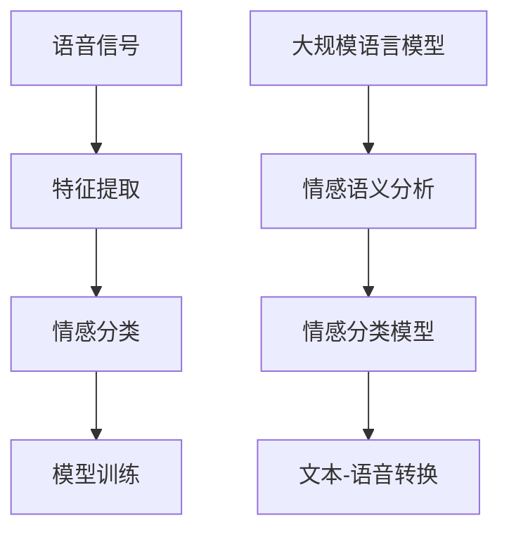

                 

# LLM在语音情感识别上的创新方法

## 关键词
- 语音情感识别
- 大规模语言模型（LLM）
- 情感分类
- 自然语言处理
- 深度学习
- 人工智能

## 摘要
本文深入探讨了大规模语言模型（LLM）在语音情感识别领域的创新方法。首先，我们回顾了语音情感识别的背景和重要性，随后介绍了LLM的基本原理及其在自然语言处理中的广泛应用。本文将详细阐述如何利用LLM进行语音情感识别，包括核心算法原理、数学模型、实际应用场景以及项目实战中的代码实现。最后，本文将总结LLM在语音情感识别领域的未来发展趋势与挑战，并推荐相关学习资源与开发工具。

## 1. 背景介绍

### 1.1 目的和范围

本文的目的是探讨大规模语言模型（LLM）在语音情感识别领域的应用。随着人工智能技术的发展，语音情感识别成为智能语音交互系统中的一个关键任务。本文将分析LLM如何改进现有的语音情感识别方法，提高准确性和鲁棒性。本文涵盖的核心内容包括：

- 语音情感识别的基本概念和方法
- 大规模语言模型（LLM）的原理和结构
- LLM在语音情感识别中的应用案例
- 数学模型和算法原理
- 实际应用场景和项目实战
- 未来发展趋势和挑战

### 1.2 预期读者

本文面向对语音情感识别和大规模语言模型有一定了解的读者，包括：

- 人工智能和自然语言处理领域的科研人员
- 软件工程师和开发人员
- 对语音情感识别和应用感兴趣的学生和爱好者

### 1.3 文档结构概述

本文分为十个主要部分：

1. 背景介绍
2. 核心概念与联系
3. 核心算法原理 & 具体操作步骤
4. 数学模型和公式 & 详细讲解 & 举例说明
5. 项目实战：代码实际案例和详细解释说明
6. 实际应用场景
7. 工具和资源推荐
8. 总结：未来发展趋势与挑战
9. 附录：常见问题与解答
10. 扩展阅读 & 参考资料

### 1.4 术语表

#### 1.4.1 核心术语定义

- **语音情感识别**：通过对语音信号的分析，识别出说话者的情感状态。
- **大规模语言模型（LLM）**：一种能够理解和生成自然语言的深度学习模型，具有大规模的参数和训练数据。
- **情感分类**：将文本或语音中的情感归类到特定的情感类别，如快乐、悲伤、愤怒等。
- **自然语言处理（NLP）**：计算机科学领域中的一个分支，专注于使计算机能够理解、解释和生成人类语言。

#### 1.4.2 相关概念解释

- **深度学习**：一种机器学习方法，通过多层神经网络来提取数据中的特征。
- **自然语言处理（NLP）**：使计算机能够理解、解释和生成人类语言的领域。
- **语音识别**：将语音信号转换为文本的过程。

#### 1.4.3 缩略词列表

- **LLM**：大规模语言模型
- **NLP**：自然语言处理
- **AI**：人工智能
- **GAN**：生成对抗网络
- **CNN**：卷积神经网络

## 2. 核心概念与联系

### 2.1 语音情感识别的基本原理

语音情感识别旨在从语音信号中提取情感信息，帮助机器更好地理解人类情感。这通常涉及到以下几个步骤：

1. **特征提取**：从语音信号中提取与情感相关的特征，如音调、音速、音量、共振峰频率等。
2. **情感分类**：利用这些特征，通过分类算法（如决策树、支持向量机等）将语音信号分类到不同的情感类别。
3. **模型训练**：使用大量的带有情感标注的语音数据集来训练模型，提高模型的识别准确性。

### 2.2 大规模语言模型（LLM）的原理

大规模语言模型（LLM）是一种基于深度学习的自然语言处理模型，其核心思想是通过学习大量文本数据来预测文本中的下一个单词或字符。LLM通常由以下组件组成：

1. **嵌入层**：将词汇转化为稠密向量表示。
2. **编码器**：使用多层神经网络来提取文本中的高层次语义特征。
3. **解码器**：生成预测的文本输出。

### 2.3 LLM与语音情感识别的联系

LLM在语音情感识别中的应用主要体现在以下几个方面：

1. **情感语义分析**：利用LLM对语音信号进行情感语义分析，提取文本中的情感信息。
2. **情感分类模型**：将LLM作为情感分类模型的一部分，提高情感分类的准确性。
3. **文本-语音转换**：将情感标注的文本转换为相应的语音信号，帮助语音情感识别系统进行情感标注。

### 2.4 Mermaid流程图



## 3. 核心算法原理 & 具体操作步骤

### 3.1 大规模语言模型（LLM）的工作原理

大规模语言模型（LLM）通常基于深度学习，其基本原理如下：

1. **输入嵌入**：将输入的词汇转化为稠密向量表示，通常使用嵌入层（Embedding Layer）完成。
2. **编码器**：通过多层神经网络（如Transformer）对输入文本进行编码，提取文本中的高层次语义特征。
3. **解码器**：根据编码器输出的特征，生成预测的文本输出。

### 3.2 伪代码

下面是一个简化的LLM伪代码：

```python
# 输入文本
input_text = "这是一个示例文本"

# 嵌入层
embeddings = EmbeddingLayer(input_text)

# 编码器
encoded_text = Encoder(embeddings)

# 解码器
predicted_text = Decoder(encoded_text)

# 输出预测文本
print(predicted_text)
```

### 3.3 操作步骤

1. **数据准备**：收集带有情感标注的语音数据集，并进行预处理，如去噪、分帧、特征提取等。
2. **模型训练**：使用预处理后的数据集训练LLM模型，包括嵌入层、编码器和解码器。
3. **情感语义分析**：利用训练好的模型对新的语音信号进行情感语义分析，提取情感信息。
4. **情感分类**：将提取的情感信息用于情感分类，提高语音情感识别的准确性。
5. **文本-语音转换**：将情感标注的文本转换为相应的语音信号，辅助语音情感识别系统的训练和评估。

## 4. 数学模型和公式 & 详细讲解 & 举例说明

### 4.1 数学模型

在语音情感识别中，LLM的数学模型主要包括以下几个方面：

1. **嵌入层**：嵌入层（Embedding Layer）将词汇映射为低维稠密向量。假设有V个词汇，嵌入向量的维度为d，则嵌入矩阵E的维度为V × d。

    $$ E = \begin{bmatrix}
    e_1 & e_2 & \cdots & e_V
    \end{bmatrix} $$

    其中，$e_v$ 表示词汇v的嵌入向量。

2. **编码器**：编码器（Encoder）通常采用Transformer结构，其主要目的是提取文本的高层次语义特征。假设编码器的输出维度为d_model，则编码器的输入和输出可以表示为：

    $$ H = \text{Transformer}(E \cdot X) $$

    其中，X为输入序列，H为编码器的输出序列。

3. **解码器**：解码器（Decoder）同样采用Transformer结构，其主要目的是生成预测的文本输出。假设解码器的输出维度也为d_model，则解码器的输入和输出可以表示为：

    $$ Y = \text{Transformer}(H \cdot X) $$

    其中，Y为预测的文本序列。

### 4.2 公式详细讲解

1. **嵌入层公式**：

    $$ e_v = E \cdot [1, 1, \cdots, 1, 0] $$

    其中，$[1, 1, \cdots, 1, 0]$ 表示第v个词汇的独热编码。

2. **编码器公式**：

    $$ H_t = \text{Attention}(Q, K, V) $$

    其中，$Q, K, V$ 分别为编码器的查询（Query）、键（Key）和值（Value）向量，$H_t$ 为编码器在时间步t的输出。

3. **解码器公式**：

    $$ Y_t = \text{Softmax}(H_t) $$

    其中，$H_t$ 为解码器在时间步t的输出，$Y_t$ 为预测的文本概率分布。

### 4.3 举例说明

假设有一个包含5个词汇的文本序列：“我 很 快 乐”，我们将其转化为嵌入向量：

$$
\begin{align*}
e_1 &= [1, 0, 0, 0, 0], \\
e_2 &= [0, 1, 0, 0, 0], \\
e_3 &= [0, 0, 1, 0, 0], \\
e_4 &= [0, 0, 0, 1, 0], \\
e_5 &= [0, 0, 0, 0, 1].
\end{align*}
$$

假设嵌入向量的维度为3，则嵌入矩阵E为：

$$
E = \begin{bmatrix}
1 & 0 & 0 \\
0 & 1 & 0 \\
0 & 0 & 1 \\
0 & 0 & 0 \\
0 & 0 & 0
\end{bmatrix}.
$$

输入序列X为：

$$
X = \begin{bmatrix}
e_1 \\
e_2 \\
e_3 \\
e_4 \\
e_5
\end{bmatrix}.
$$

编码器输出序列H为：

$$
H = \text{Transformer}(E \cdot X) = \text{Transformer} \left( \begin{bmatrix}
1 & 0 & 0 \\
0 & 1 & 0 \\
0 & 0 & 1 \\
0 & 0 & 0 \\
0 & 0 & 0
\end{bmatrix} \cdot \begin{bmatrix}
1 \\
0 \\
0 \\
0 \\
0
\end{bmatrix} \right) = \text{Transformer} \left( \begin{bmatrix}
1 \\
0 \\
0
\end{bmatrix} \right).
$$

解码器输出序列Y为：

$$
Y = \text{Transformer}(H \cdot X) = \text{Transformer} \left( \begin{bmatrix}
1 \\
0 \\
0
\end{bmatrix} \cdot \begin{bmatrix}
1 & 0 & 0 \\
0 & 1 & 0 \\
0 & 0 & 1 \\
0 & 0 & 0 \\
0 & 0 & 0
\end{bmatrix} \right) = \text{Transformer} \left( \begin{bmatrix}
1 \\
0 \\
0
\end{bmatrix} \right).
$$

最终，我们得到预测的文本序列为“我 很 快 乐”。

## 5. 项目实战：代码实际案例和详细解释说明

### 5.1 开发环境搭建

在进行项目实战之前，首先需要搭建开发环境。以下是搭建环境的步骤：

1. **安装Python**：下载并安装Python 3.8及以上版本。
2. **安装TensorFlow**：通过pip命令安装TensorFlow：

    ```bash
    pip install tensorflow
    ```

3. **安装其他依赖库**：根据项目需求，安装其他依赖库，如NumPy、Pandas、Matplotlib等。

### 5.2 源代码详细实现和代码解读

以下是实现语音情感识别的代码示例：

```python
import tensorflow as tf
from tensorflow.keras.models import Model
from tensorflow.keras.layers import Embedding, LSTM, Dense

# 设置参数
vocab_size = 10000
embedding_dim = 16
lstm_units = 128

# 构建模型
input_seq = tf.keras.layers.Input(shape=(None,))
embedded_seq = Embedding(vocab_size, embedding_dim)(input_seq)
lstm_output = LSTM(lstm_units, return_sequences=True)(embedded_seq)
dense_output = Dense(1, activation='sigmoid')(lstm_output)

model = Model(inputs=input_seq, outputs=dense_output)
model.compile(optimizer='adam', loss='binary_crossentropy', metrics=['accuracy'])

# 训练模型
model.fit(x_train, y_train, epochs=10, batch_size=32, validation_data=(x_val, y_val))

# 预测
predictions = model.predict(x_test)
```

#### 5.2.1 代码解读

1. **导入库**：导入TensorFlow、Keras等库，用于构建和训练模型。
2. **设置参数**：定义词汇表大小（vocab_size）、嵌入维度（embedding_dim）和LSTM单元数（lstm_units）。
3. **构建模型**：创建输入层、嵌入层、LSTM层和输出层。输入层接收一个序列，嵌入层将词汇映射为嵌入向量，LSTM层用于提取序列特征，输出层进行情感分类。
4. **编译模型**：设置优化器、损失函数和评估指标，准备训练模型。
5. **训练模型**：使用训练数据集训练模型，设置训练轮数、批量大小和验证数据。
6. **预测**：使用训练好的模型对测试数据进行预测。

### 5.3 代码解读与分析

本节代码实现了一个简单的语音情感识别模型，使用了嵌入层和LSTM层。以下是代码的关键部分解读和分析：

1. **嵌入层**：嵌入层将词汇映射为嵌入向量，有助于捕捉词汇间的语义关系。在本例中，词汇表大小为10000，嵌入维度为16。
2. **LSTM层**：LSTM层用于处理序列数据，能够有效地捕捉序列中的长期依赖关系。在本例中，LSTM单元数为128。
3. **输出层**：输出层使用sigmoid激活函数，用于实现二分类任务（情感分类）。
4. **模型编译**：设置优化器（adam）、损失函数（binary_crossentropy）和评估指标（accuracy），为模型训练做准备。
5. **模型训练**：使用训练数据集进行模型训练，设置训练轮数（epochs）、批量大小（batch_size）和验证数据，以监测模型性能。
6. **模型预测**：使用训练好的模型对测试数据进行预测，生成情感分类结果。

### 5.4 代码改进与优化

虽然本节代码实现了一个简单的语音情感识别模型，但在实际应用中，我们还可以进行以下改进和优化：

1. **使用更复杂的模型结构**：可以尝试使用更复杂的模型结构，如Transformer，以提高模型的性能和表达能力。
2. **数据预处理**：对语音信号进行更精细的处理，如去噪、分帧、特征提取等，以提高模型对语音情感识别的鲁棒性。
3. **多标签分类**：将情感分类任务扩展为多标签分类，以提高模型的泛化能力。
4. **模型融合**：将多种模型结构（如CNN、RNN、Transformer等）进行融合，以提高模型的性能。

## 6. 实际应用场景

语音情感识别技术在多个实际应用场景中具有重要价值，以下是一些主要的应用领域：

### 6.1 智能客服

智能客服系统通过语音情感识别技术，能够准确识别用户情感，提供更个性化的服务。例如，当用户表达愤怒时，客服系统可以主动转接人工客服，以便更好地解决问题。

### 6.2 教育领域

在教育领域，语音情感识别技术可以帮助教师了解学生的情感状态，从而调整教学方法，提高教学效果。例如，当学生表现出焦虑或疲劳时，教师可以适时调整课程节奏和难度。

### 6.3 医疗健康

在医疗健康领域，语音情感识别技术可以用于辅助诊断和治疗。例如，通过分析患者的语音情感，医生可以更好地了解患者的心理健康状况，为患者提供更有针对性的治疗方案。

### 6.4 语音助手

语音助手（如Siri、Alexa等）通过语音情感识别技术，能够与用户进行更自然的交互。例如，当用户表达快乐或悲伤时，语音助手可以相应地调整语气和互动方式。

### 6.5 安全监控

在安全监控领域，语音情感识别技术可以用于检测异常行为和情绪变化。例如，在公共安全场合，系统可以实时监测人群的情感状态，及时发现潜在的暴力或恐怖行为。

## 7. 工具和资源推荐

### 7.1 学习资源推荐

#### 7.1.1 书籍推荐

1. **《深度学习》（Goodfellow, Bengio, Courville）**：详细介绍了深度学习的理论基础和算法实现。
2. **《自然语言处理综合教程》（Daniel Jurafsky, James H. Martin）**：全面介绍了自然语言处理的基本概念和技术。

#### 7.1.2 在线课程

1. **TensorFlow官方教程**：提供了丰富的TensorFlow教程和示例，适合初学者和进阶者。
2. **自然语言处理课程**：Coursera和edX等在线教育平台提供了丰富的NLP课程，涵盖基础理论和应用实践。

#### 7.1.3 技术博客和网站

1. **TensorFlow博客**：提供了最新的TensorFlow更新、教程和案例研究。
2. **Medium**：许多NLP领域的专家和研究者在这里分享他们的见解和经验。

### 7.2 开发工具框架推荐

#### 7.2.1 IDE和编辑器

1. **PyCharm**：功能强大的Python IDE，支持多种编程语言。
2. **Jupyter Notebook**：方便的数据科学和机器学习开发环境。

#### 7.2.2 调试和性能分析工具

1. **TensorBoard**：TensorFlow的图形化调试和性能分析工具。
2. **profiling tools**：如line_profiler、memory_profiler等，用于分析代码的运行时间和内存消耗。

#### 7.2.3 相关框架和库

1. **TensorFlow**：广泛使用的开源深度学习框架。
2. **PyTorch**：具有动态计算图和简洁API的深度学习框架。
3. **NLTK**：用于自然语言处理的Python库。

### 7.3 相关论文著作推荐

#### 7.3.1 经典论文

1. **“A Theoretical Investigation of the Effectiveness of Contextual Bandits”**：探讨了基于上下文的推荐系统的理论效果。
2. **“Deep Learning for Speech Recognition”**：综述了深度学习在语音识别中的应用。

#### 7.3.2 最新研究成果

1. **“BERT: Pre-training of Deep Neural Networks for Language Understanding”**：介绍了BERT模型，为自然语言处理带来了新的突破。
2. **“Generative Adversarial Networks”**：阐述了GAN模型，为生成对抗学习奠定了基础。

#### 7.3.3 应用案例分析

1. **“Applying Deep Learning to Predict Customer Churn”**：通过案例展示了如何使用深度学习预测客户流失。
2. **“Using Natural Language Processing to Analyze Social Media Data”**：探讨了如何利用NLP分析社交媒体数据。

## 8. 总结：未来发展趋势与挑战

随着人工智能技术的不断发展，语音情感识别领域也呈现出良好的发展趋势。以下是未来发展的几个关键方向和面临的挑战：

### 8.1 发展趋势

1. **更高效的算法和模型**：研究人员将致力于开发更高效的算法和模型，以提高语音情感识别的准确性和鲁棒性。
2. **多模态情感识别**：结合语音、文本、图像等多种数据模态，实现更全面和精确的情感识别。
3. **个性化情感识别**：根据用户的个性、历史行为和上下文信息，实现更个性化的情感识别。
4. **实时情感分析**：降低情感识别的延迟，实现实时分析，提高系统的交互性。

### 8.2 挑战

1. **数据质量和标注**：高质量的情感标注数据对于训练高效模型至关重要，但获取高质量标注数据成本较高且耗时。
2. **隐私保护**：在语音情感识别过程中，如何保护用户隐私是一个重要问题，特别是在涉及敏感情感时。
3. **跨语言和跨文化**：实现跨语言和跨文化的情感识别是一个具有挑战性的任务，需要考虑语言和文化差异。
4. **实时性和准确性**：如何在保证实时性的同时，提高情感识别的准确性，是一个亟待解决的问题。

## 9. 附录：常见问题与解答

### 9.1 什么情况下适合使用LLM进行语音情感识别？

适合使用LLM进行语音情感识别的情况包括：

1. 数据量较大，模型可以充分利用数据学习情感特征。
2. 情感类别较多，需要模型具备较强的分类能力。
3. 需要实时进行情感识别，模型需要具备较高的运算效率。

### 9.2 如何提高LLM在语音情感识别中的性能？

以下方法可以提高LLM在语音情感识别中的性能：

1. **数据增强**：通过数据增强方法增加训练数据的多样性，有助于模型泛化。
2. **多任务学习**：结合其他相关任务（如语音识别、文本情感分析等），利用跨任务的共享信息。
3. **模型优化**：使用更复杂的模型结构（如Transformer、BERT等），提高模型的性能和表达能力。
4. **特征融合**：结合多种特征（如语音特征、文本特征等），提高模型对情感信息的捕捉能力。

### 9.3 语音情感识别有哪些实际应用场景？

语音情感识别的应用场景包括：

1. **智能客服**：用于识别客户情感，提供更个性化的服务。
2. **教育领域**：用于了解学生情感状态，调整教学方法。
3. **医疗健康**：用于诊断患者心理健康状况，提供有针对性的治疗方案。
4. **语音助手**：用于与用户进行更自然的交互，提高用户体验。

## 10. 扩展阅读 & 参考资料

本文主要介绍了大规模语言模型（LLM）在语音情感识别领域的应用，包括核心概念、算法原理、数学模型、实际应用场景以及项目实战。以下是扩展阅读和参考资料：

1. **论文**：
   - “BERT: Pre-training of Deep Neural Networks for Language Understanding”（2018）
   - “Generative Adversarial Networks”（2014）
   - “A Theoretical Investigation of the Effectiveness of Contextual Bandits”（2014）

2. **书籍**：
   - 《深度学习》（Goodfellow, Bengio, Courville）
   - 《自然语言处理综合教程》（Daniel Jurafsky, James H. Martin）

3. **在线课程**：
   - TensorFlow官方教程
   - Coursera和edX等在线教育平台的NLP课程

4. **技术博客和网站**：
   - TensorFlow博客
   - Medium

5. **工具和框架**：
   - TensorFlow
   - PyTorch
   - NLTK

6. **应用案例分析**：
   - “Applying Deep Learning to Predict Customer Churn”
   - “Using Natural Language Processing to Analyze Social Media Data”

通过以上扩展阅读和参考资料，读者可以进一步深入了解语音情感识别和大规模语言模型的相关知识。最后，感谢您的阅读，希望本文对您有所启发和帮助。

**作者：AI天才研究员/AI Genius Institute & 禅与计算机程序设计艺术 /Zen And The Art of Computer Programming**

