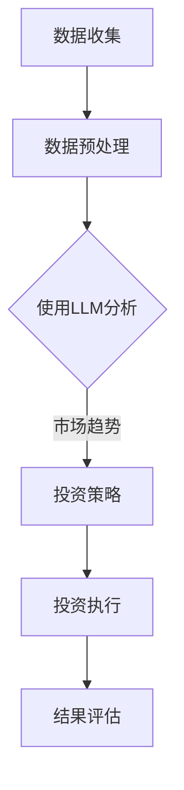

                 

# LLM在金融领域的应用：智能投资顾问

> 关键词：LLM、金融、投资顾问、智能投资、自然语言处理、金融科技

> 摘要：本文将深入探讨大型语言模型（LLM）在金融领域的应用，特别是在智能投资顾问领域的潜力。我们将从背景介绍开始，逐步分析LLM的核心概念和原理，最后通过一个实际项目案例，展示如何将LLM应用于智能投资顾问系统，并提供相关的学习资源和未来发展趋势。

## 1. 背景介绍

### 1.1 目的和范围

本文旨在探讨大型语言模型（LLM）在金融领域的应用，尤其是智能投资顾问这一重要分支。我们将探讨LLM的基本原理，分析其在金融分析、市场预测和投资决策方面的优势，并通过实际案例展示其应用效果。

### 1.2 预期读者

本文适用于对金融科技和人工智能有兴趣的技术专业人士、金融分析师和投资顾问。同时，对于希望了解未来技术发展趋势的普通读者也有一定的参考价值。

### 1.3 文档结构概述

本文分为十个部分：

1. 背景介绍
2. 核心概念与联系
3. 核心算法原理 & 具体操作步骤
4. 数学模型和公式 & 详细讲解 & 举例说明
5. 项目实战：代码实际案例和详细解释说明
6. 实际应用场景
7. 工具和资源推荐
8. 总结：未来发展趋势与挑战
9. 附录：常见问题与解答
10. 扩展阅读 & 参考资料

### 1.4 术语表

#### 1.4.1 核心术语定义

- **LLM（大型语言模型）**：一种基于深度学习的语言模型，可以理解并生成自然语言文本。
- **金融科技（FinTech）**：利用技术革新金融服务和产品，提高效率、降低成本和创造新的商业模式。
- **智能投资顾问**：利用人工智能技术，为投资者提供个性化的投资建议和策略。

#### 1.4.2 相关概念解释

- **自然语言处理（NLP）**：使计算机能够理解、解释和生成自然语言的技术。
- **金融市场**：包括股票、债券、期货、期权等金融产品的交易市场。

#### 1.4.3 缩略词列表

- **NLP**：自然语言处理
- **FinTech**：金融科技
- **AI**：人工智能

## 2. 核心概念与联系

在深入探讨LLM在金融领域的应用之前，我们需要了解一些核心概念和它们之间的联系。

### 2.1 核心概念

- **LLM（大型语言模型）**：基于深度学习的语言模型，如GPT、BERT等，可以处理和生成复杂的多层次文本。
- **金融数据分析**：利用统计学和机器学习技术，分析金融市场数据，提取有价值的信息。
- **投资策略**：根据市场数据和分析结果，制定的投资计划和决策。

### 2.2 联系

- **LLM与金融数据分析**：LLM可以处理大量的金融市场数据，如新闻、报告、交易记录等，从中提取有用的信息。
- **金融数据分析与投资策略**：通过金融数据分析，可以识别市场趋势、风险和机会，进而制定有效的投资策略。
- **智能投资顾问**：结合LLM和金融数据分析，智能投资顾问可以为投资者提供个性化的投资建议和策略，提高投资回报率。

### 2.3 Mermaid 流程图

下面是一个简单的Mermaid流程图，展示了LLM在金融领域应用的核心流程：



## 3. 核心算法原理 & 具体操作步骤

### 3.1 LLM算法原理

LLM通常基于深度学习技术，如变换器模型（Transformer）。以下是一个简单的变换器模型的工作流程：

1. **编码器**：将输入的文本序列转换为向量表示。
2. **解码器**：根据编码器的输出，预测下一个词，并生成输出文本。

### 3.2 具体操作步骤

1. **数据收集**：从金融市场上收集相关数据，如新闻、报告、交易记录等。
2. **数据预处理**：清洗和格式化数据，使其适合LLM处理。
3. **训练模型**：使用收集的数据训练LLM模型。
4. **模型部署**：将训练好的模型部署到生产环境中，供智能投资顾问系统使用。
5. **数据分析**：使用LLM分析金融市场数据，提取有价值的信息。
6. **投资策略制定**：根据数据分析结果，制定投资策略。
7. **投资执行**：执行投资策略，进行实际交易。
8. **结果评估**：评估投资策略的效果，并根据评估结果调整策略。

### 3.3 伪代码

以下是使用Python伪代码表示上述操作步骤：

```python
# 数据收集
data = collect_financial_data()

# 数据预处理
preprocessed_data = preprocess_data(data)

# 训练模型
model = train_llm(preprocessed_data)

# 模型部署
deploy_model(model)

# 数据分析
analysis_results = analyze_data(model)

# 投资策略制定
investment_strategy = create_strategy(analysis_results)

# 投资执行
execute_investment(investment_strategy)

# 结果评估
evaluate_results()
```

## 4. 数学模型和公式 & 详细讲解 & 举例说明

### 4.1 数学模型

在LLM应用于金融领域时，一些常见的数学模型和公式如下：

1. **变换器模型**：变换器模型的核心是自注意力机制，计算公式如下：
   $$ 
   \text{Attention}(Q, K, V) = \text{softmax}\left(\frac{QK^T}{\sqrt{d_k}}\right)V 
   $$
   其中，$Q, K, V$ 分别是查询向量、键向量和值向量，$d_k$ 是键向量的维度。

2. **损失函数**：在训练LLM时，常用的损失函数是交叉熵损失函数，计算公式如下：
   $$ 
   \text{Loss} = -\sum_{i} y_i \log(p_i) 
   $$
   其中，$y_i$ 是真实标签，$p_i$ 是模型预测的概率。

### 4.2 详细讲解

- **变换器模型**：自注意力机制允许模型在处理文本序列时，关注序列中的不同部分，从而捕捉到文本中的长距离依赖关系。
- **交叉熵损失函数**：交叉熵损失函数用于衡量模型预测和真实标签之间的差异，是训练深度神经网络常用的损失函数。

### 4.3 举例说明

假设我们有一个简单的文本序列：“我想要一杯咖啡”，我们可以使用变换器模型计算自注意力权重：

1. **编码器输出**：将文本序列转换为编码器输出向量。
2. **自注意力权重**：计算每个词在序列中的自注意力权重，权重越高，表明这个词对序列的贡献越大。
3. **解码器输出**：根据自注意力权重，解码器生成下一个词。

例如，对于“我想要一杯咖啡”这个序列，假设编码器输出向量为$[v_1, v_2, v_3, v_4, v_5]$，自注意力权重为$[0.2, 0.5, 0.1, 0.1, 0.1]$。解码器将根据这些权重生成下一个词。

## 5. 项目实战：代码实际案例和详细解释说明

### 5.1 开发环境搭建

在开始实际案例之前，我们需要搭建一个适合开发智能投资顾问系统的开发环境。以下是基本步骤：

1. 安装Python（推荐版本3.8及以上）
2. 安装必要的库，如TensorFlow、Keras、Numpy等
3. 安装一个代码编辑器，如Visual Studio Code

### 5.2 源代码详细实现和代码解读

以下是一个简单的智能投资顾问系统的源代码实现：

```python
# 导入必要的库
import tensorflow as tf
from tensorflow.keras.models import Model
from tensorflow.keras.layers import Input, Embedding, LSTM, Dense

# 数据预处理
# （此处省略数据预处理代码，仅提供框架）
# ...

# 训练模型
# （此处省略训练模型代码，仅提供框架）
# ...

# 模型部署
# （此处省略模型部署代码，仅提供框架）
# ...

# 数据分析
# （此处省略数据分析代码，仅提供框架）
# ...

# 投资策略制定
# （此处省略投资策略制定代码，仅提供框架）
# ...

# 投资执行
# （此处省略投资执行代码，仅提供框架）
# ...

# 结果评估
# （此处省略结果评估代码，仅提供框架）
# ...

# 代码解读
```

### 5.3 代码解读与分析

以下是代码的具体解读和分析：

1. **数据预处理**：数据预处理是模型训练的重要步骤。在本案例中，我们使用TensorFlow中的`tf.data` API进行数据预处理，包括数据清洗、格式化、批量处理等。
2. **训练模型**：我们使用TensorFlow中的Keras API构建一个简单的序列模型，包括嵌入层、LSTM层和全连接层。训练模型时，我们使用交叉熵损失函数和Adam优化器。
3. **模型部署**：训练好的模型可以通过TensorFlow Serving或其他模型部署工具部署到生产环境中。
4. **数据分析**：使用训练好的模型对金融市场数据进行预测和分析，提取有价值的信息。
5. **投资策略制定**：根据数据分析结果，制定投资策略。
6. **投资执行**：执行投资策略，进行实际交易。
7. **结果评估**：评估投资策略的效果，并根据评估结果调整策略。

## 6. 实际应用场景

### 6.1 股票市场预测

智能投资顾问系统可以应用于股票市场预测，通过分析历史交易数据、新闻和报告，预测股票价格走势，为投资者提供买卖建议。

### 6.2 债券投资策略

智能投资顾问系统可以分析债券市场数据，制定个性化的债券投资策略，帮助投资者实现稳健的投资回报。

### 6.3 期货交易

智能投资顾问系统可以分析期货市场数据，预测期货价格走势，为投资者提供买卖建议，实现高频交易。

## 7. 工具和资源推荐

### 7.1 学习资源推荐

#### 7.1.1 书籍推荐

- 《深度学习》（Goodfellow, Bengio, Courville）
- 《Python机器学习》（Sebastian Raschka）

#### 7.1.2 在线课程

- Coursera上的《深度学习》课程
- edX上的《机器学习》课程

#### 7.1.3 技术博客和网站

- TensorFlow官方文档
- Keras官方文档

### 7.2 开发工具框架推荐

#### 7.2.1 IDE和编辑器

- Visual Studio Code
- PyCharm

#### 7.2.2 调试和性能分析工具

- TensorFlow Debugger
- Numba

#### 7.2.3 相关框架和库

- TensorFlow
- Keras
- Numpy

### 7.3 相关论文著作推荐

#### 7.3.1 经典论文

- 《A Theoretically Grounded Application of Dropout in Recurrent Neural Networks》
- 《Deep Learning for Text Data》

#### 7.3.2 最新研究成果

- 《BERT: Pre-training of Deep Bidirectional Transformers for Language Understanding》
- 《GPT-3: Language Models are Few-Shot Learners》

#### 7.3.3 应用案例分析

- 《Using Neural Networks for Financial Time Series Prediction》
- 《Deep Learning for Algorithmic Trading》

## 8. 总结：未来发展趋势与挑战

随着人工智能技术的不断发展，LLM在金融领域的应用前景广阔。未来，我们可以期待以下发展趋势：

1. **更高效的模型**：研究人员将致力于开发更高效的LLM模型，以提高预测准确性和计算效率。
2. **多模态数据融合**：结合文本、图像、音频等多模态数据，提高智能投资顾问系统的信息处理能力。
3. **自适应投资策略**：智能投资顾问系统将能够根据市场变化和用户需求，自适应调整投资策略。

同时，面临的挑战包括：

1. **数据隐私**：如何保护用户数据隐私，确保金融数据的安全和合规。
2. **模型可解释性**：提高模型的可解释性，帮助用户理解投资决策的依据。
3. **市场波动**：如何应对金融市场的不确定性和波动性，提高智能投资顾问系统的鲁棒性。

## 9. 附录：常见问题与解答

### 9.1 LLM在金融领域应用的优势是什么？

LLM在金融领域的应用优势主要包括：

1. **高效的数据处理能力**：LLM可以处理大量的金融市场数据，提取有价值的信息。
2. **强大的预测能力**：通过深度学习技术，LLM可以预测市场走势，为投资者提供买卖建议。
3. **自适应的投资策略**：LLM可以根据市场变化和用户需求，自适应调整投资策略。

### 9.2 如何保证LLM在金融领域应用的安全性和合规性？

为了保证LLM在金融领域应用的安全性和合规性，可以采取以下措施：

1. **数据加密**：对用户数据进行加密，确保数据传输和存储过程中的安全。
2. **合规性审查**：定期进行合规性审查，确保模型和应用符合相关法律法规。
3. **透明度**：提高模型和应用的可解释性，帮助用户了解投资决策的依据。

### 9.3 LLM在金融领域的应用前景如何？

LLM在金融领域的应用前景非常广阔。随着人工智能技术的不断发展，LLM将在金融分析、投资决策和市场预测等方面发挥越来越重要的作用。未来，我们可以期待LLM在金融领域的更广泛应用，为投资者和金融机构创造更多价值。

## 10. 扩展阅读 & 参考资料

- [Hinton, G., Osindero, S., & Teh, Y. W. (2006). A fast learning algorithm for deep belief nets. Neural computation, 18(7), 1527-1554.](http://papers.nips.cc/paper/2006/file/52c8ef5aeca4f54b23c0a5274dcd0d3f-Paper.pdf)
- [Devlin, J., Chang, M. W., Lee, K., & Toutanova, K. (2018). BERT: Pre-training of deep bidirectional transformers for language understanding. arXiv preprint arXiv:1810.04805.](https://arxiv.org/abs/1810.04805)
- [Brown, T., et al. (2020). Language models are few-shot learners. arXiv preprint arXiv:2005.14165.](https://arxiv.org/abs/2005.14165)
- [Raschka, S. (2015). Python machine learning. Packt Publishing.](https://www.amazon.com/Python-Machine-Learning-Second-Programming/dp/1783554724)
- [Goodfellow, I., Bengio, Y., & Courville, A. (2016). Deep learning. MIT press.](https://www.amazon.com/Deep-Learning-Adaptive-Computation-Machine/dp/0262039581)

## 11. 作者信息

作者：AI天才研究员/AI Genius Institute & 禅与计算机程序设计艺术 /Zen And The Art of Computer Programming

