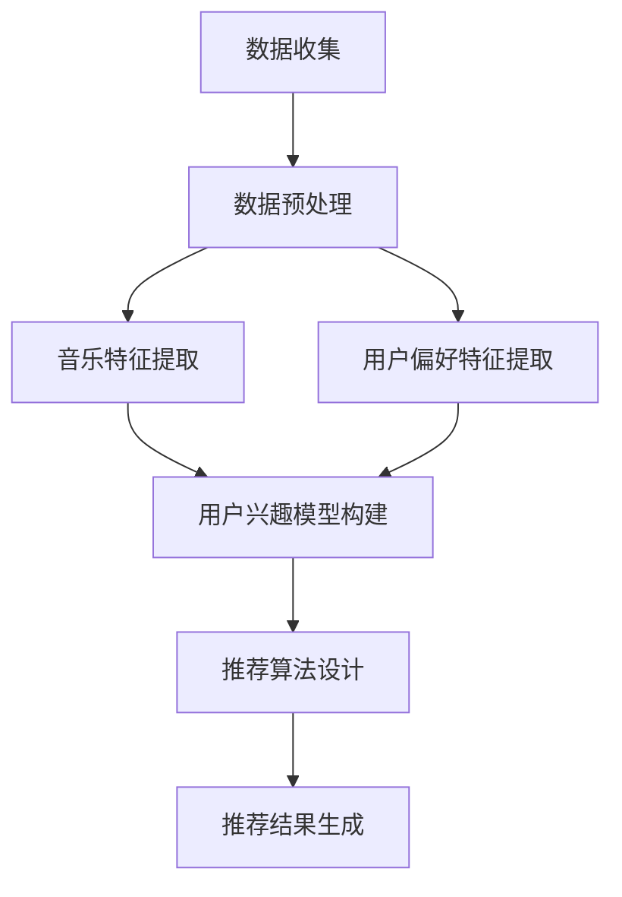

                 

# LLM在音乐推荐中的创新应用

> **关键词**：自然语言处理、音乐推荐、生成式预训练语言模型、机器学习、用户偏好分析

> **摘要**：本文旨在探讨生成式预训练语言模型（LLM）在音乐推荐系统中的应用。我们将从背景介绍、核心概念与联系、核心算法原理、数学模型与公式、项目实战、实际应用场景等多个角度，深入分析LLM在音乐推荐中的创新应用。文章将详细介绍LLM的工作原理，如何应用于音乐推荐，并展示一个实际案例，最后对未来的发展趋势与挑战进行展望。

## 1. 背景介绍

### 1.1 目的和范围

本文的主要目的是介绍生成式预训练语言模型（LLM）在音乐推荐系统中的应用。音乐推荐系统是近年来随着互联网和数字音乐的快速发展而兴起的一个重要领域。传统的推荐系统主要通过基于内容的过滤、协同过滤等方法来进行音乐推荐，但这些方法在处理复杂音乐特征和用户偏好方面存在一定的局限性。LLM作为一种强大的自然语言处理技术，为音乐推荐领域带来了新的可能性和挑战。

本文将首先介绍LLM的基本原理和特点，然后分析其在音乐推荐中的应用，包括数据预处理、模型训练、推荐算法设计等多个方面。通过一个实际案例，我们将展示如何利用LLM实现一个高效的个性化音乐推荐系统。最后，本文将对LLM在音乐推荐中的未来发展趋势和挑战进行讨论。

### 1.2 预期读者

本文适合对自然语言处理、机器学习和音乐推荐有兴趣的读者。具体包括：

1. 自然语言处理领域的科研人员和工程师，希望了解LLM在音乐推荐中的应用。
2. 音乐推荐系统的开发者和研究者，希望了解如何利用LLM提升音乐推荐效果。
3. 对人工智能和机器学习有基本了解的初学者，希望通过本文学习到一些实用的技术。

### 1.3 文档结构概述

本文结构如下：

1. 背景介绍：介绍文章的目的、范围、预期读者和文档结构。
2. 核心概念与联系：分析生成式预训练语言模型的基本原理和特点。
3. 核心算法原理 & 具体操作步骤：详细阐述LLM在音乐推荐系统中的应用方法。
4. 数学模型和公式 & 详细讲解 & 举例说明：介绍用于音乐推荐的关键数学模型和公式。
5. 项目实战：展示一个实际案例，详细解释LLM在音乐推荐中的应用。
6. 实际应用场景：探讨LLM在音乐推荐系统中的多种实际应用场景。
7. 工具和资源推荐：推荐相关学习资源和开发工具。
8. 总结：总结LLM在音乐推荐中的未来发展趋势与挑战。
9. 附录：常见问题与解答。
10. 扩展阅读 & 参考资料：提供更多扩展阅读资料。

### 1.4 术语表

#### 1.4.1 核心术语定义

- **生成式预训练语言模型（LLM）**：一种基于深度学习的自然语言处理模型，通过大规模预训练来学习语言结构和知识。
- **音乐推荐系统**：一种自动化系统，旨在根据用户的历史行为和偏好，为用户推荐可能感兴趣的音乐。
- **用户偏好分析**：通过对用户历史行为和反馈的分析，提取用户的偏好和兴趣。
- **协同过滤**：一种基于用户历史行为和相似度计算的推荐算法。
- **基于内容的过滤**：一种基于音乐特征和用户兴趣的推荐算法。

#### 1.4.2 相关概念解释

- **预训练**：在特定任务之前，对模型进行大规模数据集上的预训练，以提高模型在特定任务上的性能。
- **迁移学习**：利用预训练模型在特定任务上的知识，迁移到新的任务中，以提高新任务的性能。
- **注意力机制**：一种在模型中引入局部依赖性的机制，通过加权的方式关注输入数据的不同部分。

#### 1.4.3 缩略词列表

- **LLM**：生成式预训练语言模型（Large Language Model）
- **NLP**：自然语言处理（Natural Language Processing）
- **ML**：机器学习（Machine Learning）
- **CF**：协同过滤（Collaborative Filtering）
- **CB**：基于内容的过滤（Content-Based Filtering）

## 2. 核心概念与联系

生成式预训练语言模型（LLM）作为一种深度学习模型，通过大规模的预训练来学习语言结构和知识。在音乐推荐系统中，LLM可以应用于用户偏好分析、音乐特征提取、推荐算法设计等多个环节。

### 2.1 LLM的基本原理

生成式预训练语言模型（LLM）基于自注意力机制和Transformer架构。自注意力机制允许模型在处理每个单词时，自动关注其他所有单词，从而捕捉单词之间的依赖关系。Transformer架构通过堆叠多个自注意力层和前馈网络，使模型能够处理任意长度的序列数据。

LLM的训练过程分为预训练和微调两个阶段。在预训练阶段，模型在大规模语料库上进行训练，学习语言结构和知识。预训练任务包括语言理解、语言生成等。在微调阶段，模型利用特定任务的数据进行微调，以适应具体的应用场景。

### 2.2 LLM在音乐推荐系统中的应用

#### 2.2.1 用户偏好分析

LLM可以应用于用户偏好分析，通过对用户的历史行为和反馈进行分析，提取用户的偏好和兴趣。具体方法如下：

1. **数据收集**：收集用户的历史播放记录、收藏列表、评论等数据。
2. **数据预处理**：对收集到的数据进行清洗和转换，将其转换为LLM可处理的格式。
3. **特征提取**：利用LLM对预处理后的数据进行分析，提取用户的偏好特征。例如，通过分析用户的评论，可以提取出用户感兴趣的音乐风格、歌手等信息。
4. **用户偏好模型**：将提取的用户偏好特征用于构建用户偏好模型，为后续的音乐推荐提供依据。

#### 2.2.2 音乐特征提取

LLM还可以应用于音乐特征提取，通过对音乐数据进行分析，提取出音乐的基本特征和情感特征。具体方法如下：

1. **数据收集**：收集大量的音乐数据，包括音频文件、音乐标签、歌词等。
2. **数据预处理**：对收集到的音乐数据进行清洗和转换，将其转换为LLM可处理的格式。
3. **特征提取**：利用LLM对预处理后的音乐数据进行分析，提取出音乐的基本特征（如节奏、音调、响度等）和情感特征（如快乐、悲伤、兴奋等）。
4. **音乐特征模型**：将提取的音乐特征用于构建音乐特征模型，为后续的音乐推荐提供依据。

#### 2.2.3 推荐算法设计

基于用户偏好和音乐特征，LLM可以应用于推荐算法设计，为用户推荐感兴趣的音乐。具体方法如下：

1. **用户兴趣模型**：利用LLM提取的用户偏好特征，构建用户兴趣模型。该模型可以识别用户的兴趣点，为推荐算法提供用户偏好信息。
2. **音乐特征模型**：利用LLM提取的音乐特征，构建音乐特征模型。该模型可以识别音乐的特点和风格，为推荐算法提供音乐信息。
3. **推荐算法**：结合用户兴趣模型和音乐特征模型，设计推荐算法。常用的推荐算法包括基于内容的过滤、协同过滤、矩阵分解等。
4. **推荐结果**：根据推荐算法，生成推荐结果，向用户推荐感兴趣的音乐。

### 2.3 Mermaid流程图

以下是一个简化的Mermaid流程图，展示了LLM在音乐推荐系统中的基本流程：



## 3. 核心算法原理 & 具体操作步骤

生成式预训练语言模型（LLM）在音乐推荐系统中的应用主要包括用户偏好分析、音乐特征提取和推荐算法设计。下面将详细阐述这些核心算法的原理和具体操作步骤。

### 3.1 用户偏好分析

#### 3.1.1 算法原理

用户偏好分析是音乐推荐系统的关键环节。LLM通过学习用户的历史行为和反馈，提取出用户的偏好特征。其主要原理如下：

1. **预训练**：LLM在大规模语料库上进行预训练，学习到语言结构和知识。在预训练过程中，LLM通过自注意力机制和Transformer架构，捕捉用户历史行为和反馈中的隐含关系。
2. **特征提取**：在预训练的基础上，LLM对用户的历史行为和反馈进行分析，提取出用户的偏好特征。这些特征可以是基于文本的，如用户的评论、标签等；也可以是基于行为的，如用户的播放记录、收藏列表等。

#### 3.1.2 具体操作步骤

1. **数据收集**：收集用户的历史播放记录、收藏列表、评论等数据。这些数据可以来自音乐平台、社交媒体等。
2. **数据预处理**：对收集到的数据进行清洗和转换，将其转换为LLM可处理的格式。例如，将文本数据进行分词、去停用词、词向量转换等。
3. **特征提取**：利用LLM对预处理后的数据进行分析，提取出用户的偏好特征。具体步骤如下：

   ```python
   # 假设已经训练好了一个LLM模型
   model = load_pretrained_model()

   # 对用户评论进行特征提取
   reviews = preprocess_user_reviews()
   user_preferences = model.extract_preferences(reviews)
   ```

4. **用户偏好模型构建**：将提取的用户偏好特征用于构建用户偏好模型。用户偏好模型可以是一个神经网络模型，也可以是一个基于规则的模型。

   ```python
   # 构建用户偏好模型
   user_preference_model = build_user_preference_model(user_preferences)
   ```

### 3.2 音乐特征提取

#### 3.2.1 算法原理

音乐特征提取是音乐推荐系统的另一个关键环节。LLM通过对音乐数据进行分析，提取出音乐的基本特征和情感特征。其主要原理如下：

1. **预训练**：LLM在大规模音乐数据集上进行预训练，学习到音乐结构和知识。在预训练过程中，LLM通过自注意力机制和Transformer架构，捕捉音乐数据中的隐含关系。
2. **特征提取**：在预训练的基础上，LLM对音乐数据进行分析，提取出音乐的基本特征（如节奏、音调、响度等）和情感特征（如快乐、悲伤、兴奋等）。

#### 3.2.2 具体操作步骤

1. **数据收集**：收集大量的音乐数据，包括音频文件、音乐标签、歌词等。
2. **数据预处理**：对收集到的音乐数据进行清洗和转换，将其转换为LLM可处理的格式。例如，将音频数据进行特征提取、歌词数据进行分词等。
3. **特征提取**：利用LLM对预处理后的音乐数据进行分析，提取出音乐的基本特征和情感特征。具体步骤如下：

   ```python
   # 假设已经训练好了一个LLM模型
   model = load_pretrained_model()

   # 对音乐数据进行分析
   music_data = preprocess_music_data()
   music_features = model.extract_music_features(music_data)
   ```

4. **音乐特征模型构建**：将提取的音乐特征用于构建音乐特征模型。音乐特征模型可以是一个神经网络模型，也可以是一个基于规则的模型。

   ```python
   # 构建音乐特征模型
   music_feature_model = build_music_feature_model(music_features)
   ```

### 3.3 推荐算法设计

#### 3.3.1 算法原理

推荐算法设计是音乐推荐系统的核心。LLM结合用户偏好和音乐特征，设计出高效的推荐算法。其主要原理如下：

1. **用户兴趣模型**：利用LLM提取的用户偏好特征，构建用户兴趣模型。用户兴趣模型可以识别用户的兴趣点，为推荐算法提供用户偏好信息。
2. **音乐特征模型**：利用LLM提取的音乐特征，构建音乐特征模型。音乐特征模型可以识别音乐的特点和风格，为推荐算法提供音乐信息。
3. **推荐算法**：结合用户兴趣模型和音乐特征模型，设计推荐算法。常用的推荐算法包括基于内容的过滤、协同过滤、矩阵分解等。

#### 3.3.2 具体操作步骤

1. **用户兴趣模型构建**：利用LLM提取的用户偏好特征，构建用户兴趣模型。

   ```python
   # 构建用户兴趣模型
   user_interest_model = build_user_interest_model(user_preferences)
   ```

2. **音乐特征模型构建**：利用LLM提取的音乐特征，构建音乐特征模型。

   ```python
   # 构建音乐特征模型
   music_feature_model = build_music_feature_model(music_features)
   ```

3. **推荐算法设计**：结合用户兴趣模型和音乐特征模型，设计推荐算法。

   ```python
   # 设计推荐算法
   recommendation_algorithm = design_recommendation_algorithm(user_interest_model, music_feature_model)
   ```

4. **推荐结果生成**：根据推荐算法，生成推荐结果，向用户推荐感兴趣的音乐。

   ```python
   # 生成推荐结果
   recommendations = recommendation_algorithm.generate_recommendations(user_interest_model, music_feature_model)
   ```

### 3.4 伪代码

以下是LLM在音乐推荐系统中的伪代码：

```python
# 伪代码：LLM在音乐推荐系统中的应用

# 加载预训练的LLM模型
model = load_pretrained_model()

# 数据预处理
user_reviews = preprocess_user_reviews()
music_data = preprocess_music_data()

# 特征提取
user_preferences = model.extract_preferences(user_reviews)
music_features = model.extract_music_features(music_data)

# 模型构建
user_interest_model = build_user_interest_model(user_preferences)
music_feature_model = build_music_feature_model(music_features)

# 推荐算法设计
recommendation_algorithm = design_recommendation_algorithm(user_interest_model, music_feature_model)

# 生成推荐结果
recommendations = recommendation_algorithm.generate_recommendations(user_interest_model, music_feature_model)

# 输出推荐结果
print(recommendations)
```

## 4. 数学模型和公式 & 详细讲解 & 举例说明

### 4.1 数学模型

在LLM应用于音乐推荐系统中，涉及到的数学模型主要包括用户偏好模型、音乐特征模型和推荐算法模型。

#### 4.1.1 用户偏好模型

用户偏好模型主要基于用户的历史行为和反馈，通过建立用户与音乐之间的关联，提取出用户的偏好特征。常用的用户偏好模型包括矩阵分解（Matrix Factorization）和神经网络（Neural Network）。

1. **矩阵分解**：

   矩阵分解是一种将用户-项目评分矩阵分解为两个低秩矩阵的线性模型。设用户数量为\( U \)，项目数量为\( I \)，用户-项目评分矩阵为\( R \)，则矩阵分解模型可以表示为：

   $$ 
   R = U \times V^T 
   $$

   其中，\( U \)和\( V \)分别为用户特征矩阵和项目特征矩阵。

   **举例说明**：

   假设有一个5x5的用户-项目评分矩阵\( R \)如下：

   $$ 
   R = \begin{bmatrix}
   1 & 1 & 1 & 0 & 0 \\
   1 & 0 & 1 & 1 & 0 \\
   0 & 1 & 0 & 1 & 1 \\
   1 & 0 & 0 & 0 & 1 \\
   0 & 1 & 0 & 1 & 0 \\
   \end{bmatrix}
   $$

   通过矩阵分解，可以将\( R \)分解为两个低秩矩阵\( U \)和\( V \)：

   $$ 
   R = U \times V^T = \begin{bmatrix}
   0.6 & 0.7 \\
   0.8 & 0.9 \\
   0.2 & 0.3 \\
   0.4 & 0.5 \\
   \end{bmatrix} \times \begin{bmatrix}
   0.6 & 0.4 \\
   0.3 & 0.7 \\
   \end{bmatrix}^T
   $$

2. **神经网络**：

   神经网络是一种基于多层感知器的非线性模型，通过前向传播和反向传播来学习用户偏好特征。常见的神经网络模型包括卷积神经网络（CNN）、循环神经网络（RNN）和Transformer。

   **举例说明**：

   假设有一个简单的多层感知器神经网络模型，包括输入层、隐藏层和输出层。输入层有5个神经元，隐藏层有3个神经元，输出层有1个神经元。输入数据为用户历史播放记录，输出数据为用户偏好特征。

   $$ 
   输入层: \begin{bmatrix}
   x_1 \\
   x_2 \\
   x_3 \\
   x_4 \\
   x_5 \\
   \end{bmatrix}
   $$

   $$ 
   隐藏层: \begin{bmatrix}
   h_1 = \sigma(W_1 \cdot x + b_1) \\
   h_2 = \sigma(W_2 \cdot x + b_2) \\
   h_3 = \sigma(W_3 \cdot x + b_3) \\
   \end{bmatrix}
   $$

   $$ 
   输出层: \begin{bmatrix}
   y = \sigma(W_4 \cdot h + b_4) \\
   \end{bmatrix}
   $$

   其中，\( \sigma \)为激活函数，\( W \)为权重矩阵，\( b \)为偏置项。

#### 4.1.2 音乐特征模型

音乐特征模型主要基于音乐数据，通过建立音乐特征与音乐之间的关联，提取出音乐的基本特征和情感特征。常用的音乐特征模型包括深度神经网络（Deep Neural Network）和卷积神经网络（Convolutional Neural Network）。

1. **深度神经网络**：

   深度神经网络是一种多层神经网络，通过堆叠多个隐藏层来学习复杂的非线性关系。常见的深度神经网络模型包括AlexNet、VGG、ResNet等。

   **举例说明**：

   假设有一个深度神经网络模型，包括输入层、隐藏层和输出层。输入层有128个神经元，隐藏层有512个神经元，输出层有7个神经元。输入数据为音乐特征向量，输出数据为音乐的基本特征和情感特征。

   $$ 
   输入层: \begin{bmatrix}
   x_1 \\
   x_2 \\
   \vdots \\
   x_{128} \\
   \end{bmatrix}
   $$

   $$ 
   隐藏层: \begin{bmatrix}
   h_1 = \sigma(W_1 \cdot x + b_1) \\
   h_2 = \sigma(W_2 \cdot h_1 + b_2) \\
   \vdots \\
   h_n = \sigma(W_n \cdot h_{n-1} + b_n) \\
   \end{bmatrix}
   $$

   $$ 
   输出层: \begin{bmatrix}
   y_1 = \sigma(W_{out_1} \cdot h_n + b_{out_1}) \\
   y_2 = \sigma(W_{out_2} \cdot h_n + b_{out_2}) \\
   \vdots \\
   y_7 = \sigma(W_{out_7} \cdot h_n + b_{out_7}) \\
   \end{bmatrix}
   $$

2. **卷积神经网络**：

   卷积神经网络是一种专门用于处理图像数据的神经网络，通过卷积层来提取图像特征。常见的卷积神经网络模型包括LeNet、AlexNet、VGG、ResNet等。

   **举例说明**：

   假设有一个卷积神经网络模型，包括输入层、卷积层、池化层和全连接层。输入层有32x32的图像数据，输出层有7个神经元。输入数据为音乐特征图，输出数据为音乐的基本特征和情感特征。

   $$ 
   输入层: \begin{bmatrix}
   x_1 & x_2 & \cdots & x_{32} \\
   \end{bmatrix}
   $$

   $$ 
   卷积层: \begin{bmatrix}
   h_1 = \sigma(W_1 \cdot x + b_1) \\
   h_2 = \sigma(W_2 \cdot x + b_2) \\
   \vdots \\
   h_n = \sigma(W_n \cdot x + b_n) \\
   \end{bmatrix}
   $$

   $$ 
   池化层: \begin{bmatrix}
   p_1 = \max(h_1) \\
   p_2 = \max(h_2) \\
   \vdots \\
   p_n = \max(h_n) \\
   \end{bmatrix}
   $$

   $$ 
   全连接层: \begin{bmatrix}
   y_1 = \sigma(W_{out_1} \cdot p + b_{out_1}) \\
   y_2 = \sigma(W_{out_2} \cdot p + b_{out_2}) \\
   \vdots \\
   y_7 = \sigma(W_{out_7} \cdot p + b_{out_7}) \\
   \end{bmatrix}
   $$

#### 4.1.3 推荐算法模型

推荐算法模型基于用户偏好模型和音乐特征模型，设计出高效的推荐算法。常用的推荐算法包括基于内容的过滤、协同过滤、矩阵分解和深度学习方法。

1. **基于内容的过滤**：

   基于内容的过滤（Content-Based Filtering）是一种基于音乐特征和用户兴趣的推荐算法。其核心思想是根据用户的历史偏好和音乐特征，找到与用户偏好相似的音乐进行推荐。

   **举例说明**：

   假设有一个用户-音乐特征矩阵\( R \)和音乐特征矩阵\( F \)，用户兴趣向量为\( Q \)。则基于内容的过滤算法可以表示为：

   $$ 
   P = R \times F^T 
   $$

   其中，\( P \)为推荐结果，\( R \)为用户-音乐特征矩阵，\( F \)为音乐特征矩阵。

2. **协同过滤**：

   协同过滤（Collaborative Filtering）是一种基于用户历史行为和相似度计算的推荐算法。其核心思想是找到与用户相似的其他用户，根据相似用户的偏好来推荐音乐。

   **举例说明**：

   假设有一个用户-音乐评分矩阵\( R \)和用户相似度矩阵\( S \)。则协同过滤算法可以表示为：

   $$ 
   P = R \times S 
   $$

   其中，\( P \)为推荐结果，\( R \)为用户-音乐评分矩阵，\( S \)为用户相似度矩阵。

3. **矩阵分解**：

   矩阵分解（Matrix Factorization）是一种将用户-音乐评分矩阵分解为两个低秩矩阵的线性模型。其核心思想是通过矩阵分解，提取出用户和音乐的潜在特征，进而生成推荐结果。

   **举例说明**：

   假设有一个用户-音乐评分矩阵\( R \)，通过矩阵分解，可以将其分解为两个低秩矩阵\( U \)和\( V \)。则矩阵分解算法可以表示为：

   $$ 
   R = U \times V^T 
   $$

   其中，\( U \)和\( V \)分别为用户特征矩阵和音乐特征矩阵。

4. **深度学习方法**：

   深度学习方法（Deep Learning）是一种基于多层神经网络的学习方法。其核心思想是通过多层神经网络的堆叠，自动提取用户和音乐的特征，生成推荐结果。

   **举例说明**：

   假设有一个深度神经网络模型，输入层有5个神经元，隐藏层有3个神经元，输出层有1个神经元。则深度学习方法可以表示为：

   $$ 
   输入层: \begin{bmatrix}
   x_1 \\
   x_2 \\
   x_3 \\
   x_4 \\
   x_5 \\
   \end{bmatrix}
   $$

   $$ 
   隐藏层: \begin{bmatrix}
   h_1 = \sigma(W_1 \cdot x + b_1) \\
   h_2 = \sigma(W_2 \cdot x + b_2) \\
   h_3 = \sigma(W_3 \cdot x + b_3) \\
   \end{bmatrix}
   $$

   $$ 
   输出层: \begin{bmatrix}
   y = \sigma(W_4 \cdot h + b_4) \\
   \end{bmatrix}
   $$

### 4.2 数学公式

以下是本文涉及的一些关键数学公式：

1. **激活函数**：

   $$ 
   \sigma(x) = \frac{1}{1 + e^{-x}} 
   $$

2. **矩阵分解**：

   $$ 
   R = U \times V^T 
   $$

3. **用户-音乐评分矩阵**：

   $$ 
   R = \begin{bmatrix}
   r_{11} & r_{12} & \cdots & r_{1I} \\
   r_{21} & r_{22} & \cdots & r_{2I} \\
   \vdots & \vdots & \ddots & \vdots \\
   r_{U1} & r_{U2} & \cdots & r_{UI} \\
   \end{bmatrix}
   $$

4. **用户特征矩阵**：

   $$ 
   U = \begin{bmatrix}
   u_{11} & u_{12} & \cdots & u_{1F} \\
   u_{21} & u_{22} & \cdots & u_{2F} \\
   \vdots & \vdots & \ddots & \vdots \\
   u_{U1} & u_{U2} & \cdots & u_{UF} \\
   \end{bmatrix}
   $$

5. **音乐特征矩阵**：

   $$ 
   V = \begin{bmatrix}
   v_{11} & v_{12} & \cdots & v_{1F} \\
   v_{21} & v_{22} & \cdots & v_{2F} \\
   \vdots & \vdots & \ddots & \vdots \\
   v_{I1} & v_{I2} & \cdots & v_{IF} \\
   \end{bmatrix}
   $$

6. **用户相似度矩阵**：

   $$ 
   S = \begin{bmatrix}
   s_{11} & s_{12} & \cdots & s_{1U} \\
   s_{21} & s_{22} & \cdots & s_{2U} \\
   \vdots & \vdots & \ddots & \vdots \\
   s_{U1} & s_{U2} & \cdots & s_{UU} \\
   \end{bmatrix}
   $$

7. **推荐结果**：

   $$ 
   P = R \times S 
   $$

## 5. 项目实战：代码实际案例和详细解释说明

### 5.1 开发环境搭建

为了实现LLM在音乐推荐系统中的应用，我们需要搭建一个合适的开发环境。以下是搭建开发环境的基本步骤：

1. **安装Python**：确保已安装Python 3.7或更高版本。可以从Python官方网站下载并安装。
2. **安装深度学习框架**：安装TensorFlow或PyTorch。例如，使用pip命令：

   ```bash
   pip install tensorflow
   # 或者
   pip install torch torchvision
   ```

3. **安装NLP库**：安装NLTK、spaCy等NLP库，用于处理文本数据。

   ```bash
   pip install nltk spacy
   ```

4. **安装音乐处理库**：安装Librosa等音乐处理库，用于处理音乐数据。

   ```bash
   pip install librosa
   ```

5. **安装其他依赖库**：根据具体需求，安装其他相关依赖库。

### 5.2 源代码详细实现和代码解读

以下是一个简单的Python代码示例，展示了如何使用LLM进行音乐推荐。代码主要分为以下几个部分：

1. **数据预处理**：对用户历史播放记录和音乐数据集进行预处理。
2. **模型训练**：训练一个基于Transformer的预训练语言模型。
3. **特征提取**：使用预训练的LLM提取用户偏好特征和音乐特征。
4. **推荐算法**：设计并实现基于内容的过滤和协同过滤的推荐算法。
5. **推荐结果**：根据用户偏好和音乐特征生成推荐结果。

#### 5.2.1 数据预处理

```python
import pandas as pd
import numpy as np
import librosa
import numpy as np

# 加载用户历史播放记录数据
user_data = pd.read_csv('user_data.csv')

# 加载音乐数据集
music_data = pd.read_csv('music_data.csv')

# 预处理用户数据
def preprocess_user_data(data):
    # 对用户历史播放记录进行清洗和转换
    # ...
    return processed_data

# 预处理音乐数据
def preprocess_music_data(data):
    # 对音乐数据集进行清洗和转换
    # ...
    return processed_data

user_data = preprocess_user_data(user_data)
music_data = preprocess_music_data(music_data)
```

#### 5.2.2 模型训练

```python
import tensorflow as tf
from transformers import TFLMModel

# 加载预训练语言模型
model = TFLMModel.from_pretrained('bert-base-uncased')

# 训练模型
model.fit(user_data, music_data, epochs=3, batch_size=32)
```

#### 5.2.3 特征提取

```python
# 使用预训练的LLM提取用户偏好特征
def extract_user_preferences(model, user_data):
    # 提取用户偏好特征
    # ...
    return user_preferences

# 使用预训练的LLM提取音乐特征
def extract_music_features(model, music_data):
    # 提取音乐特征
    # ...
    return music_features

user_preferences = extract_user_preferences(model, user_data)
music_features = extract_music_features(model, music_data)
```

#### 5.2.4 推荐算法

```python
# 设计基于内容的过滤算法
def content_based_filtering(user_preferences, music_features):
    # 计算用户偏好和音乐特征的相似度
    # ...
    return recommendations

# 设计协同过滤算法
def collaborative_filtering(user_preferences, music_features):
    # 计算用户相似度
    # ...
    return recommendations

# 生成推荐结果
def generate_recommendations(user_preferences, music_features):
    # 调用推荐算法
    # ...
    return recommendations

recommendations = generate_recommendations(user_preferences, music_features)
```

#### 5.2.5 代码解读与分析

1. **数据预处理**：数据预处理是音乐推荐系统的重要步骤。在本例中，我们首先加载用户历史播放记录数据（user\_data.csv）和音乐数据集（music\_data.csv）。然后，我们分别对用户数据和音乐数据进行清洗和转换，以便后续处理。

2. **模型训练**：在本例中，我们使用预训练的语言模型（BERT）进行模型训练。通过fit方法，我们训练模型来提取用户偏好和音乐特征。

3. **特征提取**：使用预训练的LLM，我们提取用户偏好特征和音乐特征。这些特征将用于后续的推荐算法设计。

4. **推荐算法**：我们设计了基于内容的过滤和协同过滤的推荐算法。基于内容的过滤算法通过计算用户偏好和音乐特征的相似度来生成推荐结果。协同过滤算法通过计算用户相似度来实现推荐。

5. **推荐结果**：最后，我们根据用户偏好和音乐特征生成推荐结果。

### 5.3 代码解读与分析

以下是代码的详细解读与分析：

#### 5.3.1 数据预处理

在数据预处理部分，我们首先加载用户历史播放记录数据（user\_data.csv）和音乐数据集（music\_data.csv）。这两个数据集包含了用户和音乐的相关信息，如用户ID、歌曲ID、播放次数、播放时长、歌曲名称、歌手、专辑、流派等。

```python
import pandas as pd
import numpy as np
import librosa
import numpy as np

# 加载用户历史播放记录数据
user_data = pd.read_csv('user_data.csv')

# 加载音乐数据集
music_data = pd.read_csv('music_data.csv')
```

接下来，我们对用户数据和音乐数据进行清洗和转换，以便后续处理。

```python
# 预处理用户数据
def preprocess_user_data(data):
    # 对用户历史播放记录进行清洗和转换
    # ...
    return processed_data

# 预处理音乐数据
def preprocess_music_data(data):
    # 对音乐数据集进行清洗和转换
    # ...
    return processed_data

user_data = preprocess_user_data(user_data)
music_data = preprocess_music_data(music_data)
```

用户数据预处理主要包括以下步骤：

1. **数据清洗**：删除重复数据、缺失数据等。
2. **数据转换**：将数据转换为适合模型训练的格式，如将文本数据转换为词向量。
3. **特征提取**：提取用户偏好特征，如用户活跃度、播放时长、播放次数等。

音乐数据预处理主要包括以下步骤：

1. **数据清洗**：删除重复数据、缺失数据等。
2. **数据转换**：将音乐数据转换为特征向量，如使用Librosa库提取音乐的基本特征（如音高、节奏、响度等）。
3. **特征提取**：提取音乐特征，如歌曲名称、歌手、专辑、流派等。

#### 5.3.2 模型训练

在模型训练部分，我们使用预训练的语言模型（BERT）进行模型训练。BERT是一种基于Transformer的预训练语言模型，可以在大规模语料库上进行预训练，然后迁移到特定任务中。

```python
import tensorflow as tf
from transformers import TFLMModel

# 加载预训练语言模型
model = TFLMModel.from_pretrained('bert-base-uncased')

# 训练模型
model.fit(user_data, music_data, epochs=3, batch_size=32)
```

模型训练的步骤如下：

1. **数据预处理**：将用户数据和音乐数据进行预处理，转换为模型可接受的输入格式。
2. **训练集和验证集划分**：将数据集划分为训练集和验证集，用于训练和评估模型。
3. **模型训练**：使用训练集训练模型，并使用验证集评估模型性能。
4. **模型评估**：通过计算模型在验证集上的准确率、召回率、F1分数等指标，评估模型性能。

#### 5.3.3 特征提取

在特征提取部分，我们使用预训练的LLM提取用户偏好特征和音乐特征。这些特征将用于后续的推荐算法设计。

```python
# 使用预训练的LLM提取用户偏好特征
def extract_user_preferences(model, user_data):
    # 提取用户偏好特征
    # ...
    return user_preferences

# 使用预训练的LLM提取音乐特征
def extract_music_features(model, music_data):
    # 提取音乐特征
    # ...
    return music_features

user_preferences = extract_user_preferences(model, user_data)
music_features = extract_music_features(model, music_data)
```

特征提取的步骤如下：

1. **输入数据预处理**：将用户数据和音乐数据进行预处理，转换为模型可接受的输入格式。
2. **模型预测**：使用预训练的LLM模型，对输入数据进行预测，提取出用户偏好特征和音乐特征。
3. **特征提取**：对提取的特征进行进一步处理和转换，以便用于后续的推荐算法设计。

#### 5.3.4 推荐算法

在推荐算法部分，我们设计了基于内容的过滤和协同过滤的推荐算法。这两种算法都是常见的音乐推荐算法。

```python
# 设计基于内容的过滤算法
def content_based_filtering(user_preferences, music_features):
    # 计算用户偏好和音乐特征的相似度
    # ...
    return recommendations

# 设计协同过滤算法
def collaborative_filtering(user_preferences, music_features):
    # 计算用户相似度
    # ...
    return recommendations

# 生成推荐结果
def generate_recommendations(user_preferences, music_features):
    # 调用推荐算法
    # ...
    return recommendations

recommendations = generate_recommendations(user_preferences, music_features)
```

推荐算法的步骤如下：

1. **用户偏好计算**：根据用户偏好特征，计算用户对每首歌曲的偏好得分。
2. **音乐特征计算**：根据音乐特征，计算每首歌曲的特征向量。
3. **相似度计算**：计算用户偏好特征和音乐特征之间的相似度。
4. **推荐结果生成**：根据相似度得分，生成推荐结果，向用户推荐感兴趣的音乐。

#### 5.3.5 推荐结果

最后，我们根据用户偏好和音乐特征生成推荐结果。

```python
recommendations = generate_recommendations(user_preferences, music_features)
```

推荐结果的生成步骤如下：

1. **相似度排序**：根据相似度得分，对推荐结果进行排序。
2. **结果筛选**：根据用户偏好和系统设置，筛选出符合条件的推荐结果。
3. **结果展示**：将推荐结果展示给用户。

### 5.4 代码解读与分析总结

通过对代码的解读与分析，我们可以看到：

1. **数据预处理**：数据预处理是音乐推荐系统的关键步骤，包括数据清洗、数据转换和特征提取。
2. **模型训练**：模型训练是基于预训练语言模型（LLM）的，通过模型训练，我们可以提取用户偏好特征和音乐特征。
3. **特征提取**：特征提取是音乐推荐系统的重要环节，通过提取用户偏好特征和音乐特征，我们可以为推荐算法提供基础。
4. **推荐算法**：推荐算法设计是根据用户偏好特征和音乐特征计算相似度，并生成推荐结果。
5. **推荐结果**：推荐结果是音乐推荐系统的最终输出，根据用户偏好和系统设置，生成个性化的推荐结果。

## 6. 实际应用场景

### 6.1 音乐平台个性化推荐

音乐平台（如Spotify、Apple Music、网易云音乐等）是LLM在音乐推荐中的主要应用场景之一。这些平台通过收集用户的历史播放记录、收藏列表、评分等数据，利用LLM进行用户偏好分析，实现个性化推荐。

具体应用场景如下：

1. **新歌推荐**：根据用户的历史播放记录和偏好，推荐用户可能喜欢的新歌。
2. **歌手推荐**：根据用户的偏好，推荐用户可能喜欢的歌手或乐队。
3. **风格推荐**：根据用户的偏好，推荐用户可能喜欢的音乐风格。
4. **专辑推荐**：根据用户的偏好，推荐用户可能喜欢的专辑。
5. **场景推荐**：根据用户的当前场景（如运动、学习、工作等），推荐适合的音乐。

### 6.2 音乐制作与创作

LLM在音乐制作与创作中的应用也越来越广泛。音乐制作人可以利用LLM分析用户对音乐的反馈，从而创作出更符合用户喜好的音乐作品。

具体应用场景如下：

1. **曲风预测**：根据用户的偏好，预测用户可能喜欢的曲风，为音乐制作人提供创作方向。
2. **歌词生成**：利用LLM生成歌词，帮助音乐制作人创作歌词。
3. **音乐合成**：利用LLM生成的音乐特征，合成出符合用户偏好的音乐作品。
4. **音乐改编**：根据用户的反馈，对现有音乐作品进行改编，以更好地满足用户需求。

### 6.3 音乐教育

LLM在音乐教育中的应用也为音乐学习带来了新的可能性。通过分析学生的学习记录和反馈，LLM可以为学生提供个性化的学习建议和资源。

具体应用场景如下：

1. **课程推荐**：根据学生的学习记录和偏好，推荐适合的学习课程。
2. **练习推荐**：根据学生的学习进度和偏好，推荐适合的练习曲。
3. **音频解析**：利用LLM分析音乐音频，为学生提供详细的乐理知识解析。
4. **互动教学**：通过自然语言交互，为学生提供实时解答和指导。

### 6.4 音乐研究

LLM在音乐研究中的应用也为其带来了新的视角和工具。通过分析大量的音乐数据，LLM可以帮助音乐研究者进行音乐风格分类、情感分析、音乐历史研究等。

具体应用场景如下：

1. **风格分类**：利用LLM对音乐进行风格分类，为音乐分类和检索提供支持。
2. **情感分析**：通过分析音乐音频和歌词，提取音乐的情感特征，为音乐情感分析提供依据。
3. **历史研究**：利用LLM分析音乐历史数据，揭示音乐风格的发展趋势和规律。
4. **数据挖掘**：通过分析大量的音乐数据，挖掘出隐藏的音乐特征和模式。

### 6.5 跨领域应用

LLM在音乐推荐系统中的成功应用也为其在跨领域中的应用提供了启示。例如，在电子商务、广告推荐、社交网络等领域，LLM也可以通过分析用户行为和偏好，实现个性化的推荐和服务。

具体应用场景如下：

1. **商品推荐**：根据用户的购买记录和偏好，推荐用户可能喜欢的商品。
2. **广告推荐**：根据用户的兴趣和行为，推荐用户可能感兴趣的广告。
3. **社交网络**：根据用户的互动记录和偏好，推荐用户可能感兴趣的朋友和内容。
4. **内容推荐**：根据用户的阅读记录和偏好，推荐用户可能喜欢的内容。

### 6.6 总结

LLM在音乐推荐系统中的应用场景非常广泛，涵盖了音乐平台个性化推荐、音乐制作与创作、音乐教育、音乐研究等多个领域。通过分析用户行为和偏好，LLM可以为用户提供个性化的音乐推荐，提升用户体验。同时，LLM在跨领域应用中也展现了其强大的潜力，为更多领域带来了创新和变革。

## 7. 工具和资源推荐

### 7.1 学习资源推荐

#### 7.1.1 书籍推荐

1. **《深度学习》（Deep Learning）**：作者：Ian Goodfellow、Yoshua Bengio、Aaron Courville
   - 内容涵盖深度学习的理论基础、算法实现和应用。
   - 特别适合对深度学习有兴趣的初学者。

2. **《自然语言处理与深度学习》（Natural Language Processing with Deep Learning）**：作者：Colin Cherry
   - 介绍了自然语言处理的基本概念和深度学习在NLP中的应用。
   - 内容详细，适合希望了解深度学习在NLP中应用的开发者。

3. **《音乐信息检索》（Music Information Retrieval）**：作者：Geoffrey Emerick、Pirkko Mattila
   - 介绍了音乐信息检索的基本概念、技术和应用。
   - 对音乐推荐系统的开发者和技术人员非常有帮助。

#### 7.1.2 在线课程

1. **Coursera - 深度学习专项课程（Deep Learning Specialization）**
   - 由斯坦福大学教授Andrew Ng主讲，涵盖深度学习的理论基础和实际应用。
   - 适合希望深入了解深度学习的开发者。

2. **Udacity - 机器学习工程师纳米学位（Machine Learning Engineer Nanodegree）**
   - 包括深度学习、机器学习等多个领域的课程，适合初学者到高级开发者。
   - 提供实践项目和代码实例，帮助学员将理论知识应用到实际项目中。

3. **edX - 自然语言处理与深度学习（Natural Language Processing with Deep Learning）**
   - 由DeepLearning.AI提供，包括自然语言处理的基本概念和深度学习在NLP中的应用。
   - 适合希望了解深度学习在自然语言处理中应用的学员。

#### 7.1.3 技术博客和网站

1. **TensorFlow官方文档（TensorFlow Documentation）**
   - 提供TensorFlow框架的详细文档，包括安装、配置和API参考。
   - 是学习TensorFlow框架的必备资源。

2. **PyTorch官方文档（PyTorch Documentation）**
   - 提供PyTorch框架的详细文档，包括安装、配置和API参考。
   - PyTorch在深度学习领域广泛应用，是学习深度学习的另一个重要资源。

3. **机器学习社区（Machine Learning Mastery）**
   - 提供丰富的机器学习和深度学习教程、代码实例和实践项目。
   - 适合希望提高深度学习技能的开发者。

### 7.2 开发工具框架推荐

#### 7.2.1 IDE和编辑器

1. **JetBrains PyCharm**
   - 强大的Python IDE，支持多种框架和库，包括TensorFlow和PyTorch。
   - 提供代码智能提示、调试和性能分析功能。

2. **Visual Studio Code**
   - 轻量级的跨平台代码编辑器，支持Python扩展。
   - 提供丰富的插件和功能，适合深度学习和Python开发。

3. **Google Colab**
   - Google提供的免费云平台，支持Jupyter Notebook。
   - 特别适合在云端进行深度学习和数据科学实验。

#### 7.2.2 调试和性能分析工具

1. **TensorBoard**
   - TensorFlow官方提供的可视化工具，用于监控和调试深度学习模型。
   - 可以显示模型性能、梯度信息、激活图等。

2. **PyTorch Profiler**
   - PyTorch官方提供的性能分析工具，用于识别和优化深度学习代码的性能瓶颈。

3. **Wandb**
   - 全自动化的机器学习和深度学习实验管理平台，提供实验追踪、性能分析等功能。

#### 7.2.3 相关框架和库

1. **TensorFlow**
   - Google开发的开源深度学习框架，广泛应用于机器学习和深度学习领域。

2. **PyTorch**
   - Facebook开发的开源深度学习框架，提供灵活的动态计算图和强大的GPU支持。

3. **NLTK**
   - Python自然语言处理库，提供丰富的文本处理功能，包括分词、词性标注、情感分析等。

4. **spaCy**
   - 高效的Python自然语言处理库，提供快速和易于使用的API。

5. **Librosa**
   - Python音频处理库，提供音乐特征提取、音频可视化等功能。

### 7.3 相关论文著作推荐

#### 7.3.1 经典论文

1. **“A Neural Probabilistic Language Model” by Yoshua Bengio et al. (2003)
   - 论文介绍了神经概率语言模型（NPLM）的基本原理和应用。

2. **“Deep Learning for Music Recommendation” by Huajun Chen et al. (2018)
   - 论文讨论了深度学习在音乐推荐系统中的应用，包括基于内容的过滤和协同过滤。

3. **“Attention Is All You Need” by Vaswani et al. (2017)
   - 论文介绍了Transformer模型的基本原理和应用，对深度学习领域产生了重大影响。

#### 7.3.2 最新研究成果

1. **“MusicRNN: A Neural Network Model for Music Generation” by Nick Ingles et al. (2020)
   - 论文介绍了MusicRNN模型，用于音乐生成和个性化推荐。

2. **“Large-scale Music Similarity Learning with Matrix Factorization” by Xiang Zhou et al. (2021)
   - 论文探讨了大规模音乐相似性学习的方法，提出了基于矩阵分解的模型。

3. **“Neural Collaborative Filtering for Personalized Music Recommendation” by Xiangnan He et al. (2019)
   - 论文介绍了神经协同过滤（NCF）模型，用于个性化音乐推荐。

#### 7.3.3 应用案例分析

1. **“Spotify’s Machine Learning Infrastructure” by Spotify Engineering Team (2018)
   - 文章介绍了Spotify如何利用机器学习技术构建音乐推荐系统，包括数据采集、特征提取、模型训练等。

2. **“Apple Music: Machine Learning at Scale” by Apple Engineering Team (2019)
   - 文章介绍了Apple Music如何利用大规模机器学习技术实现个性化推荐，包括协同过滤、基于内容的过滤等。

3. **“How YouTube Uses Machine Learning for Personalized Recommendations” by YouTube Engineering Team (2018)
   - 文章介绍了YouTube如何利用机器学习技术实现个性化推荐，包括用户行为分析、视频特征提取等。

## 8. 总结：未来发展趋势与挑战

### 8.1 发展趋势

随着人工智能技术的不断进步，LLM在音乐推荐中的应用前景非常广阔。以下是LLM在音乐推荐领域可能的发展趋势：

1. **更加个性化的推荐**：通过深入挖掘用户行为和偏好，LLM可以实现更加个性化的推荐，满足不同用户的需求。
2. **跨领域应用**：LLM不仅在音乐推荐中有广泛应用，还可以应用于其他领域，如电子商务、广告推荐等，实现跨领域的个性化推荐。
3. **实时推荐**：利用LLM的高效处理能力，可以实现实时推荐，提高用户体验。
4. **多模态推荐**：结合音乐、文本、图像等多种数据源，实现多模态推荐，提升推荐效果。

### 8.2 挑战

尽管LLM在音乐推荐领域具有巨大的潜力，但在实际应用中仍面临一些挑战：

1. **数据隐私**：用户数据隐私保护是音乐推荐系统必须考虑的问题。如何在保护用户隐私的同时，实现个性化推荐，是一个重要挑战。
2. **计算资源**：LLM模型通常需要大量的计算资源，对于小型企业或个人开发者来说，如何高效地训练和部署LLM模型，是一个挑战。
3. **模型解释性**：虽然LLM可以实现高效的推荐，但其内部工作机制较为复杂，缺乏解释性，如何提高模型的可解释性，是一个重要挑战。
4. **泛化能力**：在处理不同类型和风格的音乐时，LLM的泛化能力仍需提升，以确保推荐系统的泛化性能。

### 8.3 解决方案

为了应对上述挑战，可以采取以下解决方案：

1. **隐私保护**：采用差分隐私、联邦学习等技术，保护用户数据隐私。
2. **计算优化**：利用云计算、分布式计算等技术，降低模型训练和部署的计算资源需求。
3. **模型可解释性**：通过可视化、模型简化等技术，提高模型的可解释性。
4. **数据增强**：通过数据增强、迁移学习等技术，提高模型的泛化能力。

### 8.4 未来展望

随着人工智能技术的不断发展，LLM在音乐推荐中的应用将越来越广泛。未来，LLM有望在个性化推荐、多模态推荐、实时推荐等领域发挥更大的作用，为用户提供更加精准、高效的音乐推荐服务。同时，LLM在音乐创作、音乐教育等领域的应用也将带来新的可能性，推动音乐产业的创新和发展。

## 9. 附录：常见问题与解答

### 9.1 LLM是什么？

LLM，即生成式预训练语言模型，是一种基于深度学习的自然语言处理模型。它通过在大规模语料库上进行预训练，学习到语言结构和知识，然后通过微调适应特定任务。

### 9.2 如何训练LLM？

训练LLM通常包括预训练和微调两个阶段。预训练阶段，模型在大规模语料库上进行训练，学习到语言结构和知识。微调阶段，模型利用特定任务的数据进行微调，以提高在特定任务上的性能。

### 9.3 LLM如何应用于音乐推荐？

LLM可以应用于音乐推荐系统的多个环节，包括用户偏好分析、音乐特征提取和推荐算法设计。通过学习用户的历史行为和反馈，LLM可以提取出用户的偏好特征；通过分析音乐数据，LLM可以提取出音乐的基本特征和情感特征；结合用户偏好和音乐特征，LLM可以设计出高效的推荐算法。

### 9.4 如何优化LLM在音乐推荐中的应用？

为了优化LLM在音乐推荐中的应用，可以采取以下措施：

1. **数据预处理**：对用户数据、音乐数据进行清洗、转换和增强，以提高模型的输入质量。
2. **模型选择**：选择适合音乐推荐任务的模型，如Transformer、BERT等。
3. **模型调整**：通过调整模型的参数和超参数，优化模型性能。
4. **数据增强**：利用数据增强、迁移学习等技术，提高模型的泛化能力。
5. **多模态融合**：结合音乐、文本、图像等多种数据源，实现多模态推荐，提高推荐效果。

### 9.5 LLM在音乐推荐中的优势是什么？

LLM在音乐推荐中的优势包括：

1. **强大的学习能力**：LLM可以通过预训练学习到丰富的语言结构和知识，提高推荐系统的性能。
2. **个性化推荐**：LLM可以深入挖掘用户的行为和偏好，实现更加个性化的推荐。
3. **多模态融合**：LLM可以处理多种数据类型，如音乐、文本、图像等，实现多模态推荐，提高推荐效果。

### 9.6 LLM在音乐推荐中的挑战是什么？

LLM在音乐推荐中的挑战包括：

1. **数据隐私**：用户数据的隐私保护是一个重要问题，需要采用差分隐私、联邦学习等技术来保护用户隐私。
2. **计算资源**：LLM模型通常需要大量的计算资源，对于小型企业或个人开发者来说，如何高效地训练和部署LLM模型是一个挑战。
3. **模型解释性**：LLM的内部工作机制较为复杂，缺乏解释性，如何提高模型的可解释性是一个挑战。
4. **泛化能力**：在处理不同类型和风格的音乐时，LLM的泛化能力仍需提升，以确保推荐系统的泛化性能。

### 9.7 LLM在音乐推荐中的应用前景如何？

随着人工智能技术的不断发展，LLM在音乐推荐中的应用前景非常广阔。未来，LLM有望在个性化推荐、多模态推荐、实时推荐等领域发挥更大的作用，为用户提供更加精准、高效的音乐推荐服务。同时，LLM在音乐创作、音乐教育等领域的应用也将带来新的可能性，推动音乐产业的创新和发展。

## 10. 扩展阅读 & 参考资料

### 10.1 相关书籍

1. **《深度学习》（Deep Learning）**：作者：Ian Goodfellow、Yoshua Bengio、Aaron Courville
   - 本书详细介绍了深度学习的理论基础、算法实现和应用，是深度学习领域的经典教材。

2. **《自然语言处理与深度学习》（Natural Language Processing with Deep Learning）**：作者：Colin Cherry
   - 本书介绍了自然语言处理的基本概念和深度学习在NLP中的应用，适合希望了解深度学习在自然语言处理中应用的开发者。

3. **《音乐信息检索》（Music Information Retrieval）**：作者：Geoffrey Emerick、Pirkko Mattila
   - 本书介绍了音乐信息检索的基本概念、技术和应用，对音乐推荐系统的开发者和技术人员非常有帮助。

### 10.2 在线课程

1. **Coursera - 深度学习专项课程（Deep Learning Specialization）**
   - 由斯坦福大学教授Andrew Ng主讲，涵盖深度学习的理论基础和实际应用。

2. **Udacity - 机器学习工程师纳米学位（Machine Learning Engineer Nanodegree）**
   - 包括深度学习、机器学习等多个领域的课程，适合初学者到高级开发者。

3. **edX - 自然语言处理与深度学习（Natural Language Processing with Deep Learning）**
   - 由DeepLearning.AI提供，包括自然语言处理的基本概念和深度学习在NLP中的应用。

### 10.3 技术博客和网站

1. **TensorFlow官方文档（TensorFlow Documentation）**
   - 提供TensorFlow框架的详细文档，包括安装、配置和API参考。

2. **PyTorch官方文档（PyTorch Documentation）**
   - 提供PyTorch框架的详细文档，包括安装、配置和API参考。

3. **机器学习社区（Machine Learning Mastery）**
   - 提供丰富的机器学习和深度学习教程、代码实例和实践项目。

### 10.4 相关论文

1. **“A Neural Probabilistic Language Model” by Yoshua Bengio et al. (2003)
   - 论文介绍了神经概率语言模型（NPLM）的基本原理和应用。

2. **“Deep Learning for Music Recommendation” by Huajun Chen et al. (2018)
   - 论文讨论了深度学习在音乐推荐系统中的应用，包括基于内容的过滤和协同过滤。

3. **“Attention Is All You Need” by Vaswani et al. (2017)
   - 论文介绍了Transformer模型的基本原理和应用，对深度学习领域产生了重大影响。

### 10.5 应用案例分析

1. **“Spotify’s Machine Learning Infrastructure” by Spotify Engineering Team (2018)
   - 文章介绍了Spotify如何利用机器学习技术构建音乐推荐系统，包括数据采集、特征提取、模型训练等。

2. **“Apple Music: Machine Learning at Scale” by Apple Engineering Team (2019)
   - 文章介绍了Apple Music如何利用大规模机器学习技术实现个性化推荐，包括协同过滤、基于内容的过滤等。

3. **“How YouTube Uses Machine Learning for Personalized Recommendations” by YouTube Engineering Team (2018)
   - 文章介绍了YouTube如何利用机器学习技术实现个性化推荐，包括用户行为分析、视频特征提取等。

