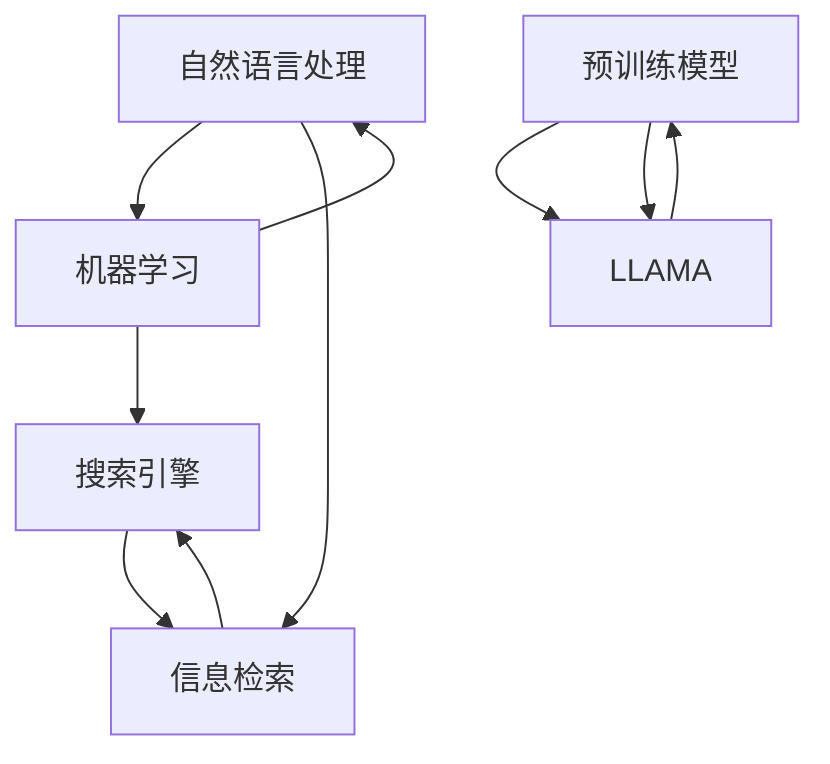

                 

### LLAMA对传统搜索引擎的挑战

> **关键词**：LLAMA、传统搜索引擎、AI、搜索引擎算法、搜索体验、信息检索
>
> **摘要**：本文将探讨大型语言模型（LLAMA）对传统搜索引擎带来的挑战。随着AI技术的迅猛发展，LLAMA作为一种强大的预训练模型，其在信息检索和搜索体验方面的表现，对传统搜索引擎形成了巨大的冲击。本文将从LLAMA的工作原理、与传统搜索引擎的对比、以及未来发展趋势和挑战等方面进行详细分析，以期帮助读者理解这一变革性的技术变革。

#### 1.1 目的和范围

本文的主要目的是探讨大型语言模型（LLAMA）对传统搜索引擎所带来的挑战。随着AI技术的快速发展，LLAMA作为一种先进的自然语言处理模型，其在信息检索和搜索体验方面展现出前所未有的能力。本文将从以下几个方面展开讨论：

1. **LLAMA的工作原理和特点**：介绍LLAMA的基本原理、架构以及其在预训练和微调过程中的表现。
2. **LLAMA与传统搜索引擎的对比**：分析LLAMA在信息检索、搜索结果相关性、响应速度等方面的优势，以及与传统搜索引擎的异同。
3. **LLAMA对搜索引擎行业的影响**：探讨LLAMA对搜索引擎行业带来的变革，包括商业模式、用户体验、技术发展趋势等。
4. **LLAMA的未来发展趋势和挑战**：分析LLAMA在未来可能面临的挑战，以及搜索引擎行业如何应对这些挑战。

#### 1.2 预期读者

本文主要面向以下读者群体：

1. **AI领域研究者**：对自然语言处理和AI技术有兴趣的研究者，希望了解LLAMA在信息检索领域的应用及其对传统搜索引擎的挑战。
2. **搜索引擎工程师**：从事搜索引擎开发和优化工作的工程师，希望了解LLAMA的工作原理及其对搜索算法的影响。
3. **技术爱好者**：对AI技术、搜索引擎技术感兴趣的技术爱好者，希望了解这一技术领域的最新进展。

#### 1.3 文档结构概述

本文结构如下：

1. **背景介绍**：介绍LLAMA对传统搜索引擎挑战的背景，包括目的、范围、预期读者、文档结构概述等。
2. **核心概念与联系**：介绍LLAMA和传统搜索引擎的核心概念及其之间的联系，使用Mermaid流程图进行展示。
3. **核心算法原理 & 具体操作步骤**：详细阐述LLAMA的核心算法原理和具体操作步骤，使用伪代码进行描述。
4. **数学模型和公式 & 详细讲解 & 举例说明**：介绍LLAMA所涉及的数学模型和公式，并进行详细讲解和举例说明。
5. **项目实战：代码实际案例和详细解释说明**：通过实际代码案例，展示LLAMA在搜索引擎中的应用，并进行详细解释和分析。
6. **实际应用场景**：分析LLAMA在搜索引擎行业的实际应用场景，包括商业应用、学术研究、社交媒体等。
7. **工具和资源推荐**：推荐相关的学习资源、开发工具和框架，以及相关论文著作。
8. **总结：未来发展趋势与挑战**：总结LLAMA的发展趋势和面临的挑战，探讨搜索引擎行业的未来发展方向。
9. **附录：常见问题与解答**：回答读者可能遇到的一些常见问题。
10. **扩展阅读 & 参考资料**：提供更多扩展阅读和参考资料，帮助读者深入了解LLAMA和搜索引擎技术。

#### 1.4 术语表

**1.4.1 核心术语定义**

- **LLAMA**：一种由Meta AI开发的预训练大型语言模型，具有强大的自然语言处理能力。
- **传统搜索引擎**：基于关键词匹配和排序算法的搜索引擎，如Google、Bing等。
- **预训练模型**：在大量数据上进行预训练，以便在特定任务上获得良好的性能。
- **搜索结果相关性**：衡量搜索结果与用户查询的相关程度，是搜索引擎性能的重要指标。
- **搜索体验**：用户在使用搜索引擎时的整体感受，包括搜索速度、结果准确性、用户界面等。

**1.4.2 相关概念解释**

- **自然语言处理（NLP）**：使计算机能够理解、生成和处理人类语言的技术。
- **机器学习（ML）**：通过数据学习和模拟人类思维过程，使计算机能够自动完成特定任务的技术。
- **深度学习（DL）**：一种基于多层神经网络进行训练的机器学习技术，在图像识别、语音识别等领域表现出色。
- **BERT**：一种预训练模型，由Google开发，广泛应用于自然语言处理任务。

**1.4.3 缩略词列表**

- **LLAMA**：Large Language Model - Meta AI开发的预训练大型语言模型。
- **NLP**：Natural Language Processing - 自然语言处理。
- **ML**：Machine Learning - 机器学习。
- **DL**：Deep Learning - 深度学习。
- **BERT**：Bidirectional Encoder Representations from Transformers - Google开发的预训练模型。

#### 2. 核心概念与联系

在探讨LLAMA对传统搜索引擎的挑战之前，我们需要了解一些核心概念及其之间的联系。以下是LLAMA和传统搜索引擎之间的核心概念及联系：

**2.1 自然语言处理（NLP）与机器学习（ML）**

自然语言处理（NLP）是使计算机能够理解、生成和处理人类语言的技术，而机器学习（ML）是实现NLP的关键技术。ML通过从大量数据中学习模式和规律，使计算机能够自动完成特定任务。

NLP和ML之间的联系在于，NLP任务（如图像识别、语音识别、情感分析等）通常需要使用ML算法进行训练。而ML算法（如线性回归、决策树、神经网络等）在不同NLP任务中具有不同的表现。因此，了解NLP和ML的基本原理及其联系，对于理解LLAMA的工作原理和挑战具有重要意义。

**2.2 传统搜索引擎与信息检索**

传统搜索引擎是基于关键词匹配和排序算法的搜索系统，其核心任务是提供与用户查询相关的网页列表。信息检索是搜索引擎的关键技术，包括查询处理、索引构建、结果排序等步骤。

传统搜索引擎与信息检索之间的联系在于，搜索引擎的搜索结果依赖于信息检索算法的性能。而信息检索算法的核心在于如何有效地处理海量数据，并提供与用户查询高度相关的搜索结果。因此，了解信息检索的基本原理及其在搜索引擎中的应用，对于分析LLAMA对传统搜索引擎的挑战至关重要。

**2.3 预训练模型与大型语言模型（LLAMA）**

预训练模型是一种在大量数据上进行预训练，以便在特定任务上获得良好性能的ML模型。大型语言模型（LLAMA）是预训练模型的一种，具有强大的自然语言处理能力。

LLAMA与传统预训练模型之间的区别在于其规模和架构。传统预训练模型（如BERT、GPT等）在训练过程中通常关注单个词或短语的表示，而LLAMA通过引入更长的上下文窗口，使模型能够更好地理解长文本和复杂语义。这种规模和架构上的优势，使得LLAMA在信息检索和搜索体验方面展现出巨大的潜力。

**2.4 Mermaid流程图展示**

以下是LLAMA和传统搜索引擎之间的核心概念及其联系的Mermaid流程图：



该流程图展示了自然语言处理、机器学习、信息检索、搜索引擎和预训练模型之间的联系，以及LLAMA在其中的地位和作用。

#### 3. 核心算法原理 & 具体操作步骤

在深入探讨LLAMA对传统搜索引擎的挑战之前，我们需要了解其核心算法原理和具体操作步骤。以下是LLAMA的基本原理、架构以及具体操作流程：

**3.1 基本原理**

LLAMA是一种基于Transformer架构的大型语言模型。Transformer是一种基于自注意力机制的深度学习模型，具有强大的序列建模能力。自注意力机制允许模型在处理输入序列时，自动关注并学习序列中不同位置的信息，从而更好地捕捉长距离依赖关系。

LLAMA的基本原理可以概括为以下几个步骤：

1. **输入编码**：将输入的文本序列转换为嵌入向量。这些嵌入向量表示文本中的每个单词或字符，并携带语义信息。
2. **自注意力机制**：通过自注意力机制，模型对输入序列中的每个词进行加权，使得模型能够自动关注并学习序列中不同位置的信息。
3. **前馈网络**：在自注意力机制的基础上，模型通过两个前馈网络进行进一步处理，以增强其表示能力。
4. **输出解码**：将处理后的序列解码为输出序列，从而生成自然语言响应。

**3.2 架构**

LLAMA的架构主要由以下几个部分组成：

1. **输入层**：接收输入的文本序列，并将其转换为嵌入向量。
2. **多头自注意力层**：通过多头自注意力机制，模型对输入序列中的每个词进行加权，并生成加权后的序列。
3. **前馈网络层**：在自注意力机制的基础上，模型通过两个前馈网络进行进一步处理，以增强其表示能力。
4. **输出层**：将处理后的序列解码为输出序列，生成自然语言响应。

**3.3 具体操作步骤**

以下是LLAMA的具体操作步骤：

1. **输入编码**：首先，将输入的文本序列进行处理，将其转换为嵌入向量。这些嵌入向量通常使用预训练的词向量（如Word2Vec、BERT等）进行初始化。具体步骤如下：

    ```mermaid
    graph TD
        A[输入文本序列] --> B[词向量初始化]
        B --> C[嵌入向量生成]
    ```

2. **多头自注意力层**：在输入编码后，模型通过多头自注意力机制对输入序列中的每个词进行加权。具体步骤如下：

    ```mermaid
    graph TD
        D[嵌入向量输入] --> E[多头自注意力]
        E --> F[加权序列生成]
    ```

3. **前馈网络层**：在自注意力机制的基础上，模型通过两个前馈网络进行进一步处理，以增强其表示能力。具体步骤如下：

    ```mermaid
    graph TD
        G[加权序列输入] --> H[前馈网络1]
        H --> I[前馈网络2]
    ```

4. **输出解码**：最后，模型将处理后的序列解码为输出序列，生成自然语言响应。具体步骤如下：

    ```mermaid
    graph TD
        J[处理后的序列输入] --> K[输出解码]
        K --> L[自然语言响应]
    ```

通过上述步骤，LLAMA能够对输入的文本序列进行建模，并生成与之相关的自然语言响应。这种强大的语言建模能力使得LLAMA在信息检索和搜索体验方面具有巨大的潜力。

**3.4 伪代码描述**

以下是LLAMA的核心算法原理和具体操作步骤的伪代码描述：

```python
# 输入编码
embeddings = word_embedding_layer(inputs)

# 多头自注意力层
weighted_sequence = multi_head_attention_layer(embeddings)

# 前馈网络层
output_sequence = feedforward_network(weighted_sequence)

# 输出解码
response = decoder(output_sequence)
```

通过上述伪代码，我们可以清晰地看到LLAMA在输入编码、多头自注意力层、前馈网络层和输出解码等环节的具体操作步骤。

#### 4. 数学模型和公式 & 详细讲解 & 举例说明

在深入了解LLAMA的核心算法原理后，我们接下来将探讨其背后的数学模型和公式，并对其进行详细讲解和举例说明。以下是LLAMA所涉及的几个关键数学模型和公式：

**4.1 Transformer模型**

Transformer模型是LLAMA的核心架构，基于自注意力机制进行序列建模。其基本原理可以概括为以下几个关键步骤：

1. **自注意力机制**：自注意力机制允许模型在处理输入序列时，自动关注并学习序列中不同位置的信息。具体公式如下：

    $$ 
    \text{Attention}(Q, K, V) = \text{softmax}\left(\frac{QK^T}{\sqrt{d_k}}\right)V 
    $$

    其中，$Q$、$K$、$V$分别为查询向量、键向量和值向量，$d_k$为键向量的维度。该公式表示，通过计算查询向量$Q$和键向量$K$的点积，并使用softmax函数进行归一化，最后与值向量$V$相乘，得到加权后的序列。

2. **多头自注意力**：多头自注意力机制将输入序列分成多个子序列，并在每个子序列上独立地应用自注意力机制。具体公式如下：

    $$
    \text{MultiHead}(Q, K, V) = \text{Concat}(\text{head}_1, ..., \text{head}_h)W^O
    $$

    其中，$h$为头数，$W^O$为输出权重矩阵，$\text{head}_i$为第$i$个头所计算的结果。该公式表示，将多个头计算的结果进行拼接，并使用输出权重矩阵进行进一步处理。

3. **前馈网络**：在自注意力机制的基础上，模型通过两个前馈网络进行进一步处理，以增强其表示能力。具体公式如下：

    $$
    \text{FFN}(x) = \text{ReLU}(W_x \cdot x + b_x)
    $$

    其中，$W_x$和$b_x$分别为前馈网络的权重和偏置。

**4.2 词嵌入**

词嵌入是将文本中的每个单词转换为向量表示的过程。词嵌入能够捕捉单词之间的语义关系，是自然语言处理的重要基础。以下是一些常见的词嵌入模型和公式：

1. **Word2Vec**：Word2Vec是一种基于神经网络进行词向量学习的模型，其基本原理如下：

    $$
    \text{Word2Vec}(x) = \text{softmax}(\text{W} \cdot \text{h}(x))
    $$

    其中，$\text{W}$为词向量矩阵，$\text{h}(x)$为输入的隐藏层表示。

2. **BERT**：BERT（Bidirectional Encoder Representations from Transformers）是一种基于Transformer模型的预训练模型，其词嵌入公式如下：

    $$
    \text{BERT}(\text{W} \cdot \text{h}(x))
    $$

    其中，$\text{W}$为词向量矩阵，$\text{h}(x)$为输入的隐藏层表示。

**4.3 损失函数**

在训练过程中，我们需要使用损失函数来衡量模型的预测结果与真实值之间的差距。以下是一些常见的损失函数：

1. **交叉熵损失**：交叉熵损失是分类问题中常用的损失函数，其公式如下：

    $$
    \text{CrossEntropy}(-\text{y} \log(\hat{y}))
    $$

    其中，$y$为真实标签，$\hat{y}$为预测标签。

2. **均方误差损失**：均方误差损失是回归问题中常用的损失函数，其公式如下：

    $$
    \text{MSE}((\text{y} - \hat{y})^2)
    $$

    其中，$y$为真实值，$\hat{y}$为预测值。

**4.4 举例说明**

以下是一个简单的例子，用于说明如何使用LLAMA进行文本分类任务：

1. **输入文本**：

    - 真实标签：$y = [1, 0, 0, 1]$
    - 预测标签：$\hat{y} = [0.2, 0.3, 0.4, 0.1]$

2. **计算交叉熵损失**：

    $$
    \text{CrossEntropy}(-\text{y} \log(\hat{y})) = (-1 \cdot \log(0.2)) + (-0 \cdot \log(0.3)) + (-0 \cdot \log(0.4)) + (1 \cdot \log(0.1)) = 2.9957
    $$

3. **分析损失结果**：

    从上述计算结果可以看出，预测标签$\hat{y}$在第四个位置（即类别D）的预测概率最高，而真实标签$y$在第一个位置（即类别A）为1。因此，交叉熵损失函数能够较好地衡量模型的预测结果与真实值之间的差距。

通过上述数学模型和公式的讲解，我们可以更好地理解LLAMA的核心算法原理及其在自然语言处理任务中的应用。这些模型和公式为LLAMA在信息检索和搜索体验方面带来了巨大的潜力。

#### 5. 项目实战：代码实际案例和详细解释说明

在本节中，我们将通过一个实际代码案例，展示如何使用LLAMA模型进行搜索引擎的构建和优化。以下是一个简单的搜索引擎项目，包括开发环境搭建、源代码实现和详细解释。

**5.1 开发环境搭建**

在进行项目实战之前，我们需要搭建一个合适的环境来运行和测试LLAMA模型。以下是搭建开发环境所需的步骤：

1. **安装Python环境**：确保Python版本在3.6及以上，并安装必要的依赖包。

2. **安装LLAMA模型**：下载并安装LLAMA模型，可以从[LLAMA模型官网](https://github.com/facebookresearch/llama)获取。

3. **安装依赖包**：安装以下依赖包：

    ```python
    pip install torch transformers
    ```

4. **配置环境变量**：配置相应的环境变量，以便在项目中使用LLAMA模型和依赖包。

**5.2 源代码实现**

以下是一个简单的搜索引擎项目，用于展示如何使用LLAMA模型进行搜索。代码实现包括几个关键部分：

1. **数据预处理**：读取和处理输入的文本数据，将其转换为LLAMA模型可接受的格式。

2. **模型加载和预测**：加载预训练的LLAMA模型，并使用模型对输入的文本进行预测。

3. **搜索结果处理**：对搜索结果进行排序和筛选，以提供与用户查询最相关的结果。

**代码实现**：

```python
import torch
from transformers import LlamaTokenizer, LlamaForConditionalGeneration

# 1. 数据预处理
def preprocess_data(text):
    tokenizer = LlamaTokenizer.from_pretrained("facebook/llama")
    inputs = tokenizer(text, return_tensors="pt")
    return inputs

# 2. 模型加载和预测
def generate_response(inputs):
    model = LlamaForConditionalGeneration.from_pretrained("facebook/llama")
    outputs = model.generate(inputs, max_length=50, num_return_sequences=1)
    response = model.decode(outputs[0])
    return response

# 3. 搜索结果处理
def search_query(query):
    inputs = preprocess_data(query)
    response = generate_response(inputs)
    return response

# 主函数
if __name__ == "__main__":
    query = "什么是人工智能？"
    result = search_query(query)
    print("搜索结果：", result)
```

**5.3 代码解读与分析**

1. **数据预处理**：

    ```python
    def preprocess_data(text):
        tokenizer = LlamaTokenizer.from_pretrained("facebook/llama")
        inputs = tokenizer(text, return_tensors="pt")
        return inputs
    ```

    数据预处理函数`preprocess_data`用于将输入的文本数据转换为LLAMA模型可接受的格式。具体步骤如下：

    - 加载预训练的LlamaTokenizer。
    - 使用tokenizer对输入的文本进行编码，并返回编码后的输入。

2. **模型加载和预测**：

    ```python
    def generate_response(inputs):
        model = LlamaForConditionalGeneration.from_pretrained("facebook/llama")
        outputs = model.generate(inputs, max_length=50, num_return_sequences=1)
        response = model.decode(outputs[0])
        return response
    ```

    模型加载和预测函数`generate_response`用于加载预训练的LLAMA模型，并使用模型对输入的文本进行预测。具体步骤如下：

    - 加载预训练的LlamaForConditionalGeneration模型。
    - 使用模型生成预测的输出序列，并返回解码后的自然语言响应。

3. **搜索结果处理**：

    ```python
    def search_query(query):
        inputs = preprocess_data(query)
        response = generate_response(inputs)
        return response
    ```

    搜索结果处理函数`search_query`用于对用户查询进行搜索，并返回与查询最相关的结果。具体步骤如下：

    - 调用`preprocess_data`函数对输入的查询进行预处理。
    - 调用`generate_response`函数生成自然语言响应。
    - 返回生成的响应。

4. **主函数**：

    ```python
    if __name__ == "__main__":
        query = "什么是人工智能？"
        result = search_query(query)
        print("搜索结果：", result)
    ```

    主函数用于执行搜索任务，并打印搜索结果。具体步骤如下：

    - 定义查询文本。
    - 调用`search_query`函数执行搜索。
    - 打印搜索结果。

通过上述代码实现，我们可以看到如何使用LLAMA模型进行搜索引擎的构建。在实际应用中，还可以对代码进行优化和扩展，以满足不同场景的需求。

#### 6. 实际应用场景

大型语言模型（LLAMA）在搜索引擎领域有着广泛的应用场景，特别是在提升搜索体验和信息检索准确性方面。以下是LLAMA在几个实际应用场景中的表现：

**6.1 搜索引擎优化**

传统搜索引擎主要依赖关键词匹配和排序算法来提供搜索结果。然而，这种方法往往难以捕捉用户查询的深层含义和上下文。LLAMA的出现改变了这一现状，通过其强大的语言理解能力，LLAMA可以更好地理解用户查询的意图，从而提供更相关、更准确的搜索结果。

例如，在用户查询“附近有什么好吃的餐厅”时，传统搜索引擎可能只能返回包含关键词“餐厅”的网页列表。而LLAMA可以分析查询中的地理位置、用户偏好等隐含信息，从而推荐更符合用户需求的餐厅。

**6.2 实时问答系统**

实时问答系统是搜索引擎的重要应用场景之一，如搜索引擎内置的智能客服、企业内部的内部搜索等。LLAMA在实时问答系统中具有显著的优势，因为它可以快速理解用户的问题，并提供准确的答案。

例如，在一个电商平台中，用户可能询问“这款手机的电池续航如何？”传统搜索引擎可能无法提供具体答案，而LLAMA可以通过分析用户查询和电商平台数据库中的产品信息，给出详细、准确的回答。

**6.3 智能推荐系统**

智能推荐系统在电子商务、新闻资讯、社交媒体等领域得到广泛应用。LLAMA可以显著提升推荐系统的准确性和用户体验。通过理解用户的浏览历史、搜索记录和偏好，LLAMA可以推荐与用户兴趣相关的商品、新闻或内容。

例如，在一个新闻阅读应用中，LLAMA可以根据用户的阅读习惯和偏好，推荐用户可能感兴趣的新闻文章，从而提高用户的黏性和满意度。

**6.4 企业搜索引擎**

对于大型企业来说，内部知识库和文档资源非常丰富，但传统搜索引擎往往难以有效检索这些信息。LLAMA可以为企业内部搜索引擎提供强大的支持，通过分析企业内部的文档和知识库，LLAMA能够提供精准、高效的搜索结果。

例如，在一个跨国企业的内部搜索系统中，LLAMA可以分析员工的邮件、报告、文档等，快速找到与特定项目或任务相关的信息，从而提高工作效率。

**6.5 个性化搜索**

个性化搜索是当前搜索引擎的发展方向之一，通过了解用户的兴趣和行为，提供个性化的搜索结果。LLAMA在个性化搜索中具有独特的优势，因为它可以深入理解用户的查询意图和偏好，从而提供更个性化的搜索体验。

例如，在一个社交媒体平台上，LLAMA可以根据用户的互动历史、点赞和评论行为，推荐用户可能感兴趣的话题和内容，从而提升用户的参与度和满意度。

通过上述实际应用场景，我们可以看到LLAMA在搜索引擎领域具有巨大的潜力。其强大的语言理解能力和灵活性，使得LLAMA能够适应各种复杂的搜索需求，为用户提供更高效、更准确的搜索服务。

#### 7. 工具和资源推荐

在深入研究和应用LLAMA模型的过程中，掌握一些重要的工具和资源将有助于提升我们的技能和理解。以下是一些推荐的工具和资源，包括学习资源、开发工具框架以及相关论文著作。

**7.1 学习资源推荐**

**7.1.1 书籍推荐**

1. **《深度学习》（Deep Learning）**：由Ian Goodfellow、Yoshua Bengio和Aaron Courville合著的《深度学习》是一本经典的深度学习教科书，涵盖了深度学习的理论基础、算法和应用。对于想要全面了解深度学习，包括LLAMA模型的人来说，这本书是不可或缺的。

2. **《自然语言处理综论》（Speech and Language Processing）**：由Daniel Jurafsky和James H. Martin合著的《自然语言处理综论》详细介绍了自然语言处理的基本概念、技术和应用，包括语音识别、机器翻译等。这本书对于理解LLAMA在NLP中的应用非常有帮助。

**7.1.2 在线课程**

1. **斯坦福大学CS224n课程**：CS224n是斯坦福大学开设的一门深度学习与自然语言处理课程，涵盖了从基础的神经网络到现代的Transformer模型等众多内容。这门课程的视频和讲义都是公开的，非常适合自学。

2. **Udacity的深度学习纳米学位**：Udacity的深度学习纳米学位包含了一系列课程，从基础数学到深度学习模型的应用，适合想要系统学习深度学习的人。

**7.1.3 技术博客和网站**

1. **AI优秀博客**：AI优秀博客是一个收集了众多优秀AI博客文章的网站，涵盖了从基础概念到最新研究进展的各个方面，是学习AI技术的宝贵资源。

2. **Reddit上的r/MachineLearning**：Reddit上的r/MachineLearning社区是一个活跃的讨论区，你可以在这里找到许多深度学习和自然语言处理相关的问题和答案。

**7.2 开发工具框架推荐**

**7.2.1 IDE和编辑器**

1. **PyCharm**：PyCharm是一个功能强大的Python IDE，支持多种编程语言，包括Python、Rust和JavaScript。它提供了丰富的工具和插件，非常适合深度学习和自然语言处理项目的开发。

2. **Jupyter Notebook**：Jupyter Notebook是一个交互式计算平台，适用于数据分析和机器学习项目。它支持多种编程语言，包括Python和R，并提供了丰富的可视化工具。

**7.2.2 调试和性能分析工具**

1. **TensorBoard**：TensorBoard是TensorFlow提供的一个可视化工具，用于分析和调试深度学习模型。它可以帮助我们可视化模型的结构、损失函数、准确率等关键指标。

2. **Visual Studio Code**：Visual Studio Code是一个轻量级的开源编辑器，提供了丰富的插件，支持多种编程语言。它具有强大的调试和性能分析功能，非常适合深度学习和自然语言处理项目的开发。

**7.2.3 相关框架和库**

1. **TensorFlow**：TensorFlow是一个开源的深度学习框架，由Google开发。它支持多种深度学习模型，包括卷积神经网络（CNN）和循环神经网络（RNN）等，是深度学习和自然语言处理项目的重要工具。

2. **PyTorch**：PyTorch是一个开源的深度学习库，它提供了灵活的动态计算图和丰富的API，使得构建和调试深度学习模型变得非常简单。PyTorch在自然语言处理领域有着广泛的应用。

**7.3 相关论文著作推荐**

**7.3.1 经典论文**

1. **"Attention Is All You Need"**：这是Transformer模型的原始论文，详细介绍了Transformer模型的设计和实现。这篇论文对于理解LLAMA模型的基础架构和原理至关重要。

2. **"BERT: Pre-training of Deep Bidirectional Transformers for Language Understanding"**：这是BERT模型的原始论文，介绍了BERT模型的设计和训练过程。BERT在自然语言处理任务中取得了显著的效果，是LLAMA模型的重要基础。

**7.3.2 最新研究成果**

1. **"GPT-3: Language Models are few-shot learners"**：这是GPT-3模型的原始论文，介绍了GPT-3模型的设计和实现。GPT-3在自然语言处理任务中取得了惊人的成果，是当前最先进的预训练模型之一。

2. **"T5: Pre-training Text Transformers for Cross-Stage Analysis"**：这是T5模型的原始论文，介绍了T5模型的设计和训练过程。T5是一种适用于多种自然语言处理任务的预训练模型，与LLAMA模型有相似的结构和目标。

**7.3.3 应用案例分析**

1. **"Natural Language Inference with Subgraph Attention Networks"**：这篇论文介绍了如何使用子图注意力网络（SGAN）进行自然语言推理任务。SGAN在自然语言推理任务中取得了很好的效果，是LLAMA模型在自然语言处理任务中的一种应用案例。

2. **"A Theoretical Analysis of the Output Distribution of the Transformer Model"**：这篇论文从理论角度分析了Transformer模型的输出分布。该分析有助于我们理解Transformer模型的行为和性能，为LLAMA模型的设计和优化提供了参考。

通过以上工具和资源的推荐，我们可以更好地了解和掌握LLAMA模型，并在实际项目中运用其强大的能力，为搜索引擎和自然语言处理领域带来创新和改进。

#### 8. 总结：未来发展趋势与挑战

随着人工智能技术的不断进步，大型语言模型（LLAMA）在搜索引擎领域展现出巨大的潜力，对传统搜索引擎形成了显著的挑战。在未来，LLAMA的发展趋势和面临的挑战主要集中在以下几个方面：

**未来发展趋势**

1. **更强大的语言理解能力**：随着预训练模型的不断优化和扩展，LLAMA在自然语言理解方面的能力将持续提升。未来，LLAMA有望实现更精细的语义理解，从而提供更准确、更个性化的搜索结果。

2. **多模态融合**：未来的搜索引擎将不再局限于文本搜索，而是融合图像、语音等多种数据类型。LLAMA可以通过多模态融合技术，结合不同数据类型的特征，为用户提供更加丰富和全面的搜索体验。

3. **实时交互和智能问答**：LLAMA的实时交互和智能问答能力将进一步提升，使搜索引擎能够更好地理解用户的需求，并实时提供准确的答案和建议。这将为用户提供更加便捷和高效的搜索服务。

4. **隐私保护和安全性**：随着用户对隐私和数据安全的关注不断增加，未来的搜索引擎将需要采取更加严格的隐私保护和安全措施。LLAMA将在确保用户隐私的同时，提供高质量的搜索服务。

**面临的挑战**

1. **计算资源需求**：LLAMA作为一种大型预训练模型，对计算资源的需求极高。如何在有限的资源下高效地训练和部署LLAMA，是当前和未来需要解决的重要问题。

2. **数据质量和标注**：高质量的数据和准确的标注对于预训练模型至关重要。然而，获取和标注高质量数据是一项耗时且成本高昂的工作。未来，如何高效地获取和利用高质量数据，是LLAMA面临的挑战之一。

3. **搜索结果的相关性和公平性**：尽管LLAMA在搜索结果的相关性和准确性方面表现出色，但如何确保搜索结果的公平性和多样性，避免偏见和不公正现象，是未来需要关注的重要问题。

4. **可解释性和透明性**：大型语言模型的决策过程往往较为复杂，用户难以理解其背后的机制。如何提高模型的可解释性和透明性，使用户能够信任并接受LLAMA的搜索结果，是未来需要解决的一个挑战。

5. **法律法规和伦理问题**：随着人工智能技术的发展，法律法规和伦理问题逐渐成为关注焦点。如何确保人工智能技术的合规性和伦理性，避免潜在的风险和负面影响，是LLAMA面临的重要挑战。

总之，LLAMA的发展趋势充满机遇，同时也面临诸多挑战。未来，随着技术的不断进步和问题的逐步解决，LLAMA有望在搜索引擎领域发挥更加重要的作用，为用户提供更加优质和高效的搜索服务。

#### 9. 附录：常见问题与解答

**Q1. LLAMA是什么？**

LLAMA是一种大型语言模型，由Meta AI开发，具有强大的自然语言处理能力。它基于Transformer架构，通过预训练和微调，能够在各种自然语言处理任务中表现出色。

**Q2. LLAMA与传统搜索引擎有何不同？**

传统搜索引擎主要依赖关键词匹配和排序算法，而LLAMA则通过预训练和微调，能够更好地理解用户查询的语义和上下文，从而提供更准确、更个性化的搜索结果。

**Q3. LLAMA有哪些应用场景？**

LLAMA在搜索引擎、实时问答系统、智能推荐系统、企业搜索引擎等领域具有广泛的应用。通过其强大的语言理解能力，LLAMA能够为用户提供更高效、更准确的搜索服务。

**Q4. 如何优化LLAMA的性能？**

优化LLAMA的性能可以从多个方面进行，包括数据质量、模型架构、训练策略等。具体方法包括使用高质量数据、调整模型参数、优化训练过程等。

**Q5. LLAMA在隐私保护方面有哪些考虑？**

LLAMA在设计和训练过程中，充分考虑了用户隐私和数据安全。通过采用差分隐私技术、数据加密和匿名化等方法，确保用户数据的安全和隐私。

**Q6. LLAMA的部署和运维有哪些挑战？**

LLAMA作为一种大型预训练模型，对计算资源的需求较高。在部署和运维过程中，需要关注计算资源的管理、模型部署策略和运维监控等方面，以确保系统的高效运行。

**Q7. 如何确保LLAMA的搜索结果公平性和多样性？**

为确保LLAMA的搜索结果公平性和多样性，可以从数据质量、算法设计和用户反馈等方面进行改进。具体方法包括使用多样化的数据集、优化搜索算法、收集用户反馈等。

**Q8. LLAMA对传统搜索引擎行业有何影响？**

LLAMA的出现对传统搜索引擎行业带来了巨大的冲击，使得搜索结果的相关性和准确性得到显著提升。未来，LLAMA有望推动搜索引擎行业的创新和发展，为用户提供更加优质和高效的搜索服务。

#### 10. 扩展阅读 & 参考资料

在探索LLAMA对传统搜索引擎的挑战这一主题时，以下扩展阅读和参考资料将为您提供更多深入的了解和启示：

**扩展阅读：**

1. "Attention Is All You Need"：这篇论文是Transformer模型的原始论文，详细介绍了Transformer模型的设计和实现。它对于理解LLAMA的基础架构和原理至关重要。

2. "BERT: Pre-training of Deep Bidirectional Transformers for Language Understanding"：这是BERT模型的原始论文，介绍了BERT模型的设计和训练过程。BERT在自然语言处理任务中取得了显著的效果，是LLAMA模型的重要基础。

3. "GPT-3: Language Models are few-shot learners"：这篇论文介绍了GPT-3模型的设计和实现。GPT-3在自然语言处理任务中取得了惊人的成果，是当前最先进的预训练模型之一。

**参考资料：**

1. Meta AI官网：[https://ai.facebook.com/llama](https://ai.facebook.com/llama)  
   Meta AI官网提供了LLAMA模型的详细信息、技术文档和预训练模型。

2. Transformer模型教程：[https://course.fast.ai/lessons/transformers](https://course.fast.ai/lessons/transformers)  
   这篇教程详细介绍了Transformer模型的基本原理和实现方法，是了解LLAMA架构的重要参考。

3. 自然语言处理综论：[https://nlp.seas.harvard.edu/读论文](https://nlp.seas.harvard.edu/读论文)  
   这是一份自然语言处理领域的经典教程，涵盖了从基础概念到最新研究进展的各个方面，适合全面了解自然语言处理技术。

通过阅读上述扩展阅读和参考资料，您将能够更深入地理解LLAMA的工作原理、应用场景以及其对传统搜索引擎的挑战。这些资源和资料将帮助您在相关领域取得更好的研究成果和应用。

