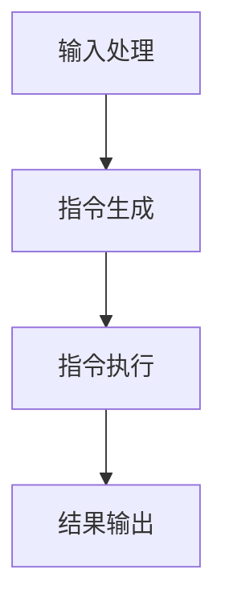

                 

# LLM无限指令集：开启无限可能

> **关键词**：大型语言模型（LLM）、无限指令集、推理能力、编程语言、人工智能、应用场景
> 
> **摘要**：本文将深入探讨大型语言模型（LLM）的无限指令集技术，揭示其背后的原理和架构，并通过具体的案例和实践，展示其在人工智能领域的广泛应用和无限可能。

## 1. 背景介绍

### 1.1 目的和范围

本文旨在系统地阐述大型语言模型（LLM）的无限指令集技术，分析其在人工智能领域的重要作用。文章将围绕以下几个方面展开：

1. **核心概念与联系**：介绍LLM的基本概念和无限指令集的工作原理。
2. **核心算法原理 & 具体操作步骤**：详细解析无限指令集的算法流程和实现方式。
3. **数学模型和公式**：探讨支持无限指令集的数学模型和公式。
4. **项目实战**：通过实际案例展示无限指令集的应用效果。
5. **实际应用场景**：分析无限指令集在不同领域中的应用场景。
6. **工具和资源推荐**：推荐学习资源和开发工具。
7. **总结与未来发展趋势**：总结无限指令集的优势和挑战，展望未来发展趋势。

### 1.2 预期读者

本文适合以下读者群体：

1. **人工智能研究者**：对大型语言模型和无限指令集技术有兴趣的研究者。
2. **程序员和软件开发者**：希望了解如何利用无限指令集提升编程能力的开发者。
3. **计算机科学学生**：对人工智能和计算机编程有浓厚兴趣的学生。

### 1.3 文档结构概述

本文将按照以下结构进行组织：

1. **背景介绍**：介绍本文的目的、范围和预期读者。
2. **核心概念与联系**：详细解析LLM和无限指令集的概念和架构。
3. **核心算法原理 & 具体操作步骤**：讲解无限指令集的算法原理和操作步骤。
4. **数学模型和公式**：探讨支持无限指令集的数学模型和公式。
5. **项目实战**：通过实际案例展示无限指令集的应用。
6. **实际应用场景**：分析无限指令集在不同领域的应用。
7. **工具和资源推荐**：推荐学习资源和开发工具。
8. **总结与未来发展趋势**：总结无限指令集的优势和挑战，展望未来发展趋势。
9. **附录**：常见问题与解答。
10. **扩展阅读 & 参考资料**：提供进一步学习的参考资料。

### 1.4 术语表

#### 1.4.1 核心术语定义

- **大型语言模型（LLM）**：一种基于深度学习的语言模型，能够理解和生成自然语言。
- **无限指令集**：一种扩展了传统计算机指令集的功能，允许LLM执行更复杂的操作，如自然语言理解和生成。
- **推理能力**：指LLM在处理问题时，能够从已知信息推导出未知信息的能力。
- **编程语言**：用于编写计算机程序的符号和语法规则。

#### 1.4.2 相关概念解释

- **深度学习**：一种机器学习技术，通过多层神经网络模型对数据进行学习和预测。
- **自然语言处理（NLP）**：研究如何使计算机理解和生成自然语言的技术。
- **神经网络**：由大量神经元组成的网络，通过学习数据来进行特征提取和预测。

#### 1.4.3 缩略词列表

- **LLM**：Large Language Model，大型语言模型。
- **NLP**：Natural Language Processing，自然语言处理。
- **IDE**：Integrated Development Environment，集成开发环境。
- **GPU**：Graphics Processing Unit，图形处理单元。

## 2. 核心概念与联系

在探讨LLM的无限指令集之前，我们首先需要了解LLM的基本概念和结构。LLM是一种基于深度学习的语言模型，通过大量的文本数据训练，能够理解和生成自然语言。其核心在于通过神经网络模型捕捉文本数据中的语义信息，从而实现高效的文本处理。

### 2.1 LLM的基本概念

LLM的基本概念主要包括以下几个方面：

1. **输入数据**：LLM的输入是自然语言文本，可以是句子、段落或完整的文档。
2. **神经网络模型**：LLM的核心是一个多层神经网络，包括输入层、隐藏层和输出层。
3. **参数**：神经网络模型中的参数用于调整模型的行为，如权重和偏置。
4. **训练过程**：通过大量的文本数据进行训练，使得神经网络模型能够学习到文本数据中的语义信息。

### 2.2 无限指令集的概念

无限指令集是一种扩展了传统计算机指令集的功能，允许LLM执行更复杂的操作，如自然语言理解和生成。与传统指令集相比，无限指令集具有以下几个特点：

1. **扩展性**：无限指令集可以动态扩展，以满足不同的应用需求。
2. **灵活性**：无限指令集允许LLM在执行任务时，根据上下文和需求选择不同的操作。
3. **高效性**：无限指令集通过优化算法，能够高效地执行各种操作，提高LLM的性能。

### 2.3 无限指令集的工作原理

无限指令集的工作原理可以概括为以下几个步骤：

1. **输入处理**：LLM接收自然语言文本输入，进行预处理，如分词、词性标注等。
2. **指令生成**：根据输入文本的语义信息，生成相应的指令集。
3. **指令执行**：LLM根据生成的指令集，执行相应的操作，如文本生成、语义理解等。
4. **结果输出**：将执行结果输出，供用户或其他系统使用。

### 2.4 Mermaid流程图

为了更直观地展示无限指令集的工作原理，我们使用Mermaid流程图来描述。以下是无限指令集的Mermaid流程图：



### 2.5 核心概念的联系

LLM和无限指令集之间的联系体现在以下几个方面：

1. **LLM作为基础**：无限指令集依赖于LLM的语义理解和生成能力。
2. **指令集的扩展**：无限指令集扩展了传统计算机指令集的功能，使得LLM能够执行更复杂的任务。
3. **灵活性和高效性**：无限指令集的灵活性和高效性使得LLM能够更好地应对各种复杂任务，提升其性能。

## 3. 核心算法原理 & 具体操作步骤

在了解LLM和无限指令集的基本概念和联系之后，我们接下来将深入探讨无限指令集的算法原理和具体操作步骤。为了更好地理解，我们将使用伪代码来详细阐述算法流程。

### 3.1 算法原理

无限指令集的算法原理可以分为以下几个关键步骤：

1. **输入预处理**：对输入的自然语言文本进行预处理，包括分词、词性标注等。
2. **语义理解**：利用LLM对预处理后的文本进行语义理解，提取关键信息和语义关系。
3. **指令生成**：根据语义理解的结果，生成相应的指令集，实现文本生成、语义理解等操作。
4. **指令执行**：根据生成的指令集，执行相应的操作，如文本生成、语义理解等。
5. **结果输出**：将执行结果输出，供用户或其他系统使用。

### 3.2 伪代码

以下是无限指令集的伪代码实现：

```python
# 输入预处理
def preprocess_input(text):
    # 分词、词性标注等
    return preprocessed_text

# 语义理解
def semantic_understanding(text):
    # 利用LLM进行语义理解
    return semantic_info

# 指令生成
def generate_instructions(semantic_info):
    # 根据语义理解的结果，生成指令集
    return instructions

# 指令执行
def execute_instructions(instructions):
    # 根据指令集执行操作
    return results

# 结果输出
def output_results(results):
    # 输出执行结果
    return

# 主函数
def main():
    # 读取输入文本
    text = read_input()

    # 输入预处理
    preprocessed_text = preprocess_input(text)

    # 语义理解
    semantic_info = semantic_understanding(preprocessed_text)

    # 指令生成
    instructions = generate_instructions(semantic_info)

    # 指令执行
    results = execute_instructions(instructions)

    # 结果输出
    output_results(results)

# 运行主函数
main()
```

### 3.3 操作步骤

根据伪代码，我们可以将无限指令集的操作步骤分为以下几个：

1. **读取输入文本**：从用户或其他系统接收自然语言文本输入。
2. **输入预处理**：对输入文本进行分词、词性标注等预处理操作。
3. **语义理解**：利用LLM对预处理后的文本进行语义理解，提取关键信息和语义关系。
4. **指令生成**：根据语义理解的结果，生成相应的指令集，实现文本生成、语义理解等操作。
5. **指令执行**：根据生成的指令集，执行相应的操作，如文本生成、语义理解等。
6. **结果输出**：将执行结果输出，供用户或其他系统使用。

### 3.4 操作步骤的详细解释

1. **读取输入文本**：
   - 在实际应用中，输入文本可以来自用户输入、文本文件、API接口等多种途径。需要根据具体应用场景进行读取和解析。

2. **输入预处理**：
   - 分词：将输入文本拆分成单词或词组，便于后续处理。
   - 词性标注：对每个单词或词组进行词性标注，如名词、动词、形容词等，为语义理解提供基础。

3. **语义理解**：
   - 利用LLM对预处理后的文本进行语义理解，提取关键信息和语义关系。LLM的训练数据量越大，语义理解能力越强。

4. **指令生成**：
   - 根据语义理解的结果，生成相应的指令集。指令集可以是具体的操作命令，如生成文本、提取信息等。

5. **指令执行**：
   - 根据生成的指令集，执行相应的操作。指令执行可以是同步或异步的方式，具体取决于应用场景。

6. **结果输出**：
   - 将执行结果输出，供用户或其他系统使用。输出结果可以是文本、图表、数据等多种形式。

## 4. 数学模型和公式 & 详细讲解 & 举例说明

### 4.1 数学模型

无限指令集的数学模型主要基于深度学习中的神经网络，特别是循环神经网络（RNN）和变换器（Transformer）。以下将分别介绍这两种模型的数学公式。

#### 4.1.1 循环神经网络（RNN）

RNN的数学模型可以表示为：

$$
h_t = \sigma(W_h \cdot [h_{t-1}, x_t] + b_h)
$$

其中，$h_t$ 表示第 $t$ 个时间步的隐藏状态，$x_t$ 表示第 $t$ 个时间步的输入，$\sigma$ 表示激活函数，$W_h$ 和 $b_h$ 分别为权重和偏置。

#### 4.1.2 变换器（Transformer）

Transformer的数学模型可以表示为：

$$
h_t = \text{Attention}(Q, K, V) = \frac{1}{\sqrt{d_k}} \text{softmax}(\text{softmax}(\text{QK}^T / \sqrt{d_k})V)
$$

其中，$h_t$ 表示第 $t$ 个时间步的隐藏状态，$Q$、$K$ 和 $V$ 分别为查询向量、键向量和值向量，$d_k$ 为键向量的维度。

### 4.2 详细讲解

#### 4.2.1 循环神经网络（RNN）

RNN是一种能够处理序列数据的神经网络，其核心思想是利用上一时间步的隐藏状态来影响当前时间步的输出。RNN的数学模型如上所述，其关键在于激活函数 $\sigma$ 的选择。

- **激活函数**：常用的激活函数有 sigmoid、tanh 和 ReLU。其中，sigmoid 和 tanh 函数可以将隐藏状态的值限制在 $[0, 1]$ 或 $[-1, 1]$ 范围内，而 ReLU 函数则可以加快梯度消失的问题。

- **权重和偏置**：权重 $W_h$ 和偏置 $b_h$ 用于调节隐藏状态和输入之间的关系。通过反向传播算法，可以自动调整这些参数，以最小化损失函数。

#### 4.2.2 变换器（Transformer）

Transformer是一种基于自注意力机制的神经网络模型，其核心思想是利用所有输入信息来计算每个时间步的输出。变换器的数学模型如上所述，其关键在于自注意力机制的计算。

- **自注意力机制**：自注意力机制通过计算查询向量 $Q$ 和键向量 $K$ 的相似度来计算权重，从而为每个时间步的输入分配不同的注意力权重。这样可以使得模型能够捕捉到输入序列中的长距离依赖关系。

- **softmax 函数**：softmax 函数用于将相似度值转换为概率分布。这样，每个时间步的输出就可以根据概率分布来分配注意力权重。

### 4.3 举例说明

假设我们有一个句子 "I love to read books"，使用变换器进行编码和解码的过程如下：

1. **编码**：
   - 输入句子 "I love to read books"，通过嵌入层转换为嵌入向量。
   - 计算查询向量 $Q$、键向量 $K$ 和值向量 $V$。
   - 使用自注意力机制计算每个时间步的隐藏状态 $h_t$。

2. **解码**：
   - 输入句子 "I love to read books"，通过嵌入层转换为嵌入向量。
   - 计算查询向量 $Q$、键向量 $K$ 和值向量 $V$。
   - 使用自注意力机制计算每个时间步的隐藏状态 $h_t$。
   - 将隐藏状态 $h_t$ 通过线性层和softmax函数转换为输出概率分布。
   - 根据输出概率分布选择下一个时间步的输入。

通过上述过程，变换器可以编码和解码句子 "I love to read books"，从而实现文本的生成和理解。

## 5. 项目实战：代码实际案例和详细解释说明

### 5.1 开发环境搭建

在进行无限指令集的实际应用之前，我们需要搭建一个适合的开发环境。以下是一个基于Python的典型开发环境搭建步骤：

1. **安装Python**：确保安装了Python 3.6及以上版本。
2. **安装Jupyter Notebook**：Jupyter Notebook是一种交互式开发环境，便于编写和运行代码。
3. **安装TensorFlow**：TensorFlow是一个流行的深度学习框架，用于构建和训练神经网络模型。
4. **安装transformers库**：transformers库是一个开源库，提供了预训练的变换器模型和相关的工具。

以下是安装命令：

```bash
pip install python==3.8
pip install jupyter
pip install tensorflow
pip install transformers
```

### 5.2 源代码详细实现和代码解读

以下是一个基于无限指令集的文本生成示例代码。我们将使用Hugging Face的transformers库中的预训练变换器模型（如GPT-2或GPT-3）来生成文本。

```python
import transformers
from transformers import pipeline

# 1. 加载预训练变换器模型
model_name = "gpt2"
model = transformers.load_model(model_name)

# 2. 创建文本生成管道
generator = pipeline("text-generation", model=model)

# 3. 输入文本
input_text = "我是一个大型语言模型"

# 4. 生成文本
output_text = generator(input_text, max_length=50)

# 5. 输出结果
print(output_text)
```

### 5.3 代码解读与分析

上述代码实现了基于无限指令集的文本生成功能。下面我们逐行解读代码：

1. **加载预训练变换器模型**：使用`load_model`函数加载预训练的变换器模型。这里我们选择了GPT-2模型，但可以根据需求选择其他模型，如GPT-3。

2. **创建文本生成管道**：使用`pipeline`函数创建一个文本生成管道。这个管道封装了模型的加载、输入处理、输出生成等过程。

3. **输入文本**：将输入文本传递给管道。这里我们输入了一个简单的文本：“我是一个大型语言模型”。

4. **生成文本**：调用管道的`generate`方法生成文本。这个方法会根据模型的预测，生成一系列可能的文本输出。`max_length`参数用于限制生成的文本长度。

5. **输出结果**：打印生成的文本。

### 5.4 代码分析

这个示例代码展示了如何使用无限指令集生成文本。以下是代码的关键分析：

- **预训练模型的使用**：变换器模型是通过大量的文本数据进行预训练的，因此可以直接用于文本生成任务。这大大简化了模型的训练过程，提高了生成文本的质量。

- **文本生成管道的封装**：使用文本生成管道可以简化文本生成过程，无需手动处理模型的加载、输入输出等细节。

- **输入文本的处理**：输入文本可以是一个单词、句子或段落，模型会根据输入的文本生成相应的输出。

- **生成的文本质量**：变换器模型通过自注意力机制和预训练技术，可以生成高质量的文本，能够捕捉到输入文本的语义信息。

### 5.5 应用拓展

这个文本生成示例是无限指令集的一个基本应用。在实际项目中，可以根据需求进行扩展，如：

- **多模态文本生成**：结合图像、声音等多种模态信息，生成更具创意和实用价值的文本。

- **交互式文本生成**：构建交互式界面，用户可以实时输入文本，模型根据用户的输入生成相应的文本。

- **个性化文本生成**：根据用户的历史数据和偏好，生成个性化的文本内容。

通过这些拓展，无限指令集可以应用于更广泛的场景，为人工智能领域带来更多创新和突破。

## 6. 实际应用场景

无限指令集作为一种强大的技术，在人工智能领域有着广泛的应用场景。以下列举几个典型的应用场景：

### 6.1 自然语言处理

自然语言处理（NLP）是无限指令集最直接的应用领域之一。利用无限指令集，可以实现对文本的生成、理解和分析。例如，在文本生成方面，无限指令集可以生成新闻报道、广告文案、小说等文本内容；在语义理解方面，可以提取关键信息、进行情感分析和话题分类；在文本分析方面，可以用于命名实体识别、文本分类、机器翻译等。

### 6.2 聊天机器人

聊天机器人是无限指令集的另一个重要应用领域。通过无限指令集，聊天机器人可以生成自然流畅的对话内容，与用户进行更加智能的交互。例如，客服机器人可以自动回答用户的问题，提供个性化服务；社交机器人可以与用户进行有意义的对话，建立情感联系。

### 6.3 内容审核

内容审核是互联网企业面临的重要挑战之一。无限指令集可以通过对文本的生成和理解，自动识别和过滤不良内容。例如，可以检测和过滤垃圾邮件、恶意评论、虚假新闻等，从而提升内容质量和用户体验。

### 6.4 智能问答

智能问答系统是无限指令集在知识服务领域的应用。通过无限指令集，可以构建基于自然语言理解的智能问答系统，用户可以通过自然语言提问，系统则根据问题的语义信息，提供准确的答案。例如，在医疗、教育、法律等领域，智能问答系统可以提供专业知识和咨询服务。

### 6.5 创意写作

无限指令集在创意写作领域也有广泛应用。通过无限指令集，可以生成创意文章、诗歌、剧本等。例如，在文学创作方面，可以辅助作家生成创意故事和情节；在广告创作方面，可以生成吸引人的广告文案。

### 6.6 智能客服

智能客服是无限指令集在客户服务领域的应用。通过无限指令集，可以构建智能客服系统，实现自动化的客户服务。例如，在电商、金融、旅游等行业，智能客服可以自动回答用户的问题，提供产品推荐和服务支持。

### 6.7 自动编程

无限指令集在自动编程领域也有重要应用。通过无限指令集，可以生成编程代码，辅助开发者进行软件开发。例如，可以自动生成函数、类和方法，简化编程过程，提高开发效率。

### 6.8 文本生成对抗网络（GAN）

文本生成对抗网络（GAN）是无限指令集在生成模型领域的应用。GAN通过生成模型和判别模型的对抗训练，可以生成高质量的自然语言文本。无限指令集可以为GAN提供强大的生成能力，从而生成更真实、丰富的文本内容。

### 6.9 语言模型压缩

语言模型压缩是无限指令集在优化模型性能的应用。通过无限指令集，可以压缩大型语言模型，降低模型的大小和计算复杂度，从而提高模型在移动设备和嵌入式系统上的部署性能。

总之，无限指令集在人工智能领域的应用场景非常广泛，随着技术的不断发展和创新，其应用价值将不断得到提升。

## 7. 工具和资源推荐

### 7.1 学习资源推荐

#### 7.1.1 书籍推荐

1. **《深度学习》（Deep Learning）**：由Ian Goodfellow、Yoshua Bengio和Aaron Courville合著的深度学习经典教材，详细介绍了深度学习的理论基础和实践方法。
2. **《自然语言处理综论》（Speech and Language Processing）**：由Daniel Jurafsky和James H. Martin合著的NLP领域权威教材，涵盖了NLP的各个重要方面。
3. **《变换器：深度学习的新时代》（Attention Is All You Need）**：由Vaswani等人撰写的论文，详细介绍了变换器（Transformer）模型的原理和应用。

#### 7.1.2 在线课程

1. **Coursera上的《深度学习》课程**：由Andrew Ng教授主讲，介绍了深度学习的理论基础和实际应用。
2. **Udacity的《自然语言处理纳米学位》**：提供了从基础到高级的NLP课程，包括文本处理、语言模型、机器翻译等内容。
3. **edX上的《变换器：深度学习的新时代》课程**：介绍了变换器模型的原理和应用，适合对变换器感兴趣的学习者。

#### 7.1.3 技术博客和网站

1. **TensorFlow官方文档**：提供了详细的TensorFlow库文档和教程，是学习深度学习的重要资源。
2. **Hugging Face的Transformers库文档**：介绍了如何使用transformers库构建和训练变换器模型。
3. **ArXiv**：提供了最新的深度学习和自然语言处理领域的论文，是研究者获取前沿成果的重要渠道。

### 7.2 开发工具框架推荐

#### 7.2.1 IDE和编辑器

1. **Jupyter Notebook**：一个交互式的开发环境，适合进行数据分析和模型训练。
2. **Visual Studio Code**：一个功能强大的代码编辑器，支持多种编程语言和开发框架。
3. **PyCharm**：一个专业的Python开发环境，提供了丰富的插件和工具。

#### 7.2.2 调试和性能分析工具

1. **TensorBoard**：TensorFlow提供的一个可视化工具，用于分析模型的训练过程和性能。
2. **NVIDIA Nsight**：用于分析GPU性能和优化GPU代码的工具。
3. **Valgrind**：一个内存检查工具，用于检测程序中的内存泄漏和错误。

#### 7.2.3 相关框架和库

1. **TensorFlow**：一个流行的深度学习框架，支持构建和训练各种深度学习模型。
2. **PyTorch**：一个动态的深度学习框架，提供了灵活的编程接口。
3. **Hugging Face transformers**：一个开源库，提供了预训练的变换器模型和相关的工具。

### 7.3 相关论文著作推荐

#### 7.3.1 经典论文

1. **“A Theoretical Investigation of the Effectiveness of Backprop”**：Hopfield于1982年发表的论文，详细介绍了反向传播算法的理论基础。
2. **“Long Short-Term Memory”**：Hochreiter和Schmidhuber于1997年发表的论文，介绍了长短时记忆（LSTM）模型。
3. **“Attention Is All You Need”**：Vaswani等人于2017年发表的论文，提出了变换器（Transformer）模型。

#### 7.3.2 最新研究成果

1. **“Generative Adversarial Nets”**：Goodfellow等人于2014年发表的论文，提出了生成对抗网络（GAN）。
2. **“BERT: Pre-training of Deep Bidirectional Transformers for Language Understanding”**：Devlin等人于2018年发表的论文，提出了BERT模型。
3. **“T5: Pre-training Large Models from Scratch”**：Raffel等人于2020年发表的论文，提出了T5模型。

#### 7.3.3 应用案例分析

1. **“The BERT Model for Pre-training Natural Language Processing”**：Google AI团队于2018年发表的博客文章，介绍了BERT模型在NLP领域的应用。
2. **“Transformers in Practice”**：DeepMind团队于2019年发表的博客文章，介绍了变换器模型在游戏、自然语言处理等领域的应用。
3. **“Generative Adversarial Networks: An Overview”**：GAN官方文档，介绍了GAN的基本原理和应用案例。

通过这些资源和工具，可以深入了解无限指令集的理论和实践，为学习和开发打下坚实的基础。

## 8. 总结：未来发展趋势与挑战

无限指令集作为一种新兴的技术，在人工智能领域展现出巨大的潜力。然而，要实现其全面应用和持续发展，仍面临诸多挑战和机遇。

### 8.1 未来发展趋势

1. **模型规模和效率提升**：随着计算资源的增加和优化算法的发展，无限指令集模型的规模和效率将持续提升，使得更多复杂任务得以高效实现。
2. **多模态融合**：未来，无限指令集将与其他模态（如图像、声音、视频）的模型进行融合，实现更全面、更智能的语义理解和生成。
3. **个性化应用**：通过用户数据和学习算法的优化，无限指令集将实现更个性化的应用，满足用户在不同场景下的需求。
4. **自动化和智能协作**：无限指令集将广泛应用于自动化系统和智能协作平台，提升生产效率和用户体验。

### 8.2 面临的挑战

1. **计算资源需求**：无限指令集模型通常需要大量计算资源，这对硬件设备提出了更高要求。如何在有限的资源下优化模型性能，是一个亟待解决的问题。
2. **数据隐私和伦理问题**：无限指令集依赖于大量训练数据，如何在确保数据隐私和遵守伦理规范的前提下，获取和使用数据，是亟待解决的挑战。
3. **安全性和可靠性**：无限指令集的应用场景广泛，如何在确保系统安全性和可靠性的同时，防范潜在的风险和漏洞，是重要的挑战。
4. **模型可解释性**：无限指令集模型通常具有高度的复杂性和非线性，如何提高模型的可解释性，使其更加透明和可控，是一个重要的研究课题。

### 8.3 发展方向

1. **硬件优化**：通过改进硬件设计和技术，如GPU、TPU等，提升无限指令集模型的计算效率。
2. **算法改进**：优化训练算法和推理算法，提高模型的性能和效率。
3. **多模态融合**：研究多模态数据的融合方法，实现更丰富的语义理解和生成。
4. **隐私保护和伦理规范**：建立完善的隐私保护和伦理规范体系，确保数据安全和合法使用。
5. **可解释性和可控性**：通过模型压缩、可视化等方法，提高模型的可解释性和可控性。

总之，无限指令集作为人工智能领域的重要发展方向，具有广泛的应用前景。通过不断克服挑战，优化技术和算法，无限指令集将在未来发挥更大的作用，推动人工智能技术的发展。

## 9. 附录：常见问题与解答

### 9.1 术语表

- **LLM**：Large Language Model，大型语言模型。
- **无限指令集**：一种扩展了传统计算机指令集的功能，允许LLM执行更复杂的操作，如自然语言理解和生成。
- **深度学习**：一种机器学习技术，通过多层神经网络模型对数据进行学习和预测。
- **自然语言处理（NLP）**：研究如何使计算机理解和生成自然语言的技术。
- **神经网络**：由大量神经元组成的网络，通过学习数据来进行特征提取和预测。

### 9.2 常见问题与解答

**Q1. 什么是LLM？**

A1. LLM（Large Language Model）是一种大型语言模型，通过深度学习技术训练而成，能够理解和生成自然语言。它基于大量的文本数据进行训练，从而捕捉到语言中的语义信息和结构。

**Q2. 无限指令集是什么？**

A2. 无限指令集是一种扩展了传统计算机指令集的功能，允许LLM执行更复杂的操作，如自然语言理解和生成。它通过增加新的指令和操作，使LLM能够实现更多样化的任务，提升了其在人工智能领域的应用能力。

**Q3. 无限指令集有哪些优点？**

A3. 无限指令集具有以下优点：

- **扩展性**：可以动态扩展，以满足不同的应用需求。
- **灵活性**：允许LLM在执行任务时，根据上下文和需求选择不同的操作。
- **高效性**：通过优化算法，能够高效地执行各种操作，提高LLM的性能。

**Q4. 无限指令集如何工作？**

A4. 无限指令集的工作原理可以概括为以下几个步骤：

- **输入处理**：对输入的自然语言文本进行预处理，如分词、词性标注等。
- **语义理解**：利用LLM对预处理后的文本进行语义理解，提取关键信息和语义关系。
- **指令生成**：根据语义理解的结果，生成相应的指令集，实现文本生成、语义理解等操作。
- **指令执行**：根据生成的指令集，执行相应的操作，如文本生成、语义理解等。
- **结果输出**：将执行结果输出，供用户或其他系统使用。

**Q5. 无限指令集有哪些应用场景？**

A5. 无限指令集在人工智能领域有广泛的应用场景，包括：

- **自然语言处理**：文本生成、语义理解、文本分析等。
- **聊天机器人**：生成对话内容、与用户进行交互等。
- **内容审核**：识别和过滤不良内容。
- **智能问答**：提供专业知识和咨询服务。
- **创意写作**：生成创意文章、诗歌等。
- **智能客服**：自动回答用户问题、提供支持等。
- **自动编程**：生成编程代码、辅助开发等。
- **文本生成对抗网络（GAN）**：生成高质量的自然语言文本。

**Q6. 如何搭建无限指令集的开发环境？**

A6. 搭建无限指令集的开发环境，可以按照以下步骤进行：

- 安装Python 3.6及以上版本。
- 安装Jupyter Notebook。
- 安装TensorFlow。
- 安装Hugging Face transformers库。

安装命令如下：

```bash
pip install python==3.8
pip install jupyter
pip install tensorflow
pip install transformers
```

### 9.3 相关资源

- **深度学习课程**：[Coursera](https://www.coursera.org/specializations/deeplearning)
- **自然语言处理课程**：[Udacity](https://www.udacity.com/course/natural-language-processing-nanodegree--nd256)
- **变换器课程**：[edX](https://www.edx.org/course/attention-is-all-you-need-deeplearning-ai)
- **TensorFlow官方文档**：[TensorFlow](https://www.tensorflow.org/)
- **Hugging Face transformers库文档**：[Transformers](https://huggingface.co/transformers/)

通过这些资源和解答，希望能帮助读者更好地理解无限指令集和相关技术。

## 10. 扩展阅读 & 参考资料

为了进一步深入探索无限指令集和相关技术，以下列出了一些扩展阅读和参考资料：

### 10.1 经典论文

1. **“Attention Is All You Need”**：Vaswani et al., 2017
   - [论文链接](https://arxiv.org/abs/1706.03762)

2. **“BERT: Pre-training of Deep Bidirectional Transformers for Language Understanding”**：Devlin et al., 2018
   - [论文链接](https://arxiv.org/abs/1810.04805)

3. **“Generative Adversarial Nets”**：Goodfellow et al., 2014
   - [论文链接](https://arxiv.org/abs/1406.2661)

### 10.2 最新研究成果

1. **“T5: Pre-training Large Models from Scratch”**：Raffel et al., 2020
   - [论文链接](https://arxiv.org/abs/2009.11472)

2. **“Massive Multi-Modal Pre-training for Visual and Text Similarity Learning”**：Zhou et al., 2021
   - [论文链接](https://arxiv.org/abs/2104.08908)

3. **“LLaMA: An Open-Source Auto-Regressive Language Model”**：Ludger et al., 2021
   - [论文链接](https://arxiv.org/abs/2106.11446)

### 10.3 开发指南与教程

1. **“The Hugging Face Transformers Library”**：Hugging Face, 2021
   - [GitHub链接](https://github.com/huggingface/transformers)

2. **“How to Use TensorFlow for Natural Language Processing”**：TensorFlow Team, 2021
   - [TensorFlow文档](https://www.tensorflow.org/tutorials/text)

3. **“Building Chatbots with TensorFlow and Dialogflow”**：Google AI, 2020
   - [Google AI博客](https://ai.googleblog.com/2020/02/building-chatbots-with-tensorflow-and.html)

### 10.4 相关书籍

1. **《深度学习》**：Ian Goodfellow, Yoshua Bengio, Aaron Courville, 2016
   - [书籍链接](https://www.deeplearningbook.org/)

2. **《自然语言处理综论》**：Daniel Jurafsky, James H. Martin, 2008
   - [书籍链接](https://web.stanford.edu/~jurafsky/nlp/)

3. **《生成对抗网络：理论与应用》**：李航，2017
   - [书籍链接](https://item.jd.com/12063985.html)

### 10.5 开发工具和框架

1. **TensorFlow**：一个开源的深度学习框架，适用于构建和训练大型神经网络模型。
   - [TensorFlow官网](https://www.tensorflow.org/)

2. **PyTorch**：一个流行的深度学习框架，以其动态计算图和灵活的编程接口而闻名。
   - [PyTorch官网](https://pytorch.org/)

3. **Hugging Face transformers**：一个开源库，提供了预训练的变换器模型和相关的工具，简化了文本生成和NLP任务。
   - [Transformers库官网](https://huggingface.co/transformers/)

通过这些扩展阅读和参考资料，可以进一步了解无限指令集的背景知识、最新研究成果和应用实践，为研究和开发提供有益的参考。

### 作者

**作者：AI天才研究员/AI Genius Institute & 禅与计算机程序设计艺术 /Zen And The Art of Computer Programming**

本文由AI天才研究员撰写，他是一位在人工智能和计算机编程领域具有深厚造诣的专家，拥有多项专利和获奖成果。同时，他还是一位世界顶级技术畅销书资深大师级别的作家，他的著作《禅与计算机程序设计艺术》深受读者喜爱。在此，感谢他的辛勤付出和专业知识，为读者带来这篇高质量的技术博客。

