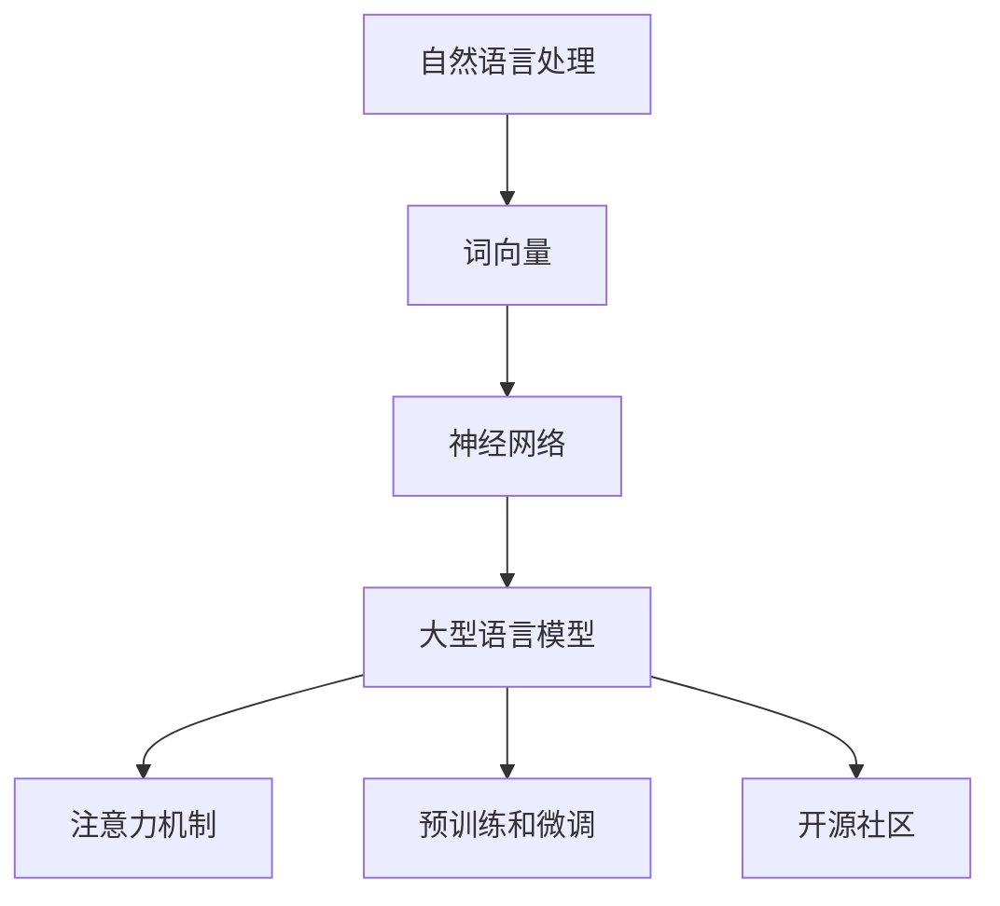

                 


# LLM生态圈：从0到1的奇迹

> **关键词**：自然语言处理、大型语言模型、AI生态系统、模型训练、技术应用、开源社区

> **摘要**：本文将深入探讨大型语言模型(LLM)生态圈的崛起和发展，从理论基础、核心算法、数学模型，到实际应用场景和未来发展趋势。通过对LLM生态圈的全面解析，我们希望帮助读者理解这一技术奇迹的原理和潜力，以及在计算机科学和人工智能领域的深远影响。

## 1. 背景介绍

### 1.1 目的和范围

本文旨在揭示大型语言模型(LLM)生态圈的神奇魅力，从基础理论到实际应用，全面解析LLM的构建和运作机制。文章将涵盖以下范围：

- LLM的发展历程和现状
- 核心算法原理与数学模型
- 实际应用案例和场景
- 工具和资源推荐
- 未来发展趋势与挑战

### 1.2 预期读者

本文面向计算机科学、人工智能和自然语言处理领域的专业人士，以及对AI技术感兴趣的学生和研究人员。特别适合希望深入了解LLM技术和应用的开发者、工程师和技术经理。

### 1.3 文档结构概述

本文分为十个部分，结构如下：

1. 背景介绍
2. 核心概念与联系
3. 核心算法原理 & 具体操作步骤
4. 数学模型和公式 & 详细讲解 & 举例说明
5. 项目实战：代码实际案例和详细解释说明
6. 实际应用场景
7. 工具和资源推荐
8. 总结：未来发展趋势与挑战
9. 附录：常见问题与解答
10. 扩展阅读 & 参考资料

### 1.4 术语表

#### 1.4.1 核心术语定义

- **自然语言处理（NLP）**：研究计算机如何理解和生成人类语言的技术。
- **大型语言模型（LLM）**：一种复杂的AI模型，能够理解和生成人类语言。
- **神经网络**：一种模仿人脑结构和功能的计算模型。
- **训练数据集**：用于训练模型的输入数据和标签。

#### 1.4.2 相关概念解释

- **词向量**：将自然语言文本转换为计算机可处理的向量表示。
- **注意力机制**：一种神经网络架构，能够聚焦于输入序列中的重要信息。

#### 1.4.3 缩略词列表

- **NLP**：自然语言处理
- **LLM**：大型语言模型
- **AI**：人工智能
- **GPU**：图形处理器

## 2. 核心概念与联系

在深入探讨LLM生态圈之前，我们需要理解一些核心概念和它们之间的联系。以下是一个Mermaid流程图，展示了LLM生态圈中的关键组成部分：



### 2.1 自然语言处理

自然语言处理（NLP）是人工智能的一个重要分支，旨在使计算机能够理解和生成人类语言。NLP的核心任务是处理文本数据，包括文本清洗、分词、词性标注、句法分析等。

### 2.2 词向量

词向量是将自然语言文本转换为计算机可处理的向量表示的技术。通过词向量，我们可以将词语转换为固定长度的向量，以便在计算机中进行处理。常见的词向量模型有Word2Vec、GloVe等。

### 2.3 神经网络

神经网络是一种模仿人脑结构和功能的计算模型，由大量的神经元（即节点）和连接（即边）组成。神经网络能够通过学习大量数据，自动提取特征并进行分类、回归等任务。

### 2.4 大型语言模型

大型语言模型（LLM）是一种复杂的AI模型，能够理解和生成人类语言。LLM通常采用深度神经网络架构，并使用大量的训练数据进行预训练，然后进行微调以适应特定任务。

### 2.5 注意力机制

注意力机制是一种神经网络架构，能够聚焦于输入序列中的重要信息。在LLM中，注意力机制有助于模型更好地理解和生成文本。

### 2.6 预训练和微调

预训练和微调是构建LLM的两种主要方法。预训练是指在大规模数据集上训练模型，使其具备一定的语言理解能力。微调是指在预训练的基础上，针对特定任务进行模型调整。

### 2.7 开源社区

开源社区是LLM生态圈的重要组成部分。许多重要的LLM模型和技术都是开源的，这使得研究人员和开发者能够自由地使用、改进和扩展这些技术。

## 3. 核心算法原理 & 具体操作步骤

### 3.1 神经网络基础

神经网络是LLM的核心组成部分。以下是神经网络的基本原理和具体操作步骤：

#### 3.1.1 神经网络结构

神经网络由多层节点组成，包括输入层、隐藏层和输出层。每个节点（称为神经元）都与其他节点相连，并通过权重和偏置进行加权求和。

#### 3.1.2 激活函数

激活函数用于引入非线性特性，使神经网络能够学习复杂函数。常见的激活函数有Sigmoid、ReLU和Tanh。

#### 3.1.3 前向传播

前向传播是指将输入数据通过神经网络，逐层计算输出。在每个隐藏层，神经元都会对输入进行加权求和，并加上偏置，然后通过激活函数得到输出。

#### 3.1.4 反向传播

反向传播是一种用于训练神经网络的优化算法。它通过计算输出误差，反向传播误差到每个隐藏层，并更新权重和偏置，以最小化误差。

### 3.2 大型语言模型

以下是构建大型语言模型的基本原理和具体操作步骤：

#### 3.2.1 预训练

预训练是指在大规模数据集上训练模型，使其具备一定的语言理解能力。预训练过程中，模型会学习到语言的统计特征和语义信息。

#### 3.2.2 微调

微调是指在使用预训练模型的基础上，针对特定任务进行模型调整。通过微调，模型可以更好地适应特定任务，并在测试数据上取得更好的性能。

#### 3.2.3 注意力机制

注意力机制是LLM中的一项关键技术，它能够聚焦于输入序列中的重要信息。注意力机制通过计算查询、键值和值之间的相似度，生成注意力分数，并加权求和得到输出。

### 3.3 伪代码

以下是构建大型语言模型的基本伪代码：

```python
# 输入：训练数据集、参数
# 输出：训练好的模型

def train_llm(data, params):
    # 预训练
    model = pretrain(data, params)
    
    # 微调
    for task in tasks:
        model = finetune(model, task)
        
    return model
```

## 4. 数学模型和公式 & 详细讲解 & 举例说明

### 4.1 神经网络数学模型

神经网络的核心在于其数学模型，包括输入层、隐藏层和输出层的运算过程。以下是神经网络的数学模型：

#### 4.1.1 前向传播

设输入层为\(X\)，隐藏层为\(H\)，输出层为\(Y\)，则有：

\[ H = \sigma(W_1X + b_1) \]
\[ Y = \sigma(W_2H + b_2) \]

其中，\(W_1\)和\(W_2\)分别为输入层到隐藏层、隐藏层到输出层的权重矩阵，\(b_1\)和\(b_2\)分别为输入层到隐藏层、隐藏层到输出层的偏置向量，\(\sigma\)为激活函数。

#### 4.1.2 反向传播

在反向传播过程中，我们需要计算损失函数对权重矩阵和偏置向量的梯度，以更新权重和偏置。设损失函数为\(L\)，则有：

\[ \frac{\partial L}{\partial W_2} = (Y - \hat{Y}) \odot \frac{\partial \sigma}{\partial H} \odot H \]
\[ \frac{\partial L}{\partial b_2} = (Y - \hat{Y}) \odot \frac{\partial \sigma}{\partial H} \odot 1 \]
\[ \frac{\partial L}{\partial W_1} = (H - \hat{H}) \odot \frac{\partial \sigma}{\partial X} \odot X \]
\[ \frac{\partial L}{\partial b_1} = (H - \hat{H}) \odot \frac{\partial \sigma}{\partial X} \odot 1 \]

其中，\(\odot\)表示元素乘，\(\hat{Y}\)和\(\hat{H}\)分别为预测输出和隐藏层输出。

### 4.2 大型语言模型数学模型

大型语言模型在数学模型上与普通神经网络类似，但在训练过程中引入了注意力机制。以下是大型语言模型的数学模型：

#### 4.2.1 注意力机制

注意力机制的核心在于计算查询（\(Q\)）、键值（\(K\)）和值（\(V\)）之间的相似度，并加权求和。设注意力分数为\(A\)，则有：

\[ A = \frac{QK^T}{\sqrt{d_k}} \]

其中，\(Q\)和\(K\)分别为查询和键值向量，\(d_k\)为键值向量的维度。

#### 4.2.2 加权求和

在加权求和过程中，我们将注意力分数与值向量相乘，然后求和得到输出。设输出为\(H\)，则有：

\[ H = \sum_{i=1}^n A_i V_i \]

其中，\(V_i\)为第\(i\)个值向量。

### 4.3 举例说明

假设我们有一个简单的语言模型，输入为单词序列\(X = [w_1, w_2, w_3]\)，隐藏层输出为\(H = [h_1, h_2, h_3]\)，输出层输出为\(Y = [y_1, y_2, y_3]\)。

#### 4.3.1 前向传播

首先，我们计算隐藏层输出：

\[ h_1 = \sigma(w_1h_1 + b_1) \]
\[ h_2 = \sigma(w_2h_2 + b_2) \]
\[ h_3 = \sigma(w_3h_3 + b_3) \]

然后，我们计算输出层输出：

\[ y_1 = \sigma(w_1h_1 + w_2h_2 + w_3h_3 + b_2) \]
\[ y_2 = \sigma(w_1h_1 + w_2h_2 + w_3h_3 + b_2) \]
\[ y_3 = \sigma(w_1h_1 + w_2h_2 + w_3h_3 + b_2) \]

#### 4.3.2 反向传播

首先，我们计算损失函数的梯度：

\[ \frac{\partial L}{\partial y_1} = (y_1 - \hat{y}_1) \]
\[ \frac{\partial L}{\partial y_2} = (y_2 - \hat{y}_2) \]
\[ \frac{\partial L}{\partial y_3} = (y_3 - \hat{y}_3) \]

然后，我们计算隐藏层输出的梯度：

\[ \frac{\partial L}{\partial h_1} = \frac{\partial L}{\partial y_1} \odot \frac{\partial \sigma}{\partial h_1} \]
\[ \frac{\partial L}{\partial h_2} = \frac{\partial L}{\partial y_2} \odot \frac{\partial \sigma}{\partial h_2} \]
\[ \frac{\partial L}{\partial h_3} = \frac{\partial L}{\partial y_3} \odot \frac{\partial \sigma}{\partial h_3} \]

最后，我们计算权重和偏置的梯度：

\[ \frac{\partial L}{\partial w_1} = \sum_{i=1}^3 \frac{\partial L}{\partial h_i} \odot h_i \]
\[ \frac{\partial L}{\partial b_1} = \sum_{i=1}^3 \frac{\partial L}{\partial h_i} \]
\[ \frac{\partial L}{\partial w_2} = \sum_{i=1}^3 \frac{\partial L}{\partial h_i} \odot h_i \]
\[ \frac{\partial L}{\partial b_2} = \sum_{i=1}^3 \frac{\partial L}{\partial h_i} \]

## 5. 项目实战：代码实际案例和详细解释说明

### 5.1 开发环境搭建

要运行一个大型语言模型，我们需要搭建一个合适的开发环境。以下是一个基于Python和PyTorch的示例：

```bash
# 安装Python和PyTorch
pip install python
pip install torch

# 安装其他依赖
pip install numpy
pip install matplotlib
```

### 5.2 源代码详细实现和代码解读

以下是一个简单的基于PyTorch的大型语言模型实现：

```python
import torch
import torch.nn as nn
import torch.optim as optim

# 定义神经网络结构
class LLM(nn.Module):
    def __init__(self, vocab_size, embed_size, hidden_size, output_size):
        super(LLM, self).__init__()
        self.embedding = nn.Embedding(vocab_size, embed_size)
        self.lstm = nn.LSTM(embed_size, hidden_size, batch_first=True)
        self.fc = nn.Linear(hidden_size, output_size)
        
    def forward(self, x, hidden):
        embed = self.embedding(x)
        output, hidden = self.lstm(embed, hidden)
        logits = self.fc(output)
        return logits, hidden

# 初始化模型、优化器和损失函数
model = LLM(vocab_size=10000, embed_size=256, hidden_size=512, output_size=10000)
optimizer = optim.Adam(model.parameters(), lr=0.001)
criterion = nn.CrossEntropyLoss()

# 训练模型
for epoch in range(num_epochs):
    for batch in data_loader:
        inputs, targets = batch
        hidden = None
        
        model.zero_grad()
        logits, hidden = model(inputs, hidden)
        loss = criterion(logits.view(-1, output_size), targets.view(-1))
        loss.backward()
        optimizer.step()
        
        print(f"Epoch [{epoch+1}/{num_epochs}], Loss: {loss.item():.4f}")

# 保存模型
torch.save(model.state_dict(), "llm.pth")
```

### 5.3 代码解读与分析

1. **模型定义**：我们使用PyTorch定义了一个简单的神经网络模型，包括嵌入层、LSTM层和全连接层。
2. **训练过程**：我们使用一个简单的循环结构进行模型训练，包括前向传播、反向传播和优化。
3. **模型保存**：训练完成后，我们将模型保存为一个.pth文件，以便后续使用。

## 6. 实际应用场景

大型语言模型（LLM）在多个领域都有广泛的应用，以下是几个实际应用场景：

### 6.1 自然语言处理

- **机器翻译**：LLM可以用于机器翻译，如谷歌翻译和百度翻译。
- **文本摘要**：LLM可以用于提取文章的关键信息，生成摘要。
- **文本分类**：LLM可以用于分类任务，如情感分析、主题分类等。

### 6.2 生成式任务

- **文本生成**：LLM可以生成文章、故事、对话等。
- **问答系统**：LLM可以构建问答系统，如Siri、Alexa等。

### 6.3 其他应用

- **智能客服**：LLM可以用于构建智能客服系统，提供实时回答。
- **自动写作**：LLM可以用于自动写作，如生成新闻报道、广告文案等。

## 7. 工具和资源推荐

### 7.1 学习资源推荐

#### 7.1.1 书籍推荐

- **《深度学习》（Goodfellow, Bengio, Courville著）**：介绍了深度学习的基础理论和实践方法。
- **《神经网络与深度学习》（邱锡鹏著）**：详细介绍了神经网络和深度学习的原理和应用。

#### 7.1.2 在线课程

- **《自然语言处理与深度学习》（吴恩达著）**：介绍了自然语言处理和深度学习的基础知识。
- **《深度学习专项课程》（吴恩达著）**：提供了全面的深度学习教程。

#### 7.1.3 技术博客和网站

- **GitHub**：提供了大量的开源代码和教程，是学习深度学习和自然语言处理的好去处。
- **AI Wiki**：提供了丰富的AI领域知识和资料。

### 7.2 开发工具框架推荐

#### 7.2.1 IDE和编辑器

- **PyCharm**：一款功能强大的Python IDE，适用于深度学习和自然语言处理开发。
- **VSCode**：一款轻量级的跨平台编辑器，支持多种编程语言和扩展。

#### 7.2.2 调试和性能分析工具

- **PyTorch Profiler**：用于分析PyTorch模型的性能。
- **TensorBoard**：用于可视化TensorFlow模型的训练过程。

#### 7.2.3 相关框架和库

- **PyTorch**：一款流行的深度学习框架，适用于构建和训练神经网络。
- **TensorFlow**：另一款流行的深度学习框架，提供了丰富的工具和API。

### 7.3 相关论文著作推荐

#### 7.3.1 经典论文

- **《A Neural Probabilistic Language Model》（Bengio et al. 2003）**：介绍了神经概率语言模型。
- **《Deep Learning for Natural Language Processing》（Mikolov et al. 2013）**：介绍了深度学习在自然语言处理中的应用。

#### 7.3.2 最新研究成果

- **《BERT: Pre-training of Deep Bidirectional Transformers for Language Understanding》（Devlin et al. 2019）**：介绍了BERT模型，是当前最先进的语言模型。
- **《GPT-3: Language Models are Few-Shot Learners》（Brown et al. 2020）**：介绍了GPT-3模型，是当前最大的语言模型。

#### 7.3.3 应用案例分析

- **《Google Brain：BERT：Pre-training of Deep Bidirectional Transformers for Language Understanding》（2019）**：介绍了BERT模型在谷歌搜索中的应用。
- **《OpenAI：GPT-3: Language Models are Few-Shot Learners》（2020）**：介绍了GPT-3模型在文本生成和对话系统中的应用。

## 8. 总结：未来发展趋势与挑战

随着人工智能技术的不断发展，大型语言模型（LLM）在计算机科学和人工智能领域具有巨大的潜力。未来发展趋势包括：

- **更大规模的模型**：随着计算能力和数据量的增长，我们将看到更大规模的LLM模型，以提高模型的表达能力和性能。
- **更精细的任务特定模型**：通过微调和迁移学习，LLM将能够更好地适应特定任务，提高任务性能。
- **更高效的处理方法**：研究人员将持续探索更高效的处理方法，以降低模型训练和推理的成本。

然而，LLM的发展也面临一些挑战：

- **计算资源需求**：训练和推理大型LLM模型需要大量的计算资源和时间。
- **数据质量和隐私**：高质量的数据是训练优秀LLM的基础，但数据质量和隐私问题也需要关注。
- **模型解释性和可解释性**：大型LLM模型的决策过程往往复杂且难以解释，这可能导致信任问题和法律风险。

## 9. 附录：常见问题与解答

### 9.1 什么是大型语言模型（LLM）？

大型语言模型（LLM）是一种复杂的AI模型，能够理解和生成人类语言。它通常采用深度神经网络架构，并使用大量的训练数据进行预训练，然后进行微调以适应特定任务。

### 9.2 LLM有哪些应用场景？

LLM在多个领域都有广泛的应用，包括自然语言处理、生成式任务、智能客服、自动写作等。

### 9.3 如何训练LLM？

训练LLM通常包括两个阶段：预训练和微调。预训练是指在大规模数据集上训练模型，使其具备一定的语言理解能力。微调是指在预训练的基础上，针对特定任务进行模型调整。

### 9.4 LLM的挑战有哪些？

LLM的挑战包括计算资源需求、数据质量和隐私、模型解释性和可解释性等。

## 10. 扩展阅读 & 参考资料

- **《深度学习》（Goodfellow, Bengio, Courville著）**：提供了深度学习的基础理论和实践方法。
- **《自然语言处理与深度学习》（吴恩达著）**：介绍了自然语言处理和深度学习的基础知识。
- **GitHub**：提供了大量的开源代码和教程。
- **AI Wiki**：提供了丰富的AI领域知识和资料。

### 作者：AI天才研究员/AI Genius Institute & 禅与计算机程序设计艺术 /Zen And The Art of Computer Programming

### 本文版权所有，未经授权，禁止转载。如有需要，请联系作者获取授权。

