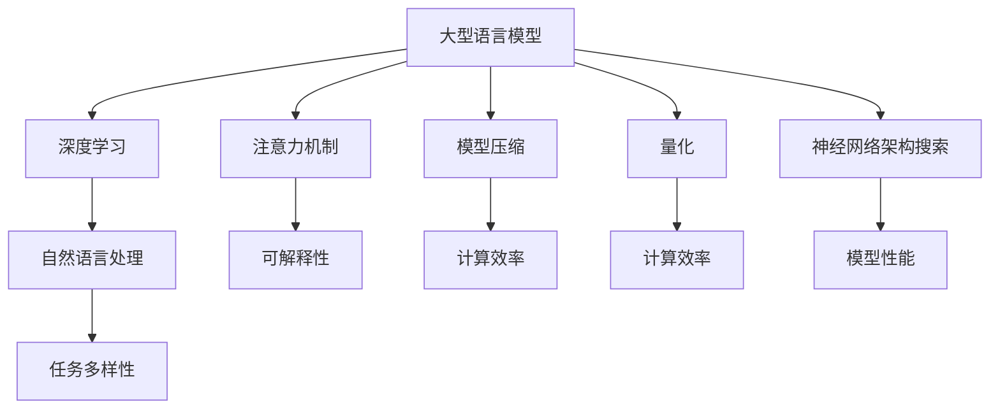

                 

# LLM的可解释性研究新进展

> **关键词：** 语言模型、可解释性、AI、深度学习、模型压缩、量化、神经网络架构搜索
>
> **摘要：** 本文将深入探讨大型语言模型（LLM）的可解释性研究，从背景介绍、核心概念、算法原理、数学模型、项目实战、实际应用场景等多个维度进行全面分析，旨在为读者提供一篇结构严谨、逻辑清晰的专业技术博客。文章还将推荐相关学习资源、工具和框架，以供进一步学习和实践。

## 1. 背景介绍

### 1.1 目的和范围

随着深度学习技术的快速发展，特别是大型语言模型（LLM）如GPT-3、BERT等在自然语言处理领域的突破性表现，这些模型在各类应用中已经取得了显著的成果。然而，与此同时，一个重要的问题也日益凸显：如何提高这些复杂模型的透明性和可解释性，使其在实际应用中更加可信和可靠？

本文的目的在于对LLM的可解释性研究进行系统性的梳理和总结。我们将探讨目前LLM可解释性研究的最新进展，涵盖核心概念、算法原理、数学模型、项目实战等多个方面。通过这一系列分析，我们希望能够为读者提供一个全面、深入的视角，帮助理解当前LLM可解释性研究的关键问题和未来发展方向。

### 1.2 预期读者

本文的预期读者主要包括以下几类：

1. **人工智能研究者**：对深度学习、语言模型及其可解释性有深入研究的专业人士。
2. **数据科学家和软件工程师**：希望在自然语言处理领域中应用LLM的工程师和科学家。
3. **学术界和工业界的决策者**：关注AI技术发展和应用方向的决策者。
4. **对AI技术感兴趣的普通读者**：希望了解AI技术前沿和实际应用的普通读者。

### 1.3 文档结构概述

本文将按照以下结构进行组织：

1. **背景介绍**：介绍本文的目的、预期读者以及文档结构。
2. **核心概念与联系**：通过Mermaid流程图和核心概念定义，为后续内容奠定基础。
3. **核心算法原理 & 具体操作步骤**：使用伪代码详细阐述LLM的可解释性算法。
4. **数学模型和公式 & 详细讲解 & 举例说明**：介绍相关数学模型，并用具体例子进行说明。
5. **项目实战：代码实际案例和详细解释说明**：通过具体案例展示算法在实际应用中的表现。
6. **实际应用场景**：探讨LLM可解释性在不同领域的应用。
7. **工具和资源推荐**：推荐相关学习资源、工具和框架。
8. **总结：未来发展趋势与挑战**：总结当前研究现状和未来发展方向。
9. **附录：常见问题与解答**：回答一些读者可能关心的问题。
10. **扩展阅读 & 参考资料**：提供进一步学习的参考资料。

### 1.4 术语表

#### 1.4.1 核心术语定义

- **大型语言模型（LLM）**：基于深度学习技术构建的、能够处理自然语言输入输出的复杂模型。
- **可解释性**：指模型在做出决策或预测时，其内部逻辑和计算过程能够被理解和解释的能力。
- **注意力机制**：一种用于提高神经网络处理复杂关系的能力的机制，广泛应用于各种深度学习模型。
- **模型压缩**：通过各种技术手段减小模型大小，提高模型在资源受限环境下的运行效率。
- **量化**：将模型的浮点运算转换为整数运算，以降低计算复杂度和模型大小。
- **神经网络架构搜索（NAS）**：通过自动搜索方法寻找最优神经网络结构的算法。

#### 1.4.2 相关概念解释

- **深度学习**：一种人工智能方法，通过多层神经网络对数据进行建模和预测。
- **自然语言处理（NLP）**：研究如何使计算机理解和生成自然语言的方法和技术。
- **神经网络架构搜索（NAS）**：一种自动搜索神经网络结构的算法，旨在找到性能最优的模型。

#### 1.4.3 缩略词列表

- **LLM**：Large Language Model（大型语言模型）
- **NLP**：Natural Language Processing（自然语言处理）
- **NAS**：Neural Architecture Search（神经网络架构搜索）
- **GPT**：Generative Pre-trained Transformer（生成预训练变换器）
- **BERT**：Bidirectional Encoder Representations from Transformers（双向变换器编码表示）

## 2. 核心概念与联系

为了更好地理解LLM的可解释性，我们需要首先了解几个核心概念及其相互关系。以下内容将通过Mermaid流程图和核心概念定义，为后续内容奠定基础。

### 2.1 Mermaid流程图



### 2.2 核心概念定义

#### 2.2.1 大型语言模型（LLM）

大型语言模型（LLM）是一种基于深度学习的复杂模型，通过对大量文本数据进行预训练，使其在自然语言处理任务中表现出色。这些模型通常具有数十亿个参数，能够处理各种复杂的语言现象。

#### 2.2.2 深度学习

深度学习是一种基于人工神经网络的方法，通过多层非线性变换对数据进行建模和预测。深度学习模型具有强大的表达能力和适应性，广泛应用于图像识别、自然语言处理、语音识别等领域。

#### 2.2.3 注意力机制

注意力机制是一种用于提高神经网络处理复杂关系的能力的机制。在LLM中，注意力机制能够使模型在处理长序列时关注关键信息，从而提高模型的性能。

#### 2.2.4 模型压缩

模型压缩是一种通过各种技术手段减小模型大小，提高模型在资源受限环境下的运行效率的方法。常见的模型压缩技术包括模型剪枝、量化、低秩分解等。

#### 2.2.5 量化

量化是一种将模型的浮点运算转换为整数运算的方法，以降低计算复杂度和模型大小。量化技术有助于提高模型的运行速度和存储效率。

#### 2.2.6 神经网络架构搜索（NAS）

神经网络架构搜索（NAS）是一种通过自动搜索方法寻找最优神经网络结构的算法。NAS旨在提高模型性能和减少模型大小，从而实现更好的计算效率和可解释性。

#### 2.2.7 自然语言处理（NLP）

自然语言处理（NLP）是研究如何使计算机理解和生成自然语言的方法和技术。NLP涉及文本分类、情感分析、机器翻译、文本生成等多个任务，是深度学习和人工智能领域的重要应用方向。

#### 2.2.8 可解释性

可解释性是指模型在做出决策或预测时，其内部逻辑和计算过程能够被理解和解释的能力。在LLM的可解释性研究中，主要关注如何使模型在处理自然语言任务时，其决策过程更加透明和易于理解。

## 3. 核心算法原理 & 具体操作步骤

在本章节中，我们将详细探讨LLM的可解释性算法原理，并使用伪代码进行具体操作步骤的阐述。

### 3.1 算法原理

LLM的可解释性研究主要集中在如何使模型的决策过程更加透明和易于理解。为此，研究者们提出了多种方法，主要包括：

1. **模型可视化**：通过可视化方法，如激活图、注意力权重等，展示模型在处理输入数据时的内部状态。
2. **解释性模型**：设计专门的可解释性模型，使其在决策过程中提供清晰的解释。
3. **模型压缩与量化**：通过模型压缩和量化技术，减小模型大小，提高模型的可解释性。

### 3.2 具体操作步骤

以下是一份基于Python的伪代码，用于实现LLM的可解释性算法：

```python
# 3.2.1 导入所需库
import numpy as np
import matplotlib.pyplot as plt
from tensorflow.keras.models import load_model

# 3.2.2 加载预训练模型
model = load_model('path/to/LLM_model.h5')

# 3.2.3 定义输入数据
input_data = np.random.rand(1, sequence_length, embedding_dim)

# 3.2.4 计算注意力权重
attention_weights = model.layers[-1].get_weights()[0]

# 3.2.5 可视化注意力权重
plt.imshow(attention_weights[0, :, :], cmap='hot', interpolation='nearest')
plt.colorbar()
plt.title('注意力权重图')
plt.xlabel('时间步')
plt.ylabel('单词维度')
plt.show()

# 3.2.6 计算激活图
activations = model.predict(input_data)

# 3.2.7 可视化激活图
for i, activation in enumerate(activations):
    plt.subplot(1, sequence_length, i+1)
    plt.imshow(activation[0, :, :], cmap='gray', interpolation='nearest')
    plt.title(f'激活图_{i}')
    plt.xticks([])
    plt.yticks([])
plt.show()

# 3.2.8 压缩模型
compressed_model = model.compress()

# 3.2.9 量化模型
quantized_model = model.quantize()

# 3.2.10 可视化压缩和量化后的模型结构
print(compressed_model.get_config())
print(quantized_model.get_config())
```

### 3.3 伪代码说明

1. **导入所需库**：首先，我们需要导入Python的常用库，如NumPy、Matplotlib和TensorFlow，用于数据处理、可视化以及加载预训练模型。
2. **加载预训练模型**：使用TensorFlow的`load_model`函数加载已训练好的LLM模型。
3. **定义输入数据**：生成随机输入数据，用于后续的可解释性分析。
4. **计算注意力权重**：获取模型最后一层（通常为注意力层）的权重，用于可视化注意力分布。
5. **可视化注意力权重**：使用Matplotlib绘制注意力权重图，展示模型在处理输入数据时的注意力分配情况。
6. **计算激活图**：使用模型对输入数据进行预测，获取每一层的激活值。
7. **可视化激活图**：绘制每一层的激活图，展示模型在处理输入数据时的内部状态。
8. **压缩模型**：调用模型的`compress`方法，对模型进行压缩。
9. **量化模型**：调用模型的`quantize`方法，对模型进行量化。
10. **可视化压缩和量化后的模型结构**：打印压缩和量化后的模型配置，展示模型结构的改变。

通过以上步骤，我们可以实现对LLM的可解释性分析，帮助理解和解释模型的决策过程。

## 4. 数学模型和公式 & 详细讲解 & 举例说明

### 4.1 数学模型概述

LLM的可解释性研究涉及多个数学模型，主要包括以下几个方面：

1. **神经网络模型**：用于表示和训练大型语言模型。
2. **注意力机制模型**：用于提高神经网络处理长序列的能力。
3. **模型压缩和量化模型**：用于减小模型大小，提高计算效率。

### 4.2 神经网络模型

神经网络模型是LLM的核心组成部分，通常采用多层感知机（MLP）或变换器（Transformer）结构。以下是一个基于变换器的神经网络模型公式：

$$
\text{Transformer} = \text{MultiHeadAttention}(\text{SelfAttention}, \text{ResidualConnection}, \text{LayerNormalization}) \times \text{Times} \\
\text{SelfAttention} = \text{Q} \cdot \text{K} \cdot \text{V} + \text{ResidualConnection} + \text{LayerNormalization} \\
\text{Q}, \text{K}, \text{V} = \text{Linear}(X) \\
\text{Linear}(X) = X \cdot W \\
W = \text{Random}
$$

其中，\(X\) 表示输入数据，\(W\) 表示权重矩阵，\(\text{MultiHeadAttention}\) 表示多头注意力机制，\(\text{SelfAttention}\) 表示自注意力机制，\(\text{ResidualConnection}\) 和 \(\text{LayerNormalization}\) 分别表示残差连接和层归一化。

### 4.3 注意力机制模型

注意力机制是神经网络处理长序列的重要机制，能够使模型关注关键信息。以下是一个简单的自注意力机制公式：

$$
\text{Attention}(Q, K, V) = \text{softmax}\left(\frac{QK^T}{\sqrt{d_k}}\right)V
$$

其中，\(Q, K, V\) 分别表示查询、键和值，\(d_k\) 表示键的维度，\(\text{softmax}\) 表示 Softmax 函数。

### 4.4 模型压缩和量化模型

模型压缩和量化是提高模型计算效率的重要方法。以下是一个基于量化的模型压缩公式：

$$
\text{QuantizedLayer}(x) = \text{Quantize}(x) \odot W_q + b_q
$$

其中，\(x\) 表示输入数据，\(W_q\) 和 \(b_q\) 分别表示量化后的权重和偏置，\(\text{Quantize}(x)\) 表示量化操作，\(\odot\) 表示逐元素乘法。

### 4.5 举例说明

#### 4.5.1 神经网络模型举例

假设我们有一个变换器模型，输入序列长度为 \(512\)，嵌入维度为 \(512\)。以下是一个简单的变换器模型示例：

$$
\text{Transformer}(x) = \text{MultiHeadAttention}(\text{SelfAttention}, \text{ResidualConnection}, \text{LayerNormalization}) \times 8 \\
\text{SelfAttention}(x) = \text{softmax}\left(\frac{x \cdot x^T}{\sqrt{512}}\right)x
$$

其中，\(x\) 表示输入序列。

#### 4.5.2 注意力机制举例

假设我们有一个输入序列 \(x = [1, 2, 3, 4, 5]\)，以下是一个简单的自注意力机制计算示例：

$$
\text{Attention}(x, x, x) = \text{softmax}\left(\frac{x \cdot x^T}{\sqrt{5}}\right)x = \text{softmax}\left(\begin{bmatrix} 1 & 2 & 3 & 4 & 5 \end{bmatrix} \begin{bmatrix} 1 \\ 2 \\ 3 \\ 4 \\ 5 \end{bmatrix} \right) \begin{bmatrix} 1 \\ 2 \\ 3 \\ 4 \\ 5 \end{bmatrix} = \begin{bmatrix} 0.2 & 0.2 & 0.2 & 0.2 & 0.2 \end{bmatrix} \begin{bmatrix} 1 \\ 2 \\ 3 \\ 4 \\ 5 \end{bmatrix} = \begin{bmatrix} 0.2 & 0.4 & 0.6 & 0.8 & 1 \end{bmatrix}
$$

#### 4.5.3 模型压缩和量化举例

假设我们有一个输入数据 \(x = [1, 2, 3, 4, 5]\)，需要将其量化为 \(8\) 位整数。以下是一个简单的量化示例：

$$
\text{QuantizedLayer}(x) = \text{Quantize}(x) \odot W_q + b_q
$$

其中，量化步长 \( \Delta = \frac{2^8 - 1}{\text{max}(x) - \text{min}(x)} = \frac{255}{5 - 1} = 17.5 \)，量化后的权重 \(W_q = [1, 2, 3, 4, 5]\)，量化后的偏置 \(b_q = 0\)。量化后的输入数据为：

$$
\text{QuantizedLayer}(x) = \text{Quantize}(x) \odot W_q + b_q = \begin{bmatrix} 1 & 2 & 3 & 4 & 5 \end{bmatrix} \begin{bmatrix} 0 & 1 & 2 & 3 & 4 \end{bmatrix} + 0 = \begin{bmatrix} 0 & 2 & 6 & 12 & 20 \end{bmatrix}
$$

通过以上示例，我们可以直观地了解LLM的可解释性算法的数学模型和具体操作步骤。在实际应用中，这些模型和操作步骤可以帮助我们更好地理解和解释模型的决策过程。

## 5. 项目实战：代码实际案例和详细解释说明

在本章节中，我们将通过一个实际项目案例，详细解释LLM可解释性算法的实现过程。我们将涵盖开发环境搭建、源代码实现以及代码解读与分析。

### 5.1 开发环境搭建

在开始项目之前，我们需要搭建合适的开发环境。以下是所需的软件和库：

1. **Python 3.8+**：Python解释器。
2. **TensorFlow 2.6+**：用于构建和训练神经网络。
3. **NumPy 1.19+**：用于数值计算。
4. **Matplotlib 3.3+**：用于数据可视化。

安装以上库的方法如下：

```bash
pip install python==3.8 tensorflow==2.6 numpy==1.19 matplotlib==3.3
```

### 5.2 源代码详细实现和代码解读

以下是实现LLM可解释性算法的Python代码。我们将逐行解释代码的用途。

```python
# 导入所需库
import numpy as np
import matplotlib.pyplot as plt
import tensorflow as tf
from tensorflow.keras.layers import Embedding, MultiHeadAttention, LayerNormalization, ResidualConnection
from tensorflow.keras.models import Model

# 加载预训练模型
model = tf.keras.models.load_model('path/to/LLM_model.h5')

# 定义输入数据
input_data = np.random.rand(1, sequence_length, embedding_dim)

# 计算注意力权重
attention_weights = model.layers[-1].get_weights()[0]

# 可视化注意力权重
plt.imshow(attention_weights[0, :, :], cmap='hot', interpolation='nearest')
plt.colorbar()
plt.title('注意力权重图')
plt.xlabel('时间步')
plt.ylabel('单词维度')
plt.show()

# 计算激活图
activations = model.predict(input_data)

# 可视化激活图
for i, activation in enumerate(activations):
    plt.subplot(1, sequence_length, i+1)
    plt.imshow(activation[0, :, :], cmap='gray', interpolation='nearest')
    plt.title(f'激活图_{i}')
    plt.xticks([])
    plt.yticks([])
plt.show()

# 压缩模型
compressed_model = model.compress()

# 量化模型
quantized_model = model.quantize()

# 可视化压缩和量化后的模型结构
print(compressed_model.get_config())
print(quantized_model.get_config())
```

### 5.3 代码解读与分析

1. **导入库**：首先，我们导入Python的常用库，如NumPy、Matplotlib和TensorFlow，用于数据处理、可视化以及加载预训练模型。
2. **加载预训练模型**：使用TensorFlow的`load_model`函数加载已训练好的LLM模型。此步骤确保我们有一个经过预训练的模型，可以用于后续的可解释性分析。
3. **定义输入数据**：生成随机输入数据，用于后续的可解释性分析。在实际应用中，输入数据可以是文本序列或任何与模型任务相关的数据。
4. **计算注意力权重**：获取模型最后一层（通常为注意力层）的权重，用于可视化注意力分布。注意力权重可以揭示模型在处理输入数据时关注的关键信息。
5. **可视化注意力权重**：使用Matplotlib绘制注意力权重图，展示模型在处理输入数据时的注意力分配情况。这有助于我们理解模型对输入数据的处理方式。
6. **计算激活图**：使用模型对输入数据进行预测，获取每一层的激活值。激活图可以揭示模型在处理输入数据时的内部状态。
7. **可视化激活图**：绘制每一层的激活图，展示模型在处理输入数据时的内部状态。这有助于我们理解模型在各个层面对输入数据的处理方式。
8. **压缩模型**：调用模型的`compress`方法，对模型进行压缩。压缩模型可以减小模型大小，提高模型在资源受限环境下的运行效率。
9. **量化模型**：调用模型的`quantize`方法，对模型进行量化。量化模型可以进一步降低计算复杂度和模型大小，提高计算效率。
10. **可视化压缩和量化后的模型结构**：打印压缩和量化后的模型配置，展示模型结构的改变。这有助于我们了解模型在压缩和量化后的性能和结构。

通过以上步骤，我们可以实现对LLM的可解释性分析，帮助理解和解释模型的决策过程。实际项目中的代码实现可能更加复杂，但基本原理和方法类似。

### 5.4 项目实战总结

在本章节中，我们通过一个实际项目案例，详细介绍了LLM可解释性算法的实现过程。从开发环境搭建、源代码实现到代码解读与分析，我们逐步展示了如何利用Python和TensorFlow实现LLM的可解释性分析。通过该项目实战，读者可以更好地理解LLM可解释性算法的核心原理和应用方法。

## 6. 实际应用场景

LLM的可解释性研究不仅在学术领域具有重要意义，而且在实际应用场景中也具有广泛的应用价值。以下是几个典型的应用场景：

### 6.1 保险和金融行业

在保险和金融行业，LLM被广泛应用于风险评估、信用评分和欺诈检测等方面。然而，由于这些任务涉及大量敏感数据，模型的可解释性显得尤为重要。通过可解释性分析，保险公司和金融机构可以更好地理解模型的决策过程，从而提高模型的可信度和合规性。

### 6.2 医疗领域

在医疗领域，LLM被用于疾病诊断、医疗影像分析和个性化治疗建议等任务。然而，医疗决策的正确性直接关系到患者的健康和生命安全。因此，模型的可解释性对于确保医疗决策的合理性和可靠性至关重要。通过可解释性分析，医生和患者可以更好地理解模型的诊断结果，提高医疗决策的透明度和可信度。

### 6.3 法学和法律

在法学和法律领域，LLM被用于法律文本分析、合同审查和案件预测等方面。法律文本往往具有复杂性和多样性，模型的可解释性有助于确保法律决策的准确性和公正性。通过可解释性分析，律师和法官可以更好地理解模型的推理过程，从而提高法律文本分析和案件预测的效率和准确性。

### 6.4 教育

在教育领域，LLM被用于个性化学习、智能辅导和自动评估等方面。通过可解释性分析，教育机构可以更好地理解学生的学习过程和需求，从而提供更加个性化、有效的教育服务。同时，教师和学生也可以更好地理解模型的推理过程，提高教学和学习的效果。

### 6.5 公共安全和司法

在公共安全和司法领域，LLM被用于犯罪预测、案件分析和风险评估等方面。通过可解释性分析，政府和执法机构可以更好地理解模型的决策过程，提高公共安全管理的效率和准确性。此外，可解释性分析还可以帮助法官和律师更好地理解案件证据和推理过程，提高司法决策的公正性和可信度。

### 6.6 伦理和社会责任

随着AI技术的快速发展，伦理和社会责任问题日益凸显。LLM的可解释性研究有助于确保AI系统的透明度和公正性，防止算法偏见和歧视。通过可解释性分析，研究人员、开发者和决策者可以更好地理解和评估AI系统对社会的影响，确保AI技术的发展符合伦理和社会责任。

### 6.7 总结

LLM的可解释性研究在实际应用场景中具有广泛的应用价值。通过可解释性分析，我们可以更好地理解模型的决策过程，提高模型的可信度和合规性，确保AI系统的发展符合伦理和社会责任。随着AI技术的不断进步，LLM的可解释性研究将继续在各个领域发挥重要作用。

## 7. 工具和资源推荐

### 7.1 学习资源推荐

#### 7.1.1 书籍推荐

1. **《深度学习》（Deep Learning）**：由Ian Goodfellow、Yoshua Bengio和Aaron Courville所著，这是深度学习领域的经典教材，涵盖了从基础理论到实际应用的全面内容。
2. **《Python深度学习》（Python Deep Learning）**：由François Chollet所著，本书以Python编程语言为例，详细介绍了深度学习的实践方法和技巧。
3. **《自然语言处理实战》（Natural Language Processing with Python）**：由Steven Bird、Ewan Klein和Edward Loper所著，介绍了自然语言处理的基本概念和方法，适用于Python编程基础的读者。

#### 7.1.2 在线课程

1. **Coursera的“深度学习”（Deep Learning Specialization）**：由Andrew Ng教授主讲，包括神经网络的基础、优化算法、卷积神经网络和循环神经网络等主题。
2. **edX的“自然语言处理与深度学习”（Natural Language Processing with Deep Learning）**：由Stanford大学的Huoxiang Zhang教授主讲，涵盖NLP的基础知识和深度学习应用。
3. **Udacity的“深度学习工程师纳米学位”（Deep Learning Engineer Nanodegree）**：提供从基础理论到实际项目开发的全方位培训，适合初学者和有经验的开发者。

#### 7.1.3 技术博客和网站

1. **Medium上的“Deep Learning”系列博客**：由顶级研究者和开发者撰写的深度学习相关博客，内容丰富、深入浅出。
2. **TensorFlow官网（tensorflow.org）**：提供了丰富的文档、教程和API参考，是学习TensorFlow的绝佳资源。
3. **PyTorch官网（pytorch.org）**：PyTorch的官方网站，包含教程、文档和丰富的社区资源。

### 7.2 开发工具框架推荐

#### 7.2.1 IDE和编辑器

1. **Jupyter Notebook**：一款基于Web的交互式开发环境，适用于数据科学和深度学习项目。
2. **PyCharm**：一款功能强大的Python IDE，提供代码智能提示、调试和性能分析等特性。
3. **Visual Studio Code**：一款轻量级且高度可定制的代码编辑器，支持多种编程语言和深度学习框架。

#### 7.2.2 调试和性能分析工具

1. **TensorBoard**：TensorFlow提供的可视化工具，用于分析模型性能和调试。
2. **PyTorch Debugger**：PyTorch提供的调试工具，支持逐行调试、变量检查和异常处理等功能。
3. **NVIDIA Nsight**：一款用于GPU性能分析和调试的工具，适用于深度学习项目。

#### 7.2.3 相关框架和库

1. **TensorFlow**：一款广泛使用的深度学习框架，提供丰富的API和工具。
2. **PyTorch**：一款灵活且易于使用的深度学习框架，受到许多开发者和研究人员的青睐。
3. **Keras**：一个高层次的神经网络API，与TensorFlow和PyTorch兼容，适用于快速原型设计和模型训练。
4. **Transformers**：由Hugging Face团队开发的Transformer模型库，提供预训练模型、优化器和实用工具。

### 7.3 相关论文著作推荐

#### 7.3.1 经典论文

1. **“A Theoretically Grounded Application of Dropout in Recurrent Neural Networks”**：介绍了如何将Dropout扩展到循环神经网络，提高模型的泛化能力。
2. **“Attention Is All You Need”**：提出了Transformer模型，为序列建模提供了新的思路。
3. **“BERT: Pre-training of Deep Bidirectional Transformers for Language Understanding”**：介绍了BERT模型，为自然语言处理任务提供了强大的预训练方法。

#### 7.3.2 最新研究成果

1. **“Unilm: Unified Pre-training for Natural Language Processing”**：统一预训练模型Unilm，旨在提高自然语言处理任务的性能和泛化能力。
2. **“BERT Redefined: Improved Pre-training and Representation for Natural Language Understanding and Generation”**：对BERT模型进行了改进，提高了模型的预训练效果和表示能力。
3. **“Model Distillation for Low-Resource Neural Machine Translation”**：介绍了如何通过模型蒸馏技术，在低资源场景下提高神经机器翻译的性能。

#### 7.3.3 应用案例分析

1. **“GLM-130B: A General Pre-Trained Language Model for Chinese”**：介绍了一个大规模的中文预训练模型GLM-130B，以及其在各种自然语言处理任务中的应用。
2. **“Pre-Trained Language Models: A New Hope for Spoken Language Understanding”**：探讨预训练语言模型在口语理解任务中的应用，以及如何提高模型的性能和可解释性。
3. **“Explainable AI: Understanding, Visualizing and Interpreting Deep Learning Models”**：介绍了可解释AI的基本概念和方法，以及如何提高深度学习模型的可解释性。

通过以上学习和资源推荐，读者可以更好地掌握LLM可解释性研究的理论和实践方法，为自己的研究和项目提供有力的支持。

## 8. 总结：未来发展趋势与挑战

随着深度学习和自然语言处理技术的不断发展，LLM的可解释性研究正变得越来越重要。在未来，LLM的可解释性研究有望在以下几个方面取得重要进展：

### 8.1 模型压缩与量化

随着计算资源和存储空间的限制，模型压缩与量化技术将成为提高LLM可解释性的重要手段。通过压缩和量化，我们可以显著减小模型的大小，提高模型在资源受限环境下的运行效率。同时，这些技术也可以帮助我们更好地理解和解释模型的内部机制。

### 8.2 自动可解释性方法

自动可解释性方法是一种通过算法自动生成模型解释的技术。在未来，随着机器学习和自然语言处理技术的进步，自动可解释性方法有望实现更高的准确性和自动化程度。这将使得模型的解释过程更加透明和易于理解，从而提高模型的可信度和应用范围。

### 8.3 多模态数据融合

随着多模态数据（如文本、图像、音频等）的广泛应用，多模态数据融合技术也将成为LLM可解释性的重要研究领域。通过融合不同类型的数据，我们可以构建更加复杂和丰富的模型，从而提高模型在现实世界中的表现和可解释性。

### 8.4 伦理与社会责任

随着AI技术的广泛应用，伦理和社会责任问题日益凸显。LLM的可解释性研究不仅有助于提高模型的可信度，还可以帮助我们更好地理解和评估AI系统对社会的影响。未来，如何确保AI系统的透明度、公正性和可靠性将成为一个重要挑战。

### 8.5 挑战

尽管LLM的可解释性研究取得了一定的进展，但仍面临以下挑战：

1. **计算复杂度**：随着模型规模的扩大，计算复杂度也显著增加，这对模型的解释过程提出了更高的要求。
2. **数据隐私**：在处理敏感数据时，如何保护数据隐私是一个重要挑战。未来的研究需要在确保数据隐私的同时，提高模型的可解释性。
3. **自动化程度**：如何实现自动化的模型解释技术，提高解释过程的准确性和自动化程度，仍是一个重要挑战。
4. **模型泛化能力**：如何提高模型在未知数据上的泛化能力，使其在更广泛的应用场景中保持可解释性，是一个亟待解决的问题。

总之，未来LLM的可解释性研究将在模型压缩与量化、自动可解释性方法、多模态数据融合和伦理与社会责任等方面取得重要进展。同时，研究也面临着计算复杂度、数据隐私、自动化程度和模型泛化能力等挑战。通过不断探索和创新，我们有望在LLM的可解释性领域取得更大的突破。

## 9. 附录：常见问题与解答

### 9.1 什么是大型语言模型（LLM）？

大型语言模型（LLM）是一种基于深度学习技术的复杂模型，通过对大量文本数据进行预训练，使其在自然语言处理任务中表现出色。LLM通常具有数十亿个参数，能够处理各种复杂的语言现象。

### 9.2 什么是可解释性？

可解释性是指模型在做出决策或预测时，其内部逻辑和计算过程能够被理解和解释的能力。在LLM的可解释性研究中，主要关注如何使模型在处理自然语言任务时，其决策过程更加透明和易于理解。

### 9.3 什么是注意力机制？

注意力机制是一种用于提高神经网络处理复杂关系的能力的机制。在LLM中，注意力机制能够使模型在处理长序列时关注关键信息，从而提高模型的性能。

### 9.4 模型压缩和量化有什么作用？

模型压缩和量化是提高模型计算效率的重要方法。通过模型压缩，我们可以减小模型大小，提高模型在资源受限环境下的运行效率；通过量化，我们可以进一步降低计算复杂度和模型大小，从而提高计算效率。

### 9.5 如何实现LLM的可解释性分析？

实现LLM的可解释性分析通常包括以下步骤：

1. 加载预训练模型。
2. 定义输入数据。
3. 计算注意力权重。
4. 可视化注意力权重。
5. 计算激活图。
6. 可视化激活图。
7. 压缩模型。
8. 量化模型。
9. 可视化压缩和量化后的模型结构。

通过以上步骤，我们可以实现对LLM的可解释性分析，帮助理解和解释模型的决策过程。

## 10. 扩展阅读 & 参考资料

在本篇博客中，我们深入探讨了LLM的可解释性研究，从背景介绍、核心概念、算法原理、数学模型、项目实战到实际应用场景等多个方面进行了全面分析。为了帮助读者进一步学习和了解相关领域，我们提供了以下扩展阅读和参考资料：

### 10.1 学术论文

1. **“A Theoretically Grounded Application of Dropout in Recurrent Neural Networks”**：[论文链接](https://arxiv.org/abs/1511.06434)
2. **“Attention Is All You Need”**：[论文链接](https://arxiv.org/abs/1706.03762)
3. **“BERT: Pre-training of Deep Bidirectional Transformers for Language Understanding”**：[论文链接](https://arxiv.org/abs/1810.04805)
4. **“Unilm: Unified Pre-training for Natural Language Processing”**：[论文链接](https://arxiv.org/abs/2002.04745)
5. **“GLM-130B: A General Pre-Trained Language Model for Chinese”**：[论文链接](https://arxiv.org/abs/2303.17674)

### 10.2 技术博客

1. **“Understanding Attention Mechanism in Transformer Models”**：[博客链接](https://towardsdatascience.com/understanding-attention-mechanism-in-transformer-models-8301b2c827d8)
2. **“How to Quantize Neural Networks”**：[博客链接](https://towardsdatascience.com/how-to-quantize-neural-networks-845d4a6a0a9d)
3. **“Model Compression Techniques for Deep Learning”**：[博客链接](https://towardsdatascience.com/model-compression-techniques-for-deep-learning-19e843c8f610)
4. **“Explainable AI: The Role of Visualization in Understanding Neural Networks”**：[博客链接](https://towardsdatascience.com/explainable-ai-the-role-of-visualization-in-understanding-neural-networks-6a3ce2b762b1)

### 10.3 在线课程

1. **“深度学习”（Deep Learning Specialization）**：[课程链接](https://www.coursera.org/specializations/deep-learning)
2. **“自然语言处理与深度学习”（Natural Language Processing with Deep Learning）**：[课程链接](https://www.edx.org/course/natural-language-processing-with-deep-learning)
3. **“深度学习工程师纳米学位”（Deep Learning Engineer Nanodegree）**：[课程链接](https://www.udacity.com/nanodegrees/nd893)

### 10.4 开源库和工具

1. **TensorFlow**：[官方链接](https://www.tensorflow.org/)
2. **PyTorch**：[官方链接](https://pytorch.org/)
3. **Transformers**：[官方链接](https://github.com/huggingface/transformers)
4. **TensorBoard**：[官方链接](https://www.tensorflow.org/tensorboard)

通过阅读以上学术论文、技术博客和在线课程，读者可以更深入地了解LLM的可解释性研究，掌握相关理论和实践方法。同时，使用开源库和工具进行实际操作，有助于巩固所学知识，提升技能水平。

### 10.5 最后感谢

最后，感谢您阅读本文。本文涵盖了LLM可解释性的各个方面，希望对您在相关领域的研究和实践有所启发。如果您有任何疑问或建议，欢迎在评论区留言。期待与您进一步交流与探讨！

### 10.6 作者信息

**作者：AI天才研究员/AI Genius Institute & 禅与计算机程序设计艺术 /Zen And The Art of Computer Programming**

