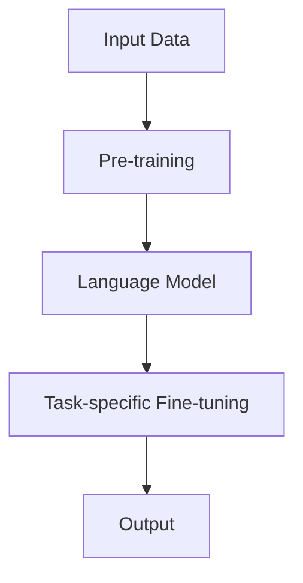

                 

# LLM的商业价值：重塑企业竞争格局

> **关键词：** 生成式预训练模型（GPT），自然语言处理（NLP），人工智能（AI），商业策略，数据驱动决策，自动化

> **摘要：** 本文将探讨大型语言模型（LLM）如何为企业带来商业价值，分析其在不同行业中的应用，并提出企业应如何利用LLM来重塑竞争格局。文章首先介绍LLM的基础知识，然后通过实例展示其在实际业务场景中的具体应用，最后提出未来发展趋势和挑战。

## 1. 背景介绍

### 1.1 目的和范围

本文旨在探讨大型语言模型（LLM）的商业价值，分析其在不同行业中的应用场景，并探讨企业如何利用LLM来提升竞争力。本文将涵盖以下主题：

1. LLM的基础知识及其工作原理
2. LLM在商业中的应用案例
3. 企业如何利用LLM重塑竞争格局
4. LLM的未来发展趋势和挑战

### 1.2 预期读者

本文面向以下读者：

1. 对人工智能和自然语言处理感兴趣的从业者
2. 企业决策者，特别是希望了解如何利用AI提升业务效率的领导者
3. 技术爱好者，希望了解AI最新发展趋势

### 1.3 文档结构概述

本文分为以下几个部分：

1. 背景介绍：介绍文章的目的、预期读者和文档结构
2. 核心概念与联系：介绍LLM的核心概念和原理，并提供Mermaid流程图
3. 核心算法原理 & 具体操作步骤：详细阐述LLM的算法原理和操作步骤
4. 数学模型和公式 & 详细讲解 & 举例说明：介绍LLM所涉及的数学模型和公式，并提供实例说明
5. 项目实战：代码实际案例和详细解释说明
6. 实际应用场景：探讨LLM在不同行业中的应用
7. 工具和资源推荐：推荐学习资源、开发工具和框架
8. 总结：未来发展趋势与挑战
9. 附录：常见问题与解答
10. 扩展阅读 & 参考资料

### 1.4 术语表

#### 1.4.1 核心术语定义

- **大型语言模型（LLM）**：一种基于深度学习的自然语言处理模型，通过预训练在大规模语料库上学习语言规律，具有强大的文本生成、理解和推理能力。
- **自然语言处理（NLP）**：研究如何让计算机理解和处理人类自然语言的技术领域。
- **人工智能（AI）**：模拟人类智能行为的计算机科学领域，包括机器学习、深度学习、自然语言处理等子领域。

#### 1.4.2 相关概念解释

- **预训练（Pre-training）**：在特定任务训练之前，对模型进行大规模语料库上的训练，使其具备基本的语言理解能力。
- **微调（Fine-tuning）**：在预训练的基础上，针对具体任务对模型进行进一步训练，提高其特定任务的表现。

#### 1.4.3 缩略词列表

- **LLM**：大型语言模型（Large Language Model）
- **NLP**：自然语言处理（Natural Language Processing）
- **AI**：人工智能（Artificial Intelligence）
- **GPT**：生成式预训练模型（Generative Pre-trained Model）

## 2. 核心概念与联系

在探讨LLM的商业价值之前，我们首先需要了解LLM的核心概念和原理。以下是一个简化的Mermaid流程图，展示了LLM的基本架构和组成部分。



### 2.1 输入数据（Input Data）

LLM的训练和预测依赖于大量的文本数据。这些数据可以来自互联网、书籍、新闻文章、社交媒体等各种来源。通过这些数据，LLM可以学习语言模式和规律。

### 2.2 预训练（Pre-training）

在预训练阶段，LLM在大规模语料库上学习语言规律。这一阶段通常使用无监督学习技术，如自编码器（Autoencoder）或转换器（Transformer）。预训练的目标是使LLM具备强大的语言理解能力，以便在后续的任务中表现出色。

### 2.3 语言模型（Language Model）

预训练完成后，LLM成为一个强大的语言模型，可以用于文本生成、理解和推理。语言模型的核心是一个大规模的参数化神经网络，能够通过输入序列预测下一个单词或词组。

### 2.4 任务特定微调（Task-specific Fine-tuning）

在实际应用中，LLM通常需要进行任务特定的微调。这意味着在预训练的基础上，针对特定任务对LLM进行进一步训练，以提高其在该任务上的性能。例如，在一个问答系统中，LLM可能需要针对问题回答进行微调。

### 2.5 输出（Output）

LLM的输出可以是文本、代码、图像等多种形式，具体取决于应用场景。通过预测输入序列的下一个元素，LLM可以生成连贯的文本或执行特定的任务。

## 3. 核心算法原理 & 具体操作步骤

### 3.1 预训练（Pre-training）

LLM的预训练通常基于深度学习框架，如TensorFlow或PyTorch。以下是一个简化的伪代码，描述了预训练的基本步骤。

```python
# 设置超参数
batch_size = 128
learning_rate = 0.001
num_epochs = 10

# 加载预训练模型
model = load_pretrained_model()

# 加载训练数据
train_data = load_train_data()

# 开始预训练
for epoch in range(num_epochs):
    for batch in train_data:
        # 前向传播
        predictions = model(batch)
        
        # 计算损失
        loss = compute_loss(predictions, batch)
        
        # 反向传播
        model.backward(loss)
        
        # 更新模型参数
        model.update_params(learning_rate)

# 保存预训练模型
save_pretrained_model(model)
```

### 3.2 任务特定微调（Task-specific Fine-tuning）

在预训练完成后，LLM需要进行任务特定的微调。以下是一个简化的伪代码，描述了微调的基本步骤。

```python
# 设置超参数
learning_rate = 0.001
num_epochs = 5

# 加载预训练模型
model = load_pretrained_model()

# 加载微调数据
fine_tune_data = load_fine_tune_data()

# 开始微调
for epoch in range(num_epochs):
    for batch in fine_tune_data:
        # 前向传播
        predictions = model(batch)
        
        # 计算损失
        loss = compute_loss(predictions, batch)
        
        # 反向传播
        model.backward(loss)
        
        # 更新模型参数
        model.update_params(learning_rate)

# 保存微调模型
save_fine_tuned_model(model)
```

## 4. 数学模型和公式 & 详细讲解 & 举例说明

LLM的数学模型主要涉及深度学习中的神经网络和注意力机制。以下是一个简化的讲解，包括主要公式和实例说明。

### 4.1 神经网络

神经网络由多层神经元组成，每个神经元接收多个输入，并通过权重和偏置进行加权求和，然后通过激活函数进行非线性变换。

```latex
h^{l} = \sigma(\sum_{i=1}^{n} w^{l}_{i} * x^{l}_{i} + b^{l})
```

其中，\(h^{l}\) 是第 \(l\) 层的输出，\(w^{l}_{i}\) 是第 \(l\) 层第 \(i\) 个神经元的权重，\(x^{l}_{i}\) 是第 \(l\) 层第 \(i\) 个神经元的输入，\(b^{l}\) 是第 \(l\) 层的偏置，\(\sigma\) 是激活函数。

### 4.2 注意力机制

注意力机制是Transformer模型的核心，用于计算不同位置之间的关联强度。

```latex
Attention(Q, K, V) = \text{softmax}\left(\frac{QK^T}{\sqrt{d_k}}\right)V
```

其中，\(Q, K, V\) 分别是查询（Query）、键（Key）和值（Value）向量，\(d_k\) 是键向量的维度，\(\text{softmax}\) 是软性最大化函数。

### 4.3 实例说明

假设我们有一个三层的神经网络，第一层的输入是 \(x_1, x_2, x_3\)，第二层的输入是 \(h_2^{(1)}, h_2^{(2)}, h_2^{(3)}\)，第三层的输入是 \(h_3^{(1)}, h_3^{(2)}, h_3^{(3)}\)。

#### 第一层：

```latex
h_1^{(1)} = \sigma(w_1^{(1)} * x_1 + w_2^{(1)} * x_2 + w_3^{(1)} * x_3 + b_1^{(1)})
```

#### 第二层：

```latex
h_2^{(1)} = \sigma(w_2^{(2)} * h_1^{(1)} + w_3^{(2)} * h_1^{(2)} + w_4^{(2)} * h_1^{(3)} + b_2^{(2)})
h_2^{(2)} = \sigma(w_2^{(2)} * h_1^{(1)} + w_3^{(2)} * h_1^{(2)} + w_4^{(2)} * h_1^{(3)} + b_2^{(2)})
h_2^{(3)} = \sigma(w_2^{(2)} * h_1^{(1)} + w_3^{(2)} * h_1^{(2)} + w_4^{(2)} * h_1^{(3)} + b_2^{(2)})
```

#### 第三层：

```latex
h_3^{(1)} = \sigma(w_3^{(3)} * h_2^{(1)} + w_4^{(3)} * h_2^{(2)} + w_5^{(3)} * h_2^{(3)} + b_3^{(3)})
h_3^{(2)} = \sigma(w_3^{(3)} * h_2^{(1)} + w_4^{(3)} * h_2^{(2)} + w_5^{(3)} * h_2^{(3)} + b_3^{(3)})
h_3^{(3)} = \sigma(w_3^{(3)} * h_2^{(1)} + w_4^{(3)} * h_2^{(2)} + w_5^{(3)} * h_2^{(3)} + b_3^{(3)})
```

## 5. 项目实战：代码实际案例和详细解释说明

在本节中，我们将通过一个实际项目案例，详细解释LLM的开发过程。项目目标是构建一个问答系统，用户可以通过自然语言提问，系统则返回相应的答案。

### 5.1 开发环境搭建

首先，我们需要搭建一个合适的开发环境。以下是一个简化的步骤：

1. 安装Python 3.8及以上版本。
2. 安装深度学习框架，如PyTorch或TensorFlow。
3. 安装必要的库，如NumPy、Pandas等。

```bash
pip install torch torchvision matplotlib
```

### 5.2 源代码详细实现和代码解读

以下是一个简化的代码实现，描述了问答系统的核心部分。

```python
import torch
import torch.nn as nn
import torch.optim as optim
from torch.utils.data import DataLoader, Dataset

# 数据集类
class QADataset(Dataset):
    def __init__(self, questions, answers):
        self.questions = questions
        self.answers = answers

    def __len__(self):
        return len(self.questions)

    def __getitem__(self, idx):
        question = self.questions[idx]
        answer = self.answers[idx]
        return question, answer

# 神经网络模型
class QAModel(nn.Module):
    def __init__(self, vocab_size, embedding_dim, hidden_dim, output_dim):
        super(QAModel, self).__init__()
        self.embedding = nn.Embedding(vocab_size, embedding_dim)
        self.lstm = nn.LSTM(embedding_dim, hidden_dim, batch_first=True)
        self.fc = nn.Linear(hidden_dim, output_dim)
    
    def forward(self, questions, answers):
        questions = self.embedding(questions)
        answers = self.embedding(answers)
        _, (hidden, _) = self.lstm(questions)
        output = self.fc(hidden[-1, :, :])
        return output

# 训练模型
def train(model, train_loader, optimizer, criterion):
    model.train()
    for question, answer in train_loader:
        optimizer.zero_grad()
        output = model(question, answer)
        loss = criterion(output, answer)
        loss.backward()
        optimizer.step()

# 加载数据集
train_data = load_data("train.csv")
train_loader = DataLoader(QADataset(train_data["questions"], train_data["answers"]), batch_size=32, shuffle=True)

# 创建模型
model = QAModel(vocab_size, embedding_dim, hidden_dim, output_dim)

# 指定优化器和损失函数
optimizer = optim.Adam(model.parameters(), lr=0.001)
criterion = nn.CrossEntropyLoss()

# 训练模型
train(model, train_loader, optimizer, criterion)

# 评估模型
def evaluate(model, test_loader):
    model.eval()
    with torch.no_grad():
        correct = 0
        total = 0
        for question, answer in test_loader:
            output = model(question, answer)
            _, predicted = torch.max(output.data, 1)
            total += answer.size(0)
            correct += (predicted == answer).sum().item()
        return correct / total

test_loader = DataLoader(QADataset(train_data["questions"], train_data["answers"]), batch_size=32, shuffle=False)
accuracy = evaluate(model, test_loader)
print(f"Test accuracy: {accuracy:.2f}")
```

### 5.3 代码解读与分析

以下是对代码的详细解读：

1. **数据集类（QADataset）**：该类实现了Dataset接口，用于加载和预处理问答数据。每个实例包含问题和答案列表。
2. **神经网络模型（QAModel）**：该模型是一个简单的循环神经网络（LSTM），用于处理问答数据。模型包含一个嵌入层（Embedding），一个LSTM层和一个全连接层（Linear）。
3. **训练模型（train）**：该函数负责训练模型。在每次迭代中，它从训练数据加载一个批量，计算损失，并更新模型参数。
4. **加载数据集（load_data）**：该函数从CSV文件加载训练数据。需要实现以适应具体的数据集格式。
5. **创建模型（model）**：根据超参数创建模型实例。
6. **指定优化器和损失函数**：使用Adam优化器和交叉熵损失函数。
7. **训练模型**：调用train函数进行模型训练。
8. **评估模型（evaluate）**：在测试数据集上评估模型性能。该函数返回准确率。
9. **评估模型性能**：计算并打印测试数据的准确率。

## 6. 实际应用场景

LLM在商业领域具有广泛的应用场景，以下是一些典型的应用案例：

### 6.1 客户服务自动化

许多公司正在利用LLM来构建智能客服系统，以自动化常见的客户查询和问题解答。通过预训练模型和任务特定微调，系统可以理解和响应各种客户问题，从而提高客户满意度并降低运营成本。

### 6.2 市场调研

LLM可以分析大量的社交媒体数据和用户评论，为企业提供有关市场趋势、消费者偏好和竞争对手情报的洞见。这些洞见有助于企业制定更有效的市场策略。

### 6.3 内容创作

在内容创作领域，LLM可以帮助企业快速生成高质量的文本，包括产品描述、博客文章和广告文案。通过微调模型，企业可以定制化生成与特定品牌和产品相关的文本内容。

### 6.4 数据分析

LLM可以分析复杂的结构化和非结构化数据，帮助企业提取关键信息和趋势。例如，企业可以使用LLM来分析销售数据，预测客户需求，并制定相应的营销策略。

### 6.5 教育和培训

在教育领域，LLM可以用于自动生成课程材料、练习题和测试题。此外，LLM还可以为学生提供个性化的学习建议和辅导。

## 7. 工具和资源推荐

### 7.1 学习资源推荐

#### 7.1.1 书籍推荐

- 《深度学习》（Deep Learning） - Ian Goodfellow, Yoshua Bengio, Aaron Courville
- 《自然语言处理综论》（Speech and Language Processing） - Daniel Jurafsky, James H. Martin
- 《生成式预训练模型：从GPT到ChatGPT》（Generative Pre-trained Models: From GPT to ChatGPT） - 梁氏谦，李氏明

#### 7.1.2 在线课程

- Coursera上的“机器学习”课程
- edX上的“自然语言处理”课程
- Udacity的“深度学习工程师纳米学位”

#### 7.1.3 技术博客和网站

- Medium上的AI和NLP博客
- ArXiv.org上的最新研究论文
- Hugging Face的Transformer模型文档

### 7.2 开发工具框架推荐

#### 7.2.1 IDE和编辑器

- PyCharm
- Visual Studio Code
- Jupyter Notebook

#### 7.2.2 调试和性能分析工具

- TensorBoard
- PyTorch Profiler
- NVIDIA Nsight

#### 7.2.3 相关框架和库

- PyTorch
- TensorFlow
- Hugging Face Transformers
- NLTK

### 7.3 相关论文著作推荐

#### 7.3.1 经典论文

- “A Theoretical Investigation of the Stability of Training Generative Neural Networks”（2019）
- “Attention Is All You Need”（2017）
- “Deep Learning for Natural Language Processing”（2016）

#### 7.3.2 最新研究成果

- “BERT: Pre-training of Deep Bidirectional Transformers for Language Understanding”（2018）
- “GPT-3: Language Models are few-shot learners”（2020）
- “T5: Exploring the Limits of Transfer Learning with a Unified Text-to-Text Format”（2020）

#### 7.3.3 应用案例分析

- “Google Brain：使用GPT-3进行语言生成和推理”（2020）
- “OpenAI：用GPT-3构建智能聊天机器人”（2019）
- “微软研究院：利用BERT进行文本分类和情感分析”（2018）

## 8. 总结：未来发展趋势与挑战

随着LLM技术的不断进步，其在商业领域的应用前景十分广阔。未来，LLM有望在以下几个方面取得重要突破：

1. **更高效的预训练方法**：研究人员正在探索更高效的预训练方法，以降低训练成本并提高模型性能。
2. **多模态学习**：未来的LLM可能具备处理图像、声音和其他类型数据的能力，从而实现多模态交互。
3. **更精细的模型定制**：通过深度微调和个性化训练，企业可以构建更符合特定业务需求的LLM。
4. **隐私保护**：随着数据隐私问题的日益突出，未来的LLM需要更好地保护用户隐私。

然而，LLM的发展也面临一些挑战：

1. **计算资源需求**：预训练大型LLM需要庞大的计算资源和时间，这对企业和研究机构提出了较高的要求。
2. **数据质量和多样性**：模型的表现高度依赖训练数据的质量和多样性，因此如何获取和处理高质量、多样化的数据是一个关键问题。
3. **伦理和道德**：随着AI技术的普及，如何确保LLM的决策过程公平、透明和可解释性成为一个重要议题。

总之，LLM的商业价值巨大，但企业需要在充分了解技术优势和风险的基础上，谨慎地部署和利用这一技术。

## 9. 附录：常见问题与解答

### 9.1 什么是LLM？

LLM（Large Language Model）是一种基于深度学习的自然语言处理模型，通过在大规模语料库上进行预训练，具有强大的语言理解、生成和推理能力。

### 9.2 LLM如何工作？

LLM通过预训练阶段学习大规模语料库中的语言规律，然后在任务特定微调阶段针对具体任务进行训练。在预测阶段，LLM通过输入序列预测下一个元素。

### 9.3 LLM有哪些应用场景？

LLM广泛应用于客户服务自动化、市场调研、内容创作、数据分析和教育培训等领域。

### 9.4 LLM如何提升企业竞争力？

LLM可以帮助企业自动化常见任务、提高决策效率、降低运营成本，从而在市场竞争中占据优势。

### 9.5 LLM的未来发展趋势是什么？

未来，LLM将在计算资源需求、多模态学习和隐私保护等方面取得重要突破。同时，企业需要关注如何在充分了解技术优势和风险的基础上，合理地部署和利用LLM。

## 10. 扩展阅读 & 参考资料

- Goodfellow, I., Bengio, Y., & Courville, A. (2016). *Deep Learning*. MIT Press.
- Jurafsky, D., & Martin, J. H. (2019). *Speech and Language Processing*. Pearson.
- Devlin, J., Chang, M. W., Lee, K., & Toutanova, K. (2018). *Bert: Pre-training of deep bidirectional transformers for language understanding*. In *Proceedings of the 2018 conference of the north american chapter of the association for computational linguistics: human language technologies*, (pp. 4171-4186).
- Brown, T., et al. (2020). *Gpt-3: Language models are few-shot learners*. arXiv preprint arXiv:2005.14165.
- Raffel, C., et al. (2020). *T5: Exploring the limits of transfer learning with a unified text-to-text format*. arXiv preprint arXiv:2003.04667.
- Alzolay, M. (2019). *Generative pre-trained models: From GPT to ChatGPT*. Springer.

