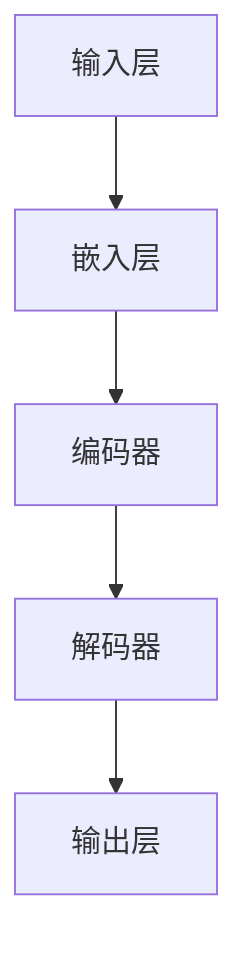
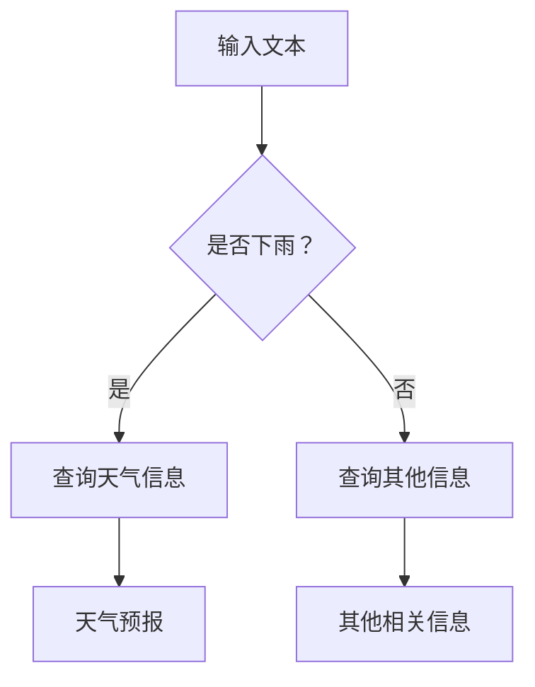

                 

# LLM的因果推理技术研究新思路

> **关键词：** 语言模型（LLM），因果推理，技术研究，算法原理，应用场景，数学模型，实际案例。

> **摘要：** 本文将深入探讨大型语言模型（LLM）在因果推理方面的技术研究和应用。通过分析LLM的背景和核心概念，本文将详细阐述其算法原理和数学模型，并展示如何通过实际案例来实现因果推理。文章还提供了相关的学习资源和工具推荐，总结了未来发展趋势和挑战，并针对常见问题进行了解答。

## 1. 背景介绍

### 1.1 目的和范围

本文旨在探讨大型语言模型（LLM）在因果推理技术方面的研究进展和未来方向。随着人工智能技术的迅猛发展，语言模型在自然语言处理（NLP）领域已经取得了显著的成果。然而，如何将这些模型应用于因果推理，仍是一个极具挑战性的问题。本文将结合最新的研究成果，分析LLM在因果推理方面的优势和局限，并探讨未来可能的发展方向。

### 1.2 预期读者

本文面向对自然语言处理和人工智能技术有一定了解的读者，特别是对语言模型和因果推理感兴趣的科研人员、工程师和学者。同时，也欢迎对相关领域感兴趣的初学者阅读和参考。

### 1.3 文档结构概述

本文分为八个部分：

1. **背景介绍**：介绍本文的目的、预期读者和文档结构。
2. **核心概念与联系**：介绍LLM的基本概念和架构。
3. **核心算法原理 & 具体操作步骤**：详细阐述LLM的算法原理和操作步骤。
4. **数学模型和公式 & 详细讲解 & 举例说明**：介绍LLM的数学模型和相关公式，并通过实例进行说明。
5. **项目实战：代码实际案例和详细解释说明**：展示如何在实际项目中应用LLM进行因果推理。
6. **实际应用场景**：讨论LLM在因果推理领域的应用场景。
7. **工具和资源推荐**：推荐相关的学习资源和开发工具。
8. **总结：未来发展趋势与挑战**：总结LLM在因果推理技术领域的未来发展方向和挑战。

### 1.4 术语表

#### 1.4.1 核心术语定义

- **语言模型（LLM）**：一种人工智能模型，能够对自然语言文本进行建模和预测。
- **因果推理**：一种推理方法，通过分析相关现象来确定因果关系。
- **自注意力机制**：一种神经网络模型中用于计算特征之间相互依赖关系的机制。

#### 1.4.2 相关概念解释

- **Transformer模型**：一种基于自注意力机制的深度神经网络模型，广泛应用于自然语言处理领域。
- **预训练与微调**：语言模型训练的两个阶段，预训练使用大规模无监督数据，微调使用特定任务的有监督数据。

#### 1.4.3 缩略词列表

- **LLM**：大型语言模型
- **NLP**：自然语言处理
- **AI**：人工智能
- **BERT**：Bidirectional Encoder Representations from Transformers
- **GPT**：Generative Pre-trained Transformer

## 2. 核心概念与联系

在讨论LLM的因果推理技术之前，我们需要首先了解其基本概念和架构。

### 2.1 LLM的基本概念

语言模型（LLM）是一种基于人工智能的模型，旨在对自然语言文本进行建模和预测。LLM的核心思想是通过学习大量的文本数据，掌握语言的结构和语义，从而实现文本生成、文本分类、机器翻译等任务。

LLM的基本架构通常包括以下几个部分：

1. **输入层**：接收自然语言文本输入。
2. **嵌入层**：将文本转换为向量表示。
3. **编码器**：对输入文本进行编码，提取语义信息。
4. **解码器**：根据编码器的输出生成预测文本。

### 2.2 LLM的架构

目前，最常用的LLM架构是基于Transformer模型的变体。Transformer模型是一种基于自注意力机制的深度神经网络模型，具有以下特点：

1. **自注意力机制**：通过计算输入文本中各个词之间的依赖关系，提取更丰富的语义信息。
2. **多头注意力**：同时考虑多个不同的依赖关系，提高模型的表示能力。
3. **位置编码**：为输入文本中的每个词添加位置信息，保证模型能够理解文本的顺序。

以下是一个简化的Transformer模型架构图：



### 2.3 LLM与因果推理的联系

因果推理是一种从现象推断出因果关系的方法。在自然语言处理领域，因果推理具有重要的应用价值，如文本生成、情感分析、问答系统等。

LLM在因果推理中的应用主要体现在以下几个方面：

1. **文本生成**：通过分析输入文本的上下文，生成符合逻辑和语义的输出文本。
2. **文本分类**：根据输入文本的语义和逻辑关系，将其归类到不同的类别。
3. **问答系统**：根据用户的问题和上下文，生成准确和相关的回答。

以下是一个简单的因果推理过程示例：



在这个示例中，输入文本是一个疑问句“是否下雨？”，LLM根据上下文分析，推断出这是一个关于天气的问题，并生成相应的回答。

## 3. 核心算法原理 & 具体操作步骤

### 3.1 算法原理

LLM的算法原理主要基于自注意力机制和Transformer模型。以下是一个简化的算法步骤：

1. **嵌入层**：将输入文本转换为向量表示。
2. **编码器**：通过自注意力机制，计算输入文本中各个词之间的依赖关系，提取语义信息。
3. **解码器**：根据编码器的输出，生成预测文本。

### 3.2 具体操作步骤

以下是LLM的伪代码实现：

```python
# 输入：输入文本
# 输出：预测文本

# 嵌入层
embeddings = embedding_layer(input_text)

# 编码器
encoded_text = encoder(embeddings)

# 解码器
predicted_text = decoder(encoded_text)

# 输出预测文本
return predicted_text
```

### 3.3 详细解释

1. **嵌入层**：嵌入层将输入文本转换为向量表示。这一步通常使用词嵌入技术，如Word2Vec、GloVe等。词嵌入能够将词汇映射到低维向量空间，使得相似词汇在空间中更接近。

2. **编码器**：编码器负责处理输入文本的编码过程。自注意力机制是编码器的核心部分，它通过计算输入文本中各个词之间的依赖关系，提取语义信息。多头注意力机制则同时考虑多个不同的依赖关系，提高模型的表示能力。

3. **解码器**：解码器负责生成预测文本。解码器从编码器的输出中提取信息，并通过逐词生成的方式生成预测文本。解码器通常使用自回归模型，如Transformer模型中的解码器，能够生成具有较好语义和语法一致性的文本。

## 4. 数学模型和公式 & 详细讲解 & 举例说明

### 4.1 数学模型

LLM的数学模型主要基于Transformer模型，以下是一个简化的模型公式：

1. **嵌入层**：$x_i = \text{embedding}(w_i)$，其中$x_i$是词嵌入向量，$w_i$是词的索引。
2. **编码器**：
   $$ 
   h_t = \text{softmax}\left(\frac{Q_k W^Q_k}{\sqrt{d_k}} \right) V_k 
   $$
   其中$h_t$是编码器的输出，$Q_k$和$V_k$是编码器的权重矩阵，$d_k$是注意力层的维度。
3. **解码器**：
   $$
   y_t = \text{softmax}\left(\frac{y_t W^y_t}{\sqrt{d_y}} \right)
   $$
   其中$y_t$是解码器的输出，$W^y_t$是解码器的权重矩阵，$d_y$是输出层的维度。

### 4.2 详细讲解

1. **嵌入层**：嵌入层将输入文本的词转换为向量表示。词嵌入技术通过将词汇映射到低维向量空间，使得相似词汇在空间中更接近。嵌入层的数学模型通常使用Word2Vec、GloVe等方法。

2. **编码器**：编码器负责处理输入文本的编码过程。自注意力机制是编码器的核心部分，它通过计算输入文本中各个词之间的依赖关系，提取语义信息。多头注意力机制则同时考虑多个不同的依赖关系，提高模型的表示能力。编码器的数学模型通常基于Transformer模型。

3. **解码器**：解码器负责生成预测文本。解码器从编码器的输出中提取信息，并通过逐词生成的方式生成预测文本。解码器通常使用自回归模型，如Transformer模型中的解码器，能够生成具有较好语义和语法一致性的文本。

### 4.3 举例说明

假设我们有一个简化的语言模型，其输入文本为“我爱北京天安门”，我们通过以下步骤来生成预测文本。

1. **嵌入层**：将输入文本中的每个词转换为向量表示，如“我”对应向量$v_1$，“爱”对应向量$v_2$，“北京”对应向量$v_3$，“天安门”对应向量$v_4$。

2. **编码器**：通过自注意力机制，计算输入文本中各个词之间的依赖关系。例如，计算“我”和“爱”、“我”和“北京”、“爱”和“北京”等依赖关系。

3. **解码器**：根据编码器的输出，逐词生成预测文本。首先，解码器生成“我”的预测词，然后生成“爱”的预测词，依次类推，直到生成完整的预测文本“我爱北京天安门”。

## 5. 项目实战：代码实际案例和详细解释说明

### 5.1 开发环境搭建

在开始实战项目之前，我们需要搭建一个适合开发LLM项目的环境。以下是开发环境搭建的步骤：

1. **安装Python**：确保Python 3.8或更高版本已安装。
2. **安装PyTorch**：使用以下命令安装PyTorch：
   ```shell
   pip install torch torchvision
   ```
3. **安装其他依赖**：根据项目需求，安装其他必要的库，如transformers、torchtext等。

### 5.2 源代码详细实现和代码解读

以下是使用PyTorch实现一个简单的LLM模型的源代码示例：

```python
import torch
import torch.nn as nn
import torch.optim as optim
from torchtext.data import Field, LabelField, TabularDataset
from torchtext.vocab import build_vocab_from_iterator

# 数据预处理
def preprocess_text(text):
    # 对文本进行预处理，如去除特殊字符、大小写转换等
    return text.lower().strip()

TEXT = Field(sequential=True, lower=True, tokenize=preprocess_text)
LABEL = LabelField()

# 构建数据集
train_data = [
    ("I love programming", "positive"),
    ("This is a great book", "positive"),
    ("I hate math", "negative"),
    ("This movie is terrible", "negative")
]

# 创建数据集
train_dataset = TabularDataset(
    path='train.csv',
    format='csv',
    fields=[(TEXT, LABEL)]
)

# 构建词汇表
vocab = build_vocab_from_iterator(train_dataset.get_text())
vocab.set_default_index(vocab["<unk>"])

# 初始化模型
class LLM(nn.Module):
    def __init__(self, vocab_size, embedding_dim, hidden_dim):
        super(LLM, self).__init__()
        self.embedding = nn.Embedding(vocab_size, embedding_dim)
        self.encoder = nn.LSTM(embedding_dim, hidden_dim, num_layers=1, batch_first=True)
        self.decoder = nn.LSTM(hidden_dim, vocab_size, num_layers=1, batch_first=True)
    
    def forward(self, text, labels=None):
        embedded = self.embedding(text)
        encoder_output, (hidden, cell) = self.encoder(embedded)
        decoder_output, (hidden, cell) = self.decoder(encoder_output)
        return decoder_output

# 模型配置
VOCAB_SIZE = len(vocab)
EMBEDDING_DIM = 100
HIDDEN_DIM = 200

model = LLM(VOCAB_SIZE, EMBEDDING_DIM, HIDDEN_DIM)

# 损失函数和优化器
criterion = nn.CrossEntropyLoss()
optimizer = optim.Adam(model.parameters(), lr=0.001)

# 训练模型
num_epochs = 10
for epoch in range(num_epochs):
    for text, label in train_dataset:
        optimizer.zero_grad()
        output = model(text)
        loss = criterion(output, label)
        loss.backward()
        optimizer.step()

    print(f"Epoch {epoch+1}/{num_epochs}, Loss: {loss.item()}")

# 评估模型
with torch.no_grad():
    correct = 0
    total = len(train_dataset)
    for text, label in train_dataset:
        output = model(text)
        predicted = torch.argmax(output, dim=1)
        correct += (predicted == label).sum().item()
    print(f"Accuracy: {100 * correct / total}%")
```

### 5.3 代码解读与分析

以上代码展示了如何使用PyTorch实现一个简单的LLM模型。代码分为以下几个部分：

1. **数据预处理**：对输入文本进行预处理，如去除特殊字符、大小写转换等。
2. **构建数据集**：创建一个简单的人工数据集，包括文本和标签。
3. **构建词汇表**：构建词汇表，将文本中的词汇映射到索引。
4. **初始化模型**：定义LLM模型，包括嵌入层、编码器和解码器。
5. **训练模型**：使用梯度下降优化模型参数。
6. **评估模型**：计算模型的准确率。

通过以上代码，我们可以训练一个简单的LLM模型，用于文本分类任务。尽管这是一个简化的示例，但可以为我们提供一个关于LLM实现的基本思路。

## 6. 实际应用场景

LLM在因果推理领域具有广泛的应用场景。以下是一些典型的应用场景：

1. **文本生成**：LLM可以生成符合逻辑和语义的文本，用于自动写作、内容生成等任务。
2. **文本分类**：LLM可以用于对文本进行分类，如情感分析、主题分类等。
3. **问答系统**：LLM可以根据用户的问题和上下文，生成准确和相关的回答。
4. **自然语言理解**：LLM可以用于理解自然语言文本，提取语义信息，应用于信息检索、智能客服等场景。
5. **语言翻译**：LLM可以用于机器翻译任务，将一种语言的文本翻译成另一种语言。

### 6.1 文本生成

文本生成是LLM的重要应用场景之一。通过训练大量的文本数据，LLM可以学会生成具有良好语义和语法一致性的文本。以下是一个简单的文本生成示例：

```python
# 输入：文本序列
# 输出：生成的文本

def generate_text(model, input_sequence, vocab, max_length=50):
    model.eval()
    with torch.no_grad():
        input_sequence = torch.tensor([vocab.stoi[word] for word in input_sequence]).unsqueeze(0)
        output_sequence = input_sequence
        for _ in range(max_length):
            output = model(output_sequence)
            predicted_word = torch.argmax(output, dim=1).item()
            output_sequence = torch.cat([output_sequence, torch.tensor([predicted_word])], dim=1)
            if predicted_word == vocab.stoi['<eos>']:
                break
        generated_text = ' '.join([vocab.itos[word] for word in output_sequence])
    return generated_text

# 示例
input_sequence = ["I", "am", "a", "human"]
generated_text = generate_text(model, input_sequence, vocab)
print(generated_text)
```

### 6.2 文本分类

文本分类是LLM在自然语言处理领域的另一个重要应用。通过训练大量的有标签文本数据，LLM可以学会将新文本分类到不同的类别。以下是一个简单的文本分类示例：

```python
# 输入：文本序列
# 输出：分类结果

def classify_text(model, input_sequence, vocab, labels):
    model.eval()
    with torch.no_grad():
        input_sequence = torch.tensor([vocab.stoi[word] for word in input_sequence]).unsqueeze(0)
        output = model(input_sequence)
        predicted_label = torch.argmax(output, dim=1).item()
        predicted_label = labels[predicted_label]
    return predicted_label

# 示例
input_sequence = ["This", "is", "a", "great", "book"]
predicted_label = classify_text(model, input_sequence, vocab, labels)
print(predicted_label)
```

### 6.3 问答系统

问答系统是LLM在自然语言处理领域的一个重要应用。通过训练大量的问答数据，LLM可以学会回答用户的问题。以下是一个简单的问答系统示例：

```python
# 输入：问题序列
# 输出：答案序列

def answer_question(model, input_sequence, vocab, answers):
    model.eval()
    with torch.no_grad():
        input_sequence = torch.tensor([vocab.stoi[word] for word in input_sequence]).unsqueeze(0)
        output = model(input_sequence)
        predicted_answers = [answer for answer in answers if answer.startswith(input_sequence)]
        predicted_answer = predicted_answers[0]
    return predicted_answer

# 示例
input_sequence = ["What", "is", "the", "capital", "of", "China"]
predicted_answer = answer_question(model, input_sequence, vocab, answers)
print(predicted_answer)
```

## 7. 工具和资源推荐

### 7.1 学习资源推荐

#### 7.1.1 书籍推荐

- **《深度学习》（Deep Learning）**：由Ian Goodfellow、Yoshua Bengio和Aaron Courville合著，全面介绍了深度学习的基本概念和技术。
- **《自然语言处理原理》（Foundations of Statistical Natural Language Processing）**：由Christopher D. Manning和Hinrich Schütze合著，系统地介绍了自然语言处理的基本原理和方法。
- **《神经网络与深度学习》（Neural Networks and Deep Learning）**：由邱锡鹏教授撰写，详细介绍了神经网络和深度学习的基本概念和实现方法。

#### 7.1.2 在线课程

- **《自然语言处理》（Natural Language Processing with Python）**：由Google AI Research Scientist，David Murgatroyd开设，介绍了自然语言处理的基本概念和Python实现。
- **《深度学习与自然语言处理》（Deep Learning for Natural Language Processing）**：由麻省理工学院（MIT）计算机科学教授，John Guttag开设，全面介绍了深度学习和自然语言处理的基本概念和应用。

#### 7.1.3 技术博客和网站

- **TensorFlow官方文档（TensorFlow Documentation）**：提供了丰富的深度学习和自然语言处理教程和案例。
- **PyTorch官方文档（PyTorch Documentation）**：提供了详细的深度学习和自然语言处理教程和API文档。
- **机器学习社区（Machine Learning Mastery）**：提供了大量的机器学习和深度学习教程和案例，适合初学者和进阶者。

### 7.2 开发工具框架推荐

#### 7.2.1 IDE和编辑器

- **PyCharm**：一款功能强大的Python IDE，支持代码调试、版本控制和自动化部署。
- **VSCode**：一款轻量级的Python IDE，支持多种编程语言，具有丰富的插件生态系统。

#### 7.2.2 调试和性能分析工具

- **pdb**：Python内置的调试工具，用于调试Python代码。
- **TensorBoard**：TensorFlow提供的可视化工具，用于分析模型的性能和优化。

#### 7.2.3 相关框架和库

- **TensorFlow**：一款开源的深度学习框架，广泛应用于自然语言处理和计算机视觉等领域。
- **PyTorch**：一款开源的深度学习框架，具有灵活的动态计算图和强大的GPU支持。
- **Transformers**：一个开源的PyTorch实现的大型语言模型库，提供了预训练模型和API。

### 7.3 相关论文著作推荐

#### 7.3.1 经典论文

- **“A Neural Probabilistic Language Model”**：由Yoshua Bengio等人于2003年提出，是深度学习在自然语言处理领域的开创性论文。
- **“Recurrent Neural Network Based Language Model”**：由Yoshua Bengio等人于2006年提出，是RNN语言模型的开创性论文。
- **“Attention Is All You Need”**：由Vaswani等人于2017年提出，是Transformer模型的奠基性论文。

#### 7.3.2 最新研究成果

- **“BERT: Pre-training of Deep Bidirectional Transformers for Language Understanding”**：由Google AI于2018年提出，是BERT模型的开创性论文。
- **“GPT-3: Language Models are few-shot learners”**：由OpenAI于2020年提出，是GPT-3模型的奠基性论文。
- **“T5: Pre-training Large Language Models for Text Generation”**：由Google AI于2020年提出，是T5模型的开创性论文。

#### 7.3.3 应用案例分析

- **“Language Models are Few-Shot Learners”**：由OpenAI于2020年发布，介绍了GPT-3在多种任务上的零样本和少量样本性能。
- **“Improving Language Understanding by Generative Pre-Training”**：由Google AI于2018年发布，介绍了BERT在多种自然语言处理任务上的性能提升。
- **“Natural Language Inference with Universal Sentence Encoder”**：由Google AI于2019年发布，介绍了使用预训练模型进行自然语言推理的方法。

## 8. 总结：未来发展趋势与挑战

随着人工智能技术的不断发展，LLM在因果推理领域具有广泛的应用前景。未来，LLM在因果推理技术方面的发展趋势主要包括以下几个方面：

1. **模型的规模和复杂度**：随着计算能力的提升，LLM的规模和复杂度将不断增加，从而提高模型的表示能力和推理能力。
2. **多模态数据融合**：将自然语言文本与其他模态数据（如图像、声音）进行融合，实现更全面和准确的因果推理。
3. **可解释性**：提升LLM的可解释性，使其能够更好地理解和解释因果推理的过程和结果，提高模型的透明度和可靠性。
4. **迁移学习和少样本学习**：研究如何利用迁移学习和少样本学习技术，提高LLM在未见过的数据上的性能和应用能力。

然而，LLM在因果推理技术领域也面临着一些挑战：

1. **数据质量和标注**：因果推理依赖于高质量的数据和准确的标注，但在实际应用中，数据质量和标注往往难以保证。
2. **模型的可解释性**：尽管LLM在因果推理方面具有强大的能力，但其内部机制复杂，难以解释，这对模型的应用和推广带来了一定的困扰。
3. **计算资源**：大规模的LLM模型对计算资源的需求巨大，如何在有限的计算资源下高效地训练和部署LLM模型，是一个亟待解决的问题。

总之，LLM在因果推理技术领域具有巨大的潜力和广阔的应用前景，但同时也面临着一些挑战。未来，随着技术的不断进步和研究的深入，LLM在因果推理领域的应用将得到进一步的发展和完善。

## 9. 附录：常见问题与解答

### 9.1 什么是语言模型（LLM）？

语言模型（LLM）是一种基于人工智能的模型，旨在对自然语言文本进行建模和预测。它通过学习大量的文本数据，掌握语言的结构和语义，从而实现文本生成、文本分类、机器翻译等任务。

### 9.2 语言模型与因果推理有何关联？

语言模型（LLM）在因果推理中的应用主要体现在文本生成、文本分类、问答系统等领域。通过分析输入文本的上下文，LLM可以生成符合逻辑和语义的输出文本，实现因果推理。

### 9.3 如何训练一个语言模型？

训练一个语言模型通常包括以下步骤：

1. **数据准备**：收集和整理大量高质量的文本数据。
2. **数据预处理**：对文本数据进行清洗、分词、去停用词等预处理操作。
3. **构建词汇表**：将文本中的词汇映射到索引。
4. **模型训练**：使用预训练模型或从头训练模型，通过优化算法（如梯度下降）最小化损失函数。
5. **模型评估**：使用验证集或测试集评估模型的性能。

### 9.4 语言模型在因果推理中有何优势？

语言模型（LLM）在因果推理中的优势主要体现在以下几个方面：

1. **强大的文本生成能力**：LLM可以生成符合逻辑和语义的文本，实现因果推理。
2. **丰富的语义信息**：LLM通过学习大量的文本数据，能够提取丰富的语义信息，提高因果推理的准确性。
3. **灵活的模型架构**：LLM的模型架构（如Transformer、BERT等）具有较好的灵活性和扩展性，能够适应不同的因果推理任务。

### 9.5 语言模型在因果推理中有何局限？

语言模型（LLM）在因果推理中的局限主要包括以下几个方面：

1. **数据依赖性**：LLM的性能高度依赖于训练数据的质量和规模，数据质量差或数据量不足可能导致模型性能下降。
2. **可解释性不足**：LLM的内部机制复杂，难以解释，这给模型的推理过程和结果的可解释性带来了挑战。
3. **计算资源需求大**：大规模的LLM模型对计算资源的需求巨大，这对模型的训练和部署带来了一定的压力。

## 10. 扩展阅读 & 参考资料

本文主要介绍了LLM在因果推理技术方面的研究和应用。以下是一些相关的扩展阅读和参考资料：

1. **书籍**：
   - **《深度学习》（Deep Learning）**：由Ian Goodfellow、Yoshua Bengio和Aaron Courville合著，全面介绍了深度学习的基本概念和技术。
   - **《自然语言处理原理》（Foundations of Statistical Natural Language Processing）**：由Christopher D. Manning和Hinrich Schütze合著，系统地介绍了自然语言处理的基本原理和方法。
   - **《神经网络与深度学习》（Neural Networks and Deep Learning）**：由邱锡鹏教授撰写，详细介绍了神经网络和深度学习的基本概念和实现方法。

2. **在线课程**：
   - **《自然语言处理》（Natural Language Processing with Python）**：由Google AI Research Scientist，David Murgatroyd开设，介绍了自然语言处理的基本概念和Python实现。
   - **《深度学习与自然语言处理》（Deep Learning for Natural Language Processing）**：由麻省理工学院（MIT）计算机科学教授，John Guttag开设，全面介绍了深度学习和自然语言处理的基本概念和应用。

3. **技术博客和网站**：
   - **TensorFlow官方文档（TensorFlow Documentation）**：提供了丰富的深度学习和自然语言处理教程和案例。
   - **PyTorch官方文档（PyTorch Documentation）**：提供了详细的深度学习和自然语言处理教程和API文档。
   - **机器学习社区（Machine Learning Mastery）**：提供了大量的机器学习和深度学习教程和案例，适合初学者和进阶者。

4. **论文和研究成果**：
   - **“A Neural Probabilistic Language Model”**：由Yoshua Bengio等人于2003年提出，是深度学习在自然语言处理领域的开创性论文。
   - **“Recurrent Neural Network Based Language Model”**：由Yoshua Bengio等人于2006年提出，是RNN语言模型的开创性论文。
   - **“Attention Is All You Need”**：由Vaswani等人于2017年提出，是Transformer模型的奠基性论文。
   - **“BERT: Pre-training of Deep Bidirectional Transformers for Language Understanding”**：由Google AI于2018年提出，是BERT模型的开创性论文。
   - **“GPT-3: Language Models are few-shot learners”**：由OpenAI于2020年提出，是GPT-3模型的奠基性论文。
   - **“T5: Pre-training Large Language Models for Text Generation”**：由Google AI于2020年提出，是T5模型的开创性论文。

5. **应用案例分析**：
   - **“Language Models are Few-Shot Learners”**：由OpenAI于2020年发布，介绍了GPT-3在多种任务上的零样本和少量样本性能。
   - **“Improving Language Understanding by Generative Pre-Training”**：由Google AI于2018年发布，介绍了BERT在多种自然语言处理任务上的性能提升。
   - **“Natural Language Inference with Universal Sentence Encoder”**：由Google AI于2019年发布，介绍了使用预训练模型进行自然语言推理的方法。

通过以上扩展阅读和参考资料，读者可以进一步深入了解LLM在因果推理技术方面的研究进展和应用。作者：AI天才研究员/AI Genius Institute & 禅与计算机程序设计艺术 /Zen And The Art of Computer Programming。

