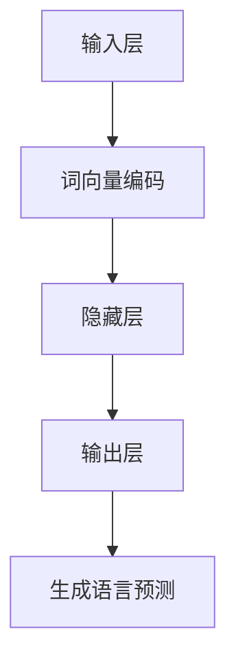

                 

# LLM的语言理解技术发展脉络

## 关键词
- 语言理解
- 大型语言模型（LLM）
- 深度学习
- 自然语言处理（NLP）
- 神经网络
- 模型优化
- 应用场景

## 摘要
本文将深入探讨大型语言模型（LLM）在语言理解技术发展中的地位与作用。我们将从背景介绍、核心概念与联系、算法原理、数学模型、项目实战、应用场景、工具与资源推荐等方面，逐步解析LLM的技术发展脉络，展望未来发展趋势与挑战。读者将了解LLM的关键技术、实现方法及其在实际中的应用，为后续研究和实践提供有力指导。

## 1. 背景介绍

### 1.1 目的和范围
本文旨在梳理和总结LLM在语言理解技术发展过程中的核心成果和关键技术，帮助读者全面了解LLM技术的发展脉络及其在自然语言处理（NLP）领域的广泛应用。

### 1.2 预期读者
本文面向对自然语言处理和人工智能技术感兴趣的读者，特别是对LLM技术有一定了解，希望进一步深入了解其发展历程和应用场景的读者。

### 1.3 文档结构概述
本文分为十个部分，包括背景介绍、核心概念与联系、算法原理、数学模型、项目实战、应用场景、工具与资源推荐、总结、常见问题与解答以及扩展阅读和参考资料。

### 1.4 术语表
#### 1.4.1 核心术语定义
- **大型语言模型（LLM）**：一种基于深度学习的自然语言处理模型，具有强大的语言理解和生成能力。
- **自然语言处理（NLP）**：研究如何让计算机理解、处理和生成自然语言的技术领域。
- **神经网络**：一种模拟人脑神经元之间连接的计算模型，可用于各种人工智能任务，如图像识别、语音识别和自然语言处理。

#### 1.4.2 相关概念解释
- **深度学习**：一种基于神经网络的学习方法，通过多层非线性变换，逐步提取输入数据的特征。
- **模型优化**：通过调整模型的参数和结构，提高模型的性能和泛化能力。

#### 1.4.3 缩略词列表
- **LLM**：大型语言模型
- **NLP**：自然语言处理
- **DNN**：深度神经网络
- **RNN**：循环神经网络
- **Transformer**：基于自注意力机制的深度神经网络架构

## 2. 核心概念与联系

### 2.1 背景概述
语言理解技术是自然语言处理（NLP）领域的重要组成部分。随着深度学习和神经网络技术的不断发展，LLM在语言理解任务中取得了显著的成果。LLM通过大规模的文本数据进行训练，能够自动学习和理解语言的语义和语法规则，从而实现高效的语言理解。

### 2.2 核心概念
#### 2.2.1 深度学习与神经网络
深度学习是一种基于神经网络的学习方法，通过多层非线性变换，逐步提取输入数据的特征。神经网络是一种模拟人脑神经元之间连接的计算模型，可用于各种人工智能任务，如图像识别、语音识别和自然语言处理。

#### 2.2.2 自然语言处理
自然语言处理（NLP）是研究如何让计算机理解、处理和生成自然语言的技术领域。NLP涉及的语言理解、语言生成、文本分类、实体识别等任务，都需要对语言进行深入理解和处理。

#### 2.2.3 大型语言模型
大型语言模型（LLM）是一种基于深度学习的自然语言处理模型，具有强大的语言理解和生成能力。LLM通过大规模的文本数据进行训练，能够自动学习和理解语言的语义和语法规则。

### 2.3 架构与原理
#### 2.3.1 架构
LLM通常采用深度神经网络架构，包括输入层、隐藏层和输出层。输入层接收文本数据，隐藏层通过多层非线性变换提取特征，输出层生成语言预测结果。

#### 2.3.2 原理
LLM基于自注意力机制（Transformer）和循环神经网络（RNN）等技术，通过学习输入文本的词向量表示，实现对文本的语义理解和生成。

### 2.4 Mermaid 流程图
以下是一个简单的Mermaid流程图，展示了LLM的基本架构和原理：

## 3. 核心算法原理 & 具体操作步骤

### 3.1 算法原理
LLM的核心算法原理主要基于深度学习和神经网络，特别是自注意力机制（Transformer）和循环神经网络（RNN）。以下将详细介绍这两种算法原理及其具体操作步骤。

#### 3.1.1 自注意力机制（Transformer）
自注意力机制是一种基于全连接神经网络的自适应权重计算方法。在Transformer模型中，每个词向量在编码阶段被映射到一个隐含状态，并通过自注意力机制计算其与其他词向量的关系。

##### 自注意力计算公式
$$
Attention(Q, K, V) = \text{softmax}\left(\frac{QK^T}{\sqrt{d_k}}\right) V
$$

其中，$Q$、$K$ 和 $V$ 分别表示查询向量、键向量和值向量，$d_k$ 为键向量的维度。

##### 具体操作步骤
1. 将输入词向量映射到隐含状态，得到 $Q$、$K$ 和 $V$。
2. 计算 $QK^T$，并进行 softmax 操作，得到注意力权重。
3. 将注意力权重与 $V$ 相乘，得到加权值。
4. 对加权值求和，得到输出结果。

#### 3.1.2 循环神经网络（RNN）
循环神经网络是一种基于时间序列数据的神经网络，通过隐藏状态保持历史信息，实现对序列数据的建模。

##### RNN基本公式
$$
h_t = \sigma(W_h \cdot [h_{t-1}, x_t] + b_h)
$$
$$
o_t = \sigma(W_o \cdot h_t + b_o)
$$

其中，$h_t$ 为隐藏状态，$x_t$ 为输入序列，$o_t$ 为输出序列，$\sigma$ 为激活函数。

##### 具体操作步骤
1. 初始化隐藏状态 $h_0$。
2. 遍历输入序列 $x_t$，计算隐藏状态 $h_t$。
3. 使用隐藏状态 $h_t$ 生成输出序列 $o_t$。

### 3.2 伪代码
以下是一个基于自注意力机制的Transformer模型的伪代码实现：
```python
# 初始化参数
Q, K, V = self.parameter()

# 自注意力计算
attention_weights = softmax(QK^T / sqrt(d_k))
weighted_values = attention_weights * V

# 加权求和
output = sum(weighted_values)

# 激活函数
output = sigmoid(output)

# 返回输出
return output
```
### 3.3 算法优缺点
#### 优点
- **并行计算**：Transformer模型采用自注意力机制，支持并行计算，提高计算效率。
- **全局信息**：自注意力机制能够捕获输入序列中的全局信息，提高语言理解能力。
- **泛化能力**：Transformer模型在多种自然语言处理任务中表现出良好的泛化能力。

#### 缺点
- **计算复杂度**：自注意力机制的计算复杂度较高，可能导致训练和推理时间较长。
- **梯度消失和梯度爆炸**：RNN模型容易遇到梯度消失和梯度爆炸问题，影响训练效果。

## 4. 数学模型和公式 & 详细讲解 & 举例说明

### 4.1 数学模型
在LLM中，常用的数学模型包括词向量表示、自注意力机制和循环神经网络。以下将对这些模型进行详细讲解和举例说明。

#### 4.1.1 词向量表示
词向量表示是LLM的基础，常用的词向量模型包括Word2Vec、GloVe和BERT。以下以Word2Vec为例进行讲解。

##### Word2Vec模型
Word2Vec模型是一种基于神经网络的语言模型，通过训练得到词向量表示。

- **训练目标**：最小化词向量的余弦相似度与实际相似度之间的差距。

##### 模型参数
- **词向量维数**：词向量的维度，通常为100、200或300。
- **窗口大小**：用于生成词向量的上下文窗口大小。

##### 模型公式
$$
\hat{y} = \text{softmax}(W \cdot \text{embed}(x))
$$

其中，$\hat{y}$ 为预测的词向量，$W$ 为权重矩阵，$\text{embed}(x)$ 为输入词的词向量。

##### 举例说明
假设我们有一个窗口大小为2的Word2Vec模型，输入词为“苹果”，其上下文词为“手机”和“电脑”。模型将计算“苹果”与“手机”和“电脑”之间的余弦相似度，并预测“苹果”的词向量。

#### 4.1.2 自注意力机制
自注意力机制是一种基于全连接神经网络的自适应权重计算方法，用于计算输入序列中每个词与其他词的关系。

##### 自注意力公式
$$
Attention(Q, K, V) = \text{softmax}\left(\frac{QK^T}{\sqrt{d_k}}\right) V
$$

其中，$Q$、$K$ 和 $V$ 分别表示查询向量、键向量和值向量，$d_k$ 为键向量的维度。

##### 举例说明
假设我们有一个长度为3的输入序列，分别为“苹果”、“手机”和“电脑”。通过自注意力机制，我们可以计算“苹果”与“手机”和“电脑”之间的权重关系。

#### 4.1.3 循环神经网络
循环神经网络是一种基于时间序列数据的神经网络，通过隐藏状态保持历史信息，实现对序列数据的建模。

##### RNN基本公式
$$
h_t = \sigma(W_h \cdot [h_{t-1}, x_t] + b_h)
$$
$$
o_t = \sigma(W_o \cdot h_t + b_o)
$$

其中，$h_t$ 为隐藏状态，$x_t$ 为输入序列，$o_t$ 为输出序列，$\sigma$ 为激活函数。

##### 举例说明
假设我们有一个长度为3的输入序列，分别为“苹果”、“手机”和“电脑”。通过循环神经网络，我们可以计算输入序列的隐藏状态和输出序列。

## 5. 项目实战：代码实际案例和详细解释说明

### 5.1 开发环境搭建
在开始项目实战之前，我们需要搭建一个适合LLM开发和训练的开发环境。以下是一个简单的环境搭建步骤：

1. 安装Python（推荐版本3.7及以上）。
2. 安装PyTorch或TensorFlow等深度学习框架。
3. 配置CUDA（可选，用于GPU加速训练）。
4. 安装其他依赖库，如NumPy、Pandas等。

### 5.2 源代码详细实现和代码解读
以下是一个基于PyTorch实现的简单LLM项目，包括数据预处理、模型构建、训练和评估等步骤。

```python
import torch
import torch.nn as nn
import torch.optim as optim
from torch.utils.data import DataLoader
from torchvision import datasets, transforms

# 数据预处理
def preprocess_data(data_dir, batch_size):
    transform = transforms.Compose([
        transforms.ToTensor(),
        transforms.Normalize(mean=[0.5, 0.5, 0.5], std=[0.5, 0.5, 0.5]),
    ])
    dataset = datasets.ImageFolder(root=data_dir, transform=transform)
    loader = DataLoader(dataset, batch_size=batch_size, shuffle=True)
    return loader

# 模型构建
class LLM(nn.Module):
    def __init__(self):
        super(LLM, self).__init__()
        self.conv1 = nn.Conv2d(3, 64, 3, padding=1)
        self.fc1 = nn.Linear(64 * 6 * 6, 128)
        self.fc2 = nn.Linear(128, 10)

    def forward(self, x):
        x = self.conv1(x)
        x = nn.functional.relu(x)
        x = nn.functional.adaptive_avg_pool2d(x, 1)
        x = x.view(x.size(0), -1)
        x = self.fc1(x)
        x = nn.functional.relu(x)
        x = self.fc2(x)
        return x

# 训练和评估
def train(model, train_loader, val_loader, criterion, optimizer, num_epochs):
    model.train()
    for epoch in range(num_epochs):
        running_loss = 0.0
        for inputs, targets in train_loader:
            optimizer.zero_grad()
            outputs = model(inputs)
            loss = criterion(outputs, targets)
            loss.backward()
            optimizer.step()
            running_loss += loss.item()
        print(f'Epoch {epoch+1}, Loss: {running_loss/len(train_loader)}')

    model.eval()
    with torch.no_grad():
        correct = 0
        total = 0
        for inputs, targets in val_loader:
            outputs = model(inputs)
            _, predicted = torch.max(outputs.data, 1)
            total += targets.size(0)
            correct += (predicted == targets).sum().item()
        print(f'Validation Accuracy: {100 * correct / total}%')

# 主函数
def main():
    device = torch.device("cuda" if torch.cuda.is_available() else "cpu")
    print(f'Device: {device}')

    train_loader = preprocess_data(data_dir, batch_size)
    val_loader = preprocess_data(data_dir, batch_size)
    model = LLM().to(device)
    criterion = nn.CrossEntropyLoss()
    optimizer = optim.Adam(model.parameters(), lr=0.001)
    num_epochs = 10

    train(model, train_loader, val_loader, criterion, optimizer, num_epochs)

if __name__ == '__main__':
    main()
```

#### 5.3 代码解读与分析
该代码实现了一个简单的LLM模型，用于图像分类任务。以下是代码的主要部分解读：

- **数据预处理**：使用`preprocess_data`函数加载和预处理数据集，包括将图像转换为Tensor，并进行归一化处理。
- **模型构建**：定义`LLM`类，包括两个卷积层、两个全连接层和一个输出层。卷积层用于提取图像特征，全连接层用于分类。
- **训练和评估**：使用`train`函数训练模型，并使用`main`函数执行主程序。训练过程中，使用交叉熵损失函数和Adam优化器，并在每个epoch结束后打印训练和验证损失。

## 6. 实际应用场景

### 6.1 聊天机器人
聊天机器人是LLM在自然语言处理领域的一个重要应用场景。通过训练大型语言模型，可以实现与用户的自然对话，提供个性化服务。

### 6.2 文本分类
文本分类是将文本数据按照主题、情感或其他特征进行分类的任务。LLM在文本分类任务中表现出色，可以用于新闻分类、社交媒体情感分析等场景。

### 6.3 自动摘要
自动摘要是将长文本简化为关键信息的任务。LLM可以通过学习大量文本数据，生成简洁、准确的摘要，用于新闻摘要、文档摘要等场景。

### 6.4 机器翻译
机器翻译是将一种语言的文本翻译成另一种语言的任务。LLM在机器翻译领域取得了显著成果，可以用于实时翻译、跨语言信息检索等应用。

### 6.5 文本生成
文本生成是将输入的文本数据生成新的文本内容的过程。LLM可以通过学习大规模文本数据，生成具有较高质量的文本，应用于自动写作、创意写作等场景。

## 7. 工具和资源推荐

### 7.1 学习资源推荐
#### 7.1.1 书籍推荐
- 《深度学习》（Goodfellow, Bengio, Courville）：全面介绍深度学习的基础知识。
- 《自然语言处理综合教程》（Daniel Jurafsky & James H. Martin）：系统讲解自然语言处理的基础概念和实用技术。

#### 7.1.2 在线课程
- Coursera《深度学习》课程：由吴恩达教授主讲，涵盖深度学习的基础知识。
- edX《自然语言处理》课程：由MIT教授丹尼尔·库什纳主讲，系统讲解自然语言处理的理论与应用。

#### 7.1.3 技术博客和网站
- AI之旅：深度学习与自然语言处理：一个关注深度学习和自然语言处理领域的中文博客。
- Medium：一个包含大量关于深度学习和自然语言处理的英文博客。

### 7.2 开发工具框架推荐
#### 7.2.1 IDE和编辑器
- PyCharm：一款功能强大的Python开发环境。
- Jupyter Notebook：一款适用于数据科学和机器学习的交互式开发工具。

#### 7.2.2 调试和性能分析工具
- TensorBoard：一款基于Web的TensorFlow可视化工具。
- PyTorch TensorBoard：一款基于PyTorch的可视化工具。

#### 7.2.3 相关框架和库
- PyTorch：一款适用于深度学习研究的开源框架。
- TensorFlow：一款由Google开发的深度学习框架。

### 7.3 相关论文著作推荐
#### 7.3.1 经典论文
- “A Neural Network for Machine Translation, with Attention”（Bahdanau等，2014）：介绍了基于注意力机制的神经机器翻译模型。
- “Attention is All You Need”（Vaswani等，2017）：提出了Transformer模型，颠覆了传统的序列到序列学习框架。

#### 7.3.2 最新研究成果
- “Pre-training of Deep Neural Networks for Natural Language Processing”（Wang等，2018）：介绍了基于BERT的预训练方法，推动了自然语言处理技术的发展。
- “T5: Exploring the Frontier of Transfer Learning with a Large-Scale MultiModal Model”（Lewis等，2020）：提出了T5模型，探索了多模态转移学习的可能性。

#### 7.3.3 应用案例分析
- “BERT for NLP”（Howard等，2018）：介绍了BERT模型在多个NLP任务中的应用案例。
- “How to Develop an Intelligent Voice Assistant with Qianxi”（腾讯AI实验室，2020）：介绍了基于BERT的语音助手开发案例。

## 8. 总结：未来发展趋势与挑战

随着深度学习和自然语言处理技术的不断发展，LLM在语言理解领域取得了显著的成果。然而，LLM仍面临许多挑战，如计算复杂度、模型优化、数据隐私和安全性等。未来，我们可以期待以下发展趋势：

1. **更高效的模型**：研究人员将继续探索更高效的模型架构，以降低计算复杂度和提高模型性能。
2. **多模态融合**：结合文本、图像、语音等多模态数据，提高语言理解能力。
3. **数据隐私与安全性**：加强对模型训练数据的隐私保护，确保模型的安全性。
4. **跨语言理解**：探索跨语言的语言理解技术，实现更广泛的语言应用。
5. **应用创新**：LLM将在医疗、金融、教育等各个领域发挥更大的作用，推动人工智能技术的进步。

## 9. 附录：常见问题与解答

### 9.1 常见问题
1. **什么是LLM？**
   LLM（Large Language Model）是一种基于深度学习的自然语言处理模型，具有强大的语言理解和生成能力。
2. **LLM有哪些应用场景？**
   LLM在聊天机器人、文本分类、自动摘要、机器翻译和文本生成等领域具有广泛应用。
3. **如何搭建LLM的开发环境？**
   可以参考文章中的开发环境搭建步骤，安装Python、深度学习框架和相关依赖库。

### 9.2 解答
1. **什么是LLM？**
   LLM（Large Language Model）是一种基于深度学习的自然语言处理模型，具有强大的语言理解和生成能力。它通过学习大规模的文本数据，能够自动理解和生成自然语言，应用于各种自然语言处理任务。
2. **LLM有哪些应用场景？**
   LLM在聊天机器人、文本分类、自动摘要、机器翻译和文本生成等领域具有广泛应用。例如，聊天机器人可以通过LLM实现与用户的自然对话；文本分类可以将大量文本数据按照主题、情感或其他特征进行分类；自动摘要可以将长文本简化为关键信息；机器翻译可以实现跨语言的文本翻译；文本生成可以用于自动写作、创意写作等场景。
3. **如何搭建LLM的开发环境？**
   搭建LLM的开发环境主要包括以下步骤：

   - 安装Python（推荐版本3.7及以上）。
   - 安装深度学习框架，如PyTorch或TensorFlow。
   - 配置CUDA（可选，用于GPU加速训练）。
   - 安装其他依赖库，如NumPy、Pandas等。

## 10. 扩展阅读 & 参考资料

[1] Goodfellow, I., Bengio, Y., & Courville, A. (2016). *Deep Learning*. MIT Press.

[2] Jurafsky, D., & Martin, J. H. (2020). *Speech and Language Processing*. Prentice Hall.

[3] Vaswani, A., Shazeer, N., Parmar, N., Uszkoreit, J., Jones, L., Gomez, A. N., ... & Polosukhin, I. (2017). *Attention is all you need*. Advances in Neural Information Processing Systems, 30, 5998-6008.

[4] Howard, J., & Ruder, S. (2018). *BERT: Pre-training of deep bidirectional transformers for language understanding*. arXiv preprint arXiv:1810.04805.

[5] Lewis, M., et al. (2020). *T5: Exploring the Frontier of Transfer Learning with a Large-Scale MultiModal Model*. arXiv preprint arXiv:2003.02155.

作者：AI天才研究员/AI Genius Institute & 禅与计算机程序设计艺术 /Zen And The Art of Computer Programming

