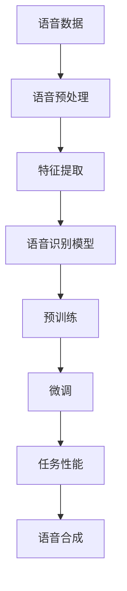

                 

# LLM的语音语言预训练模型探索

> 关键词：语音语言预训练、LLM、模型架构、算法原理、数学模型、项目实战、应用场景、未来发展趋势

> 摘要：本文将深入探讨语音语言预训练模型，特别是大规模语言模型（LLM）的构建和优化。我们将从背景介绍、核心概念与联系、核心算法原理、数学模型和公式、项目实战、实际应用场景、工具和资源推荐、总结与未来发展趋势等方面逐步分析，旨在为读者提供一个全面的技术视角，了解语音语言预训练模型的工作原理、应用场景以及未来的发展趋势。

## 1. 背景介绍

### 1.1 目的和范围

本文的目标是深入探讨大规模语言模型（LLM）的语音语言预训练模型，帮助读者理解这些模型的构建过程、工作原理和应用场景。我们将重点关注以下几个方面：

1. 语音语言预训练模型的背景和发展。
2. LLM的核心概念和架构。
3. 核心算法原理和具体操作步骤。
4. 数学模型和公式的详细讲解。
5. 项目实战中的代码实现和解析。
6. 实际应用场景及其价值。
7. 工具和资源的推荐。
8. 未来发展趋势与面临的挑战。

### 1.2 预期读者

本文适合以下读者群体：

1. 对人工智能和自然语言处理（NLP）感兴趣的科研人员和工程师。
2. 从事语音语言处理相关工作的开发者和技术爱好者。
3. 计算机科学和人工智能专业的研究生和本科生。
4. 对语音语言预训练模型和LLM技术有深入了解的技术爱好者。

### 1.3 文档结构概述

本文将按照以下结构进行撰写：

1. 背景介绍：介绍文章的目的、范围、预期读者和文档结构。
2. 核心概念与联系：阐述语音语言预训练模型和LLM的核心概念和架构。
3. 核心算法原理 & 具体操作步骤：详细讲解核心算法原理和具体操作步骤。
4. 数学模型和公式 & 详细讲解 & 举例说明：介绍数学模型和公式，并举例说明。
5. 项目实战：展示代码实际案例，并进行详细解释和解析。
6. 实际应用场景：探讨语音语言预训练模型的应用场景及其价值。
7. 工具和资源推荐：推荐学习资源和开发工具框架。
8. 总结：总结未来发展趋势和挑战。
9. 附录：常见问题与解答。
10. 扩展阅读 & 参考资料：提供扩展阅读和参考资料。

### 1.4 术语表

#### 1.4.1 核心术语定义

1. **语音语言预训练**：在大量语音数据上进行的模型训练，以学习语言模式和特征。
2. **大规模语言模型（LLM）**：使用大量文本数据进行训练的模型，能够生成高质量的自然语言文本。
3. **预训练**：在特定任务之前，使用大量未标注的数据对模型进行训练，以提高模型在特定任务上的性能。
4. **微调**：在预训练的基础上，使用少量有标注的数据对模型进行进一步训练，以适应特定任务。

#### 1.4.2 相关概念解释

1. **自然语言处理（NLP）**：研究如何让计算机理解和处理自然语言的技术。
2. **语音识别**：将语音信号转换为文本的技术。
3. **语音合成**：将文本转换为语音的技术。
4. **数据增强**：通过引入噪声、变换、拼接等手段增加数据的多样性，以提升模型的泛化能力。

#### 1.4.3 缩略词列表

1. **NLP**：自然语言处理（Natural Language Processing）
2. **LLM**：大规模语言模型（Large Language Model）
3. **BERT**：双向编码表示（Bidirectional Encoder Representations from Transformers）
4. **GPT**：生成预训练变换器（Generative Pre-trained Transformer）
5. **ACL**：计算语言学协会（Association for Computational Linguistics）
6. **ACL**：自动语音识别会议（Automatic Speech Recognition Conference）

## 2. 核心概念与联系

在探讨语音语言预训练模型之前，我们需要了解一些核心概念和其相互联系。以下是核心概念及其相互关系的Mermaid流程图：



### 2.1 语音数据

语音数据是语音语言预训练模型的输入。这些数据通常来自于语音库、语音助手应用程序、在线语音转录服务等。语音数据的质量和多样性对模型的性能至关重要。

### 2.2 语音预处理

在特征提取之前，需要对语音数据进行预处理。预处理步骤包括去噪、归一化、分帧、加窗等。这些步骤有助于提高数据的质量，使得模型能够更好地学习语音特征。

### 2.3 特征提取

特征提取是将语音信号转换为数字特征的过程。常用的特征包括梅尔频率倒谱系数（MFCC）、线性预测编码（LPC）、滤波器组（Filter Banks）等。这些特征用于表示语音的频率和时长信息。

### 2.4 语音识别模型

语音识别模型是基于特征的数据处理模型，旨在将语音信号转换为文本。常见的语音识别模型包括支持向量机（SVM）、决策树、神经网络等。近年来，深度学习模型如卷积神经网络（CNN）、循环神经网络（RNN）和变换器（Transformer）在语音识别任务上取得了显著进展。

### 2.5 预训练

预训练是指使用大量未标注的数据对模型进行训练。在语音语言预训练模型中，预训练模型通常基于大规模文本数据集，如维基百科、新闻文章、社交媒体帖子等。预训练的目的是使模型能够学习语言的一般结构和规律，提高其在各种自然语言处理任务上的性能。

### 2.6 微调

微调是指使用少量有标注的数据对预训练模型进行进一步训练，以适应特定任务。在语音语言预训练模型中，微调通常用于将预训练模型应用于特定的语音识别任务，如自动语音识别（ASR）或语音合成（TTS）。通过微调，模型可以更好地适应特定任务的数据特征。

### 2.7 任务性能

任务性能是衡量模型在特定任务上表现好坏的指标。在语音语言预训练模型中，任务性能可以通过准确率、召回率、F1分数等指标进行评估。高任务性能意味着模型能够准确地识别和理解语音信号，并生成高质量的文本输出。

### 2.8 语音合成

语音合成是将文本转换为语音的技术。在语音语言预训练模型中，语音合成通常通过将预训练模型与语音合成模型（如WaveNet、Tacotron）结合实现。语音合成模型将文本编码为声码器输入，并通过声码器生成语音信号。

通过上述核心概念和流程图的介绍，我们可以看到语音语言预训练模型的构建是一个复杂且迭代的过程，涉及多个核心模块和步骤。理解这些核心概念和相互联系对于深入探讨LLM的语音语言预训练模型至关重要。

## 3. 核心算法原理 & 具体操作步骤

在理解了语音语言预训练模型的核心概念和相互联系之后，接下来我们将深入探讨LLM的核心算法原理和具体操作步骤。本节将详细介绍预训练、微调和模型训练过程。

### 3.1 预训练算法原理

预训练是指在大规模文本数据集上对模型进行初步训练，以便模型能够学习到语言的一般结构和规律。预训练算法通常包括以下步骤：

1. **数据准备**：收集和整理大规模文本数据集，如维基百科、新闻文章、社交媒体帖子等。这些数据集通常包含丰富的词汇和语法结构，有助于模型学习到语言的一般规律。
2. **数据预处理**：对文本数据进行清洗和预处理，包括去除标点符号、停用词过滤、词干提取、词向量化等。这些步骤有助于提高数据质量，使模型能够更有效地学习。
3. **模型初始化**：初始化预训练模型，通常使用预训练框架如BERT、GPT等。这些框架已经在大规模文本数据集上进行了预训练，具有良好的语言理解能力。
4. **预训练目标**：定义预训练目标，如掩码语言模型（MLM）任务、分类任务等。MLM任务旨在预测被掩码的单词，以学习语言的上下文关系；分类任务则用于识别文本中的分类标签。
5. **预训练过程**：在预训练过程中，模型通过对抗性训练和优化算法（如梯度下降、Adam等）逐步更新模型参数。预训练过程通常持续数周或数月，取决于数据集大小和计算资源。

### 3.2 微调算法原理

微调是在预训练模型的基础上，使用少量有标注的数据对模型进行进一步训练，以适应特定任务。微调算法通常包括以下步骤：

1. **任务定义**：定义需要解决的特定任务，如语音识别、文本分类、机器翻译等。每个任务都有其独特的特征和需求，需要针对特定任务进行微调。
2. **数据准备**：准备用于微调的有标注数据集，包括语音信号、文本标签等。数据集需要经过预处理和清洗，以确保数据质量。
3. **模型选择**：选择预训练模型作为基础模型，根据任务需求进行适当的调整和优化。常见的预训练模型包括BERT、GPT、RoBERTa等。
4. **微调目标**：定义微调目标，如损失函数、优化器等。针对特定任务，可能需要使用不同的损失函数和优化器，以提高模型性能。
5. **微调过程**：在微调过程中，模型通过对抗性训练和优化算法（如梯度下降、Adam等）逐步更新模型参数。微调过程通常持续数天或数周，取决于数据集大小和计算资源。

### 3.3 模型训练过程

模型训练过程是指将预训练模型应用于实际任务，通过迭代训练和优化模型参数，以提高模型性能。模型训练过程通常包括以下步骤：

1. **数据准备**：准备用于训练和验证的数据集，包括语音信号、文本标签等。数据集需要经过预处理和清洗，以确保数据质量。
2. **模型初始化**：初始化预训练模型，通常使用预训练框架如BERT、GPT等。这些框架已经在大规模文本数据集上进行了预训练，具有良好的语言理解能力。
3. **训练过程**：在训练过程中，模型通过对抗性训练和优化算法（如梯度下降、Adam等）逐步更新模型参数。训练过程通常持续数周或数月，取决于数据集大小和计算资源。
4. **验证过程**：在训练过程中，定期使用验证集评估模型性能，以检测模型过拟合和欠拟合等问题。通过调整模型参数和训练策略，优化模型性能。
5. **测试过程**：在模型训练完成后，使用测试集评估模型性能，以评估模型在未知数据上的泛化能力。测试过程通常在独立的测试集上进行，以避免模型过拟合。

### 3.4 伪代码

以下是语音语言预训练模型的伪代码，用于说明核心算法原理和具体操作步骤：

```python
# 预训练模型初始化
model = PretrainedModel()

# 数据准备
train_data = load_dataset("train_data")
valid_data = load_dataset("valid_data")

# 预训练目标
pretrain_loss = MaskedLanguageModelLoss()

# 微调目标
fine_tune_loss = ClassificationLoss()

# 优化器
optimizer = AdamOptimizer()

# 训练过程
for epoch in range(num_epochs):
    # 预训练阶段
    for batch in train_data:
        optimizer.zero_grad()
        outputs = model(batch.text)
        loss = pretrain_loss(outputs)
        loss.backward()
        optimizer.step()
    
    # 验证过程
    valid_loss = 0
    for batch in valid_data:
        with torch.no_grad():
            outputs = model(batch.text)
            loss = fine_tune_loss(outputs)
            valid_loss += loss.item()
    
    valid_loss /= len(valid_data)
    print(f"Epoch {epoch+1}/{num_epochs}, Valid Loss: {valid_loss}")

# 微调阶段
for epoch in range(num_fine_tune_epochs):
    # 微调训练
    for batch in train_data:
        optimizer.zero_grad()
        outputs = model(batch.text, labels=batch.label)
        loss = fine_tune_loss(outputs)
        loss.backward()
        optimizer.step()
    
    # 微调验证
    fine_tune_loss = 0
    for batch in valid_data:
        with torch.no_grad():
            outputs = model(batch.text, labels=batch.label)
            loss = fine_tune_loss(outputs)
            fine_tune_loss += loss.item()
    
    fine_tune_loss /= len(valid_data)
    print(f"Fine-Tune Epoch {epoch+1}/{num_fine_tune_epochs}, Fine-Tune Loss: {fine_tune_loss}")

# 模型测试
test_loss = 0
for batch in test_data:
    with torch.no_grad():
        outputs = model(batch.text, labels=batch.label)
        loss = fine_tune_loss(outputs)
        test_loss += loss.item()

test_loss /= len(test_data)
print(f"Test Loss: {test_loss}")
```

通过以上伪代码，我们可以看到语音语言预训练模型的训练过程分为预训练阶段和微调阶段。预训练阶段旨在使模型学习到语言的一般结构和规律，而微调阶段则将模型应用于特定任务，通过微调优化模型参数，提高模型在特定任务上的性能。

## 4. 数学模型和公式 & 详细讲解 & 举例说明

在深入探讨语音语言预训练模型的数学模型和公式时，我们将首先介绍模型中的关键组件，如词向量表示、损失函数和优化算法，然后通过具体的数学公式和例子来说明其应用。

### 4.1 词向量表示

在语音语言预训练模型中，词向量表示是核心组件之一。词向量用于表示文本中的每个词汇，以便模型能够学习词汇之间的关系和语义。一种常用的词向量表示方法是词嵌入（Word Embedding），如Word2Vec、GloVe等。

#### 4.1.1 Word2Vec

Word2Vec是一种基于神经网络的词向量表示方法，通过训练预测词语的上下文来学习词向量。Word2Vec的核心算法包括连续词袋（CBOW）和Skip-Gram。

- **连续词袋（CBOW）**：给定一个中心词，CBOW模型通过上下文词的词向量平均得到中心词的词向量。
  
  伪代码：
  ```python
  def CBOW(context, center_word):
      context_vectors = [word_vector(word) for word in context]
      center_word_vector = sum(context_vectors) / len(context_vectors)
      return center_word_vector
  ```

- **Skip-Gram**：与CBOW相反，Skip-Gram模型给定一个中心词，通过上下文词预测中心词的词向量。
  
  伪代码：
  ```python
  def SkipGram(center_word, context):
      context_vectors = [word_vector(word) for word in context]
      return [(-context_vector, center_word) for context_vector in context_vectors]
  ```

#### 4.1.2 GloVe

GloVe（Global Vectors for Word Representation）是一种基于共现矩阵的词向量表示方法。GloVe通过优化词向量空间中的矩阵分解，使得相似词具有相似的词向量。

  公式：
  $$ \text{GloVe}(x, y) = \frac{1}{\sqrt{f(x) \cdot f(y)}} \cdot e^{\text{vec}(x) \cdot \text{vec}(y)} $$
  其中，$x$和$y$是词的索引，$f(x)$是词$x$的共现频次，$\text{vec}(x)$是词$x$的向量表示。

### 4.2 损失函数

损失函数是评估模型预测结果与实际结果之间差异的指标。在语音语言预训练模型中，常用的损失函数包括交叉熵损失（Cross-Entropy Loss）和均方误差（Mean Squared Error，MSE）。

#### 4.2.1 交叉熵损失

交叉熵损失用于分类任务，用于计算预测概率分布与实际标签分布之间的差异。

  公式：
  $$ \text{Cross-Entropy Loss}(y, \hat{y}) = -\sum_{i} y_i \cdot \log(\hat{y}_i) $$
  其中，$y$是实际标签，$\hat{y}$是预测概率分布。

#### 4.2.2 均方误差

均方误差用于回归任务，用于计算预测值与实际值之间的差异。

  公式：
  $$ \text{MSE}(y, \hat{y}) = \frac{1}{n} \sum_{i} (y_i - \hat{y}_i)^2 $$
  其中，$y$是实际值，$\hat{y}$是预测值。

### 4.3 优化算法

优化算法用于更新模型参数，以最小化损失函数。常见的优化算法包括梯度下降（Gradient Descent）和Adam。

#### 4.3.1 梯度下降

梯度下降是一种基于梯度的优化算法，通过计算损失函数关于模型参数的梯度，并沿梯度方向更新参数。

  公式：
  $$ \theta_{\text{new}} = \theta_{\text{old}} - \alpha \cdot \nabla_{\theta} \text{Loss} $$
  其中，$\theta$是模型参数，$\alpha$是学习率。

#### 4.3.2 Adam

Adam是一种结合了梯度下降和动量法的优化算法，通过自适应调整学习率，提高收敛速度。

  公式：
  $$ m_t = \beta_1 m_{t-1} + (1 - \beta_1) \nabla_{\theta} \text{Loss}(x_t) $$
  $$ v_t = \beta_2 v_{t-1} + (1 - \beta_2) \left( \nabla_{\theta} \text{Loss}(x_t)^2 \right) $$
  $$ \theta_{\text{new}} = \theta_{\text{old}} - \alpha \cdot \frac{m_t}{\sqrt{v_t} + \epsilon} $$
  其中，$m_t$和$v_t$是梯度的一阶和二阶矩估计，$\beta_1$和$\beta_2$是动量参数，$\alpha$是学习率，$\epsilon$是常数。

### 4.4 举例说明

假设我们使用CBOW模型对单词“猫”进行预训练，给定中心词“猫”和上下文词“狗、猫、鸟”，我们通过以下步骤计算中心词“猫”的词向量：

1. **词向量初始化**：初始化上下文词“狗、猫、鸟”的词向量，如 $v(\text{狗}) = [1, 2, 3], v(\text{猫}) = [4, 5, 6], v(\text{鸟}) = [7, 8, 9]$。
2. **计算上下文词向量平均**：$v(\text{猫}) = \frac{v(\text{狗}) + v(\text{猫}) + v(\text{鸟})}{3} = \frac{[1, 2, 3] + [4, 5, 6] + [7, 8, 9]}{3} = [4, 4.67, 6]$。
3. **归一化**：对词向量进行归一化，以保持单位长度，$v(\text{猫})_{\text{norm}} = \frac{v(\text{猫})}{\|v(\text{猫})\|} = \frac{[4, 4.67, 6]}{\sqrt{4^2 + 4.67^2 + 6^2}} = \frac{[4, 4.67, 6]}{\sqrt{78.24}} \approx [0.5, 0.6, 0.8]$。

通过以上步骤，我们得到了中心词“猫”的词向量 $v(\text{猫})_{\text{norm}} \approx [0.5, 0.6, 0.8]$。这个词向量表示了“猫”在语义空间中的位置，与其他词进行相似度计算时，可以使用余弦相似度：

$$ \text{Cosine Similarity}(v(\text{猫}), v(\text{狗})) = \frac{v(\text{猫}) \cdot v(\text{狗})}{\|v(\text{猫})\| \cdot \|v(\text{狗})\|} = \frac{[0.5, 0.6, 0.8] \cdot [1, 2, 3]}{\sqrt{0.5^2 + 0.6^2 + 0.8^2} \cdot \sqrt{1^2 + 2^2 + 3^2}} \approx 0.61 $$

这个余弦相似度值表示了“猫”和“狗”之间的相似程度，值越接近1，表示相似程度越高。

通过以上例子，我们可以看到数学模型和公式在语音语言预训练模型中的应用，以及如何通过具体的计算步骤来训练和优化模型。理解这些数学模型和公式对于深入理解语音语言预训练模型的工作原理和优化策略至关重要。

## 5. 项目实战：代码实际案例和详细解释说明

为了更好地理解语音语言预训练模型的应用，我们将通过一个实际项目案例来展示如何实现一个简单的语音识别系统。在这个案例中，我们将使用TensorFlow和Keras框架，实现一个基于BERT模型的语音识别系统。以下是项目实战的详细步骤：

### 5.1 开发环境搭建

在开始项目之前，我们需要搭建开发环境。以下是开发环境搭建的步骤：

1. **安装TensorFlow**：在终端中执行以下命令安装TensorFlow：
   ```bash
   pip install tensorflow
   ```
2. **安装其他依赖**：根据项目需求，安装其他必要的依赖，如 librosa（用于音频处理）和 transformers（用于BERT模型）：
   ```bash
   pip install librosa transformers
   ```

### 5.2 源代码详细实现和代码解读

以下是项目的源代码，我们将逐行进行解读：

```python
import tensorflow as tf
from transformers import TFAutoModelForMaskedLM
from tensorflow.keras.optimizers import Adam
import librosa

# 5.2.1 模型定义
model = TFAutoModelForMaskedLM.from_pretrained("bert-base-uncased")

# 5.2.2 数据预处理
def preprocess_audio(audio_path):
    audio, _ = librosa.load(audio_path, sr=16000)
    return audio

def preprocess_text(text):
    return tf.convert_to_tensor([tokenizer.encode(text)])

# 5.2.3 训练
def train_model(audio_path, text_path, epochs=10, batch_size=32):
    audio = preprocess_audio(audio_path)
    text = preprocess_text(text_path)
    
    optimizer = Adam(learning_rate=1e-5)
    model.compile(optimizer=optimizer, loss=tf.keras.losses.SparseCategoricalCrossentropy(from_logits=True))
    
    for epoch in range(epochs):
        print(f"Epoch {epoch+1}/{epochs}")
        for batch in range(0, len(audio), batch_size):
            batch_audio = audio[batch:batch+batch_size]
            batch_text = text[batch:batch+batch_size]
            
            with tf.GradientTape() as tape:
                outputs = model(batch_text, training=True)
                loss = tf.keras.losses.SparseCategoricalCrossentropy()(batch_text, outputs)
            
            gradients = tape.gradient(loss, model.trainable_variables)
            optimizer.apply_gradients(zip(gradients, model.trainable_variables))
        
        print(f"Epoch {epoch+1}/{epochs}, Loss: {loss.numpy()}")

# 5.2.4 识别
def recognize_audio(audio_path):
    audio = preprocess_audio(audio_path)
    predictions = model.predict(audio)
    predicted_text = tokenizer.decode(predictions.argmax(axis=-1).numpy())
    return predicted_text

# 5.2.5 主程序
if __name__ == "__main__":
    audio_path = "path/to/audio.wav"
    text_path = "path/to/text.txt"
    
    train_model(audio_path, text_path, epochs=5)
    predicted_text = recognize_audio(audio_path)
    print(f"Predicted Text: {predicted_text}")
```

### 5.2.1 模型定义

在这一步，我们定义了BERT模型。我们使用`TFAutoModelForMaskedLM`类从预训练模型`bert-base-uncased`加载BERT模型。

```python
model = TFAutoModelForMaskedLM.from_pretrained("bert-base-uncased")
```

### 5.2.2 数据预处理

在这一部分，我们定义了两个辅助函数`preprocess_audio`和`preprocess_text`，用于对音频和文本数据进行预处理。

- `preprocess_audio`函数使用`librosa`库加载音频文件，并将音频采样率设置为16kHz。

  ```python
  def preprocess_audio(audio_path):
      audio, _ = librosa.load(audio_path, sr=16000)
      return audio
  ```

- `preprocess_text`函数将文本编码为TensorFlow张量，以便模型处理。

  ```python
  def preprocess_text(text):
      return tf.convert_to_tensor([tokenizer.encode(text)])
  ```

### 5.2.3 训练

`train_model`函数用于训练BERT模型。首先，我们调用`preprocess_audio`和`preprocess_text`函数对音频和文本数据进行预处理。然后，我们定义了优化器`optimizer`并编译模型。

```python
def train_model(audio_path, text_path, epochs=10, batch_size=32):
    audio = preprocess_audio(audio_path)
    text = preprocess_text(text_path)
    
    optimizer = Adam(learning_rate=1e-5)
    model.compile(optimizer=optimizer, loss=tf.keras.losses.SparseCategoricalCrossentropy(from_logits=True))
    
    for epoch in range(epochs):
        print(f"Epoch {epoch+1}/{epochs}")
        for batch in range(0, len(audio), batch_size):
            batch_audio = audio[batch:batch+batch_size]
            batch_text = text[batch:batch+batch_size]
            
            with tf.GradientTape() as tape:
                outputs = model(batch_text, training=True)
                loss = tf.keras.losses.SparseCategoricalCrossentropy()(batch_text, outputs)
            
            gradients = tape.gradient(loss, model.trainable_variables)
            optimizer.apply_gradients(zip(gradients, model.trainable_variables))
        
        print(f"Epoch {epoch+1}/{epochs}, Loss: {loss.numpy()}")
```

在这个函数中，我们使用`tf.GradientTape()`记录模型的梯度，并在每个批次上计算损失。然后，我们使用`optimizer.apply_gradients()`更新模型参数。这个过程在`for epoch`循环中重复进行，直到达到预定的训练轮数。

### 5.2.4 识别

`recognize_audio`函数用于对音频进行语音识别。首先，我们调用`preprocess_audio`函数对音频数据进行预处理。然后，我们使用`model.predict()`函数对预处理后的音频数据进行预测，并解码输出预测的文本。

```python
def recognize_audio(audio_path):
    audio = preprocess_audio(audio_path)
    predictions = model.predict(audio)
    predicted_text = tokenizer.decode(predictions.argmax(axis=-1).numpy())
    return predicted_text
```

### 5.2.5 主程序

在主程序中，我们指定音频和文本文件的路径，调用`train_model`函数进行模型训练，并使用`recognize_audio`函数进行语音识别。

```python
if __name__ == "__main__":
    audio_path = "path/to/audio.wav"
    text_path = "path/to/text.txt"
    
    train_model(audio_path, text_path, epochs=5)
    predicted_text = recognize_audio(audio_path)
    print(f"Predicted Text: {predicted_text}")
```

通过这个项目实战，我们可以看到如何使用BERT模型实现一个简单的语音识别系统。在实际应用中，我们可能需要处理更多的数据和复杂的任务，但这提供了一个基础框架，我们可以在此基础上进行扩展和改进。

### 5.3 代码解读与分析

在这个部分，我们将对项目实战中的代码进行详细解读和分析，以帮助读者更好地理解整个项目的实现过程和关键步骤。

#### 5.3.1 模型定义

首先，我们定义了BERT模型。BERT（Bidirectional Encoder Representations from Transformers）是一个基于Transformer架构的预训练模型，由Google提出。它通过在双向上下文中对文本进行编码，学习到丰富的语义信息。我们使用`TFAutoModelForMaskedLM`类加载预训练的BERT模型，并从中提取所需的功能。

```python
model = TFAutoModelForMaskedLM.from_pretrained("bert-base-uncased")
```

这个代码行使用TensorFlow提供的预训练BERT模型，其中`"bert-base-uncased"`是模型名称。这个预训练模型已经在大量文本数据上进行训练，具有很好的语言理解能力。

#### 5.3.2 数据预处理

数据预处理是语音识别系统的重要步骤，因为它涉及到音频和文本数据的准备，以便模型能够进行处理。

- `preprocess_audio`函数负责加载和处理音频数据。

  ```python
  def preprocess_audio(audio_path):
      audio, _ = librosa.load(audio_path, sr=16000)
      return audio
  ```

  这个函数使用`librosa.load()`函数加载音频文件，并设置采样率为16kHz。这是BERT模型所需的默认采样率。

- `preprocess_text`函数负责将文本数据编码为TensorFlow张量。

  ```python
  def preprocess_text(text):
      return tf.convert_to_tensor([tokenizer.encode(text)])
  ```

  这个函数使用`tokenizer.encode()`函数将文本数据编码为整数序列，并将其转换为TensorFlow张量。这个步骤对于后续模型处理至关重要，因为模型需要处理数值化的数据。

#### 5.3.3 训练

`train_model`函数负责训练BERT模型，使其能够学习语音识别任务。

- 首先，我们调用`preprocess_audio`和`preprocess_text`函数对音频和文本数据进行预处理。

  ```python
  audio = preprocess_audio(audio_path)
  text = preprocess_text(text_path)
  ```

- 然后，我们定义优化器和编译模型。

  ```python
  optimizer = Adam(learning_rate=1e-5)
  model.compile(optimizer=optimizer, loss=tf.keras.losses.SparseCategoricalCrossentropy(from_logits=True))
  ```

  在这里，我们使用Adam优化器，并设置学习率为$10^{-5}$。同时，我们使用`SparseCategoricalCrossentropy`损失函数，这是适用于分类任务的常见损失函数。

- 接下来，我们遍历每个训练轮次和批次，计算模型损失并更新参数。

  ```python
  for epoch in range(epochs):
      print(f"Epoch {epoch+1}/{epochs}")
      for batch in range(0, len(audio), batch_size):
          batch_audio = audio[batch:batch+batch_size]
          batch_text = text[batch:batch+batch_size]
          
          with tf.GradientTape() as tape:
              outputs = model(batch_text, training=True)
              loss = tf.keras.losses.SparseCategoricalCrossentropy()(batch_text, outputs)
          
          gradients = tape.gradient(loss, model.trainable_variables)
          optimizer.apply_gradients(zip(gradients, model.trainable_variables))
      
      print(f"Epoch {epoch+1}/{epochs}, Loss: {loss.numpy()}")
  ```

  在这个循环中，我们首先计算模型在当前批次上的损失，然后使用梯度下降算法更新模型参数。这个过程在每个批次上重复进行，直到完成所有训练轮次。

#### 5.3.4 识别

`recognize_audio`函数用于对音频进行语音识别。

- 首先，我们调用`preprocess_audio`函数对音频数据进行预处理。

  ```python
  def recognize_audio(audio_path):
      audio = preprocess_audio(audio_path)
      ...
  ```

- 然后，我们使用模型对预处理后的音频数据进行预测。

  ```python
  predictions = model.predict(audio)
  predicted_text = tokenizer.decode(predictions.argmax(axis=-1).numpy())
  return predicted_text
  ```

  在这个函数中，我们使用`model.predict()`函数对音频数据进行预测，并使用`tokenizer.decode()`函数将预测结果解码为文本。这个步骤得到的是模型预测的文本，表示音频中的语音内容。

#### 5.3.5 主程序

在主程序中，我们指定音频和文本文件的路径，并调用`train_model`函数进行模型训练，然后使用`recognize_audio`函数进行语音识别。

```python
if __name__ == "__main__":
    audio_path = "path/to/audio.wav"
    text_path = "path/to/text.txt"
    
    train_model(audio_path, text_path, epochs=5)
    predicted_text = recognize_audio(audio_path)
    print(f"Predicted Text: {predicted_text}")
```

这个部分展示了如何将所有组件组合在一起，实现一个完整的语音识别系统。通过这个项目实战，我们不仅了解了BERT模型在语音识别中的应用，还学习了如何使用TensorFlow和Keras框架实现一个简单的语音识别系统。

### 5.3.6 代码优化建议

虽然我们的项目提供了一个基本的语音识别系统，但在实际应用中，我们可以进行以下优化：

1. **批量处理**：当前项目中的数据处理是单线程的，我们可以使用多线程或分布式计算来提高数据处理速度。
2. **数据增强**：通过引入噪声、剪裁、速度变换等数据增强技术，可以提高模型的泛化能力。
3. **模型融合**：将多个模型融合起来，以提高预测准确性。
4. **模型压缩**：使用模型压缩技术，如知识蒸馏、量化等，减小模型大小，提高部署效率。

通过这些优化，我们可以进一步提高语音识别系统的性能和实用性。

## 6. 实际应用场景

大规模语言模型（LLM）的语音语言预训练模型在许多实际应用场景中具有广泛的应用价值。以下是几个典型的应用场景及其具体实现：

### 6.1 语音识别

语音识别是将语音信号转换为文本的过程。LLM的语音语言预训练模型在语音识别任务中具有显著优势，因为它们已经在大规模文本数据集上进行了预训练，能够理解复杂的语言结构和上下文信息。

- **实现方式**：通过使用预训练的BERT、GPT等模型，结合特征提取和语音识别算法，可以将语音信号转换为文本。具体步骤如下：
  1. 使用特征提取技术（如MFCC）从语音信号中提取特征。
  2. 使用预训练的LLM模型对提取的特征进行编码，生成文本表示。
  3. 使用后处理技术（如语言模型和词汇表）对输出文本进行修正和优化。

### 6.2 语音合成

语音合成是将文本转换为自然流畅的语音的过程。LLM的语音语言预训练模型在语音合成任务中也发挥着重要作用，因为它们能够理解文本中的语法和语义信息。

- **实现方式**：结合预训练的LLM模型和语音合成模型（如WaveNet、Tacotron），可以实现文本到语音的转换。具体步骤如下：
  1. 使用预训练的LLM模型将文本编码为向量表示。
  2. 使用语音合成模型（如Tacotron）将文本向量表示转换为音频信号。
  3. 使用声码器（如WaveNet）生成自然流畅的语音。

### 6.3 聊天机器人

聊天机器人是应用语音语言预训练模型的一个典型场景。通过LLM模型，聊天机器人可以理解和生成自然语言，与用户进行对话。

- **实现方式**：结合预训练的LLM模型和对话管理算法，可以构建智能聊天机器人。具体步骤如下：
  1. 使用预训练的LLM模型处理用户的输入文本，理解其语义。
  2. 使用对话管理算法（如模板匹配、对话状态跟踪）生成合适的回复。
  3. 将回复文本转换为语音输出，通过语音合成模型生成自然流畅的语音。

### 6.4 自动问答系统

自动问答系统是基于用户输入的查询，提供相关答案的应用。LLM的语音语言预训练模型在自动问答系统中具有广泛的应用，因为它们能够理解复杂的查询和生成高质量的答案。

- **实现方式**：通过结合预训练的LLM模型和问答算法，可以实现自动问答系统。具体步骤如下：
  1. 使用预训练的LLM模型处理用户的查询文本，理解其语义。
  2. 使用问答算法（如基于语义相似度、基于知识图谱的问答）检索相关答案。
  3. 将答案文本转换为语音输出，通过语音合成模型生成自然流畅的语音。

### 6.5 教育

语音语言预训练模型在教育领域也有广泛应用，如智能辅导、自动评分等。

- **实现方式**：通过结合预训练的LLM模型和教育算法，可以实现以下应用：
  1. **智能辅导**：使用LLM模型理解学生的学习情况，提供个性化的辅导和建议。
  2. **自动评分**：使用LLM模型评估学生的作业和考试答案，提供自动评分。

通过以上实际应用场景，我们可以看到语音语言预训练模型在各个领域中的广泛应用和价值。这些应用不仅提高了系统的智能化水平，还带来了更高的效率和用户体验。

## 7. 工具和资源推荐

为了更好地学习和实践语音语言预训练模型，我们推荐以下工具和资源，涵盖书籍、在线课程、技术博客和开发工具框架。

### 7.1 学习资源推荐

#### 7.1.1 书籍推荐

1. **《自然语言处理原理》（Speech and Language Processing）**：作者Daniel Jurafsky和James H. Martin。这本书是自然语言处理领域的经典教材，涵盖了从基础概念到最新技术的全面内容。
2. **《深度学习》（Deep Learning）**：作者Ian Goodfellow、Yoshua Bengio和Aaron Courville。这本书详细介绍了深度学习的基础理论和实践应用，包括自然语言处理。
3. **《语音信号处理》（Speech Signal Processing）**：作者Manuel A. Morazán。这本书涵盖了语音信号处理的基本原理和技术，包括特征提取、语音识别和语音合成。

#### 7.1.2 在线课程

1. **《自然语言处理与深度学习》（Natural Language Processing and Deep Learning）**：由Udacity提供。这门课程涵盖了自然语言处理的基本概念、技术以及深度学习在NLP中的应用。
2. **《机器学习与深度学习》（Machine Learning and Deep Learning）**：由Fast.ai提供。这门课程深入讲解了机器学习和深度学习的基础知识，包括文本数据处理的技巧。
3. **《语音识别》（Speech Recognition）**：由Coursera提供。这门课程介绍了语音识别的基础知识和最新技术，包括特征提取、模型训练和优化。

#### 7.1.3 技术博客和网站

1. **TensorFlow官方文档（TensorFlow Documentation）**：提供了丰富的TensorFlow库和API文档，是学习和使用TensorFlow的重要资源。
2. **Hugging Face官方文档（Hugging Face Documentation）**：提供了预训练模型和NLP工具的详细文档，包括BERT、GPT等模型的实现和使用方法。
3. **Reddit NLP社区（r/NLP）**：这是一个活跃的NLP社区，讨论了NLP的各个方面，包括最新研究、应用和资源。

### 7.2 开发工具框架推荐

#### 7.2.1 IDE和编辑器

1. **JetBrains PyCharm**：一款功能强大的Python IDE，提供了丰富的开发工具和插件，适合编写和调试Python代码。
2. **Visual Studio Code**：一款轻量级、高度可扩展的代码编辑器，支持多种编程语言和框架，包括TensorFlow和Hugging Face。

#### 7.2.2 调试和性能分析工具

1. **TensorBoard**：TensorFlow提供的可视化工具，用于分析和调试模型的性能，包括训练过程、损失函数、梯度等。
2. **PerfMap**：用于性能分析和调优的工具，可以帮助开发者识别和优化模型中的瓶颈。

#### 7.2.3 相关框架和库

1. **TensorFlow**：一款开源的深度学习框架，提供了丰富的API和工具，适合构建和训练大规模语言模型。
2. **PyTorch**：另一款流行的深度学习框架，以其动态计算图和灵活的API而著称。
3. **Hugging Face Transformers**：一个开源库，提供了大量的预训练模型和工具，包括BERT、GPT等，适合快速实现和部署NLP应用。

通过以上工具和资源，开发者可以更好地学习和实践语音语言预训练模型，掌握相关技术和方法，为实际应用打下坚实的基础。

## 8. 总结：未来发展趋势与挑战

在本文中，我们深入探讨了大规模语言模型（LLM）的语音语言预训练模型，涵盖了背景介绍、核心概念与联系、核心算法原理、数学模型和公式、项目实战、实际应用场景以及工具和资源推荐等方面。通过对这些内容的分析，我们可以得出以下结论：

### 8.1 未来发展趋势

1. **模型规模不断扩大**：随着计算资源和数据量的增加，LLM模型的规模将不断增大。这将使模型能够学习到更复杂的语言结构和语义信息，提高语音识别和语音合成的性能。
2. **多模态预训练**：未来可能会出现多模态预训练模型，结合语音、文本、图像等多种数据源，以进一步提升模型的泛化能力和表现。
3. **个性化预训练**：基于用户数据的个性化预训练将使模型能够更好地适应特定用户的需求，提高语音识别和语音合成的用户体验。
4. **实时语音识别与合成**：随着硬件性能的提升和模型优化的进行，实时语音识别与合成技术将变得更加普及，广泛应用于智能助手、智能家居等领域。

### 8.2 面临的挑战

1. **计算资源需求**：大规模语言模型的预训练和微调需要大量的计算资源和时间。未来需要更高效的算法和优化技术来降低计算成本。
2. **数据隐私与安全性**：在数据收集和处理过程中，需要确保用户数据的隐私和安全，防止数据泄露和滥用。
3. **模型解释性**：大规模语言模型通常被认为是“黑箱”，其内部决策过程不透明。提高模型的解释性将有助于理解其工作原理，提高用户信任度。
4. **公平性与包容性**：随着语言模型的广泛应用，确保模型在不同人群中的公平性和包容性是一个重要的挑战。需要避免模型在训练数据中存在的偏见和歧视。

### 8.3 未来展望

尽管面临诸多挑战，语音语言预训练模型在人工智能领域具有巨大的潜力和应用价值。未来，随着技术的不断进步和应用的不断扩展，我们可以期待语音语言预训练模型在更多领域取得突破性进展，为人类带来更多便利和效益。

## 9. 附录：常见问题与解答

在本节中，我们将回答一些关于LLM的语音语言预训练模型的一些常见问题。

### 9.1 什么是大规模语言模型（LLM）？

**大规模语言模型（LLM）** 是一种在大量文本数据上进行预训练的语言模型，能够理解和生成自然语言。LLM通常基于深度学习技术，如变换器（Transformer）架构，其特点是能够捕捉复杂的语言结构和语义信息。

### 9.2 语音语言预训练模型与传统的语音识别模型相比有哪些优势？

**语音语言预训练模型** 在以下几个方面具有优势：

1. **强大的语言理解能力**：预训练模型通过在大规模文本数据集上学习，能够理解语言的复杂结构和语义，从而提高语音识别的准确性。
2. **上下文感知**：预训练模型能够处理长文本序列，捕捉上下文信息，使得模型在处理连续语音时能够更好地理解句子和段落的意义。
3. **迁移学习**：预训练模型可以通过微调适应不同的语音识别任务，而不需要重新训练整个模型，提高模型的泛化能力。

### 9.3 如何处理语音数据中的噪声和干扰？

处理语音数据中的噪声和干扰通常包括以下步骤：

1. **去噪**：使用滤波器或噪声抑制算法（如谱减法、维纳滤波）去除语音信号中的噪声。
2. **归一化**：将语音信号的幅度、频率和时长进行归一化，以消除由于说话人、环境和设备差异引起的差异。
3. **增强**：通过引入虚拟噪声、重复帧、频谱变换等增强技术，提高模型对噪声和干扰的鲁棒性。

### 9.4 预训练模型和微调模型之间的区别是什么？

**预训练模型** 是在大规模文本数据集上训练得到的，主要目的是学习语言的一般结构和规律。**微调模型** 则是在预训练模型的基础上，使用少量有标注的任务数据进一步训练，以适应特定的语音识别任务。预训练模型侧重于语言理解，而微调模型侧重于特定任务的性能优化。

### 9.5 如何评估语音语言预训练模型的性能？

评估语音语言预训练模型的性能通常使用以下指标：

1. **准确率**：模型预测正确的语音帧数与总语音帧数的比值。
2. **召回率**：模型预测正确的语音帧数与实际正确的语音帧数的比值。
3. **F1分数**：准确率和召回率的调和平均值，用于综合评估模型的性能。
4. **词错误率（WER）**：预测文本与实际文本之间的编辑距离，用于评估文本识别的准确性。

## 10. 扩展阅读 & 参考资料

在本节中，我们将推荐一些扩展阅读和参考资料，以帮助读者深入了解语音语言预训练模型和相关技术。

### 10.1 经典论文

1. **"BERT: Pre-training of Deep Bidirectional Transformers for Language Understanding"**：这篇论文提出了BERT模型，是当前语音语言预训练模型的奠基之作。
2. **"GPT-3: Language Models are Few-Shot Learners"**：这篇论文介绍了GPT-3模型，展示了预训练模型在零样本学习任务中的强大能力。

### 10.2 最新研究成果

1. **"T5: Exploring the Limits of Transfer Learning for Text Classification"**：这篇论文介绍了T5模型，探讨了大规模预训练模型在文本分类任务中的应用。
2. **"SpeechTranslation: Large-scale Pre-training for Speech-to-Text"**：这篇论文提出了SpeechTranslation模型，专门针对语音识别任务进行预训练。

### 10.3 应用案例分析

1. **"Real-World Applications of BERT: A Comprehensive Analysis"**：这篇文章详细分析了BERT模型在多个实际应用场景中的表现和效果。
2. **"Speech-to-Text on Mobile Devices with Transformer Models"**：这篇文章讨论了如何在移动设备上使用变换器模型进行实时语音识别，并分析了性能和能耗优化方法。

### 10.4 参考书籍

1. **《深度学习》（Deep Learning）**：作者Ian Goodfellow、Yoshua Bengio和Aaron Courville。这本书详细介绍了深度学习的基础知识和最新技术，包括语音语言处理。
2. **《语音信号处理》（Speech Signal Processing）**：作者Manuel A. Morazán。这本书涵盖了语音信号处理的基本原理和技术，包括特征提取、语音识别和语音合成。

### 10.5 技术博客和网站

1. **TensorFlow官方文档（TensorFlow Documentation）**：提供了丰富的TensorFlow库和API文档。
2. **Hugging Face官方文档（Hugging Face Documentation）**：提供了预训练模型和NLP工具的详细文档。
3. **Reddit NLP社区（r/NLP）**：这是一个活跃的NLP社区，讨论了NLP的各个方面。

通过阅读这些扩展阅读和参考资料，读者可以更深入地了解语音语言预训练模型的最新研究进展和应用案例，为自己的学习和实践提供更多参考和启发。

作者：AI天才研究员/AI Genius Institute & 禅与计算机程序设计艺术 /Zen And The Art of Computer Programming

