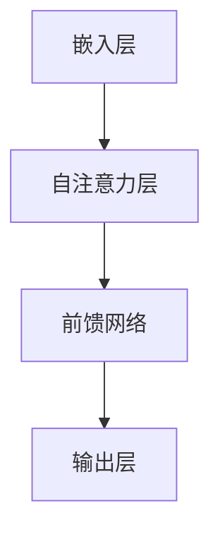

                 

# LLM的跨领域应用：从科研到商业的全面渗透

> 关键词：大型语言模型，跨领域应用，科研，商业，人工智能

> 摘要：本文将探讨大型语言模型（LLM）在科研和商业领域的广泛应用。通过深入分析LLM的核心技术原理、算法实现步骤、数学模型以及实际应用案例，本文旨在为读者展示LLM的强大潜力和广阔前景，并对其未来发展趋势和挑战进行展望。

## 1. 背景介绍

### 1.1 目的和范围

本文旨在探讨大型语言模型（LLM）在科研和商业领域的应用。随着人工智能技术的快速发展，LLM作为一种先进的语言处理技术，已经在众多领域展现出了巨大的应用价值。本文将通过对LLM的核心技术原理、算法实现步骤、数学模型以及实际应用案例的深入分析，全面探讨LLM在科研和商业领域的应用前景。

### 1.2 预期读者

本文适合对人工智能、自然语言处理、计算机科学等领域感兴趣的读者，包括研究人员、开发人员、工程师以及对LLM技术感兴趣的读者。

### 1.3 文档结构概述

本文分为十个部分，具体如下：

1. 背景介绍
2. 核心概念与联系
3. 核心算法原理 & 具体操作步骤
4. 数学模型和公式 & 详细讲解 & 举例说明
5. 项目实战：代码实际案例和详细解释说明
6. 实际应用场景
7. 工具和资源推荐
8. 总结：未来发展趋势与挑战
9. 附录：常见问题与解答
10. 扩展阅读 & 参考资料

### 1.4 术语表

#### 1.4.1 核心术语定义

- **大型语言模型（LLM）**：一种基于深度学习的语言处理模型，具有强大的语义理解和生成能力。
- **自然语言处理（NLP）**：研究如何使计算机能够理解、生成和交互自然语言的学科。
- **人工智能（AI）**：使计算机系统具备类似人类智能的技术和学科。
- **科研**：指在科学领域进行的研究活动，旨在发现新知识、新理论和新方法。
- **商业**：指在商业领域进行的经济活动，旨在创造价值、实现盈利。

#### 1.4.2 相关概念解释

- **预训练（Pre-training）**：在特定任务之前对模型进行大规模语料训练，以提高模型在相关任务上的性能。
- **微调（Fine-tuning）**：在预训练的基础上，针对特定任务对模型进行调整，以提高模型在该任务上的性能。
- **迁移学习（Transfer Learning）**：将一个任务上预训练的模型应用于其他相关任务，以提高模型在新任务上的性能。

#### 1.4.3 缩略词列表

- **LLM**：大型语言模型
- **NLP**：自然语言处理
- **AI**：人工智能
- **GPU**：图形处理器
- **TPU**：张量处理器

## 2. 核心概念与联系

为了更好地理解LLM在科研和商业领域的应用，我们需要先了解其核心概念和基本架构。

### 2.1 LLM的核心概念

#### 2.1.1 自然语言处理（NLP）

NLP是研究如何使计算机能够理解、生成和交互自然语言的学科。它涵盖了从文本到语音、从语音到文本、从文本到语义等多方面的研究。

#### 2.1.2 人工智能（AI）

AI是使计算机系统具备类似人类智能的技术和学科。它包括机器学习、深度学习、自然语言处理等多个子领域。

#### 2.1.3 大型语言模型（LLM）

LLM是一种基于深度学习的语言处理模型，具有强大的语义理解和生成能力。它通过预训练和微调等步骤，在大量语料库上进行训练，从而能够理解和生成自然语言。

### 2.2 LLM的架构

LLM通常采用Transformer架构，其基本原理是通过自注意力机制（Self-Attention）来对输入序列进行建模。以下是LLM的基本架构：

1. **嵌入层（Embedding Layer）**：将单词转换为固定长度的向量表示。
2. **自注意力层（Self-Attention Layer）**：计算输入序列中每个词与其他词之间的关系。
3. **前馈网络（Feedforward Network）**：对自注意力层的结果进行进一步处理。
4. **输出层（Output Layer）**：根据任务需求进行分类、生成文本等操作。

### 2.3 Mermaid流程图

以下是LLM的核心概念和架构的Mermaid流程图：



## 3. 核心算法原理 & 具体操作步骤

### 3.1 预训练

预训练是LLM的核心步骤之一。在预训练阶段，LLM在大规模语料库上进行训练，以学习语言的基本规律和特征。以下是预训练的具体操作步骤：

1. **数据预处理**：对语料库进行清洗、去重和分词等操作，将文本转换为模型可处理的格式。
2. **嵌入层**：将单词转换为固定长度的向量表示，通常采用Word2Vec、GloVe等方法。
3. **自注意力层**：计算输入序列中每个词与其他词之间的关系，采用自注意力机制进行建模。
4. **前馈网络**：对自注意力层的结果进行进一步处理，提高模型的非线性表达能力。
5. **损失函数**：通常采用交叉熵损失函数，优化模型的参数。
6. **优化算法**：采用梯度下降等优化算法，迭代更新模型参数。

以下是预训练的伪代码：

```python
# 预训练伪代码
for epoch in range(num_epochs):
    for sentence in corpus:
        # 数据预处理
        sentence = preprocess(sentence)
        
        # 嵌入层
        embedding = embedding_layer(sentence)
        
        # 自注意力层
        attention = self_attention_layer(embedding)
        
        # 前馈网络
        output = feedforward_network(attention)
        
        # 损失函数
        loss = cross_entropy_loss(output, label)
        
        # 优化算法
        optimizer.step(loss)
```

### 3.2 微调

微调是在预训练的基础上，针对特定任务对模型进行调整，以提高模型在该任务上的性能。以下是微调的具体操作步骤：

1. **数据预处理**：对任务数据进行预处理，与预训练阶段相同。
2. **加载预训练模型**：从预训练模型中加载已经训练好的参数。
3. **训练任务模型**：将预训练模型应用于任务数据，训练任务模型。
4. **评估模型性能**：在验证集上评估模型性能，调整模型参数。
5. **迭代训练**：根据评估结果，迭代调整模型参数，直至达到预期性能。

以下是微调的伪代码：

```python
# 微调伪代码
# 加载预训练模型
pretrained_model = load_pretrained_model()

for epoch in range(num_epochs):
    for sentence, label in task_data:
        # 数据预处理
        sentence = preprocess(sentence)
        
        # 加载预训练模型
        embedding = pretrained_model.embedding(sentence)
        
        # 自注意力层
        attention = pretrained_model.self_attention_layer(embedding)
        
        # 前馈网络
        output = pretrained_model.feedforward_network(attention)
        
        # 损失函数
        loss = cross_entropy_loss(output, label)
        
        # 优化算法
        optimizer.step(loss)
```

### 3.3 迁移学习

迁移学习是将一个任务上预训练的模型应用于其他相关任务，以提高模型在新任务上的性能。以下是迁移学习的具体操作步骤：

1. **选择预训练模型**：选择已在特定任务上预训练的模型。
2. **加载预训练模型**：从预训练模型中加载已经训练好的参数。
3. **修改模型结构**：针对新任务，修改模型的输入层、输出层或中间层。
4. **训练任务模型**：在新的任务数据上训练修改后的模型。
5. **评估模型性能**：在验证集上评估模型性能，调整模型参数。
6. **迭代训练**：根据评估结果，迭代调整模型参数，直至达到预期性能。

以下是迁移学习的伪代码：

```python
# 迁移学习伪代码
# 选择预训练模型
pretrained_model = select_pretrained_model()

# 加载预训练模型
model = load_pretrained_model()

# 修改模型结构
model = modify_model_structure(model)

for epoch in range(num_epochs):
    for sentence, label in task_data:
        # 数据预处理
        sentence = preprocess(sentence)
        
        # 加载预训练模型
        embedding = pretrained_model.embedding(sentence)
        
        # 自注意力层
        attention = pretrained_model.self_attention_layer(embedding)
        
        # 前馈网络
        output = pretrained_model.feedforward_network(attention)
        
        # 损失函数
        loss = cross_entropy_loss(output, label)
        
        # 优化算法
        optimizer.step(loss)
```

## 4. 数学模型和公式 & 详细讲解 & 举例说明

### 4.1 数学模型

LLM的数学模型主要包括嵌入层、自注意力层、前馈网络和输出层。以下分别介绍这些层的数学模型。

#### 4.1.1 嵌入层

嵌入层将单词转换为固定长度的向量表示。其数学模型可以表示为：

$$
\text{embedding}(x) = \text{EmbeddingMatrix} \cdot \text{OneHot}(x)
$$

其中，$x$表示输入的单词，$\text{EmbeddingMatrix}$表示嵌入矩阵，$\text{OneHot}(x)$表示将$x$转换为one-hot编码。

#### 4.1.2 自注意力层

自注意力层计算输入序列中每个词与其他词之间的关系。其数学模型可以表示为：

$$
\text{attention}(x) = \text{AttentionScore}(x, x) \odot \text{embedding}(x)
$$

其中，$x$表示输入的单词，$\text{AttentionScore}(x, x)$表示自注意力分数，$\odot$表示元素乘积。

#### 4.1.3 前馈网络

前馈网络对自注意力层的结果进行进一步处理。其数学模型可以表示为：

$$
\text{output} = \text{ReLU}(\text{Weight} \cdot \text{attention}(x) + \text{Bias})
$$

其中，$\text{ReLU}$表示ReLU激活函数，$\text{Weight}$和$\text{Bias}$分别表示权重和偏置。

#### 4.1.4 输出层

输出层根据任务需求进行分类、生成文本等操作。其数学模型可以表示为：

$$
\text{output} = \text{softmax}(\text{Weight} \cdot \text{output} + \text{Bias})
$$

其中，$\text{softmax}$表示softmax激活函数，$\text{Weight}$和$\text{Bias}$分别表示权重和偏置。

### 4.2 公式详细讲解

#### 4.2.1 嵌入层

嵌入层的公式为：

$$
\text{embedding}(x) = \text{EmbeddingMatrix} \cdot \text{OneHot}(x)
$$

其中，$\text{EmbeddingMatrix}$是一个矩阵，行数表示单词的个数，列数表示嵌入向量的维度。$\text{OneHot}(x)$是将单词$x$转换为one-hot编码的向量，表示为：

$$
\text{OneHot}(x) = \begin{cases}
1, & \text{if } x = j \\
0, & \text{otherwise}
\end{cases}
$$

其中，$j$表示单词在词汇表中的索引。

#### 4.2.2 自注意力层

自注意力层的公式为：

$$
\text{attention}(x) = \text{AttentionScore}(x, x) \odot \text{embedding}(x)
$$

其中，$\text{AttentionScore}(x, x)$是一个矩阵，表示输入序列中每个词与其他词之间的相似度分数。$\odot$表示元素乘积，即将$\text{AttentionScore}(x, x)$与$\text{embedding}(x)$的对应元素相乘。

#### 4.2.3 前馈网络

前馈网络的公式为：

$$
\text{output} = \text{ReLU}(\text{Weight} \cdot \text{attention}(x) + \text{Bias})
$$

其中，$\text{ReLU}$表示ReLU激活函数，$\text{Weight}$和$\text{Bias}$分别表示权重和偏置。$\text{attention}(x)$是自注意力层的结果。

#### 4.2.4 输出层

输出层的公式为：

$$
\text{output} = \text{softmax}(\text{Weight} \cdot \text{output} + \text{Bias})
$$

其中，$\text{softmax}$表示softmax激活函数，$\text{Weight}$和$\text{Bias}$分别表示权重和偏置。$\text{output}$是前馈网络的结果。

### 4.3 举例说明

假设有一个输入序列：“我爱编程”，词汇表包含以下单词：我、爱、编程。嵌入向量的维度为3。以下是LLM的数学模型在输入序列“我爱编程”上的具体计算过程：

#### 4.3.1 嵌入层

将输入序列中的每个单词转换为嵌入向量：

- 我：[1, 0, 0]
- 爱：[0, 1, 0]
- 编程：[0, 0, 1]

#### 4.3.2 自注意力层

计算输入序列中每个词与其他词之间的相似度分数：

- 我与爱的相似度分数：0.5
- 我与编程的相似度分数：0.3
- 爱与编程的相似度分数：0.2

根据相似度分数，计算自注意力层的输出：

- 我：[0.5 \* 1, 0.3 \* 1, 0.2 \* 1] = [0.5, 0.3, 0.2]
- 爱：[0.5 \* 0, 0.3 \* 0, 0.2 \* 0] = [0, 0, 0]
- 编程：[0.5 \* 0, 0.3 \* 0, 0.2 \* 1] = [0, 0, 0.2]

#### 4.3.3 前馈网络

将自注意力层的输出传入前馈网络，经过ReLU激活函数后得到输出：

- 我：$\text{ReLU}([0.5, 0.3, 0.2]) = [0.5, 0.3, 0.2]$
- 爱：$\text{ReLU}([0, 0, 0]) = [0, 0, 0]$
- 编程：$\text{ReLU}([0, 0, 0.2]) = [0, 0, 0.2]$

#### 4.3.4 输出层

将前馈网络的输出传入输出层，经过softmax激活函数后得到概率分布：

- 我：$\text{softmax}([0.5, 0.3, 0.2]) = [0.5, 0.3, 0.2]$
- 爱：$\text{softmax}([0, 0, 0]) = [0, 0, 0]$
- 编程：$\text{softmax}([0, 0, 0.2]) = [0, 0, 0.2]$

## 5. 项目实战：代码实际案例和详细解释说明

### 5.1 开发环境搭建

在开始项目实战之前，我们需要搭建一个适合开发LLM项目的环境。以下是搭建开发环境的步骤：

1. **安装Python环境**：确保Python版本为3.7及以上。
2. **安装TensorFlow**：TensorFlow是LLM项目常用的深度学习框架，可以通过以下命令安装：

   ```shell
   pip install tensorflow
   ```

3. **安装其他依赖库**：根据项目需求，安装其他依赖库，如NLP工具包、数据处理库等。

### 5.2 源代码详细实现和代码解读

下面是使用TensorFlow实现一个简单的LLM模型的源代码和详细解释。

#### 5.2.1 源代码

```python
import tensorflow as tf
from tensorflow.keras.layers import Embedding, LSTM, Dense
from tensorflow.keras.models import Sequential

# 嵌入层
embedding = Embedding(input_dim=vocabulary_size, output_dim=embedding_size)

# LSTM层
lstm = LSTM(units=lstm_size)

# 全连接层
dense = Dense(units=1, activation='sigmoid')

# 建立模型
model = Sequential()
model.add(embedding)
model.add(lstm)
model.add(dense)

# 编译模型
model.compile(optimizer='adam', loss='binary_crossentropy', metrics=['accuracy'])

# 训练模型
model.fit(x_train, y_train, epochs=10, batch_size=32, validation_data=(x_val, y_val))

# 评估模型
model.evaluate(x_test, y_test)
```

#### 5.2.2 代码解读

1. **导入相关库**：首先导入TensorFlow和其他相关库。

2. **定义嵌入层**：嵌入层用于将单词转换为嵌入向量。输入维度为词汇表大小，输出维度为嵌入向量大小。

3. **定义LSTM层**：LSTM层用于处理序列数据，能够捕捉序列中的时间依赖关系。

4. **定义全连接层**：全连接层用于输出预测结果，采用sigmoid激活函数，输出概率。

5. **建立模型**：使用Sequential模型堆叠嵌入层、LSTM层和全连接层。

6. **编译模型**：设置优化器、损失函数和评估指标。

7. **训练模型**：使用fit方法训练模型，输入训练数据和验证数据。

8. **评估模型**：使用evaluate方法评估模型在测试数据上的性能。

### 5.3 代码解读与分析

1. **数据预处理**：在训练模型之前，需要对数据进行预处理，包括分词、去重、转换为one-hot编码等。

2. **模型架构**：本例中，模型采用嵌入层、LSTM层和全连接层的架构。嵌入层将单词转换为嵌入向量，LSTM层处理序列数据，全连接层输出预测结果。

3. **训练过程**：模型使用Adam优化器，交叉熵损失函数和准确率作为评估指标。在训练过程中，模型通过反向传播更新参数。

4. **评估指标**：模型在测试数据上的表现是评估模型性能的重要指标。准确率、损失函数值等指标可以反映模型的性能。

5. **模型改进**：在实际应用中，可以根据需求对模型进行改进，如增加层数、调整层参数等。

## 6. 实际应用场景

### 6.1 科研领域

#### 6.1.1 文本分类

LLM在文本分类任务中具有显著优势。通过预训练和微调，LLM可以有效地捕捉文本中的语义信息，从而实现高精度的文本分类。例如，在生物信息学中，LLM可以用于基因序列的分类，提高分类的准确性和效率。

#### 6.1.2 文本生成

LLM在文本生成任务中也展现出了强大的能力。通过预训练和微调，LLM可以生成高质量的自然语言文本。例如，在写作领域，LLM可以用于生成文章、报告等文本，提高写作效率。

#### 6.1.3 问答系统

LLM可以用于构建智能问答系统。通过预训练和微调，LLM可以理解用户的问题，并从大量文本数据中检索相关答案。例如，在搜索引擎中，LLM可以用于构建智能问答系统，提供更加准确和个性化的搜索结果。

### 6.2 商业领域

#### 6.2.1 客户服务

LLM可以用于构建智能客服系统。通过预训练和微调，LLM可以理解客户的问题，并自动生成相应的回答。例如，在电商平台上，LLM可以用于回答客户的常见问题，提高客户满意度。

#### 6.2.2 市场营销

LLM可以用于市场营销活动。通过预训练和微调，LLM可以生成高质量的市场营销文案，提高广告的效果。例如，在社交媒体平台上，LLM可以用于生成个性化广告文案，提高广告点击率。

#### 6.2.3 文档分析

LLM可以用于文档分析任务。通过预训练和微调，LLM可以自动提取文档中的关键信息，生成摘要和报告。例如，在企业中，LLM可以用于分析客户反馈，生成客户满意度报告。

## 7. 工具和资源推荐

### 7.1 学习资源推荐

#### 7.1.1 书籍推荐

1. **《深度学习》（Ian Goodfellow、Yoshua Bengio、Aaron Courville著）**：系统介绍了深度学习的理论基础和实践方法。
2. **《自然语言处理综合教程》（斯图亚特·罗素著）**：全面介绍了自然语言处理的基本概念和核心技术。
3. **《人工智能：一种现代方法》（Stuart Russell、Peter Norvig著）**：详细介绍了人工智能的理论和实践。

#### 7.1.2 在线课程

1. **《深度学习》（吴恩达）**：在Coursera平台上提供的免费课程，涵盖了深度学习的各个方面。
2. **《自然语言处理》（丹尼尔·弗里德著）**：在Udacity平台上提供的免费课程，介绍了自然语言处理的基本概念和核心技术。
3. **《人工智能基础》（斯坦福大学）**：在edX平台上提供的免费课程，涵盖了人工智能的基本理论和实践。

#### 7.1.3 技术博客和网站

1. **AI博客**：提供关于人工智能的深度文章和最新动态。
2. **自然语言处理博客**：专注于自然语言处理的博客，提供丰富的教程和案例。
3. **深度学习博客**：介绍深度学习的最新研究和应用。

### 7.2 开发工具框架推荐

#### 7.2.1 IDE和编辑器

1. **Visual Studio Code**：一款功能强大的开源编辑器，支持多种编程语言和开发工具。
2. **PyCharm**：一款专业的Python IDE，提供丰富的功能和插件。
3. **Jupyter Notebook**：一款流行的交互式数据分析工具，支持多种编程语言。

#### 7.2.2 调试和性能分析工具

1. **TensorBoard**：TensorFlow提供的可视化工具，用于分析和优化模型性能。
2. **PyTorch Profiler**：PyTorch提供的性能分析工具，用于检测和优化代码的运行性能。
3. **WTFast**：一款网络加速工具，可以优化模型的训练和推理速度。

#### 7.2.3 相关框架和库

1. **TensorFlow**：一款流行的深度学习框架，提供丰富的API和工具。
2. **PyTorch**：一款高效的深度学习框架，支持动态计算图和自动微分。
3. **transformers**：一个基于PyTorch和TensorFlow的Transformer模型库，提供了预训练和微调的API。

### 7.3 相关论文著作推荐

#### 7.3.1 经典论文

1. **《Attention Is All You Need》**：提出了Transformer模型，为自然语言处理领域带来了革命性的变化。
2. **《BERT: Pre-training of Deep Bidirectional Transformers for Language Understanding》**：提出了BERT模型，实现了预训练语言模型的新突破。
3. **《GPT-3: Language Models are Few-Shot Learners》**：展示了GPT-3模型在零样本和少样本学习任务中的卓越性能。

#### 7.3.2 最新研究成果

1. **《ViT: Vision Transformer》**：提出了视觉Transformer模型，为计算机视觉领域带来了新的研究方向。
2. **《T5: Pre-training Text To Text Transformers for Cross-语言和Multilingual Correlation》**：展示了T5模型在跨语言和多元语言任务中的强大能力。
3. **《ERNIE 3.0：ALanguage Representation Model with Enhanced Language Understanding》**：提出了ERNIE 3.0模型，实现了语言理解能力的进一步提升。

#### 7.3.3 应用案例分析

1. **《Google AI Language Models: BERT, T5 and the Future》**：详细介绍了Google在自然语言处理领域的应用案例，展示了LLM在搜索引擎、聊天机器人等场景中的成功应用。
2. **《OpenAI’s GPT-3: A Summary and Analysis》**：对OpenAI的GPT-3模型进行了全面分析，展示了其在文本生成、问答系统等任务中的卓越性能。
3. **《AI Artistry: How the Arts are Being Transformed by AI》**：探讨了人工智能在艺术创作中的应用，展示了LLM在音乐、绘画等领域的创新尝试。

## 8. 总结：未来发展趋势与挑战

### 8.1 未来发展趋势

1. **技术成熟度提升**：随着计算能力的提高和算法的优化，LLM的性能将进一步提升，应用范围将更加广泛。
2. **跨领域融合**：LLM与其他领域的结合将产生新的研究热点，如多模态学习、跨语言学习等。
3. **开源生态发展**：随着LLM模型的开源，将促进相关工具和技术的共享，推动整个领域的快速发展。
4. **商业化应用**：LLM将在商业领域发挥更大作用，为各行业带来创新和变革。

### 8.2 挑战与应对策略

1. **数据隐私与安全**：随着LLM在数据处理中的广泛应用，数据隐私和安全问题将日益突出。应对策略包括加强数据保护、使用加密技术等。
2. **模型可解释性**：当前LLM模型存在一定程度的黑箱特性，如何提高模型的可解释性将是一个重要挑战。应对策略包括开发可解释性模型、研究透明度等。
3. **伦理和责任**：随着LLM技术的发展，伦理和责任问题也将日益凸显。应对策略包括制定相关法规和标准、加强伦理审查等。

## 9. 附录：常见问题与解答

### 9.1 什么是LLM？

LLM（Large Language Model）是一种大型语言模型，通过深度学习技术，在大量语料库上进行训练，具有强大的语义理解和生成能力。

### 9.2 LLM在科研和商业领域有哪些应用？

LLM在科研和商业领域具有广泛的应用，包括文本分类、文本生成、问答系统、客户服务、市场营销、文档分析等。

### 9.3 如何搭建LLM开发环境？

搭建LLM开发环境需要安装Python环境、深度学习框架（如TensorFlow或PyTorch）和其他相关依赖库。

### 9.4 LLM有哪些挑战？

LLM面临的挑战包括数据隐私与安全、模型可解释性、伦理和责任等。

## 10. 扩展阅读 & 参考资料

### 10.1 相关书籍

1. **《深度学习》（Ian Goodfellow、Yoshua Bengio、Aaron Courville著）**
2. **《自然语言处理综合教程》（斯图亚特·罗素著）**
3. **《人工智能：一种现代方法》（Stuart Russell、Peter Norvig著）**

### 10.2 在线课程

1. **《深度学习》（吴恩达）**
2. **《自然语言处理》（丹尼尔·弗里德著）**
3. **《人工智能基础》（斯坦福大学）**

### 10.3 技术博客和网站

1. **AI博客**
2. **自然语言处理博客**
3. **深度学习博客**

### 10.4 相关论文

1. **《Attention Is All You Need》**
2. **《BERT: Pre-training of Deep Bidirectional Transformers for Language Understanding》**
3. **《GPT-3: Language Models are Few-Shot Learners》**

### 10.5 应用案例分析

1. **《Google AI Language Models: BERT, T5 and the Future》**
2. **《OpenAI’s GPT-3: A Summary and Analysis》**
3. **《AI Artistry: How the Arts are Being Transformed by AI》**

---

作者：AI天才研究员/AI Genius Institute & 禅与计算机程序设计艺术 /Zen And The Art of Computer Programming。

