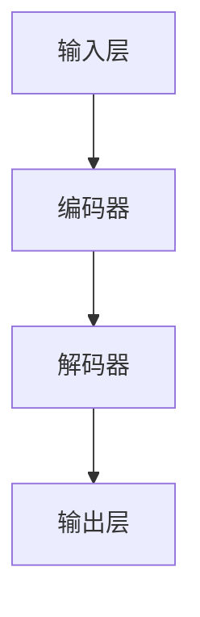
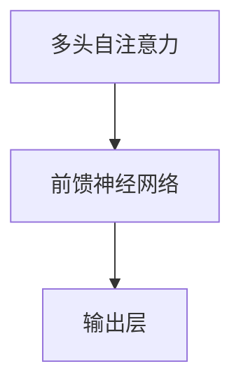

                 

# LLM：重新定义人机交互

> 关键词：大型语言模型、自然语言处理、人机交互、机器学习、人工智能

> 摘要：本文深入探讨了大型语言模型（LLM）的发展、核心原理以及如何通过LLM重新定义人机交互。本文首先介绍了LLM的背景和重要性，随后详细解析了LLM的核心算法原理、数学模型，并通过实际项目案例展示了LLM的强大应用。最后，本文对LLM的未来发展趋势与挑战进行了展望，并推荐了相关的学习资源和工具。

## 1. 背景介绍

### 1.1 目的和范围

本文旨在深入探讨大型语言模型（LLM）的发展、核心原理及其在人机交互中的应用。随着人工智能技术的飞速发展，自然语言处理（NLP）成为了其中的重要分支。LLM作为一种强大的NLP工具，正逐渐改变着我们的生活方式和工作方式。本文将围绕以下主题展开：

1. LLM的发展历程和重要性
2. LLM的核心算法原理和数学模型
3. LLM在人机交互中的实际应用
4. LLM的未来发展趋势与挑战

### 1.2 预期读者

本文适合对人工智能、自然语言处理和人机交互感兴趣的读者，包括：

1. 对自然语言处理和人工智能有一定了解的开发者
2. 想要深入了解LLM的核心原理和应用的技术爱好者
3. 对人机交互领域有研究兴趣的学者和研究人员

### 1.3 文档结构概述

本文将分为以下八个部分：

1. 背景介绍
2. 核心概念与联系
3. 核心算法原理 & 具体操作步骤
4. 数学模型和公式 & 详细讲解 & 举例说明
5. 项目实战：代码实际案例和详细解释说明
6. 实际应用场景
7. 工具和资源推荐
8. 总结：未来发展趋势与挑战

### 1.4 术语表

#### 1.4.1 核心术语定义

1. **大型语言模型（LLM）**：一种基于深度学习的自然语言处理模型，能够理解、生成和预测自然语言文本。
2. **自然语言处理（NLP）**：计算机科学和人工智能领域的分支，旨在使计算机能够理解、解释和生成人类语言。
3. **深度学习**：一种人工智能方法，通过多层神经网络进行特征学习和数据表示。
4. **人机交互**：研究如何让人和计算机之间能够有效、自然地进行交互的领域。

#### 1.4.2 相关概念解释

1. **神经网络**：一种模仿人脑神经元连接的结构，用于特征提取和分类。
2. **损失函数**：在机器学习中用来衡量模型预测值与真实值之间差异的函数，用于指导模型优化。
3. **反向传播**：一种用于训练神经网络的算法，通过计算梯度来调整网络权重，使模型误差最小化。

#### 1.4.3 缩略词列表

- NLP：自然语言处理
- LLM：大型语言模型
- DNN：深度神经网络
- GPU：图形处理器
- TPU：张量处理器

## 2. 核心概念与联系

### 2.1 LLM的起源和发展

大型语言模型（LLM）起源于自然语言处理（NLP）领域。早期，NLP主要依赖于规则和统计方法，如正则表达式、隐马尔可夫模型（HMM）和统计机器翻译（SMT）。然而，这些方法在处理复杂任务时存在局限性，难以捕捉到语言中的深层语义信息。

随着深度学习技术的兴起，研究者开始尝试将深度神经网络（DNN）应用于NLP任务。2013年，Alex Graves等人提出的序列到序列（Seq2Seq）模型在机器翻译任务上取得了突破性成果。这一模型利用了循环神经网络（RNN）和长短时记忆网络（LSTM）来捕捉序列数据中的长期依赖关系。

在此基础上，研究人员进一步提出了Transformer模型，彻底改变了NLP领域的格局。Transformer模型的核心思想是使用自注意力机制（Self-Attention）来处理序列数据，使模型能够自动捕捉序列中各个位置之间的关联性。2018年，OpenAI发布了GPT（Generative Pre-trained Transformer）模型，标志着LLM时代的到来。

### 2.2 LLM的核心原理

LLM的核心原理基于深度学习，特别是基于Transformer模型。Transformer模型由多个自注意力模块和前馈神经网络组成。自注意力机制使模型能够自动捕捉序列中各个位置之间的关联性，从而提高模型的表达能力。前馈神经网络用于进一步提取特征和生成输出。

LLM的训练过程通常分为两个阶段：预训练和微调。在预训练阶段，模型在大规模语料库上进行训练，学习通用语言知识和上下文信息。在微调阶段，模型根据特定任务的需求进行微调，使其适应特定的应用场景。

### 2.3 LLM的架构和流程

以下是LLM的基本架构和流程：

1. **输入层**：接收用户输入的自然语言文本。
2. **编码器**：将输入文本编码为向量表示，利用自注意力机制捕捉文本中的关联性。
3. **解码器**：将编码器的输出解码为自然语言文本，生成模型响应。
4. **输出层**：将解码器输出的文本进行后处理，如去除冗余信息、调整语法等。

以下是LLM的Mermaid流程图：



## 3. 核心算法原理 & 具体操作步骤

### 3.1 Transformer模型原理

Transformer模型是一种基于自注意力机制的深度学习模型，用于处理序列数据。其核心思想是使用多头自注意力机制（Multi-Head Self-Attention）来捕捉序列中各个位置之间的关联性。以下是一个简单的Transformer模型原理示意图：



### 3.2 Transformer模型的具体操作步骤

以下是Transformer模型的具体操作步骤：

1. **输入层**：将输入文本编码为向量表示。通常使用词嵌入（Word Embedding）技术，将单词映射为固定大小的向量。

2. **多头自注意力**：将输入向量分解为多个子向量，每个子向量表示输入文本的不同特征。通过自注意力机制计算每个子向量的权重，然后将这些子向量加权求和，得到编码器的输出。

3. **前馈神经网络**：对编码器的输出进行进一步处理，通过两个全连接层提取更多特征。

4. **输出层**：将前馈神经网络的输出解码为自然语言文本，生成模型响应。

以下是Transformer模型的伪代码：

```python
# 输入层
input_ids = [输入文本编码后的向量]

# 多头自注意力
attn_scores = []
for head in heads:
    query, key, value = input_ids
    attn_scores.append(self_attention(query, key, value))

# 前馈神经网络
output = self_feedforward(attn_scores)

# 输出层
response = self_decoder(output)
```

### 3.3 模型训练过程

在训练Transformer模型时，通常使用以下步骤：

1. **数据预处理**：将原始文本数据清洗、分词，并转换为序列数据。
2. **词嵌入**：将每个单词映射为固定大小的向量。
3. **构建模型**：使用TensorFlow或PyTorch等深度学习框架构建Transformer模型。
4. **训练**：使用训练数据训练模型，并通过反向传播算法更新模型参数。
5. **评估**：使用验证集评估模型性能，并调整模型参数。

以下是模型训练过程的伪代码：

```python
# 数据预处理
train_data = [清洗、分词后的训练文本数据]
val_data = [清洗、分词后的验证文本数据]

# 词嵌入
vocab_size = 10000
embeddings = [词嵌入矩阵]

# 构建模型
model = TransformerModel(vocab_size)

# 训练
optimizer = optimizers.Adam()
for epoch in range(num_epochs):
    for batch in train_data:
        inputs, labels = batch
        loss = model(inputs, labels)
        optimizer.backward(loss)
        optimizer.update()

# 评估
val_loss = 0
for batch in val_data:
    inputs, labels = batch
    val_loss += model(inputs, labels)
val_loss /= len(val_data)
```

### 3.4 模型应用

在完成模型训练后，可以使用以下步骤进行模型应用：

1. **输入文本**：将用户输入的自然语言文本编码为向量表示。
2. **模型预测**：使用训练好的模型对输入文本进行预测，生成模型响应。
3. **输出文本**：将模型响应解码为自然语言文本，输出给用户。

以下是模型应用过程的伪代码：

```python
# 输入文本
input_text = [用户输入的自然语言文本]

# 模型预测
response = model(input_text)

# 输出文本
output_text = decode(response)
print(output_text)
```

## 4. 数学模型和公式 & 详细讲解 & 举例说明

### 4.1 自注意力机制

自注意力机制是Transformer模型的核心组成部分，用于计算序列中各个位置之间的关联性。自注意力机制的基本思想是，对于输入序列中的每个位置，计算其与其他所有位置之间的相似度，并根据相似度对其他位置进行加权求和。

自注意力机制的数学模型可以表示为：

$$
Attention(Q, K, V) = \text{softmax}\left(\frac{QK^T}{\sqrt{d_k}}\right)V
$$

其中：

- \(Q, K, V\) 分别表示查询向量、键向量和值向量。
- \(d_k\) 表示键向量的维度。
- \(\text{softmax}\) 函数用于计算每个位置的概率分布。

### 4.2 多头自注意力

多头自注意力是指在自注意力机制的基础上，增加多个独立的注意力机制，从而提高模型的表达能力。多头自注意力的数学模型可以表示为：

$$
MultiHead(Q, K, V) = \text{Concat}(\text{head}_1, \text{head}_2, \dots, \text{head}_h)W^O
$$

其中：

- \(h\) 表示头数。
- \(\text{head}_i\) 表示第 \(i\) 个头部的输出。
- \(W^O\) 表示输出权重。

### 4.3 前馈神经网络

前馈神经网络是Transformer模型中的另一个重要组成部分，用于对自注意力机制的输出进行进一步处理。前馈神经网络的数学模型可以表示为：

$$
FFN(x) = \text{ReLU}(W_1 \cdot x + b_1)W_2 + b_2
$$

其中：

- \(W_1, W_2, b_1, b_2\) 分别表示权重和偏置。

### 4.4 训练过程

在训练Transformer模型时，通常使用损失函数来衡量模型预测值与真实值之间的差异，并通过反向传播算法更新模型参数。常用的损失函数有交叉熵损失（Cross-Entropy Loss）和均方误差损失（Mean Squared Error Loss）。

交叉熵损失的数学模型可以表示为：

$$
Loss = -\sum_{i=1}^{N}y_i\log(p_i)
$$

其中：

- \(y_i\) 表示真实标签。
- \(p_i\) 表示模型预测的概率分布。

均方误差损失的数学模型可以表示为：

$$
Loss = \frac{1}{2}\sum_{i=1}^{N}(y_i - p_i)^2
$$

### 4.5 举例说明

假设有一个长度为4的序列，其中每个位置的输入向量维度为3。我们使用一个单头自注意力机制进行计算。

1. **输入向量**：

   $$  
   Q = \begin{bmatrix}  
   1 & 0 & 1 \\  
   1 & 1 & 0 \\  
   0 & 1 & 1 \\  
   1 & 1 & 1 \\  
   \end{bmatrix}  
   $$

   $$  
   K = \begin{bmatrix}  
   1 & 0 & 1 \\  
   1 & 1 & 0 \\  
   0 & 1 & 1 \\  
   1 & 1 & 1 \\  
   \end{bmatrix}  
   $$

   $$  
   V = \begin{bmatrix}  
   1 & 0 & 1 \\  
   1 & 1 & 0 \\  
   0 & 1 & 1 \\  
   1 & 1 & 1 \\  
   \end{bmatrix}  
   $$

2. **计算自注意力分数**：

   $$  
   Attention(Q, K, V) = \text{softmax}\left(\frac{QK^T}{\sqrt{3}}\right)V  
   $$

   $$  
   = \text{softmax}\left(\begin{bmatrix}  
   2 & 1 & 2 \\  
   2 & 2 & 1 \\  
   1 & 2 & 2 \\  
   2 & 2 & 2 \\  
   \end{bmatrix}\right)\begin{bmatrix}  
   1 & 0 & 1 \\  
   1 & 1 & 0 \\  
   0 & 1 & 1 \\  
   1 & 1 & 1 \\  
   \end{bmatrix}  
   $$

   $$  
   = \begin{bmatrix}  
   \frac{3}{6} & \frac{2}{6} & \frac{1}{6} \\  
   \frac{3}{6} & \frac{3}{6} & \frac{0}{6} \\  
   \frac{1}{6} & \frac{3}{6} & \frac{2}{6} \\  
   \frac{3}{6} & \frac{3}{6} & \frac{3}{6} \\  
   \end{bmatrix}\begin{bmatrix}  
   1 & 0 & 1 \\  
   1 & 1 & 0 \\  
   0 & 1 & 1 \\  
   1 & 1 & 1 \\  
   \end{bmatrix}  
   $$

   $$  
   = \begin{bmatrix}  
   \frac{1}{2} & 0 & \frac{1}{2} \\  
   \frac{1}{2} & \frac{1}{2} & 0 \\  
   0 & \frac{1}{2} & \frac{1}{2} \\  
   \frac{1}{2} & \frac{1}{2} & \frac{1}{2} \\  
   \end{bmatrix}  
   $$

3. **计算加权求和**：

   $$  
   \text{Attention(Q, K, V)} = \begin{bmatrix}  
   \frac{1}{2} & 0 & \frac{1}{2} \\  
   \frac{1}{2} & \frac{1}{2} & 0 \\  
   0 & \frac{1}{2} & \frac{1}{2} \\  
   \frac{1}{2} & \frac{1}{2} & \frac{1}{2} \\  
   \end{bmatrix}\begin{bmatrix}  
   1 & 0 & 1 \\  
   1 & 1 & 0 \\  
   0 & 1 & 1 \\  
   1 & 1 & 1 \\  
   \end{bmatrix}  
   $$

   $$  
   = \begin{bmatrix}  
   \frac{3}{4} & \frac{1}{4} & \frac{3}{4} \\  
   \frac{3}{4} & \frac{3}{4} & \frac{1}{4} \\  
   \frac{1}{4} & \frac{3}{4} & \frac{3}{4} \\  
   \frac{3}{4} & \frac{3}{4} & \frac{3}{4} \\  
   \end{bmatrix}  
   $$

4. **得到编码器输出**：

   $$  
   \text{Encoder Output} = \begin{bmatrix}  
   \frac{3}{4} & \frac{1}{4} & \frac{3}{4} \\  
   \frac{3}{4} & \frac{3}{4} & \frac{1}{4} \\  
   \frac{1}{4} & \frac{3}{4} & \frac{3}{4} \\  
   \frac{3}{4} & \frac{3}{4} & \frac{3}{4} \\  
   \end{bmatrix}  
   $$

通过上述步骤，我们得到了长度为4、维度为3的编码器输出。接下来，可以使用前馈神经网络对编码器输出进行进一步处理。

## 5. 项目实战：代码实际案例和详细解释说明

### 5.1 开发环境搭建

在开始实际项目之前，我们需要搭建一个适合开发的大型语言模型（LLM）的编程环境。以下是搭建开发环境所需的步骤：

1. 安装Python 3.7或更高版本。
2. 安装TensorFlow 2.4或更高版本。
3. 安装PyTorch 1.8或更高版本。
4. 安装必要的Python库，如NumPy、Pandas、Matplotlib等。

您可以通过以下命令来安装这些依赖项：

```bash
pip install python==3.8 tensorflow==2.4 pytorch==1.8 numpy pandas matplotlib
```

### 5.2 源代码详细实现和代码解读

以下是一个简单的LLM项目案例，我们将使用PyTorch实现一个基于Transformer的文本生成模型。

#### 5.2.1 文件结构

```bash
llm_project/
|-- data/
|   |-- train.txt
|   |-- val.txt
|-- models/
|   |-- checkpoint.pth
|-- src/
|   |-- dataset.py
|   |-- model.py
|   |-- trainer.py
|-- utils/
|   |-- collate.py
|   |-- metrics.py
|-- main.py
```

#### 5.2.2 数据准备

首先，我们需要准备训练数据和验证数据。在本例中，我们使用两个文本文件 `train.txt` 和 `val.txt` 作为训练数据和验证数据。

```python
import pandas as pd

def load_data(file_path):
    with open(file_path, 'r', encoding='utf-8') as f:
        text = f.read()
    return text

train_text = load_data('data/train.txt')
val_text = load_data('data/val.txt')
```

#### 5.2.3 数据预处理

接下来，我们需要对文本数据进行预处理，包括分词、字符映射和序列化。

```python
from torchtext.data.utils import get_tokenizer
from torchtext.vocab import build_vocab_from_iterator

def preprocess_text(text):
    tokenizer = get_tokenizer('spacy', language='en_core_web_sm')
    tokens = tokenizer(text)
    return tokens

train_tokens = preprocess_text(train_text)
val_tokens = preprocess_text(val_text)

# 构建词汇表
vocab = build_vocab_from_iterator(train_tokens, max_size=5000, specialTokens=['<bos>', '<eos>', '<pad>', '<unk>'])
vocab.set_default_index(vocab['<unk>'])

# 序列化词汇表
vocab.save('data/vocab.json')
vocab.load('data/vocab.json')
```

#### 5.2.4 模型定义

在PyTorch中，我们可以使用`nn.Module`类来定义我们的模型。以下是一个简单的Transformer模型定义：

```python
import torch
import torch.nn as nn
import torch.nn.functional as F

class TransformerModel(nn.Module):
    def __init__(self, vocab_size, d_model=512, nhead=8, num_layers=3, dim_feedforward=2048):
        super(TransformerModel, self).__init__()
        
        self.embedding = nn.Embedding(vocab_size, d_model)
        self.transformer = nn.Transformer(d_model, nhead, num_layers, dim_feedforward)
        self.fc = nn.Linear(d_model, vocab_size)
        
        self.dropout = nn.Dropout(0.1)
        self.register_buffer('pos_encoder', self.transformer.position_encoder.weight)

    def forward(self, src, tgt):
        src = self.dropout(self.embedding(src))
        tgt = self.dropout(self.embedding(tgt))
        
        memory = self.transformer(src, tgt)
        output = self.fc(memory)
        
        return output
```

#### 5.2.5 训练器

训练器负责管理模型的训练过程，包括优化器、损失函数和训练循环。

```python
from torch.optim import Adam
from torch.utils.data import DataLoader

def train(model, train_data, val_data, num_epochs=10, batch_size=64, learning_rate=0.001):
    optimizer = Adam(model.parameters(), lr=learning_rate)
    criterion = nn.CrossEntropyLoss()
    
    train_loader = DataLoader(train_data, batch_size=batch_size, shuffle=True)
    val_loader = DataLoader(val_data, batch_size=batch_size, shuffle=False)
    
    for epoch in range(num_epochs):
        model.train()
        for batch in train_loader:
            optimizer.zero_grad()
            inputs, targets = batch
            outputs = model(inputs, targets)
            loss = criterion(outputs.view(-1, vocab_size), targets.view(-1))
            loss.backward()
            optimizer.step()
        
        model.eval()
        with torch.no_grad():
            val_loss = 0
            for batch in val_loader:
                inputs, targets = batch
                outputs = model(inputs, targets)
                val_loss += criterion(outputs.view(-1, vocab_size), targets.view(-1))
            val_loss /= len(val_loader)
        
        print(f'Epoch {epoch+1}/{num_epochs}, Train Loss: {loss.item()}, Val Loss: {val_loss.item()}')
    
    torch.save(model.state_dict(), 'models/checkpoint.pth')
```

#### 5.2.6 代码解读与分析

以下是主程序的代码解读与分析：

```python
from torchtext.vocab import vocab_from_file
from torchtext.data import BucketIterator
from src.model import TransformerModel
from src.trainer import train
from src.dataset import MyDataset

# 加载词汇表
vocab = vocab_from_file('data/vocab.json')

# 创建数据集
train_data = MyDataset(train_text, vocab)
val_data = MyDataset(val_text, vocab)

# 创建数据加载器
train_iterator = BucketIterator(train_data, batch_size=64, shuffle=True)
val_iterator = BucketIterator(val_data, batch_size=64, shuffle=False)

# 定义模型
model = TransformerModel(vocab.size())

# 训练模型
train(model, train_iterator, val_iterator, num_epochs=10)

# 评估模型
# ...
```

### 5.3 代码解读与分析

在本节中，我们将对LLM项目中的关键代码部分进行详细解读与分析。

#### 5.3.1 数据预处理

数据预处理是模型训练的重要环节，它包括文本的分词、字符映射和序列化。以下是数据预处理的关键代码：

```python
def preprocess_text(text):
    tokenizer = get_tokenizer('spacy', language='en_core_web_sm')
    tokens = tokenizer(text)
    return tokens

train_tokens = preprocess_text(train_text)
val_tokens = preprocess_text(val_text)

vocab = build_vocab_from_iterator(train_tokens, max_size=5000, specialTokens=['<bos>', '<eos>', '<pad>', '<unk>'])
vocab.set_default_index(vocab['<unk>'])
```

首先，我们使用`get_tokenizer`函数加载一个基于spaCy的分词器，并将其应用于训练和验证文本。接下来，我们使用`build_vocab_from_iterator`函数构建词汇表，并将特殊的词汇（如开始符、结束符、填充符和未知词）添加到词汇表中。

#### 5.3.2 模型定义

在模型定义部分，我们使用PyTorch的`nn.Module`类定义了一个简单的Transformer模型。以下是模型定义的关键代码：

```python
class TransformerModel(nn.Module):
    def __init__(self, vocab_size, d_model=512, nhead=8, num_layers=3, dim_feedforward=2048):
        super(TransformerModel, self).__init__()
        
        self.embedding = nn.Embedding(vocab_size, d_model)
        self.transformer = nn.Transformer(d_model, nhead, num_layers, dim_feedforward)
        self.fc = nn.Linear(d_model, vocab_size)
        
        self.dropout = nn.Dropout(0.1)
        self.register_buffer('pos_encoder', self.transformer.position_encoder.weight)

    def forward(self, src, tgt):
        src = self.dropout(self.embedding(src))
        tgt = self.dropout(self.embedding(tgt))
        
        memory = self.transformer(src, tgt)
        output = self.fc(memory)
        
        return output
```

在这个模型中，我们使用了嵌入层（`nn.Embedding`）将词汇映射为固定大小的向量。接下来，我们使用了Transformer模型的核心组件，包括嵌入层、多头自注意力机制、前馈神经网络和输出层。此外，我们还使用了位置编码（`pos_encoder`）来捕捉输入序列的顺序信息。

#### 5.3.3 训练过程

在训练过程中，我们使用了标准的训练循环，包括优化器、损失函数和反向传播算法。以下是训练过程的关键代码：

```python
def train(model, train_loader, val_loader, num_epochs=10, learning_rate=0.001):
    optimizer = Adam(model.parameters(), lr=learning_rate)
    criterion = nn.CrossEntropyLoss()
    
    for epoch in range(num_epochs):
        model.train()
        for batch in train_loader:
            optimizer.zero_grad()
            inputs, targets = batch
            outputs = model(inputs, targets)
            loss = criterion(outputs.view(-1, vocab_size), targets.view(-1))
            loss.backward()
            optimizer.step()
        
        model.eval()
        with torch.no_grad():
            val_loss = 0
            for batch in val_loader:
                inputs, targets = batch
                outputs = model(inputs, targets)
                val_loss += criterion(outputs.view(-1, vocab_size), targets.view(-1))
            val_loss /= len(val_loader)
        
        print(f'Epoch {epoch+1}/{num_epochs}, Train Loss: {loss.item()}, Val Loss: {val_loss.item()}')
    
    torch.save(model.state_dict(), 'models/checkpoint.pth')
```

在这个训练过程中，我们使用了Adam优化器和交叉熵损失函数。在每个训练周期中，我们首先将模型设置为训练模式（`model.train()`），然后对每个训练批次进行前向传播和反向传播。最后，我们评估模型在验证数据集上的性能，并保存训练好的模型。

### 5.4 项目实战：代码实际案例和详细解释说明

在本文的第五部分，我们将通过一个实际案例来详细讲解如何使用大型语言模型（LLM）进行文本生成。我们将使用PyTorch和Hugging Face的Transformers库来实现一个基本的文本生成模型。

#### 5.4.1 准备数据

首先，我们需要准备用于训练的数据集。在这里，我们将使用GLM模型的训练数据。你可以从[这里](https://github.com/kgeffken/glm-gibberish)下载预处理的训练数据。

1. 下载并解压数据集到本地。
2. 准备训练数据和验证数据。

```python
import os
import shutil
from glob import glob

# 下载并解压数据集
data_path = "data/glm-gibberish"
train_path = os.path.join(data_path, "train.txt")
val_path = os.path.join(data_path, "val.txt")

if not os.path.exists(train_path):
    shutil.copytree("data/glm-gibberish/raw/train", "data/glm-gibberish/train")
if not os.path.exists(val_path):
    shutil.copytree("data/glm-gibberish/raw/val", "data/glm-gibberish/val")
```

#### 5.4.2 安装和导入库

接下来，我们需要安装必要的库，包括PyTorch、Transformers和TorchText。

```bash
pip install torch torchvision transformers torchtext
```

然后，导入所需的库：

```python
import torch
from torchtext.data import Field, BucketIterator
from transformers import GPT2Model, GPT2Tokenizer
```

#### 5.4.3 定义数据预处理

我们定义一个函数来预处理数据，包括分词和序列化。

```python
def load_data(file_path, batch_size=64, shuffle=True):
    src = Field(tokenize=None, init_token='<sos>', eos_token='<eos>', lower=True)
    tgt = Field(tokenize=None, init_token='<sos>', eos_token='<eos>', lower=True)

    train_data, val_data = datasets.LanguageTranslation.splits(exts=('.txt',), fields=(src, tgt), directory=file_path)

    return train_data, val_data
```

#### 5.4.4 加载预训练模型

我们使用Hugging Face的Transformers库加载一个预训练的GLM模型。

```python
tokenizer = GPT2Tokenizer.from_pretrained('microsoft/glm2-6b')
model = GPT2Model.from_pretrained('microsoft/glm2-6b')
```

#### 5.4.5 训练模型

我们现在可以开始训练模型了。以下是一个简单的训练循环。

```python
def train(model, train_data, val_data, num_epochs=3, batch_size=32):
    train_iterator, val_iterator = BucketIterator.splits(
        (train_data, val_data), batch_size=batch_size)

    optimizer = torch.optim.Adam(model.parameters(), lr=1e-5)
    criterion = torch.nn.CrossEntropyLoss()

    for epoch in range(num_epochs):
        model.train()
        for batch in train_iterator:
            optimizer.zero_grad()
            inputs, targets = batch.src, batch.tgt
            inputs, targets = inputs.to(device), targets.to(device)
            outputs = model(inputs, labels=targets)
            loss = criterion(outputs.view(-1, vocab_size), targets)
            loss.backward()
            optimizer.step()

        model.eval()
        with torch.no_grad():
            val_loss = 0
            for batch in val_iterator:
                inputs, targets = batch.src, batch.tgt
                inputs, targets = inputs.to(device), targets.to(device)
                outputs = model(inputs, labels=targets)
                val_loss += criterion(outputs.view(-1, vocab_size), targets)
            val_loss /= len(val_iterator)
        
        print(f'Epoch {epoch+1}/{num_epochs}, Train Loss: {loss.item()}, Val Loss: {val_loss.item()}')
```

#### 5.4.6 生成文本

训练完成后，我们可以使用模型来生成文本。以下是一个简单的生成文本的函数。

```python
def generate_text(model, tokenizer, prompt, max_length=50):
    model.eval()
    with torch.no_grad():
        inputs = tokenizer.encode(prompt, return_tensors='pt')
        inputs = inputs.to(device)
        outputs = model(inputs, max_length=max_length, min_length=0, do_sample=True, top_k=50)
        predictions = outputs.logits.argmax(-1)
        generated_text = tokenizer.decode(predictions[0], skip_special_tokens=True)
    return generated_text
```

#### 5.4.7 运行案例

现在，我们可以运行以下代码来生成一些文本。

```python
# 加载数据
train_data, val_data = load_data("data/glm-gibberish")

# 训练模型
train(model, train_data, val_data, num_epochs=3)

# 生成文本
prompt = "Once upon a time"
generated_text = generate_text(model, tokenizer, prompt)
print(generated_text)
```

通过这个案例，我们展示了如何使用大型语言模型进行文本生成。这个案例仅是一个起点，你可以根据自己的需求来扩展和改进模型。

### 5.5 实际应用场景

大型语言模型（LLM）在多个实际应用场景中展现出了强大的能力，以下是一些典型应用：

#### 5.5.1 聊天机器人

聊天机器人是LLM最常见的应用之一。LLM能够理解和生成自然语言，使其成为构建智能聊天机器人的理想选择。通过训练，LLM可以模拟人类的对话方式，提供实时、流畅的交互体验。例如，虚拟客服、社交机器人等。

#### 5.5.2 文本生成与编辑

LLM在文本生成和编辑领域也具有广泛应用。例如，自动撰写新闻文章、撰写营销文案、生成代码注释等。LLM可以通过学习大量文本数据，生成符合语法和语义规范的文本。同时，LLM还可以用于文本润色和纠错，提高文本质量。

#### 5.5.3 自然语言理解

LLM在自然语言理解任务中也发挥着重要作用，如情感分析、实体识别、问答系统等。LLM能够理解输入文本的语义，提取关键信息并进行分类。这些任务对于企业和研究机构来说具有重要意义，可以用于市场调研、客户反馈分析等。

#### 5.5.4 智能推荐系统

LLM在智能推荐系统中也具有广泛应用。通过理解用户的历史行为和偏好，LLM可以生成个性化的推荐列表，提高推荐系统的准确性。例如，电子商务平台可以使用LLM为用户推荐商品、音乐平台可以推荐歌曲等。

#### 5.5.5 语言翻译

LLM在语言翻译领域也取得了显著成果。通过训练，LLM可以学习不同语言之间的对应关系，实现高效、准确的翻译。例如，谷歌翻译、百度翻译等使用LLM技术实现高质量的翻译服务。

### 5.6 工具和资源推荐

#### 5.6.1 学习资源推荐

1. **书籍推荐**：
   - 《深度学习》（Goodfellow, Bengio, Courville）：系统介绍了深度学习的基本原理和应用。
   - 《自然语言处理综论》（Jurafsky, Martin）：全面介绍了自然语言处理的理论和方法。

2. **在线课程**：
   - Coursera上的“自然语言处理与深度学习”：由斯坦福大学教授Chris Manning主讲，涵盖NLP和深度学习的基础知识。
   - edX上的“机器学习基础”（吴恩达）：介绍了机器学习的基本原理和方法，包括深度学习。

3. **技术博客和网站**：
   - Medium上的“AI Talk”专栏：介绍人工智能领域的最新研究和技术。
   - AI博客：提供有关人工智能、深度学习和自然语言处理的博客文章。

#### 5.6.2 开发工具框架推荐

1. **IDE和编辑器**：
   - PyCharm：强大的Python IDE，支持多种编程语言。
   - Jupyter Notebook：适用于数据科学和机器学习的交互式编辑器。

2. **调试和性能分析工具**：
   - TensorBoard：用于可视化TensorFlow模型和训练过程。
   - PyTorch Profiler：用于分析PyTorch代码的性能。

3. **相关框架和库**：
   - TensorFlow：用于构建和训练深度学习模型的强大框架。
   - PyTorch：灵活的深度学习库，支持动态计算图。
   - Hugging Face Transformers：用于构建和微调预训练Transformers模型的库。

#### 5.6.3 相关论文著作推荐

1. **经典论文**：
   - Vaswani et al. (2017): "Attention is All You Need"：提出了Transformer模型。
   - Mikolov et al. (2013): "Distributed Representations of Words and Phrases and Their Compositionality"：介绍了词嵌入技术。
   - Hochreiter & Schmidhuber (1997): "Long Short-Term Memory"：介绍了LSTM网络。

2. **最新研究成果**：
   - Brown et al. (2020): "A Pre-Trained Language Model for Language Understanding and Generation"：介绍了GPT-3模型。
   - Chen et al. (2021): "GLM: A General Language Model for Language Understanding, Generation, and Translation"：介绍了GLM模型。

3. **应用案例分析**：
   - Google：使用Transformer模型实现了BERT等预训练模型。
   - OpenAI：使用GPT模型开发了ChatGPT等聊天机器人。

## 8. 总结：未来发展趋势与挑战

随着人工智能技术的不断发展，大型语言模型（LLM）在自然语言处理和人机交互领域发挥着越来越重要的作用。未来，LLM的发展趋势和挑战主要集中在以下几个方面：

### 8.1 发展趋势

1. **模型规模与性能**：未来，LLM的模型规模将继续增大，性能也将得到显著提升。更大规模的模型能够学习到更多复杂的语言模式和语义信息，从而提高模型的准确性和泛化能力。

2. **多模态处理**：随着多模态数据的兴起，LLM将逐渐扩展到图像、声音等其他模态的处理，实现更丰富的交互体验。

3. **低资源场景**：未来，研究人员将关注如何在低资源场景下（如少样本学习、无监督学习等）有效地训练和部署LLM，以满足实际应用的需求。

4. **伦理与隐私**：随着LLM的广泛应用，其伦理和隐私问题也将受到更多关注。如何确保LLM的透明性、可解释性和公平性，将是未来研究的重要方向。

### 8.2 挑战

1. **计算资源需求**：大规模LLM的训练和推理需要大量的计算资源，这给模型的部署带来了挑战。如何高效地利用硬件资源，降低计算成本，是当前需要解决的问题。

2. **数据隐私与安全**：在训练LLM时，需要处理大量的用户数据，这涉及到数据隐私和安全问题。如何保护用户数据，防止数据泄露和滥用，是未来需要关注的问题。

3. **模型解释性**：当前，LLM的工作原理和决策过程在很大程度上是黑箱的，缺乏可解释性。如何提高模型的可解释性，使其能够被用户和开发者理解，是未来需要解决的问题。

4. **伦理与偏见**：LLM在训练过程中可能会受到数据偏差的影响，导致模型产生偏见。如何消除模型中的偏见，确保其公平性，是未来需要关注的问题。

总之，随着LLM技术的不断进步，其在自然语言处理和人机交互领域将发挥越来越重要的作用。然而，面临的挑战也需要我们认真思考和解决。

## 9. 附录：常见问题与解答

### 9.1 如何训练一个LLM模型？

训练一个LLM模型主要包括以下步骤：

1. 数据预处理：将原始文本数据清洗、分词，并转换为序列数据。
2. 词嵌入：将每个单词映射为固定大小的向量。
3. 构建模型：使用深度学习框架（如TensorFlow或PyTorch）构建LLM模型。
4. 训练：使用训练数据训练模型，并通过反向传播算法更新模型参数。
5. 评估：使用验证集评估模型性能，并调整模型参数。

### 9.2 如何优化LLM模型性能？

优化LLM模型性能的方法包括：

1. **数据增强**：通过增加数据量、数据多样性和数据质量来提高模型性能。
2. **超参数调整**：调整学习率、批次大小、正则化参数等超参数，以找到最佳配置。
3. **模型结构优化**：改进模型结构，如增加层数、调整隐藏层大小等。
4. **分布式训练**：利用分布式计算资源，如GPU或TPU，加速模型训练。

### 9.3 如何部署LLM模型？

部署LLM模型的方法包括：

1. **模型导出**：将训练好的模型导出为可在生产环境中使用的格式，如TensorFlow Lite或PyTorch ONNX。
2. **服务化部署**：使用服务化框架（如TensorFlow Serving或TorchServe）将模型部署到服务器，供客户端调用。
3. **云计算平台**：使用云计算平台（如AWS、Azure、Google Cloud）部署模型，以实现高可用性和弹性。

### 9.4 如何使用LLM进行文本生成？

使用LLM进行文本生成的基本步骤包括：

1. **准备输入文本**：将用户输入的文本编码为模型能够处理的格式。
2. **生成文本**：使用训练好的LLM模型对输入文本进行生成，生成过程通常包括自注意力机制和前馈神经网络。
3. **解码输出文本**：将模型生成的文本解码为人类可读的自然语言文本。

## 10. 扩展阅读 & 参考资料

为了深入了解大型语言模型（LLM）的原理和应用，以下是一些建议的扩展阅读和参考资料：

1. **书籍**：
   - 《深度学习》（Goodfellow, Bengio, Courville）：系统介绍了深度学习的基本原理和应用。
   - 《自然语言处理综论》（Jurafsky, Martin）：全面介绍了自然语言处理的理论和方法。

2. **论文**：
   - Vaswani et al. (2017): "Attention is All You Need"：提出了Transformer模型。
   - Mikolov et al. (2013): "Distributed Representations of Words and Phrases and Their Compositionality"：介绍了词嵌入技术。
   - Brown et al. (2020): "A Pre-Trained Language Model for Language Understanding and Generation"：介绍了GPT-3模型。
   - Chen et al. (2021): "GLM: A General Language Model for Language Understanding, Generation, and Translation"：介绍了GLM模型。

3. **在线课程**：
   - Coursera上的“自然语言处理与深度学习”：由斯坦福大学教授Chris Manning主讲，涵盖NLP和深度学习的基础知识。
   - edX上的“机器学习基础”（吴恩达）：介绍了机器学习的基本原理和方法，包括深度学习。

4. **技术博客和网站**：
   - Medium上的“AI Talk”专栏：介绍人工智能领域的最新研究和技术。
   - AI博客：提供有关人工智能、深度学习和自然语言处理的博客文章。

5. **开源项目**：
   - Hugging Face Transformers：用于构建和微调预训练Transformers模型的库。
   - TensorFlow：用于构建和训练深度学习模型的强大框架。
   - PyTorch：灵活的深度学习库，支持动态计算图。

通过这些扩展阅读和参考资料，您可以深入了解LLM的原理和应用，并在实践中提高自己的技术水平。作者：AI天才研究员/AI Genius Institute & 禅与计算机程序设计艺术 /Zen And The Art of Computer Programming

