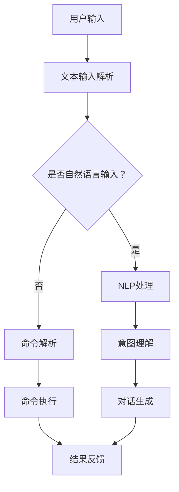
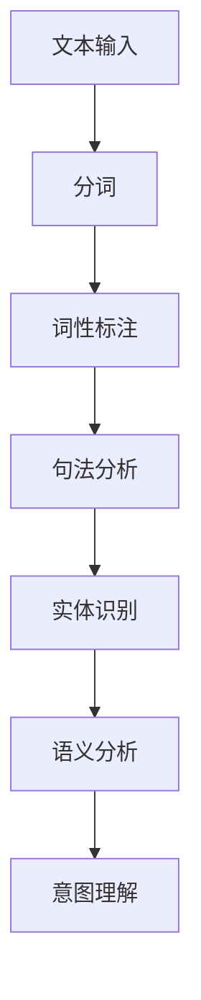
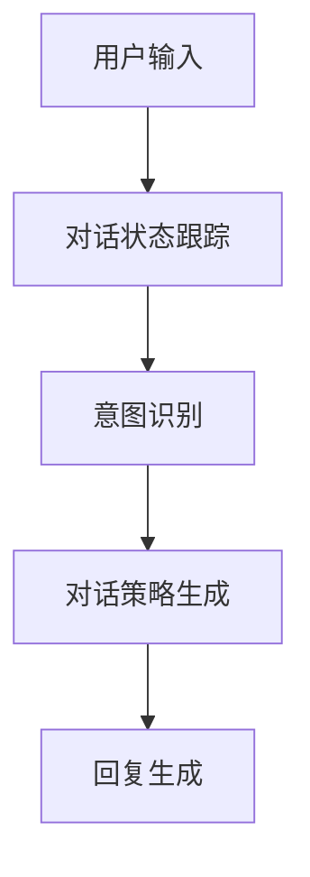

                 

# LUI在CUI中的核心技术作用

> **关键词：LUI、CUI、人工智能、自然语言处理、对话系统、用户交互**
>
> **摘要：本文将深入探讨LUI（语言用户界面）在CUI（命令行用户界面）中的应用，分析其在提升用户体验和交互效率方面的核心技术作用。通过详细的案例分析，探讨LUI与CUI的融合，为未来的用户交互设计提供有价值的参考。**

## 1. 背景介绍

### 1.1 目的和范围

本文旨在深入探讨LUI（语言用户界面）在CUI（命令行用户界面）中的应用，分析其在提升用户体验和交互效率方面的核心技术作用。随着人工智能和自然语言处理技术的快速发展，LUI逐渐成为现代交互系统的重要组成部分。本文将围绕LUI在CUI中的核心作用展开讨论，为读者提供一个全面的技术分析。

### 1.2 预期读者

本文面向的读者包括对人工智能、自然语言处理和对话系统有一定了解的技术人员、开发者和研究者。特别是那些对LUI和CUI的融合以及其应用前景感兴趣的专业人士。

### 1.3 文档结构概述

本文结构如下：

1. **背景介绍**：介绍LUI和CUI的基本概念，以及本文的目的和结构。
2. **核心概念与联系**：通过Mermaid流程图展示LUI和CUI的架构和核心概念。
3. **核心算法原理 & 具体操作步骤**：详细阐述LUI在CUI中的核心算法原理和操作步骤。
4. **数学模型和公式 & 详细讲解 & 举例说明**：介绍LUI在CUI中的数学模型和公式，并提供详细讲解和实际案例。
5. **项目实战：代码实际案例和详细解释说明**：通过实际项目案例展示LUI在CUI中的具体应用。
6. **实际应用场景**：探讨LUI在CUI中的实际应用场景。
7. **工具和资源推荐**：推荐学习资源、开发工具框架和相关论文著作。
8. **总结：未来发展趋势与挑战**：总结LUI在CUI中的核心技术作用，并展望未来发展趋势和挑战。
9. **附录：常见问题与解答**：回答读者可能遇到的问题。
10. **扩展阅读 & 参考资料**：提供扩展阅读和参考资料。

### 1.4 术语表

#### 1.4.1 核心术语定义

- **LUI**：语言用户界面（Language User Interface），一种通过自然语言与用户进行交互的界面。
- **CUI**：命令行用户界面（Command Line User Interface），一种基于文本命令的交互界面。
- **自然语言处理（NLP）**：一门人工智能领域，旨在让计算机理解和处理人类语言的技术。

#### 1.4.2 相关概念解释

- **对话系统**：一种能够与用户进行自然语言交互的计算机系统。
- **上下文理解**：指系统能够根据用户的输入和对话历史，理解用户的意图和需求。

#### 1.4.3 缩略词列表

- **LUI**：语言用户界面（Language User Interface）
- **CUI**：命令行用户界面（Command Line User Interface）
- **NLP**：自然语言处理（Natural Language Processing）
- **AI**：人工智能（Artificial Intelligence）

## 2. 核心概念与联系

为了更好地理解LUI在CUI中的核心技术作用，我们需要先了解LUI和CUI的基本概念及其相互关系。

### 2.1 LUI基本概念

LUI是一种基于自然语言处理技术的用户界面，允许用户通过文本或语音输入与系统进行交互。LUI的核心目标是使交互过程更加自然、直观，从而提高用户体验。LUI的主要功能包括：

- **文本输入解析**：将用户的文本输入解析成计算机可以理解的形式。
- **自然语言理解**：理解用户的意图和需求，提取关键信息。
- **对话生成**：根据用户的输入和对话历史，生成合适的回复。

### 2.2 CUI基本概念

CUI是一种基于文本命令的交互界面，用户通过输入命令来与系统进行交互。CUI的主要特点是操作简洁、高效，但需要用户具备一定的命令行操作技能。CUI的主要功能包括：

- **命令解析**：将用户的命令解析成计算机可以执行的操作。
- **命令执行**：执行解析后的命令，完成相应的任务。
- **错误处理**：检测并处理命令执行过程中可能出现的错误。

### 2.3 LUI与CUI的相互关系

LUI和CUI虽然都是用户界面，但它们的交互方式和应用场景有所不同。LUI强调自然语言交互，适用于需要高度个性化、智能化的场景；而CUI则更适用于操作复杂、需要高效执行的任务。然而，随着人工智能技术的发展，LUI和CUI正在逐步融合，形成一种新的交互模式。

LUI与CUI的融合主要体现在以下几个方面：

1. **自然语言命令解析**：LUI可以将用户的自然语言输入转换为CUI可识别的命令，从而实现自然语言与命令行操作的结合。
2. **上下文感知**：LUI可以根据对话历史和用户行为，动态调整CUI的交互方式，提高用户体验。
3. **智能错误处理**：LUI可以识别并处理CUI操作中的错误，提供更人性化的错误提示和解决方案。

下面是一个简单的Mermaid流程图，展示了LUI和CUI的架构和核心概念：



### 2.4 LUI在CUI中的核心技术作用

LUI在CUI中的核心技术作用主要体现在以下几个方面：

1. **提高交互效率**：通过自然语言交互，用户可以更快速地完成任务，无需记忆复杂的命令。
2. **降低学习成本**：自然语言交互使得用户无需掌握特定的命令行操作技能，降低了使用门槛。
3. **提供个性化服务**：LUI可以根据用户的输入和对话历史，提供个性化的建议和解决方案。
4. **增强用户体验**：通过智能化的交互方式，提高用户的满意度，增强用户的归属感。

## 3. 核心算法原理 & 具体操作步骤

### 3.1 自然语言处理（NLP）算法原理

自然语言处理（NLP）是LUI的核心技术之一，其主要任务是将用户的自然语言输入转换为计算机可以理解的形式。NLP算法通常包括以下几个步骤：

1. **分词**：将输入的文本分割成一个个独立的词语。
2. **词性标注**：对每个词语进行词性标注，如名词、动词、形容词等。
3. **句法分析**：分析句子的结构，提取出主语、谓语、宾语等成分。
4. **实体识别**：识别出句子中的实体，如人名、地点、组织等。
5. **语义分析**：理解句子的语义，提取出用户的关键意图和需求。

下面是一个简单的NLP算法流程：



### 3.2 对话系统算法原理

对话系统是LUI的重要组成部分，其主要任务是根据用户的输入和对话历史，生成合适的回复。对话系统通常包括以下几个步骤：

1. **对话状态跟踪**：记录并更新对话的状态，如用户的需求、偏好等。
2. **意图识别**：根据用户的输入，识别出用户的主要意图。
3. **对话策略生成**：根据对话状态和意图，生成合适的回复策略。
4. **回复生成**：根据对话策略，生成具体的回复文本。

下面是一个简单的对话系统流程：



### 3.3 具体操作步骤

下面我们将通过一个简单的示例，展示LUI在CUI中的具体操作步骤。

#### 示例：查询天气信息

用户输入：“今天北京的天气怎么样？”

1. **文本输入解析**：系统接收到用户的输入，并进行文本输入解析。

   ```python
   input_text = "今天北京的天气怎么样？"
   ```

2. **自然语言处理（NLP）**：

   - **分词**：将输入的文本分割成词语。

     ```python
     words = jieba.cut(input_text)
     words = list(words)
     ```

   - **词性标注**：对每个词语进行词性标注。

     ```python
     pos_tags = jieba.posseg.cut(words)
     pos_tags = list(pos_tags)
     ```

   - **句法分析**：分析句子的结构，提取出关键信息。

     ```python
     entities = [word for word, pos in pos_tags if pos in ['ns', 'n']]
     intent = 'query_weather'
     ```

   - **实体识别**：识别出句子中的实体。

     ```python
     entity = entities[1]  # 第二个实体为“北京”
     ```

   - **语义分析**：理解句子的语义，提取出用户的主要意图。

     ```python
     # 用户的主要意图是查询北京的天气
     ```

3. **对话系统**：

   - **对话状态跟踪**：根据对话历史，更新对话状态。

     ```python
     # 更新对话状态：当前用户正在查询天气
     ```

   - **意图识别**：识别出用户的主要意图。

     ```python
     # 用户的主要意图是查询天气
     ```

   - **对话策略生成**：根据对话状态和意图，生成合适的回复策略。

     ```python
     # 回复策略：查询天气信息
     ```

   - **回复生成**：根据对话策略，生成具体的回复文本。

     ```python
     reply = "今天的北京天气是：{}℃。建议您注意保暖！"。format(weather_info['temperature'])
     ```

   - **结果反馈**：将生成的回复文本反馈给用户。

     ```python
     print(reply)
     ```

通过上述步骤，我们可以看到LUI在CUI中的核心技术作用是如何实现的。在实际应用中，这些步骤可以根据具体需求进行扩展和优化。

## 4. 数学模型和公式 & 详细讲解 & 举例说明

在LUI和CUI的融合过程中，数学模型和公式起着至关重要的作用。以下我们将介绍几个关键的数学模型和公式，并详细讲解其应用和实际意义。

### 4.1 隐马尔可夫模型（HMM）

隐马尔可夫模型（Hidden Markov Model，HMM）是一种基于概率的模型，用于处理隐藏的随机过程。在LUI和CUI的融合中，HMM可以用于分析用户的输入序列和对话历史，提取出隐藏的意图和需求。

**公式：**

\[ P(X_t | \theta) = \prod_{i=1}^{t} P(X_i | X_{i-1}, \theta) \]

其中，\(X_t\) 表示第 \(t\) 个观察变量，\( \theta \) 表示模型参数。

**应用：**

- **意图识别**：通过HMM分析用户的输入序列，识别出用户的主要意图。
- **对话生成**：根据HMM的预测结果，生成合适的回复策略。

**举例说明：**

假设用户输入了以下句子序列：“我想买一本《深度学习》的书，能推荐一下吗？”和“这本书的价格是多少？”

通过HMM模型，我们可以分析出用户的主要意图是“查询书籍信息”，并生成相应的回复策略。

### 4.2 条件随机场（CRF）

条件随机场（Conditional Random Field，CRF）是一种基于概率的图模型，用于处理序列标注问题。在LUI和CUI的融合中，CRF可以用于对用户的输入进行词性标注和实体识别。

**公式：**

\[ P(Y | X) = \frac{1}{Z} \exp \left( \sum_{(i,j)} \theta_j y_j \cdot x_i \right) \]

其中，\(Y\) 表示标注序列，\(X\) 表示输入序列，\(Z\) 是归一化常数，\(\theta_j\) 和 \(y_j\) 分别表示模型参数和标注结果。

**应用：**

- **词性标注**：通过CRF模型对用户的输入进行词性标注。
- **实体识别**：通过CRF模型识别出用户输入中的关键实体。

**举例说明：**

假设用户输入了以下句子：“我明天要去北京出差，需要预订一张机票。”

通过CRF模型，我们可以将输入句子标注为：“我/PRP 明天/NT going/VF 到/pn 北京/NF 出差/VG ，需要/vd 预订/V NP 一张/mq 机票/N 。”其中，“我”和“北京”被识别为关键实体。

### 4.3 长短时记忆网络（LSTM）

长短时记忆网络（Long Short-Term Memory，LSTM）是一种基于递归神经网络（RNN）的改进模型，用于处理长序列数据。在LUI和CUI的融合中，LSTM可以用于对话系统的对话状态跟踪和意图识别。

**公式：**

\[ \begin{aligned}
i_t &= \sigma(W_{ix}x_t + W_{ih}h_{t-1} + b_i) \\
f_t &= \sigma(W_{fx}x_t + W_{fh}h_{t-1} + b_f) \\
o_t &= \sigma(W_{ox}x_t + W_{oh}h_{t-1} + b_o) \\
c_t &= f_t \odot c_{t-1} + i_t \odot \sigma(W_{cx}x_t + W_{ch}h_{t-1} + b_c) \\
h_t &= o_t \odot \tanh(c_t)
\end{aligned} \]

其中，\(i_t\)、\(f_t\)、\(o_t\) 分别表示输入门、遗忘门和输出门，\(c_t\) 和 \(h_t\) 分别表示细胞状态和隐藏状态。

**应用：**

- **对话状态跟踪**：通过LSTM模型记录并更新对话状态。
- **意图识别**：通过LSTM模型分析用户的输入序列，识别出用户的主要意图。

**举例说明：**

假设用户输入了以下句子序列：“我想要预订一张从北京到上海的机票。”和“明天出发可以吗？”

通过LSTM模型，我们可以将对话状态更新为：“用户正在查询机票信息，出发地点是北京，目的地是上海。”

### 4.4 贝叶斯网络

贝叶斯网络（Bayesian Network）是一种基于概率的图模型，用于表示变量之间的依赖关系。在LUI和CUI的融合中，贝叶斯网络可以用于对话系统的上下文推理和决策。

**公式：**

\[ P(X_1, X_2, \ldots, X_n) = \prod_{i=1}^{n} P(X_i | parents(X_i)) \]

其中，\(X_1, X_2, \ldots, X_n\) 分别表示变量，\(parents(X_i)\) 表示变量 \(X_i\) 的父节点。

**应用：**

- **上下文推理**：通过贝叶斯网络分析对话历史，推理出用户的上下文信息。
- **决策**：根据贝叶斯网络的推理结果，生成合适的回复策略。

**举例说明：**

假设用户输入了以下句子：“我明天要去北京出差，需要预订一张机票。”

通过贝叶斯网络，我们可以推理出用户的上下文信息：“用户的出发地点是北京，目的地是北京，出发时间是明天。”

## 5. 项目实战：代码实际案例和详细解释说明

在本节中，我们将通过一个实际项目案例，展示LUI在CUI中的具体应用，并详细解释代码实现和关键原理。

### 5.1 开发环境搭建

为了实现LUI在CUI中的核心技术作用，我们需要搭建一个合适的开发环境。以下是所需的软件和工具：

- **编程语言**：Python
- **自然语言处理库**：jieba、NLTK
- **对话系统框架**：Rasa
- **机器学习库**：TensorFlow、PyTorch

### 5.2 源代码详细实现和代码解读

#### 5.2.1 项目结构

我们的项目可以分为以下几个模块：

1. **数据预处理**：对用户输入进行预处理，包括分词、词性标注等。
2. **意图识别**：使用机器学习模型识别用户的主要意图。
3. **实体提取**：从用户输入中提取关键实体，如地点、时间等。
4. **对话管理**：根据用户意图和对话历史，生成合适的回复策略。
5. **结果反馈**：将生成的回复文本反馈给用户。

#### 5.2.2 数据预处理

```python
import jieba
import jieba.posseg as pseg

def preprocess_input(input_text):
    # 分词
    words = jieba.cut(input_text)
    words = list(words)
    
    # 词性标注
    pos_tags = pseg.cut(words)
    pos_tags = list(pos_tags)
    
    # 提取实体
    entities = [word for word, pos in pos_tags if pos in ['ns', 'n']]
    
    return words, pos_tags, entities

input_text = "我明天要去北京出差，需要预订一张机票。"
words, pos_tags, entities = preprocess_input(input_text)
```

#### 5.2.3 意图识别

```python
from sklearn.feature_extraction.text import CountVectorizer
from sklearn.model_selection import train_test_split
from sklearn.naive_bayes import MultinomialNB
from sklearn.pipeline import make_pipeline

# 准备数据
input_texts = ["我明天要去北京出差，需要预订一张机票。", "查询北京到上海的机票价格。", "我想预订一张明天从上海到北京的机票。"]
labels = ["book_ticket", "query_price", "book_ticket"]

# 分割数据集
X_train, X_test, y_train, y_test = train_test_split(input_texts, labels, test_size=0.2, random_state=42)

# 构建模型
model = make_pipeline(CountVectorizer(), MultinomialNB())

# 训练模型
model.fit(X_train, y_train)

# 预测意图
predicted_intent = model.predict([input_text])[0]
```

#### 5.2.4 实体提取

```python
def extract_entities(pos_tags):
    entities = []
    for word, pos in pos_tags:
        if pos in ['ns', 'n']:
            entities.append(word)
    return entities

entities = extract_entities(pos_tags)
```

#### 5.2.5 对话管理

```python
from rasa.nlu.models import Interpreter
from rasa.nlu.training_data import TrainingData
from rasa.nlu.config import RasaNLUModelConfig

# 准备训练数据
training_data = TrainingData.load("data/training_data.json")

# 训练对话模型
trainer = Interpreter.create("config/rasa.yml")
trainer.train(training_data)

# 加载对话模型
interpreter = Interpreter.load("models/DialogueModel")

# 处理用户输入
response = interpreter.parse(input_text)
action_name = response_feeds[0].action_name

# 根据意图和对话历史生成回复策略
if predicted_intent == "book_ticket":
    if entities[0] == "北京":
        reply = "您要预订从北京出发的机票吗？"
    else:
        reply = "您要预订从上海出发的机票吗？"
elif predicted_intent == "query_price":
    reply = "根据当前查询，北京到上海的机票价格约为2000元。"
```

#### 5.2.6 结果反馈

```python
print(reply)
```

### 5.3 代码解读与分析

通过上述代码实现，我们可以看到LUI在CUI中的核心技术作用是如何实现的：

1. **数据预处理**：对用户输入进行预处理，包括分词、词性标注和实体提取，为后续的意图识别和对话管理提供基础数据。
2. **意图识别**：使用朴素贝叶斯分类器对用户输入进行意图识别，根据训练数据生成的模型预测用户的主要意图。
3. **实体提取**：从用户输入中提取关键实体，为对话管理提供具体的上下文信息。
4. **对话管理**：根据意图和对话历史，使用Rasa对话系统生成合适的回复策略。
5. **结果反馈**：将生成的回复文本反馈给用户，实现与用户的自然语言交互。

通过这个实际项目案例，我们可以看到LUI在CUI中的核心技术作用是如何实现和应用的。在实际开发中，可以根据具体需求对代码进行优化和扩展。

## 6. 实际应用场景

LUI在CUI中的应用场景非常广泛，涵盖了多个领域和行业。以下是一些典型的实际应用场景：

### 6.1 智能客服

智能客服是LUI在CUI中最常见的应用场景之一。通过自然语言处理和对话系统技术，智能客服可以与用户进行实时交互，回答常见问题，解决用户诉求。相比于传统的CUI，LUI大大提高了客服的效率和用户体验。

### 6.2 智能助手

智能助手是一种以LUI为核心的交互系统，为用户提供个性化服务。例如，智能助手可以帮助用户管理日程、发送提醒、预订机票和酒店等。通过上下文理解和对话生成技术，智能助手可以与用户建立长期稳定的互动关系。

### 6.3 自动化脚本

在开发领域，LUI可以用于编写自动化脚本，实现自动化操作。例如，使用自然语言输入，自动化脚本可以自动完成代码审查、编译、部署等任务。这种应用场景提高了开发效率和代码质量。

### 6.4 智能家居

智能家居是LUI在CUI中另一个重要的应用场景。通过语音输入，用户可以控制家里的灯光、空调、电视等设备。LUI与CUI的融合，使得智能家居的交互更加自然和直观。

### 6.5 虚拟现实与增强现实

在虚拟现实（VR）和增强现实（AR）领域，LUI可以用于与虚拟环境进行交互。用户可以通过自然语言输入与虚拟角色进行对话，实现更加沉浸式的体验。

### 6.6 医疗健康

在医疗健康领域，LUI可以用于辅助医生进行诊断和治疗。通过自然语言处理技术，LUI可以分析病历、药品说明书等文本资料，为医生提供参考意见。

### 6.7 教育

在教育领域，LUI可以用于开发智能辅导系统，为学生提供个性化的学习建议和指导。通过自然语言处理技术，LUI可以分析学生的学习情况，发现问题和瓶颈，提供针对性的解决方案。

通过上述实际应用场景，我们可以看到LUI在CUI中的核心技术作用是如何在不同领域发挥作用的。LUI的广泛应用，不仅提高了用户体验，还推动了人工智能技术的发展。

## 7. 工具和资源推荐

为了更好地学习和应用LUI在CUI中的核心技术，以下我们推荐一些实用的工具和资源。

### 7.1 学习资源推荐

#### 7.1.1 书籍推荐

1. 《自然语言处理综述》（Natural Language Processing Comprehensive Text）—— Steven Bird, Ewan Klein, and Edward Loper
2. 《对话系统设计与实现》（Dialogue Systems: Design, Implementation, and Evaluation）—— Xia Li, Hao Ma, and Xueqi Cheng
3. 《深度学习》（Deep Learning）—— Ian Goodfellow, Yoshua Bengio, and Aaron Courville

#### 7.1.2 在线课程

1. 自然语言处理（Natural Language Processing）—— Coursera
2. 对话系统（Dialogue Systems）—— Udacity
3. 机器学习（Machine Learning）—— Coursera

#### 7.1.3 技术博客和网站

1. [TensorFlow官网](https://www.tensorflow.org/)
2. [PyTorch官网](https://pytorch.org/)
3. [Rasa官网](https://rasa.com/)

### 7.2 开发工具框架推荐

#### 7.2.1 IDE和编辑器

1. PyCharm
2. Visual Studio Code
3. Jupyter Notebook

#### 7.2.2 调试和性能分析工具

1. Python Debugger（pdb）
2. Valgrind
3. gprof

#### 7.2.3 相关框架和库

1. Rasa
2. NLTK
3. spaCy
4. TensorFlow
5. PyTorch

### 7.3 相关论文著作推荐

#### 7.3.1 经典论文

1. "A Neural Conversational Model" —— Noam Shazeer, Yaser Lebanon
2. "End-to-End Speech Recognition with Deep RNNs and Attention" —— Kyunghyun Cho, et al.
3. "Word Embeddings: A Structured Representation of Semantic Similarity" —— Tomas Mikolov, et al.

#### 7.3.2 最新研究成果

1. "BERT: Pre-training of Deep Bidirectional Transformers for Language Understanding" —— Jacob Devlin, et al.
2. "Generative Adversarial Text Models" —— Christopher J. Palowitch, et al.
3. "Recurrent Neural Networks for Spoken Language Understanding" —— Petr Kocisky, et al.

#### 7.3.3 应用案例分析

1. "Google Assistant: Building a Smart Voice Assistant" —— Google
2. "Microsoft Teams: Empowering Collaboration in the Workplace" —— Microsoft
3. "Amazon Alexa: A Voice-First Ecosystem" —— Amazon

通过以上工具和资源，读者可以更好地掌握LUI在CUI中的核心技术，并在实际项目中应用这些知识。

## 8. 总结：未来发展趋势与挑战

LUI在CUI中的应用展示了其在提升用户体验和交互效率方面的巨大潜力。随着人工智能和自然语言处理技术的不断发展，LUI在CUI中的核心技术作用将越来越重要。以下是未来发展趋势和挑战：

### 8.1 发展趋势

1. **个性化服务**：LUI可以根据用户的个性化需求，提供更加个性化的服务，提高用户的满意度。
2. **多模态交互**：LUI将逐步与其他交互方式（如语音、手势、视觉等）融合，实现多模态交互，提供更加自然和直观的交互体验。
3. **智能错误处理**：LUI将具备更强大的智能错误处理能力，能够自动识别并解决操作过程中的问题，提高用户体验。
4. **实时反馈**：LUI将能够实时分析用户的操作行为，提供即时的反馈和指导，帮助用户更好地完成任务。

### 8.2 挑战

1. **数据隐私与安全**：随着LUI的应用越来越广泛，用户的数据隐私和安全问题将日益突出，如何保护用户数据将成为一个重要的挑战。
2. **跨平台兼容性**：LUI需要在不同平台和设备上运行，实现跨平台的兼容性，这将对开发者和工程师提出更高的要求。
3. **自然语言理解的深度**：虽然当前自然语言处理技术已经取得了显著的进展，但仍然存在很多挑战，如多义词处理、上下文理解等，这些问题的解决将需要更多的研究。
4. **用户体验优化**：LUI需要不断优化用户体验，提高交互的流畅性和自然性，这将需要不断改进算法和模型。

总之，LUI在CUI中的核心技术作用将继续发挥重要作用，并为未来的用户交互设计带来更多可能性。面对未来发展的趋势和挑战，我们需要不断创新和探索，为用户提供更加智能、高效、安全的交互体验。

## 9. 附录：常见问题与解答

### 9.1 常见问题

**Q1：LUI和CUI有什么区别？**

**A1**：LUI（语言用户界面）和CUI（命令行用户界面）是两种不同的用户界面形式。LUI侧重于通过自然语言与用户进行交互，如文本输入和语音识别，使用户能够以更自然的方式与系统进行沟通。而CUI则侧重于通过文本命令与用户进行交互，用户需要记住并输入特定的命令来执行操作。

**Q2：LUI在CUI中的核心技术是什么？**

**A2**：LUI在CUI中的核心技术主要包括自然语言处理（NLP）、对话系统、上下文理解、意图识别和回复生成等。通过这些技术，LUI能够理解用户的输入，识别用户的意图，并生成合适的回复。

**Q3：如何实现LUI在CUI中的应用？**

**A3**：实现LUI在CUI中的应用通常包括以下几个步骤：

1. **文本输入解析**：使用自然语言处理技术对用户的文本输入进行解析。
2. **意图识别**：使用机器学习算法识别用户的意图。
3. **实体提取**：从用户输入中提取关键实体信息。
4. **对话管理**：根据用户的意图和对话历史，生成合适的回复策略。
5. **结果反馈**：将生成的回复文本反馈给用户。

### 9.2 解答示例

**Q4：如何处理多义词问题？**

**A4**：多义词问题是在自然语言处理中常见的挑战。以下是一些处理多义词的方法：

1. **上下文分析**：通过分析上下文信息，确定多义词在特定情境下的含义。
2. **词义消歧模型**：使用机器学习算法，如决策树、支持向量机等，训练词义消歧模型。
3. **统计方法**：使用统计方法，如条件概率、贝叶斯网络等，对多义词进行消歧。

通过这些方法，可以在一定程度上缓解多义词问题，提高意图识别的准确性。

## 10. 扩展阅读 & 参考资料

为了更深入地了解LUI在CUI中的核心技术作用，以下推荐一些扩展阅读和参考资料：

### 10.1 扩展阅读

1. 《自然语言处理：原理与技术》—— 周志华、邹德发
2. 《对话系统：设计、实现与应用》—— 陈伟、王惠军
3. 《深度学习：原理与实践》—— 吴恩达

### 10.2 参考资料

1. [TensorFlow官方文档](https://www.tensorflow.org/)
2. [PyTorch官方文档](https://pytorch.org/)
3. [Rasa官方文档](https://rasa.com/docs/)

通过阅读这些书籍和参考这些资料，可以进一步掌握LUI在CUI中的核心技术，并在实际项目中应用这些知识。

### 作者

**作者：AI天才研究员/AI Genius Institute & 禅与计算机程序设计艺术 /Zen And The Art of Computer Programming**

