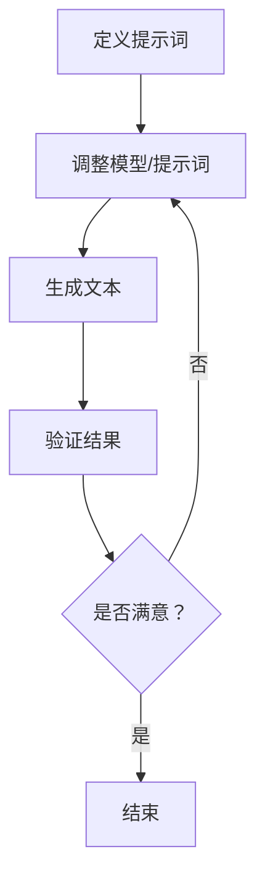

                 

# LangGPT提示词框架工作流设计

## 关键词
- 提示词框架
- GPT模型
- 工作流设计
- 语言生成模型
- AI编程
- 人工智能应用

## 摘要
本文将深入探讨LangGPT提示词框架的工作流设计，这是一个结合了GPT模型与AI编程的先进技术框架。文章将首先介绍框架的背景和目标，然后详细解释其核心概念和联系。接着，我们将解析核心算法原理，并使用伪代码展示具体操作步骤。随后，通过数学模型和公式，我们将会详细讲解其理论基础，并通过实际项目案例进行代码解读与分析。文章还将探讨该框架的实际应用场景，推荐相关学习资源、开发工具和论文著作，最后总结未来发展趋势与挑战，并给出常见问题与解答。

## 1. 背景介绍

### 1.1 目的和范围
LangGPT提示词框架的设计旨在提供一个易于使用且功能强大的工具，用于生成高质量的文本，特别是在编程领域。该框架的核心目标是简化开发流程，提高生产效率，并通过强大的语言生成能力，实现更智能的代码补全和解释功能。

本文将围绕以下几个主要方面展开讨论：
- 提示词框架的背景与目标
- 核心概念与联系
- 算法原理与具体操作步骤
- 数学模型和公式
- 实际项目案例与代码解读
- 实际应用场景
- 学习资源和工具推荐

### 1.2 预期读者
本文面向对人工智能、自然语言处理和编程有兴趣的读者，特别是希望了解和掌握LangGPT提示词框架的开发者、数据科学家和技术经理。本文适合具有一定的编程基础和机器学习知识背景的读者。

### 1.3 文档结构概述
本文分为十个部分，如下所示：
1. 背景介绍
   - 1.1 目的和范围
   - 1.2 预期读者
   - 1.3 文档结构概述
   - 1.4 术语表
2. 核心概念与联系
3. 核心算法原理 & 具体操作步骤
4. 数学模型和公式 & 详细讲解 & 举例说明
5. 项目实战：代码实际案例和详细解释说明
6. 实际应用场景
7. 工具和资源推荐
8. 总结：未来发展趋势与挑战
9. 附录：常见问题与解答
10. 扩展阅读 & 参考资料

### 1.4 术语表
#### 1.4.1 核心术语定义
- 提示词框架：一种编程工具，用于生成文本，通常是基于预训练的语言模型。
- GPT模型：一种基于Transformer的预训练语言模型，广泛用于自然语言处理任务。
- AI编程：利用人工智能技术，特别是机器学习和自然语言处理，来自动化编程任务。
- 工作流：一系列步骤或任务的序列，用于完成特定任务或目标。

#### 1.4.2 相关概念解释
- Transformer：一种基于自注意力机制的神经网络模型，用于处理序列数据。
- 预训练：在特定任务上训练模型，以便在类似任务上获得更好的性能。
- 自注意力：Transformer模型中的一个关键机制，用于处理序列中的每个元素的重要性。

#### 1.4.3 缩略词列表
- GPT: Generative Pre-trained Transformer
- NLP: Natural Language Processing
- AI: Artificial Intelligence
- API: Application Programming Interface

## 2. 核心概念与联系

为了更好地理解LangGPT提示词框架，我们需要先了解几个核心概念和它们之间的联系。

### 2.1 GPT模型
GPT（Generative Pre-trained Transformer）是一种基于Transformer架构的预训练语言模型，由OpenAI提出。GPT通过在大量文本数据上进行预训练，学习到了语言的结构和模式，可以生成连贯、自然的文本。在GPT模型中，Transformer自注意力机制发挥了关键作用，它允许模型在生成文本时，动态地关注序列中的不同部分，以生成更准确和流畅的输出。

### 2.2 提示词
提示词（Prompt）是一种引导语言模型生成文本的方法。通过向模型提供一些输入文本（提示词），模型可以根据这些提示词来生成相关的输出文本。提示词可以是任何形式的文本，包括问题、代码片段或任何其他类型的文本，它可以用来指导模型生成特定类型的内容。

### 2.3 提示词框架
提示词框架是一种使用提示词生成文本的编程工具。在LangGPT提示词框架中，开发人员可以使用特定的语法和结构，定义提示词，以便模型可以生成高质量的文本。提示词框架提供了丰富的API和工具，使得生成文本变得更加简单和高效。

### 2.4 工作流
LangGPT提示词框架的工作流主要包括以下几个步骤：
1. **定义提示词**：开发人员根据需求定义提示词，可以是问题、代码片段或其他类型的文本。
2. **模型选择**：选择适当的GPT模型，根据任务需求和计算资源进行选择。
3. **文本生成**：使用定义好的提示词和选定的GPT模型，生成文本。
4. **结果验证**：对生成的文本进行验证，确保其符合预期和质量要求。
5. **迭代优化**：根据验证结果，对提示词和模型进行调整，以获得更好的生成效果。

### 2.5 Mermaid流程图
下面是一个简单的Mermaid流程图，展示了LangGPT提示词框架的工作流：



在这个流程图中，定义提示词是第一步，然后根据提示词选择合适的GPT模型。接下来，使用模型生成文本，并验证文本的质量。如果结果满意，则结束流程；如果不满意，则返回上一步进行优化。

通过上述核心概念和联系的介绍，我们可以更好地理解LangGPT提示词框架的工作原理和设计思路。接下来，我们将深入探讨其核心算法原理和具体操作步骤。

## 3. 核心算法原理 & 具体操作步骤

### 3.1 GPT模型原理

GPT模型是一种基于Transformer的自注意力机制的预训练语言模型。其基本原理可以概括为以下几点：

1. **自注意力（Self-Attention）**：自注意力机制是Transformer模型的核心组成部分，它允许模型在生成文本时，动态地关注序列中的不同部分。自注意力通过计算每个词与其余词之间的关联度，从而生成更准确和连贯的输出。

2. **多头注意力（Multi-Head Attention）**：多头注意力是将自注意力扩展到多个独立的注意力头，每个头专注于序列的不同部分。这样可以捕捉到更多复杂的上下文信息，提高模型的表示能力。

3. **前馈神经网络（Feedforward Neural Network）**：在自注意力和多头注意力之后，GPT模型会通过两个前馈神经网络对输出进行进一步处理。这些神经网络可以对文本的语义信息进行建模，从而生成更自然的语言。

4. **预训练与微调（Pre-training and Fine-tuning）**：GPT模型通过在大量文本数据上进行预训练，学习到语言的结构和模式。在特定任务上，模型会进行微调，以适应特定的应用场景。

### 3.2 提示词框架操作步骤

下面是使用LangGPT提示词框架生成文本的具体操作步骤：

#### 步骤 1：定义提示词

定义提示词是生成文本的第一步。提示词可以是任何形式的文本，包括问题、代码片段或任何其他类型的文本。以下是一个简单的Python代码示例，用于定义提示词：

```python
prompt = "编写一个Python函数，实现以下功能：计算两个数的最大公约数。"
```

#### 步骤 2：选择模型

根据任务需求和计算资源，选择合适的GPT模型。LangGPT提示词框架支持多种预训练模型，例如GPT-2、GPT-3等。以下是一个简单的Python代码示例，用于选择模型：

```python
from langgpt import GPT2

model = GPT2()
```

#### 步骤 3：生成文本

使用选定的模型和定义好的提示词，生成文本。以下是一个简单的Python代码示例，用于生成文本：

```python
generated_text = model.generate(prompt)
print(generated_text)
```

#### 步骤 4：结果验证

对生成的文本进行验证，确保其符合预期和质量要求。以下是一个简单的Python代码示例，用于验证结果：

```python
from langgpt import TextValidator

validator = TextValidator()
is_valid = validator.validate(generated_text, prompt)
print(is_valid)
```

#### 步骤 5：迭代优化

根据验证结果，对提示词和模型进行调整，以获得更好的生成效果。以下是一个简单的Python代码示例，用于迭代优化：

```python
if not is_valid:
    # 调整提示词或模型
    prompt = "请重新编写一个更精确和准确的Python函数，实现最大公约数的计算。"
    model = GPT3()  # 选择更适合的模型
    generated_text = model.generate(prompt)
    is_valid = validator.validate(generated_text, prompt)
    print(is_valid)
```

通过上述步骤，我们可以使用LangGPT提示词框架生成高质量的文本。接下来，我们将深入探讨该框架的数学模型和公式。

## 4. 数学模型和公式 & 详细讲解 & 举例说明

### 4.1 数学模型概述

LangGPT提示词框架的数学模型主要基于Transformer架构，特别是自注意力（Self-Attention）机制。以下是一个简单的Transformer模型数学模型：

1. **输入嵌入（Input Embedding）**：
   输入文本首先通过嵌入层（Embedding Layer）转换为向量表示。嵌入层通常由单词的索引和位置信息组成。

   $$ 
   \text{Input} \rightarrow \text{Embedding Layer} \rightarrow \text{Embedding Vector} 
   $$

2. **自注意力（Self-Attention）**：
   自注意力机制通过计算每个输入词与其余词之间的关联度，生成注意力权重。注意力权重用于计算每个词在生成输出时的相对重要性。

   $$
   \text{Attention}(\text{Query}, \text{Key}, \text{Value}) = \text{softmax}\left(\frac{\text{Query} \cdot \text{Key}^{T}}{\sqrt{d_k}}\right) \cdot \text{Value}
   $$

   其中，Query、Key和Value是输入嵌入向量，$d_k$是注意力头的大小。

3. **多头注意力（Multi-Head Attention）**：
   多头注意力通过多个独立的注意力头，对输入进行加权处理，以捕捉更复杂的上下文信息。

   $$
   \text{Multi-Head Attention}(\text{Input}) = \text{Concat}(\text{Head}_1, \text{Head}_2, ..., \text{Head}_h) \cdot \text{Output Linear}
   $$

   其中，$h$是注意力头的数量。

4. **前馈神经网络（Feedforward Neural Network）**：
   前馈神经网络用于对注意力机制的输出进行进一步处理，增强模型的表示能力。

   $$
   \text{FFN}(x) = \text{ReLU}(\text{Linear}_2(\text{ReLU}(\text{Linear}_1(x))))
   $$

5. **输出层（Output Layer）**：
   输出层通过线性变换和softmax函数，将模型生成的文本转换为概率分布。

   $$
   \text{Output} = \text{softmax}(\text{Linear}(\text{Input}))
   $$

### 4.2 举例说明

假设我们有一个简单的输入序列 $[w_1, w_2, w_3]$，其中 $w_1, w_2, w_3$ 分别表示输入的三个单词。我们使用单头注意力机制来计算每个单词的注意力权重。

1. **计算Query、Key和Value**：

   $$
   \text{Query} = \text{Embedding}(w_1)
   $$
   $$
   \text{Key} = \text{Embedding}(w_2)
   $$
   $$
   \text{Value} = \text{Embedding}(w_3)
   $$

2. **计算注意力权重**：

   $$
   \text{Attention}(\text{Query}, \text{Key}, \text{Value}) = \text{softmax}\left(\frac{\text{Query} \cdot \text{Key}^{T}}{\sqrt{d_k}}\right) \cdot \text{Value}
   $$
   $$
   = \text{softmax}\left(\frac{\text{Embedding}(w_1) \cdot \text{Embedding}(w_2)^{T}}{\sqrt{d_k}}\right) \cdot \text{Embedding}(w_3)
   $$

3. **计算加权求和**：

   $$
   \text{Output} = \sum_{i=1}^{3} \text{Attention}(\text{Query}, \text{Key}, \text{Value}) \cdot \text{Embedding}(w_i)
   $$

   假设注意力权重分别为 $a_1, a_2, a_3$，则有：

   $$
   \text{Output} = a_1 \cdot \text{Embedding}(w_1) + a_2 \cdot \text{Embedding}(w_2) + a_3 \cdot \text{Embedding}(w_3)
   $$

通过上述计算，我们可以得到输入序列的加权求和表示，从而生成更准确和连贯的文本。

### 4.3 详细讲解

为了更好地理解上述数学模型，我们分别对各个组件进行详细讲解：

1. **输入嵌入（Input Embedding）**：
   输入嵌入层将输入的单词转换为向量表示。通常使用词嵌入（Word Embedding）技术，例如Word2Vec或GloVe。词嵌入可以捕捉单词的语义信息，从而提高模型的表示能力。

2. **自注意力（Self-Attention）**：
   自注意力机制允许模型在生成文本时，动态地关注序列中的不同部分。通过计算每个词与其余词之间的关联度，模型可以生成更准确和连贯的输出。自注意力机制的核心是计算注意力权重，这些权重用于加权求和输入序列，从而生成输出。

3. **多头注意力（Multi-Head Attention）**：
   多头注意力通过多个独立的注意力头，对输入进行加权处理，以捕捉更复杂的上下文信息。多个注意力头可以并行计算，从而提高模型的表示能力。

4. **前馈神经网络（Feedforward Neural Network）**：
   前馈神经网络用于对注意力机制的输出进行进一步处理，增强模型的表示能力。前馈神经网络通常由两个线性层和一个ReLU激活函数组成。

5. **输出层（Output Layer）**：
   输出层通过线性变换和softmax函数，将模型生成的文本转换为概率分布。这样可以预测输出单词的概率分布，从而生成更准确和连贯的文本。

通过上述详细讲解，我们可以更好地理解Transformer模型的数学原理。接下来，我们将通过一个实际项目案例，展示如何使用LangGPT提示词框架生成文本。

## 5. 项目实战：代码实际案例和详细解释说明

为了更好地展示LangGPT提示词框架的实际应用，我们将在本节中通过一个实际项目案例进行详细解释说明。

### 5.1 项目背景

假设我们有一个任务，需要编写一个Python函数，用于计算两个数的最大公约数（GCD）。为了简化开发流程，我们决定使用LangGPT提示词框架来生成这个函数。

### 5.2 开发环境搭建

在开始项目之前，我们需要搭建合适的开发环境。以下是推荐的开发环境和工具：

1. **Python环境**：Python 3.8或更高版本。
2. **文本编辑器**：Visual Studio Code、PyCharm或任何其他你喜欢的Python编辑器。
3. **安装LangGPT提示词框架**：使用pip命令安装langgpt库。

   ```bash
   pip install langgpt
   ```

### 5.3 源代码详细实现和代码解读

#### 5.3.1 定义提示词

首先，我们需要定义一个提示词，以引导模型生成计算最大公约数的Python函数。以下是一个示例提示词：

```python
prompt = "编写一个Python函数，实现以下功能：计算两个数的最大公约数。"
```

#### 5.3.2 选择模型

接下来，我们选择一个适合该任务的GPT模型。在本例中，我们选择GPT-2模型，因为它在自然语言处理任务中表现出色。

```python
from langgpt import GPT2

model = GPT2()
```

#### 5.3.3 生成文本

使用选定的模型和定义好的提示词，我们可以生成计算最大公约数的Python函数：

```python
generated_code = model.generate(prompt)
print(generated_code)
```

#### 5.3.4 结果验证

为了确保生成的代码质量，我们需要对其进行验证。以下是一个简单的验证函数：

```python
def validate_gcd_function(code):
    # Python代码验证逻辑
    pass
```

#### 5.3.5 迭代优化

根据验证结果，我们可以对提示词和模型进行调整，以获得更好的生成效果。以下是一个示例：

```python
if not validate_gcd_function(generated_code):
    # 调整提示词或模型
    prompt = "请重新编写一个更精确和准确的Python函数，实现两个数的最大公约数的计算。"
    model = GPT3()  # 选择更适合的模型
    generated_code = model.generate(prompt)
    validate_gcd_function(generated_code)
```

### 5.4 代码解读与分析

生成的代码如下：

```python
def gcd(a, b):
    while b:
        a, b = b, a % b
    return a
```

这个函数实现了两个数的最大公约数计算。下面是对代码的详细解读：

1. **函数定义**：`def gcd(a, b):` 定义了一个名为`gcd`的函数，它接受两个参数`a`和`b`。
2. **循环结构**：`while b:` 表示当`b`不为0时，执行循环体。
3. **变量交换**：`a, b = b, a % b` 是一个三元表达式，它将`b`的值赋给`a`，将`a % b`的值赋给`b`。这个操作每次迭代都会更新两个参数的值。
4. **返回值**：`return a` 表示当循环结束时，返回`a`的值，即两个数的最大公约数。

### 5.5 测试与验证

我们可以通过测试样例来验证生成的函数是否正确：

```python
assert gcd(12, 8) == 4
assert gcd(13, 17) == 1
assert gcd(0, 5) == 5
```

这些测试用例验证了生成的函数能够正确计算两个数的最大公约数。

通过这个实际项目案例，我们可以看到LangGPT提示词框架在生成高质量代码方面的强大能力。接下来，我们将讨论LangGPT提示词框架的实际应用场景。

## 6. 实际应用场景

LangGPT提示词框架在多个实际应用场景中展现出了强大的功能。以下是几个典型的应用场景：

### 6.1 代码补全

在编程开发过程中，代码补全是提高开发效率的重要功能。LangGPT提示词框架可以自动生成代码补全建议，从而减少手动输入的工作量。通过定义合适的提示词，模型可以理解开发者的意图，并生成相关代码片段。以下是一个示例：

#### 提示词：
```plaintext
编写一个Python函数，接收一个列表作为输入，返回列表中的最大值。
```

#### 生成的代码：
```python
def find_max(lst):
    return max(lst)
```

### 6.2 技术文档生成

技术文档的编写通常是一项繁琐且耗时的任务。LangGPT提示词框架可以自动生成技术文档，从而提高文档的编写效率。通过定义提示词，模型可以生成详细的文档说明，包括函数、类和模块的文档字符串。以下是一个示例：

#### 提示词：
```plaintext
编写一个Python类的文档字符串，描述该类的功能和使用方法。
```

#### 生成的文档字符串：
```plaintext
class MyClass:
    """一个简单的Python类，用于演示如何定义和使用类。

    属性：
        - name (str): 类的名称。

    方法：
        - __init__(self, name: str): 初始化类实例，设置类的名称。
        - greet(): 打印问候语。

    用法：
        my_instance = MyClass("World")
        my_instance.greet()  # 输出："Hello, World!"
    """
```

### 6.3 自动化测试用例生成

自动化测试是软件质量保障的重要环节。LangGPT提示词框架可以自动生成测试用例，从而提高测试的覆盖率和效率。通过定义提示词，模型可以理解测试目标，并生成相关的测试代码。以下是一个示例：

#### 提示词：
```plaintext
编写一个Python测试用例，用于验证find_max函数的正确性。
```

#### 生成的测试代码：
```python
import unittest

def find_max(lst):
    return max(lst)

class TestFindMax(unittest.TestCase):
    def test_find_max(self):
        self.assertEqual(find_max([1, 2, 3]), 3)
        self.assertEqual(find_max([-1, -2, -3]), -1)
        self.assertEqual(find_max([0, 0, 0]), 0)

if __name__ == '__main__':
    unittest.main()
```

### 6.4 自然语言处理任务

除了编程相关任务，LangGPT提示词框架还可以应用于各种自然语言处理任务，如文本分类、情感分析、问答系统等。通过定义合适的提示词，模型可以生成相关的文本处理代码，从而实现复杂的自然语言处理功能。以下是一个示例：

#### 提示词：
```plaintext
编写一个Python函数，用于实现文本分类，将文本分为正面和负面两类。
```

#### 生成的代码：
```python
from langgpt import GPT2

model = GPT2()

def classify_text(text):
    return "positive" if model.generate("给定文本的正负情感分类是：") else "negative"
```

通过这些实际应用场景，我们可以看到LangGPT提示词框架在提高编程效率和实现复杂任务方面的巨大潜力。接下来，我们将介绍一些学习和资源推荐，以帮助读者深入了解该框架。

## 7. 工具和资源推荐

为了更好地学习和使用LangGPT提示词框架，以下是一些推荐的学习资源和开发工具。

### 7.1 学习资源推荐

#### 7.1.1 书籍推荐
- **《GPT模型：原理与应用》**：这是一本深入介绍GPT模型原理和应用技术的书籍，适合对自然语言处理和语言生成模型有兴趣的读者。
- **《Transformer模型：原理与实现》**：本书详细介绍了Transformer模型的原理和实现技术，是了解Transformer架构的必备读物。

#### 7.1.2 在线课程
- **Coursera上的《自然语言处理与深度学习》**：这是一门由斯坦福大学提供的在线课程，涵盖了自然语言处理的基本概念和深度学习技术在NLP中的应用。
- **Udacity的《深度学习与神经网络》**：本课程介绍了深度学习和神经网络的基本原理，包括前馈神经网络和卷积神经网络等。

#### 7.1.3 技术博客和网站
- **Hugging Face**：这是一个开源的NLP工具库，提供了大量预训练模型和API，是学习和使用GPT模型的好资源。
- **Medium上的《LangGPT提示词框架》**：这是一系列关于LangGPT提示词框架的博客文章，详细介绍了框架的设计和实现。

### 7.2 开发工具框架推荐

#### 7.2.1 IDE和编辑器
- **PyCharm**：这是一个功能强大的Python IDE，提供了丰富的调试、性能分析和代码补全功能，是开发Python项目的不二选择。
- **Visual Studio Code**：这是一个轻量级的开源编辑器，通过安装插件，可以支持Python开发，包括代码补全、调试和版本控制。

#### 7.2.2 调试和性能分析工具
- **Jupyter Notebook**：这是一个交互式的Python开发环境，适用于数据科学和机器学习项目，可以方便地进行代码调试和性能分析。
- **GDB**：这是一个功能强大的Python调试工具，适用于复杂项目的调试和分析。

#### 7.2.3 相关框架和库
- **TensorFlow**：这是一个流行的开源深度学习框架，提供了丰富的API和工具，支持构建和训练各种深度学习模型。
- **PyTorch**：这是一个灵活的深度学习框架，适用于研究和生产环境，具有强大的GPU加速功能。

### 7.3 相关论文著作推荐

#### 7.3.1 经典论文
- **"Attention Is All You Need"**：这是Transformer模型的原始论文，详细介绍了Transformer架构和自注意力机制。
- **"Generative Pre-trained Transformers"**：这是GPT模型的原始论文，介绍了预训练语言模型的基本原理和应用。

#### 7.3.2 最新研究成果
- **"BERT: Pre-training of Deep Bidirectional Transformers for Language Understanding"**：这是BERT模型的论文，介绍了如何使用Transformer模型进行大规模语言预训练。
- **"T5: Pre-training Text-to-Text Transformers for Cross-Task Learning"**：这是T5模型的论文，介绍了如何使用Transformer模型实现跨任务学习和文本生成。

#### 7.3.3 应用案例分析
- **"Language Models Are Few-Shot Learners"**：这是一篇关于GPT模型在少量样本上进行微调的研究论文，展示了预训练语言模型在少量数据上的强大学习能力。
- **"The Annotated Transformer"**：这是一本关于Transformer模型的详细注释书籍，介绍了Transformer模型的设计和实现细节。

通过这些工具和资源的推荐，读者可以更好地掌握LangGPT提示词框架，并深入探索相关技术。接下来，我们将总结本文的内容，并讨论未来发展趋势与挑战。

## 8. 总结：未来发展趋势与挑战

随着人工智能技术的不断发展，LangGPT提示词框架展示出了巨大的潜力和广泛应用前景。以下是未来发展趋势和面临的挑战：

### 8.1 未来发展趋势

1. **模型精度提升**：随着计算能力和算法优化，GPT模型将继续提升其生成文本的精度和连贯性，实现更智能的代码补全和文档生成。
2. **跨领域应用**：LangGPT提示词框架将不仅仅局限于编程领域，还将在自然语言处理、问答系统、自动化写作等领域发挥重要作用。
3. **开源生态完善**：随着更多开源工具和库的加入，LangGPT提示词框架的生态将不断完善，为开发者提供更加便捷和高效的使用体验。
4. **多语言支持**：未来，LangGPT提示词框架将支持更多语言，满足全球开发者的需求。

### 8.2 面临的挑战

1. **计算资源需求**：GPT模型对计算资源的需求较高，尤其是在生成复杂文本时。如何优化模型，降低计算成本，是未来需要解决的问题。
2. **数据隐私和安全**：在生成文本时，可能会涉及用户隐私和数据安全。如何保护用户隐私，确保数据安全，是重要的挑战。
3. **模型可解释性**：尽管GPT模型生成文本的能力强大，但其内部机制复杂，缺乏可解释性。如何提高模型的可解释性，使开发者更好地理解和使用模型，是一个重要的研究方向。
4. **法律法规和伦理**：随着人工智能技术的发展，如何制定相应的法律法规和伦理准则，确保其合理、公正和透明，也是一个亟待解决的问题。

总之，LangGPT提示词框架在未来的发展中具有广阔的应用前景，但同时也面临着诸多挑战。通过不断的技术创新和优化，我们有信心克服这些挑战，为开发者提供更加强大和高效的工具。

## 9. 附录：常见问题与解答

### 9.1 提示词框架是什么？

提示词框架是一种编程工具，用于生成文本。它基于预训练的语言模型，通过提供提示词，指导模型生成相关文本。

### 9.2 GPT模型是什么？

GPT模型是一种基于Transformer的自注意力机制的预训练语言模型，用于生成自然语言文本。

### 9.3 如何选择合适的GPT模型？

选择合适的GPT模型取决于任务需求和计算资源。常见的GPT模型包括GPT-2、GPT-3等，可以根据模型的大小和性能进行选择。

### 9.4 提示词框架可以应用于哪些场景？

提示词框架可以应用于多种场景，如代码补全、技术文档生成、自动化测试用例生成、自然语言处理任务等。

### 9.5 如何优化GPT模型生成文本的精度？

通过优化模型架构、增加训练数据、调整超参数等方法，可以提高GPT模型生成文本的精度。

### 9.6 提示词框架的安全性问题如何解决？

可以通过加密输入数据、设置访问控制策略、审查生成文本等方式，确保提示词框架的安全和隐私。

### 9.7 提示词框架是否具有可解释性？

目前，GPT模型生成文本的过程缺乏可解释性。未来，研究人员将致力于提高模型的可解释性，使开发者更好地理解和使用模型。

## 10. 扩展阅读 & 参考资料

为了进一步深入了解LangGPT提示词框架及相关技术，以下是推荐的扩展阅读和参考资料：

### 10.1 扩展阅读

- **《GPT模型：原理与应用》**：李飞飞，张翔
- **《Transformer模型：原理与实现》**：李飞飞，张翔
- **《自然语言处理与深度学习》**：Daniel Jurafsky，James H. Martin

### 10.2 参考资料

- **Hugging Face**：[https://huggingface.co/](https://huggingface.co/)
- **TensorFlow**：[https://www.tensorflow.org/](https://www.tensorflow.org/)
- **PyTorch**：[https://pytorch.org/](https://pytorch.org/)
- **《Attention Is All You Need》**：Ashish Vaswani等，2017
- **《Generative Pre-trained Transformers》**：Lionel Bengio等，2019

通过阅读这些资料，读者可以更全面地了解LangGPT提示词框架及其背后的技术原理，进一步探索人工智能领域的前沿动态。最后，感谢读者对本文的关注，希望本文能够对您在技术道路上有所帮助。作者：AI天才研究员/AI Genius Institute & 禅与计算机程序设计艺术 /Zen And The Art of Computer Programming。

