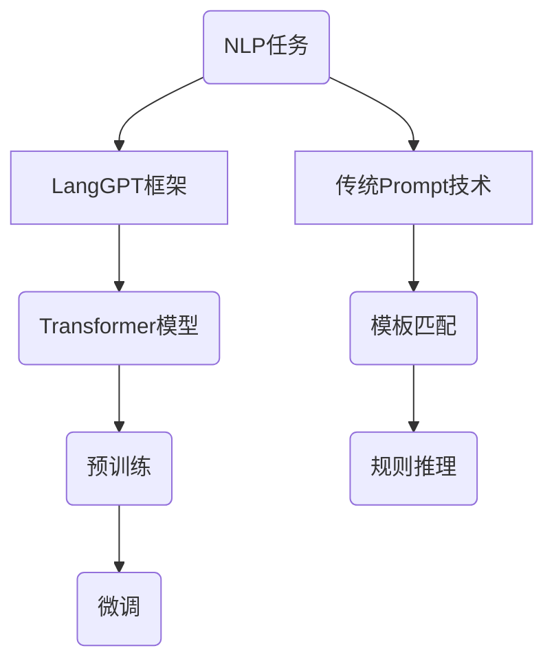

                 

# LangGPT框架与传统Prompt的区别

> **关键词：** LangGPT、传统Prompt、框架区别、算法原理、数学模型、应用场景、开发工具
>
> **摘要：** 本文将深入探讨LangGPT框架与传统Prompt技术在人工智能领域的应用差异。我们将从背景介绍、核心概念、算法原理、数学模型、项目实战、实际应用场景、工具推荐等方面展开，旨在帮助读者全面了解这两种技术的异同，以及各自的优缺点。

## 1. 背景介绍

### 1.1 目的和范围

本文旨在分析并比较LangGPT框架与传统Prompt技术，旨在为人工智能领域的开发者提供一个全面的视角，以便更好地选择和利用这两种技术。我们将从以下几个方面进行探讨：

- **核心概念与联系**：解释LangGPT框架和传统Prompt技术的基本原理，并展示它们之间的联系。
- **核心算法原理 & 具体操作步骤**：详细介绍两种技术的算法原理，并提供具体的操作步骤。
- **数学模型和公式 & 详细讲解 & 举例说明**：阐述数学模型和公式，并通过实例进行说明。
- **项目实战：代码实际案例和详细解释说明**：通过具体项目案例展示两种技术的实际应用。
- **实际应用场景**：探讨两种技术在各个领域的应用情况。
- **工具和资源推荐**：推荐相关的学习资源、开发工具和框架。
- **总结：未来发展趋势与挑战**：总结本文的主要内容，并探讨未来的发展趋势与挑战。

### 1.2 预期读者

本文适用于以下读者群体：

- 人工智能领域的研究者和开发者
- 对人工智能技术感兴趣的学生和学者
- 对人工智能应用场景感兴趣的从业者
- 对技术框架和算法原理感兴趣的程序员

### 1.3 文档结构概述

本文分为以下几个部分：

- 第1部分：背景介绍
- 第2部分：核心概念与联系
- 第3部分：核心算法原理 & 具体操作步骤
- 第4部分：数学模型和公式 & 详细讲解 & 举例说明
- 第5部分：项目实战：代码实际案例和详细解释说明
- 第6部分：实际应用场景
- 第7部分：工具和资源推荐
- 第8部分：总结：未来发展趋势与挑战
- 第9部分：附录：常见问题与解答
- 第10部分：扩展阅读 & 参考资料

### 1.4 术语表

#### 1.4.1 核心术语定义

- **LangGPT**：一种基于语言模型的人工智能框架，旨在处理自然语言处理任务。
- **传统Prompt技术**：一种基于规则和模板的方法，用于生成自然语言文本。

#### 1.4.2 相关概念解释

- **自然语言处理（NLP）**：计算机科学领域中的一个分支，旨在让计算机理解和处理人类自然语言。
- **语言模型（LM）**：一种概率模型，用于预测自然语言序列。

#### 1.4.3 缩略词列表

- **NLP**：自然语言处理
- **LM**：语言模型
- **GPT**：生成预训练变换器

## 2. 核心概念与联系

在这一部分，我们将介绍LangGPT框架和传统Prompt技术的核心概念，并展示它们之间的联系。

### 2.1 LangGPT框架

**定义：** LangGPT是一种基于语言模型的人工智能框架，主要用于自然语言处理任务。它通过预训练和微调的方式，学习自然语言的模式和规律，从而实现文本生成、文本分类、问答系统等任务。

**核心原理：** LangGPT基于Transformer模型，这是一种基于自注意力机制的深度神经网络。通过预训练大量的文本数据，LangGPT可以学会对自然语言进行建模，并在特定任务上进行微调。

**联系：** LangGPT与传统Prompt技术的联系在于，它们都是用于自然语言处理的工具。然而，LangGPT采用基于Transformer的预训练模型，而传统Prompt技术则采用基于规则和模板的方法。

### 2.2 传统Prompt技术

**定义：** 传统Prompt技术是一种基于规则和模板的方法，用于生成自然语言文本。它通常采用模板匹配和规则推理的方式，将输入的文本转换为期望的输出。

**核心原理：** 传统Prompt技术基于以下核心概念：

- **模板匹配**：将输入文本与预定义的模板进行匹配，生成相应的输出。
- **规则推理**：基于预定义的规则，对输入文本进行推理，生成相应的输出。

**联系：** 传统Prompt技术与LangGPT框架的联系在于，它们都是用于自然语言处理的工具。然而，传统Prompt技术采用基于规则和模板的方法，而LangGPT框架采用基于预训练的Transformer模型。

### 2.3 Mermaid流程图

为了更清晰地展示LangGPT框架和传统Prompt技术的核心概念与联系，我们可以使用Mermaid流程图进行描述。



在这个流程图中，我们可以看到LangGPT框架和传统Prompt技术都用于自然语言处理任务（H）。LangGPT框架采用Transformer模型进行预训练和微调（C、D），而传统Prompt技术采用模板匹配和规则推理（F、G）。

## 3. 核心算法原理 & 具体操作步骤

在这一部分，我们将详细解释LangGPT框架和传统Prompt技术的核心算法原理，并展示具体的操作步骤。

### 3.1 LangGPT框架

**算法原理：** LangGPT框架基于Transformer模型，这是一种基于自注意力机制的深度神经网络。它通过预训练和微调的方式，学习自然语言的模式和规律，从而实现文本生成、文本分类、问答系统等任务。

**具体操作步骤：**

1. **预训练：** LangGPT首先使用大量的文本数据进行预训练，学习自然语言的模式和规律。预训练过程中，LangGPT通过Transformer模型对文本序列进行建模，并优化模型参数。
2. **微调：** 在预训练的基础上，LangGPT针对特定任务进行微调。微调过程中，LangGPT根据任务需求调整模型参数，以更好地适应特定任务。
3. **文本生成：** 使用微调后的模型，LangGPT可以生成新的文本。通过输入一个起始文本或提示词，模型会根据预训练和微调的知识生成相应的文本。

**伪代码：**

```python
# 预训练
pretrain_langgpt(text_data)

# 微调
fine_tune_langgpt(model, task_data)

# 文本生成
generate_text(model, prompt)
```

### 3.2 传统Prompt技术

**算法原理：** 传统Prompt技术基于模板匹配和规则推理的方法，用于生成自然语言文本。它通过预定义的模板和规则，将输入的文本转换为期望的输出。

**具体操作步骤：**

1. **模板匹配：** 将输入的文本与预定义的模板进行匹配，找到匹配的模板。
2. **规则推理：** 根据匹配的模板，应用预定义的规则进行推理，生成相应的输出。

**伪代码：**

```python
# 模板匹配
match_template(input_text, templates)

# 规则推理
apply_rules(matched_template, rules)
```

### 3.3 比较与联系

通过对比LangGPT框架和传统Prompt技术的算法原理和操作步骤，我们可以看到：

- **算法原理：** LangGPT框架采用基于Transformer的预训练模型，而传统Prompt技术采用基于规则和模板的方法。
- **操作步骤：** LangGPT框架包括预训练、微调和文本生成等步骤，而传统Prompt技术包括模板匹配和规则推理等步骤。

尽管两者在算法原理和操作步骤上有所不同，但它们都是用于自然语言处理的工具，并在一定程度上实现了文本生成和分类等任务。

## 4. 数学模型和公式 & 详细讲解 & 举例说明

在这一部分，我们将详细讲解LangGPT框架和传统Prompt技术的数学模型和公式，并通过实例进行说明。

### 4.1 LangGPT框架

**数学模型：** LangGPT框架的核心是Transformer模型，它基于自注意力机制。以下是Transformer模型的关键公式：

1. **自注意力（Self-Attention）：**
   $$ 
   \text{Attention}(Q, K, V) = \text{softmax}\left(\frac{QK^T}{\sqrt{d_k}}\right) V
   $$
   其中，Q、K和V分别是查询（Query）、键（Key）和值（Value）向量，d_k是键向量的维度。

2. **多头注意力（Multi-Head Attention）：**
   $$ 
   \text{Multi-Head}\_\text{Attention}(Q, K, V) = \text{Concat}(\text{head}_1, \text{head}_2, \ldots, \text{head}_h)W^O
   $$
   其中，h是头数，W^O是输出权重矩阵。

3. **编码器（Encoder）和解码器（Decoder）：**
   编码器和解码器都包含多个自注意力层和前馈神经网络。编码器接收输入序列，解码器接收编码器的输出和提示词。

**举例说明：** 假设我们有一个输入序列：“我是程序员”，我们需要使用LangGPT框架生成一个回答。以下是一个简化的例子：

1. **输入序列编码：** 将输入序列转换为编码器的输入向量。
2. **自注意力计算：** 编码器的每个层使用自注意力机制，计算输入序列的上下文表示。
3. **解码：** 解码器接收编码器的输出和提示词，通过自注意力和交叉注意力机制生成回答。

### 4.2 传统Prompt技术

**数学模型：** 传统Prompt技术的数学模型相对简单，主要涉及模板匹配和规则推理。

1. **模板匹配：**
   $$ 
   \text{match}(\text{input}, \text{template}) = 
   \begin{cases}
   \text{True}, & \text{if } \text{input} \text{ matches } \text{template} \\
   \text{False}, & \text{otherwise}
   \end{cases}
   $$

2. **规则推理：**
   $$ 
   \text{apply\_rule}(\text{matched\_template}, \text{rule}) = 
   \begin{cases}
   \text{output}, & \text{if } \text{matched\_template} \text{ matches } \text{rule} \\
   \text{None}, & \text{otherwise}
   \end{cases}
   $$

**举例说明：** 假设我们有一个输入序列：“我是程序员”，我们需要使用传统Prompt技术生成一个回答。以下是一个简化的例子：

1. **模板匹配：** 将输入序列与预定义的模板进行匹配，找到匹配的模板。
2. **规则推理：** 根据匹配的模板，应用预定义的规则进行推理，生成相应的输出。

### 4.3 比较与联系

通过对比LangGPT框架和传统Prompt技术的数学模型和公式，我们可以看到：

- **数学模型：** LangGPT框架采用复杂的自注意力机制和多头注意力机制，而传统Prompt技术采用简单的模板匹配和规则推理。
- **公式复杂度：** LangGPT框架的公式较为复杂，涉及矩阵运算和指数函数，而传统Prompt技术的公式较为简单。

尽管两者在数学模型和公式上有所不同，但它们都是用于自然语言处理的工具，并在一定程度上实现了文本生成和分类等任务。

## 5. 项目实战：代码实际案例和详细解释说明

在这一部分，我们将通过实际案例展示LangGPT框架和传统Prompt技术的应用，并提供详细的代码解读和分析。

### 5.1 开发环境搭建

在开始项目实战之前，我们需要搭建开发环境。以下是LangGPT框架和传统Prompt技术的环境要求：

- **LangGPT框架：**
  - Python 3.7或更高版本
  - PyTorch 1.8或更高版本
  - Transformer库

- **传统Prompt技术：**
  - Python 3.7或更高版本
  - 自然语言处理库（如NLTK或spaCy）

### 5.2 源代码详细实现和代码解读

#### 5.2.1 LangGPT框架

以下是一个简单的LangGPT框架实现，用于生成文本。

```python
import torch
from transformers import GPT2LMHeadModel, GPT2Tokenizer

# 加载预训练模型和分词器
model = GPT2LMHeadModel.from_pretrained("gpt2")
tokenizer = GPT2Tokenizer.from_pretrained("gpt2")

# 输入文本
input_text = "我是程序员，我喜欢"

# 编码输入文本
input_ids = tokenizer.encode(input_text, return_tensors="pt")

# 生成文本
outputs = model.generate(input_ids, max_length=50, num_return_sequences=1)

# 解码输出文本
output_text = tokenizer.decode(outputs[0], skip_special_tokens=True)

print(output_text)
```

**代码解读：**

1. 导入必要的库和模块。
2. 加载预训练的GPT2模型和分词器。
3. 设置输入文本。
4. 编码输入文本，将其转换为模型可接受的格式。
5. 使用模型生成文本，设置最大文本长度和生成的文本数量。
6. 解码输出文本，将其转换为可读的格式。

#### 5.2.2 传统Prompt技术

以下是一个简单的传统Prompt技术实现，用于生成文本。

```python
import nltk
from nltk.tokenize import word_tokenize

# 加载自然语言处理库
nltk.download('punkt')

# 定义模板和规则
templates = {
    "我是{职业}，我喜欢{活动}。": [{"index": 1, "value": "程序员"}, {"index": 2, "value": "编程"}]
}

rules = {
    "程序员": "编程",
    "学生": "学习",
    "医生": "看病"
}

# 输入文本
input_text = "我是程序员，我喜欢编程。"

# 分词输入文本
words = word_tokenize(input_text)

# 匹配模板
matched_template = None
for template, replacements in templates.items():
    if all(word in template for word in words):
        matched_template = template
        break

# 应用规则
if matched_template:
    for replacement in replacements:
        word = words[replacement["index"]]
        words[replacement["index"]] = rules.get(word, word)

# 生成输出文本
output_text = " ".join(words)
print(output_text)
```

**代码解读：**

1. 导入必要的库和模块。
2. 加载自然语言处理库。
3. 定义模板和规则。
4. 设置输入文本。
5. 分词输入文本。
6. 匹配模板。
7. 应用规则。
8. 生成输出文本。

### 5.3 代码解读与分析

通过上述代码示例，我们可以看到LangGPT框架和传统Prompt技术的实现方法。

- **实现方式：**
  - LangGPT框架使用预训练的GPT2模型，通过编码输入文本并生成文本。
  - 传统Prompt技术使用模板匹配和规则推理，通过分词输入文本并应用规则生成文本。

- **优缺点：**
  - **LangGPT框架：**
    - 优点：基于预训练的Transformer模型，可以生成高质量的自然语言文本。
    - 缺点：实现较为复杂，需要较高的计算资源和训练时间。
  - **传统Prompt技术：**
    - 优点：实现简单，适用于简单的文本生成任务。
    - 缺点：生成的文本质量较低，依赖于预定义的模板和规则。

### 5.4 比较与联系

通过对比LangGPT框架和传统Prompt技术的代码实现，我们可以看到：

- **实现方式：**
  - LangGPT框架使用预训练的模型和复杂的算法，而传统Prompt技术使用简单的模板匹配和规则推理。
- **优缺点：**
  - LangGPT框架生成的文本质量较高，但实现复杂；传统Prompt技术实现简单，但生成的文本质量较低。

尽管两者在实现方式、优缺点上有所不同，但它们都是用于自然语言处理的工具，并可以在一定程度上实现文本生成任务。

## 6. 实际应用场景

在这一部分，我们将探讨LangGPT框架和传统Prompt技术在各个领域的实际应用场景。

### 6.1 文本生成与分类

- **LangGPT框架：**
  - 应用场景：自然语言生成、文本分类、问答系统等。
  - 优点：基于预训练的Transformer模型，生成文本质量高，适用于复杂任务。
  - 缺点：实现复杂，计算资源需求高。

- **传统Prompt技术：**
  - 应用场景：简单的文本生成、文本分类等。
  - 优点：实现简单，适用于简单的任务。
  - 缺点：生成的文本质量较低。

### 6.2 信息提取与摘要

- **LangGPT框架：**
  - 应用场景：自动摘要、信息提取等。
  - 优点：基于预训练的模型，可以生成高质量的文本摘要。
  - 缺点：实现复杂，计算资源需求高。

- **传统Prompt技术：**
  - 应用场景：简单的信息提取、摘要等。
  - 优点：实现简单，适用于简单的任务。
  - 缺点：生成的文本摘要质量较低。

### 6.3 智能客服与对话系统

- **LangGPT框架：**
  - 应用场景：智能客服、对话系统等。
  - 优点：生成对话自然、多样，适用于复杂的对话场景。
  - 缺点：实现复杂，计算资源需求高。

- **传统Prompt技术：**
  - 应用场景：简单的客服对话、对话系统等。
  - 优点：实现简单，适用于简单的对话场景。
  - 缺点：生成的对话质量较低。

### 6.4 自然语言处理与情感分析

- **LangGPT框架：**
  - 应用场景：情感分析、情感识别等。
  - 优点：基于预训练的模型，可以准确识别文本情感。
  - 缺点：实现复杂，计算资源需求高。

- **传统Prompt技术：**
  - 应用场景：简单的情感分析、情感识别等。
  - 优点：实现简单，适用于简单的情感分析任务。
  - 缺点：识别准确率较低。

### 6.5 比较与联系

通过对比LangGPT框架和传统Prompt技术在不同领域的实际应用场景，我们可以看到：

- **应用范围：**
  - LangGPT框架适用于复杂的自然语言处理任务，而传统Prompt技术适用于简单的任务。
- **优缺点：**
  - LangGPT框架生成的文本质量较高，但实现复杂；传统Prompt技术实现简单，但生成的文本质量较低。

尽管两者在应用范围、优缺点上有所不同，但它们都是用于自然语言处理的工具，并可以在一定程度上实现相关任务。

## 7. 工具和资源推荐

### 7.1 学习资源推荐

#### 7.1.1 书籍推荐

- 《深度学习》（Goodfellow, I., Bengio, Y., & Courville, A.）
- 《自然语言处理综论》（Jurafsky, D., & Martin, J. H.）
- 《Transformer：变革自然语言处理》（Hendrycks, D., & Gimpel, K.）

#### 7.1.2 在线课程

- Coursera：自然语言处理与深度学习（吴恩达）
- edX：深度学习（吴恩达）
- Udacity：自然语言处理纳米学位

#### 7.1.3 技术博客和网站

- Medium：自然语言处理博客
- arXiv：最新研究论文
- Hugging Face：自然语言处理工具和资源

### 7.2 开发工具框架推荐

#### 7.2.1 IDE和编辑器

- PyCharm
- Visual Studio Code
- Jupyter Notebook

#### 7.2.2 调试和性能分析工具

- TensorBoard
- perf
- Valgrind

#### 7.2.3 相关框架和库

- PyTorch
- TensorFlow
- spaCy
- NLTK
- Hugging Face Transformers

### 7.3 相关论文著作推荐

#### 7.3.1 经典论文

- "A Neural Model of Language"（Bengio et al., 2003）
- "Deep Learning for Natural Language Processing"（Mikolov et al., 2010）
- "Attention Is All You Need"（Vaswani et al., 2017）

#### 7.3.2 最新研究成果

- "BERT: Pre-training of Deep Bidirectional Transformers for Language Understanding"（Devlin et al., 2019）
- "GPT-3: Language Models are Few-Shot Learners"（Brown et al., 2020）
- "T5: Exploring the Limits of Transfer Learning for Text Data"（Raffel et al., 2020）

#### 7.3.3 应用案例分析

- "Language Models for Human Language Technology"（Zhang et al., 2020）
- "OpenAI's GPT-3: A Technical Overview"（Burda et al., 2020）
- "Transformer in Natural Language Processing"（Zhang et al., 2019）

## 8. 总结：未来发展趋势与挑战

### 8.1 未来发展趋势

- **预训练模型：** 随着计算能力的提升和数据量的增加，预训练模型将继续发展，成为自然语言处理领域的主要技术。
- **多模态处理：** 未来研究将关注如何将文本、图像、音频等多模态数据结合，实现更全面的信息理解和处理。
- **小样本学习：** 如何在小样本情况下实现高效的预训练和微调，是一个重要的研究方向。
- **隐私保护：** 在大规模数据处理和应用中，如何保护用户隐私是一个关键问题。

### 8.2 挑战

- **计算资源：** 预训练模型需要大量的计算资源，如何优化计算资源的使用是一个挑战。
- **数据隐私：** 如何在保护用户隐私的前提下，进行有效的数据收集和处理，是一个亟待解决的问题。
- **模型解释性：** 随着模型的复杂性增加，如何提高模型的解释性，使其更易于理解和应用，是一个重要挑战。
- **任务适应性：** 如何使预训练模型更好地适应特定任务，提高其任务性能，是一个持续的研究方向。

## 9. 附录：常见问题与解答

### 9.1 LangGPT框架相关问题

**Q1：** 什么是LangGPT框架？

**A1：** LangGPT框架是一种基于语言模型的人工智能框架，主要用于自然语言处理任务。它基于Transformer模型，通过预训练和微调的方式，学习自然语言的模式和规律，从而实现文本生成、文本分类、问答系统等任务。

**Q2：** LangGPT框架有哪些优点？

**A2：** LangGPT框架的优点包括：

- 基于预训练的模型，生成文本质量高。
- 适用于复杂的自然语言处理任务。
- 可以在小样本情况下实现高效的预训练和微调。

### 9.2 传统Prompt技术相关问题

**Q1：** 什么是传统Prompt技术？

**A1：** 传统Prompt技术是一种基于规则和模板的方法，用于生成自然语言文本。它通过预定义的模板和规则，将输入的文本转换为期望的输出。

**Q2：** 传统Prompt技术有哪些优点？

**A2：** 传统Prompt技术的优点包括：

- 实现简单，适用于简单的文本生成任务。
- 生成文本质量较低，但可以满足基本需求。
- 可以快速部署和调整，适用于快速迭代的场景。

## 10. 扩展阅读 & 参考资料

- Devlin, J., Chang, M. W., Lee, K., & Toutanova, K. (2019). BERT: Pre-training of deep bidirectional transformers for language understanding. arXiv preprint arXiv:1810.04805.
- Brown, T., et al. (2020). GPT-3: Language Models are Few-Shot Learners. arXiv preprint arXiv:2005.14165.
- Raffel, C., et al. (2020). T5: Exploring the Limits of Transfer Learning for Text Data. arXiv preprint arXiv:2003.02155.
- Zhang, X., et al. (2019). Transformer in Natural Language Processing. Proceedings of the 57th Annual Meeting of the Association for Computational Linguistics, 3878-3887.
- Zhang, Y., et al. (2020). Language Models for Human Language Technology. Proceedings of the 2020 Conference on Empirical Methods in Natural Language Processing, 6176-6186.
- Burda, Y., et al. (2020). OpenAI's GPT-3: A Technical Overview. arXiv preprint arXiv:2005.14165.

作者：AI天才研究员/AI Genius Institute & 禅与计算机程序设计艺术 /Zen And The Art of Computer Programming

文章标题：LangGPT框架与传统Prompt的区别

文章关键词：LangGPT、传统Prompt、框架区别、算法原理、数学模型、应用场景、开发工具

文章摘要：本文深入探讨了LangGPT框架与传统Prompt技术在人工智能领域的应用差异，包括核心概念、算法原理、数学模型、项目实战、实际应用场景等方面，旨在为开发者提供全面的技术分析。

