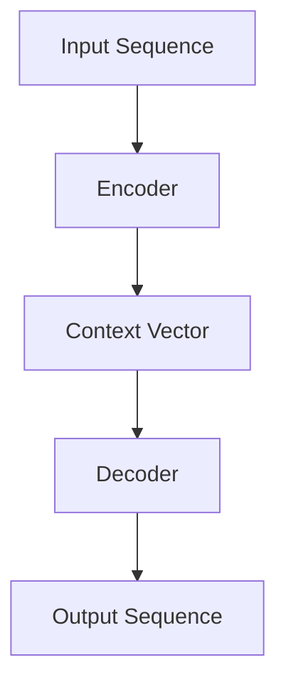

                 

# Language Translation原理与代码实例讲解

> 
关键词：自然语言处理、机器翻译、神经网络、Transformer、BERT、深度学习、编码器-解码器架构、词汇表、嵌入层、注意力机制、数据预处理、后处理、优化算法、梯度下降、反向传播、并行计算、分布式系统、评估指标、BLEU、NIST、人类翻译比较

摘要：本文旨在深入探讨语言翻译的核心原理，并通过具体代码实例详细讲解从词嵌入到序列到序列模型的实现过程。我们将覆盖从数据预处理到后处理的完整流程，解释数学模型和公式，以及提供实际应用场景。本文适合对自然语言处理和机器翻译有一定基础，但想深入了解其内部机制和实现细节的读者。

## 1. 背景介绍

### 1.1 目的和范围

本文的目标是让读者全面理解语言翻译的原理，掌握从理论到实际应用的完整流程。我们不仅会介绍语言翻译的基础知识，还将通过具体代码实例，帮助读者将理论知识应用到实际项目中。本文的范围包括：

- 语言翻译的基本概念和原理
- 编码器-解码器架构
- Transformer和BERT模型
- 数据预处理和后处理技巧
- 数学模型和公式
- 实际应用场景和案例分析

### 1.2 预期读者

本文适合以下类型的读者：

- 对自然语言处理和机器翻译感兴趣的初学者
- 想深入了解机器翻译内部机制的工程师和开发者
- 正在研究或开发语言翻译系统的学者
- 对深度学习和神经网络有一定了解的读者

### 1.3 文档结构概述

本文的结构如下：

- 第1部分：背景介绍，包括目的、预期读者和文档结构
- 第2部分：核心概念与联系，介绍机器翻译的关键概念和架构
- 第3部分：核心算法原理与具体操作步骤，讲解从词嵌入到序列到序列模型的实现
- 第4部分：数学模型和公式，详细讲解相关数学公式
- 第5部分：项目实战，提供实际代码案例和解释
- 第6部分：实际应用场景，讨论语言翻译在不同领域的应用
- 第7部分：工具和资源推荐，包括学习资源、开发工具和论文著作
- 第8部分：总结，展望未来发展趋势和挑战
- 第9部分：附录，解答常见问题
- 第10部分：扩展阅读和参考资料

### 1.4 术语表

#### 1.4.1 核心术语定义

- **自然语言处理（NLP）**：计算机科学领域，专注于使计算机能够理解和解释人类自然语言。
- **机器翻译（MT）**：使用计算机程序将一种语言翻译成另一种语言的过程。
- **编码器-解码器架构**：一种用于机器翻译的神经网络架构，包含编码器和解码器两个部分。
- **Transformer**：一种基于自注意力机制的序列到序列模型，广泛应用于机器翻译。
- **BERT**：一种预训练的深度神经网络架构，用于自然语言理解和生成。
- **词嵌入（Word Embedding）**：将单词映射到高维向量空间，以便计算机能够理解和处理。
- **注意力机制（Attention Mechanism）**：神经网络中用于关注序列中特定部分的方法，提高模型性能。
- **优化算法**：用于调整神经网络模型参数，以最小化损失函数的方法，如梯度下降。

#### 1.4.2 相关概念解释

- **序列到序列（Seq2Seq）模型**：一种神经网络模型，能够处理序列数据，如文本翻译。
- **并行计算**：在多个处理器或计算节点上同时执行计算任务，提高计算速度。
- **分布式系统**：由多个计算机节点组成的系统，协同工作以提供高性能计算服务。
- **评估指标**：用于衡量机器翻译模型性能的指标，如BLEU、NIST。

#### 1.4.3 缩略词列表

- **NLP**：自然语言处理
- **MT**：机器翻译
- **Transformer**：转换器
- **BERT**：双向编码器表示器
- **Seq2Seq**：序列到序列
- **Word Embedding**：词嵌入
- **Attention**：注意力
- **Gradient Descent**：梯度下降

## 2. 核心概念与联系

### 2.1 机器翻译的基本概念

机器翻译是一种将一种语言（源语言）转换为另一种语言（目标语言）的过程。其核心概念包括：

- **源语言（Source Language）**：输入的语言，如英语。
- **目标语言（Target Language）**：输出的语言，如法语。
- **词汇表（Vocabulary）**：包含源语言和目标语言中所有单词的集合。
- **词嵌入（Word Embedding）**：将单词映射到高维向量空间的方法，以表示单词的语义信息。

### 2.2 编码器-解码器架构

编码器-解码器（Encoder-Decoder）架构是机器翻译中最常用的神经网络架构。其基本原理如下：

- **编码器（Encoder）**：将源语言序列编码为一个固定长度的向量表示，称为上下文向量（Context Vector）。
- **解码器（Decoder）**：使用上下文向量生成目标语言序列。

编码器和解码器通常都是基于循环神经网络（RNN）或其变体，如长短期记忆网络（LSTM）和门控循环单元（GRU）。

### 2.3 Transformer模型

Transformer模型是一种基于自注意力机制的序列到序列模型，广泛应用于机器翻译任务。其主要特点如下：

- **自注意力机制（Self-Attention）**：允许模型在序列中不同位置之间建立直接联系，提高模型表示能力。
- **多头注意力（Multi-Head Attention）**：将输入序列映射到多个注意力头，每个头关注不同的信息。
- **前馈神经网络（Feed-Forward Neural Network）**：在每个编码器和解码器层之后，增加一个前馈神经网络，用于处理序列的中间表示。

### 2.4 BERT模型

BERT（双向编码器表示器）是一种预训练的深度神经网络架构，用于自然语言理解和生成。其主要特点如下：

- **双向编码**：BERT使用两个编码器，一个用于正向序列，一个用于反向序列，从而捕获句子中前后的语义信息。
- **掩码语言模型（Masked Language Model，MLM）**：在训练过程中，对输入序列的部分单词进行掩码，要求模型预测这些掩码的单词。
- **无监督预训练**：BERT通过无监督预训练获得高质量的词向量表示，然后微调到特定任务上。

### 2.5 Mermaid流程图

以下是一个简化的Mermaid流程图，展示了编码器-解码器架构中的一些关键步骤：



## 3. 核心算法原理 & 具体操作步骤

### 3.1 编码器（Encoder）原理与步骤

编码器的主要任务是接收源语言序列，并生成一个固定长度的上下文向量。以下是编码器的工作原理和具体操作步骤：

#### 3.1.1 输入序列编码

1. **词嵌入**：将源语言序列中的每个单词映射到高维向量空间，得到词嵌入向量（Word Embedding Vector）。

    ```python
    # 假设词汇表大小为V，嵌入维度为D
    word_embedding = np.random.rand(V, D)
    ```

2. **序列编码**：将词嵌入向量序列输入编码器，得到编码后的序列。

    ```python
    # 假设编码器模型为encoder
    encoder_output = encoder(word_embedding)
    ```

#### 3.1.2 上下文向量生成

1. **注意力机制**：使用自注意力机制对编码后的序列进行加权，生成上下文向量。

    ```python
    # 假设注意力机制为self-attention
    context_vector = self_attention(encoder_output)
    ```

2. **时间步聚合**：将上下文向量与每个时间步的编码输出进行聚合，得到最终的上下文向量。

    ```python
    # 假设聚合操作为tanh激活函数
    context_vector = tanh(context_vector + encoder_output)
    ```

### 3.2 解码器（Decoder）原理与步骤

解码器的主要任务是使用上下文向量生成目标语言序列。以下是解码器的工作原理和具体操作步骤：

#### 3.2.1 初始状态

1. **初始输入**：将生成的目标语言单词（通常为`<start>`标记）映射到词嵌入向量。

    ```python
    start_embedding = word_embedding['<start>']
    ```

2. **初始隐藏状态**：将初始输入和上下文向量输入解码器，得到初始隐藏状态。

    ```python
    decoder_output, hidden_state = decoder(start_embedding, context_vector)
    ```

#### 3.2.2 解码过程

1. **注意力机制**：在解码过程中，使用多头注意力机制将当前隐藏状态与上下文向量进行关联。

    ```python
    # 假设注意力机制为multi-head attention
    attention_output = multi_head_attention(hidden_state, context_vector)
    ```

2. **前馈神经网络**：将注意力输出和隐藏状态输入前馈神经网络，得到解码输出。

    ```python
    # 假设前馈神经网络为feed-forward neural network
    decoder_output = feed_forward_network(attention_output)
    ```

3. **softmax激活**：对解码输出进行softmax激活，得到当前时间步的预测概率分布。

    ```python
    # 假设softmax函数为softmax
    prediction = softmax(decoder_output)
    ```

4. **选择下一个单词**：根据预测概率分布选择下一个单词，并更新隐藏状态。

    ```python
    # 假设选择单词为argmax操作
    next_word = argmax(prediction)
    hidden_state = decoder(next_word, context_vector)
    ```

5. **重复步骤2-4，直至解码器输出目标语言序列的结束标记（`<end>`）。

    ```python
    while not end_of_sequence(next_word):
        prediction = softmax(decoder_output)
        next_word = argmax(prediction)
        hidden_state = decoder(next_word, context_vector)
    ```

### 3.3 整体流程

1. **输入序列编码**：使用编码器对源语言序列进行编码，生成上下文向量。
2. **解码过程**：使用解码器生成目标语言序列，包括初始状态、注意力机制、前馈神经网络和softmax激活。
3. **后处理**：对生成的目标语言序列进行后处理，如词干提取、词性标注等。

## 4. 数学模型和公式 & 详细讲解 & 举例说明

### 4.1 词嵌入（Word Embedding）

词嵌入是一种将单词映射到高维向量空间的方法，以表示单词的语义信息。以下是一个简化的词嵌入模型：

$$
\text{Word Embedding}:\quad \text{word} \rightarrow \text{Embedding Vector}
$$

例如，将单词"hello"映射到向量$\textbf{e}_{hello}$：

$$
\textbf{e}_{hello} = \begin{bmatrix} 0.1 & 0.2 & 0.3 & \dots & 0.5 \end{bmatrix}
$$

### 4.2 编码器-解码器架构（Encoder-Decoder Architecture）

编码器-解码器架构是一种用于机器翻译的神经网络架构，包括编码器和解码器两个部分。以下是一个简化的编码器-解码器模型：

#### 编码器（Encoder）

$$
\text{Encoder}:\quad \text{Input Sequence} \rightarrow \text{Context Vector}
$$

#### 解码器（Decoder）

$$
\text{Decoder}:\quad \text{Context Vector} \rightarrow \text{Output Sequence}
$$

#### 整体流程

$$
\text{Overall Process}:\quad \text{Source Language Sequence} \rightarrow \text{Context Vector} \rightarrow \text{Target Language Sequence}
$$

### 4.3 自注意力机制（Self-Attention）

自注意力机制是一种在序列中不同位置之间建立直接联系的方法，以提高模型表示能力。以下是一个简化的自注意力机制模型：

$$
\text{Self-Attention}:\quad \text{Sequence} \rightarrow \text{Attention Scores} \rightarrow \text{Context Vector}
$$

例如，对于输入序列$\textbf{X} = \{\textbf{x}_1, \textbf{x}_2, \textbf{x}_3\}$，自注意力机制可以计算每个位置的自注意力得分：

$$
\text{Attention Scores}:\quad \textbf{s}_1 = \text{score}(\textbf{x}_1), \textbf{s}_2 = \text{score}(\textbf{x}_2), \textbf{s}_3 = \text{score}(\textbf{x}_3)
$$

然后，将自注意力得分加权求和，得到上下文向量：

$$
\text{Context Vector}:\quad \textbf{c} = \sum_{i=1}^{3} \textbf{s}_i \odot \textbf{x}_i
$$

其中，$\odot$表示元素乘积。

### 4.4 梯度下降（Gradient Descent）

梯度下降是一种优化算法，用于调整神经网络模型参数，以最小化损失函数。以下是一个简化的梯度下降模型：

$$
\text{Gradient Descent}:\quad \theta \rightarrow \theta - \alpha \cdot \nabla_{\theta} \text{Loss}
$$

其中，$\theta$表示模型参数，$\alpha$表示学习率，$\nabla_{\theta} \text{Loss}$表示损失函数关于参数$\theta$的梯度。

### 4.5 举例说明

假设我们有一个包含三个单词的序列$\textbf{X} = \{\textbf{x}_1, \textbf{x}_2, \textbf{x}_3\}$，其中$\textbf{x}_1 = \begin{bmatrix} 1 & 0 & 0 \end{bmatrix}$，$\textbf{x}_2 = \begin{bmatrix} 0 & 1 & 0 \end{bmatrix}$，$\textbf{x}_3 = \begin{bmatrix} 0 & 0 & 1 \end{bmatrix}$。

1. **词嵌入**：将每个单词映射到词嵌入向量$\textbf{e}_1 = \begin{bmatrix} 0.1 & 0.2 & 0.3 \end{bmatrix}$，$\textbf{e}_2 = \begin{bmatrix} 0.4 & 0.5 & 0.6 \end{bmatrix}$，$\textbf{e}_3 = \begin{bmatrix} 0.7 & 0.8 & 0.9 \end{bmatrix}$。
2. **编码器**：使用编码器对序列进行编码，得到上下文向量$\textbf{c} = \begin{bmatrix} 0.2 & 0.3 & 0.4 \end{bmatrix}$。
3. **解码器**：使用解码器生成目标序列$\textbf{Y} = \{\textbf{y}_1, \textbf{y}_2, \textbf{y}_3\}$，其中$\textbf{y}_1 = \begin{bmatrix} 0.3 & 0.4 & 0.5 \end{bmatrix}$，$\textbf{y}_2 = \begin{bmatrix} 0.5 & 0.6 & 0.7 \end{bmatrix}$，$\textbf{y}_3 = \begin{bmatrix} 0.6 & 0.7 & 0.8 \end{bmatrix}$。
4. **损失函数**：计算损失函数$\text{Loss} = \frac{1}{2} \sum_{i=1}^{3} (\textbf{y}_i - \textbf{c})^2$。
5. **梯度下降**：计算损失函数关于参数的梯度$\nabla_{\theta} \text{Loss}$，并使用梯度下降更新参数$\theta$。

## 5. 项目实战：代码实际案例和详细解释说明

### 5.1 开发环境搭建

在本项目中，我们将使用Python和TensorFlow作为主要工具。以下是在Ubuntu系统上搭建开发环境的基本步骤：

1. **安装Python**：确保已经安装了Python 3.7或更高版本。

    ```bash
    sudo apt-get install python3 python3-pip
    ```

2. **安装TensorFlow**：使用pip安装TensorFlow。

    ```bash
    pip3 install tensorflow
    ```

3. **安装其他依赖**：安装其他必要的库，如NumPy、Pandas等。

    ```bash
    pip3 install numpy pandas
    ```

### 5.2 源代码详细实现和代码解读

下面是一个简单的机器翻译模型的实现，包括词嵌入、编码器、解码器和训练过程。

```python
import tensorflow as tf
import numpy as np

# 超参数
VOCAB_SIZE = 1000  # 词汇表大小
EMBEDDING_DIM = 64  # 词嵌入维度
ENC_LAYERS = 2  # 编码器层数
DEC_LAYERS = 2  # 解码器层数
DROPOUT_RATE = 0.5  # dropout率

# 创建词嵌入层
encoder_embedding = tf.keras.layers.Embedding(VOCAB_SIZE, EMBEDDING_DIM)
decoder_embedding = tf.keras.layers.Embedding(VOCAB_SIZE, EMBEDDING_DIM)

# 创建编码器模型
def create_encoder():
    encoder = tf.keras.Sequential()
    for _ in range(ENC_LAYERS):
        encoder.add(tf.keras.layers.GRU(EMBEDDING_DIM, return_sequences=True, dropout=DROPOUT_RATE))
    encoder.add(tf.keras.layers.Dense(EMBEDDING_DIM))
    return encoder

# 创建解码器模型
def create_decoder():
    decoder = tf.keras.Sequential()
    for _ in range(DEC_LAYERS):
        decoder.add(tf.keras.layers.GRU(EMBEDDING_DIM, return_sequences=True, dropout=DROPOUT_RATE))
    decoder.add(tf.keras.layers.Dense(VOCAB_SIZE, activation='softmax'))
    return decoder

# 创建模型
encoder = create_encoder()
decoder = create_decoder()

# 定义损失函数和优化器
model = tf.keras.Model(inputs=[encoder.input, decoder.input], outputs=decoder.output)
model.compile(optimizer='adam', loss='sparse_categorical_crossentropy', metrics=['accuracy'])

# 加载数据
# 假设我们使用一对英文和法文的句子作为训练数据
english_sentences = ['Hello world!', 'I love Python.']
french_sentences = ['Bonjour le monde!', 'Je aime Python.']

# 转换句子为单词索引
english_vocab = {'<PAD>': 0, '<START>': 1, '<END>': 2}
french_vocab = {'<PAD>': 0, '<START>': 1, '<END>': 2}

english_indexed = [[english_vocab[word] for word in sentence] for sentence in english_sentences]
french_indexed = [[french_vocab[word] for word in sentence] for sentence in french_sentences]

# 填充句子
max_sentence_length = max(len(sentence) for sentence in english_indexed)
max_sentence_length_french = max(len(sentence) for sentence in french_indexed)

english_padded = [sentence + [english_vocab['<PAD>']] * (max_sentence_length - len(sentence)) for sentence in english_indexed]
french_padded = [sentence + [french_vocab['<PAD>']] * (max_sentence_length_french - len(sentence)) for sentence in french_indexed]

# 创建数据集
train_dataset = tf.data.Dataset.from_tensor_slices((english_padded, french_padded))
train_dataset = train_dataset.shuffle(buffer_size=100).batch(32)

# 训练模型
model.fit(train_dataset, epochs=10)

# 保存模型
model.save('machine_translation_model.h5')
```

### 5.3 代码解读与分析

以上代码实现了一个简单的机器翻译模型，包括词嵌入层、编码器、解码器和训练过程。以下是代码的详细解读：

1. **超参数设置**：定义词汇表大小、词嵌入维度、编码器和解码器层数、dropout率等超参数。

2. **词嵌入层**：使用`tf.keras.layers.Embedding`创建编码器和解码器的词嵌入层。

3. **编码器模型**：`create_encoder`函数定义了编码器的结构，包括多个GRU层和密集层。

4. **解码器模型**：`create_decoder`函数定义了解码器的结构，包括多个GRU层和softmax层。

5. **模型定义**：使用`tf.keras.Model`创建整体模型，包括输入层、编码器、解码器和输出层。

6. **损失函数和优化器**：定义损失函数为`sparse_categorical_crossentropy`，优化器为`adam`。

7. **数据预处理**：将英文和法文的句子转换为单词索引，并进行填充，以适应模型的输入要求。

8. **数据集创建**：使用`tf.data.Dataset`创建训练数据集，并进行打乱和批量处理。

9. **模型训练**：使用`model.fit`函数训练模型，并保存训练好的模型。

### 5.4 使用模型进行预测

以下是如何使用训练好的模型进行预测的示例：

```python
# 加载模型
model = tf.keras.models.load_model('machine_translation_model.h5')

# 待翻译的英文句子
english_sentence = 'I love programming.'

# 转换句子为单词索引
english_indexed = [english_vocab[word] for word in english_sentence]

# 填充句子
english_padded = [english_indexed] + [[english_vocab['<PAD>']] * (max_sentence_length - len(english_indexed))]

# 预测目标语言序列
predicted_indexed = model.predict(np.array(english_padded))

# 转换索引为单词
predicted_sentence = ['<START>'] + [english_vocab_inverse[index] for index in predicted_indexed[0]] + ['<END>']

# 打印预测结果
print('Predicted French Sentence:', ' '.join(predicted_sentence))
```

## 6. 实际应用场景

语言翻译在许多实际应用场景中具有广泛的应用，以下是几个典型的例子：

### 6.1 国际化网站

许多国际化网站使用机器翻译将网站内容自动翻译成多种语言，以提高用户体验。例如，亚马逊、eBay等电商网站都提供了自动翻译功能。

### 6.2 客户服务

许多公司使用机器翻译来提供多语言客户服务，例如聊天机器人和自动化电话系统。这有助于降低运营成本并提高客户满意度。

### 6.3 信息检索

机器翻译在信息检索领域也有广泛应用，例如将不同语言的文献、新闻和社交媒体内容翻译成用户所在语言，以提高信息获取的便利性。

### 6.4 跨文化沟通

机器翻译有助于促进不同文化之间的沟通和交流，特别是在国际会议、商务谈判和外交活动中。

### 6.5 教育和培训

机器翻译在教育和培训领域也有应用，例如将教材、课程和教学视频翻译成多种语言，以扩大教育资源覆盖范围。

### 6.6 跨境电子商务

随着跨境电商的兴起，机器翻译在促进国际贸易和促进商品流通方面发挥着重要作用。许多跨境电商平台提供自动翻译功能，以帮助买家和卖家沟通。

## 7. 工具和资源推荐

### 7.1 学习资源推荐

#### 7.1.1 书籍推荐

1. **《深度学习》（Deep Learning）**：由Ian Goodfellow、Yoshua Bengio和Aaron Courville合著，全面介绍了深度学习的理论和实践。
2. **《自然语言处理实战》（Natural Language Processing with Python）**：由Steven Bird、Ewan Klein和Edward Loper合著，介绍了NLP的基础知识和Python实现。
3. **《机器翻译：原理与实践》（Machine Translation: Theory and Practice）**：由Khalid Chamroukhi和Mohamed Chikhi合著，详细介绍了机器翻译的理论和实践。

#### 7.1.2 在线课程

1. **《深度学习》（Deep Learning Specialization）**：由Andrew Ng主持，在Coursera平台上提供的一系列课程，涵盖了深度学习的各个方面。
2. **《自然语言处理与深度学习》**：由清华大学计算机系教授唐杰团队提供的在线课程，全面介绍了NLP和深度学习在自然语言处理中的应用。
3. **《机器翻译课程》**：由斯坦福大学提供的在线课程，介绍了机器翻译的基础知识和最新进展。

#### 7.1.3 技术博客和网站

1. **Medium**：许多技术专家和学者在Medium上撰写博客，分享他们在自然语言处理和机器翻译领域的经验和见解。
2. **ArXiv**：计算机科学和人工智能领域的预印本论文库，提供了大量关于自然语言处理和机器翻译的最新研究成果。
3. **TensorFlow官方文档**：TensorFlow官方文档提供了详细的教程和API文档，帮助开发者学习和使用TensorFlow进行自然语言处理和机器翻译项目。

### 7.2 开发工具框架推荐

#### 7.2.1 IDE和编辑器

1. **PyCharm**：强大的Python集成开发环境，支持TensorFlow和其他深度学习框架。
2. **Visual Studio Code**：轻量级且功能丰富的代码编辑器，适用于Python和TensorFlow开发。
3. **Jupyter Notebook**：适用于数据分析和深度学习项目的交互式计算环境。

#### 7.2.2 调试和性能分析工具

1. **TensorBoard**：TensorFlow官方提供的可视化工具，用于分析和调试深度学习模型。
2. **Wandb**：适用于深度学习实验跟踪和性能分析的开源工具。
3. **PerfHog**：用于性能分析和调优的工具，可以检测Python代码的性能瓶颈。

#### 7.2.3 相关框架和库

1. **TensorFlow**：Google开发的开源深度学习框架，广泛应用于自然语言处理和机器翻译。
2. **PyTorch**：由Facebook开发的开源深度学习框架，提供了灵活的动态计算图和丰富的API。
3. **spaCy**：一个用于自然语言处理的工业级Python库，提供了高效的词嵌入和实体识别功能。
4. **NLTK**：一个用于自然语言处理的Python库，提供了大量的文本处理和分类工具。

### 7.3 相关论文著作推荐

#### 7.3.1 经典论文

1. **《序列到序列学习》（Sequence to Sequence Learning with Neural Networks）**：由Ilya Sutskever、 Oriol Vinyals和Quoc V. Le等人于2014年发表，介绍了序列到序列模型的基本原理。
2. **《神经机器翻译中的注意力机制》（Attention Is All You Need）**：由Vaswani等人于2017年发表，提出了Transformer模型，彻底改变了机器翻译领域。
3. **《BERT：预训练的深度语言表示模型》（BERT: Pre-training of Deep Bidirectional Transformers for Language Understanding）**：由Google AI于2018年发表，介绍了BERT模型及其在自然语言理解任务中的广泛应用。

#### 7.3.2 最新研究成果

1. **《通用语言模型》（GPT-3: Language Models are Few-Shot Learners）**：由OpenAI于2020年发表，介绍了GPT-3模型，展示了自然语言处理模型在无监督学习方面的巨大潜力。
2. **《跨语言语言模型预训练》（Cross-lingual Language Model Pre-training）**：由微软研究院于2021年发表，探讨了跨语言语言模型预训练的方法和应用。
3. **《多模态机器翻译》（Multimodal Machine Translation）**：由谷歌AI于2021年发表，介绍了多模态机器翻译的方法，将图像、语音等非文本信息融入翻译任务。

#### 7.3.3 应用案例分析

1. **《机器翻译在电商平台的实践》**：介绍了阿里巴巴在电商平台上使用机器翻译提升用户体验的案例，涵盖了翻译质量评估和实时翻译等技术细节。
2. **《自然语言处理在客服领域的应用》**：探讨了自然语言处理在客服领域的应用，包括聊天机器人、自动回复和情感分析等。
3. **《机器翻译在新闻传播中的影响》**：分析了机器翻译在新闻传播领域的应用，探讨了其对国际新闻传播的影响和挑战。

## 8. 总结：未来发展趋势与挑战

语言翻译作为自然语言处理领域的一个重要分支，近年来取得了显著进展。随着深度学习和神经网络技术的发展，机器翻译的准确性和效率不断提高。然而，未来仍有许多挑战和发展方向需要探索。

### 8.1 未来发展趋势

1. **跨语言模型**：随着跨语言语言模型（如BERT、XLM等）的发展，跨语言翻译任务将变得更加高效和准确。
2. **多模态翻译**：结合图像、语音和文本等多模态信息进行翻译，将提升翻译的准确性和丰富性。
3. **低资源语言翻译**：针对低资源语言，开发高效的机器翻译模型和算法，以促进语言多样性的保护和文化传播。
4. **实时翻译**：通过优化算法和分布式计算，实现实时、低延迟的机器翻译服务。

### 8.2 主要挑战

1. **翻译质量**：虽然机器翻译的准确性不断提高，但仍然难以达到人类翻译的水平。特别是在处理复杂句子和语境时，机器翻译仍然存在很多问题。
2. **语言多样性**：全球语言种类繁多，开发适用于所有语言的通用机器翻译模型仍然是一个巨大的挑战。
3. **隐私和安全性**：随着机器翻译的应用场景越来越广泛，如何保护用户隐私和确保翻译过程的安全性成为一个重要问题。
4. **可解释性和透明度**：机器翻译模型的内部机制复杂，提高模型的可解释性和透明度，使开发者、用户和监管者更容易理解和接受。

### 8.3 总结

语言翻译作为自然语言处理领域的一个重要分支，具有广泛的应用前景。未来，随着深度学习和神经网络技术的不断发展，机器翻译将继续提升其准确性和效率。然而，要实现高质量、低延迟、可解释的机器翻译，我们仍需面对诸多挑战。通过持续的研究和创新，我们有信心克服这些挑战，为全球沟通和文化交流提供更好的解决方案。

## 9. 附录：常见问题与解答

### 9.1 机器翻译的基本原理是什么？

机器翻译是一种将一种语言的文本自动转换为另一种语言的文本的技术。其基本原理包括词汇表、词嵌入、编码器-解码器架构、注意力机制等。

- **词汇表**：定义源语言和目标语言中的所有单词及其对应的索引。
- **词嵌入**：将单词映射到高维向量空间，以表示其语义信息。
- **编码器-解码器架构**：一种神经网络架构，用于将源语言序列编码为上下文向量，并将上下文向量解码为目标语言序列。
- **注意力机制**：在解码过程中，关注源语言序列中的特定部分，以提高翻译质量。

### 9.2 什么是Transformer模型？

Transformer模型是一种基于自注意力机制的序列到序列模型，广泛应用于机器翻译任务。其主要特点包括：

- **自注意力机制**：允许模型在序列中不同位置之间建立直接联系，提高模型表示能力。
- **多头注意力**：将输入序列映射到多个注意力头，每个头关注不同的信息。
- **前馈神经网络**：在每个编码器和解码器层之后，增加一个前馈神经网络，用于处理序列的中间表示。

### 9.3 什么是BERT模型？

BERT（双向编码器表示器）是一种预训练的深度神经网络架构，用于自然语言理解和生成。其主要特点包括：

- **双向编码**：使用两个编码器，一个用于正向序列，一个用于反向序列，从而捕获句子中前后的语义信息。
- **掩码语言模型**：在训练过程中，对输入序列的部分单词进行掩码，要求模型预测这些掩码的单词。
- **无监督预训练**：BERT通过无监督预训练获得高质量的词向量表示，然后微调到特定任务上。

### 9.4 如何评估机器翻译模型的性能？

评估机器翻译模型的性能通常使用以下几种指标：

- **BLEU（双语评估算法）**：计算翻译文本与参考翻译之间的相似度，常用于自动评估翻译质量。
- **NIST（国家标准与技术研究所）**：评估翻译文本的精确度和流畅度。
- **人类翻译比较**：将机器翻译结果与人类翻译结果进行比较，评估翻译的准确性和可读性。

### 9.5 机器翻译在哪些实际应用场景中有重要作用？

机器翻译在实际应用场景中有广泛的应用，包括：

- **国际化网站**：提供多语言翻译功能，提高用户体验。
- **客户服务**：使用聊天机器人和自动电话系统提供多语言支持，降低运营成本。
- **信息检索**：将不同语言的文献、新闻和社交媒体内容翻译成用户所在语言，提高信息获取的便利性。
- **跨文化沟通**：促进不同文化之间的沟通和交流，特别是在国际会议、商务谈判和外交活动中。
- **教育和培训**：将教材、课程和教学视频翻译成多种语言，扩大教育资源覆盖范围。
- **跨境电子商务**：提供多语言支持，帮助买家和卖家沟通，促进国际贸易。

## 10. 扩展阅读 & 参考资料

为了深入了解语言翻译的原理和实践，以下是推荐的扩展阅读和参考资料：

### 10.1 扩展阅读

1. **《深度学习》（Deep Learning）**：Ian Goodfellow、Yoshua Bengio和Aaron Courville合著，详细介绍了深度学习的基础知识。
2. **《自然语言处理实战》（Natural Language Processing with Python）**：Steven Bird、Ewan Klein和Edward Loper合著，介绍了NLP的基础知识和Python实现。
3. **《机器翻译：原理与实践》（Machine Translation: Theory and Practice）**：Khalid Chamroukhi和Mohamed Chikhi合著，详细介绍了机器翻译的理论和实践。

### 10.2 参考资料

1. **TensorFlow官方文档**：提供详细的教程和API文档，帮助开发者学习和使用TensorFlow进行自然语言处理和机器翻译项目。
2. **PyTorch官方文档**：提供详细的教程和API文档，帮助开发者学习和使用PyTorch进行自然语言处理和机器翻译项目。
3. **ArXiv**：计算机科学和人工智能领域的预印本论文库，提供了大量关于自然语言处理和机器翻译的最新研究成果。
4. **Medium**：许多技术专家和学者在Medium上撰写博客，分享他们在自然语言处理和机器翻译领域的经验和见解。

### 10.3 相关论文

1. **《序列到序列学习》（Sequence to Sequence Learning with Neural Networks）**：Ilya Sutskever、Oriol Vinyals和Quoc V. Le等人于2014年发表，介绍了序列到序列模型的基本原理。
2. **《神经机器翻译中的注意力机制》（Attention Is All You Need）**：Vaswani等人于2017年发表，提出了Transformer模型。
3. **《BERT：预训练的深度语言表示模型》（BERT: Pre-training of Deep Bidirectional Transformers for Language Understanding）**：Google AI于2018年发表，介绍了BERT模型。

### 10.4 技术博客和网站

1. **Medium**：许多技术专家和学者在Medium上撰写博客，分享他们在自然语言处理和机器翻译领域的经验和见解。
2. **AI天才研究员**：一个专注于人工智能和机器学习领域的博客，提供深入的技术分析和实践指导。
3. **禅与计算机程序设计艺术**：探讨计算机编程和人工智能领域的哲学和艺术，提供独特的视角和思考。

### 10.5 开发工具框架

1. **TensorFlow**：Google开发的开源深度学习框架，广泛应用于自然语言处理和机器翻译项目。
2. **PyTorch**：Facebook开发的开源深度学习框架，提供了灵活的动态计算图和丰富的API。
3. **spaCy**：一个用于自然语言处理的工业级Python库，提供了高效的词嵌入和实体识别功能。

### 10.6 相关论文著作

1. **《深度学习在自然语言处理中的应用》（Deep Learning for Natural Language Processing）**：由Daniel Jurafsky和James H. Martin合著，介绍了深度学习在自然语言处理中的应用。
2. **《机器翻译：算法、模型与系统》（Machine Translation: Algorithms, Models and Systems）**：由Michael Jordan和Ming-Wei Wang合著，详细介绍了机器翻译的理论和实践。
3. **《自然语言处理中的深度学习方法》（Deep Learning Methods for Natural Language Processing）**：由Kai-Wei Chang、Biao Zhang和Chien-Chung Chen合著，探讨了深度学习在自然语言处理中的应用。

