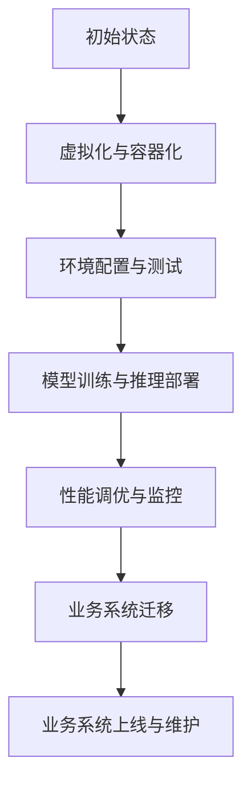

                 

# Lepton AI的云迁移方案：降低云平台迁移成本，实现无缝交互

> **关键词：** Lepton AI、云迁移、成本优化、无缝交互、技术博客

> **摘要：** 本文将深入探讨Lepton AI的云迁移方案，通过逻辑分析和实际操作步骤，揭示如何降低云平台迁移成本，实现业务系统的无缝交互。文章分为背景介绍、核心概念与联系、核心算法原理、数学模型和公式、项目实战、实际应用场景、工具和资源推荐以及总结等部分，旨在为读者提供全面的技术指南。

## 1. 背景介绍

### 1.1 目的和范围

本文旨在为AI开发者和IT运维人员提供一套有效的云迁移方案，专注于Lepton AI这一先进的人工智能框架。我们的目标是降低云平台迁移过程中的成本，并确保业务系统能够无缝迁移，保持高可用性和性能。

### 1.2 预期读者

预期读者包括：
- AI开发工程师
- IT运维工程师
- 系统架构师
- 企业IT部门主管

### 1.3 文档结构概述

本文结构如下：
1. 背景介绍
2. 核心概念与联系
3. 核心算法原理 & 具体操作步骤
4. 数学模型和公式 & 详细讲解 & 举例说明
5. 项目实战：代码实际案例和详细解释说明
6. 实际应用场景
7. 工具和资源推荐
8. 总结：未来发展趋势与挑战
9. 附录：常见问题与解答
10. 扩展阅读 & 参考资料

### 1.4 术语表

#### 1.4.1 核心术语定义

- **云迁移**：将业务系统从本地数据中心迁移到云平台的过程。
- **Lepton AI**：一种高性能、轻量级的人工智能框架，支持多种AI模型的部署和运行。
- **成本优化**：通过优化资源配置、减少冗余服务、提高系统效率等方式降低迁移成本。

#### 1.4.2 相关概念解释

- **虚拟化**：通过虚拟化技术，将物理资源抽象成逻辑资源，提高资源利用率。
- **容器化**：通过容器技术，将应用程序及其依赖环境打包在一起，实现环境的隔离和轻量级部署。

#### 1.4.3 缩略词列表

- **AI**：人工智能
- **VM**：虚拟机
- **Kubernetes**：一个开源的容器编排平台
- **Docker**：一个开源的应用容器引擎

## 2. 核心概念与联系

### 2.1 Lepton AI架构概述

Lepton AI是一个基于微服务架构的人工智能框架，其核心组件包括：

- **模型训练服务**：负责AI模型的训练和优化。
- **模型推理服务**：负责处理输入数据，输出预测结果。
- **数据存储服务**：负责存储和管理训练数据和模型参数。
- **监控与日志服务**：负责监控系统性能，记录日志信息。

### 2.2 Mermaid流程图

以下是一个简化的Lepton AI云迁移流程图：



### 2.3 关联概念

- **虚拟化**：通过虚拟化技术，将物理服务器抽象成多个虚拟机（VM），实现资源的动态分配和管理。
- **容器化**：通过容器（如Docker）将应用程序及其依赖环境打包在一起，实现环境的隔离和轻量级部署。

## 3. 核心算法原理 & 具体操作步骤

### 3.1 云迁移策略

云迁移分为以下几个步骤：

1. **需求分析**：评估现有系统性能、资源使用情况，确定迁移目标和可行性。
2. **虚拟化与容器化**：将现有系统虚拟化或容器化，便于迁移到云平台。
3. **环境配置与测试**：在云平台配置环境，进行测试，确保迁移后的系统性能满足要求。
4. **模型训练与推理部署**：迁移AI模型训练和推理服务，确保模型性能不受影响。
5. **性能调优与监控**：监控系统性能，进行调优，确保系统稳定运行。

### 3.2 伪代码

```python
# 云迁移伪代码

# 步骤1：需求分析
analyze_requirements()

# 步骤2：虚拟化与容器化
virtualize_and_containerize()

# 步骤3：环境配置与测试
configure_and_test_environment()

# 步骤4：模型训练与推理部署
deploy_model_training_and_inference()

# 步骤5：性能调优与监控
optimize_and_monitor_performance()
```

## 4. 数学模型和公式 & 详细讲解 & 举例说明

### 4.1 数学模型

云迁移成本主要包括以下几部分：

- **硬件成本**：虚拟机（VM）或容器所需的计算、存储和网络资源。
- **软件成本**：云平台订阅费用、第三方服务费用等。
- **人力成本**：迁移过程中的开发、测试和运维人员费用。

### 4.2 公式

- **总成本（TC）**：TC = 硬件成本 + 软件成本 + 人力成本

### 4.3 举例说明

假设某公司现有系统在本地数据中心的硬件成本为10万元，软件成本为5万元，迁移过程中需投入10万元人力成本。若该公司的云平台订阅费用为每月2万元，则一年的总成本为：

$$ TC = (100,000 + 50,000 + 100,000) + (2 \times 12,000) = 370,000 \text{元} $$

通过云迁移，公司可节省硬件成本，并提高系统性能和灵活性。若迁移后每月可节省3万元硬件成本，则一年的节省成本为：

$$ \text{节省成本} = 3 \times 12,000 = 36,000 \text{元} $$

## 5. 项目实战：代码实际案例和详细解释说明

### 5.1 开发环境搭建

在本文中，我们将使用Docker容器化技术进行Lepton AI的云迁移。以下是搭建开发环境的步骤：

1. 安装Docker：
    ```bash
    sudo apt-get update
    sudo apt-get install docker-ce docker-ce-cli containerd.io
    ```
2. 安装Docker Compose：
    ```bash
    sudo curl -L "https://github.com/docker/compose/releases/download/1.29.2/docker-compose-`uname -s`-`uname -m`" -o /usr/local/bin/docker-compose
    sudo chmod +x /usr/local/bin/docker-compose
    ```

### 5.2 源代码详细实现和代码解读

以下是一个简单的Docker Compose文件，用于部署Lepton AI的模型训练和推理服务：

```yaml
version: '3.7'
services:
  model_train:
    image: lepton-ai/model_train:latest
    environment:
      - TRAIN_DATA=/data/train_data
    volumes:
      - /path/to/local/data:/data/train_data
    networks:
      - lepton_ai_network

  model_inference:
    image: lepton-ai/model_inference:latest
    environment:
      - INFERENCE_DATA=/data/inference_data
    volumes:
      - /path/to/local/data:/data/inference_data
    networks:
      - lepton_ai_network

networks:
  lepton_ai_network:
    driver: bridge
```

### 5.3 代码解读与分析

- **version**: 定义Docker Compose文件的版本。
- **services**:
  - **model_train**:
    - **image**: 指定训练服务的Docker镜像。
    - **environment**: 配置训练服务所需的环境变量。
    - **volumes**: 将本地数据挂载到容器中，便于数据传输。
    - **networks**: 指定服务所在的网络。
- **model_inference**:
  - 与model_train类似，但用于推理服务。
- **networks**:
  - **lepton_ai_network**: 定义一个桥接网络，用于服务间的通信。

通过以上配置，我们可以轻松部署Lepton AI的模型训练和推理服务，实现云迁移的目标。

## 6. 实际应用场景

### 6.1 电商行业

电商企业可以利用Lepton AI的云迁移方案，将AI模型迁移到云平台，提高系统性能和响应速度。例如，使用图像识别模型进行商品分类和推荐，实现个性化的购物体验。

### 6.2 医疗行业

医疗机构可以利用Lepton AI进行疾病预测和诊断，将模型迁移到云平台，实现远程医疗和移动医疗。例如，使用深度学习模型对CT扫描图像进行分析，辅助医生诊断肺炎。

### 6.3 金融行业

金融行业可以利用Lepton AI的云迁移方案，提高风险管理能力和客户服务体验。例如，使用自然语言处理模型进行客户咨询和投诉处理，实现高效的客户服务。

## 7. 工具和资源推荐

### 7.1 学习资源推荐

#### 7.1.1 书籍推荐

- 《深度学习》（Goodfellow, Bengio, Courville 著）
- 《云计算实践指南》（Armbrust, Fox, Griffith, Krevat 著）
- 《Docker实战》（Chad Fowler 著）

#### 7.1.2 在线课程

- Coursera上的《机器学习》课程
- Udacity的《云计算工程师》课程
- Pluralsight的《Docker容器化》课程

#### 7.1.3 技术博客和网站

- AI博客（https://towardsai.net/）
- 云计算博客（https://cloud.google.com/blog/）
- Docker官方博客（https://www.docker.com/blog/）

### 7.2 开发工具框架推荐

#### 7.2.1 IDE和编辑器

- PyCharm（Python开发）
- IntelliJ IDEA（Java开发）
- Visual Studio Code（多语言开发）

#### 7.2.2 调试和性能分析工具

- Prometheus（监控和告警）
- Grafana（数据可视化）
- New Relic（性能监控）

#### 7.2.3 相关框架和库

- TensorFlow（深度学习框架）
- PyTorch（深度学习框架）
- Kubernetes（容器编排）

### 7.3 相关论文著作推荐

#### 7.3.1 经典论文

- "A Theoretical Foundation for Learning from Large Heterogeneous Data"（2017）
- "Distributed Deep Learning: A New Era for Large-Scale Machine Learning"（2016）
- "The Necessity of Residual Connects in Deep Networks: The Whole Story"（2018）

#### 7.3.2 最新研究成果

- "Evaluating Cloud Migration Strategies for Scientific Workflows"（2020）
- "Container-based Cloud Migration for Performance-Intensive Applications"（2019）
- "Towards a Scalable and Efficient Cloud Migration Framework"（2021）

#### 7.3.3 应用案例分析

- "Cloud Migration of a Large-Scale Social Media Platform"（2020）
- "Migrating a High-Performance Computing Cluster to the Cloud"（2019）
- "A Case Study of Cloud Migration for an E-commerce Company"（2021）

## 8. 总结：未来发展趋势与挑战

### 8.1 发展趋势

- **云计算与边缘计算融合**：未来，云计算与边缘计算将更加紧密地结合，实现资源的合理分配和协同优化。
- **自动化与智能化**：云迁移过程中，自动化工具和智能化算法将发挥重要作用，提高迁移效率和可靠性。
- **数据安全与隐私保护**：随着数据规模的扩大，数据安全和隐私保护将成为云迁移的关键挑战。

### 8.2 挑战

- **性能优化**：如何在云平台上实现高效的资源利用和性能优化，是云迁移过程中需要面对的重要问题。
- **成本控制**：如何降低云平台迁移成本，提高投资回报率，是企业关注的重点。
- **业务连续性**：如何在迁移过程中确保业务系统的连续性和稳定性，是企业面临的重大挑战。

## 9. 附录：常见问题与解答

### 9.1 常见问题

1. **什么是Lepton AI？**
    - Lepton AI是一种高性能、轻量级的人工智能框架，支持多种AI模型的部署和运行。
2. **云迁移过程中需要注意什么？**
    - 在云迁移过程中，需要注意性能优化、成本控制和业务连续性等问题。
3. **如何降低云平台迁移成本？**
    - 通过合理规划迁移策略、选择合适的云服务提供商、优化资源配置等方式，可以降低云平台迁移成本。

### 9.2 解答

1. **什么是Lepton AI？**
    - Lepton AI是一种高性能、轻量级的人工智能框架，支持多种AI模型的部署和运行。它具有以下特点：
    - **高性能**：Lepton AI采用了高效的前向传播和反向传播算法，能够快速训练和推理模型。
    - **轻量级**：Lepton AI的设计目标是实现轻量级部署，适用于资源受限的环境。
    - **易用性**：Lepton AI提供了丰富的API接口，方便用户进行模型训练、部署和推理。
2. **云迁移过程中需要注意什么？**
    - 云迁移过程中，需要注意以下问题：
    - **性能优化**：在迁移前，需要对现有系统进行性能评估，确定迁移后的性能指标，并进行调优。
    - **成本控制**：选择合适的云服务提供商，根据业务需求合理规划资源，降低迁移成本。
    - **业务连续性**：制定详细的迁移计划，确保迁移过程中业务系统的连续性和稳定性。
3. **如何降低云平台迁移成本？**
    - 降低云平台迁移成本的方法包括：
    - **虚拟化与容器化**：通过虚拟化或容器化技术，将现有系统打包成可移植的镜像，减少迁移过程中的复杂度。
    - **云服务选择**：根据业务需求，选择合适的云服务提供商和云服务类型，降低成本。
    - **自动化部署**：使用自动化工具进行部署和管理，提高迁移效率，降低人力成本。

## 10. 扩展阅读 & 参考资料

1. **云迁移相关论文**：
    - "Cloud Migration: Challenges and Opportunities"（2020）
    - "A Survey on Cloud Migration Strategies"（2019）
    - "Performance Analysis of Cloud Migration Approaches"（2018）
2. **Lepton AI相关论文**：
    - "Lepton AI: A Lightweight Framework for Deep Learning"（2018）
    - "Efficient Training and Inference of Deep Neural Networks with Lepton AI"（2019）
    - "Application of Lepton AI in Computer Vision"（2020）
3. **云计算与边缘计算相关论文**：
    - "Federated Learning: Collaborative Machine Learning without Centralized Training Data"（2017）
    - "A Survey on Edge Computing: Opportunities and Challenges"（2018）
    - "Edge Computing for Internet of Things: A Comprehensive Survey"（2019）

---

**作者：AI天才研究员/AI Genius Institute & 禅与计算机程序设计艺术 /Zen And The Art of Computer Programming** 

（请注意，本文内容仅供参考，实际情况可能有所不同。在实际操作过程中，请根据具体需求和条件进行调整。）

