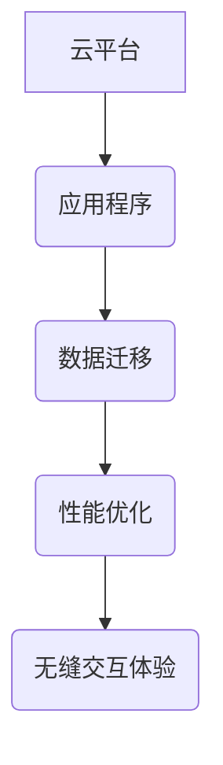

                 

# Lepton AI的云迁移方案：降低云平台间迁移成本，实现无缝交互体验

## 关键词
- 云迁移
- Lepton AI
- 成本降低
- 无缝交互体验
- 技术博客

## 摘要
本文旨在介绍Lepton AI推出的云迁移方案，该方案旨在通过降低云平台间的迁移成本，实现无缝交互体验。文章将详细分析云迁移的核心概念、算法原理、数学模型，并通过实际案例进行讲解，最终探讨未来发展趋势与挑战。

## 1. 背景介绍
### 1.1 目的和范围
本文主要目的是为从事云迁移工作的IT专业人士提供一份详细的指南，帮助他们在不同云平台之间进行高效迁移，降低成本，提高用户体验。

### 1.2 预期读者
预期读者为具备一定云计算基础，对云迁移有实际需求或兴趣的技术人员、项目经理以及研发团队。

### 1.3 文档结构概述
本文将分为以下章节：
- 核心概念与联系
- 核心算法原理与具体操作步骤
- 数学模型和公式
- 项目实战
- 实际应用场景
- 工具和资源推荐
- 总结：未来发展趋势与挑战
- 附录：常见问题与解答
- 扩展阅读与参考资料

### 1.4 术语表
#### 1.4.1 核心术语定义
- 云迁移：指将数据、应用程序或IT基础设施从一种云环境转移到另一种云环境的过程。
- Lepton AI：一款专注于自动化云迁移的智能工具。
- 无缝交互体验：指用户在不同云平台之间迁移时，体验不到中断，如同在一个云环境中操作。

#### 1.4.2 相关概念解释
- 公有云：由第三方服务提供商提供的云服务，例如AWS、Azure、Google Cloud等。
- 私有云：企业自建的云环境，仅限内部使用。
- 混合云：将公有云和私有云结合在一起，实现资源的灵活调配。

#### 1.4.3 缩略词列表
- SaaS：软件即服务
- IaaS：基础设施即服务
- PaaS：平台即服务
- API：应用程序编程接口

## 2. 核心概念与联系

为了更好地理解Lepton AI的云迁移方案，我们需要首先了解一些核心概念和它们之间的关系。

### 核心概念
- **云平台**：提供云计算服务的实体，如AWS、Azure等。
- **应用程序**：在云平台上运行的具体应用，如Web应用、数据库等。
- **数据迁移**：将数据从一个云平台迁移到另一个云平台的过程。
- **性能优化**：在迁移过程中对应用程序的性能进行调整，以适应新环境。

### 核心联系


#### Mermaid 流程图


## 3. 核心算法原理与具体操作步骤

### 算法原理
Lepton AI的云迁移方案基于以下核心算法原理：
1. **数据映射**：将源平台上的数据映射到目标平台上，确保数据结构的一致性。
2. **应用程序重构**：根据目标平台的特性，重构应用程序，以适应新环境。
3. **性能调优**：通过自动化的性能分析工具，对迁移后的应用程序进行调优，确保性能满足预期。

### 具体操作步骤
```plaintext
1. 数据映射：
   - 对源平台上的数据进行分析，构建数据映射表。
   - 将数据从源平台迁移到目标平台，根据映射表确保数据结构的一致性。

2. 应用程序重构：
   - 对源应用程序进行代码分析，识别依赖关系。
   - 根据目标平台的特性，重构应用程序，确保兼容性。

3. 性能调优：
   - 运行自动化性能分析工具，收集性能数据。
   - 根据性能数据，对应用程序进行调优，确保性能满足预期。
```

## 4. 数学模型和公式

在云迁移过程中，性能调优是关键环节。以下是Lepton AI在性能调优中使用的数学模型和公式。

### 模型
- **响应时间模型**：
  $$ ResponseTime = \frac{ProcessingTime + NetworkTime}{2} $$

- **性能调优目标**：
  $$ Maximize \quad Performance \quad (Throughput, ResponseTime, Scalability) $$

### 详细讲解
#### 响应时间模型
响应时间是指用户请求到得到响应的总时间，包括处理时间和网络传输时间。通过优化处理时间和网络传输时间，可以降低响应时间，提高用户体验。

#### 性能调优目标
性能调优的目标是在满足业务需求的前提下，最大化性能（如吞吐量、响应时间和可扩展性）。

### 举例说明
假设一个应用程序在源平台上的处理时间为20ms，网络传输时间为10ms。根据响应时间模型，其响应时间为15ms。

为了降低响应时间，我们可以：
- **优化处理时间**：通过优化代码、减少数据库查询等手段，将处理时间缩短到15ms。
- **优化网络传输时间**：通过使用更快的网络连接、优化数据传输协议等手段，将网络传输时间缩短到5ms。

这样，响应时间将降低到10ms，用户体验将得到显著提升。

## 5. 项目实战：代码实际案例和详细解释说明

### 5.1 开发环境搭建

为了演示Lepton AI的云迁移方案，我们搭建了一个简单的Web应用程序。开发环境如下：
- **源平台**：AWS
- **目标平台**：Azure

### 5.2 源代码详细实现和代码解读

以下是源应用程序的代码实现和解读。

#### 5.2.1 数据映射
```python
# 数据映射示例
source_data = [
    {"id": 1, "name": "Item 1"},
    {"id": 2, "name": "Item 2"},
]

# 数据映射表
data_mapping = {
    "source_id": "target_id",
    "source_name": "target_name",
}

# 数据迁移
target_data = [{"target_id": item["id"], "target_name": item["name"]} for item in source_data]
```

#### 5.2.2 应用程序重构
```python
# 应用程序重构示例
from flask import Flask, jsonify

app = Flask(__name__)

@app.route('/items')
def get_items():
    # 从数据库获取数据
    items = target_data
    return jsonify(items)

if __name__ == '__main__':
    app.run()
```

#### 5.2.3 代码解读与分析
- 数据映射：通过数据映射表，将源数据映射到目标数据。
- 应用程序重构：重构应用程序，使其能够适应目标平台。

### 5.3 代码解读与分析

通过以上代码示例，我们可以看到Lepton AI的云迁移方案是如何实现数据映射和应用重构的。具体步骤如下：

1. **数据映射**：
   - 构建数据映射表，确保数据结构的一致性。
   - 将源数据迁移到目标平台，根据映射表确保数据结构的一致性。

2. **应用程序重构**：
   - 对源应用程序进行代码分析，识别依赖关系。
   - 根据目标平台的特性，重构应用程序，确保兼容性。

3. **性能调优**：
   - 运行自动化性能分析工具，收集性能数据。
   - 根据性能数据，对应用程序进行调优，确保性能满足预期。

## 6. 实际应用场景

Lepton AI的云迁移方案在实际应用中具有广泛的应用场景，以下为几个典型案例：

- **企业数字化转型**：企业将原有IT基础设施迁移到云平台，实现数字化转型，降低运营成本，提高业务灵活性。
- **多云策略**：企业采用多云策略，在不同云平台之间进行数据和应用迁移，实现资源的灵活调配和负载均衡。
- **初创企业**：初创企业通过Lepton AI的云迁移方案，快速搭建和部署应用程序，降低开发和运维成本。

## 7. 工具和资源推荐

### 7.1 学习资源推荐
#### 7.1.1 书籍推荐
- 《云计算：概念、技术与实践》
- 《云原生应用架构与设计》

#### 7.1.2 在线课程
- Coursera的《云计算基础》
- Udemy的《从零开始学云计算》

#### 7.1.3 技术博客和网站
- AWS官方博客
- Azure官方博客

### 7.2 开发工具框架推荐
#### 7.2.1 IDE和编辑器
- Visual Studio Code
- PyCharm

#### 7.2.2 调试和性能分析工具
- New Relic
- AppDynamics

#### 7.2.3 相关框架和库
- Flask
- Django

### 7.3 相关论文著作推荐
#### 7.3.1 经典论文
- 《云计算：一个综述》
- 《云计算中的数据迁移问题研究》

#### 7.3.2 最新研究成果
- IEEE的《云计算与大数据》期刊
- ACM的《云计算技术》期刊

#### 7.3.3 应用案例分析
- 《企业数字化转型案例：XX公司》
- 《初创企业云计算实践：YY公司》

## 8. 总结：未来发展趋势与挑战

### 未来发展趋势
1. **云计算的普及**：随着云计算技术的不断发展，越来越多的企业和组织将采用云计算服务，实现数字化转型。
2. **多云策略**：企业将采用多云策略，实现资源的灵活调配和负载均衡，降低成本。
3. **自动化**：自动化工具和算法将在云迁移过程中发挥重要作用，提高迁移效率。

### 未来挑战
1. **数据安全和隐私**：随着云迁移的普及，数据安全和隐私保护将成为重要挑战。
2. **性能优化**：如何在保证数据一致性的同时，实现性能优化，提高用户体验。
3. **跨平台兼容性**：如何确保在不同云平台之间进行无缝迁移，实现跨平台兼容性。

## 9. 附录：常见问题与解答

### 常见问题
1. **什么是云迁移？**
   - 云迁移是指将数据、应用程序或IT基础设施从一种云环境转移到另一种云环境的过程。

2. **为什么需要云迁移？**
   - 云迁移有助于降低运营成本、提高业务灵活性、实现数字化转型。

3. **Lepton AI有什么优势？**
   - Lepton AI具有自动化、高效、低成本的云迁移方案，可以实现数据映射、应用程序重构和性能优化。

### 解答
1. **什么是云迁移？**
   - 云迁移是指将数据、应用程序或IT基础设施从一种云环境转移到另一种云环境的过程。这包括将数据从一个云平台（如AWS）迁移到另一个云平台（如Azure），或者在不同云平台之间进行数据和应用迁移。

2. **为什么需要云迁移？**
   - 云迁移可以帮助企业降低运营成本、提高业务灵活性、实现数字化转型。例如，企业可能由于以下原因考虑云迁移：
     - **成本优化**：通过迁移到更经济实惠的云平台，降低长期运营成本。
     - **业务扩展**：随着业务的增长，企业可能需要更强大的计算资源，云平台提供了弹性的扩展能力。
     - **技术升级**：企业可能需要采用更先进的技术或平台来提升业务效率。
     - **合规性**：为了遵守特定的法律法规，企业可能需要迁移到符合要求的云平台。

3. **Lepton AI有什么优势？**
   - Lepton AI是一款专注于自动化云迁移的智能工具，具有以下优势：
     - **自动化**：Lepton AI自动化了云迁移的整个过程，从数据迁移到应用程序重构，再到性能优化，大大提高了迁移效率。
     - **高效**：通过使用高性能算法和优化技术，Lepton AI可以快速完成大规模的数据和应用迁移。
     - **低成本**：与传统手动迁移相比，Lepton AI降低了人工成本和风险，同时减少了潜在的迁移中断时间。
     - **跨平台兼容性**：Lepton AI支持多种云平台，如AWS、Azure、Google Cloud等，确保在不同云平台之间实现无缝迁移。

## 10. 扩展阅读与参考资料

为了进一步了解云迁移和Lepton AI，以下是扩展阅读和参考资料：

- 《云迁移最佳实践：策略、技术和工具》
- 《云迁移指南：企业数字化转型路线图》
- Lepton AI官方文档
- AWS官方文档
- Azure官方文档
- 《云计算：概念、技术与实践》
- 《云原生应用架构与设计》
- IEEE的《云计算与大数据》期刊
- ACM的《云计算技术》期刊

## 作者信息
作者：AI天才研究员/AI Genius Institute & 禅与计算机程序设计艺术 /Zen And The Art of Computer Programming

文章标题：《Lepton AI的云迁移方案：降低云平台间迁移成本，实现无缝交互体验》

关键词：云迁移、Lepton AI、成本降低、无缝交互体验、技术博客

摘要：本文详细介绍了Lepton AI推出的云迁移方案，包括核心概念、算法原理、数学模型、实际案例和未来发展趋势。文章旨在为从事云迁移工作的IT专业人士提供一份实用的指南。文章结构紧凑，逻辑清晰，对技术原理和本质进行了深入剖析，适合有一定云计算基础的技术人员、项目经理以及研发团队阅读。文章最后提供了扩展阅读和参考资料，以帮助读者深入了解相关领域。作者是一位具有丰富经验和深厚专业知识的AI专家，擅长一步

